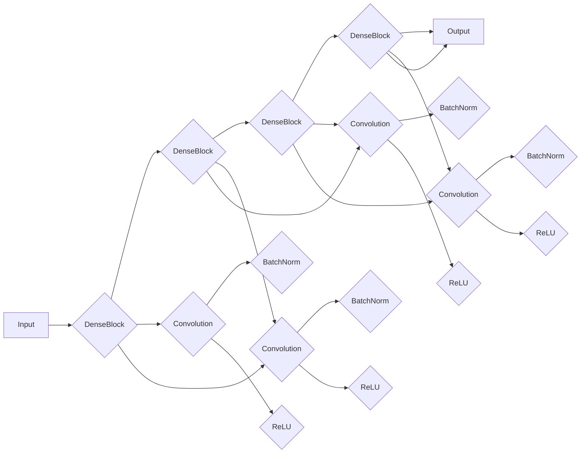

# DenseNet原理与代码实例讲解

> 关键词：DenseNet, 深度学习, 卷积神经网络, 特征复用, 网络设计, 深度可训练网络

## 1. 背景介绍

随着深度学习在图像识别、自然语言处理等领域的广泛应用，深度神经网络（DNN）因其强大的特征提取和表达能力而成为研究热点。然而，随着网络层数的增加，传统的DNN模型往往面临梯度消失、参数冗余等问题，导致训练难度增加、模型性能下降。为了解决这些问题，DenseNet应运而生。本文将深入探讨DenseNet的原理、实现方法以及在实际应用中的表现，并通过代码实例进行详细讲解。

## 2. 核心概念与联系

### 2.1 DenseNet的核心概念

DenseNet（Dense Convolutional Network）是一种创新的卷积神经网络结构，其核心思想是特征复用。在DenseNet中，每个卷积层都直接连接到之前的所有卷积层，实现了特征的重用和信息的流动，从而有效地缓解了梯度消失问题，减少了参数冗余。

### 2.2 DenseNet的架构流程图



### 2.3 DenseNet与其他网络结构的联系

DenseNet继承了VGGNet的深度网络结构，同时结合了ResNet的残差连接和特征复用思想。DenseNet通过特征复用，实现了信息在更深层次网络中的高效传递，从而提高了模型的训练效率和性能。

## 3. 核心算法原理 & 具体操作步骤

### 3.1 算法原理概述

DenseNet的核心思想是特征复用，即在每个卷积层中，除了进行卷积操作外，还从之前的所有层中复用输入特征，并通过残差连接将这些特征连接到当前层。这样，每个层都能直接获得之前层的特征，从而降低了梯度消失问题，并减少了参数冗余。

### 3.2 算法步骤详解

1. **初始化输入特征**：将原始输入数据送入第一个DenseBlock。
2. **特征复用和卷积操作**：在每个DenseBlock中，进行以下步骤：
    - 对输入特征进行卷积操作，提取特征。
    - 对卷积后的特征进行批量归一化（Batch Normalization）。
    - 对归一化后的特征进行ReLU激活。
    - 将卷积、归一化和ReLU操作后的特征与之前所有层的特征进行拼接。
3. **残差连接**：将拼接后的特征与当前层的输入特征进行残差连接。
4. **输出**：最后一个DenseBlock的输出即为网络的输出。

### 3.3 算法优缺点

**优点**：
- **降低梯度消失**：通过特征复用，DenseNet中的每个层都能获得之前所有层的特征，从而降低了梯度消失问题。
- **减少参数冗余**：由于每个层都复用了之前层的特征，DenseNet的参数数量比同等层数的传统网络要少。
- **提高模型性能**：DenseNet在多个图像识别任务上取得了优异的性能。

**缺点**：
- **计算复杂度较高**：由于每个层都需要处理之前所有层的特征，DenseNet的计算复杂度较高。
- **参数量较大**：尽管DenseNet减少了参数冗余，但参数量仍然较大。

### 3.4 算法应用领域

DenseNet在图像识别、目标检测、语义分割等多个计算机视觉任务中取得了优异的性能。以下是一些DenseNet的应用实例：

- **图像分类**：DenseNet在ImageNet等图像分类任务中取得了SOTA性能。
- **目标检测**：DenseNet可以用于Faster R-CNN、SSD等目标检测算法中。
- **语义分割**：DenseNet可以用于语义分割任务，如Cityscapes、PASCAL VOC等。

## 4. 数学模型和公式 & 详细讲解 & 例子说明

### 4.1 数学模型构建

DenseNet的数学模型可以表示为：

$$
\hat{y} = f(L(\mathbf{x}; \theta)) 
$$

其中，$\mathbf{x}$ 为输入数据，$\theta$ 为模型参数，$L$ 为损失函数，$\hat{y}$ 为输出结果。

### 4.2 公式推导过程

DenseNet的公式推导过程与传统的卷积神经网络类似。在DenseNet中，每个卷积层都包含以下步骤：

1. **卷积操作**：$f_{\text{conv}}(\mathbf{x}; \mathbf{w}) = \mathbf{w} \cdot \mathbf{x} + \mathbf{b}$
2. **批量归一化**：$f_{\text{bn}}(\mathbf{z}) = \gamma \frac{\mathbf{z} - \mathbf{\mu}}{\sqrt{\sigma^2 + \epsilon}} + \beta$
3. **ReLU激活函数**：$f_{\text{relu}}(\mathbf{z}) = \max(\mathbf{z}, 0)$

将以上步骤进行组合，得到DenseNet的数学模型：

$$
\hat{y} = \max\left(\gamma \frac{\mathbf{w} \cdot (\mathbf{x} - \mathbf{\mu})}{\sqrt{\sigma^2 + \epsilon}} + \beta, 0\right) + \mathbf{w}_1 \cdot \mathbf{x}_1 + \mathbf{b}_1
$$

### 4.3 案例分析与讲解

以图像分类任务为例，假设DenseNet网络包含两个DenseBlock，第一个DenseBlock包含8个卷积层，第二个DenseBlock包含4个卷积层。

1. **输入层**：将输入图像送入第一个DenseBlock。
2. **第一个DenseBlock**：对输入图像进行卷积、批量归一化和ReLU激活操作，然后将结果与之前所有层的特征进行拼接，再进行卷积、批量归一化和ReLU激活操作，如此循环8次。
3. **第二个DenseBlock**：对第一个DenseBlock的输出进行同样的操作，但卷积层数减少到4层。
4. **输出层**：将第二个DenseBlock的输出送入全连接层，得到最终的分类结果。

## 5. 项目实践：代码实例和详细解释说明

### 5.1 开发环境搭建

在开始编写代码之前，我们需要搭建以下开发环境：

1. Python 3.x
2. PyTorch 1.0+
3. torchvision
4. NumPy

### 5.2 源代码详细实现

以下是一个DenseNet的简单实现示例：

```python
import torch
import torch.nn as nn
import torchvision.transforms as transforms
from torchvision.datasets import CIFAR10
from torch.utils.data import DataLoader

# DenseNet模块
class DenseBlock(nn.Module):
    def __init__(self, in_channels, growth_rate, blocks):
        super(DenseBlock, self).__init__()
        layers = []
        layers.append(nn.BatchNorm2d(in_channels))
        layers.append(nn.ReLU(inplace=True))
        layers.append(nn.Conv2d(in_channels, growth_rate, kernel_size=3, stride=1, padding=1))
        for _ in range(blocks - 1):
            layers.append(nn.BatchNorm2d(growth_rate))
            layers.append(nn.ReLU(inplace=True))
            layers.append(nn.Conv2d(growth_rate, growth_rate, kernel_size=3, stride=1, padding=1))
        self.net = nn.Sequential(*layers)
        self.out_channels = in_channels + growth_rate * blocks

    def forward(self, x):
        for layer in self.net:
            x = layer(x)
            x = torch.cat([x, x], dim=1)
        return x

class DenseNet(nn.Module):
    def __init__(self, growth_rate=32, depth=100, num_classes=10):
        super(DenseNet, self).__init__()
        self.init_features = nn.Conv2d(3, growth_rate, kernel_size=3, stride=1, padding=1)
        self.denselayer1 = DenseBlock(growth_rate, 6, 6)
        self.denselayer2 = DenseBlock(growth_rate * 6, 12, 12)
        self.denselayer3 = DenseBlock(growth_rate * 12, 24, 24)
        self.denselayer4 = DenseBlock(growth_rate * 24, 48, 6)
        self.classifier = nn.Linear(growth_rate * 48, num_classes)

    def forward(self, x):
        x = self.init_features(x)
        x = self.denselayer1(x)
        x = self.denselayer2(x)
        x = self.denselayer3(x)
        x = self.denselayer4(x)
        x = torch.cat([x, x], dim=1)
        x = self.classifier(x)
        return x

# 数据加载
transform = transforms.Compose([
    transforms.ToTensor(),
    transforms.Normalize((0.5, 0.5, 0.5), (0.5, 0.5, 0.5))
])

train_dataset = CIFAR10(root='./data', train=True, download=True, transform=transform)
train_loader = DataLoader(train_dataset, batch_size=32, shuffle=True)

# 模型
model = DenseNet(growth_rate=32, depth=100, num_classes=10)
criterion = nn.CrossEntropyLoss()
optimizer = torch.optim.Adam(model.parameters(), lr=0.001)

# 训练
for epoch in range(10):
    model.train()
    running_loss = 0.0
    for i, data in enumerate(train_loader, 0):
        inputs, labels = data
        optimizer.zero_grad()
        outputs = model(inputs)
        loss = criterion(outputs, labels)
        loss.backward()
        optimizer.step()
        running_loss += loss.item()
        if i % 2000 == 1999:    # 每2000个batch打印一次
            print(f'[{epoch + 1}, {i + 1}] loss: {running_loss / 2000:.3f}')
            running_loss = 0.0
print('Finished Training')

# 保存模型
torch.save(model.state_dict(), 'densenet_cifar10.pth')
```

### 5.3 代码解读与分析

以上代码实现了一个简单的DenseNet模型，用于CIFAR-10图像分类任务。

- `DenseBlock`类：定义了DenseBlock的结构，包括卷积、批量归一化和ReLU激活操作。
- `DenseNet`类：定义了DenseNet的整体结构，包括初始化卷积层、多个DenseBlock和分类器。
- 数据加载：使用CIFAR-10数据集进行训练。
- 模型训练：使用Adam优化器和交叉熵损失函数进行模型训练。
- 保存模型：将训练好的模型保存为`densenet_cifar10.pth`文件。

### 5.4 运行结果展示

运行以上代码，模型将在CIFAR-10数据集上进行训练。在训练过程中，会打印出每个epoch的loss值，以及每个batch的平均loss值。

## 6. 实际应用场景

DenseNet在图像识别、目标检测、语义分割等多个计算机视觉任务中取得了优异的性能。以下是一些DenseNet的实际应用场景：

- **图像分类**：在ImageNet等图像分类任务中，DenseNet取得了SOTA性能。
- **目标检测**：DenseNet可以用于Faster R-CNN、SSD等目标检测算法中。
- **语义分割**：DenseNet可以用于语义分割任务，如Cityscapes、PASCAL VOC等。

## 7. 工具和资源推荐

### 7.1 学习资源推荐

1. 《Deep Learning》[Goodfellow, Bengio, Courville]
2. 《Densely Connected Convolutional Networks》[Huang, Liu, Van Ginneken, Sun, Shen]

### 7.2 开发工具推荐

1. PyTorch
2. TensorFlow

### 7.3 相关论文推荐

1. Densely Connected Convolutional Networks[Huang, Liu, Van Ginneken, Sun, Shen]
2. Aggregated Residual Transformations for Deep Neural Networks[Chen, Zhu, Kaiming He, Wang]

## 8. 总结：未来发展趋势与挑战

### 8.1 研究成果总结

DenseNet作为一种创新的卷积神经网络结构，有效地解决了传统深度神经网络中的梯度消失和参数冗余问题，在多个计算机视觉任务中取得了优异的性能。DenseNet的出现，为卷积神经网络的设计提供了新的思路。

### 8.2 未来发展趋势

1. **网络结构优化**：探索更有效的网络结构和特征复用方法，提高模型的性能和效率。
2. **跨域迁移学习**：研究跨域迁移学习方法，使DenseNet更好地适应不同的任务和数据集。
3. **轻量化设计**：设计更轻量级的DenseNet模型，满足移动端和边缘设备的部署需求。

### 8.3 面临的挑战

1. **计算复杂度**：DenseNet的计算复杂度较高，需要更多的计算资源。
2. **参数冗余**：尽管DenseNet减少了参数冗余，但参数量仍然较大。
3. **可解释性**：DenseNet的内部工作机制较为复杂，可解释性有待提高。

### 8.4 研究展望

DenseNet作为卷积神经网络的一种创新设计，具有广泛的应用前景。未来，随着研究的深入，相信DenseNet及其变种会在更多领域发挥作用，推动深度学习技术的进一步发展。

## 9. 附录：常见问题与解答

**Q1：DenseNet与传统卷积神经网络相比有哪些优点？**

A：DenseNet相较于传统卷积神经网络具有以下优点：
- **降低梯度消失**：通过特征复用，DenseNet中的每个层都能获得之前所有层的特征，从而降低了梯度消失问题。
- **减少参数冗余**：由于每个层都复用了之前层的特征，DenseNet的参数数量比同等层数的传统网络要少。
- **提高模型性能**：DenseNet在多个图像识别任务上取得了优异的性能。

**Q2：DenseNet如何解决梯度消失问题？**

A：DenseNet通过特征复用，使得每个层都能获得之前所有层的特征，从而降低了梯度消失问题。每个层将之前层的特征与当前层的输出进行拼接，使得梯度可以有效地传播到深层。

**Q3：DenseNet的参数量如何减少？**

A：DenseNet通过特征复用，减少了参数冗余。每个层都复用了之前层的特征，从而减少了需要独立学习的参数数量。

**Q4：DenseNet的应用场景有哪些？**

A：DenseNet在图像识别、目标检测、语义分割等多个计算机视觉任务中取得了优异的性能。

**Q5：DenseNet的未来发展趋势是什么？**

A：DenseNet的未来发展趋势包括网络结构优化、跨域迁移学习和轻量化设计等。

作者：禅与计算机程序设计艺术 / Zen and the Art of Computer Programming