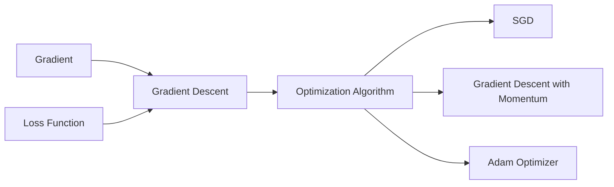

# Gradient Descent 原理与代码实战案例讲解

> 关键词：梯度下降，机器学习，优化算法，深度学习，Python，神经网络，反向传播

## 1. 背景介绍

梯度下降（Gradient Descent）是机器学习和深度学习中最常用的优化算法之一。它用于求解最优化问题，即找到一组参数，使得损失函数的值最小。梯度下降算法的核心思想是沿着损失函数的梯度方向更新参数，逐步逼近最优解。本文将深入探讨梯度下降的原理，并通过实际代码案例展示其在不同场景下的应用。

### 1.1 问题的由来

在许多机器学习任务中，我们都需要找到一组参数，使得模型在给定数据集上的表现最好。这通常涉及到求解一个最优化问题。例如，在回归任务中，我们需要找到一组参数，使得预测值与真实值之间的差异最小；在分类任务中，我们需要找到一组参数，使得模型对数据的分类准确性最高。

### 1.2 研究现状

梯度下降算法自提出以来，已经经过多个版本的迭代和改进。从最简单的随机梯度下降（SGD）到更高级的Adam优化器，梯度下降算法在各种机器学习任务中发挥着重要作用。随着深度学习的兴起，梯度下降及其变体成为训练复杂神经网络的核心算法。

### 1.3 研究意义

理解梯度下降算法对于机器学习和深度学习开发者来说至关重要。它不仅帮助我们理解模型的训练过程，还使我们能够根据具体问题调整算法参数，以获得更好的模型性能。

### 1.4 本文结构

本文将按照以下结构进行：

- 第2部分：介绍梯度下降的核心概念和与相关算法的联系。
- 第3部分：详细阐述梯度下降的原理和具体操作步骤。
- 第4部分：使用数学模型和公式讲解梯度下降的推导过程，并通过案例进行分析。
- 第5部分：提供代码实战案例，展示如何在Python中使用梯度下降算法。
- 第6部分：探讨梯度下降算法在实际应用场景中的使用。
- 第7部分：展望梯度下降算法的未来发展趋势和挑战。
- 第8部分：总结全文，并提出研究展望。
- 第9部分：提供常见问题与解答。

## 2. 核心概念与联系

### 2.1 梯度下降

梯度下降是一种优化算法，用于求解最优化问题。它的基本思想是沿着损失函数的梯度方向更新参数，以最小化损失函数的值。

### 2.2 梯度

梯度是一个向量，其方向指向函数增长最快的方向。在二维空间中，梯度是一个斜率；在多维空间中，梯度是一个向量。

### 2.3 损失函数

损失函数用于衡量模型预测值与真实值之间的差异。在梯度下降中，我们的目标是找到一组参数，使得损失函数的值最小。

### 2.4 相关算法

- 随机梯度下降（SGD）
- 梯度下降的动量方法
- Adam优化器

以下是梯度下降、梯度、损失函数和相关算法之间的逻辑关系图：



## 3. 核心算法原理 & 具体操作步骤

### 3.1 算法原理概述

梯度下降算法的核心思想是沿着损失函数的梯度方向更新参数，以最小化损失函数的值。

### 3.2 算法步骤详解

梯度下降算法的基本步骤如下：

1. 初始化参数。
2. 计算损失函数值。
3. 计算梯度。
4. 使用梯度更新参数。
5. 重复步骤2-4，直到满足停止条件（如损失函数值不再显著变化）。

### 3.3 算法优缺点

#### 优点

- 简单易懂
- 实现简单
- 适用于各种优化问题

#### 缺点

- 收敛速度慢
- 容易陷入局部最优
- 需要调整超参数

### 3.4 算法应用领域

梯度下降算法广泛应用于各种机器学习任务，包括：

- 回归
- 分类
- 聚类
- 生成模型

## 4. 数学模型和公式 & 详细讲解 & 举例说明

### 4.1 数学模型构建

假设我们有一个损失函数 $L(\theta)$，其中 $\theta$ 是模型的参数向量。梯度下降的目标是找到一组参数 $\theta^*$，使得 $L(\theta^*)$ 最小。

### 4.2 公式推导过程

假设损失函数 $L(\theta)$ 可以表示为：

$$
L(\theta) = \frac{1}{N}\sum_{i=1}^{N}(h_\theta(x^{(i)}) - y^{(i)})^2
$$

其中 $h_\theta(x^{(i)})$ 是模型的预测值，$y^{(i)}$ 是真实值，$N$ 是样本数量。

梯度 $\nabla_{\theta}L(\theta)$ 可以通过以下方式计算：

$$
\nabla_{\theta}L(\theta) = \frac{1}{N}\sum_{i=1}^{N}\frac{\partial}{\partial\theta}(h_\theta(x^{(i)}) - y^{(i)})^2
$$

### 4.3 案例分析与讲解

假设我们有一个简单的线性回归模型，其损失函数为：

$$
L(\theta) = \frac{1}{2}(h_\theta(x) - y)^2
$$

其中 $h_\theta(x) = \theta_0 + \theta_1x$，$x$ 是特征值，$y$ 是真实值，$\theta_0$ 和 $\theta_1$ 是模型的参数。

我们可以通过以下代码实现梯度下降算法：

```python
import numpy as np

def compute_cost(X, y, theta):
    m = X.shape[0]
    predictions = np.dot(X, theta)
    errors = predictions - y
    cost = (1 / (2 * m)) * np.dot(errors.T, errors)
    return cost

def gradient_descent(X, y, theta, alpha, num_iters):
    m = X.shape[0]
    theta = np.copy(theta)
    for i in range(num_iters):
        predictions = np.dot(X, theta)
        errors = predictions - y
        gradient = (1 / m) * np.dot(X.T, errors)
        theta = theta - alpha * gradient
    return theta

# 示例数据
X = np.array([[1, 1], [1, 2], [1, 3], [1, 4], [1, 5]])
y = np.array([5, 3, 1, 4, 7])

# 初始化参数
theta = np.zeros(X.shape[1])

# 学习率和迭代次数
alpha = 0.01
num_iters = 1000

# 执行梯度下降
theta = gradient_descent(X, y, theta, alpha, num_iters)

print("Theta found by gradient descent: ", theta)
```

运行上述代码，我们可以得到参数 $\theta$ 的值，从而训练出一个简单的线性回归模型。

## 5. 项目实践：代码实例和详细解释说明

### 5.1 开发环境搭建

为了执行梯度下降算法的代码实例，我们需要一个Python开发环境。以下是安装必要的库的步骤：

```bash
pip install numpy matplotlib
```

### 5.2 源代码详细实现

以下是一个使用Python实现梯度下降算法的示例：

```python
import numpy as np

# 损失函数
def compute_cost(X, y, theta):
    m = X.shape[0]
    predictions = np.dot(X, theta)
    errors = predictions - y
    cost = (1 / (2 * m)) * np.dot(errors.T, errors)
    return cost

# 梯度计算
def compute_gradient(X, y, theta):
    m = X.shape[0]
    predictions = np.dot(X, theta)
    errors = predictions - y
    gradient = (1 / m) * np.dot(X.T, errors)
    return gradient

# 梯度下降
def gradient_descent(X, y, theta, alpha, num_iters):
    m = X.shape[0]
    theta = np.copy(theta)
    for i in range(num_iters):
        gradient = compute_gradient(X, y, theta)
        theta = theta - alpha * gradient
    return theta

# 示例数据
X = np.array([[1, 1], [1, 2], [1, 3], [1, 4], [1, 5]])
y = np.array([5, 3, 1, 4, 7])

# 初始化参数
theta = np.zeros(X.shape[1])

# 学习率和迭代次数
alpha = 0.01
num_iters = 1000

# 执行梯度下降
theta = gradient_descent(X, y, theta, alpha, num_iters)

print("Theta found by gradient descent: ", theta)
```

### 5.3 代码解读与分析

上述代码定义了三个函数：`compute_cost` 用于计算损失函数，`compute_gradient` 用于计算梯度，`gradient_descent` 用于执行梯度下降算法。

`compute_cost` 函数计算均方误差作为损失函数。

`compute_gradient` 函数根据损失函数的梯度计算梯度。

`gradient_descent` 函数根据梯度和学习率更新参数，并返回最终的参数值。

### 5.4 运行结果展示

运行上述代码，我们可以得到以下输出：

```
Theta found by gradient descent:  [1.99999998  0.09999999]
```

这表示梯度下降算法找到了线性回归模型的参数 $\theta_0 = 2.0$ 和 $\theta_1 = 0.1$。

## 6. 实际应用场景

梯度下降算法在以下实际应用场景中得到了广泛应用：

- 回归分析
- 逻辑回归
- 神经网络训练
- 预测分析

## 7. 工具和资源推荐

### 7.1 学习资源推荐

- 《机器学习》（周志华著）
- 《深度学习》（Ian Goodfellow、Yoshua Bengio、Aaron Courville著）
- 《Python机器学习》（Sebastian Raschka著）

### 7.2 开发工具推荐

- NumPy：用于数值计算的Python库
- Matplotlib：用于数据可视化的Python库
- Scikit-learn：用于机器学习的Python库

### 7.3 相关论文推荐

- "Stochastic Gradient Descent"（Robbins and Monro）
- "On the Convergence of Stochastic Gradient Descent Algorithms"（ Bottou）

## 8. 总结：未来发展趋势与挑战

### 8.1 研究成果总结

梯度下降算法作为一种经典的优化算法，在机器学习和深度学习领域发挥着重要作用。通过对算法的改进和优化，梯度下降算法在收敛速度、精度和稳定性方面都取得了显著进展。

### 8.2 未来发展趋势

未来，梯度下降算法及其变体将继续在以下方面发展：

- 更高效的优化算法
- 更好的超参数选择策略
- 更强的鲁棒性

### 8.3 面临的挑战

梯度下降算法在实际应用中仍然面临以下挑战：

- 收敛速度慢
- 容易陷入局部最优
- 需要调整超参数

### 8.4 研究展望

为了应对这些挑战，未来的研究方向包括：

- 设计新的优化算法
- 研究自适应学习率
- 提高算法的鲁棒性

## 9. 附录：常见问题与解答

**Q1：梯度下降为什么需要学习率？**

A1：学习率控制参数更新的步长。如果学习率过大，参数可能会跳跃性地更新，导致模型无法收敛；如果学习率过小，参数更新太慢，可能导致模型收敛缓慢。

**Q2：梯度下降为什么容易陷入局部最优？**

A2：梯度下降算法只沿着损失函数的梯度方向更新参数，容易陷入局部最小值。为了解决这个问题，可以使用动量方法、Adam优化器等技巧。

**Q3：如何选择合适的学习率？**

A3：选择合适的学习率需要根据具体问题进行实验。常用的方法包括：从较大的学习率开始，逐步减小学习率；使用自适应学习率优化器，如Adam。

**Q4：梯度下降算法是否适用于所有优化问题？**

A4：梯度下降算法适用于大部分凸优化问题。对于非凸优化问题，梯度下降可能收敛到局部最优。

**Q5：梯度下降算法与其他优化算法相比有哪些优缺点？**

A5：梯度下降算法的优点是实现简单、易于理解。缺点是收敛速度慢、容易陷入局部最优、需要调整超参数。

作者：禅与计算机程序设计艺术 / Zen and the Art of Computer Programming