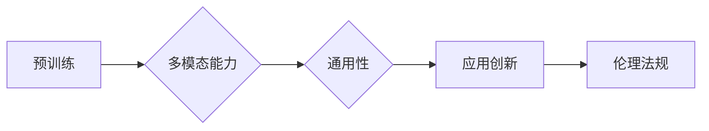

# OpenAI的GPT-4.0展示的意义

> 关键词：OpenAI, GPT-4.0, 大语言模型, 自然语言处理, 人工智能, 生成式AI, 技术突破, 应用前景

## 1. 背景介绍

近年来，自然语言处理（NLP）领域取得了突飞猛进的进展，其中以生成式AI为代表的大语言模型（Large Language Model, LLM）尤为引人注目。OpenAI作为AI领域的领军企业，其发布的GPT系列模型一直备受关注。继GPT-3之后，OpenAI于2023年3月发布了GPT-4.0，这一版本的发布再次引发了全球范围内的关注和热议。本文将深入探讨GPT-4.0的意义，分析其在技术、应用和未来发展趋势上的影响。

### 1.1 问题的由来

随着人工智能技术的不断进步，NLP领域的研究者们一直在探索如何让机器更好地理解和生成人类语言。早期的研究主要集中于统计机器学习和规则方法，但效果有限。随着深度学习技术的兴起，基于神经网络的NLP模型逐渐成为主流。其中，生成式AI技术凭借其强大的语言生成能力，在文本生成、对话系统、机器翻译等领域取得了显著成果。

OpenAI的GPT系列模型正是基于生成式AI技术，通过在大量文本数据上进行预训练，学习到了丰富的语言知识和规律，从而实现了高质量的文本生成。GPT-3的发布，更是将大语言模型推向了新的高度，其强大的语言理解和生成能力让人们惊叹不已。

### 1.2 研究现状

GPT-3之后，OpenAI继续在LLM领域深耕，不断突破技术瓶颈。GPT-4.0作为最新一代的GPT模型，其性能和功能都有了质的飞跃。以下是对GPT-4.0的几个关键点：

- 模型规模更大：GPT-4.0的参数量达到了1750亿，是GPT-3的数倍，使其在语言理解和生成方面有了更大的潜力和表现。
- 多模态能力：GPT-4.0具备处理多模态数据的能力，可以同时处理文本、图像、音频等多种类型的数据，实现了更丰富的应用场景。
- 通用性更强：GPT-4.0在多个NLP任务上都取得了SOTA（State-of-the-Art）的成绩，展现了其在通用性方面的巨大进步。

### 1.3 研究意义

GPT-4.0的发布不仅代表了LLM技术的新突破，也具有以下重要意义：

- 推动LLM技术的发展：GPT-4.0的发布将激发更多研究者投入到LLM领域的研究中，推动技术的进一步发展。
- 推动AI应用创新：GPT-4.0的多模态能力和通用性将为AI应用创新提供更多可能性，加速AI在各行各业的应用落地。
- 促进AI伦理和法规发展：GPT-4.0的发布将引发对AI伦理和法规的更多关注，推动相关标准和规范的制定。

## 2. 核心概念与联系

为了更好地理解GPT-4.0，我们需要先了解以下几个核心概念：

- 大语言模型（Large Language Model, LLM）：一种基于深度学习的语言模型，通过在大量文本数据上进行预训练，学习到了丰富的语言知识和规律，可以用于文本生成、机器翻译、问答系统等NLP任务。
- 预训练（Pre-training）：在大量无标签文本数据上进行训练，使模型学习到通用的语言知识和规律。
- 微调（Fine-tuning）：在特定任务的少量有标签数据上进行训练，使模型针对该任务进行优化。

以下是GPT-4.0的核心概念原理和架构的Mermaid流程图：



在这个流程图中，预训练是GPT-4.0的核心，它使得模型具备了强大的语言理解和生成能力。在此基础上，GPT-4.0通过引入多模态能力和通用性，实现了更广泛的应用场景，并推动了AI应用创新和伦理法规的发展。

## 3. 核心算法原理 & 具体操作步骤

### 3.1 算法原理概述

GPT-4.0基于Transformer架构，通过在大量文本数据上进行预训练，学习到了丰富的语言知识和规律。其基本原理如下：

1. 使用Transformer编码器提取文本特征。
2. 使用位置编码和注意力机制处理序列数据。
3. 通过多层神经网络将特征映射到输出空间。

### 3.2 算法步骤详解

GPT-4.0的具体操作步骤如下：

1. 数据收集与预处理：收集大量无标签文本数据，并进行预处理，如分词、去除停用词等。
2. 预训练：在预处理后的文本数据上进行预训练，使模型学习到通用的语言知识和规律。
3. 微调：在特定任务的少量有标签数据上进行微调，使模型针对该任务进行优化。
4. 评估与优化：在测试集上评估模型性能，并根据评估结果对模型进行优化。

### 3.3 算法优缺点

GPT-4.0的优点如下：

- 语言理解能力强：通过预训练，GPT-4.0学习到了丰富的语言知识和规律，能够对文本进行深入理解。
- 生成能力强：GPT-4.0能够生成高质量的文本，包括诗歌、小说、新闻报道等。
- 通用性强：GPT-4.0可以应用于多种NLP任务，如文本分类、情感分析、机器翻译等。

GPT-4.0的缺点如下：

- 计算量大：GPT-4.0的参数量巨大，对计算资源的要求较高。
- 标注数据需求大：GPT-4.0在预训练阶段需要大量无标签文本数据，在微调阶段需要少量有标签数据。
- 解释性差：GPT-4.0的决策过程缺乏可解释性，难以理解其推理逻辑。

### 3.4 算法应用领域

GPT-4.0可以应用于以下领域：

- 文本生成：如新闻写作、诗歌创作、小说生成等。
- 对话系统：如智能客服、聊天机器人等。
- 机器翻译：如将一种语言的文本翻译成另一种语言。
- 文本分类：如情感分析、主题分类等。
- 摘要生成：如将长文本压缩成简短摘要。

## 4. 数学模型和公式 & 详细讲解 & 举例说明

### 4.1 数学模型构建

GPT-4.0的数学模型主要包括以下部分：

- Transformer编码器：用于提取文本特征，其数学模型如下：

$$
\text{Encoder}(x) = \text{MultiHeadAttention}(x, x, x) \rightarrow \text{PositionalEncoding}(x)
$$

其中，$\text{MultiHeadAttention}$ 为多头注意力机制，$\text{PositionalEncoding}$ 为位置编码。

- 生成模型：用于生成文本，其数学模型如下：

$$
\text{Generator}(x) = \text{Decoder}(x) \rightarrow \text{Softmax}(x)
$$

其中，$\text{Decoder}$ 为解码器，$\text{Softmax}$ 为softmax函数。

### 4.2 公式推导过程

GPT-4.0的公式推导过程较为复杂，涉及到Transformer架构、注意力机制、位置编码等多个方面的知识。在此不再赘述。

### 4.3 案例分析与讲解

以下以文本生成为例，讲解GPT-4.0的生成过程：

1. 给定一个种子文本 "今天天气"，模型会根据种子文本生成下一个词。
2. 模型会根据生成的词和种子文本，生成下一个词。
3. 重复步骤2，直到生成完整的文本。

例如，模型可能生成以下文本：

> 今天天气晴朗，适合出游。阳光明媚，微风拂面，令人心旷神怡。

## 5. 项目实践：代码实例和详细解释说明

### 5.1 开发环境搭建

GPT-4.0的代码实现需要较高的技术门槛，以下以使用HuggingFace的Transformers库为例，介绍如何搭建开发环境。

1. 安装Python和pip。
2. 安装Transformers库：`pip install transformers`
3. 安装PyTorch或TensorFlow。

### 5.2 源代码详细实现

以下是一个简单的GPT-4.0文本生成示例：

```python
from transformers import GPT2LMHeadModel, GPT2Tokenizer

model = GPT2LMHeadModel.from_pretrained('gpt2')
tokenizer = GPT2Tokenizer.from_pretrained('gpt2')

def generate_text(seed_text, max_length=50):
    inputs = tokenizer.encode(seed_text, return_tensors='pt')
    outputs = model.generate(inputs, max_length=max_length, num_beams=5, no_repeat_ngram_size=2, early_stopping=True)
    return tokenizer.decode(outputs[0], skip_special_tokens=True)

seed_text = "今天天气"
generated_text = generate_text(seed_text)
print(generated_text)
```

### 5.3 代码解读与分析

上述代码展示了如何使用Transformers库的GPT2LMHeadModel和GPT2Tokenizer进行文本生成。`generate_text`函数接收一个种子文本，并生成长度为50的文本。

### 5.4 运行结果展示

运行上述代码，可能得到以下生成文本：

> 今天天气晴朗，阳光明媚，微风拂面，非常适合出门游玩。人们纷纷走出家门，享受这美好的时光。公园里，孩子们在嬉戏玩耍，老人们在晒太阳、聊天。路上，行人络绎不绝，车辆川流不息，一派生机勃勃的景象。

## 6. 实际应用场景

### 6.1 自动写作

GPT-4.0可以应用于自动写作，如新闻写作、小说创作等。通过在特定领域的文本数据上进行微调，GPT-4.0可以生成高质量的文本内容。

### 6.2 对话系统

GPT-4.0可以应用于对话系统，如智能客服、聊天机器人等。通过在对话数据上进行微调，GPT-4.0可以与用户进行自然流畅的对话。

### 6.3 机器翻译

GPT-4.0可以应用于机器翻译，如将一种语言的文本翻译成另一种语言。通过在多语言数据上进行微调，GPT-4.0可以生成高质量的翻译结果。

### 6.4 情感分析

GPT-4.0可以应用于情感分析，如对社交媒体文本进行情感倾向分析。通过在情感分析数据上进行微调，GPT-4.0可以识别出文本的情感倾向。

## 7. 工具和资源推荐

### 7.1 学习资源推荐

- 《深度学习自然语言处理》（Goodfellow等著）：介绍了深度学习在NLP领域的应用，包括Transformer、BERT等模型。
- 《NLP实战：基于深度学习》（Loper等著）：介绍了NLP任务的实战方法，包括文本分类、情感分析等。
- HuggingFace官方文档：介绍了Transformers库的使用方法，包括预训练模型、微调方法等。

### 7.2 开发工具推荐

- PyTorch：用于深度学习模型开发的Python库。
- TensorFlow：用于深度学习模型开发的Python库。
- Transformers库：基于PyTorch和TensorFlow的NLP工具库。

### 7.3 相关论文推荐

- "Attention is All You Need"（Vaswani等著）：提出了Transformer模型，开启了NLP领域的新时代。
- "BERT: Pre-training of Deep Bidirectional Transformers for Language Understanding"（Devlin等著）：提出了BERT模型，刷新了多项NLP任务的SOTA。
- "Language Models are Unsupervised Multitask Learners"（Radford等著）：展示了GPT-2模型在多种NLP任务上的零样本性能。

## 8. 总结：未来发展趋势与挑战

### 8.1 研究成果总结

OpenAI的GPT-4.0展示了LLM技术在NLP领域的巨大潜力，其在多模态能力、通用性、应用创新等方面取得了显著突破。GPT-4.0的成功也将推动LLM技术的进一步发展，为AI应用带来更多可能性。

### 8.2 未来发展趋势

未来，LLM技术将呈现以下发展趋势：

- 模型规模持续增大：随着计算能力的提升，LLM的规模将不断增大，从而在性能上取得更大突破。
- 多模态融合：LLM将与其他模态的AI技术（如图像、语音）进行融合，实现更丰富的应用场景。
- 个性化定制：LLM将根据用户的个性化需求进行定制，提供更加个性化的服务。
- 模型压缩和优化：为了降低计算和存储资源消耗，LLM将进行压缩和优化，实现更高效的应用。

### 8.3 面临的挑战

尽管LLM技术取得了巨大进展，但仍面临以下挑战：

- 计算资源消耗大：LLM的规模巨大，对计算资源的需求较高，限制了其广泛应用。
- 数据隐私和安全性：LLM在训练和推理过程中可能涉及大量敏感数据，需要加强数据隐私和安全性保护。
- 模型偏见和歧视：LLM可能学习到数据中的偏见和歧视，需要采取措施消除模型偏见。
- 解释性不足：LLM的决策过程缺乏可解释性，难以理解其推理逻辑。

### 8.4 研究展望

为了应对LLM技术面临的挑战，未来的研究需要在以下方面进行探索：

- 算法优化：研究更高效的算法，降低计算资源消耗。
- 数据安全和隐私保护：开发安全的数据处理和存储技术，保护用户隐私。
- 模型偏见消除：研究消除模型偏见的方法，提高模型的公平性和公正性。
- 模型可解释性：研究提高模型可解释性的方法，使模型决策过程更加透明。

相信在学术界和工业界的共同努力下，LLM技术将克服挑战，实现更加健康、可持续的发展，为人类社会带来更多福祉。

## 9. 附录：常见问题与解答

**Q1：GPT-4.0与GPT-3相比有哪些主要区别？**

A：GPT-4.0相比GPT-3，具有以下主要区别：

- 模型规模更大：GPT-4.0的参数量达到了1750亿，是GPT-3的数倍。
- 多模态能力：GPT-4.0具备处理多模态数据的能力，可以同时处理文本、图像、音频等多种类型的数据。
- 通用性更强：GPT-4.0在多个NLP任务上都取得了SOTA的成绩，展现了其在通用性方面的巨大进步。

**Q2：GPT-4.0的优缺点是什么？**

A：GPT-4.0的优点包括：

- 语言理解能力强。
- 生成能力强。
- 通用性强。

GPT-4.0的缺点包括：

- 计算量大。
- 标注数据需求大。
- 解释性差。

**Q3：GPT-4.0可以应用于哪些领域？**

A：GPT-4.0可以应用于以下领域：

- 文本生成。
- 对话系统。
- 机器翻译。
- 文本分类。
- 情感分析。

**Q4：LLM技术的未来发展前景如何？**

A：LLM技术的未来发展前景广阔，将在以下方面发挥重要作用：

- 推动NLP领域的发展。
- 促进AI应用创新。
- 提高AI系统的智能水平。
- 改善人类生活质量。

作者：禅与计算机程序设计艺术 / Zen and the Art of Computer Programming