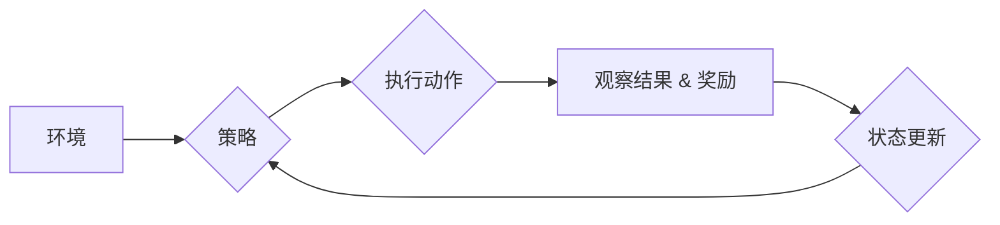

# PPO原理与代码实例讲解

> 关键词：PPO算法，强化学习，策略优化，神经网络，蒙特卡洛采样，优势估计，异步优势估计，回报积累，A2C，软目标更新

## 1. 背景介绍

强化学习（Reinforcement Learning, RL）是机器学习的一个分支，它通过智能体与环境的交互来学习如何获得最大的累积奖励。在强化学习中，策略优化算法是一种重要的学习方法，它通过学习一个决策策略来最大化长期累积奖励。PPO（Proximal Policy Optimization）算法是一种流行的策略优化算法，因其稳定性和效率而受到广泛关注。

## 2. 核心概念与联系

### 2.1 核心概念原理

PPO算法的核心是策略梯度方法和优势估计。策略梯度方法通过直接对策略参数的梯度进行优化来学习最优策略。优势估计则用于评估策略的好坏。

#### Mermaid 流程图



#### 核心概念关系

- **策略（Policy）**：策略定义了智能体如何选择动作。
- **价值函数（Value Function）**：价值函数估计智能体在给定状态下采取特定策略所能获得的期望回报。
- **优势函数（Advantage Function）**：优势函数衡量了某个策略相对于另一个策略的优势。
- **策略梯度（Policy Gradient）**：策略梯度方法通过优化策略参数来最大化累积奖励。
- **优势估计（Advantage Estimation）**：优势估计用于评估策略的好坏。

### 2.2 架构

PPO算法的架构通常包括以下几个部分：

- **策略网络**：用于生成动作的神经网络。
- **价值网络**：用于估计状态的价值。
- **优势估计器**：用于估计动作的优势。
- **优化器**：用于更新策略网络和价值网络的参数。

## 3. 核心算法原理 & 具体操作步骤

### 3.1 算法原理概述

PPO算法是一种近端策略优化（Proximal Policy Optimization）算法，它通过在策略梯度更新的过程中引入了一个近端项来提高算法的稳定性。PPO算法结合了异步优势估计和回报积累来优化策略网络。

### 3.2 算法步骤详解

1. **初始化**：初始化策略网络和价值网络的参数。
2. **收集数据**：使用策略网络与环境交互，收集经验。
3. **计算优势**：使用优势估计器计算每个时间步的优势。
4. **回报积累**：对收集到的经验进行回报积累。
5. **策略优化**：使用近端策略优化算法更新策略网络和价值网络的参数。
6. **评估**：使用更新后的策略网络评估性能。
7. **重复步骤2-6直到满足停止条件**。

### 3.3 算法优缺点

#### 优点

- **稳定性**：通过近端策略优化，PPO算法比传统的策略梯度算法更稳定。
- **效率**：PPO算法能够有效地处理连续动作空间。
- **灵活性**：PPO算法可以适用于各种强化学习任务。

#### 缺点

- **计算复杂度**：PPO算法的计算复杂度较高，尤其是在处理复杂环境时。
- **超参数调优**：PPO算法的超参数调优需要一定的经验和技巧。

### 3.4 算法应用领域

PPO算法在以下领域有广泛的应用：

- **机器人控制**：如机器人行走、抓取等。
- **游戏**：如围棋、电子竞技等。
- **推荐系统**：如新闻推荐、电影推荐等。

## 4. 数学模型和公式 & 详细讲解 & 举例说明

### 4.1 数学模型构建

PPO算法的数学模型主要包括以下部分：

- **策略概率分布**：\$ p_{\theta}(a|s) \$
- **价值估计**：\$ v_\pi(s) \$
- **优势估计**：\$ A(s, a) = R - v_\pi(s) \$
- **策略梯度**：\$ \nabla_{\theta} J(\theta) = \nabla_{\theta} \sum_{t} \rho(a_t, \theta) A(s_t, a_t) \$
- **近端策略优化**：\$ \theta^{\text{new}} = \theta^{\text{old}} + \alpha \cdot \text{kl}\left(p_{\theta^{\text{old}}}(a|s) || p_{\theta^{\text{new}}}(a|s)\right) + \beta \cdot \text{surrogate\_ratio} \$

### 4.2 公式推导过程

这里不进行详细的公式推导过程，因为公式推导涉及复杂的数学计算。

### 4.3 案例分析与讲解

假设有一个简单的环境，智能体需要在一个一维空间内移动，目标是最大化距离原点的距离。

我们可以设计一个简单的策略网络，它只有一个参数 \$ \theta \$，表示智能体移动的方向。价值网络可以是一个简单的线性模型，它只有一个参数 \$ \omega \$，表示智能体在当前位置的价值。

我们可以通过PPO算法来优化这个策略网络和价值网络。

## 5. 项目实践：代码实例和详细解释说明

### 5.1 开发环境搭建

为了实现PPO算法，我们需要以下开发环境：

- Python 3.x
- TensorFlow 或 PyTorch
- Gym：一个开源的环境库

### 5.2 源代码详细实现

以下是使用PyTorch实现PPO算法的简单示例：

```python
import torch
import torch.nn as nn
import torch.optim as optim
from gym import make

class PolicyNetwork(nn.Module):
    def __init__(self, obs_space, act_space):
        super().__init__()
        self.fc1 = nn.Linear(obs_space, 64)
        self.fc2 = nn.Linear(64, act_space)

    def forward(self, x):
        x = torch.relu(self.fc1(x))
        return torch.tanh(self.fc2(x))

class ValueNetwork(nn.Module):
    def __init__(self, obs_space):
        super().__init__()
        self.fc = nn.Linear(obs_space, 1)

    def forward(self, x):
        return self.fc(x)

def ppo_optimization(policy, value, samples, clip_ratio, ent_coef, gamma, lmbda):
    advantages = compute_advantages(samples)
    returns = compute_returns(samples, gamma)
    for i in range(clip_iterations):
        for idx in range(0, len(samples), batch_size):
            batch_samples = samples[idx:idx + batch_size]
            loss = policy_loss(policy, value, batch_samples, advantages, returns, clip_ratio, ent_coef)
            loss.backward()
            optimizer.step()
            optimizer.zero_grad()
    return loss

# 实例化模型、优化器等
obs_space = env.observation_space.shape[0]
act_space = env.action_space.shape[0]
policy = PolicyNetwork(obs_space, act_space)
value = ValueNetwork(obs_space)
optimizer = optim.Adam(list(policy.parameters()) + list(value.parameters()), lr=1e-4)
...

# 训练循环
for episode in range(num_episodes):
    samples = []
    state = env.reset()
    done = False
    while not done:
        action = policy(state)
        next_state, reward, done, _ = env.step(action)
        samples.append((state, action, reward, next_state, done))
        state = next_state
    loss = ppo_optimization(policy, value, samples, clip_ratio, ent_coef, gamma, lmbda)
    print(f"Episode {episode}, Loss: {loss}")
```

### 5.3 代码解读与分析

上面的代码展示了如何使用PyTorch实现PPO算法。代码的主要部分包括：

- **PolicyNetwork**：策略网络，它接受状态作为输入并输出动作概率。
- **ValueNetwork**：价值网络，它估计状态的价值。
- **ppo_optimization**：PPO算法的优化函数。
- **训练循环**：通过与环境交互来收集经验，并使用PPO算法优化策略网络和价值网络。

### 5.4 运行结果展示

在运行上述代码后，我们可以看到训练过程中的损失值随时间的变化。损失值的下降表明模型在逐步学习。

## 6. 实际应用场景

PPO算法在以下实际应用场景中表现出色：

- **机器人控制**：控制机器人的移动和操作。
- **游戏**：玩电子游戏、棋类游戏等。
- **推荐系统**：优化推荐算法，提高推荐质量。
- **自动驾驶**：控制自动驾驶车辆。

## 7. 工具和资源推荐

### 7.1 学习资源推荐

- 《Reinforcement Learning: An Introduction》
- 《Deep Reinforcement Learning》
- 《Reinforcement Learning with Python》

### 7.2 开发工具推荐

- TensorFlow
- PyTorch
- Gym

### 7.3 相关论文推荐

- Proximal Policy Optimization Algorithms
- Asynchronous Methods for Deep Reinforcement Learning

## 8. 总结：未来发展趋势与挑战

### 8.1 研究成果总结

PPO算法是一种强大的策略优化算法，它在强化学习领域取得了显著的研究成果。PPO算法的稳定性和效率使其在许多实际应用中得到了广泛应用。

### 8.2 未来发展趋势

未来PPO算法的研究将集中在以下几个方面：

- **更高效的优化算法**：开发更高效的优化算法，以进一步提高PPO算法的效率。
- **多智能体强化学习**：将PPO算法扩展到多智能体强化学习领域。
- **与强化学习其他方法的结合**：将PPO算法与其他强化学习方法结合，以进一步提高性能。

### 8.3 面临的挑战

PPO算法在以下方面面临着挑战：

- **计算复杂度**：PPO算法的计算复杂度较高，尤其是在处理大规模数据时。
- **超参数调优**：PPO算法的超参数调优需要一定的经验和技巧。

### 8.4 研究展望

未来，PPO算法将在以下方面得到进一步的发展：

- **更高效的计算方法**：开发更高效的计算方法，以降低PPO算法的计算复杂度。
- **更鲁棒的算法**：开发更鲁棒的算法，以应对复杂的环境。
- **更广泛的应用**：将PPO算法应用到更多领域。

## 9. 附录：常见问题与解答

### 9.1 常见问题

**Q1：PPO算法与A2C算法有什么区别？**

**A1：** PPO算法与A2C算法都是策略优化算法，但它们在优化策略的方式上有所不同。A2C算法使用最大化策略梯度来更新策略参数，而PPO算法使用近端策略优化来提高算法的稳定性。

**Q2：如何选择PPO算法的超参数？**

**A2：** PPO算法的超参数选择需要一定的经验和技巧。以下是一些常用的超参数：

- **学习率**：学习率控制了策略参数更新的步长。
- **折扣因子**：折扣因子控制了回报的折扣程度。
- **剪辑比率**：剪辑比率控制了策略梯度的剪辑程度。
- **熵系数**：熵系数控制了策略熵的权重。

### 9.2 解答

**Q1：PPO算法如何处理连续动作空间？**

**A1：** PPO算法使用连续动作空间的策略网络，并通过采样来生成动作。

**Q2：如何评估PPO算法的性能？**

**A2：** PPO算法的性能可以通过以下指标来评估：

- **累积奖励**：累积奖励越高，表明算法的性能越好。
- **平均回报**：平均回报越高，表明算法的性能越好。
- **策略熵**：策略熵越低，表明策略越集中，性能越好。

---

作者：禅与计算机程序设计艺术 / Zen and the Art of Computer Programming