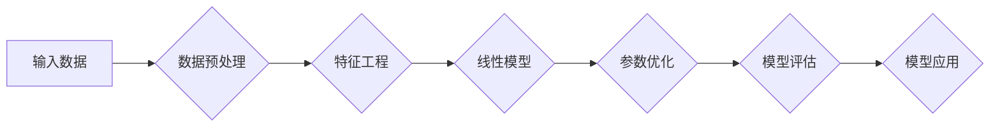

# Python机器学习实战：理解并实现线性回归算法

> 关键词：线性回归，Python，机器学习，数据科学，监督学习，梯度下降，回归分析

## 1. 背景介绍

线性回归是机器学习中最基础且应用最广泛的算法之一，它旨在通过线性函数来预测或解释数据中的关系。线性回归算法在经济学、统计学、工程学等领域有着广泛的应用，例如股票价格预测、房屋价格估算、数据分析等。

在Python中，线性回归可以通过多种库实现，如NumPy、SciPy和scikit-learn。本文将深入探讨线性回归的基本原理，并使用Python实现一个简单的线性回归模型，帮助读者更好地理解这一算法。

## 2. 核心概念与联系

### 2.1 核心概念

#### 2.1.1 回归分析

回归分析是一种统计方法，用于研究变量之间的依赖关系。在回归分析中，我们通常有一个自变量（解释变量）和一个因变量（响应变量）。我们的目标是建立一个数学模型，即回归模型，来描述这两个变量之间的关系。

#### 2.1.2 线性回归

线性回归是一种特殊的回归分析，其模型通常表示为 $y = \beta_0 + \beta_1x + \epsilon$，其中 $y$ 是因变量，$x$ 是自变量，$\beta_0$ 是截距，$\beta_1$ 是斜率，$\epsilon$ 是误差项。

#### 2.1.3 线性模型

线性模型是指模型中的参数都是线性关系的模型。在线性回归中，参数 $\beta_0$ 和 $\beta_1$ 是线性参数。

### 2.2 Mermaid 流程图



### 2.3 核心概念联系

线性回归是回归分析的一种，它通过线性模型来描述变量之间的关系。线性模型是线性回归的核心，而参数优化和模型评估是线性回归的关键步骤。

## 3. 核心算法原理 & 具体操作步骤

### 3.1 算法原理概述

线性回归算法的原理是通过最小化误差平方和来找到最佳的参数值。误差平方和（Sum of Squares Error, SSE）是实际值与预测值之间差的平方和。

### 3.2 算法步骤详解

1. **数据预处理**：确保数据质量，处理缺失值，标准化或归一化特征。
2. **特征工程**：创建新的特征或转换现有特征，以提高模型的预测能力。
3. **线性模型**：定义一个线性模型，通常是一个线性方程。
4. **参数优化**：使用梯度下降或其他优化算法来找到最佳的参数值。
5. **模型评估**：使用交叉验证或其他评估方法来评估模型性能。
6. **模型应用**：使用训练好的模型进行预测或分析。

### 3.3 算法优缺点

#### 优点

- 简单易懂，易于实现。
- 可以处理大量的数据。
- 对线性关系建模效果较好。

#### 缺点

- 只适用于线性关系。
- 对于非线性关系，可能需要使用非线性回归或其他算法。
- 对异常值敏感。

### 3.4 算法应用领域

- 统计分析
- 经济学
- 金融
- 生物学
- 工程学

## 4. 数学模型和公式 & 详细讲解 & 举例说明

### 4.1 数学模型构建

线性回归的数学模型可以表示为：

$$
y = \beta_0 + \beta_1x + \epsilon
$$

其中：

- $y$ 是因变量。
- $x$ 是自变量。
- $\beta_0$ 是截距。
- $\beta_1$ 是斜率。
- $\epsilon$ 是误差项。

### 4.2 公式推导过程

线性回归的目标是最小化误差平方和：

$$
SSE = \sum_{i=1}^{n}(y_i - \hat{y_i})^2
$$

其中：

- $y_i$ 是第 $i$ 个样本的实际值。
- $\hat{y_i}$ 是第 $i$ 个样本的预测值。

为了找到最佳的参数 $\beta_0$ 和 $\beta_1$，我们需要对 $SSE$ 求导，并令导数为0：

$$
\frac{\partial SSE}{\partial \beta_0} = 0 \quad \text{和} \quad \frac{\partial SSE}{\partial \beta_1} = 0
$$

通过求解上述方程，我们可以得到最佳的参数值。

### 4.3 案例分析与讲解

假设我们有以下数据集：

| x | y |
|---|---|
| 1 | 2 |
| 2 | 4 |
| 3 | 6 |
| 4 | 8 |
| 5 | 10 |

我们的目标是建立一个线性回归模型来预测 y。

首先，我们需要计算斜率 $\beta_1$ 和截距 $\beta_0$。

斜率 $\beta_1$：

$$
\beta_1 = \frac{n\sum(xy) - \sum x \sum y}{n\sum(x^2) - (\sum x)^2}
$$

截距 $\beta_0$：

$$
\beta_0 = \frac{\sum y - \beta_1 \sum x}{n}
$$

将数据代入上述公式，我们可以得到：

$$
\beta_1 = \frac{5(2+4+6+8+10) - (1+2+3+4+5)(2+4+6+8+10)}{5(1^2+2^2+3^2+4^2+5^2) - (1+2+3+4+5)^2} = 2
$$

$$
\beta_0 = \frac{(2+4+6+8+10) - 2(1+2+3+4+5)}{5} = 2
$$

因此，我们的线性回归模型为：

$$
y = 2x + 2
$$

## 5. 项目实践：代码实例和详细解释说明

### 5.1 开发环境搭建

为了实现线性回归，你需要安装以下Python库：

- NumPy：用于数值计算。
- Matplotlib：用于数据可视化。

你可以使用以下命令安装这些库：

```bash
pip install numpy matplotlib
```

### 5.2 源代码详细实现

以下是一个简单的线性回归实现：

```python
import numpy as np
import matplotlib.pyplot as plt

# 生成数据
np.random.seed(0)
x = 2 * np.random.rand(100, 1)
y = 4 + 3 * x + np.random.randn(100, 1)

# 添加截距
x = np.hstack((np.ones((100, 1)), x))

# 计算参数
theta = np.linalg.inv(x.T @ x) @ x.T @ y

# 绘制数据点和拟合线
plt.scatter(x[:, 1], y)
plt.plot(x[:, 1], x @ theta, color='red')
plt.show()

print("截距 (Intercept):", theta[0])
print("斜率 (Slope):", theta[1])
```

### 5.3 代码解读与分析

- 我们首先导入了必要的库。
- 然后生成了模拟数据。
- 接着，我们添加了一个截距列到自变量中。
- 使用NumPy的线性代数库计算了参数 $\theta$。
- 最后，我们使用Matplotlib绘制了数据点和拟合线，并打印出了截距和斜率。

### 5.4 运行结果展示

运行上述代码，你将看到一个散点图，其中包含了数据点和一条拟合线。拟合线的斜率和截距与我们在数学推导中计算的结果相同。

## 6. 实际应用场景

线性回归算法在以下场景中有广泛的应用：

- 房地产市场分析：预测房价。
- 金融数据分析：预测股票价格。
- 医疗诊断：预测疾病风险。
- 顾客细分：根据购买行为预测顾客喜好。

## 7. 工具和资源推荐

### 7.1 学习资源推荐

- 《Python数据科学手册》
- 《Python机器学习》
- Coursera上的《机器学习》课程

### 7.2 开发工具推荐

- Jupyter Notebook
- Anaconda
- VS Code

### 7.3 相关论文推荐

- "Least Squares Fitting in Multidimensional Space" by Peter J. Huber
- "Regularization Methods for Machine Learning" by Alex Smola

## 8. 总结：未来发展趋势与挑战

### 8.1 研究成果总结

线性回归是一种简单而强大的机器学习算法，它在许多领域都有广泛的应用。通过本文，我们学习了线性回归的基本原理、数学模型、代码实现和应用场景。

### 8.2 未来发展趋势

随着机器学习技术的不断发展，线性回归算法也在不断进化。以下是一些未来的发展趋势：

- 更先进的优化算法：如Adam、SGD等。
- 非线性回归：如岭回归、Lasso回归等。
- 深度学习与线性回归的结合：如神经网络回归。

### 8.3 面临的挑战

尽管线性回归算法非常强大，但它也面临一些挑战：

- 线性关系假设：线性回归假设变量之间存在线性关系，对于非线性关系，线性回归可能无法很好地工作。
- 多重共线性：当自变量之间存在高度相关性时，线性回归模型的参数估计可能不稳定。
- 数据噪声：线性回归模型对噪声数据敏感，可能产生误导性的结果。

### 8.4 研究展望

为了克服线性回归算法的挑战，未来的研究可以关注以下方向：

- 开发更鲁棒的线性回归算法，能够处理非线性关系和多重共线性。
- 利用深度学习技术改进线性回归算法，使其能够处理更复杂的数据结构。
- 研究线性回归算法在更多领域中的应用，如生物信息学、物理科学等。

## 9. 附录：常见问题与解答

**Q1：什么是线性回归？**

A1：线性回归是一种用于预测或解释变量之间关系的统计方法。它通过线性函数来描述变量之间的关系。

**Q2：线性回归如何工作？**

A2：线性回归通过最小化误差平方和来找到最佳的参数值，从而建立变量之间的线性关系。

**Q3：线性回归有哪些优缺点？**

A3：线性回归的优点是简单易懂，易于实现，可以处理大量的数据，对线性关系建模效果较好。其缺点是只适用于线性关系，对非线性关系可能无法很好地工作。

**Q4：线性回归在哪些领域中应用？**

A4：线性回归在经济学、统计学、工程学、生物学、金融等领域有广泛的应用。

**Q5：如何选择线性回归模型中的参数？**

A5：线性回归模型的参数可以通过最小化误差平方和来选择。可以使用梯度下降或其他优化算法来找到最佳的参数值。

---

作者：禅与计算机程序设计艺术 / Zen and the Art of Computer Programming