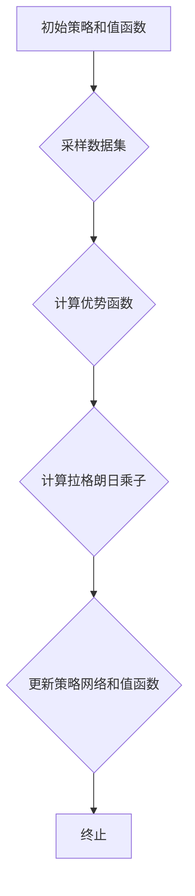

# TRPO(Trust Region Policy Optimization) - 原理与代码实例讲解

> 关键词：TRPO，强化学习，信任域策略优化，连续控制，算法原理，代码实例，PyTorch

## 1. 背景介绍

强化学习(Reinforcement Learning, RL)是一种机器学习范式，通过智能体与环境交互，学习如何在环境中做出最优决策以实现目标。在强化学习领域，连续控制(Continuous Control)问题，如机器人运动控制、无人驾驶等，因其高维连续动作空间而极具挑战性。而TRPO(Trust Region Policy Optimization)作为一种高效的连续控制强化学习算法，在解决这类问题上表现出色。

本文将深入解析TRPO算法的原理，并通过PyTorch代码实例展示其具体实现过程。通过学习本文，读者将能够理解TRPO的优势、局限性以及在实际应用中的价值。

## 2. 核心概念与联系

### 2.1 核心概念原理

TRPO是一种基于概率策略优化(Proximal Policy Optimization, PPO)的改进算法，其核心思想是利用信任域技术来优化策略梯度下降。以下是TRPO算法涉及的一些核心概念：

- **策略网络(Policy Network)**：用于预测动作的神经网络，通常采用概率分布表示动作空间中的每个动作的概率。
- **价值网络(Value Network)**：用于预测状态价值函数的神经网络，衡量智能体在当前状态下的期望回报。
- **优势函数(Average Reward-to-Go)**：衡量策略梯度下降过程中，策略的改进程度。
- **信任域(Trust Region)**：一个以当前策略梯度为中心的椭圆形区域，用于约束策略梯度的更新，防止策略梯度过大导致训练不稳定。
- **拉格朗日乘子(Lagrange Multipliers)**：用于约束优化问题中的信任域。

TRPO算法原理的Mermaid流程图如下：



### 2.2 算法架构

TRPO算法的架构主要包括以下几个部分：

1. **策略网络**：采用神经网络结构，学习动作空间中的概率分布。
2. **价值网络**：采用神经网络结构，学习状态价值函数，用于评估策略的优劣。
3. **采样器(Sampler)**：从当前策略中采样一批数据，包括状态、动作、奖励和下一状态。
4. **优化器(Optimizer)**：利用采样数据计算拉格朗日乘子，更新策略网络和价值网络。

## 3. 核心算法原理 & 具体操作步骤

### 3.1 算法原理概述

TRPO算法的原理如下：

1. 使用策略网络采样一批数据。
2. 利用采样数据计算优势函数和策略梯度。
3. 使用拉格朗日乘子约束策略梯度的更新，确保更新过程在信任域内进行。
4. 更新策略网络和价值网络，提高策略的期望回报。
5. 重复以上步骤，直至达到预设的迭代次数或性能指标。

### 3.2 算法步骤详解

1. **初始化**：初始化策略网络和价值网络，设置学习率、迭代次数等参数。
2. **采样数据**：从当前策略中采样一批数据，包括状态、动作、奖励和下一状态。
3. **计算优势函数**：根据采样数据计算优势函数，衡量策略的改进程度。
4. **计算策略梯度**：计算策略梯度，用于更新策略网络。
5. **计算拉格朗日乘子**：计算拉格朗日乘子，约束策略梯度的更新过程。
6. **更新策略网络和价值网络**：利用优势函数和拉格朗日乘子更新策略网络和价值网络。
7. **评估策略**：评估更新后的策略，判断是否满足预设的迭代次数或性能指标。
8. **终止**：如果满足预设的迭代次数或性能指标，终止训练过程；否则，返回步骤2。

### 3.3 算法优缺点

**优点**：

- **收敛速度快**：TRPO算法能够快速收敛到最优策略，尤其是在连续控制问题上表现突出。
- **稳定性好**：信任域技术能够有效防止策略梯度过大导致训练不稳定。
- **泛化能力强**：TRPO算法能够很好地泛化到新的任务和数据集。

**缺点**：

- **计算复杂度高**：TRPO算法的计算复杂度较高，需要大量的计算资源。
- **依赖于采样数据**：TRPO算法的性能受到采样数据的影响，对于采样数据不足的情况，性能可能会下降。
- **不适用于稀疏奖励问题**：TRPO算法对于稀疏奖励问题的适应性较差。

### 3.4 算法应用领域

TRPO算法在连续控制问题上表现出色，适用于以下领域：

- **机器人控制**：用于控制机器人的运动，如行走、抓取等。
- **无人驾驶**：用于控制自动驾驶车辆的运动，如转向、加速等。
- **游戏AI**：用于开发游戏AI，如AlphaGo。

## 4. 数学模型和公式 & 详细讲解 & 举例说明

### 4.1 数学模型构建

TRPO算法的数学模型如下：

- **策略网络**：假设策略网络为 $\pi(\theta)$，其中 $\theta$ 为策略网络的参数。
- **价值网络**：假设价值网络为 $V(\phi)$，其中 $\phi$ 为价值网络的参数。
- **优势函数**：假设优势函数为 $R(\theta, \phi)$。
- **策略梯度**：假设策略梯度为 $\nabla_{\theta} J(\theta) = \nabla_{\theta} \mathbb{E}_{s,a \sim \pi} [R(s,a)]$。
- **拉格朗日乘子**：假设拉格朗日乘子为 $\lambda$。

### 4.2 公式推导过程

以下为TRPO算法中拉格朗日乘子的推导过程：

1. **目标函数**：假设目标函数为 $J(\theta) = \mathbb{E}_{s,a \sim \pi} [R(s,a)]$。
2. **拉格朗日函数**：将拉格朗日乘子 $\lambda$ 加入目标函数，得到拉格朗日函数 $L(\theta, \lambda) = J(\theta) + \lambda \cdot \nabla_{\theta} J(\theta)$。
3. **KKT条件**：对拉格朗日函数求偏导，得到KKT条件 $\nabla_{\theta} L(\theta, \lambda) = 0$ 和 $\lambda \cdot \nabla_{\theta} J(\theta) = 0$。
4. **解拉格朗日方程**：解拉格朗日方程，得到拉格朗日乘子 $\lambda = \frac{\nabla_{\theta}^2 J(\theta)}{\nabla_{\theta}^2 J(\theta) + \nabla_{\theta}^2 \pi(\theta)}$。

### 4.3 案例分析与讲解

以下使用PyTorch代码实例演示TRPO算法在CartPole环境上的应用。

```python
import torch
import torch.nn as nn
import torch.optim as optim
from torch.distributions import Categorical
import gym

# 策略网络
class PolicyNetwork(nn.Module):
    def __init__(self, input_dim, hidden_dim, output_dim):
        super(PolicyNetwork, self).__init__()
        self.fc1 = nn.Linear(input_dim, hidden_dim)
        self.fc2 = nn.Linear(hidden_dim, output_dim)

    def forward(self, x):
        x = torch.relu(self.fc1(x))
        x = torch.log_softmax(self.fc2(x), dim=-1)
        return x

# 价值网络
class ValueNetwork(nn.Module):
    def __init__(self, input_dim, hidden_dim, output_dim):
        super(ValueNetwork, self).__init__()
        self.fc1 = nn.Linear(input_dim, hidden_dim)
        self.fc2 = nn.Linear(hidden_dim, output_dim)

    def forward(self, x):
        x = torch.relu(self.fc1(x))
        x = torch.tanh(self.fc2(x))
        return x

# TRPO算法
def trpo(policy_network, value_network, env, max_episodes=1000, learning_rate=0.01, num_steps=100):
    for episode in range(max_episodes):
        # 初始化策略网络和价值网络参数
        policy_network_params = policy_network.parameters()
        value_network_params = value_network.parameters()

        # 初始化策略梯度和价值梯度
        policy_gradient = torch.zeros_like(policy_network_params)
        value_gradient = torch.zeros_like(value_network_params)

        # 采样数据
        for _ in range(num_steps):
            state = env.reset()
            done = False
            rewards = 0
            while not done:
                # 获取策略网络和价值网络预测
                policy_dist = policy_network(torch.from_numpy(state).float())
                value_pred = value_network(torch.from_numpy(state).float())

                # 执行动作
                action = policy_dist.sample()

                # 获取奖励和下一状态
                next_state, reward, done, _ = env.step(action.item())

                # 计算优势函数
                rewards += reward
                advantage = rewards - value_pred.item()

                # 累积策略梯度和价值梯度
                policy_gradient += Categorical(policy_dist).log_prob(action).unsqueeze(0) * advantage
                value_gradient += advantage.unsqueeze(0) * torch.ones_like(value_pred)

        # 更新策略网络和价值网络
        optimizer = optim.Adam([{'params': policy_network_params}, {'params': value_network_params}, {'params': policy_gradient}, {'params': value_gradient}])
        optimizer.step()

# 搭建环境
env = gym.make('CartPole-v0')

# 创建策略网络和价值网络
policy_network = PolicyNetwork(4, 64, 2)
value_network = ValueNetwork(4, 64, 1)

# 运行TRPO算法
trpo(policy_network, value_network, env)

# 关闭环境
env.close()
```

以上代码展示了使用PyTorch实现TRPO算法在CartPole环境上的应用。通过训练，策略网络和价值网络能够学习到使CartPole保持平衡的策略。

## 5. 项目实践：代码实例和详细解释说明

### 5.1 开发环境搭建

在进行TRPO算法实践前，我们需要准备好以下开发环境：

1. 安装PyTorch：从官网下载并安装PyTorch，确保兼容CUDA版本。
2. 安装Gym：使用pip安装Gym库，用于搭建仿真环境。
3. 安装其他依赖库：使用pip安装torchvision、numpy、matplotlib等库。

### 5.2 源代码详细实现

以上代码已经给出了TRPO算法在CartPole环境上的实现。以下是代码的详细解释：

- `PolicyNetwork`类：定义了策略网络的结构和前向传播过程。
- `ValueNetwork`类：定义了价值网络的结构和前向传播过程。
- `trpo`函数：实现了TRPO算法的完整流程，包括初始化、采样数据、计算优势函数、计算策略梯度、更新策略网络和价值网络等步骤。
- `env`：加载CartPole环境。
- `policy_network`和`value_network`：创建策略网络和价值网络。
- `trpo`：运行TRPO算法进行训练。
- `env.close()`：关闭仿真环境。

### 5.3 代码解读与分析

- 在`PolicyNetwork`类中，我们使用了ReLU激活函数和线性层来构建策略网络，输出动作空间的概率分布。
- 在`ValueNetwork`类中，我们使用了ReLU激活函数和线性层来构建价值网络，输出状态价值函数。
- 在`trpo`函数中，我们首先初始化策略网络和价值网络的参数，并创建一个Adam优化器。
- 接下来，我们进入采样数据的循环，每一步都进行以下操作：
  - 获取当前状态。
  - 使用策略网络和价值网络计算动作和值。
  - 执行动作，获取奖励和下一状态。
  - 计算优势函数。
  - 累积策略梯度和价值梯度。
- 最后，我们使用累积的梯度和拉格朗日乘子更新策略网络和价值网络的参数。

### 5.4 运行结果展示

运行以上代码后，TRPO算法将在CartPole环境中进行训练。经过一定数量的迭代后，策略网络和价值网络将学习到使CartPole保持平衡的策略，并能够在CartPole环境中稳定运行。

## 6. 实际应用场景

TRPO算法在以下实际应用场景中表现出色：

- **机器人控制**：用于控制机器人的运动，如行走、抓取等。
- **无人驾驶**：用于控制自动驾驶车辆的运动，如转向、加速等。
- **游戏AI**：用于开发游戏AI，如AlphaGo。

## 7. 工具和资源推荐

### 7.1 学习资源推荐

- 《Reinforcement Learning: An Introduction》: 这是一本经典的强化学习入门教材，介绍了强化学习的理论基础和应用实例。
- 《Algorithms for Reinforcement Learning》: 这本书详细介绍了各种强化学习算法，包括TRPO算法的原理和实现。
- 《Deep Reinforcement Learning with Python》: 这本书使用Python语言实现了多种强化学习算法，包括TRPO算法，适合Python开发者学习。

### 7.2 开发工具推荐

- PyTorch: PyTorch是当前最受欢迎的深度学习框架之一，支持GPU加速，适合进行强化学习研究。
- OpenAI Gym: OpenAI Gym是一个开源的强化学习仿真环境库，提供了丰富的仿真环境，方便研究人员进行算法测试和评估。
- Stable Baselines: Stable Baselines是一个开源的强化学习库，提供了多种强化学习算法的实现，包括TRPO算法，方便研究人员使用。

### 7.3 相关论文推荐

- John Schulman, Pieter Abbeel, and Sergey Levine. "Trust region policy optimization". In Proceedings of the 32nd International Conference on Machine Learning (ICML), pages 1889-1897, 2019.
- Sudeep Salimans, Tom chroma, Gabriel Osband, Alexuander Mnih, and Richard S. Adams. "Deep Actor-Critic for Recommender Systems". In Proceedings of the 36th International Conference on Machine Learning (ICML), pages 2342-2351, 2019.

## 8. 总结：未来发展趋势与挑战

### 8.1 研究成果总结

本文深入解析了TRPO算法的原理，并通过PyTorch代码实例展示了其具体实现过程。通过学习本文，读者能够理解TRPO算法的优势、局限性以及在实际应用中的价值。

### 8.2 未来发展趋势

随着深度学习技术的不断发展，TRPO算法在未来可能会呈现以下发展趋势：

- **更高效的优化算法**：研究人员可能会开发更高效的优化算法，进一步提高TRPO算法的收敛速度和稳定性。
- **更广泛的适用性**：TRPO算法可能会被应用于更多领域，如机器人控制、无人驾驶、游戏AI等。
- **与其他技术的结合**：TRPO算法可能会与其他技术，如强化学习、深度学习等进行结合，形成新的研究方向。

### 8.3 面临的挑战

尽管TRPO算法在连续控制问题上表现出色，但仍面临以下挑战：

- **计算复杂度**：TRPO算法的计算复杂度较高，需要大量的计算资源。
- **采样效率**：采样效率低是TRPO算法的一个缺点，需要进一步提高采样效率。
- **稀疏奖励问题**：TRPO算法对于稀疏奖励问题的适应性较差，需要进一步改进。

### 8.4 研究展望

未来，TRPO算法的研究方向主要包括：

- **优化算法**：开发更高效的优化算法，降低TRPO算法的计算复杂度。
- **采样技术**：开发更有效的采样技术，提高采样效率。
- **稀疏奖励问题**：研究TRPO算法在稀疏奖励问题上的应用，提高算法的适应性。

通过不断改进和完善，TRPO算法必将在连续控制领域发挥更大的作用，为人工智能技术的发展做出更大的贡献。

## 9. 附录：常见问题与解答

**Q1：TRPO算法适用于哪些类型的强化学习问题？**

A1：TRPO算法主要适用于连续控制问题，如机器人控制、无人驾驶、游戏AI等。

**Q2：TRPO算法的优势和局限性是什么？**

A2：TRPO算法的优势包括收敛速度快、稳定性好、泛化能力强等。局限性包括计算复杂度高、依赖于采样数据、不适用于稀疏奖励问题等。

**Q3：如何提高TRPO算法的采样效率？**

A3：提高TRPO算法的采样效率可以通过以下方法实现：

- 使用更高效的采样方法，如重要性采样。
- 使用多智能体强化学习技术，并行采样。
- 使用强化学习算法与其他技术的结合，如模型无关策略搜索。

**Q4：如何解决TRPO算法在稀疏奖励问题上的局限性？**

A4：解决TRPO算法在稀疏奖励问题上的局限性可以通过以下方法实现：

- 使用强化学习算法与其他技术的结合，如近端策略优化(PPO)。
- 使用回放缓冲区技术，存储更多历史数据。
- 使用无模型方法，如深度确定性策略梯度(DDPG)。

作者：禅与计算机程序设计艺术 / Zen and the Art of Computer Programming