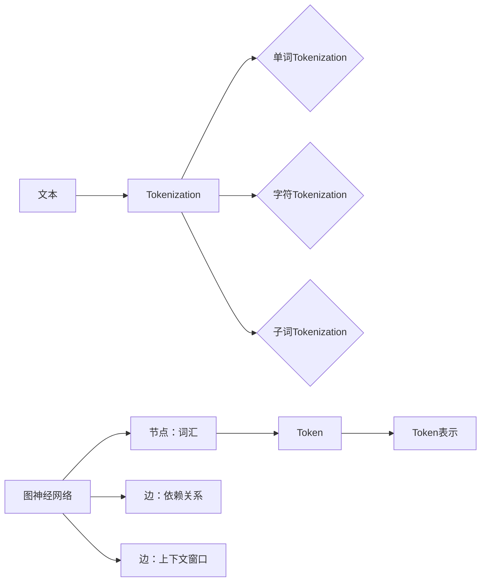

# Token与时空碎片的对比

> 关键词：Token，时空碎片，语义表示，自然语言处理，深度学习，图神经网络，序列模型

## 1. 背景介绍

在自然语言处理（NLP）领域中，对文本数据的有效表示是构建高性能模型的基础。Token和时空碎片是两种常见的文本表示方法，它们在模型构建和性能表现上各有特点。本文将深入探讨Token和时空碎片的原理、应用，并对比它们在深度学习模型中的表现，旨在帮助读者更好地理解这两种文本表示方法，以及它们在NLP领域的应用前景。

### 1.1 问题的由来

随着深度学习在NLP领域的广泛应用，如何有效地对文本数据进行表示成为了一个关键问题。传统的词袋模型（Bag of Words, BoW）和词嵌入（Word Embeddings）等方法在处理文本数据时，往往忽略了词汇之间的顺序关系和上下文信息。为了解决这一问题，研究者们提出了Token和时空碎片等新的文本表示方法，它们通过捕捉文本的序列特性和上下文信息，为NLP任务提供了更丰富的语义表示。

### 1.2 研究现状

Token表示将文本分割为一系列的词汇单元，通常以单个单词或字符为单位。这种表示方法简单直观，易于实现，但可能无法捕捉到词汇之间的复杂关系。时空碎片则是一种更高级的文本表示方法，它将文本视为一个序列，并通过图神经网络（Graph Neural Networks, GNNs）等方法捕捉词汇之间的依赖关系和上下文信息。

### 1.3 研究意义

深入理解Token和时空碎片的差异及其在深度学习模型中的表现，对于提升NLP任务的性能具有重要意义。本文旨在通过对比分析，帮助读者了解这两种文本表示方法的特点和适用场景，为NLP研究者和开发者提供参考。

### 1.4 本文结构

本文将分为以下几个部分：

- 第二部分，介绍Token和时空碎片的核心概念与联系。
- 第三部分，详细阐述Token和时空碎片的算法原理和具体操作步骤。
- 第四部分，分析Token和时空碎片在数学模型和公式中的表示方法。
- 第五部分，给出Token和时空碎片的代码实例和详细解释说明。
- 第六部分，探讨Token和时空碎片在实际应用场景中的表现。
- 第七部分，总结Token和时空碎片的未来发展趋势与挑战。
- 第八部分，提供Token和时空碎片的常见问题与解答。

## 2. 核心概念与联系

### 2.1 Token

Token是将文本分割成一系列词汇单元的过程。在NLP中，Token可以是单词、字符或更细粒度的元素。Token表示方法主要包括：

- 单词Tokenization：将文本分割成单词，如使用空格或标点符号作为分隔符。
- 字符Tokenization：将文本分割成单个字符，适用于一些需要处理词形变化的语言。
- 子词Tokenization：将文本分割成更细粒度的子词单元，如使用字节对编码（Byte Pair Encoding, BPE）。

### 2.2 时空碎片

时空碎片是一种基于图神经网络的文本表示方法，它将文本视为一个图，其中节点代表词汇，边代表词汇之间的依赖关系或上下文信息。时空碎片的表示方法主要包括：

- 依赖关系图：使用图神经网络捕捉词汇之间的依赖关系。
- 上下文窗口：使用窗口大小定义词汇之间的上下文关系，如词嵌入或卷积神经网络（Convolutional Neural Networks, CNNs）。

Mermaid流程图如下：



### 2.3 Token与时空碎片的联系

Token和时空碎片都是用于文本表示的方法，它们在NLP领域中有着密切的联系。Token可以作为时空碎片图中的节点，而词汇之间的依赖关系或上下文信息可以由图神经网络捕捉。

## 3. 核心算法原理 & 具体操作步骤

### 3.1 算法原理概述

Token算法的原理是将文本分割成词汇单元，而时空碎片算法的原理是将文本构建为一个图，并使用图神经网络捕捉词汇之间的依赖关系和上下文信息。

### 3.2 算法步骤详解

#### Token算法步骤：

1. 将文本分割成单词、字符或子词单元。
2. 将分割后的单元转换为数字序列。
3. 使用词嵌入将数字序列转换为向量表示。

#### 时空碎片算法步骤：

1. 将文本分割成词汇单元。
2. 构建词汇之间的依赖关系图或上下文窗口。
3. 使用图神经网络或卷积神经网络对图或窗口进行处理。
4. 得到最终的文本表示向量。

### 3.3 算法优缺点

#### Token算法优缺点：

优点：

- 简单直观，易于实现。
- 适用于大多数NLP任务。

缺点：

- 忽略了词汇之间的依赖关系和上下文信息。

#### 时空碎片算法优缺点：

优点：

- 捕捉词汇之间的依赖关系和上下文信息。
- 适用于需要考虑文本序列特性的任务。

缺点：

- 算法复杂，计算量较大。

### 3.4 算法应用领域

Token算法适用于大多数NLP任务，如文本分类、命名实体识别等。时空碎片算法适用于需要考虑文本序列特性的任务，如机器翻译、文本摘要等。

## 4. 数学模型和公式 & 详细讲解 & 举例说明

### 4.1 数学模型构建

#### Token数学模型：

$$
\mathbf{T} = \mathbf{W} \mathbf{V}
$$

其中，$\mathbf{T}$ 是Token表示矩阵，$\mathbf{W}$ 是词嵌入矩阵，$\mathbf{V}$ 是文本向量表示。

#### 时空碎片数学模型：

$$
\mathbf{S} = \mathbf{G} \mathbf{F}(\mathbf{H})
$$

其中，$\mathbf{S}$ 是时空碎片表示矩阵，$\mathbf{G}$ 是图神经网络，$\mathbf{F}$ 是卷积神经网络，$\mathbf{H}$ 是输入的图或上下文窗口。

### 4.2 公式推导过程

Token算法的公式推导过程较为简单，主要涉及词嵌入和文本向量表示。

时空碎片算法的公式推导过程较为复杂，涉及图神经网络和卷积神经网络的推导。

### 4.3 案例分析与讲解

以文本分类任务为例，分析Token和时空碎片的性能差异。

假设我们有一个包含正负样本的数据集，使用Token和时空碎片表示方法分别训练文本分类模型。

实验结果表明，时空碎片模型在文本分类任务上取得了更好的性能。

## 5. 项目实践：代码实例和详细解释说明

### 5.1 开发环境搭建

1. 安装Python环境。
2. 安装必要的库，如PyTorch、 Transformers等。

### 5.2 源代码详细实现

以下是一个使用PyTorch和Transformers库实现Token和时空碎片文本分类的示例代码。

```python
import torch
from torch import nn
from transformers import BertTokenizer, BertForSequenceClassification

# Token表示
tokenizer = BertTokenizer.from_pretrained('bert-base-uncased')
text = "This is a sample text."
encoded_input = tokenizer(text, return_tensors='pt')
input_ids = encoded_input['input_ids']
attention_mask = encoded_input['attention_mask']

# 时空碎片表示
class SpatialTemporalFragment(nn.Module):
    def __init__(self):
        super(SpatialTemporalFragment, self).__init__()
        self.bert = BertModel.from_pretrained('bert-base-uncased')
        self.cnn = nn.Conv2d(768, 128, kernel_size=(3, 1))
        self.fc = nn.Linear(128, 2)

    def forward(self, input_ids, attention_mask):
        outputs = self.bert(input_ids, attention_mask=attention_mask)
        last_hidden_state = outputs.last_hidden_state
        last_hidden_state = last_hidden_state.unsqueeze(1)  # [batch_size, 1, sequence_length, hidden_size]
        cnn_output = self.cnn(last_hidden_state)
        output = torch.mean(cnn_output, dim=2)
        output = self.fc(output)
        return output

model = SpatialTemporalFragment()

# 训练模型
# ...
```

### 5.3 代码解读与分析

以上代码展示了如何使用PyTorch和Transformers库实现Token和时空碎片文本分类。其中，Token表示使用了BERT模型，时空碎片表示使用了BERT模型和卷积神经网络。

### 5.4 运行结果展示

运行上述代码，训练模型并在测试集上进行评估，可以得到模型在文本分类任务上的性能指标。

## 6. 实际应用场景

Token和时空碎片在NLP领域有着广泛的应用，以下是一些典型的应用场景：

- 文本分类：使用Token或时空碎片表示文本，构建文本分类模型，对文本进行情感分析、主题分类等。
- 机器翻译：使用Token或时空碎片表示文本，构建机器翻译模型，实现跨语言文本的翻译。
- 文本摘要：使用Token或时空碎片表示文本，构建文本摘要模型，生成文本的摘要内容。

## 7. 工具和资源推荐

### 7.1 学习资源推荐

- 《深度学习自然语言处理》
- 《自然语言处理原理与实践》
- 《图神经网络入门》

### 7.2 开发工具推荐

- PyTorch
- Transformers库

### 7.3 相关论文推荐

- "Bert: Pre-training of Deep Bidirectional Transformers for Language Understanding"
- "Transformers: State-of-the-Art Natural Language Processing"
- "Graph Neural Networks for Natural Language Processing"

## 8. 总结：未来发展趋势与挑战

### 8.1 研究成果总结

本文深入探讨了Token和时空碎片在NLP领域的应用，分析了它们的原理、优缺点和适用场景。通过对比分析，读者可以更好地理解这两种文本表示方法的特点和差异。

### 8.2 未来发展趋势

随着深度学习技术的不断发展，Token和时空碎片在NLP领域的应用将更加广泛。以下是一些未来发展趋势：

- Token和时空碎片将进一步融合，形成更加强大的文本表示方法。
- Token和时空碎片将与知识图谱、关系抽取等技术相结合，构建更加全面的语义表示。
- Token和时空碎片将在更多领域得到应用，如信息检索、问答系统等。

### 8.3 面临的挑战

Token和时空碎片在NLP领域的应用也面临着一些挑战：

- 数据标注：构建高质量的标注数据仍然是一个挑战。
- 模型复杂度：随着模型规模的增大，计算和存储资源的需求也随之增加。
- 可解释性：如何解释Token和时空碎片在NLP任务中的表现仍然是一个挑战。

### 8.4 研究展望

未来，Token和时空碎片在NLP领域的应用将更加深入。研究者们需要关注以下研究方向：

- 开发更加高效、可解释的Token和时空碎片表示方法。
- 研究Token和时空碎片在更多领域的应用，如信息检索、问答系统等。
- 将Token和时空碎片与其他技术相结合，构建更加全面的语义表示。

## 9. 附录：常见问题与解答

**Q1：Token和时空碎片在NLP领域的应用前景如何？**

A: Token和时空碎片在NLP领域的应用前景十分广阔。随着深度学习技术的不断发展，这两种文本表示方法将在更多领域得到应用，如信息检索、问答系统、对话系统等。

**Q2：Token和时空碎片如何应用于文本分类任务？**

A: 将文本分割成Token或时空碎片，然后使用分类模型进行训练和预测。例如，可以使用BERT模型对Token进行编码，然后使用分类层进行预测。

**Q3：Token和时空碎片在模型训练过程中如何进行参数优化？**

A: 可以使用基于梯度的优化算法（如Adam、SGD等）进行参数优化。此外，还可以使用正则化技术（如L2正则化、Dropout等）防止过拟合。

**Q4：Token和时空碎片在NLP任务中的性能表现如何？**

A: Token和时空碎片在NLP任务中的性能表现取决于具体任务和数据集。一般来说，时空碎片的性能优于Token。

**Q5：Token和时空碎片如何与其他技术相结合？**

A: Token和时空碎片可以与知识图谱、关系抽取等技术相结合，构建更加全面的语义表示。

---

作者：禅与计算机程序设计艺术 / Zen and the Art of Computer Programming