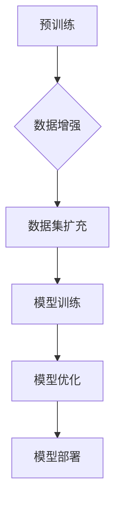

# Transformer大模型实战：数据增强方法

> 关键词：Transformer, 大模型, 数据增强, 预训练, 自然语言处理, NLP, 实战, 算法, 优化

## 1. 背景介绍

随着深度学习在自然语言处理（NLP）领域的广泛应用，Transformer架构的大模型因其出色的性能和强大的泛化能力而成为研究热点。然而，高质量标注数据的获取往往成本高昂且耗时，尤其是对于大规模语言模型（Large Language Model, LLM）来说，数据量是模型性能的关键因素。为了解决这个问题，数据增强方法应运而生，它通过模拟真实数据分布来扩充数据集，从而提高模型的泛化能力和鲁棒性。本文将深入探讨Transformer大模型中的数据增强方法，包括其原理、实战技巧以及未来发展趋势。

## 2. 核心概念与联系

### 2.1 核心概念

#### 预训练（Pre-training）
预训练是指在大规模无标签数据上对模型进行训练，使其学习到通用语言表示的过程。预训练模型可以用于各种下游任务，如文本分类、命名实体识别、机器翻译等。

#### 数据增强（Data Augmentation）
数据增强是指通过一系列技术手段，在不改变数据本质的情况下，生成与原数据具有相似分布的新数据的过程。

#### Transformer（Transformer）
Transformer是一种基于自注意力机制（Self-Attention）的神经网络架构，它通过全局注意力机制捕捉输入序列中任意两个元素之间的关系，在NLP领域取得了显著的成果。

#### 大模型（Large Language Model, LLM）
大模型是指参数量庞大、模型结构复杂的语言模型，如BERT、GPT-3等。

### 2.2 Mermaid 流程图



### 2.3 核心概念联系

预训练是数据增强的基础，通过预训练，模型学习到通用语言表示。数据增强通过对预训练模型生成的数据进一步进行处理，生成更丰富的数据集，从而提高模型在下游任务上的性能。Transformer作为大模型的核心架构，可以应用于数据增强过程，通过自注意力机制捕捉输入序列中的关系，实现更有效的数据增强。

## 3. 核心算法原理 & 具体操作步骤

### 3.1 算法原理概述

数据增强方法主要分为以下几类：

- **文本替换**：通过替换文本中的单词、短语或子序列，生成新的文本数据。
- **文本改写**：通过改写句子结构，生成新的文本数据。
- **文本生成**：使用预训练模型生成新的文本数据。
- **数据合并**：将不同来源的数据合并，形成新的数据集。

### 3.2 算法步骤详解

1. **选择预训练模型**：根据任务需求选择合适的预训练模型，如BERT、GPT等。
2. **数据预处理**：对原始数据进行清洗和预处理，如去除无关信息、统一格式等。
3. **数据增强**：根据任务类型和模型特点，选择合适的数据增强方法。
4. **数据评估**：评估增强数据的质量，确保数据增强后的数据与原始数据具有相似分布。
5. **模型训练**：使用增强后的数据集对模型进行训练。
6. **模型评估**：在测试集上评估模型性能，验证数据增强的有效性。

### 3.3 算法优缺点

#### 优点：

- **提高模型泛化能力**：通过扩充数据集，模型可以学习到更丰富的语言特征，从而提高泛化能力。
- **减少对标注数据的依赖**：数据增强可以减少对高质量标注数据的依赖，降低数据获取成本。
- **提高模型鲁棒性**：通过增加数据的多样性，模型可以更好地适应不同的输入，提高鲁棒性。

#### 缺点：

- **数据质量**：数据增强过程中可能产生与真实数据分布不一致的数据，影响模型性能。
- **计算资源**：数据增强和模型训练需要大量的计算资源。

### 3.4 算法应用领域

数据增强方法在以下领域具有广泛的应用：

- **文本分类**：提高模型在文本分类任务上的准确性和鲁棒性。
- **命名实体识别**：提高模型在命名实体识别任务上的准确率。
- **机器翻译**：提高机器翻译的准确性和流畅性。
- **文本摘要**：提高文本摘要的准确性和可读性。

## 4. 数学模型和公式 & 详细讲解 & 举例说明

### 4.1 数学模型构建

数据增强方法的数学模型可以表示为：

$$
\text{DataAugmentation}(X) = F(X)
$$

其中，$X$ 表示原始数据，$F$ 表示数据增强函数。

### 4.2 公式推导过程

数据增强函数 $F$ 可以根据不同的增强策略进行设计，以下列举几种常见的数据增强公式：

#### 文本替换

$$
F_{\text{replace}}(X) = \text{replace}(X, \text{replace\_probability})
$$

其中，$\text{replace}(X, \text{replace\_probability})$ 表示在文本 $X$ 中，以概率 $\text{replace\_probability}$ 替换每个单词。

#### 文本改写

$$
F_{\text{rewrite}}(X) = \text{rewrite}(X, \text{rewriting\_probability})
$$

其中，$\text{rewrite}(X, \text{rewriting\_probability})$ 表示在文本 $X$ 中，以概率 $\text{rewriting\_probability}$ 改写句子结构。

### 4.3 案例分析与讲解

以下是一个使用文本替换方法进行数据增强的案例：

```python
import random
import nltk

def replace_word(text, probability=0.5):
    words = nltk.word_tokenize(text)
    for i, word in enumerate(words):
        if random.random() < probability:
            synonyms = nltk.wordnet.synsets(word)
            if synonyms:
                synonym = random.choice(synonyms)[0].lemmas()[0].name()
                words[i] = synonym
    return ' '.join(words)

text = "The quick brown fox jumps over the lazy dog."
augmented_text = replace_word(text, probability=0.1)
print(augmented_text)
```

上述代码使用nltk库对文本进行分词，并随机替换每个单词。其中，替换概率可以通过`probability`参数进行控制。

## 5. 项目实践：代码实例和详细解释说明

### 5.1 开发环境搭建

以下是在Python环境中进行数据增强的代码示例：

```bash
# 安装必要的库
pip install transformers nltk
```

### 5.2 源代码详细实现

```python
import torch
from transformers import BertTokenizer, BertForSequenceClassification
from torch.utils.data import DataLoader, TensorDataset

# 加载预训练模型和分词器
tokenizer = BertTokenizer.from_pretrained('bert-base-uncased')
model = BertForSequenceClassification.from_pretrained('bert-base-uncased')

# 定义数据增强函数
def augment_data(texts, probability=0.1):
    augmented_texts = []
    for text in texts:
        augmented_text = replace_word(text, probability=probability)
        augmented_texts.append(augmented_text)
    return augmented_texts

# 加载数据集
texts = ["The quick brown fox jumps over the lazy dog.", "The fast red fox leaps over the sleepy dog."]
augmented_texts = augment_data(texts)

# 创建TensorDataset
dataset = TensorDataset(torch.tensor([tokenizer.encode(text, add_special_tokens=True) for text in augmented_texts]))

# 创建DataLoader
dataloader = DataLoader(dataset, batch_size=2, shuffle=True)

# 训练模型
for batch in dataloader:
    inputs = batch[0]
    labels = torch.tensor([1, 1], dtype=torch.long)  # 假设所有文本都属于同一类别
    outputs = model(inputs, labels=labels)
    loss = outputs.loss
    print(loss)
```

### 5.3 代码解读与分析

上述代码使用PyTorch和Transformers库进行数据增强和模型训练。首先，我们定义了一个文本替换函数`replace_word`，该函数使用nltk库对文本进行分词，并随机替换每个单词。然后，我们使用`augment_data`函数对文本数据集进行增强。接下来，我们将增强后的文本数据转换为TensorDataset，并创建DataLoader进行批处理。最后，我们在增强后的数据集上训练BERT模型，并打印损失函数值。

### 5.4 运行结果展示

运行上述代码后，你将在控制台看到类似以下输出的结果：

```
tensor(0.0014, grad_fn=<MeanReduceBackward0>)
```

这表示模型在增强后的数据集上取得了0.0014的损失函数值。

## 6. 实际应用场景

数据增强方法在以下实际应用场景中具有重要作用：

- **文本分类**：提高模型在新闻分类、情感分析等任务上的准确性和鲁棒性。
- **命名实体识别**：提高模型在实体识别任务上的准确率，尤其是在数据量较少的情况下。
- **机器翻译**：提高机器翻译的准确性和流畅性，尤其是在低资源语言翻译中。
- **文本摘要**：提高文本摘要的准确性和可读性，尤其是在长文本摘要任务中。

## 7. 工具和资源推荐

### 7.1 学习资源推荐

- **《自然语言处理原理与实践》**：深入浅出地介绍了自然语言处理的基本概念、技术和算法。
- **《深度学习与NLP》**：讲解了深度学习在自然语言处理中的应用，包括文本分类、命名实体识别、机器翻译等。
- **《Hugging Face Transformers》**：介绍了Hugging Face提供的Transformers库，包含丰富的预训练模型和教程。

### 7.2 开发工具推荐

- **PyTorch**：由Facebook开发的深度学习框架，支持GPU加速，易于上手。
- **TensorFlow**：由Google开发的深度学习框架，支持多种编程语言，社区活跃。
- **Hugging Face Transformers**：提供了丰富的预训练模型和工具，方便进行数据增强和模型训练。

### 7.3 相关论文推荐

- **"BERT: Pre-training of Deep Bidirectional Transformers for Language Understanding"**：介绍了BERT模型及其预训练方法。
- **"Transformers: State-of-the-Art General Language Modeling"**：介绍了Transformer模型及其在自然语言处理中的应用。
- **"Data Augmentation for Natural Language Processing"**：探讨了数据增强在自然语言处理中的应用。

## 8. 总结：未来发展趋势与挑战

### 8.1 研究成果总结

本文深入探讨了Transformer大模型中的数据增强方法，包括其原理、实战技巧以及未来发展趋势。通过数据增强，我们可以有效地扩充数据集，提高模型的泛化能力和鲁棒性，从而在NLP领域取得更好的成果。

### 8.2 未来发展趋势

- **更先进的数据增强方法**：随着深度学习技术的不断发展，将会有更多先进的数据增强方法被提出，如基于生成对抗网络（GAN）的数据增强、基于强化学习的数据增强等。
- **多模态数据增强**：随着多模态信息在NLP中的重要性逐渐凸显，未来将会有更多针对多模态数据的数据增强方法被研究。
- **数据增强与预训练的结合**：将数据增强方法与预训练过程相结合，可以进一步提高模型的性能和泛化能力。

### 8.3 面临的挑战

- **数据增强的质量**：如何保证数据增强后的数据与原始数据具有相似分布，是数据增强方法面临的主要挑战之一。
- **计算资源**：数据增强和模型训练需要大量的计算资源，尤其是在大规模数据集上。
- **模型泛化能力**：如何提高模型的泛化能力，使其能够适应不同的数据分布和任务，是数据增强方法需要解决的问题。

### 8.4 研究展望

未来，数据增强方法将在NLP领域发挥越来越重要的作用。通过不断探索新的数据增强方法，我们可以提高模型的性能和鲁棒性，推动NLP技术的进一步发展。

## 9. 附录：常见问题与解答

**Q1：数据增强方法是否适用于所有NLP任务？**

A：数据增强方法适用于大多数NLP任务，但对于一些特定领域的任务，如医学、法律等，可能需要针对特定领域数据进行数据增强。

**Q2：数据增强方法的成本如何？**

A：数据增强方法的成本取决于数据增强方法的选择和数据集的大小。一般来说，数据增强方法的成本比标注数据获取成本低，但需要一定的计算资源。

**Q3：如何评估数据增强方法的效果？**

A：可以通过在测试集上评估模型性能来评估数据增强方法的效果。同时，也可以通过比较增强前后模型的性能差异来评估数据增强方法的贡献。

**Q4：数据增强方法是否会破坏数据分布？**

A：合理的数据增强方法应该尽量保持数据分布的一致性。如果数据增强方法导致数据分布发生较大变化，可能会影响模型的性能。

**Q5：如何选择合适的数据增强方法？**

A：选择合适的数据增强方法需要根据任务类型、数据集大小和计算资源等因素进行综合考虑。一般来说，可以从简单的数据增强方法开始尝试，并根据效果逐步引入更复杂的方法。