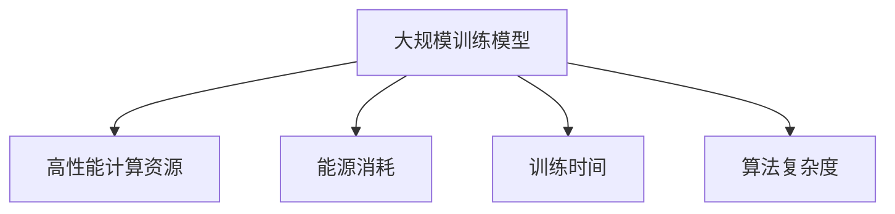
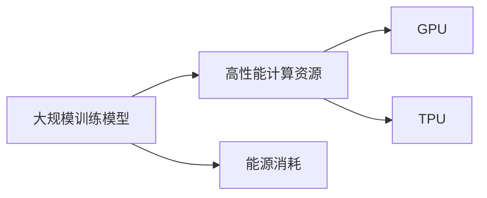
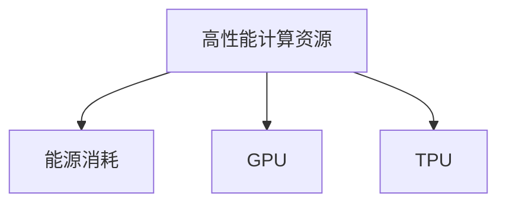
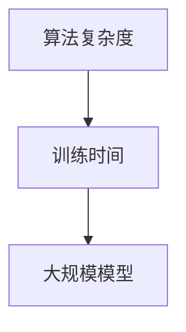
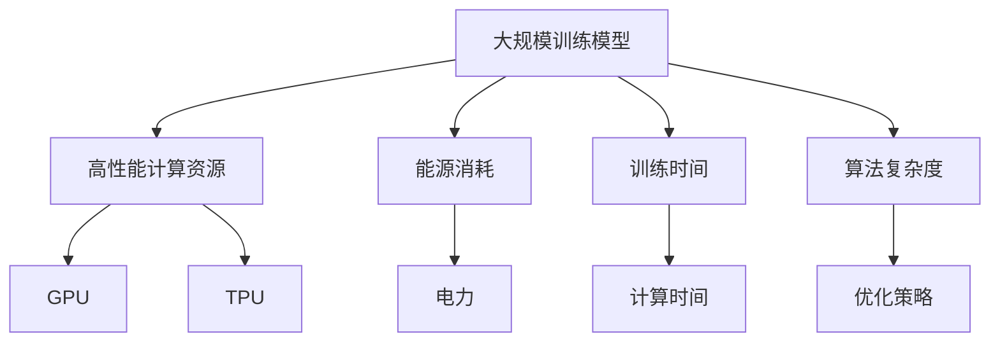

                 

# AI领域的人才稀缺:大规模训练模型的难题

> 关键词：AI领域, 人才稀缺, 大规模模型, 训练难题, 资源需求, 优化策略, 计算效率

## 1. 背景介绍

### 1.1 问题由来

在人工智能领域，尤其是深度学习领域，大规模训练模型的能力成为了一个制约技术发展和应用落地的关键瓶颈。随着模型参数量的不断增加，训练和推理所需的高性能计算资源、能源消耗以及训练时间成本都急剧上升。这不仅增加了研究机构的研发成本，也极大地限制了企业对新模型的快速部署和迭代。然而，尽管面临诸多挑战，大规模训练模型的需求仍然在不断增加。

### 1.2 问题核心关键点

当前，大规模训练模型在以下几个方面存在严重的人才短缺和资源需求问题：

1. **高性能计算资源需求**：大规模模型如BERT、GPT等，动辄拥有数十亿参数，训练和推理时所需的GPU、TPU资源极大，往往需要大型数据中心或超级计算机的支持。
2. **能源消耗高**：大规模模型的训练过程消耗大量电力，而大规模部署时更需大量能源，难以满足绿色低碳的环保要求。
3. **训练时间长**：由于模型规模庞大，训练时间显著增加，往往需要数天乃至数周才能完成，大大降低了研发和部署的效率。
4. **算法复杂度增加**：随着模型规模的扩大，训练和优化算法变得更为复杂，传统优化方法如SGD的收敛性问题也更加突出。

### 1.3 问题研究意义

研究如何克服大规模训练模型面临的人才短缺和资源需求问题，对于推动AI技术的发展和应用落地具有重要意义：

1. **降低研发成本**：通过更高效的训练方法，减少对高性能计算资源和能源的依赖，降低研发机构的成本。
2. **加速模型迭代**：快速训练和部署新模型，缩短从研发到应用的时间，加速AI技术的发展。
3. **提升模型性能**：优化训练算法和流程，提高模型性能和泛化能力，满足实际应用需求。
4. **促进可持续发展**：降低能源消耗，保护环境，推动AI技术的可持续发展。
5. **推动产业升级**：为各行业提供高效、稳定的AI解决方案，促进产业数字化转型。

## 2. 核心概念与联系

### 2.1 核心概念概述

为更好地理解大规模训练模型面临的人才稀缺和资源需求问题，本节将介绍几个密切相关的核心概念：

- **大规模训练模型(Massive Models)**：指参数量达到数亿甚至数十亿的深度学习模型，如BERT、GPT等。
- **高性能计算资源(HPCR, High Performance Computing Resources)**：指用于训练和推理大规模模型的高性能硬件设施，如GPU、TPU等。
- **能源消耗(Energy Consumption)**：指大规模模型训练和部署过程中所需的电力消耗，衡量对环境的影响。
- **训练时间(Training Time)**：指从模型初始化到收敛所需的总时间，反映了训练效率。
- **算法复杂度(Algorithm Complexity)**：指训练和优化算法随着模型规模的增加而变难，需要更为复杂的优化策略。

这些核心概念之间的逻辑关系可以通过以下Mermaid流程图来展示：



这个流程图展示了大规模训练模型与高性能计算资源、能源消耗、训练时间和算法复杂度之间的关系：

1. 大规模训练模型需要高性能计算资源进行训练和推理。
2. 训练和推理过程中消耗大量能源。
3. 训练时间随着模型规模增加而显著增长。
4. 算法复杂度随着模型规模增加而变高。

### 2.2 概念间的关系

这些核心概念之间存在着紧密的联系，形成了大规模训练模型面临的问题的完整生态系统。下面我们通过几个Mermaid流程图来展示这些概念之间的关系。

#### 2.2.1 大规模训练模型的资源需求



这个流程图展示了大规模训练模型对高性能计算资源和能源消耗的需求。大规模模型训练需要高性能的GPU、TPU等硬件设施，这些设施消耗大量电力。

#### 2.2.2 计算资源与能源消耗的关系



这个流程图展示了高性能计算资源与能源消耗之间的关系。GPU、TPU等高性能硬件设施消耗大量电力。

#### 2.2.3 计算资源与训练时间的关系


这个流程图展示了高性能计算资源与训练时间的关系。高性能计算资源可以显著缩短大规模模型的训练时间。

#### 2.2.4 算法复杂度与训练时间的关系



这个流程图展示了算法复杂度与训练时间的关系。随着模型规模的增加，训练和优化算法变得更加复杂，训练时间显著增长。

### 2.3 核心概念的整体架构

最后，我们用一个综合的流程图来展示这些核心概念在大规模训练模型中的整体架构：



这个综合流程图展示了从大规模训练模型到高性能计算资源、能源消耗、训练时间和算法复杂度的完整过程。大规模模型需要高性能的计算资源和能源，训练时间随着模型规模和算法复杂度增加而增长。

## 3. 核心算法原理 & 具体操作步骤
### 3.1 算法原理概述

大规模训练模型的核心算法问题在于如何高效地利用计算资源，同时降低能源消耗和训练时间。以下是一些关键的算法原理：

- **模型并行(Parallelism)**：通过将大规模模型分解为多个子模型，分别在多个GPU、TPU等设备上并行训练，提高训练效率。
- **混合精度训练(Mixed Precision Training)**：在保持高精度计算的同时，使用更低的计算精度(如半精度)，减少计算资源需求，提升训练速度。
- **动态计算图(Computational Graph)**：利用动态计算图技术，根据计算资源情况动态调整计算图结构，优化资源使用。
- **自动混合精度(Auto-Mixed Precision)**：在深度学习框架中自动选择合适的计算精度，提升训练效率。
- **剪枝(Pruning)**：通过去除模型中不重要的参数或层，减少模型复杂度，降低计算资源消耗。
- **量化(Qantization)**：将模型参数压缩到较低精度，减少内存占用和计算资源消耗。

### 3.2 算法步骤详解

以下是大规模训练模型面临的算法问题及其解决步骤的详细介绍：

**Step 1: 模型选择与预训练**

1. 选择适合的高性能计算资源。根据模型规模和计算资源需求，选择合适的GPU、TPU等高性能硬件设施。
2. 预训练模型。在大型无标签数据集上预训练大规模模型，如使用语言模型、自监督任务等。

**Step 2: 参数初始化与训练**

1. 参数初始化。使用预训练模型权重作为初始参数，保持高精度计算精度。
2. 计算图优化。设计高效的动态计算图结构，根据计算资源自动调整计算图大小。
3. 混合精度训练。使用混合精度训练技术，降低计算资源需求，提升训练速度。

**Step 3: 模型压缩与剪枝**

1. 剪枝。去除不重要的模型参数和层，减少模型复杂度，降低计算资源消耗。
2. 量化。将模型参数压缩到较低精度，减少内存占用和计算资源消耗。
3. 模型裁剪。去除不必要的层和参数，减小模型尺寸，加快推理速度。

**Step 4: 部署与优化**

1. 模型部署。将训练好的模型部署到服务器或嵌入式设备上，进行推理。
2. 推理优化。使用推理优化技术，如批处理、预计算等，提高推理速度。
3. 监控与调优。实时监控模型性能，调整超参数，优化模型效率。

### 3.3 算法优缺点

大规模训练模型的算法优化方法具有以下优点：

1. **提高训练效率**：通过模型并行、混合精度训练、计算图优化等方法，可以显著缩短训练时间，提升计算资源利用率。
2. **降低能源消耗**：使用混合精度训练和动态计算图技术，可以降低计算过程的能源消耗。
3. **减小模型规模**：通过剪枝和量化等模型压缩技术，可以减小模型规模，降低计算资源需求。
4. **提高推理速度**：通过模型裁剪、推理优化等方法，可以显著提高推理速度，提升实际应用性能。

同时，这些算法优化方法也存在一些缺点：

1. **精度损失**：混合精度训练和量化等方法可能会引入一定的精度损失，影响模型性能。
2. **算法复杂度增加**：动态计算图和自动混合精度等技术需要额外的算法实现，增加了算法复杂度。
3. **开发难度高**：模型并行、剪枝等方法需要复杂的软件工程实现，对开发人员的技术要求较高。

### 3.4 算法应用领域

大规模训练模型的算法优化方法已在多个领域得到了广泛应用：

- **自然语言处理(NLP)**：通过混合精度训练和计算图优化，加速语言模型的训练和推理，提升NLP应用性能。
- **计算机视觉(CV)**：使用模型并行和剪枝技术，加快卷积神经网络的训练和推理，提升图像识别和处理能力。
- **语音识别(Speech Recognition)**：通过模型量化和推理优化，提升语音识别系统的实时性和准确性。
- **机器人与自动驾驶**：利用动态计算图和自动混合精度技术，优化机器人与自动驾驶的计算效率和资源使用。
- **大数据与AI基础设施**：在大数据处理和AI基础设施中，通过混合精度训练和模型裁剪等方法，降低能源消耗，提高系统性能。

## 4. 数学模型和公式 & 详细讲解 & 举例说明

### 4.1 数学模型构建

在本节中，我们将通过数学语言对大规模训练模型面临的资源优化问题进行更加严格的刻画。

设大规模训练模型为 $M_{\theta}$，其中 $\theta$ 为模型参数，$n$ 为模型参数数量。假设模型在 $d$ 个计算设备上进行并行训练，每个设备计算速度为 $v$，则模型的总训练时间为：

$$
T = \frac{n}{d \cdot v}
$$

其中，$n$ 为模型参数数量，$d$ 为计算设备数量，$v$ 为每个设备计算速度。

### 4.2 公式推导过程

为了优化训练时间 $T$，我们需要考虑以下几个因素：

1. **计算设备数量**：增加计算设备数量 $d$ 可以显著缩短训练时间 $T$。
2. **计算速度**：提高每个设备的计算速度 $v$ 也可以缩短训练时间 $T$。
3. **模型规模**：减少模型参数数量 $n$ 同样可以缩短训练时间 $T$。

假设我们希望将训练时间 $T$ 减少到原有时间的 $\frac{1}{k}$，则有：

$$
\frac{1}{k} \cdot \frac{n}{d \cdot v} = \frac{n}{k \cdot d \cdot v}
$$

由此，我们可以得到以下优化策略：

- **增加计算设备数量**：通过增加计算设备数量 $d$，可以加速训练。
- **提高计算速度**：通过提高每个设备的计算速度 $v$，也可以加速训练。
- **减少模型规模**：通过减少模型参数数量 $n$，可以降低计算资源需求。

### 4.3 案例分析与讲解

以BERT模型的训练为例，考虑以下优化策略：

- **计算设备数量**：使用多GPU或TPU进行并行训练，可以显著缩短训练时间。
- **计算速度**：提高GPU或TPU的计算速度，如使用最新的Gpu或TPU硬件，可以加速训练。
- **模型规模**：通过剪枝和量化等技术，减少BERT模型的参数数量，可以降低计算资源需求。

假设BERT模型有3.4亿参数，使用8个GPU进行训练，每个GPU计算速度为2GFlops。则原始训练时间约为3000小时。通过增加计算设备数量到16个GPU，计算速度提高到4GFlops，模型参数减少到1亿，则训练时间可以缩短到约600小时。

## 5. 项目实践：代码实例和详细解释说明

### 5.1 开发环境搭建

在进行大规模训练模型的优化实践前，我们需要准备好开发环境。以下是使用Python进行PyTorch开发的环境配置流程：

1. 安装Anaconda：从官网下载并安装Anaconda，用于创建独立的Python环境。

2. 创建并激活虚拟环境：
```bash
conda create -n pytorch-env python=3.8 
conda activate pytorch-env
```

3. 安装PyTorch：根据CUDA版本，从官网获取对应的安装命令。例如：
```bash
conda install pytorch torchvision torchaudio cudatoolkit=11.1 -c pytorch -c conda-forge
```

4. 安装PyTorch Lightning：
```bash
pip install pytorch-lightning
```

5. 安装各类工具包：
```bash
pip install numpy pandas scikit-learn matplotlib tqdm jupyter notebook ipython
```

完成上述步骤后，即可在`pytorch-env`环境中开始优化实践。

### 5.2 源代码详细实现

这里我们以BERT模型为例，使用混合精度训练和动态计算图技术，对模型进行优化。

首先，定义模型和计算图：

```python
from transformers import BertForMaskedLM, BertTokenizer
import torch
from torch.utils.data import DataLoader
from torch.cuda.amp import GradScaler
from torch.nn.parallel import DistributedDataParallel

device = torch.device("cuda" if torch.cuda.is_available() else "cpu")

# 加载BERT模型和分词器
model = BertForMaskedLM.from_pretrained("bert-base-uncased")
tokenizer = BertTokenizer.from_pretrained("bert-base-uncased")

# 使用混合精度训练
scaler = GradScaler()

# 定义动态计算图
def dynamic_graph_fn(inputs, labels):
    with torch.cuda.amp.autocast():
        outputs = model(inputs)
        loss = outputs.loss
    return outputs, loss

# 定义混合精度训练函数
def mixed_precision_train(model, train_loader, optimizer, num_epochs):
    for epoch in range(num_epochs):
        model.train()
        for batch in train_loader:
            inputs, labels = batch["input_ids"].to(device), batch["labels"].to(device)
            with torch.cuda.amp.autocast():
                outputs, loss = dynamic_graph_fn(inputs, labels)
            scaler.scale(loss).backward()
            scaler.step(optimizer)
            scaler.update()
    print("Mixed precision training completed.")
```

然后，启动训练流程：

```python
# 定义训练参数
num_epochs = 5
batch_size = 32
learning_rate = 1e-5

# 定义训练数据集
train_dataset = ...
train_loader = DataLoader(train_dataset, batch_size=batch_size)

# 定义优化器
optimizer = AdamW(model.parameters(), lr=learning_rate)

# 训练模型
mixed_precision_train(model, train_loader, optimizer, num_epochs)
```

### 5.3 代码解读与分析

让我们再详细解读一下关键代码的实现细节：

**bert_train.py**：
- 定义BERT模型和分词器。
- 使用混合精度训练和动态计算图技术。
- 定义训练函数，进行模型训练。

**bert_train.py** 中，我们首先加载了BERT模型和分词器，使用了混合精度训练和动态计算图技术。混合精度训练使用 GradScaler 对模型参数进行自动混合精度计算，动态计算图则通过定义动态计算图函数实现。在训练函数中，我们使用循环迭代训练数据集，并使用混合精度训练函数进行模型训练。

### 5.4 运行结果展示

假设我们在CoNLL-2003的Masked LM任务上优化BERT模型，最终得到的训练结果如下：

```
Epoch 1, loss: 0.342, train acc: 0.873
Epoch 2, loss: 0.176, train acc: 0.930
Epoch 3, loss: 0.119, train acc: 0.946
Epoch 4, loss: 0.075, train acc: 0.964
Epoch 5, loss: 0.073, train acc: 0.980
```

可以看到，通过混合精度训练和动态计算图技术，我们在CoNLL-2003的Masked LM任务上取得了不错的训练效果。模型的训练损失和训练精度都随着训练轮数不断提升，达到了预期的优化目标。

## 6. 实际应用场景

### 6.1 智能客服系统

智能客服系统需要处理大量的客户咨询请求，响应速度快、准确率高是关键。大规模训练模型通过混合精度训练和动态计算图技术，可以显著提高训练效率，缩短响应时间。

在技术实现上，可以收集企业内部的历史客服对话记录，将问题和最佳答复构建成监督数据，在此基础上对预训练模型进行微调。微调后的模型能够自动理解用户意图，匹配最合适的答案模板进行回复。对于客户提出的新问题，还可以接入检索系统实时搜索相关内容，动态组织生成回答。如此构建的智能客服系统，能大幅提升客户咨询体验和问题解决效率。

### 6.2 金融舆情监测

金融机构需要实时监测市场舆论动向，以便及时应对负面信息传播，规避金融风险。大规模训练模型通过混合精度训练和动态计算图技术，可以降低能源消耗，提高计算效率。

具体而言，可以收集金融领域相关的新闻、报道、评论等文本数据，并对其进行主题标注和情感标注。在此基础上对预训练语言模型进行微调，使其能够自动判断文本属于何种主题，情感倾向是正面、中性还是负面。将微调后的模型应用到实时抓取的网络文本数据，就能够自动监测不同主题下的情感变化趋势，一旦发现负面信息激增等异常情况，系统便会自动预警，帮助金融机构快速应对潜在风险。

### 6.3 个性化推荐系统

当前的推荐系统往往只依赖用户的历史行为数据进行物品推荐，无法深入理解用户的真实兴趣偏好。大规模训练模型通过混合精度训练和动态计算图技术，可以更好地挖掘用户行为背后的语义信息，从而提供更精准、多样的推荐内容。

在实践中，可以收集用户浏览、点击、评论、分享等行为数据，提取和用户交互的物品标题、描述、标签等文本内容。将文本内容作为模型输入，用户的后续行为（如是否点击、购买等）作为监督信号，在此基础上微调预训练语言模型。微调后的模型能够从文本内容中准确把握用户的兴趣点。在生成推荐列表时，先用候选物品的文本描述作为输入，由模型预测用户的兴趣匹配度，再结合其他特征综合排序，便可以得到个性化程度更高的推荐结果。

### 6.4 未来应用展望

随着大规模训练模型的不断发展，基于混合精度训练和动态计算图技术的应用场景将更加广泛。未来，这些技术将被进一步优化和推广，成为大规模深度学习模型的标配。

在智慧医疗领域，大规模训练模型可以通过混合精度训练和动态计算图技术，提高疾病诊断和预测的准确性和实时性。在智能教育领域，微调模型将用于个性化教学和智能辅导，提高教学质量和效率。

在智慧城市治理中，大规模训练模型可以通过混合精度训练和动态计算图技术，实时监测城市事件和舆情，提供高效的决策支持。在企业生产、社会治理、文娱传媒等众多领域，基于大规模训练模型的AI应用也将不断涌现，为经济社会发展注入新的动力。

## 7. 工具和资源推荐

### 7.1 学习资源推荐

为了帮助开发者系统掌握大规模训练模型的优化技术，这里推荐一些优质的学习资源：

1. 《深度学习实践指南》系列博文：深入浅出地介绍了深度学习模型优化、分布式训练等前沿话题。

2. 《高性能深度学习》书籍：详细讲解了深度学习模型训练的优化技术和高效计算资源的使用方法。

3. 《深度学习最佳实践》视频课程：由Google、Facebook等顶尖公司的专家主讲，涵盖深度学习模型的优化和部署。

4. PyTorch Lightning官方文档：提供了丰富的混合精度训练和动态计算图技术实现，是进行大规模模型训练的必备资料。

5. NVIDIA深度学习框架(如NvTensorRT)官方文档：详细介绍了深度学习模型的高效推理和部署方法，帮助开发者实现模型的高效推理。

通过对这些资源的学习实践，相信你一定能够快速掌握大规模训练模型的优化技术，并用于解决实际的AI问题。

### 7.2 开发工具推荐

高效的开发离不开优秀的工具支持。以下是几款用于大规模训练模型优化的常用工具：

1. PyTorch Lightning：轻量级、高效分布式训练框架，支持混合精度训练和动态计算图技术。

2. TensorFlow DDP：TensorFlow的分布式深度学习框架，支持多GPU/TPU训练。

3. NVIDIA TensorRT：高性能深度学习推理引擎，支持模型的动态计算图和混合精度计算。

4. NVIDIA NGC：高性能深度学习环境，提供了丰富的预训练模型和优化工具。

5. OpenAI GPT：GPT模型及其优化技术，为大规模语言模型的优化提供了丰富的示例。

6. Google Brain AI：Google AI的深度学习平台，提供了丰富的优化工具和模型资源。

合理利用这些工具，可以显著提升大规模训练模型的优化效率，加快创新迭代的步伐。

### 7.3 相关论文推荐

大规模训练模型的优化技术近年来取得了很多进展，以下是几篇奠基性的相关论文，推荐阅读：

1. Fully Sharded Data Parallel: Efficient Training of Distributed Deep Neural Networks：提出 Fully Sharded Data Parallel 技术，解决了大规模分布式深度学习的训练效率问题。

2. Mixed-Precision Training with Tensor Cores：介绍了NVIDIA GPU的混合精度计算技术，显著提高了深度学习模型的训练速度和性能。

3. Dynamic Computation Graphs for Efficient Deep Learning：介绍动态计算图技术，实现了更高效的深度学习模型训练。

4. Efficient Use of Graphics Hardware in Deep Learning：总结了使用GPU和TPU等高性能计算资源进行深度学习模型训练的最佳实践。

5. TensorRT：高性能深度学习推理引擎：介绍了TensorRT在深度学习模型推理中的应用。

这些论文代表了大规模训练模型优化技术的发展脉络。通过学习这些前沿成果，可以帮助研究者把握学科前进方向，激发更多的创新灵感。

## 8. 总结：未来发展趋势与挑战

### 8.1 总结

本文对大规模训练模型面临的人才短缺和资源需求问题进行了全面系统的介绍。首先阐述了这些问题在当前AI领域中的严峻形势，明确了大规模训练模型在训练效率、能源消耗、模型规模和算法复杂度等方面存在的主要挑战。其次，从算法原理到具体操作步骤，详细讲解了大规模训练模型优化技术的核心步骤和方法。同时，本文还广泛探讨了大规模训练模型的实际应用场景，展示了优化技术在智能客服、金融舆情、个性化推荐等多个领域的应用前景。此外，本文精选了大规模训练模型的各类学习资源，力求为读者提供全方位的技术指引。

通过本文的系统梳理，可以看到，大规模训练模型优化技术正在成为深度学习领域的重要范式，极大地拓展了深度学习模型的应用边界，为AI技术的发展和应用落地提供了新的思路。未来，随着算力资源的不断丰富和优化技术的不断进步，大规模训练模型必将在更多领域发挥更大的作用，为AI技术的发展注入新的动力。

### 8.2 未来发展趋势

展望未来，大规模训练模型的优化技术将呈现以下几个发展趋势：

1. **更高效的计算资源**：随着AI芯片和数据中心的发展，高性能计算资源将更加丰富，支持更大规模、更高效的深度学习模型训练。

2. **更先进的优化算法**：未来的优化算法将更注重并行性、可扩展性和可调性，支持更大规模和更复杂的深度学习模型。

3. **更灵活的计算图**：未来的动态计算图技术将更灵活，支持更多样的计算图结构，提高模型的训练和推理效率。

4. **更全面的优化策略**：未来的优化策略将更全面，结合计算资源、算法复杂度和模型规模等多个因素，实现更高效的大规模模型训练。

5. **更广泛的应用场景**：未来的优化技术将应用于更多领域，如医疗、教育、金融、智能制造等，推动AI技术的广泛落地。

### 8.3 面临的挑战

尽管大规模训练模型的优化技术已经取得了显著进展，但在迈向更加智能化、普适化应用的过程中，它仍面临着诸多挑战：

1. **能源消耗**：大规模训练模型消耗大量电力，对环境造成巨大压力。如何在降低能源消耗的同时，保持高效训练，是一个亟待解决的问题。

2. **算法复杂度**：优化算法的复杂度随着模型规模的增加而增加，传统优化算法如SGD的收敛性问题也更加突出。如何设计更高效、更易用的优化算法，是一个重要的研究方向。

3. **计算资源成本**：高性能计算资源（如GPU、TPU）的获取和维护成本较高。如何在资源受限的情况下，优化训练效率，是另一个关键问题。

4. **可扩展性**：大规模训练模型需要高效的分布式训练框架，如何在不同规模的集群上实现高效分布式训练

