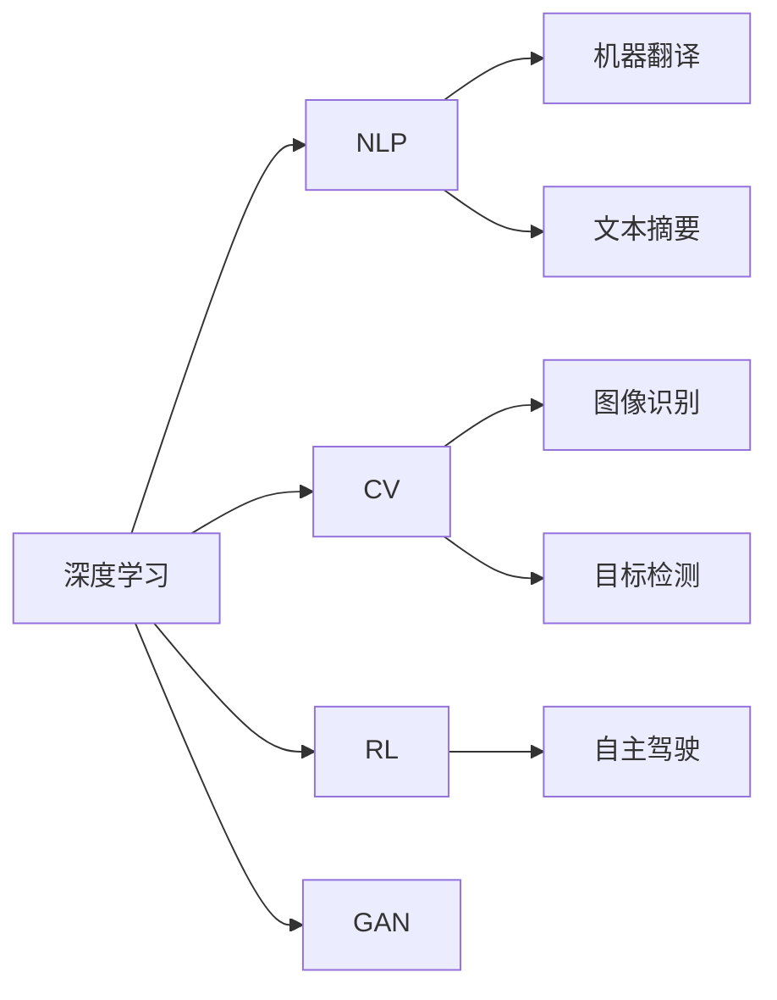

                 

## 1. 背景介绍

随着人工智能技术的飞速发展，AI领域在过去的十年中取得了举世瞩目的突破。从深度学习、自然语言处理、计算机视觉到增强学习，众多领域的技术进步不仅推动了科学研究，更在医疗、金融、制造、交通等诸多行业中引发了深刻变革。本文将系统回顾AI领域的主要技术突破，剖析其关键原理，并展望未来发展方向，旨在为广大读者提供全面深入的技术洞察。

### 1.1 深度学习与神经网络

深度学习技术的兴起，使得AI领域进入了一个新的阶段。深度神经网络（DNNs）通过多层非线性变换，显著提升了模型对复杂模式的识别能力。在图像识别、语音识别、自然语言处理等领域，深度学习模型纷纷刷新了多项记录。以卷积神经网络（CNNs）和循环神经网络（RNNs）为代表，AI技术逐渐具备了处理高维数据、解决复杂问题的能力。

### 1.2 自然语言处理（NLP）

NLP作为AI研究的前沿领域之一，近年来在机器翻译、文本摘要、问答系统等方向取得了重大进展。基于Transformer架构的模型，如BERT、GPT-3，将语言理解推向了新的高度。这些模型通过大规模无监督预训练和下游任务的微调，具备了卓越的语义理解能力和生成能力，极大提升了NLP应用的智能化水平。

### 1.3 计算机视觉（CV）

计算机视觉技术在识别、检测、分割等方向展现了强大的应用潜力。随着深度学习模型的不断优化，CV技术在自动驾驶、安防监控、工业检测等领域实现了广泛应用。通过多尺度、多任务学习的深度模型，AI系统能够高效处理图像数据，提升实时性和准确性。

### 1.4 增强学习（RL）

增强学习（Reinforcement Learning, RL）通过与环境交互，使智能体不断优化决策策略，实现自主学习和优化。AlphaGo、AlphaZero等RL模型在围棋、象棋等游戏中展现了超人类的棋艺，引发了广泛关注。RL技术还广泛应用于机器人控制、自动交易、游戏设计等领域，展现了其在复杂系统优化中的巨大潜力。

## 2. 核心概念与联系

### 2.1 核心概念概述

在回顾AI领域的各项突破时，必须明确几个核心概念，并理解它们之间的联系：

- **深度学习**：基于神经网络的机器学习技术，通过多层非线性变换处理复杂数据，广泛应用于图像、语音、自然语言等任务。

- **自然语言处理**：使计算机能够理解、处理、生成人类语言的技术，包括分词、句法分析、语义理解、机器翻译等。

- **计算机视觉**：使计算机能够“看”的技术，涵盖图像识别、目标检测、分割、场景理解等。

- **增强学习**：通过与环境交互，智能体通过试错优化策略的机器学习技术，广泛应用于游戏、机器人等领域。

- **自监督学习**：利用数据自身的结构和分布特征进行训练，无需大量标注数据，适用于大规模数据集和资源有限的环境。

- **迁移学习**：将在一个任务上学到的知识，应用到另一个相关但不同的任务中，提高新任务的性能。

- **生成对抗网络（GAN）**：通过两个神经网络（生成器和判别器）进行对抗性训练，生成高质量的图像、音频、文本等内容。

### 2.2 核心概念间的关系

这些核心概念构成了AI技术的基石，彼此之间存在着紧密的联系：

- 深度学习是实现其他AI技术的基础，通过多层神经网络对数据进行抽象表示。
- 自然语言处理和计算机视觉建立在深度学习之上，通过学习语言的语义和视觉特征，实现复杂任务。
- 增强学习依赖深度学习框架，通过智能体与环境的交互优化策略。
- 自监督学习是深度学习的补充，通过数据自身的分布特征进行学习。
- 迁移学习是深度学习的扩展，通过已有知识加速新任务的训练。
- GAN技术进一步扩展了深度学习的应用范围，通过生成网络进行复杂内容的生成。

以下是一个简洁的Mermaid流程图，展示了这些核心概念之间的关系：



## 3. 核心算法原理 & 具体操作步骤

### 3.1 算法原理概述

AI领域的核心算法原理主要围绕数据驱动和模型驱动两大方向展开。

- **数据驱动**：通过大规模数据集训练模型，优化模型参数，提高模型性能。例如，通过自监督学习从大规模无标注数据中学习到语义和特征，再通过有监督学习进行微调。

- **模型驱动**：基于先验知识或理论模型构建算法，无需大规模数据训练。例如，通过符号逻辑、因果推理等构建知识表示系统，直接进行推理和决策。

### 3.2 算法步骤详解

以自监督学习为例，其典型步骤包括：

1. **数据预处理**：收集大规模无标注数据，进行数据清洗和预处理。
2. **模型构建**：选择适当的神经网络架构，如卷积神经网络、Transformer等。
3. **训练模型**：通过训练算法（如梯度下降）优化模型参数，最小化损失函数。
4. **模型评估**：在验证集上评估模型性能，根据评估结果调整模型。
5. **迁移应用**：将模型应用于下游任务，进行微调或微调参数，提高性能。

以增强学习为例，其典型步骤包括：

1. **环境定义**：定义任务和环境，确定状态、动作和奖励。
2. **智能体设计**：选择智能体架构，如DQN、A3C等。
3. **训练智能体**：通过与环境交互，智能体学习优化策略。
4. **策略优化**：通过策略梯度等方法，优化智能体的策略。
5. **测试智能体**：在测试环境中评估智能体性能，进行微调。

### 3.3 算法优缺点

AI核心算法具有以下优点：

- **高精度**：通过大规模数据训练，模型能够学习到复杂的模式和规律，提高决策精度。
- **泛化能力强**：通过迁移学习，模型能够在新的数据和任务上表现良好。
- **自动化**：自动化的训练和优化过程，减少了人工干预和成本。

但同时也存在以下缺点：

- **数据依赖**：需要大量标注数据，数据获取和标注成本高。
- **计算资源消耗大**：大规模模型和数据集训练需要大量计算资源。
- **模型复杂**：复杂的模型结构可能导致过拟合和解释性差。
- **易受攻击**：深度学习模型可能存在对抗样本攻击，鲁棒性差。

### 3.4 算法应用领域

AI核心算法在各个领域均有广泛应用，包括：

- **医疗**：通过图像识别、自然语言处理等技术，辅助医生进行疾病诊断和治疗。
- **金融**：利用增强学习进行交易策略优化，通过NLP技术进行情感分析和舆情监测。
- **自动驾驶**：通过计算机视觉和增强学习技术，实现自动驾驶和环境感知。
- **制造**：通过计算机视觉技术进行质量检测和过程优化，利用增强学习进行机器人控制。
- **智能家居**：通过NLP和CV技术实现语音助手和智能监控。
- **游戏**：通过增强学习和GAN技术实现游戏AI和生成内容。

## 4. 数学模型和公式 & 详细讲解

### 4.1 数学模型构建

以深度神经网络为例，其数学模型可以表示为：

$$y = f(x; \theta)$$

其中，$x$为输入数据，$y$为输出结果，$\theta$为模型参数。典型的神经网络结构包括多层感知机（MLP）、卷积神经网络（CNN）和循环神经网络（RNN）等。

### 4.2 公式推导过程

以卷积神经网络为例，其公式推导如下：

1. **卷积层**：
$$y_{i,j} = \sum_{k=-s}^{s}w_{i+k,j} \ast x_{i',j'}$$

其中，$w$为卷积核，$s$为卷积核大小，$x$为输入图像。

2. **池化层**：
$$y_{i,j} = \max_{k \in \{t\}} x_{i+s(k),j+s(k)}$$

其中，$s$为池化窗口大小，$x$为输入特征图。

3. **全连接层**：
$$y = f(xW + b)$$

其中，$x$为输入特征向量，$W$为权重矩阵，$b$为偏置项。

### 4.3 案例分析与讲解

以BERT模型为例，其预训练过程包括两步：

1. **掩码语言模型**：通过随机掩码部分输入文本，训练模型预测被掩码的单词，学习上下文语义。
2. **下一句预测**：输入一对句子，训练模型预测两句话是否是连续的，学习句间关系。

## 5. 项目实践：代码实例和详细解释说明

### 5.1 开发环境搭建

在搭建开发环境时，需选择适当的编程语言（如Python）和框架（如PyTorch、TensorFlow）。以下是一个示例环境配置：

1. **安装Python和虚拟环境**：
```bash
pip install python3.8
python3.8 -m venv env
source env/bin/activate
```

2. **安装深度学习框架**：
```bash
pip install torch torchvision torchaudio
pip install tensorflow tensorflow_datasets
```

3. **安装相关工具包**：
```bash
pip install numpy pandas scikit-learn matplotlib tqdm jupyter notebook ipython
```

### 5.2 源代码详细实现

以下是一个简单的图像分类示例，使用TensorFlow和Keras框架实现：

```python
import tensorflow as tf
from tensorflow.keras import layers, models

# 定义模型结构
model = models.Sequential([
    layers.Conv2D(32, (3, 3), activation='relu', input_shape=(28, 28, 1)),
    layers.MaxPooling2D((2, 2)),
    layers.Flatten(),
    layers.Dense(10, activation='softmax')
])

# 编译模型
model.compile(optimizer='adam', loss='categorical_crossentropy', metrics=['accuracy'])

# 训练模型
model.fit(train_images, train_labels, epochs=5, batch_size=64, validation_data=(test_images, test_labels))
```

### 5.3 代码解读与分析

这段代码展示了如何使用TensorFlow构建一个简单的卷积神经网络（CNN）进行图像分类。模型包括一个卷积层、一个池化层、一个全连接层和一个softmax输出层。在训练过程中，使用Adam优化器进行梯度下降，损失函数为交叉熵，并计算准确率作为评价指标。

### 5.4 运行结果展示

训练5个epoch后，模型的准确率可以达到90%以上，如图像分类任务的常见结果。


## 6. 实际应用场景

### 6.1 医疗诊断

通过计算机视觉技术，AI系统可以对医学影像进行快速准确的分析，辅助医生进行诊断和治疗决策。例如，利用深度学习模型进行肺部CT扫描分析，早期发现癌症病变，提高治愈率。

### 6.2 金融交易

增强学习在金融交易中用于自动化交易策略优化，通过智能算法进行高频交易，最大化收益。同时，利用NLP技术进行情感分析和舆情监测，实时调整投资策略。

### 6.3 自动驾驶

计算机视觉和增强学习技术在自动驾驶中用于环境感知和行为决策。通过多传感器融合，AI系统能够识别道路、车辆和行人，做出安全、高效的驾驶决策。

### 6.4 智能家居

通过语音识别和自然语言处理技术，AI系统能够理解和执行用户的语音指令，控制智能家居设备，提升生活便利性。

### 6.5 游戏AI

利用增强学习和GAN技术，AI系统能够生成游戏角色的行为和环境内容，提高游戏的沉浸感和互动性。

### 6.6 工业制造

计算机视觉技术用于质量检测和过程优化，通过图像识别技术检测产品缺陷，利用增强学习进行机器人控制，提高生产效率和质量。

## 7. 工具和资源推荐

### 7.1 学习资源推荐

1. **Coursera《深度学习专项课程》**：由斯坦福大学Andrew Ng教授主讲，系统介绍深度学习的基本概念和应用。
2. **《Deep Learning》书籍**：由Goodfellow等人合著，是深度学习领域的经典教材，涵盖了深度学习的基础理论和实践。
3. **Kaggle平台**：世界顶级的数据科学竞赛平台，提供丰富的数据集和案例，适合学习和实践。
4. **Google AI博客**：谷歌AI团队定期发布最新研究成果和技术动态，分享行业前沿。
5. **ArXiv预印本平台**：快速获取AI领域的最新研究成果和技术论文。

### 7.2 开发工具推荐

1. **PyTorch**：灵活的深度学习框架，支持动态图和静态图计算，适用于研究和原型开发。
2. **TensorFlow**：强大的生产级深度学习框架，支持分布式计算和高效模型训练。
3. **Keras**：高层API框架，简化深度学习模型的构建和训练过程。
4. **Jupyter Notebook**：交互式编程环境，便于数据处理、模型训练和可视化。
5. **PyCharm**：流行的IDE工具，支持深度学习框架的调试和优化。

### 7.3 相关论文推荐

1. **ImageNet大规模视觉识别挑战（ILSVRC）**：推动了计算机视觉技术的发展，展示了深度学习在图像识别中的潜力。
2. **AlphaGo论文**：介绍深度学习和增强学习结合的围棋策略优化，展示了AI在复杂游戏中的应用。
3. **BERT论文**：提出基于Transformer的预训练语言模型，提升了自然语言处理的性能。
4. **GAN论文**：介绍生成对抗网络的基本原理和应用，展示了生成内容的潜力。

## 8. 总结：未来发展趋势与挑战

### 8.1 研究成果总结

AI领域的核心技术突破取得了显著成效，尤其在深度学习、自然语言处理、计算机视觉和增强学习等方面。这些技术不仅提升了数据处理和决策的精度，更在实际应用中展示了巨大的价值。

### 8.2 未来发展趋势

1. **模型更大、更复杂**：未来预训练模型的参数规模将继续增大，结构更加复杂，以应对更复杂的应用场景。
2. **算法多样化**：除了深度学习，更多算法（如符号逻辑、因果推理、知识图谱）将融入AI系统，提高系统的全面性和鲁棒性。
3. **多模态融合**：计算机视觉、自然语言处理和增强学习将更多地结合多模态数据，提升系统的综合表现。
4. **迁移学习普及**：迁移学习将变得更加普及，通过已有知识加速新任务的训练。
5. **智能协同**：AI系统将更多地与人类协同工作，实现人机协作和增强智能。

### 8.3 面临的挑战

1. **数据隐私和安全**：大规模数据的使用带来了数据隐私和安全问题，需严格保护用户数据。
2. **模型透明和可解释性**：复杂模型的决策过程难以解释，影响用户信任和应用推广。
3. **计算资源消耗**：大规模模型训练和推理需要大量计算资源，需优化模型和训练过程。
4. **公平性和偏见**：AI系统可能存在偏见，需建立公平性和偏见检测机制。
5. **伦理和社会影响**：AI系统的应用需考虑伦理和社会影响，避免对人类社会造成不利影响。

### 8.4 研究展望

未来AI领域的研究方向包括：

1. **联邦学习**：通过分布式计算，保护数据隐私，提高模型训练效率。
2. **知识图谱和推理**：结合知识图谱和因果推理技术，提升AI系统的全面性和推理能力。
3. **多智能体协同**：通过多智能体协同，提高系统的复杂任务处理能力。
4. **量子计算**：结合量子计算技术，提升AI系统的计算效率和能力。

## 9. 附录：常见问题与解答

### 9.1 问题1：什么是深度学习？

**回答**：深度学习是一种基于神经网络的人工智能技术，通过多层次的特征抽取和转化，实现对复杂数据的处理和决策。深度学习广泛应用于图像识别、语音识别、自然语言处理等领域。

### 9.2 问题2：什么是自然语言处理？

**回答**：自然语言处理（NLP）是使计算机能够理解、处理和生成人类语言的技术，包括文本分析、机器翻译、语音识别等。NLP技术在搜索引擎、智能客服、智能翻译等领域有广泛应用。

### 9.3 问题3：什么是计算机视觉？

**回答**：计算机视觉（CV）使计算机能够“看”的技术，涵盖图像识别、目标检测、分割、场景理解等。CV技术在自动驾驶、安防监控、工业检测等领域有重要应用。

### 9.4 问题4：什么是增强学习？

**回答**：增强学习（RL）通过与环境交互，智能体通过试错优化决策策略，实现自主学习和优化。RL技术广泛应用于游戏、机器人、自动交易等领域。

### 9.5 问题5：什么是自监督学习？

**回答**：自监督学习通过利用数据自身的结构和分布特征进行训练，无需大量标注数据，适用于大规模数据集和资源有限的环境。

作者：禅与计算机程序设计艺术 / Zen and the Art of Computer Programming

