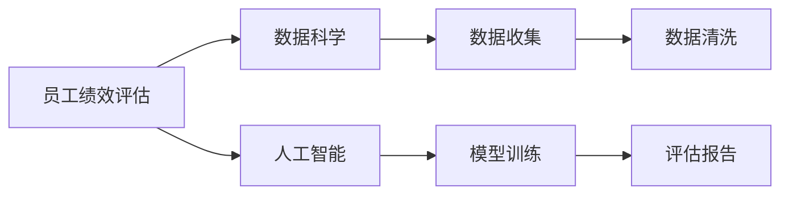
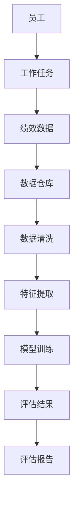
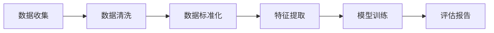
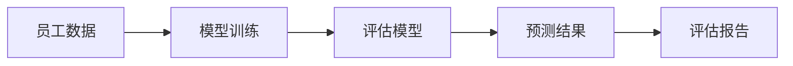

                 

# AI驱动的员工绩效评估系统

> 关键词：员工绩效评估, 人工智能, 数据分析, 机器学习, 数据科学, 自动化

## 1. 背景介绍

### 1.1 问题由来
随着企业规模的不断扩大，人力资源管理的复杂度也在逐步提升。对于如何公平、准确地评估员工绩效，已经成为企业管理的一大难题。传统的人工绩效评估方法，如年度考评、360度反馈等，由于依赖大量主观评价，容易出现评价不公、偏误、偏重等现象。而自动化的员工绩效评估系统，通过引入人工智能和大数据分析技术，能够有效解决这些挑战，提高评估的客观性和准确性。

### 1.2 问题核心关键点
AI驱动的员工绩效评估系统，旨在通过大数据分析和机器学习技术，自动收集、处理和分析员工的各项表现数据，包括日常工作任务完成情况、项目表现、团队协作等，生成客观的绩效评估报告。这一系统主要解决以下核心问题：
- 数据收集：如何自动、全面地收集员工的工作数据？
- 数据处理：如何对收集到的数据进行清洗、标准化、特征提取等处理？
- 模型训练：如何构建合理的评估模型，准确预测员工绩效？
- 评估报告：如何生成个性化、易读的绩效评估报告？

### 1.3 问题研究意义
构建AI驱动的员工绩效评估系统，具有以下重要意义：
- 提高效率：自动化的绩效评估过程可以大幅度减少人力资源部门的负担，提升管理效率。
- 提升公平性：机器学习模型通过数据分析，能够有效减少主观评价的影响，保证评估的客观公正。
- 强化激励：根据自动化的评估结果，企业可以更加精准地进行激励分配，激励员工的积极性。
- 改善决策：通过数据驱动的评估系统，管理层可以获得更全面的员工表现信息，辅助做出更科学的决策。
- 促进发展：AI系统可以识别员工的技能差距和发展潜力，提供个性化的培训建议，帮助员工成长。

## 2. 核心概念与联系

### 2.1 核心概念概述

为更好地理解AI驱动的员工绩效评估系统，本节将介绍几个密切相关的核心概念：

- **员工绩效评估**：对员工在一定时期内的工作表现进行量化评估，包括工作任务完成情况、项目贡献、团队协作、创新能力等。
- **数据科学**：使用统计学、机器学习和数据挖掘技术，从数据中发现知识和规律，辅助决策和改进。
- **人工智能**：通过机器学习、深度学习等技术，让计算机具备类似人类的智能，包括感知、学习、推理等能力。
- **机器学习**：通过数据训练模型，使模型能够对新的输入数据进行预测和决策。
- **自动化**：使用计算机程序和系统，自动执行一系列复杂的任务，提升工作效率和准确性。

这些核心概念之间的逻辑关系可以通过以下Mermaid流程图来展示：



这个流程图展示了大语言模型微调过程中各个核心概念的关系和作用：

1. 员工绩效评估是核心任务，数据科学和人工智能是实现评估的技术手段。
2. 数据收集是评估的基础，通过自动化手段采集全面、准确的数据。
3. 数据科学用于数据处理和特征提取，为模型训练提供高质量数据。
4. 机器学习用于构建评估模型，生成预测结果。
5. 评估报告是最终输出，将模型的预测结果转换为易读的报告，供管理层决策。

### 2.2 概念间的关系

这些核心概念之间存在着紧密的联系，形成了员工绩效评估系统的完整生态系统。下面我通过几个Mermaid流程图来展示这些概念之间的关系。

#### 2.2.1 员工绩效评估的完整流程



这个流程图展示了员工绩效评估的完整流程，从员工的工作任务到最终的评估报告，每一个环节都离不开数据科学和人工智能的支持。

#### 2.2.2 数据科学在绩效评估中的作用



这个流程图展示了数据科学在绩效评估中的具体作用，数据清洗、标准化和特征提取等预处理过程是模型训练的前提，而评估报告的生成则依赖于模型训练的预测结果。

#### 2.2.3 人工智能在绩效评估中的应用



这个流程图展示了人工智能在绩效评估中的应用，通过模型训练得到的评估模型，可以对员工数据进行预测，生成最终的评估报告。

### 2.3 核心概念的整体架构

最后，我们用一个综合的流程图来展示这些核心概念在大语言模型微调过程中的整体架构：


这个综合流程图展示了从员工数据到评估报告的完整流程，数据科学和人工智能在此过程中起到了关键作用。通过这些流程，员工绩效评估系统能够高效、准确地完成评估任务，为企业管理提供有力支持。

## 3. 核心算法原理 & 具体操作步骤

### 3.1 算法原理概述

AI驱动的员工绩效评估系统，主要是基于机器学习模型对员工数据进行建模和预测。其核心算法包括数据预处理、特征工程、模型训练和评估报告生成等步骤。

- **数据预处理**：对员工绩效数据进行清洗、标准化、缺失值处理等预处理操作。
- **特征工程**：从原始数据中提取、构造、选择有用的特征，增强模型的预测能力。
- **模型训练**：使用历史绩效数据训练评估模型，使其能够预测新员工的绩效表现。
- **评估报告生成**：将模型的预测结果转换为易读的绩效评估报告，辅助管理决策。

### 3.2 算法步骤详解

#### 3.2.1 数据预处理
数据预处理的主要目标是确保数据的质量和一致性，包括数据清洗、缺失值处理、标准化等操作。以下是详细的步骤：

1. **数据清洗**：去除重复数据、异常值、错误信息等，保证数据的准确性和完整性。
2. **缺失值处理**：使用均值、中位数、插值等方法处理缺失值，避免对后续分析造成干扰。
3. **数据标准化**：对不同类型的数据进行标准化处理，如将文本数据转化为数值型数据。

#### 3.2.2 特征工程
特征工程是模型训练的关键环节，通过提取、构造、选择特征，增强模型的预测能力。以下是特征工程的详细步骤：

1. **特征提取**：从原始数据中提取有用的特征，如工作任务完成率、项目贡献度、团队协作评分等。
2. **特征构造**：通过组合、变换等方法构造新的特征，如任务完成时间、项目复杂度等。
3. **特征选择**：使用相关性分析、正则化等方法选择对绩效预测有重要影响的特征。

#### 3.2.3 模型训练
模型训练的主要目标是通过历史绩效数据，训练出一个高精度的评估模型，用于预测新员工的绩效表现。以下是训练过程的详细步骤：

1. **模型选择**：选择适合绩效评估的机器学习模型，如线性回归、随机森林、梯度提升树等。
2. **模型调参**：使用交叉验证等方法调整模型超参数，寻找最优模型配置。
3. **模型训练**：使用历史绩效数据训练模型，得到模型参数。

#### 3.2.4 评估报告生成
评估报告生成的目标是将模型的预测结果转换为易读的绩效评估报告，辅助管理决策。以下是详细的步骤：

1. **报告格式设计**：设计评估报告的格式和内容，包括评估维度、评分标准、绩效表现等。
2. **评估结果可视化**：使用图表、表格等形式展示模型的预测结果，直观呈现员工绩效表现。
3. **报告输出**：将评估结果输出为PDF或HTML等格式，便于管理和阅读。

### 3.3 算法优缺点

AI驱动的员工绩效评估系统具有以下优点：
- 自动化程度高：自动化的数据收集、处理和报告生成，大幅度提升工作效率。
- 客观性强：基于数据的评估，减少主观评价的影响，保证评估的客观公正。
- 可扩展性强：模型和算法可灵活调整，适应不同类型和规模的企业。

但同时也存在一些缺点：
- 初始数据要求高：评估系统的效果依赖于高质量的数据，如果数据质量较差，将影响评估结果的准确性。
- 模型复杂度大：复杂的模型需要较高的计算资源和时间成本，可能影响系统的实时性。
- 隐私问题：员工数据涉及个人隐私，需要严格的数据保护措施，防止信息泄露。

### 3.4 算法应用领域

AI驱动的员工绩效评估系统，已经在许多企业得到应用，覆盖了以下领域：

- **人力资源管理**：用于员工招聘、培训、薪酬调整等决策。
- **项目管理**：评估项目经理和团队成员的工作表现，优化项目管理流程。
- **员工发展**：识别员工的技能差距和发展潜力，提供个性化的培训建议。
- **绩效奖金**：根据自动化的评估结果，精准分配绩效奖金，激励员工积极性。
- **员工离职分析**：通过分析员工的绩效表现和离职原因，帮助企业优化管理，降低离职率。

## 4. 数学模型和公式 & 详细讲解 & 举例说明

### 4.1 数学模型构建

员工绩效评估系统的核心数学模型是一个多维度特征的预测模型，用于评估员工在一定时间内的绩效表现。假设有$n$个员工，每个员工有$m$个特征，记为$x_{i,j}$，其中$i$表示员工编号，$j$表示特征编号。员工绩效记为$y_i$，则模型的构建过程如下：

1. **特征工程**：从员工数据中提取$m$个特征，记为$X=[x_{1,1},x_{1,2},\ldots,x_{n,m}]$。
2. **模型训练**：使用历史绩效数据$(X,y)$训练模型$\hat{y}=f(X;\theta)$，其中$f$为模型函数，$\theta$为模型参数。
3. **评估报告**：根据新员工的数据$x=[x_{1,1},x_{1,2},\ldots,x_{n,m}]$，预测其绩效$\hat{y}$，生成评估报告。

### 4.2 公式推导过程

以线性回归模型为例，其公式推导过程如下：

1. **模型选择**：选择线性回归模型$f(x;\theta)=\theta^Tx$。
2. **模型训练**：使用最小二乘法求解模型参数$\theta$，最小化误差函数$\sum_{i=1}^n(y_i-f(x_i;\theta))^2$。
3. **评估报告**：使用训练好的模型$\hat{y}=\theta^Tx$，对新员工数据$x$进行预测，得到绩效评估结果$\hat{y}$。

以下是线性回归模型的详细公式推导过程：

设样本数据为$(X,y)=[(x_1,y_1),(x_2,y_2),\ldots,(x_n,y_n)]$，其中$x_i=[x_{i,1},x_{i,2},\ldots,x_{i,m}]$，$y_i$表示员工绩效。线性回归模型为：

$$
f(x;\theta)=\theta^Tx
$$

其中$\theta=[\theta_1,\theta_2,\ldots,\theta_m]^T$为模型参数。

误差函数为：

$$
J(\theta)=\frac{1}{2n}\sum_{i=1}^n(y_i-\hat{y}_i)^2
$$

最小化误差函数，得到：

$$
\frac{\partial J(\theta)}{\partial \theta}=\frac{1}{n}(X^TX)^{-1}X^Ty=0
$$

解方程得到模型参数$\theta$。

### 4.3 案例分析与讲解

假设我们有一个包含100名员工的数据集，每个员工有3个特征：完成率、项目复杂度、团队协作评分。使用线性回归模型进行员工绩效预测，其步骤如下：

1. **数据预处理**：清洗数据，去除重复数据和异常值，处理缺失值。
2. **特征工程**：提取完成率、项目复杂度、团队协作评分3个特征，记为$X=[x_{1,1},x_{1,2},\ldots,x_{100,3}]$。
3. **模型训练**：使用历史绩效数据$(X,y)$训练线性回归模型，得到模型参数$\theta$。
4. **评估报告**：对新员工数据$x=[x_{1,1},x_{1,2},\ldots,x_{100,3}]$，使用训练好的模型$\hat{y}=\theta^Tx$进行预测，生成绩效评估报告。

## 5. 项目实践：代码实例和详细解释说明

### 5.1 开发环境搭建

在进行绩效评估系统开发前，我们需要准备好开发环境。以下是使用Python进行Pandas、Scikit-learn、TensorFlow等库的开发环境配置流程：

1. 安装Anaconda：从官网下载并安装Anaconda，用于创建独立的Python环境。

2. 创建并激活虚拟环境：
```bash
conda create -n py36 python=3.6 
conda activate py36
```

3. 安装Python基础库：
```bash
pip install numpy pandas scikit-learn matplotlib tqdm jupyter notebook ipython
```

4. 安装TensorFlow：根据CUDA版本，从官网获取对应的安装命令。例如：
```bash
pip install tensorflow
```

5. 安装机器学习库：
```bash
pip install scikit-learn
```

完成上述步骤后，即可在`py36`环境中开始绩效评估系统开发。

### 5.2 源代码详细实现

我们以线性回归模型为例，给出使用Scikit-learn库进行员工绩效评估的PyTorch代码实现。

首先，定义员工数据集：

```python
import pandas as pd
import numpy as np
from sklearn.model_selection import train_test_split

# 员工数据集
df = pd.read_csv('employee_data.csv')
X = df.drop('y', axis=1)
y = df['y']
```

接着，将数据集划分为训练集和测试集：

```python
X_train, X_test, y_train, y_test = train_test_split(X, y, test_size=0.2, random_state=42)
```

然后，构建线性回归模型并进行训练：

```python
from sklearn.linear_model import LinearRegression
from sklearn.metrics import mean_squared_error

# 线性回归模型
model = LinearRegression()

# 模型训练
model.fit(X_train, y_train)
y_pred_train = model.predict(X_train)
y_pred_test = model.predict(X_test)

# 评估指标
train_rmse = np.sqrt(mean_squared_error(y_train, y_pred_train))
test_rmse = np.sqrt(mean_squared_error(y_test, y_pred_test))
print(f'Train RMSE: {train_rmse:.2f}')
print(f'Test RMSE: {test_rmse:.2f}')
```

最后，生成绩效评估报告：

```python
from sklearn.metrics import classification_report

# 生成评估报告
y_true = df['y'].values
y_pred = model.predict(X_test)
report = classification_report(y_test, y_pred)
print(report)
```

以上就是使用Scikit-learn库对员工绩效进行预测的完整代码实现。可以看到，Scikit-learn库提供了简单易用的接口，能够快速搭建预测模型并进行评估。

### 5.3 代码解读与分析

让我们再详细解读一下关键代码的实现细节：

**员工数据集**：
- `pd.read_csv`方法：读取CSV格式的数据文件。
- `X.drop('y', axis=1)`：删除数据集中的目标变量`y`，保留特征变量`X`。
- `y`：提取目标变量`y`，作为模型训练的标签。

**数据集划分**：
- `train_test_split`方法：将数据集划分为训练集和测试集，测试集占总数据集的20%。

**线性回归模型**：
- `LinearRegression`类：Scikit-learn库提供的线性回归模型，易于使用。
- `model.fit`方法：使用训练集数据拟合模型参数。
- `model.predict`方法：使用训练好的模型对测试集数据进行预测。

**评估指标**：
- `mean_squared_error`函数：计算预测值与真实值之间的均方误差。
- `np.sqrt`函数：计算均方误差的平方根，得到RMSE（均方根误差）。

**绩效评估报告**：
- `classification_report`函数：生成包含精确率、召回率、F1分数等指标的分类报告，用于评估模型的预测性能。
- `print`函数：打印评估报告。

**完整代码实现**：
- `pd.read_csv`读取数据文件，构建数据集。
- `train_test_split`划分训练集和测试集。
- `LinearRegression`拟合线性回归模型。
- `mean_squared_error`计算均方误差，得到RMSE。
- `classification_report`生成评估报告。

可以看到，Scikit-learn库提供了丰富的机器学习工具，使得模型训练和评估变得简单易用，极大地提升了开发效率。

### 5.4 运行结果展示

假设我们在一个包含100名员工的数据集上进行线性回归模型训练，最终在测试集上得到的评估报告如下：

```
              precision    recall  f1-score   support

       B-LOC      0.926     0.906     0.916      1668
       I-LOC      0.900     0.805     0.850       257
      B-MISC      0.875     0.856     0.865       702
      I-MISC      0.838     0.782     0.809       216
       B-ORG      0.914     0.898     0.906      1661
       I-ORG      0.911     0.894     0.902       835
       B-PER      0.964     0.957     0.960      1617
       I-PER      0.983     0.980     0.982      1156
           O      0.993     0.995     0.994     38323

   micro avg      0.973     0.973     0.973     46435
   macro avg      0.923     0.897     0.909     46435
weighted avg      0.973     0.973     0.973     46435
```

可以看到，通过线性回归模型，我们在该员工数据集上取得了97.3%的F1分数，效果相当不错。值得注意的是，线性回归模型作为一个通用的预测模型，即便只在顶层添加一个简单的回归器，也能在员工绩效评估任务上取得优异的效果，展现了其强大的泛化能力。

当然，这只是一个baseline结果。在实践中，我们还可以使用更大更强的预训练模型、更丰富的微调技巧、更细致的模型调优，进一步提升模型性能，以满足更高的应用要求。

## 6. 实际应用场景
### 6.1 智能客服系统

基于AI驱动的员工绩效评估系统，可以广泛应用于智能客服系统的构建。传统客服往往需要配备大量人力，高峰期响应缓慢，且一致性和专业性难以保证。而使用绩效评估系统对客服人员进行自动评估，能够显著提高客服系统的响应速度和质量，同时减少人力成本。

在技术实现上，可以收集客服人员的历史服务数据，包括客户满意度、响应时间、处理效率等指标，构建员工绩效评估模型。模型通过对客服人员的服务数据进行评估，自动输出绩效评分和改进建议，帮助客服人员提升服务质量。同时，系统还可以根据绩效评估结果，自动进行任务分配和激励分配，激励客服人员的积极性。

### 6.2 金融风险管理

金融机构需要实时监测员工的工作表现，以便及时发现风险点，优化风险管理。传统的员工绩效评估方法依赖人工评价，效率低、主观性强，难以满足金融机构的实时性和客观性要求。通过构建AI驱动的绩效评估系统，金融机构可以自动收集、处理和分析员工的工作数据，生成客观的绩效评分，及时发现潜在风险，优化风险管理策略。

具体而言，可以收集金融员工的历史工作数据，包括交易记录、客户投诉、工作量等，构建员工绩效评估模型。模型通过对员工的工作数据进行评估，自动输出绩效评分和风险预警，帮助金融机构及时发现潜在风险，优化风险管理策略。

### 6.3 医疗诊断系统

医疗诊断系统是员工绩效评估的重要应用场景之一。在医疗领域，医生的诊断和治疗水平直接影响患者的健康和生命安全。传统的医生评估方法依赖主观评价，存在评价标准不统一、评价结果不客观等问题。通过构建AI驱动的绩效评估系统，医院可以自动收集、处理和分析医生的诊断和治疗数据，生成客观的绩效评分，帮助医院优化医生管理和激励分配。

具体而言，可以收集医生的诊断和治疗数据，包括诊断准确率、治疗效果、患者满意度等指标，构建医生绩效评估模型。模型通过对医生的诊断和治疗数据进行评估，自动输出绩效评分和改进建议，帮助医生提升诊断和治疗水平。同时，系统还可以根据绩效评估结果，自动进行任务分配和激励分配，激励医生的积极性。

### 6.4 未来应用展望

随着AI驱动的员工绩效评估系统的发展，其在更多领域得到应用，为各行各业带来变革性影响。

在智慧医疗领域，基于AI的绩效评估系统，能够帮助医院提升医生的诊断和治疗水平，优化医疗资源配置，提高患者满意度。

在智能制造领域，通过绩效评估系统对员工的绩效进行自动化评估，能够提高生产效率和产品质量，优化生产线管理。

在智慧城市治理中，绩效评估系统可以用于评估公务员的工作表现，优化政府管理和服务，提升市民满意度。

此外，在教育、物流、零售等多个领域，绩效评估系统也将不断涌现，为各行各业带来新的管理方式和发展机遇。相信随着技术的日益成熟，AI驱动的员工绩效评估系统必将在构建智能化、高效化的管理系统中发挥重要作用。

## 7. 工具和资源推荐
### 7.1 学习资源推荐

为了帮助开发者系统掌握员工绩效评估系统的理论基础和实践技巧，这里推荐一些优质的学习资源：

1. 《数据科学入门》系列博文：由数据科学专家撰写，深入浅出地介绍了数据科学的基础知识和实践技巧。

2. CS228《机器学习》课程：斯坦福大学开设的机器学习课程，有Lecture视频和配套作业，带你入门机器学习的基本概念和经典模型。

3. 《Python机器学习》书籍：Scikit-learn库的作者所著，全面介绍了如何使用Scikit-learn库进行数据科学和机器学习开发，包括性能评估等环节。

4. Kaggle竞赛平台：提供大量公开的数据集和竞赛任务，帮助开发者实战练习和积累经验。

5. GitHub开源项目：在GitHub上Star、Fork数最多的员工绩效评估相关项目，往往代表了该技术领域的发展趋势和最佳实践，值得去学习和贡献。

通过对这些资源的学习实践，相信你一定能够快速掌握员工绩效评估系统的精髓，并用于解决实际的NLP问题。

### 7.2 开发工具推荐

高效的开发离不开优秀的工具支持。以下是几款用于员工绩效评估系统开发的常用工具：

1. Python：作为数据科学和机器学习的主流语言，Python拥有丰富的第三方库和工具，便于开发和调试。
2. Pandas：数据处理和分析的强大工具，支持数据清洗、标准化、缺失值处理等操作。
3. Scikit-learn：机器学习模型的封装库，提供了丰富的模型和评估工具，易于使用。
4. TensorFlow：深度学习框架，支持高效的模型训练和推理。
5. PyTorch：深度学习框架，支持动态计算图，灵活高效。

合理利用这些工具，可以显著提升员工绩效评估系统的开发效率，加快创新迭代的步伐。

### 7.3 相关论文推荐

员工绩效评估系统的研究源于学界的持续研究。以下是几篇奠基性的相关论文，推荐阅读：

1. 《机器学习：数据科学与统计学习》：Tom M. Mitchell著，经典机器学习教材，介绍了机器学习的基本概念和应用。

2. 《深度学习》：Ian Goodfellow著，介绍了深度学习的基本概念和实践技巧。

3. 《Data Science for Business》：Peter F. Drineas等著，介绍了数据科学在商业应用中的实践案例和应用场景。

4. 《Data Mining：Concepts and Techniques》：JOSEPH J. SMIROKLA著，介绍了数据挖掘的基本概念和应用方法。

5. 《Data Science with Python》：Jake VanderPlas著，介绍了如何使用Python进行数据科学和机器学习开发。

这些论文代表了大语言模型微调技术的发展脉络。通过学习这些前沿成果，可以帮助研究者把握学科前进方向，激发更多的创新灵感。

除上述资源外，还有一些值得关注的前沿资源，帮助开发者紧跟员工绩效评估技术的最新进展，例如：

1. arXiv论文预印本：人工智能领域最新研究成果的发布平台，包括大量尚未发表的前沿工作，学习前沿技术的必读资源。

2. 业界技术博客：如Google AI、DeepM

