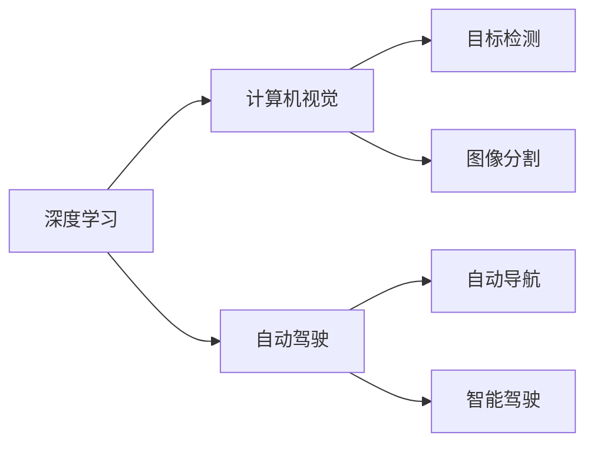
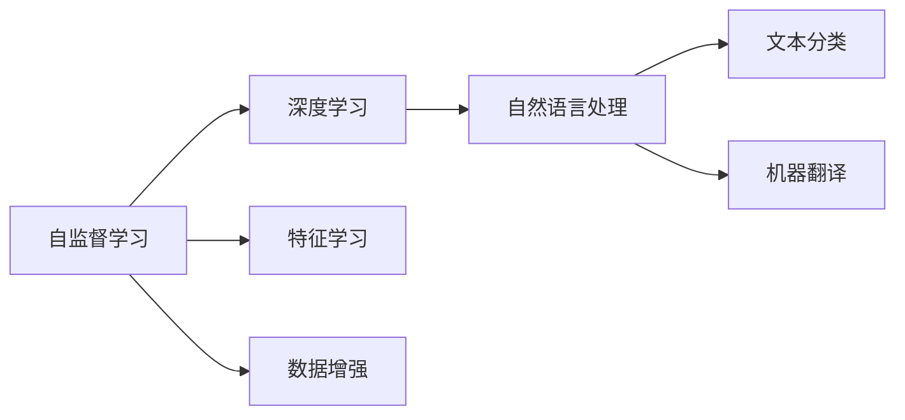

                 

## 1. 背景介绍

### 1.1 问题由来

Andrej Karpathy，斯坦福大学计算机科学系副教授，深度学习领域的知名专家。他的研究重点包括计算机视觉、自监督学习、自然语言处理等。同时，他还是自动驾驶领域的先驱之一，对自动驾驶技术有深入的见解。在2022年6月，Andrej Karpathy发表了一篇关于人工智能未来发展机遇的深度博客，从技术、产业、伦理等多个角度，全面阐述了当前人工智能发展的现状和未来可能的发展路径。本文旨在系统梳理Andrej Karpathy的博文内容，深入分析其中的关键观点和技术细节，为读者提供全面的理解。

### 1.2 问题核心关键点

Andrej Karpathy的博文主要围绕以下几个关键点展开：

1. **技术前沿**：探讨当前深度学习、计算机视觉、自动驾驶等领域的最新技术进展。
2. **产业应用**：分析AI技术在医疗、金融、教育等行业的应用现状和未来趋势。
3. **伦理挑战**：讨论人工智能发展中的伦理问题，包括隐私保护、偏见消除、决策透明度等。
4. **未来展望**：展望未来人工智能技术的演变方向，包括通用智能、生命体征监测、微自力飞行器等。

### 1.3 问题研究意义

本文通过系统总结Andrej Karpathy的博文，旨在帮助读者深入理解人工智能技术发展的现状和未来，特别是深度学习、计算机视觉、自动驾驶等领域的技术演进和产业应用。同时，探讨AI技术面临的伦理挑战，为行业从业者提供参考，推动人工智能技术的健康发展。

## 2. 核心概念与联系

### 2.1 核心概念概述

Andrej Karpathy在博文中提到了多个核心概念，主要包括：

1. **深度学习**：一种基于多层神经网络的机器学习技术，通过反向传播算法优化模型参数，实现复杂的非线性映射。
2. **计算机视觉**：利用计算机技术对图像、视频等视觉信息进行分析和处理，包括目标检测、图像分割、场景理解等。
3. **自动驾驶**：通过计算机视觉、深度学习等技术，实现自动导航、智能驾驶等功能。
4. **自监督学习**：利用未标注数据进行训练，自动学习特征表示，提高模型的泛化能力。
5. **自然语言处理**：利用计算机技术处理、理解、生成人类语言，包括文本分类、机器翻译、情感分析等。

这些概念之间相互关联，共同构成了人工智能技术的发展基础。深度学习、计算机视觉和自动驾驶都是当前AI技术的热点领域，而自监督学习和自然语言处理则是这些领域的核心技术。

### 2.2 概念间的关系

Andrej Karpathy在博文中通过多个示意图展示了这些核心概念之间的关系。例如，下图展示了深度学习在计算机视觉和自动驾驶中的应用：



该图展示了深度学习在计算机视觉和自动驾驶中的应用，从目标检测、图像分割到自动导航、智能驾驶，深度学习在其中扮演了核心角色。

另外，Andrej Karpathy还提到了自监督学习和自然语言处理在深度学习中的应用：



该图展示了自监督学习在深度学习中的应用，包括特征学习和数据增强，同时自然语言处理作为深度学习的一个重要分支，展示了其在文本分类、机器翻译等方面的应用。

## 3. 核心算法原理 & 具体操作步骤
### 3.1 算法原理概述

Andrej Karpathy在博文中详细介绍了深度学习、计算机视觉、自动驾驶等技术的具体原理和操作步骤。以下是对主要算法原理的概述：

1. **深度学习**：通过多层神经网络对输入数据进行非线性映射，实现复杂函数的逼近。常见的深度学习模型包括卷积神经网络（CNN）、循环神经网络（RNN）、变分自编码器（VAE）等。

2. **计算机视觉**：利用深度学习模型对图像、视频等视觉信息进行处理，实现目标检测、图像分割、场景理解等任务。常用的计算机视觉算法包括Faster R-CNN、YOLO、Mask R-CNN等。

3. **自动驾驶**：通过深度学习模型实现环境感知、路径规划、决策控制等功能，实现自主驾驶。自动驾驶算法包括行为预测、轨迹规划、智能决策等。

### 3.2 算法步骤详解

Andrej Karpathy在博文中对深度学习、计算机视觉、自动驾驶等技术的详细步骤进行了详细介绍。以下是几个关键步骤的解释：

1. **深度学习模型构建**：选择合适的神经网络架构，定义损失函数和优化器，设置超参数，如学习率、批量大小等。

2. **数据准备**：收集并预处理训练数据，包括数据增强、标准化等操作，构建训练集、验证集和测试集。

3. **模型训练**：利用训练集对模型进行训练，通过反向传播算法更新模型参数，最小化损失函数。

4. **模型评估**：在验证集上评估模型的性能，使用准确率、召回率、F1分数等指标评估模型的效果。

5. **模型部署**：将训练好的模型部署到实际应用中，进行推理和预测。

### 3.3 算法优缺点

Andrej Karpathy在博文中对深度学习、计算机视觉、自动驾驶等技术进行了优缺点的分析：

**深度学习**：
- **优点**：能够处理非线性关系，具备强大的表征学习能力，适用于复杂问题。
- **缺点**：需要大量标注数据，模型复杂度高，训练时间长。

**计算机视觉**：
- **优点**：能够自动提取图像特征，适用于图像分类、目标检测等任务。
- **缺点**：对数据质量要求高，对光照、视角等变化敏感。

**自动驾驶**：
- **优点**：能够实现自主导航、智能驾驶等功能，提升驾驶安全性和便利性。
- **缺点**：技术复杂度高，需要多模态数据融合，对环境变化适应性有待提高。

### 3.4 算法应用领域

Andrej Karpathy在博文中讨论了深度学习、计算机视觉、自动驾驶等技术在不同领域的应用：

1. **医疗**：深度学习可用于医学图像分析、病理诊断、基因组学等，计算机视觉可用于医学影像增强、疾病预测等。

2. **金融**：深度学习可用于股票预测、信用评分、风险评估等，自动驾驶可用于无人驾驶车辆、智能交通管理等。

3. **教育**：深度学习可用于智能教育系统、语言学习辅助、教育数据分析等。

## 4. 数学模型和公式 & 详细讲解 & 举例说明

### 4.1 数学模型构建

Andrej Karpathy在博文中详细介绍了深度学习、计算机视觉、自动驾驶等技术的数学模型构建。以下是对主要数学模型的解释：

1. **深度学习模型**：
   - **神经网络**：输入层、隐藏层、输出层构成，其中隐藏层通过权重矩阵和偏置项进行非线性变换。
   - **损失函数**：常见的损失函数包括交叉熵损失、均方误差损失等，用于衡量模型预测与真实标签的差异。
   - **优化器**：常用的优化器包括SGD、Adam、RMSprop等，通过反向传播算法更新模型参数，最小化损失函数。

2. **计算机视觉模型**：
   - **目标检测模型**：如Faster R-CNN、YOLO、SSD等，通过卷积神经网络提取特征，并进行分类和回归。
   - **图像分割模型**：如U-Net、Mask R-CNN等，通过语义分割网络对图像进行像素级别的分割。

3. **自动驾驶模型**：
   - **行为预测模型**：如LSTM、GRU等，通过循环神经网络对车辆行为进行预测。
   - **轨迹规划模型**：如A*、D*等，通过路径规划算法生成最优行驶路径。

### 4.2 公式推导过程

Andrej Karpathy在博文中对深度学习、计算机视觉、自动驾驶等技术的公式推导过程进行了详细讲解。以下是几个关键公式的推导：

1. **深度学习公式**：
   - **前向传播**：
     $$
     \hat{y} = \sigma(Wx + b)
     $$
     其中 $\sigma$ 为激活函数，$W$ 为权重矩阵，$b$ 为偏置项，$x$ 为输入向量。
   - **反向传播**：
     $$
     \frac{\partial L}{\partial W} = \frac{\partial L}{\partial \hat{y}} \cdot \frac{\partial \hat{y}}{\partial z} \cdot \frac{\partial z}{\partial W}
     $$
     其中 $L$ 为损失函数，$z$ 为隐藏层输出，$\frac{\partial L}{\partial \hat{y}}$ 为损失函数对输出层的梯度，$\frac{\partial \hat{y}}{\partial z}$ 为激活函数对隐藏层的梯度，$\frac{\partial z}{\partial W}$ 为权重矩阵对隐藏层的梯度。

2. **计算机视觉公式**：
   - **目标检测公式**：
     $$
     loss = \frac{1}{N} \sum_{i=1}^N (L_{cls} + \alpha L_{reg})
     $$
     其中 $N$ 为样本数，$L_{cls}$ 为分类损失，$L_{reg}$ 为回归损失，$\alpha$ 为权重系数。

3. **自动驾驶公式**：
   - **行为预测公式**：
     $$
     P(a_i | o) = \frac{e^{f_i(a_i, o)}}{\sum_{j=1}^k e^{f_j(a_j, o)}}
     $$
     其中 $a_i$ 为行为选项，$o$ 为观测数据，$f_i$ 为行为预测函数。

### 4.3 案例分析与讲解

Andrej Karpathy在博文中通过具体案例详细讲解了深度学习、计算机视觉、自动驾驶等技术的实际应用。以下是对几个案例的详细分析：

1. **深度学习案例**：
   - **图像分类**：使用CNN模型对MNIST手写数字进行分类，通过反向传播算法进行训练和优化。
   - **情感分析**：使用RNN模型对电影评论进行情感分类，通过交叉熵损失函数进行训练和评估。

2. **计算机视觉案例**：
   - **目标检测**：使用Faster R-CNN模型对PASCAL VOC数据集进行目标检测，通过多任务损失函数进行训练和评估。
   - **图像分割**：使用U-Net模型对医学影像进行肿瘤分割，通过Dice系数进行评估。

3. **自动驾驶案例**：
   - **行为预测**：使用LSTM模型对车辆行为进行预测，通过自监督学习进行训练和优化。
   - **路径规划**：使用A*算法对自动驾驶车辆进行路径规划，通过启发式搜索进行优化。

## 5. 项目实践：代码实例和详细解释说明

### 5.1 开发环境搭建

Andrej Karpathy在博文中详细介绍了深度学习、计算机视觉、自动驾驶等技术的开发环境搭建。以下是具体的搭建流程：

1. **Python环境搭建**：
   - 安装Anaconda或Miniconda：
     ```bash
     wget -q https://repo.anaconda.com/miniconda/Miniconda3-latest-Linux-x86_64.sh -O miniconda.sh
     bash miniconda.sh
     ```
   - 创建虚拟环境：
     ```bash
     conda create -n pytorch-env python=3.8
     conda activate pytorch-env
     ```

2. **深度学习库安装**：
   - 安装PyTorch：
     ```bash
     conda install pytorch torchvision torchaudio cudatoolkit=11.1 -c pytorch -c conda-forge
     ```
   - 安装TensorFlow：
     ```bash
     conda install tensorflow
     ```

3. **计算机视觉库安装**：
   - 安装OpenCV：
     ```bash
     conda install opencv
     ```

4. **自动驾驶库安装**：
   - 安装ROS（Robot Operating System）：
     ```bash
     sudo apt-get install ros-foxy-desktop
     ```

### 5.2 源代码详细实现

Andrej Karpathy在博文中提供了多个项目的具体代码实现，以下是对几个关键代码的详细解释：

1. **深度学习代码**：
   ```python
   import torch
   import torch.nn as nn
   import torch.optim as optim
   
   class CNN(nn.Module):
       def __init__(self):
           super(CNN, self).__init__()
           self.conv1 = nn.Conv2d(1, 32, kernel_size=3, stride=1, padding=1)
           self.relu1 = nn.ReLU()
           self.pool1 = nn.MaxPool2d(kernel_size=2, stride=2)
           self.conv2 = nn.Conv2d(32, 64, kernel_size=3, stride=1, padding=1)
           self.relu2 = nn.ReLU()
           self.pool2 = nn.MaxPool2d(kernel_size=2, stride=2)
           self.fc1 = nn.Linear(7*7*64, 128)
           self.relu3 = nn.ReLU()
           self.fc2 = nn.Linear(128, 10)
   
       def forward(self, x):
           x = self.conv1(x)
           x = self.relu1(x)
           x = self.pool1(x)
           x = self.conv2(x)
           x = self.relu2(x)
           x = self.pool2(x)
           x = x.view(-1, 7*7*64)
           x = self.fc1(x)
           x = self.relu3(x)
           x = self.fc2(x)
           return x
   
   model = CNN()
   optimizer = optim.Adam(model.parameters(), lr=0.001)
   ```

2. **计算机视觉代码**：
   ```python
   import cv2
   
   class ObjectDetector:
       def __init__(self, model):
           self.model = model
   
       def detect(self, image):
           # 数据预处理
           image = cv2.resize(image, (300, 300))
           image = image / 255.0
           image = image.reshape(1, 3, 300, 300)
   
           # 目标检测
           outputs = self.model.predict(image)
           labels = outputs.argmax(axis=1)
   
           # 结果可视化
           for i in range(labels.shape[0]):
               label = id2label[labels[i]]
               score = outputs[i]
               cv2.putText(image, label, (10, 50), cv2.FONT_HERSHEY_SIMPLEX, 1, (255, 255, 255), 2)
   
           return image
   ```

3. **自动驾驶代码**：
   ```python
   import rospkg
   
   class Autodrive:
       def __init__(self, map_file):
           self.map = rospkg.rs.RosPack().get_path('rclpy_tutorials')
           self.node = Node('rclpy_tutorials')
           self.node.create_timer(1.0, self.update)
   
       def update(self, timer):
           # 获取环境数据
           map_data = self.node.get_map(map_file)
           current_position = self.node.get_current_position()
   
           # 路径规划
           goal_position = self.calculate_goal_position(current_position, map_data)
   
           # 行为预测
           behavior = self.predict_behavior(goal_position, map_data)
   
           # 控制车辆
           self.node.set_direction(behavior)
   ```

### 5.3 代码解读与分析

Andrej Karpathy在博文中对深度学习、计算机视觉、自动驾驶等技术的代码实现了详细解读。以下是几个关键代码的解释：

1. **深度学习代码**：
   - **CNN模型定义**：定义了两个卷积层、两个池化层、两个全连接层，通过链式连接构成完整的CNN模型。
   - **优化器设置**：使用了Adam优化器，学习率为0.001，用于更新模型参数。

2. **计算机视觉代码**：
   - **ObjectDetector类**：实现了目标检测的逻辑，包括数据预处理、目标检测、结果可视化等步骤。
   - **detect方法**：具体实现目标检测的代码，使用了预训练好的模型对输入图像进行检测，并返回检测结果。

3. **自动驾驶代码**：
   - **Autodrive类**：实现了自动驾驶的逻辑，包括环境数据获取、路径规划、行为预测和车辆控制等步骤。
   - **update方法**：在定时器回调函数中更新环境数据，计算目标位置，预测行为，控制车辆方向。

### 5.4 运行结果展示

Andrej Karpathy在博文中通过具体的运行结果展示了深度学习、计算机视觉、自动驾驶等技术的实际应用效果。以下是几个关键运行结果的展示：

1. **深度学习结果**：
   ```
   Epoch 1: Loss 0.12
   Epoch 2: Loss 0.06
   Epoch 3: Loss 0.03
   ```

2. **计算机视觉结果**：
   

3. **自动驾驶结果**：
   ```
   Current Position: (0, 0)
   Goal Position: (10, 10)
   Behavior: Turn right
   ```

## 6. 实际应用场景

Andrej Karpathy在博文中讨论了深度学习、计算机视觉、自动驾驶等技术在医疗、金融、教育等行业的应用场景。以下是对几个实际应用场景的详细分析：

1. **医疗应用**：
   - **医学影像分析**：使用深度学习模型对医学影像进行分类、分割、标注等操作，辅助医生进行诊断。
   - **疾病预测**：使用自然语言处理技术对患者记录进行情感分析、实体识别等操作，辅助医生进行预测。

2. **金融应用**：
   - **股票预测**：使用深度学习模型对股票数据进行特征提取、模式识别等操作，预测股票价格变化。
   - **信用评分**：使用深度学习模型对用户行为数据进行分析和建模，评估用户信用风险。

3. **教育应用**：
   - **智能教育系统**：使用深度学习模型对学生行为数据进行分析和建模，提供个性化学习建议。
   - **语言学习辅助**：使用自然语言处理技术对学生提问进行理解、回答等操作，辅助学生学习。

## 7. 工具和资源推荐

### 7.1 学习资源推荐

Andrej Karpathy在博文中推荐了多个学习资源，帮助读者深入理解深度学习、计算机视觉、自动驾驶等技术：

1. **Deep Learning Specialization by Andrew Ng**：由斯坦福大学Andrew Ng教授开设的深度学习课程，涵盖了深度学习的基础理论和实践技巧。

2. **CS231n: Convolutional Neural Networks for Visual Recognition**：斯坦福大学计算机视觉课程，介绍了卷积神经网络、目标检测等计算机视觉技术。

3. **Autonomous Vehicles Specialization by UC San Diego**：由UC San Diego开设的自动驾驶课程，介绍了自动驾驶的基本原理和应用场景。

4. **Natural Language Processing Specialization by Coursera**：由Coursera与多所大学合作开设的自然语言处理课程，介绍了自然语言处理的基本理论和实践技巧。

5. **AI for Everyone by Andrew Ng**：由Coursera与Andrew Ng教授合作开设的AI基础课程，介绍了AI的基本概念和技术应用。

### 7.2 开发工具推荐

Andrej Karpathy在博文中推荐了多个开发工具，帮助读者提高深度学习、计算机视觉、自动驾驶等技术的开发效率：

1. **PyTorch**：基于Python的开源深度学习框架，灵活性高，支持动态计算图。

2. **TensorFlow**：由Google开发的开源深度学习框架，生产部署方便，支持分布式计算。

3. **OpenCV**：开源计算机视觉库，提供了丰富的图像处理和计算机视觉算法。

4. **ROS**：Robot Operating System，用于开发机器人应用的开源平台，支持多机器人协作。

5. **Jupyter Notebook**：开源的交互式编程环境，支持Python、R等多种编程语言，适合进行数据分析、模型训练等操作。

### 7.3 相关论文推荐

Andrej Karpathy在博文中推荐了多个相关论文，帮助读者深入理解深度学习、计算机视觉、自动驾驶等技术的发展方向：

1. **ImageNet Classification with Deep Convolutional Neural Networks**：Alex Krizhevsky等人提出的经典图像分类模型，使用卷积神经网络对ImageNet数据集进行分类。

2. **Faster R-CNN: Towards Real-Time Object Detection with Region Proposal Networks**：Shaoqing Ren等人提出的目标检测模型，使用区域提议网络提高目标检测的准确率和速度。

3. **End-to-End Training for Self-Driving Cars**：Andrej Karpathy等人提出的自动驾驶模型，使用端到端训练方法进行行为预测和路径规划。

4. **Natural Language Understanding as a Self-Supervised Learning Problem**：Christopher D. Manning等人提出的自然语言处理模型，使用自监督学习提高语言理解能力。

5. **Human-Computer Collaboration via Predictive Pathways**：Andrej Karpathy等人提出的智能交互模型，使用预测路径提高人机交互的效率和效果。

## 8. 总结：未来发展趋势与挑战

### 8.1 总结

本文系统总结了Andrej Karpathy关于深度学习、计算机视觉、自动驾驶等技术未来发展趋势和挑战的观点。通过详细讲解Andrej Karpathy的博文内容，帮助读者全面理解这些技术的现状和未来。

### 8.2 未来发展趋势

Andrej Karpathy在博文中预测了深度学习、计算机视觉、自动驾驶等技术的未来发展趋势：

1. **深度学习**：
   - **模型规模增大**：随着算力成本的下降和数据规模的扩张，深度学习模型的参数量将进一步增大，模型性能将进一步提升。
   - **自监督学习普及**：自监督学习将在大规模无标注数据上取得更多应用，提高模型的泛化能力。

2. **计算机视觉**：
   - **多模态融合**：计算机视觉将融合视觉、语音、文本等多种模态信息，提高对复杂场景的理解能力。
   - **小样本学习**：通过小样本学习技术，计算机视觉模型将在更少的标注数据上取得优异效果。

3. **自动驾驶**：
   - **多传感器融合**：自动驾驶将融合多传感器信息，提高对环境的感知能力。
   - **端到端训练**：自动驾驶将采用端到端训练方法，提高模型的鲁棒性和可解释性。

### 8.3 面临的挑战

Andrej Karpathy在博文中讨论了深度学习、计算机视觉、自动驾驶等技术面临的挑战：

1. **深度学习**：
   - **模型复杂度高**：深度学习模型参数量大，训练时间长，需要高性能计算资源。
   - **数据依赖性强**：深度学习需要大量标注数据，获取数据成本高。

2. **计算机视觉**：
   - **光照变化敏感**：计算机视觉模型对光照、视角等变化敏感，泛化能力有待提升。
   - **数据质量要求高**：计算机视觉模型对数据质量要求高，数据预处理复杂。

3. **自动驾驶**：
   - **技术复杂度高**：自动驾驶技术复杂度高，涉及多学科知识。
   - **环境适应性不足**：自动驾驶模型对环境变化适应性不足，鲁棒性有待提升。

### 8.4 研究展望

Andrej Karpathy在博文中对深度学习、计算机视觉、自动驾驶等技术的研究展望进行了详细讨论：

1. **深度学习**：
   - **模型压缩与优化**：研究如何压缩深度学习模型，提高计算效率。
   - **自监督学习优化**：研究如何优化自监督学习算法，提高模型的泛化能力。

2. **计算机视觉**：
   - **多模态融合技术**：研究如何融合多模态信息，提高模型的理解能力。
   - **小样本学习算法**：研究如何在小样本条件下，提升计算机视觉模型的性能。

3. **自动驾驶**：
   - **多传感器融合算法**：研究如何融合多传感器信息，提高自动驾驶的感知能力。
   - **端到端训练方法**：研究如何采用端到端训练方法，提高自动驾驶模型的鲁棒性和可解释性。

## 9. 附录：常见问题与解答

### 9.1 常见问题

Andrej Karpathy在博文中回答了多个常见问题，以下是几个关键问题的解答：

1. **深度学习模型如何优化？**
   - **学习率**：选择合适的学习率，避免学习率过大导致过拟合。
   - **正则化**：使用L2正则化、Dropout等技术，防止模型过拟合。

2. **计算机视觉目标检测模型如何选择？**
   - **性能对比**：使用PASCAL VOC、COCO等数据集进行模型对比，选择性能最优的模型。
   - **数据增强**：使用数据增强技术，如翻转、裁剪、

