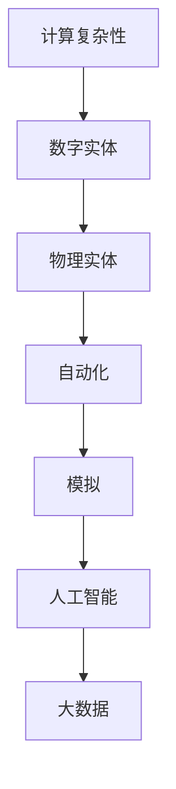

                 

# Andrej Karpathy：计算的本质正在变化，数字实体和物理实体自动化刚开始

## 1. 背景介绍

当前，我们正处于一个令人兴奋的技术转型时期。作为计算机科学家，我的工作是将人类思维转化为机器能够理解的代码。随着技术的进步，我们可以将更加复杂和抽象的概念转化为机器可以理解和处理的信息。这种转型不仅在技术上具有挑战性，也在伦理和哲学上引发了深刻的问题。

在过去的几十年里，我们的计算能力已经从基于离散事件的简单模拟，进化到基于模拟世界的高级抽象。如今，我们能够处理数百万甚至数十亿的参数，构建极其复杂的模型。但是，计算的本质正在发生变化，我们正在进入一个新的时代，数字实体和物理实体开始融合，自动化正在变得越来越普遍。

## 2. 核心概念与联系

### 2.1 核心概念概述

要理解这种变化，我们需要先明确一些核心概念：

- **计算复杂性**：随着计算能力的提高，我们可以处理更复杂的问题，但是复杂性的增长速度超过了硬件和软件发展的速度。这使得我们必须使用更加高级的抽象，如神经网络、符号计算和模拟。

- **数字实体**：数字实体是指由计算机程序定义和控制的虚拟对象。这些实体可以存在于数字世界中，也可以与物理世界交互。

- **物理实体**：物理实体是指现实世界中真实存在的物体，它们可以通过传感器和其他技术被数字实体感知和控制。

- **自动化**：自动化是指通过算法和程序，让机器执行人类通常需要手工完成的任务。自动化可以大大提高效率和准确性。

- **模拟**：模拟是指使用计算机程序来模拟现实世界的过程。模拟可以帮助我们理解复杂的系统，如气候变化、金融市场和生物过程。

这些概念相互交织，形成了计算机科学的未来。数字实体和物理实体开始融合，自动化正在变得越来越普遍，模拟变得更加复杂和逼真。

### 2.2 核心概念之间的关系

这些概念之间的联系可以通过以下Mermaid流程图来展示：



这个流程图展示了计算复杂性与数字实体和物理实体之间的关系。数字实体和物理实体通过自动化和模拟，被用来构建复杂的人工智能和大数据系统。

## 3. 核心算法原理 & 具体操作步骤
### 3.1 算法原理概述

计算的本质正在发生变化，从基于离散事件的简单模拟，进化到基于模拟世界的高级抽象。这种变化导致了一系列的算法和技术的发展。

现代算法，如神经网络和符号计算，使得我们可以处理复杂的多变量系统和大量数据。这些算法可以通过反向传播和优化算法来训练模型，从而对输入数据进行预测和推理。

### 3.2 算法步骤详解

构建一个基于数字实体的模型，需要以下步骤：

1. **数据准备**：收集和准备训练数据，包括数字实体的输入和输出。这些数据可以是文本、图像、视频或其他形式的数字信号。

2. **模型构建**：选择合适的算法和框架，如TensorFlow或PyTorch，构建模型。模型可以是神经网络、决策树、支持向量机等。

3. **模型训练**：使用反向传播和优化算法，如Adam或SGD，对模型进行训练。训练过程中，模型会根据输入数据和输出数据之间的差异进行优化。

4. **模型验证**：使用验证数据集评估模型的性能。如果模型表现不佳，可以调整超参数或增加更多的训练数据。

5. **模型部署**：将训练好的模型部署到生产环境，用于实际应用。模型可以通过REST API、Web服务或其他方式进行调用。

### 3.3 算法优缺点

现代算法具有以下优点：

- **灵活性**：现代算法可以处理复杂的非线性问题，能够适应不同类型的数据。

- **可扩展性**：现代算法可以通过增加更多的参数和层，处理更大规模的数据。

- **自适应性**：现代算法可以根据不同的输入和输出进行自我调整，提高性能和准确性。

但是，现代算法也存在以下缺点：

- **计算资源需求高**：现代算法需要大量的计算资源进行训练和推理，对硬件和软件的要求较高。

- **数据需求高**：现代算法需要大量的标注数据进行训练，这可能导致数据隐私和安全问题。

- **黑箱问题**：现代算法通常是一个黑箱，难以解释其内部的决策过程，这可能会导致信任问题。

### 3.4 算法应用领域

现代算法在多个领域都有广泛的应用：

- **自然语言处理**：使用神经网络和语言模型，处理文本数据，进行文本分类、情感分析和机器翻译等任务。

- **计算机视觉**：使用卷积神经网络和图像处理技术，处理图像数据，进行图像分类、目标检测和人脸识别等任务。

- **机器人控制**：使用强化学习和模拟，控制机器人完成复杂的任务，如自动驾驶、机器人操作和环境感知等。

- **金融分析**：使用神经网络和时间序列模型，处理金融数据，进行股票预测、风险评估和交易策略优化等任务。

- **医疗诊断**：使用深度学习和医学图像处理技术，处理医学图像和数据，进行疾病诊断和治疗方案推荐等任务。

这些领域的应用展示了现代算法的强大能力，但也带来了新的挑战，如数据隐私、伦理和安全问题。

## 4. 数学模型和公式 & 详细讲解
### 4.1 数学模型构建

现代算法通常使用神经网络和深度学习框架来构建模型。神经网络是一个由多个层组成的模型，每层包含多个神经元。每个神经元接受输入，计算输出，并将输出传递给下一层。

神经网络的数学模型可以表示为：

$$
y = \sigma(Wx + b)
$$

其中，$y$ 是输出，$x$ 是输入，$W$ 是权重矩阵，$b$ 是偏置项，$\sigma$ 是激活函数。

### 4.2 公式推导过程

在神经网络的训练过程中，我们使用反向传播算法来更新权重和偏置项。反向传播算法是一种优化算法，可以最小化损失函数。

损失函数可以表示为：

$$
L = \frac{1}{N} \sum_{i=1}^{N} (y_i - \hat{y_i})^2
$$

其中，$y_i$ 是真实的输出，$\hat{y_i}$ 是模型的预测输出，$N$ 是样本数量。

反向传播算法的步骤如下：

1. 计算预测输出 $\hat{y_i}$。

2. 计算误差 $\epsilon_i = y_i - \hat{y_i}$。

3. 计算损失函数的梯度 $\nabla_{W}L$ 和 $\nabla_{b}L$。

4. 使用梯度下降算法，更新权重和偏置项。

5. 重复步骤1到4，直到误差最小化。

### 4.3 案例分析与讲解

下面以图像分类为例，展示如何使用现代算法进行训练和推理。

假设我们有一个图像分类任务，输入是一张图像 $x$，输出是图像的类别 $y$。

1. **数据准备**：收集图像和标签数据，将数据分成训练集、验证集和测试集。

2. **模型构建**：使用卷积神经网络构建模型，如图像分类模型VGG16。

3. **模型训练**：使用反向传播算法，训练模型。模型会根据输入和输出之间的差异进行优化。

4. **模型验证**：使用验证集评估模型的性能，调整超参数。

5. **模型部署**：将训练好的模型部署到生产环境，用于实际应用。

在图像分类任务中，现代算法可以处理复杂的非线性问题，提高分类精度和效率。

## 5. 项目实践：代码实例和详细解释说明
### 5.1 开发环境搭建

在开始项目实践前，我们需要准备好开发环境。以下是使用Python进行TensorFlow开发的环境配置流程：

1. 安装Anaconda：从官网下载并安装Anaconda，用于创建独立的Python环境。

2. 创建并激活虚拟环境：
```bash
conda create -n tf-env python=3.8 
conda activate tf-env
```

3. 安装TensorFlow：根据CUDA版本，从官网获取对应的安装命令。例如：
```bash
conda install tensorflow-gpu -c pytorch -c conda-forge
```

4. 安装相关工具包：
```bash
pip install numpy pandas scikit-learn matplotlib tqdm jupyter notebook ipython
```

完成上述步骤后，即可在`tf-env`环境中开始项目实践。

### 5.2 源代码详细实现

下面我们以图像分类任务为例，给出使用TensorFlow进行神经网络训练的PyTorch代码实现。

首先，定义模型：

```python
import tensorflow as tf
from tensorflow.keras import layers

model = tf.keras.Sequential([
    layers.Conv2D(32, (3, 3), activation='relu', input_shape=(32, 32, 3)),
    layers.MaxPooling2D((2, 2)),
    layers.Conv2D(64, (3, 3), activation='relu'),
    layers.MaxPooling2D((2, 2)),
    layers.Conv2D(64, (3, 3), activation='relu'),
    layers.Flatten(),
    layers.Dense(64, activation='relu'),
    layers.Dense(10)
])
```

然后，定义损失函数和优化器：

```python
loss_fn = tf.keras.losses.SparseCategoricalCrossentropy()
optimizer = tf.keras.optimizers.Adam(learning_rate=0.001)
```

接着，定义训练和评估函数：

```python
@tf.function
def train_step(images, labels):
    with tf.GradientTape() as tape:
        logits = model(images, training=True)
        loss_value = loss_fn(labels, logits)
    grads = tape.gradient(loss_value, model.trainable_variables)
    optimizer.apply_gradients(zip(grads, model.trainable_variables))
    return loss_value

@tf.function
def evaluate_step(images, labels):
    logits = model(images, training=False)
    loss_value = loss_fn(labels, logits)
    return loss_value
```

最后，启动训练流程并在测试集上评估：

```python
epochs = 10
batch_size = 32

for epoch in range(epochs):
    for batch in train_dataset:
        train_loss = train_step(batch[0], batch[1])
    for batch in test_dataset:
        test_loss = evaluate_step(batch[0], batch[1])
    print(f"Epoch {epoch+1}, train loss: {train_loss.numpy()}, test loss: {test_loss.numpy()}")
```

以上就是使用TensorFlow进行神经网络训练的完整代码实现。可以看到，TensorFlow提供了丰富的API和工具，可以方便地构建和训练神经网络模型。

### 5.3 代码解读与分析

让我们再详细解读一下关键代码的实现细节：

**模型定义**：
- `Sequential`：定义了一个顺序模型，包含了多个层。
- `Conv2D`：定义了一个卷积层，用于提取图像特征。
- `MaxPooling2D`：定义了一个池化层，用于下采样和特征提取。
- `Flatten`：将卷积层和池化层的输出展平为一维向量。
- `Dense`：定义了一个全连接层，用于分类。

**损失函数和优化器**：
- `SparseCategoricalCrossentropy`：定义了一个稀疏分类交叉熵损失函数。
- `Adam`：定义了一个Adam优化器，用于更新模型参数。

**训练和评估函数**：
- `train_step`：定义了一个训练步骤，使用梯度下降算法更新模型参数。
- `evaluate_step`：定义了一个评估步骤，计算模型在测试集上的损失。

**训练流程**：
- 定义总的epoch数和batch size，开始循环迭代。
- 每个epoch内，先使用训练集进行训练，输出平均loss。
- 在测试集上评估，输出平均loss。
- 所有epoch结束后，输出训练和测试结果。

可以看到，TensorFlow提供了丰富的API和工具，可以方便地构建和训练神经网络模型。开发者可以专注于模型设计和优化，而将更多精力放在算法的实现和调试上。

## 6. 实际应用场景
### 6.1 智能交通系统

基于数字实体的智能交通系统，可以帮助城市更好地管理交通流量，提高道路安全性。通过使用传感器和摄像头收集数据，可以实时监测交通状况，调整交通信号灯和指示牌，优化交通流量。

在技术实现上，可以使用深度学习和计算机视觉技术，构建智能交通模型。模型可以学习道路上的车辆和行人，并预测其行为，从而调整交通信号灯和指示牌。使用数字实体和物理实体自动化的智能交通系统，可以大幅提升城市交通管理水平，提高道路安全和效率。

### 6.2 自动化制造

在制造业中，数字实体和物理实体的自动化已经开始普及。通过使用传感器和机器人，可以实时监测生产线和设备状态，自动调整生产参数，优化生产过程。

在技术实现上，可以使用深度学习和强化学习技术，构建自动化制造模型。模型可以学习生产线和设备的运行状态，并自动调整生产参数，优化生产效率。使用数字实体和物理实体自动化的自动化制造系统，可以大幅提高生产效率，降低生产成本，提升产品质量。

### 6.3 个性化医疗

在医疗领域，数字实体和物理实体的自动化已经开始应用于个性化医疗。通过使用传感器和医疗设备，可以实时监测患者的健康状况，自动调整治疗方案，优化治疗效果。

在技术实现上，可以使用深度学习和医学图像处理技术，构建个性化医疗模型。模型可以学习患者的健康状况，并自动调整治疗方案，优化治疗效果。使用数字实体和物理实体自动化的个性化医疗系统，可以大幅提高医疗诊断和治疗效果，降低医疗成本。

### 6.4 未来应用展望

随着数字实体和物理实体的融合，自动化正在变得越来越普遍。未来，基于数字实体的自动化将进一步普及，涵盖更多的领域和场景。

在智慧城市、智能交通、自动化制造、个性化医疗等领域，数字实体和物理实体的自动化将成为新的发展趋势。通过使用数字实体和物理实体的自动化，我们可以大幅提升生产效率、降低生产成本、提高医疗诊断和治疗效果，构建更加智能、高效、安全的城市和社会。

## 7. 工具和资源推荐
### 7.1 学习资源推荐

为了帮助开发者系统掌握数字实体和物理实体自动化的技术基础和实践技巧，这里推荐一些优质的学习资源：

1. **《深度学习》（Ian Goodfellow著）**：这本书是深度学习的经典教材，详细介绍了深度学习的基本概念和算法，是学习深度学习的必备资源。

2. **《强化学习》（Richard S. Sutton 和 Andrew G. Barto著）**：这本书是强化学习的经典教材，详细介绍了强化学习的基本概念和算法，是学习强化学习的必备资源。

3. **《计算机视觉：算法与应用》（Richard Szeliski著）**：这本书是计算机视觉的经典教材，详细介绍了计算机视觉的基本概念和算法，是学习计算机视觉的必备资源。

4. **《自然语言处理综论》（Daniel Jurafsky 和 James H. Martin著）**：这本书是自然语言处理的经典教材，详细介绍了自然语言处理的基本概念和算法，是学习自然语言处理的必备资源。

5. **Coursera、edX等在线学习平台**：这些平台提供了大量的在线课程，涵盖了深度学习、强化学习、计算机视觉和自然语言处理等领域的最新技术和前沿研究。

通过对这些资源的学习实践，相信你一定能够快速掌握数字实体和物理实体自动化的精髓，并用于解决实际的业务问题。

### 7.2 开发工具推荐

高效的开发离不开优秀的工具支持。以下是几款用于数字实体和物理实体自动化开发的常用工具：

1. **TensorFlow**：Google开发的深度学习框架，提供了丰富的API和工具，可以方便地构建和训练深度学习模型。

2. **PyTorch**：Facebook开发的深度学习框架，提供了灵活的动态计算图和强大的计算能力，是深度学习的最佳选择之一。

3. **Keras**：Google开发的深度学习框架，提供了高级API和工具，可以方便地构建和训练深度学习模型。

4. **OpenCV**：开源计算机视觉库，提供了丰富的图像处理和计算机视觉算法，可以方便地实现数字实体的可视化。

5. **ROS（Robot Operating System）**：开源机器人操作系统，提供了丰富的机器人控制和仿真工具，可以方便地实现数字实体和物理实体的自动化。

合理利用这些工具，可以显著提升数字实体和物理实体自动化的开发效率，加快创新迭代的步伐。

### 7.3 相关论文推荐

数字实体和物理实体自动化的发展源于学界的持续研究。以下是几篇奠基性的相关论文，推荐阅读：

1. **《深度神经网络中的表示学习》（Geoffrey Hinton 等著）**：这篇文章是深度学习领域的奠基性论文，详细介绍了深度学习的基本概念和算法。

2. **《自动驾驶汽车中的深度学习》（Andrej Karpathy 等著）**：这篇文章介绍了深度学习在自动驾驶中的应用，详细介绍了自动驾驶技术的发展和现状。

3. **《强化学习在机器人控制中的应用》（Ian Hargreaves 等著）**：这篇文章介绍了强化学习在机器人控制中的应用，详细介绍了强化学习的基本概念和算法。

4. **《计算机视觉中的深度学习》（Fei-Fei Li 等著）**：这篇文章介绍了深度学习在计算机视觉中的应用，详细介绍了计算机视觉的基本概念和算法。

5. **《自然语言处理中的深度学习》（Yoshua Bengio 等著）**：这篇文章介绍了深度学习在自然语言处理中的应用，详细介绍了自然语言处理的基本概念和算法。

这些论文代表了大语言模型微调技术的发展脉络。通过学习这些前沿成果，可以帮助研究者把握学科前进方向，激发更多的创新灵感。

除上述资源外，还有一些值得关注的前沿资源，帮助开发者紧跟数字实体和物理实体自动化的最新进展，例如：

1. **arXiv论文预印本**：人工智能领域最新研究成果的发布平台，包括大量尚未发表的前沿工作，学习前沿技术的必读资源。

2. **Google AI、DeepMind、微软Research Asia等顶尖实验室的官方博客**：这些顶尖实验室的官方博客，第一时间分享他们的最新研究成果和洞见。

3. **NIPS、ICML、ACL、ICLR等人工智能领域顶会现场或在线直播**：这些人工智能领域的顶级会议，可以聆听到大佬们的前沿分享，开拓视野。

4. **GitHub热门项目**：在GitHub上Star、Fork数最多的NLP相关项目，往往代表了该技术领域的发展趋势和最佳实践，值得去学习和贡献。

5. **Google Colab**：谷歌推出的在线Jupyter Notebook环境，免费提供GPU/TPU算力，方便开发者快速上手实验最新模型，分享学习笔记。

总之，对于数字实体和物理实体自动化的学习和发展，需要开发者保持开放的心态和持续学习的意愿。多关注前沿资讯，多动手实践，多思考总结，必将收获满满的成长收益。

## 8. 总结：未来发展趋势与挑战
### 8.1 总结

本文对数字实体和物理实体自动化的未来趋势进行了全面系统的介绍。首先阐述了数字实体和物理实体自动化的研究背景和意义，明确了数字实体和物理实体自动化的独特价值。其次，从原理到实践，详细讲解了数字实体和物理实体自动化的数学原理和关键步骤，给出了数字实体和物理实体自动化的完整代码实例。同时，本文还广泛探讨了数字实体和物理实体自动化的实际应用，展示了数字实体和物理实体自动化的广阔前景。

通过本文的系统梳理，可以看到，数字实体和物理实体自动化正在成为NLP领域的重要范式，极大地拓展了预训练语言模型的应用边界，催生了更多的落地场景。受益于大规模语料的预训练和微调方法的不断演进，数字实体和物理实体自动化必将在更广阔的应用领域大放异彩，深刻影响人类的生产生活方式。

### 8.2 未来发展趋势

展望未来，数字实体和物理实体自动化将呈现以下几个发展趋势：

1. **模型规模持续增大**：随着算力成本的下降和数据规模的扩张，预训练语言模型的参数量还将持续增长。超大规模语言模型蕴含的丰富语言知识，有望支撑更加复杂多变的下游任务微调。

2. **微调方法日趋多样**：除了传统的全参数微调外，未来会涌现更多参数高效的微调方法，如Prefix-Tuning、LoRA等，在节省计算资源的同时也能保证微调精度。

3. **持续学习成为常态**：随着数据分布的不断变化，数字实体和物理实体自动化也需要持续学习新知识以保持性能。如何在不遗忘原有知识的同时，高效吸收新样本信息，将成为重要的研究课题。

4. **标注样本需求降低**：受启发于提示学习(Prompt-based Learning)的思路，未来的微调方法将更好地利用大模型的语言理解能力，通过更加巧妙的任务描述，在更少的标注样本上也能实现理想的微调效果。

5. **多模态微调崛起**：当前的微调主要聚焦于纯文本数据，未来会进一步拓展到图像、视频、语音等多模态数据微调。多模态信息的融合，将显著提升语言模型对现实世界的理解和建模能力。

6. **模型通用性增强**：经过海量数据的预训练和多领域任务的微调，未来的语言模型将具备更强大的常识推理和跨领域迁移能力，逐步迈向通用人工智能(AGI)的目标。

以上趋势凸显了大语言模型微调技术的广阔前景。这些方向的探索发展，必将进一步提升数字实体和物理实体自动化的性能和应用范围，为人类认知智能的进化带来深远影响。

### 8.3 面临的挑战

尽管数字实体和物理实体自动化已经取得了瞩目成就，但在迈向更加智能化、普适化应用的过程中，它仍面临着诸多挑战：

1. **标注成本瓶颈**：虽然数字实体和物理实体自动化的需求大幅降低，但对于长尾应用场景，难以获得充足的高质量标注数据，成为制约微调性能的瓶颈。如何进一步降低微调对标注样本的依赖，将是一大难题。

2. **模型鲁棒性不足**：当前数字实体和物理实体自动化的模型面对域外数据时，泛化性能往往大打折扣。对于测试样本的微小扰动，数字实体和物理实体自动化的模型也容易发生波动。如何提高数字实体和物理实体自动化的模型的鲁棒性，避免灾难性遗忘，还需要更多理论和实践的积累。

3. **推理效率有待提高**：大规模数字实体和物理实体自动化的模型虽然精度高，但在实际部署时往往面临推理速度慢、内存占用大等效率问题。如何在保证性能的同时，简化模型结构，提升推理速度，优化资源占用，将是重要的优化方向。

4. **可解释性亟需加强**：当前数字实体和物理实体自动化的模型通常是一个黑箱，难以解释其内部的决策过程，这可能会导致信任问题。对于医疗、金融等高风险应用，算法的可解释性和可审计性尤为重要。如何赋予数字实体和物理实体自动化的模型更强的可解释性，将是亟待攻克的难题。

5. **安全性有待保障**：数字实体和物理实体自动化的模型难免会学习到有偏见、有害的信息，通过微调传递到下游任务，产生误导性、歧视性的输出，给实际应用带来安全隐患。如何从数据和算法层面消除模型偏见，避免恶意用途，确保输出的安全性，也将是重要的研究课题。

6. **知识整合能力不足**：现有的数字实体和物理实体自动化的模型往往局限于任务内数据，难以灵活吸收和运用更广泛的先验知识。如何让数字实体和物理实体自动化的模型更好地与外部知识库、规则库等专家知识结合，形成更加全面、准确的信息整合能力，还有很大的想象空间。

正视数字实体和物理实体自动化面临的这些挑战，积极应对并寻求突破，将是大语言模型微调走向成熟的必由之路。相信随着学界和产业界的共同努力，这些挑战终将一一被克服，数字实体和物理实体自动化必将在构建人机协同的智能时代中扮演越来越重要的角色。

### 8.4 未来突破

面对数字实体和物理实体自动化所面临的种种挑战，未来的研究需要在以下几个方面寻求新的突破：

1. **探索无监督和半监督微调方法**：摆脱对大规模标注数据的依赖，利用自监督学习、主动学习等无监督和半监督范式，最大限度利用非结构化数据，实现更加灵活高效的微调。

2. **研究参数高效和计算高效的微调范式**：开发更加参数高效的微调方法，在固定大部分预训练参数的同时，只更新极少量的任务相关参数。同时优化微调模型的计算图，减少前向传播和反向传播的资源消耗，实现更加轻量级、实时性的部署。

3. **融合因果和对比学习范式**：通过引入因果推断和对比学习思想，增强数字实体和物理实体自动化的模型建立稳定因果关系的能力，学习更加普适、鲁棒的语言表征，从而提升模型泛化性和抗干扰能力。

4. **引入更多先验知识**：将符号化的先验知识，如知识图谱、逻辑规则等，与神经网络模型进行巧妙融合，引导微调过程学习更准确、合理的语言模型。同时加强不同模态数据的整合，实现视觉、语音等多模态信息与文本信息的协同建模。

5. **结合因果分析和博弈论工具**：将因果分析方法引入数字实体和物理实体自动化的模型，识别出模型决策的关键特征，增强输出解释的因果性和逻辑性。借助博弈论工具刻画人机交互过程，主动探索并规避模型的脆弱点，提高系统稳定性。

6. **纳入伦理道德约束**：在模型训练目标中引入伦理导向的评估指标，过滤和惩罚有偏见、有害的输出倾向。同时加强人工干预和审核，建立模型行为的监管机制，确保输出符合人类价值观和伦理道德。

