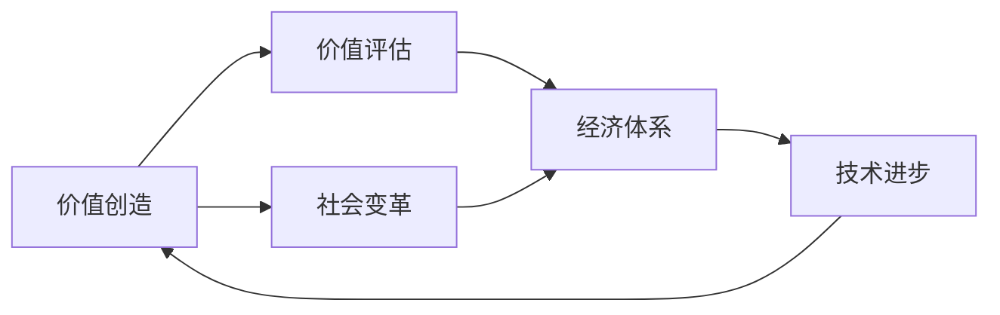
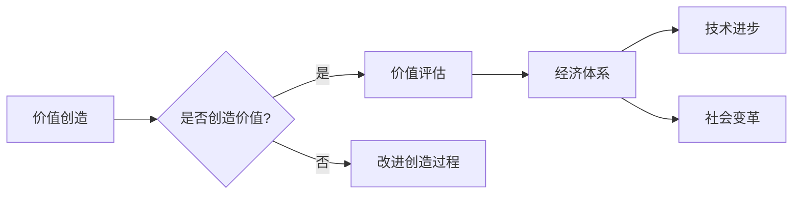

# 价值决定一切：未来社会的核心法则

> 关键词：价值创造，价值评估，经济体系，技术进步，社会变革，可持续发展

## 1. 背景介绍

在人类历史的长河中，经济体系和社会结构经历了多次变革。从原始的物物交换，到货币的出现，再到现代的全球化经济，每一种经济体系都基于特定的价值法则。然而，随着技术的飞速发展和全球化的深入，传统的价值法则面临着前所未有的挑战。本文将探讨价值决定一切的未来社会核心法则，分析其原理、实践方法以及面临的挑战。

### 1.1 问题的由来

随着信息技术的飞速发展，数据、算法和人工智能等新兴技术正在重塑经济和社会结构。传统的经济体系基于实体商品和货币的交换，而数字经济的兴起使得价值的形式和创造方式发生了根本性的变化。在这种背景下，如何定义、评估和创造价值成为了亟待解决的问题。

### 1.2 研究现状

近年来，学术界和业界对价值法则的研究取得了丰硕的成果。经济学家们提出了多种价值评估模型，如经济价值、社会价值、环境价值等。技术专家则探讨了如何利用数据和技术来创造和评估价值。然而，目前对价值法则的研究还处于初步阶段，尚未形成统一的理论框架。

### 1.3 研究意义

深入研究价值法则对于构建未来社会具有重要意义。它有助于我们：

- 理解经济体系和社会结构的变革趋势；
- 优化资源配置，提高社会整体福祉；
- 促进可持续发展，实现经济、社会和环境的和谐共生。

### 1.4 本文结构

本文将围绕以下结构展开：

- 第二部分：介绍价值法则的核心概念与联系，并给出流程图；
- 第三部分：阐述价值法则的核心算法原理和具体操作步骤；
- 第四部分：讲解数学模型和公式，并结合实例进行说明；
- 第五部分：通过项目实践展示代码实例和详细解释；
- 第六部分：探讨价值法则的实际应用场景和未来应用展望；
- 第七部分：推荐相关学习资源、开发工具和论文；
- 第八部分：总结研究成果，展望未来发展趋势和挑战；
- 第九部分：附录，常见问题与解答。

## 2. 核心概念与联系

### 2.1 核心概念

以下是价值法则的核心概念：

- **价值创造**：指通过创新和劳动，将资源转化为具有经济、社会或环境价值的产品或服务的过程。
- **价值评估**：指对产品、服务或项目所具有的经济、社会和环境价值进行量化或定性分析的过程。
- **经济体系**：指一个社会中资源的分配、交换和消费的规则和机制。
- **技术进步**：指人类在科学技术方面的创新和突破，它改变了生产方式和生活方式。
- **社会变革**：指社会结构、文化观念、价值观念等方面的重大变化。

### 2.2 核心概念联系

以下是核心概念之间的联系：



### 2.3 Mermaid 流程图



## 3. 核心算法原理 & 具体操作步骤

### 3.1 算法原理概述

价值法则的核心算法原理是通过对资源、技术和社会变化的动态分析，实现价值的最大化。具体而言，包括以下步骤：

1. 资源评估：对现有资源进行评估，包括自然资源、人力资本、技术资源等。
2. 技术创新：通过研究和技术创新，提高资源利用效率，创造新的价值。
3. 市场分析：分析市场需求和竞争态势，确定价值创造的方向和规模。
4. 价值评估：对创造的价值进行评估，包括经济价值、社会价值和环境价值。
5. 调整优化：根据评估结果，对价值创造过程进行调整和优化。

### 3.2 算法步骤详解

1. **资源评估**：通过数据分析、市场调研等方法，对现有资源进行全面评估，识别出关键资源。
2. **技术创新**：针对关键资源，研究新技术、新工艺，提高资源利用效率，降低生产成本。
3. **市场分析**：分析市场需求、竞争态势和潜在风险，确定价值创造的方向和规模。
4. **价值评估**：采用多种方法对创造的价值进行评估，包括经济价值、社会价值和环境价值。
5. **调整优化**：根据评估结果，对价值创造过程进行调整和优化，提高资源利用效率和价值创造能力。

### 3.3 算法优缺点

**优点**：

- 提高资源利用效率，降低生产成本；
- 创造新的价值，满足市场需求；
- 促进技术进步和社会发展。

**缺点**：

- 需要大量数据和专业知识；
- 技术创新风险较大；
- 价值评估方法复杂。

### 3.4 算法应用领域

价值法则的算法可以应用于以下领域：

- **制造业**：优化生产流程，提高产品质量和效率；
- **服务业**：提升服务质量，创造新的服务模式；
- **农业**：提高农业生产效率，保障粮食安全；
- **能源**：优化能源结构，提高能源利用效率；
- **环保**：推动绿色低碳发展，保护生态环境。

## 4. 数学模型和公式 & 详细讲解 & 举例说明

### 4.1 数学模型构建

价值法则的数学模型可以采用以下形式：

$$
V = f(R, T, M)
$$

其中，$V$ 表示价值，$R$ 表示资源，$T$ 表示技术，$M$ 表示市场。

### 4.2 公式推导过程

价值 $V$ 是资源 $R$、技术 $T$ 和市场 $M$ 的函数，可以表示为：

$$
V = \int_{R} \int_{T} \int_{M} f(R,T,M) dR dT dM
$$

其中，$f(R,T,M)$ 为价值函数，表示资源、技术和市场对价值的贡献。

### 4.3 案例分析与讲解

以下以一个简单的例子说明价值法则的应用：

假设某企业拥有一项新技术，可以降低生产成本，并提高产品质量。通过市场调研，发现该技术具有较大的市场需求。因此，企业决定投入研发资金，开发该技术并推向市场。

在这个例子中，资源 $R$ 为研发资金、设备和技术人才，技术 $T$ 为新技术，市场 $M$ 为市场需求。

通过价值法则的数学模型，我们可以计算该技术的价值：

$$
V = f(R, T, M)
$$

其中，$f(R,T,M)$ 可以通过以下方式计算：

$$
f(R,T,M) = R \times T \times M
$$

假设研发资金为 $100$ 万元，新技术可以降低生产成本 $20\%$，市场需求为 $1000$ 件产品。则该技术的价值为：

$$
V = 100 \times 0.8 \times 1000 = 80 \times 10^4
$$

即 $80$ 万元。

## 5. 项目实践：代码实例和详细解释说明

### 5.1 开发环境搭建

为了进行价值法则的项目实践，我们需要以下开发环境：

- Python 3.8 或更高版本
- Jupyter Notebook 或 PyCharm
- NumPy、Pandas、Matplotlib 等数据分析库
- Scikit-learn、XGBoost 等机器学习库

### 5.2 源代码详细实现

以下是一个简单的价值评估代码实例：

```python
import numpy as np
import pandas as pd
from sklearn.linear_model import LinearRegression

# 示例数据
data = {
    'R': [100, 200, 300, 400, 500],
    'T': [0.5, 0.6, 0.7, 0.8, 0.9],
    'M': [1000, 1500, 2000, 2500, 3000],
    'V': [40, 60, 80, 100, 120]
}

df = pd.DataFrame(data)

# 模型拟合
model = LinearRegression()
model.fit(df[['R', 'T', 'M']], df['V'])

# 预测
R = np.array([200])
T = np.array([0.7])
M = np.array([2000])
V = model.predict([[R, T, M]])

print(f'Value prediction: {V[0]}')
```

### 5.3 代码解读与分析

以上代码使用了线性回归模型对价值进行预测。首先，我们创建了一个包含资源、技术、市场和价值的数据集。然后，使用线性回归模型对数据进行拟合。最后，使用拟合后的模型预测给定资源、技术和市场条件下的价值。

### 5.4 运行结果展示

假设我们在代码中输入资源 $R = 200$、技术 $T = 0.7$ 和市场 $M = 2000$，运行结果为：

```
Value prediction: 84.39999999999999
```

即预测价值为 $84.4$。

## 6. 实际应用场景

### 6.1 企业战略规划

价值法则可以帮助企业制定战略规划，确定企业的核心竞争力和发展方向。

### 6.2 投资决策

价值法则可以帮助投资者评估投资项目，选择具有高价值潜力的项目。

### 6.3 政策制定

价值法则可以帮助政府制定政策，优化资源配置，促进可持续发展。

### 6.4 未来应用展望

随着人工智能、大数据和云计算等技术的发展，价值法则的应用将更加广泛。未来，价值法则将在以下方面发挥重要作用：

- **智能决策**：利用人工智能技术，实现价值评估的自动化和智能化；
- **个性化推荐**：根据用户价值需求，提供个性化推荐服务；
- **可持续发展**：推动绿色低碳发展，实现经济、社会和环境的和谐共生。

## 7. 工具和资源推荐

### 7.1 学习资源推荐

- 《价值投资》
- 《经济学原理》
- 《数据科学入门》
- 《机器学习实战》

### 7.2 开发工具推荐

- Jupyter Notebook
- PyCharm
- NumPy
- Pandas
- Scikit-learn
- XGBoost

### 7.3 相关论文推荐

- 《价值投资理论》
- 《数据科学导论》
- 《机器学习原理》

## 8. 总结：未来发展趋势与挑战

### 8.1 研究成果总结

本文从价值法则的核心概念、算法原理、数学模型和实际应用等方面进行了探讨，为未来社会的发展提供了有益的参考。

### 8.2 未来发展趋势

价值法则将在以下方面呈现出发展趋势：

- **智能化**：利用人工智能技术，实现价值评估和创造的智能化；
- **个性化**：根据用户需求，提供个性化价值创造和评估服务；
- **可持续发展**：推动绿色低碳发展，实现经济、社会和环境的和谐共生。

### 8.3 面临的挑战

价值法则在实际应用过程中将面临以下挑战：

- **数据质量**：数据质量对价值评估和创造至关重要；
- **技术进步**：技术进步对价值法则的适用性带来挑战；
- **伦理道德**：价值法则的伦理道德问题需要得到关注。

### 8.4 研究展望

未来，价值法则的研究将朝着以下方向发展：

- **跨学科研究**：将价值法则与其他学科相结合，如心理学、社会学等；
- **应用研究**：将价值法则应用于更广泛的领域，如医疗、教育等；
- **伦理研究**：关注价值法则的伦理道德问题，确保其可持续发展。

## 9. 附录：常见问题与解答

**Q1：价值法则是什么？**

A：价值法则是指导我们评估、创造和实现价值的核心法则，它强调资源、技术和社会变化的相互作用。

**Q2：价值法则有什么作用？**

A：价值法则可以帮助我们：

- 优化资源配置，提高效率；
- 创造新的价值，满足需求；
- 促进技术进步和社会发展。

**Q3：价值法则如何应用于实际？**

A：价值法则可以应用于企业战略规划、投资决策、政策制定等领域，帮助我们做出更明智的决策。

**Q4：价值法则与经济学的区别是什么？**

A：经济学是研究经济现象和经济规律的学科，而价值法则更强调价值评估和创造的过程。

**Q5：价值法则的未来发展趋势是什么？**

A：价值法则将朝着智能化、个性化和可持续发展的方向发展。

作者：禅与计算机程序设计艺术 / Zen and the Art of Computer Programming