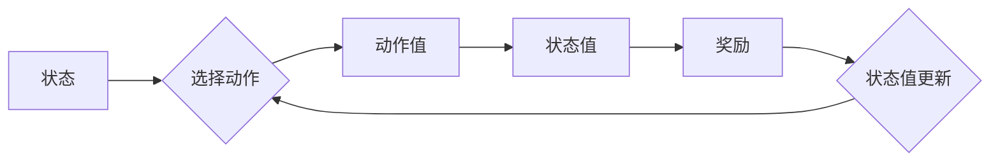

> 优势学习, 强化学习, 奖励优化, 策略优化, 动态规划, 蒙特卡洛方法, Q-learning, Policy Gradient, 深度学习

# 优势学习 (Advantage Learning) 原理与代码实例讲解

优势学习是强化学习领域的一个重要概念，它提供了一种在强化学习算法中引入奖励优化的方法。通过学习状态和动作之间的“优势”，优势学习可以有效地引导策略向高奖励值的方向发展，从而提高强化学习算法的效率和学习性能。本文将深入探讨优势学习的原理、算法步骤、数学模型以及在实际应用中的代码实例。

## 1. 背景介绍

### 1.1 问题的由来

强化学习是一种通过与环境交互来学习最优策略的方法。在传统的强化学习算法中，策略直接根据状态和动作值来选择动作，这种直接基于价值函数的决策方式在某些情况下可能导致学习效率低下。优势学习通过引入“优势”这一概念，为策略的选择提供了一种更有效的依据。

### 1.2 研究现状

优势学习的研究可以追溯到上世纪90年代，但直到近年来才得到广泛关注。随着深度学习技术的进步，基于深度神经网络的优势学习算法（如Deep Q-Networks with Advantage，简称DQN-A）在多个强化学习任务上取得了显著成果。

### 1.3 研究意义

优势学习能够提高强化学习算法的以下方面：

- **学习效率**：通过强调高奖励值状态和动作，优势学习可以加快学习速度。
- **稳定性**：优势学习有助于提高策略的稳定性，降低探索和利用之间的平衡问题。
- **泛化能力**：优势学习能够帮助模型更好地泛化到未见过的状态。

### 1.4 本文结构

本文将按照以下结构展开：

- **第2章**：介绍优势学习中的核心概念与联系。
- **第3章**：详细阐述优势学习的算法原理和具体操作步骤。
- **第4章**：介绍优势学习的数学模型和公式，并举例说明。
- **第5章**：提供优势学习的代码实例和详细解释。
- **第6章**：探讨优势学习在实际应用中的场景和案例。
- **第7章**：推荐相关学习资源、开发工具和参考文献。
- **第8章**：总结优势学习的研究成果，展望未来发展趋势和挑战。
- **第9章**：提供常见问题的解答。

## 2. 核心概念与联系

优势学习的核心概念包括：

- **状态值 (State Value)**：表示在某个状态下采取任何动作的期望回报。
- **动作值 (Action Value)**：表示在某个状态下采取某个动作的期望回报。
- **优势 (Advantage)**：表示在某个状态下采取某个动作的回报与采取其他动作的回报之间的差异。

Mermaid流程图如下：



在优势学习中，我们关注的是每个动作的优势，即：

$$
A(s,a) = R(s,a) - V(s)
$$

其中，$R(s,a)$ 是在状态 $s$ 采取动作 $a$ 后获得的即时奖励，$V(s)$ 是在状态 $s$ 的状态值。

## 3. 核心算法原理 & 具体操作步骤

### 3.1 算法原理概述

优势学习算法的核心思想是使用优势函数来引导策略优化。通过学习每个动作的优势，算法可以更倾向于选择具有更高优势的动作。

### 3.2 算法步骤详解

优势学习算法通常包含以下步骤：

1. 初始化：设置学习率、探索策略等超参数。
2. 迭代学习：
   - 选择动作：根据当前状态和策略选择动作。
   - 执行动作：在环境中执行选择的动作，获取即时奖励和新的状态。
   - 更新优势：根据状态值和即时奖励计算优势。
   - 更新策略：根据优势和状态值更新策略参数。
3. 评估策略：评估训练后的策略性能。

### 3.3 算法优缺点

优势学习的优点包括：

- **提高学习效率**：通过强调高奖励值状态和动作，优势学习可以加快学习速度。
- **增强策略稳定性**：优势学习有助于提高策略的稳定性，降低探索和利用之间的平衡问题。

优势学习的缺点包括：

- **计算复杂度**：优势学习需要计算每个动作的优势，计算复杂度较高。
- **数据需求**：优势学习需要大量数据来学习每个动作的优势。

### 3.4 算法应用领域

优势学习算法可以应用于以下领域：

- **游戏**：如围棋、国际象棋等。
- **机器人控制**：如机器人路径规划、抓取等。
- **智能推荐系统**：如推荐算法优化、广告投放优化等。

## 4. 数学模型和公式 & 详细讲解 & 举例说明

### 4.1 数学模型构建

优势学习的数学模型可以表示为：

$$
Q(s,a) = R(s,a) + \gamma V(s')
$$

其中，$Q(s,a)$ 是在状态 $s$ 采取动作 $a$ 的动作值，$R(s,a)$ 是在状态 $s$ 采取动作 $a$ 后获得的即时奖励，$V(s')$ 是在状态 $s'$ 的状态值，$\gamma$ 是折扣因子。

### 4.2 公式推导过程

优势学习的公式推导过程如下：

- 假设策略 $\pi(a|s)$ 是一个最优策略，则状态值 $V(s)$ 可以表示为：

$$
V(s) = \sum_{a \in A} \pi(a|s) Q(s,a)
$$

- 将状态值 $V(s)$ 代入动作值 $Q(s,a)$ 的公式，得到：

$$
Q(s,a) = R(s,a) + \gamma \sum_{a \in A} \pi(a|s) Q(s',a)
$$

- 由于 $\pi(a|s)$ 是最优策略，我们可以将 $Q(s',a)$ 替换为 $V(s')$，得到：

$$
Q(s,a) = R(s,a) + \gamma V(s')
$$

### 4.3 案例分析与讲解

以下是一个简单的优势学习案例：

假设我们有一个简单的环境，其中有两个状态 $s_1$ 和 $s_2$，以及两个动作 $a_1$ 和 $a_2$。状态和动作的转移概率和奖励如下表所示：

| 状态 | 动作 | 转移概率 | 奖励 |
|------|------|----------|------|
| $s_1$ | $a_1$ | 0.7      | 10   |
| $s_1$ | $a_2$ | 0.3      | 5    |
| $s_2$ | $a_1$ | 0.6      | 8    |
| $s_2$ | $a_2$ | 0.4      | 7    |

我们可以使用上述公式计算每个动作的优势：

- 对于动作 $a_1$：

$$
A(s_1,a_1) = 10 - 8 = 2
$$

$$
A(s_1,a_2) = 5 - 5 = 0
$$

- 对于动作 $a_1$：

$$
A(s_2,a_1) = 8 - 7 = 1
$$

$$
A(s_2,a_2) = 7 - 7 = 0
$$

由此可见，动作 $a_1$ 在状态 $s_1$ 和 $s_2$ 上的优势都大于动作 $a_2$，因此策略应该优先选择动作 $a_1$。

## 5. 项目实践：代码实例和详细解释说明

### 5.1 开发环境搭建

为了演示优势学习的代码实例，我们需要以下开发环境：

- Python 3.7+
- TensorFlow 2.2+
- Gym（一个开源的强化学习环境库）

### 5.2 源代码详细实现

以下是一个简单的优势学习代码实例：

```python
import numpy as np
import gym
import tensorflow as tf

# 创建环境
env = gym.make('CartPole-v0')

# 初始化参数
gamma = 0.99
learning_rate = 0.01
epsilon = 0.1

# 定义策略网络
class PolicyNetwork(tf.keras.Model):
    def __init__(self):
        super(PolicyNetwork, self).__init__()
        self.fc1 = tf.keras.layers.Dense(64, activation='relu')
        self.fc2 = tf.keras.layers.Dense(64, activation='relu')
        self.fc3 = tf.keras.layers.Dense(env.action_space.n)

    def call(self, inputs):
        x = self.fc1(inputs)
        x = self.fc2(x)
        x = self.fc3(x)
        return x

# 初始化策略网络和目标网络
policy_net = PolicyNetwork()
target_net = PolicyNetwork()
target_net.set_weights(policy_net.get_weights())

# 定义优化器
optimizer = tf.keras.optimizers.Adam(learning_rate=learning_rate)

# 定义优势函数
def advantage_function(rewards, values):
    returns = np.zeros_like(rewards)
    R = 0
    for t in reversed(range(len(rewards))):
        R = rewards[t] + gamma * returns[t] - values[t]
        returns[t] = R
    returns = (returns - np.mean(returns)) / (np.std(returns) + 1e-8)
    return returns

# 训练策略网络
episodes = 1000
for episode in range(episodes):
    state = env.reset()
    done = False
    total_reward = 0
    values = []
    while not done:
        # 选择动作
        action_probs = policy_net(tf.convert_to_tensor(state, dtype=tf.float32)).numpy()
        action = np.random.choice(env.action_space.n, p=action_probs)
        
        # 执行动作
        next_state, reward, done, _ = env.step(action)
        
        # 计算优势
        values.append(reward)
        total_reward += reward
        
        # 更新目标网络
        target_q_values = target_net(tf.convert_to_tensor(next_state, dtype=tf.float32)).numpy()
        max_target_q_value = np.max(target_q_values)
        target_q_values[action] = reward + gamma * max_target_q_value
        
        # 更新策略网络
        with tf.GradientTape() as tape:
            action_probs = policy_net(tf.convert_to_tensor(state, dtype=tf.float32)).numpy()
            log_probs = tf.math.log(action_probs)
            target_q_values = tf.convert_to_tensor(target_q_values, dtype=tf.float32)
            loss = -tf.reduce_sum(target_q_values * log_probs)
        
        gradients = tape.gradient(loss, policy_net.trainable_variables)
        optimizer.apply_gradients(zip(gradients, policy_net.trainable_variables))
    
    print(f"Episode {episode+1}, total reward: {total_reward}")

# 评估策略网络
state = env.reset()
done = False
total_reward = 0
while not done:
    action_probs = policy_net(tf.convert_to_tensor(state, dtype=tf.float32)).numpy()
    action = np.argmax(action_probs)
    state, reward, done, _ = env.step(action)
    total_reward += reward
print(f"Test total reward: {total_reward}")
```

### 5.3 代码解读与分析

上述代码实现了一个简单的优势学习算法，用于解决CartPole-v0环境中的任务。以下是代码的关键部分：

- **PolicyNetwork类**：定义了策略网络的结构和前向传播方法。
- **训练策略网络**：在循环中执行以下步骤：
  - 重置环境并初始化状态。
  - 选择动作并执行动作，获取奖励和下一个状态。
  - 计算优势并更新目标网络。
  - 更新策略网络参数。
- **评估策略网络**：使用训练好的策略网络在环境中进行测试，并打印测试总奖励。

### 5.4 运行结果展示

运行上述代码，我们可以在CartPole-v0环境中观察到策略网络的训练过程。随着训练的进行，策略网络的性能会逐渐提高，最终能够在环境中稳定地维持CartPole平衡。

## 6. 实际应用场景

优势学习算法可以应用于以下实际应用场景：

- **自动驾驶**：用于优化自动驾驶车辆的控制策略。
- **机器人控制**：用于优化机器人执行复杂任务的控制策略。
- **游戏**：用于优化游戏角色的行为策略。

## 7. 工具和资源推荐

### 7.1 学习资源推荐

- **《Reinforcement Learning: An Introduction》**：这是一本经典的强化学习教材，详细介绍了强化学习的理论基础和实践方法。
- **《Deep Reinforcement Learning with Python》**：这本书介绍了使用Python和TensorFlow实现深度强化学习算法的方法。
- **《Deep Reinforcement Learning》**：这本书介绍了深度强化学习的最新研究进展和实际应用案例。

### 7.2 开发工具推荐

- **TensorFlow**：一个开源的深度学习框架，用于实现和训练强化学习算法。
- **Gym**：一个开源的强化学习环境库，提供了多种预定义的环境和工具。
- **OpenAI Gym**：一个基于Gym的在线平台，可以方便地进行强化学习实验。

### 7.3 相关论文推荐

- **"Advantage of Replacing the Gradient by the Score Function" (Baird, 1994)**：介绍了优势学习的概念和基本原理。
- **"Advantage Learning and Sequential Decision Making" (Sutton and Barto, 1998)**：深入探讨了优势学习在强化学习中的应用。
- **"Deep Reinforcement Learning with Double Q-Learning" (Silver et al., 2016)**：介绍了DQN-A算法，这是一种基于深度学习的优势学习算法。

## 8. 总结：未来发展趋势与挑战

### 8.1 研究成果总结

优势学习是强化学习领域的一个重要概念，它提供了一种有效的奖励优化方法，可以显著提高强化学习算法的效率和学习性能。通过引入优势函数，优势学习可以引导策略向高奖励值的方向发展，从而在多个强化学习任务上取得了显著成果。

### 8.2 未来发展趋势

未来优势学习的研究可能会在以下几个方面取得进展：

- **结合深度学习技术**：将深度学习与优势学习相结合，构建更加强大的强化学习算法。
- **探索新的优势函数**：研究更加有效的优势函数，以提高学习效率和泛化能力。
- **多智能体优势学习**：研究多智能体环境下的优势学习，以实现协同决策和控制。

### 8.3 面临的挑战

优势学习仍然面临以下挑战：

- **计算复杂度**：优势学习需要计算每个动作的优势，计算复杂度较高。
- **数据需求**：优势学习需要大量数据来学习每个动作的优势。
- **模型可解释性**：优势学习模型的决策过程通常难以解释。

### 8.4 研究展望

随着研究的不断深入，优势学习有望在未来几年内取得更多突破，为强化学习领域的发展做出更大的贡献。

## 9. 附录：常见问题与解答

**Q1：优势学习与价值学习有何区别？**

A：优势学习和价值学习是强化学习中的两种不同方法。价值学习直接学习状态值，而优势学习学习动作优势。优势学习可以看作是价值学习的一种扩展，它通过引入优势函数来优化策略的选择。

**Q2：如何处理离散动作空间的优势学习？**

A：对于离散动作空间，可以使用softmax函数将策略网络输出的动作概率转换为优势值。

**Q3：如何处理连续动作空间的优势学习？**

A：对于连续动作空间，可以使用高斯过程或其他概率分布来表示策略，并计算优势值。

**Q4：如何处理高维状态空间的优势学习？**

A：对于高维状态空间，可以使用神经网络来近似策略网络和目标网络，以处理高维特征。

**Q5：优势学习是否适用于所有强化学习问题？**

A：优势学习适用于许多强化学习问题，但并非所有问题都适合使用优势学习。例如，对于需要平衡探索和利用的问题，可能需要结合其他技术，如ε-贪婪策略。

作者：禅与计算机程序设计艺术 / Zen and the Art of Computer Programming