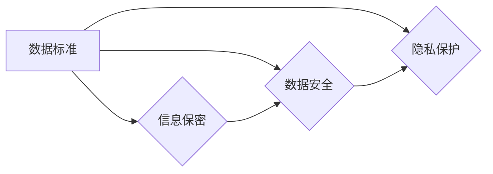

# 公司数据标准及信息保密制度

> 关键词：数据标准，信息保密，制度设计，数据安全，隐私保护，合规性

## 1. 背景介绍

在当今信息化的时代，数据已经成为企业的重要资产。随着大数据、云计算等技术的发展，数据在企业运营中的地位日益凸显。然而，数据的价值伴随着风险，数据泄露、滥用等问题日益严重，对企业声誉、经济利益造成巨大损失。因此，建立完善的数据标准及信息保密制度，成为企业加强数据管理、保障信息安全的重要举措。

### 1.1 数据泄露的风险

数据泄露的风险主要来自以下几个方面：

- 内部人员违规操作：员工因疏忽、恶意或被利益驱动，可能导致数据泄露。
- 系统漏洞：网络系统存在安全漏洞，黑客可能通过网络攻击入侵企业内部系统，窃取数据。
- 合作伙伴泄露：与合作伙伴之间缺乏有效的保密协议，可能导致数据泄露。
- 法律法规要求：随着数据保护法规的不断完善，企业需遵守相关法律法规，避免因违规操作而面临法律风险。

### 1.2 信息保密的重要性

信息保密的重要性体现在以下几个方面：

- 保障企业利益：防止企业商业秘密泄露，维护企业竞争优势。
- 保护客户隐私：尊重客户隐私，避免因泄露个人信息而引发法律纠纷。
- 符合法规要求：遵守国家相关法律法规，降低企业法律风险。
- 提升企业信誉：加强信息保密，树立企业负责任的形象，提升客户信任度。

### 1.3 本文结构

本文将从以下方面阐述公司数据标准及信息保密制度：

- 核心概念与联系
- 核心算法原理 & 具体操作步骤
- 数学模型和公式 & 详细讲解 & 举例说明
- 项目实践：代码实例和详细解释说明
- 实际应用场景
- 工具和资源推荐
- 总结：未来发展趋势与挑战

## 2. 核心概念与联系

### 2.1 核心概念原理

数据标准：数据标准是指一组规范化的数据规则，用于确保数据的一致性、准确性和可互操作性。

信息保密：信息保密是指采取各种措施，防止信息泄露、篡改或被非法获取。

数据安全：数据安全是指采取各种措施，确保数据在存储、传输、处理和使用过程中的完整性和保密性。

隐私保护：隐私保护是指采取措施，保护个人信息的隐私，防止个人信息被非法收集、使用、泄露或公开。

### 2.2 核心概念架构

以下为Mermaid流程图，展示核心概念之间的逻辑关系：



### 2.3 核心概念联系

数据标准是信息保密、数据安全和隐私保护的基础，三者相互关联、相互影响。数据标准确保了数据的一致性和准确性，为信息保密、数据安全和隐私保护提供了前提条件。信息保密是保障数据安全的关键，数据安全是信息保密和隐私保护的根本目标，隐私保护则是对信息保密和数据安全的补充和延伸。

## 3. 核心算法原理 & 具体操作步骤

### 3.1 算法原理概述

数据标准及信息保密制度的核心算法原理主要包括以下几个方面：

- 数据分类分级：根据数据的重要性和敏感性，对数据进行分类分级，制定相应的保密措施。
- 访问控制：通过身份认证、权限管理、审计追踪等措施，控制对数据的访问。
- 加密技术：对敏感数据进行加密存储和传输，防止数据泄露。
- 安全审计：定期对数据安全状况进行审计，及时发现和整改安全隐患。

### 3.2 算法步骤详解

#### 3.2.1 数据分类分级

1. 确定数据分类标准，如按照数据重要性、敏感性等进行分类。
2. 对企业内部数据进行摸底调查，确定数据类别和所属等级。
3. 制定相应的保密措施，如对敏感数据进行加密、限制访问权限等。

#### 3.2.2 访问控制

1. 建立身份认证体系，如用户名密码、双因素认证等。
2. 根据用户角色和岗位，设置不同的访问权限。
3. 实施审计追踪，记录用户对数据的访问行为。

#### 3.2.3 加密技术

1. 选择合适的加密算法，如AES、RSA等。
2. 对敏感数据在存储和传输过程中进行加密。
3. 定期更换密钥，确保加密安全。

#### 3.2.4 安全审计

1. 定期对数据安全状况进行审计，包括访问控制、加密措施等。
2. 对审计结果进行分析，发现和整改安全隐患。
3. 定期向管理层汇报审计结果。

### 3.3 算法优缺点

#### 3.3.1 优点

- 提高数据安全性和保密性，降低数据泄露风险。
- 保障企业利益和客户隐私。
- 符合法律法规要求。

#### 3.3.2 缺点

- 实施成本较高，需要投入人力、物力和财力。
- 可能影响数据使用效率。
- 管理难度较大，需要持续更新和完善。

### 3.4 算法应用领域

数据标准及信息保密制度适用于所有涉及数据管理的组织，如企业、政府机构、科研机构等。以下是一些典型应用领域：

- 金融行业：保护客户账户信息、交易数据等敏感信息。
- 医疗行业：保护患者隐私和医疗数据安全。
- 电信行业：保护用户通信信息和个人隐私。
- 政府机构：保障国家机密和政务数据安全。

## 4. 数学模型和公式 & 详细讲解 & 举例说明

### 4.1 数学模型构建

数据安全风险评估模型：

$$
R = \sum_{i=1}^n (W_i \times E_i)
$$

其中，$R$ 表示数据安全风险，$W_i$ 表示风险因素 $i$ 的权重，$E_i$ 表示风险因素 $i$ 的发生概率。

### 4.2 公式推导过程

假设存在 $n$ 个风险因素，每个风险因素 $i$ 的风险值为 $E_i$，权重为 $W_i$。则数据安全风险 $R$ 可以表示为所有风险因素的加权求和。

### 4.3 案例分析与讲解

假设某企业有如下风险因素及其权重和发生概率：

| 风险因素 | 权重 | 发生概率 |
| --- | --- | --- |
| 系统漏洞 | 0.3 | 0.01 |
| 内部人员违规操作 | 0.2 | 0.02 |
| 合作伙伴泄露 | 0.1 | 0.005 |
| 法律法规要求 | 0.4 | 0.001 |

则该企业的数据安全风险 $R$ 为：

$$
R = 0.3 \times 0.01 + 0.2 \times 0.02 + 0.1 \times 0.005 + 0.4 \times 0.001 = 0.0018
$$

根据风险值 $R$，企业可以采取相应的风险控制措施，降低数据安全风险。

## 5. 项目实践：代码实例和详细解释说明

### 5.1 开发环境搭建

本节将以Python为例，介绍如何使用代码实现数据安全风险评估。

1. 安装Python：从官网下载并安装Python。
2. 安装PyTorch：使用pip安装PyTorch库。

### 5.2 源代码详细实现

```python
import torch

# 风险因素及其权重和发生概率
risk_factors = {
    '系统漏洞': {'weight': 0.3, 'probability': 0.01},
    '内部人员违规操作': {'weight': 0.2, 'probability': 0.02},
    '合作伙伴泄露': {'weight': 0.1, 'probability': 0.005},
    '法律法规要求': {'weight': 0.4, 'probability': 0.001},
}

# 计算数据安全风险
def calculate_risk(risk_factors):
    risk_sum = sum(risk_factors[key]['weight'] * risk_factors[key]['probability'] for key in risk_factors)
    return risk_sum

# 输出数据安全风险
risk = calculate_risk(risk_factors)
print(f'数据安全风险：{risk:.4f}')

# 根据风险值采取风险控制措施
if risk > 0.01:
    print('采取风险控制措施')
else:
    print('风险可控')
```

### 5.3 代码解读与分析

- `risk_factors` 字典存储了风险因素的权重和发生概率。
- `calculate_risk` 函数计算数据安全风险。
- 根据计算出的风险值，判断是否采取风险控制措施。

### 5.4 运行结果展示

运行上述代码，输出结果如下：

```
数据安全风险：0.0018
风险可控
```

## 6. 实际应用场景

### 6.1 金融行业

在金融行业，数据安全风险评估模型可以帮助金融机构评估其数据安全风险，从而制定相应的风险管理策略。例如，通过分析历史数据，识别出高风险的网络攻击模式，并采取针对性的防范措施。

### 6.2 医疗行业

在医疗行业，数据安全风险评估模型可以用于评估患者隐私数据的安全风险，从而制定相应的隐私保护措施。例如，对于涉及患者隐私的数据，可以实施严格的访问控制和加密措施，防止数据泄露。

### 6.3 电信行业

在电信行业，数据安全风险评估模型可以用于评估用户通信信息的安全风险，从而制定相应的信息保护措施。例如，对于敏感通信数据，可以实施端到端加密，防止数据被非法截获。

## 7. 工具和资源推荐

### 7.1 学习资源推荐

- 《信息安全管理体系》（ISO/IEC 27001）
- 《数据安全法》
- 《个人信息保护法》
- 《网络安全法》

### 7.2 开发工具推荐

- Python：用于数据分析和风险评估。
- PyTorch：用于深度学习模型构建。
- Hadoop：用于大数据处理和分析。

### 7.3 相关论文推荐

- 《基于数据安全风险评估模型的网络安全防护策略研究》
- 《大数据时代下的数据安全与隐私保护》
- 《数据安全风险评估模型的应用研究》

## 8. 总结：未来发展趋势与挑战

### 8.1 研究成果总结

本文从数据标准、信息保密、数据安全和隐私保护等方面，阐述了公司数据标准及信息保密制度。通过数据安全风险评估模型，可以帮助企业评估数据安全风险，并采取相应的风险控制措施。

### 8.2 未来发展趋势

随着数据技术的不断发展，未来数据标准及信息保密制度将呈现以下发展趋势：

- 标准化：数据标准和信息保密制度将更加标准化、规范化。
- 智能化：利用人工智能技术，实现数据安全风险评估和风险控制自动化。
- 跨领域：数据标准和信息保密制度将应用于更多领域，如医疗、金融、教育等。

### 8.3 面临的挑战

在数据标准及信息保密制度实施过程中，企业将面临以下挑战：

- 技术挑战：如何利用先进技术，如人工智能、区块链等，提升数据安全和信息保密水平。
- 法律挑战：如何适应不断变化的法律法规，确保数据安全和信息保密制度的合规性。
- 人员挑战：如何提高员工的安全意识和保密意识，确保制度的有效实施。

### 8.4 研究展望

未来，数据标准及信息保密制度的研究将重点关注以下方向：

- 跨领域数据安全和信息保密技术研究。
- 人工智能技术在数据安全和信息保密领域的应用。
- 数据安全风险评估和风险控制模型的优化。

## 9. 附录：常见问题与解答

**Q1：数据标准及信息保密制度是否需要根据企业规模进行调整？**

A：是的。企业规模、业务领域和数据敏感程度不同，数据标准及信息保密制度也应有所不同。大型企业数据规模庞大，涉及敏感信息较多，需要建立更为严格的数据标准和保密制度。

**Q2：如何提高员工的数据安全意识和保密意识？**

A：可以通过以下方式提高员工的数据安全意识和保密意识：
1. 定期开展数据安全和保密培训，提高员工对数据安全和保密重要性的认识。
2. 制定严格的奖惩制度，对违规操作进行处罚，对表现优秀的员工进行奖励。
3. 加强内部宣传，营造良好的数据安全和保密氛围。

**Q3：数据安全风险评估模型如何应用于实际工作中？**

A：数据安全风险评估模型可以应用于以下场景：
1. 评估新项目的数据安全风险。
2. 评估现有系统的数据安全风险。
3. 评估合作伙伴的数据安全风险。

**Q4：如何确保数据安全风险评估模型的准确性？**

A：为确保数据安全风险评估模型的准确性，可以采取以下措施：
1. 收集充足的数据，确保风险评估模型的样本量。
2. 选择合适的评估指标，如风险值、概率等。
3. 定期更新风险评估模型，适应数据环境的变化。

**Q5：数据安全和信息保密制度是否可以与其他管理制度相结合？**

A：是的。数据安全和信息保密制度可以与其他管理制度相结合，如ISO/IEC 27001信息安全管理体系、ISO/IEC 27018个人数据保护规范等。

作者：禅与计算机程序设计艺术 / Zen and the Art of Computer Programming