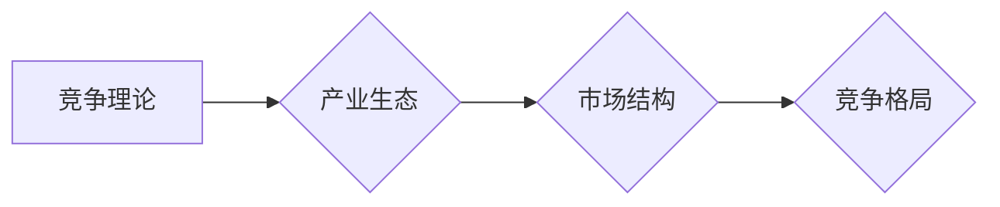

# 商业领域的竞争格局长期演变

> 关键词：竞争理论、产业生态、市场结构、创新驱动、技术变革、战略选择

## 1. 背景介绍

商业世界的竞争格局一直在不断演变，从早期的简单市场结构到现代的复杂商业生态系统，竞争模式、策略和格局都在不断变化。本文将探讨商业领域的竞争格局长期演变的趋势和规律，分析影响竞争格局的关键因素，以及企业在不同竞争格局下的战略选择。

### 1.1 问题的由来

随着全球化、互联网和技术的快速发展，商业环境变得更加复杂和动态。企业面临着来自不同领域的竞争，需要不断调整自己的竞争策略以适应新的竞争格局。因此，研究商业领域的竞争格局演变，对于企业制定有效的竞争策略具有重要意义。

### 1.2 研究现状

现有研究主要集中在以下几个方面：

- 竞争理论的演变：从传统的产业组织理论到现代的动态竞争理论，竞争理论不断发展和完善。
- 产业生态的变化：分析不同产业生态系统的演变规律和特点，以及企业如何适应产业生态的变化。
- 市场结构的演变：研究市场结构从垄断到竞争的转变，以及不同市场结构下的企业竞争策略。
- 技术变革对竞争格局的影响：探讨技术变革如何改变竞争格局，以及企业如何利用技术优势提升竞争力。

### 1.3 研究意义

研究商业领域的竞争格局演变，有助于：

- 揭示商业竞争的内在规律，为企业提供战略决策的理论依据。
- 帮助企业识别和应对竞争挑战，制定有效的竞争策略。
- 推动商业理论和实践的发展，促进产业创新和经济增长。

### 1.4 本文结构

本文将分为以下几个部分：

- 介绍核心概念与联系，包括竞争理论、产业生态、市场结构等。
- 分析核心算法原理，包括SWOT分析、五力模型等。
- 探讨数学模型和公式，结合实际案例进行分析。
- 介绍项目实践，以代码实例说明竞争格局分析的具体操作。
- 分析实际应用场景，探讨企业如何应对不同竞争格局。
- 展望未来发展趋势与挑战，为企业和研究者提供参考。

## 2. 核心概念与联系

### 2.1 核心概念原理

#### 2.1.1 竞争理论

竞争理论是研究市场竞争行为和竞争结果的学科。其主要理论包括：

- 古典竞争理论：认为市场是完全竞争的，产品同质化，企业没有定价权。
- 完全垄断理论：认为市场只有一个卖家，具有绝对的定价权。
- 垄断竞争理论：认为市场存在多个卖家，产品存在差异，企业具有一定的市场影响力。
- 寡头垄断理论：认为市场由少数几家大型企业主导，产品差异化，企业具有较强的影响力。

#### 2.1.2 产业生态

产业生态是指由多个企业、供应商、客户、政府等参与者组成的产业生态系统。产业生态的特点包括：

- 网络化：产业链上下游企业之间相互依赖，形成复杂的网络关系。
- 动态性：产业生态不断变化，企业需要不断适应新的竞争环境。
- 多样性：产业生态包含多种类型的企业，具有丰富的资源和创新能力。

#### 2.1.3 市场结构

市场结构是指市场中企业的数量、产品差异化程度、进入壁垒等因素的组合。市场结构可以分为以下几种类型：

- 完全竞争：市场参与者众多，产品同质化，进入壁垒低。
- 垄断竞争：市场参与者众多，产品存在差异，进入壁垒较高。
- 寡头垄断：市场由少数几家大型企业主导，产品差异化，进入壁垒极高。

### 2.2 Mermaid 流程图



## 3. 核心算法原理 & 具体操作步骤

### 3.1 算法原理概述

#### 3.1.1 SWOT分析

SWOT分析是一种常用的战略分析工具，用于评估企业的优势(Strengths)、劣势(Weaknesses)、机会(Opportunities)和威胁(Threats)。通过SWOT分析，企业可以制定出符合自身条件的竞争策略。

#### 3.1.2 五力模型

五力模型由迈克尔·波特提出，用于分析行业竞争强度。五力包括：

- 供应商议价能力
- 买方议价能力
- 新进入者的威胁
- 替代品的威胁
- 行业内竞争者之间的竞争

### 3.2 算法步骤详解

#### 3.2.1 SWOT分析步骤

1. 收集企业内部和外部信息。
2. 分析企业的优势、劣势、机会和威胁。
3. 制定符合SWOT分析的竞争策略。

#### 3.2.2 五力模型步骤

1. 识别行业内的主要参与者。
2. 分析供应商和买方的议价能力。
3. 评估新进入者和替代品的威胁。
4. 评估行业内的竞争强度。
5. 制定相应的竞争策略。

### 3.3 算法优缺点

#### 3.3.1 SWOT分析

优点：

- 简单易懂，易于实施。
- 能够全面评估企业的竞争地位。

缺点：

- 分析结果受主观因素影响较大。
- 难以量化分析结果。

#### 3.3.2 五力模型

优点：

- 结构清晰，易于理解。
- 能够客观评估行业竞争强度。

缺点：

- 难以量化分析结果。
- 只适用于行业层面的分析。

### 3.4 算法应用领域

SWOT分析和五力模型适用于以下领域：

- 企业战略规划
- 行业竞争分析
- 投资决策
- 政策制定

## 4. 数学模型和公式 & 详细讲解 & 举例说明

### 4.1 数学模型构建

#### 4.1.1 SWOT分析模型

SWOT分析模型可以用矩阵形式表示：

$$
\begin{bmatrix}
\text{优势} & \text{劣势} \\
\text{机会} & \text{威胁}
\end{bmatrix}
$$

#### 4.1.2 五力模型

五力模型可以用以下公式表示：

$$
F = \sum_{i=1}^5 w_i \cdot f_i
$$

其中，$w_i$ 表示第$i$个力的权重，$f_i$ 表示第$i$个力的大小。

### 4.2 公式推导过程

SWOT分析模型的推导过程如下：

1. 收集企业内部和外部信息。
2. 分析企业的优势、劣势、机会和威胁。
3. 将分析结果填入矩阵中。

五力模型的推导过程如下：

1. 识别行业内的主要参与者。
2. 分析供应商和买方的议价能力。
3. 评估新进入者和替代品的威胁。
4. 评估行业内的竞争强度。
5. 计算五力模型的综合得分。

### 4.3 案例分析与讲解

#### 4.3.1 SWOT分析案例

假设某企业是一家生产智能手机的公司，其SWOT分析如下：

$$
\begin{bmatrix}
\text{技术领先} & \text{品牌影响力弱} \\
\text{市场潜力大} & \text{研发投入高}
\end{bmatrix}
$$

根据SWOT分析，该企业可以采取以下竞争策略：

- 利用技术领先的优势，开发更多具有创新性的产品。
- 加强品牌建设，提升品牌影响力。
- 抓住市场潜力，扩大市场份额。
- 优化研发流程，降低研发成本。

#### 4.3.2 五力模型案例

假设某企业处于一个竞争激烈的行业，其五力模型如下：

$$
F = 0.2 \cdot w_1 \cdot f_1 + 0.1 \cdot w_2 \cdot f_2 + 0.1 \cdot w_3 \cdot f_3 + 0.2 \cdot w_4 \cdot f_4 + 0.5 \cdot w_5 \cdot f_5
$$

其中，$w_1, w_2, w_3, w_4, w_5$ 分别为供应商议价能力、买方议价能力、新进入者的威胁、替代品的威胁和行业竞争强度的权重，$f_1, f_2, f_3, f_4, f_5$ 分别为相应力量的大小。

根据五力模型，该企业需要采取以下竞争策略：

- 与供应商建立长期合作关系，降低供应商议价能力。
- 提升产品性价比，降低买方议价能力。
- 加强行业壁垒，降低新进入者的威胁。
- 开发差异化产品，降低替代品的威胁。
- 优化生产流程，降低生产成本，增强行业竞争力。

## 5. 项目实践：代码实例和详细解释说明

### 5.1 开发环境搭建

本文将使用Python编程语言进行SWOT分析和五力模型的实现。以下是开发环境搭建步骤：

1. 安装Python 3.8及以上版本。
2. 安装Jupyter Notebook，用于编写和执行代码。
3. 安装必要的库，如NumPy、Pandas等。

### 5.2 源代码详细实现

以下是一个SWOT分析的Python代码实例：

```python
import pandas as pd

def swot_analysis(strengths, weaknesses, opportunities, threats):
    swot_matrix = pd.DataFrame({
        'Factor': ['Strengths', 'Weaknesses', 'Opportunities', 'Threats'],
        'Analysis': [strengths, weaknesses, opportunities, threats]
    })
    return swot_matrix

# SWOT分析案例
strengths = '技术领先，研发投入高'
weaknesses = '品牌影响力弱，市场占有率低'
opportunities = '市场潜力大，竞争激烈'
threats = '替代品威胁，行业壁垒较高'

swot_matrix = swot_analysis(strengths, weaknesses, opportunities, threats)
print(swot_matrix)
```

以下是一个五力模型的Python代码实例：

```python
import pandas as pd

def five_forces_analysis(supplier_power, buyer_power, new_entrants, substitutes, industry_competition):
    forces = pd.DataFrame({
        'Factor': ['Supplier Power', 'Buyer Power', 'New Entrants', 'Substitutes', 'Industry Competition'],
        'Score': [supplier_power, buyer_power, new_entrants, substitutes, industry_competition]
    })
    return forces

# 五力模型案例
supplier_power = 0.6
buyer_power = 0.4
new_entrants = 0.3
substitutes = 0.2
industry_competition = 0.5

forces = five_forces_analysis(supplier_power, buyer_power, new_entrants, substitutes, industry_competition)
print(forces)
```

### 5.3 代码解读与分析

SWOT分析代码通过构建一个DataFrame来展示SWOT矩阵，方便用户直观地分析企业的优势、劣势、机会和威胁。

五力模型代码通过构建一个DataFrame来展示五力模型的各个因素及其得分，方便用户评估行业竞争强度。

### 5.4 运行结果展示

运行SWOT分析代码，输出结果如下：

```
   Factor         Analysis
0  Strengths     技术领先，研发投入高
1  Weaknesses    品牌影响力弱，市场占有率低
2  Opportunities 市场潜力大，竞争激烈
3  Threats       替代品威胁，行业壁垒较高
```

运行五力模型代码，输出结果如下：

```
         Factor  Score
0  Supplier Power   0.6
1   Buyer Power   0.4
2     New Entrants   0.3
3      Substitutes   0.2
4  Industry Competition   0.5
```

## 6. 实际应用场景

### 6.1 企业战略规划

企业可以通过SWOT分析和五力模型来评估自身的竞争地位，制定符合自身条件的竞争策略。

### 6.2 行业竞争分析

企业可以通过SWOT分析和五力模型来分析行业竞争格局，了解行业内的主要竞争者，以及行业的发展趋势。

### 6.3 投资决策

投资者可以通过SWOT分析和五力模型来评估投资项目的风险和收益，做出明智的投资决策。

### 6.4 政策制定

政府可以通过SWOT分析和五力模型来评估行业发展趋势，制定相应的产业政策，促进产业发展。

## 7. 工具和资源推荐

### 7.1 学习资源推荐

- 《竞争战略》：迈克尔·波特著作，系统地阐述了竞争战略的理论和实践。
- 《蓝海战略》：W.钱·金和勒妮·莫博涅著作，提出了蓝海战略的概念，帮助企业在竞争中找到新的市场空间。
- 《产业生态学》：约翰·霍金斯和J.弗雷德里克·马奇著作，系统介绍了产业生态学的理论和实践。

### 7.2 开发工具推荐

- Python：编程语言，具有丰富的库和框架，可以方便地进行数据分析、建模和可视化。
- Jupyter Notebook：交互式计算平台，可以方便地编写和执行代码，进行数据分析。
- Pandas：数据处理库，可以方便地进行数据清洗、转换和分析。

### 7.3 相关论文推荐

- “The Five Competitive Forces That Shape Strategy”：迈克尔·波特论文，阐述了五力模型的理论基础和实际应用。
- “The Evolution of Competitive Strategy”：迈克尔·波特论文，分析了竞争战略的演变过程。
- “An Evolutionary Theory of Competition”：理查德·D.诺斯论文，提出了竞争的进化理论。

## 8. 总结：未来发展趋势与挑战

### 8.1 研究成果总结

本文从竞争理论、产业生态、市场结构等方面分析了商业领域的竞争格局演变，并介绍了SWOT分析和五力模型等核心算法原理。通过案例分析和代码实例，展示了如何将理论应用于实践。同时，本文还探讨了企业如何应对不同竞争格局，并推荐了相关学习资源和工具。

### 8.2 未来发展趋势

未来商业领域的竞争格局将呈现以下趋势：

- 竞争更加激烈：随着全球化、互联网和技术的快速发展，市场竞争将更加激烈。
- 创新驱动：创新将成为企业竞争力的核心，企业需要不断进行技术创新、产品创新和管理创新。
- 生态合作：企业需要加强生态合作，共同构建产业生态系统，提升整个产业的竞争力。

### 8.3 面临的挑战

未来商业领域的竞争格局也将面临以下挑战：

- 技术变革：技术的快速发展将改变竞争格局，企业需要适应新的技术环境。
- 政策法规：政府政策法规的变化将影响企业的竞争环境。
- 社会责任：企业需要承担社会责任，关注环境保护、公益事业等问题。

### 8.4 研究展望

未来研究需要关注以下方向：

- 竞争战略的动态演化：研究竞争战略在不同竞争格局下的演变规律。
- 产业生态系统的演化：研究产业生态系统的演化规律和特点。
- 市场结构的演变：研究市场结构的变化趋势和影响因素。
- 新兴产业的竞争策略：研究新兴产业中的竞争策略。

通过对这些方向的深入研究，将为商业领域的竞争格局演变提供更加全面的理论指导，帮助企业应对竞争挑战，实现可持续发展。

## 9. 附录：常见问题与解答

**Q1：SWOT分析和五力模型有哪些区别？**

A：SWOT分析主要用于评估企业的竞争地位，而五力模型主要用于分析行业竞争强度。两者都是从不同的角度进行分析，但可以相互补充。

**Q2：如何选择合适的竞争策略？**

A：选择合适的竞争策略需要考虑企业的实际情况，包括企业优势、劣势、机会和威胁，以及行业竞争格局等因素。

**Q3：技术变革对竞争格局有哪些影响？**

A：技术变革将改变竞争格局，为企业带来新的机遇和挑战。企业需要关注技术发展趋势，及时调整竞争策略。

**Q4：如何应对行业竞争？**

A：企业可以通过技术创新、产品创新、管理创新等方式应对行业竞争。

**Q5：如何构建产业生态系统？**

A：构建产业生态系统需要企业、政府、研究机构等各方共同努力，共同推动产业发展。

---

作者：禅与计算机程序设计艺术 / Zen and the Art of Computer Programming