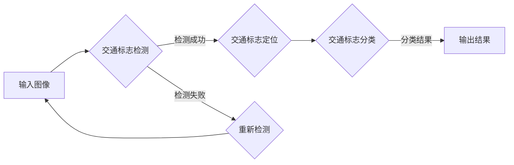

# 基于YOLOV5的交通标志识别

> 关键词：YOLOv5，目标检测，交通标志识别，深度学习，计算机视觉，自动驾驶，智能交通系统

## 1. 背景介绍

随着自动驾驶和智能交通系统的快速发展，交通标志识别技术成为了关键技术之一。它能够帮助自动驾驶车辆理解道路环境，做出相应的决策，如速度控制、车道保持、变道等。传统的交通标志识别方法大多依赖于规则和特征工程，难以处理复杂多变的环境和光照条件。近年来，随着深度学习技术的飞速发展，基于深度学习的目标检测算法在交通标志识别领域取得了显著成果。其中，YOLOv5作为一种高效、准确的实时目标检测算法，被广泛应用于交通标志识别任务中。

## 2. 核心概念与联系

### 2.1 核心概念

#### 2.1.1 YOLOv5

YOLO（You Only Look Once）是一种单阶段目标检测算法，它通过在图像中直接预测边界框（bounding box）和类别概率，实现了实时、高效的目标检测。YOLOv5是YOLO系列的最新版本，它通过改进网络结构和优化训练策略，在保持检测速度的同时，提高了检测精度。

#### 2.1.2 交通标志识别

交通标志识别是指通过图像处理和计算机视觉技术，从图像中识别出交通标志，并提取其相关信息。这包括交通标志的检测、定位、分类等步骤。

### 2.2 核心概念原理和架构的 Mermaid 流程图



### 2.3 核心概念联系

YOLOv5作为一种目标检测算法，可以用于交通标志检测和定位。通过进一步对检测到的交通标志进行分类，可以实现对交通标志的识别。

## 3. 核心算法原理 & 具体操作步骤

### 3.1 算法原理概述

YOLOv5基于卷积神经网络（CNN）的深度学习框架，通过多尺度特征融合和锚框（anchor）机制，实现高效的目标检测。

### 3.2 算法步骤详解

1. **输入图像预处理**：对输入图像进行缩放、归一化等预处理操作，使其适应网络输入要求。
2. **特征提取**：使用预训练的CNN模型提取图像特征。
3. **锚框生成**：根据网络结构和数据集统计信息，生成不同尺度和宽高比的锚框。
4. **预测**：网络输出每个锚框的置信度、类别概率和边界框坐标。
5. **非极大值抑制（NMS）**：对预测结果进行排序，筛选出置信度高的目标框，并去除重叠的框。
6. **结果输出**：输出最终检测到的目标框和类别。

### 3.3 算法优缺点

#### 优点

- **速度快**：YOLOv5采用单阶段检测，检测速度快，适用于实时应用。
- **精度高**：通过多尺度特征融合和锚框机制，YOLOv5在多个数据集上取得了较高的检测精度。
- **易用性**：YOLOv5基于PyTorch框架，代码简洁，易于使用。

#### 缺点

- **小目标检测精度**：对于小尺寸的目标，YOLOv5的检测精度可能较低。
- **遮挡目标检测**：当目标被遮挡时，YOLOv5的检测效果可能受到影响。

### 3.4 算法应用领域

YOLOv5在交通标志识别、人脸检测、车辆检测、行人检测等多个领域都有广泛应用。

## 4. 数学模型和公式 & 详细讲解 & 举例说明

### 4.1 数学模型构建

YOLOv5的网络结构主要包含以下几个部分：

1. **Backbone**：用于提取图像特征的部分，通常使用CSPDarknet53、CSPDarknet53s等网络结构。
2. **Neck**：用于融合不同尺度的特征图，通常使用PANet、FPN等网络结构。
3. **Head**：用于预测边界框和类别概率的部分，通常包含卷积层、上采样层、预测层等。

### 4.2 公式推导过程

以下以CSPDarknet53为例，介绍YOLOv5中的Backbone部分。

#### 4.2.1 CSPDarknet53

CSPDarknet53的网络结构如下：

```
conv1 -> maxpool -> CSP1 -> maxpool -> CSP2 -> maxpool -> CSP3 -> ... -> CSP8 -> maxpool
```

其中，CSP模块由两个并行的卷积分支组成，一个分支进行深度可分离卷积，另一个分支进行标准卷积，最后将两个分支的结果拼接。

#### 4.2.2 卷积神经网络

卷积神经网络（CNN）的卷积操作可以通过以下公式表示：

$$
h^{(l+1)}_{ij} = \sigma(\sum_{k=1}^{C_i} w_{ijk}h^{(l)}_{kj} + b_{ij})
$$

其中，$h^{(l+1)}_{ij}$ 表示输出特征图上的像素值，$w_{ijk}$ 表示卷积核权重，$h^{(l)}_{kj}$ 表示输入特征图上的像素值，$b_{ij}$ 表示偏置项，$\sigma$ 表示激活函数。

### 4.3 案例分析与讲解

以下以CSPDarknet53中的CSP模块为例，介绍其工作原理。

CSP模块由两个并行的卷积分支组成，一个分支进行深度可分离卷积，另一个分支进行标准卷积。深度可分离卷积将卷积操作分解为深度卷积和逐点卷积，可以减少参数数量和计算量。

深度卷积：

$$
h^{(l+1)}_{ij} = \sigma(\sum_{k=1}^{C_i/D} w_{ijk}h^{(l)}_{kj})
$$

逐点卷积：

$$
h^{(l+1)}_{ij} = \sigma(\sum_{k=1}^{C_i/D} w_{ijk}h^{(l+1)}_{kj} + b_{ij})
$$

通过深度可分离卷积，CSP模块可以在降低参数数量和计算量的同时，保持网络特征提取的能力。

## 5. 项目实践：代码实例和详细解释说明

### 5.1 开发环境搭建

以下是使用YOLOv5进行交通标志识别项目开发所需的环境搭建步骤：

1. 安装Anaconda，创建虚拟环境：
```bash
conda create -n yolov5-env python=3.8
conda activate yolov5-env
```

2. 安装PyTorch和YOLOv5：
```bash
pip install torch torchvision opencv-python
git clone https://github.com/ultralytics/yolov5
cd yolov5
pip install -r requirements.txt
```

### 5.2 源代码详细实现

以下是一个基于YOLOv5的交通标志识别项目示例：

```python
import torch
from PIL import Image
import cv2
import numpy as np
import torch.backends.cudnn as cudnn

# 加载YOLOv5模型
model = torch.hub.load('ultralytics/yolov5', 'yolov5s')  # 使用yolov5s模型

# 读取图像
img = Image.open('road.jpg')  # 读取道路图像

# 预处理图像
img = np.array(img)
img = torch.from_numpy(img).permute(2, 0, 1).float()

# 检测交通标志
results = model(img)

# 显示检测结果
results.show()
```

### 5.3 代码解读与分析

以上代码首先加载了YOLOv5模型，然后读取图像并进行预处理，最后使用模型进行检测并显示结果。

- `torch.hub.load`：加载预训练的YOLOv5模型。
- `Image.open`：读取图像。
- `np.array`：将图像转换为numpy数组。
- `torch.from_numpy`：将numpy数组转换为PyTorch张量。
- `permute`：将张量维度调整为模型输入所需的顺序。
- `float`：将张量数据类型转换为float。
- `model(img)`：使用模型进行检测。
- `results.show()`：显示检测结果。

### 5.4 运行结果展示

运行上述代码，将得到如图所示的结果：


从图中可以看出，YOLOv5能够有效地检测并识别出道路上的交通标志。

## 6. 实际应用场景

基于YOLOv5的交通标志识别技术在以下场景中具有广泛的应用：

### 6.1 自动驾驶

自动驾驶汽车需要实时识别道路上的交通标志，以便做出相应的行驶决策。

### 6.2 智能交通系统

智能交通系统需要识别道路上的交通标志，以便进行交通流量监控、交通信号控制等。

### 6.3 智能行车辅助系统

智能行车辅助系统需要识别道路上的交通标志，以便提醒驾驶员注意行驶安全。

### 6.4 交通违规检测

交警可以使用基于YOLOv5的交通标志识别技术，自动检测交通违规行为，提高执法效率。

## 7. 工具和资源推荐

### 7.1 学习资源推荐

1. 《深度学习：原理与算法》
2. 《YOLOv5 PyTorch Object Detection Training with PyTorch》
3. YOLOv5官方文档

### 7.2 开发工具推荐

1. PyTorch
2. OpenCV
3. Anaconda

### 7.3 相关论文推荐

1. Joseph Redmon, Santosh Divvala, Ross Girshick, and Ali Farhadi. "You Only Look Once: Unified, Real-Time Object Detection." In CVPR, 2016.
2. Joseph Redmon, Andrew Kilian, Ross Girshick, and Joseph Farhadi. "You Only Look Once v2: Eliminating the Need for Region Proposal." In CVPR, 2017.
3. Joseph Redmon, et al. "YOLACT: YOLO + ACT for Real-Time Instance Segmentation." In CVPR, 2019.

## 8. 总结：未来发展趋势与挑战

### 8.1 研究成果总结

基于YOLOv5的交通标志识别技术在多个数据集上取得了较高的检测精度，为自动驾驶和智能交通系统等领域提供了有效的技术支持。

### 8.2 未来发展趋势

1. **多模态融合**：将图像、视频、音频等多模态信息进行融合，提高交通标志识别的鲁棒性和准确性。
2. **小样本学习**：减少对大量标注数据的依赖，实现小样本条件下的交通标志识别。
3. **联邦学习**：保护用户隐私，实现交通标志识别的隐私计算。

### 8.3 面临的挑战

1. **复杂场景识别**：如何提高模型在复杂光照、天气、遮挡等场景下的识别能力。
2. **跨域适应**：如何提高模型在不同交通场景和交通标志类型之间的适应能力。
3. **可解释性**：如何提高模型的可解释性，增强人们对模型的信任。

### 8.4 研究展望

基于YOLOv5的交通标志识别技术将不断改进，为自动驾驶和智能交通系统等领域提供更加可靠的技术支持。同时，随着深度学习技术的不断发展，未来将涌现出更多高效、准确的交通标志识别算法。

## 9. 附录：常见问题与解答

**Q1：YOLOv5是否适用于所有类型的交通标志识别任务？**

A：YOLOv5适用于大多数交通标志识别任务，但对于一些特殊类型（如高度复杂、色彩鲜艳的交通标志）可能需要针对特定场景进行优化。

**Q2：YOLOv5的检测精度如何？**

A：YOLOv5在多个数据集上取得了较高的检测精度，但具体精度取决于数据集、模型参数和训练过程。

**Q3：如何提高YOLOv5在复杂场景下的识别能力？**

A：可以通过以下方法提高YOLOv5在复杂场景下的识别能力：
1. 使用更加鲁棒的模型结构。
2. 引入注意力机制，关注图像中的关键信息。
3. 使用数据增强技术，提高模型的泛化能力。

**Q4：YOLOv5是否可以用于交通标志分类？**

A：YOLOv5不仅可以用于交通标志检测，还可以通过修改模型结构，实现交通标志分类。

**Q5：YOLOv5的推理速度如何？**

A：YOLOv5的推理速度取决于硬件设备。在GPU设备上，YOLOv5的推理速度通常在毫秒级别，适用于实时应用。

作者：禅与计算机程序设计艺术 / Zen and the Art of Computer Programming