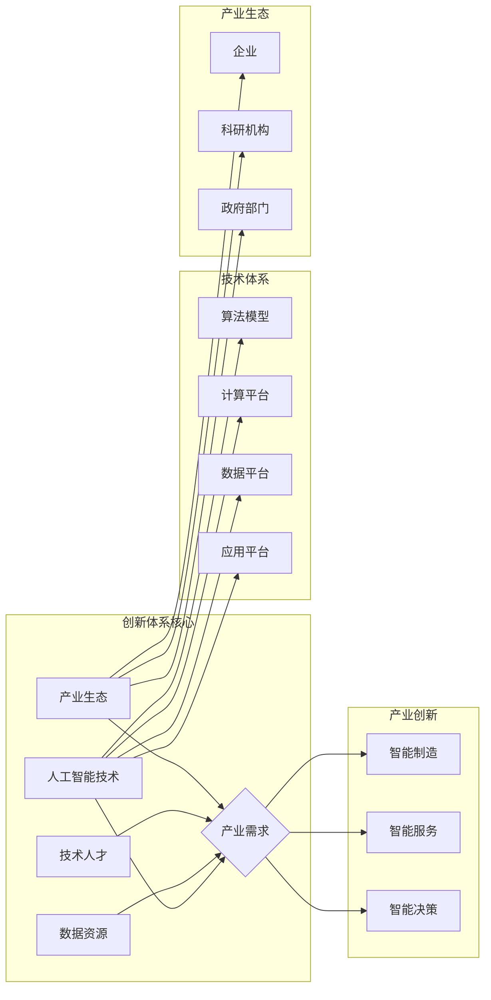

# 基于产业的AI创新体系

> 关键词：人工智能，产业创新，技术体系，产业生态，智能制造，数据驱动，智能决策，伦理道德

## 1. 背景介绍

随着信息技术的飞速发展，人工智能（AI）已经成为推动社会进步和产业变革的重要力量。从智能客服到自动驾驶，从智能医疗到智慧城市，AI技术的应用领域日益广泛。然而，如何构建一个有效的AI创新体系，以促进AI技术与产业的深度融合，成为当前产业发展的重要议题。

### 1.1 产业变革与AI技术

在过去的几十年里，全球产业经历了三次重要的变革：工业革命、信息革命和智能革命。智能革命的核心是AI技术，它通过模拟、延伸和扩展人类的智能，为产业升级提供了新的动力。

### 1.2 AI创新体系的重要性

AI创新体系是推动AI技术与产业深度融合的关键。一个完善的AI创新体系，能够有效整合创新资源，激发创新活力，推动AI技术在各产业领域的应用落地。

## 2. 核心概念与联系

### 2.1 核心概念

- **人工智能（AI）**：模拟、延伸和扩展人类智能的理论、方法、技术及应用。
- **产业创新**：通过技术创新、产品创新和管理创新，推动产业转型升级的过程。
- **技术体系**：由一系列技术构成，相互关联、相互支撑的技术体系。
- **产业生态**：以产业为核心，涵盖产业链上下游企业、科研机构、政府部门等各方利益相关者的生态系统。
- **智能制造**：利用AI技术，实现生产过程的智能化、自动化和高效化。
- **数据驱动**：以数据为核心，通过数据分析、挖掘和利用，驱动业务决策和产品创新。
- **智能决策**：利用AI技术，实现决策过程的自动化、智能化和精准化。
- **伦理道德**：在AI技术应用过程中，遵循伦理道德原则，确保技术发展符合人类价值观。

### 2.2 核心概念原理和架构的 Mermaid 流程图



## 3. 核心算法原理 & 具体操作步骤

### 3.1 算法原理概述

AI创新体系的核心是AI算法，它包括机器学习、深度学习、自然语言处理等。这些算法通过模拟人类智能，实现数据的分析和处理。

### 3.2 算法步骤详解

1. 数据采集：收集相关领域的海量数据，包括结构化数据和非结构化数据。
2. 数据预处理：对采集到的数据进行清洗、去噪、格式化等处理，使其适合算法训练。
3. 模型训练：选择合适的AI算法，利用预处理后的数据进行模型训练，优化模型参数。
4. 模型评估：对训练好的模型进行评估，确保其准确性和泛化能力。
5. 模型部署：将训练好的模型部署到实际应用场景，如智能制造、智能服务等。

### 3.3 算法优缺点

- **优点**：能够快速处理海量数据，提高决策效率，降低人力成本。
- **缺点**：需要大量高质量的数据，算法模型复杂，对计算资源要求高。

### 3.4 算法应用领域

- **智能制造**：生产过程自动化、设备预测性维护、供应链优化等。
- **智能服务**：智能客服、智能推荐、智能营销等。
- **智能决策**：金融风险评估、市场预测、资源调度等。

## 4. 数学模型和公式 & 详细讲解 & 举例说明

### 4.1 数学模型构建

AI算法通常基于数学模型进行构建，例如：

- **机器学习**：线性回归、逻辑回归、支持向量机等。
- **深度学习**：神经网络、卷积神经网络、循环神经网络等。

### 4.2 公式推导过程

以线性回归为例，其目标是最小化预测值与真实值之间的误差：

$$
\text{最小化} \quad \sum_{i=1}^{n}(y_i - \hat{y}_i)^2
$$

其中，$y_i$ 为真实值，$\hat{y}_i$ 为预测值。

### 4.3 案例分析与讲解

以智能客服为例，使用线性回归算法预测客户流失率：

1. 数据采集：收集客户的基本信息、消费记录、服务记录等数据。
2. 数据预处理：对数据进行清洗、去噪、格式化等处理。
3. 模型训练：使用线性回归算法训练模型，预测客户流失率。
4. 模型评估：使用验证集评估模型准确率。
5. 模型部署：将模型部署到智能客服系统中，预测客户流失率。

## 5. 项目实践：代码实例和详细解释说明

### 5.1 开发环境搭建

1. 安装Python开发环境。
2. 安装机器学习库，如scikit-learn、pandas等。

### 5.2 源代码详细实现

```python
# 导入相关库
import pandas as pd
from sklearn.model_selection import train_test_split
from sklearn.linear_model import LinearRegression

# 读取数据
data = pd.read_csv('customer_data.csv')

# 数据预处理
X = data.drop('流失', axis=1)
y = data['流失']

# 划分训练集和测试集
X_train, X_test, y_train, y_test = train_test_split(X, y, test_size=0.2)

# 线性回归模型训练
model = LinearRegression()
model.fit(X_train, y_train)

# 模型评估
score = model.score(X_test, y_test)
print(f"模型准确率：{score:.2f}")

# 预测客户流失率
predictions = model.predict(X_test)
print(predictions)
```

### 5.3 代码解读与分析

上述代码首先读取客户数据，然后进行数据预处理，包括去除不需要的特征、填充缺失值等。接着，使用线性回归模型进行训练，并在测试集上进行评估。最后，使用模型预测客户流失率。

## 6. 实际应用场景

### 6.1 智能制造

AI技术在智能制造中的应用，可以帮助企业实现生产过程的自动化、智能化和高效化。例如，利用机器学习算法进行设备预测性维护，可以降低设备故障率，延长设备使用寿命。

### 6.2 智能服务

AI技术在智能服务中的应用，可以提升用户体验，提高服务效率。例如，利用自然语言处理技术构建智能客服系统，可以24小时在线解答客户问题，提高客户满意度。

### 6.3 智能决策

AI技术在智能决策中的应用，可以帮助企业实现决策过程的自动化、智能化和精准化。例如，利用机器学习算法进行市场预测，可以帮助企业更好地制定市场策略。

## 7. 工具和资源推荐

### 7.1 学习资源推荐

1. 《深度学习》 - Ian Goodfellow、Yoshua Bengio、Aaron Courville
2. 《Python机器学习》 - Sebastian Raschka、Vahid Mirjalili
3. 《自然语言处理综合教程》 - 周志华

### 7.2 开发工具推荐

1. Python
2. TensorFlow
3. PyTorch
4. scikit-learn

### 7.3 相关论文推荐

1. "Deep Learning for Industrial Internet of Things" - Qing He et al.
2. "AI in Manufacturing: A Survey" - Xiangyun Li et al.
3. "The Impact of Artificial Intelligence on Services" - Sridharan Raghunathan et al.

## 8. 总结：未来发展趋势与挑战

### 8.1 研究成果总结

本文介绍了基于产业的AI创新体系，探讨了AI技术在产业中的应用现状和未来发展趋势。通过分析AI创新体系的核心概念和联系，以及AI技术的原理和应用场景，为产业发展提供了新的思路。

### 8.2 未来发展趋势

1. AI技术与产业深度融合，推动产业智能化升级。
2. AI算法模型和计算平台不断优化，提高AI应用性能。
3. AI伦理道德问题得到广泛关注，推动AI健康发展。

### 8.3 面临的挑战

1. 数据质量和服务质量难以保证。
2. AI技术人才短缺。
3. AI伦理道德问题亟待解决。

### 8.4 研究展望

未来，AI创新体系将在以下几个方面取得突破：

1. 开发更加高效、准确的AI算法模型。
2. 建立完善的AI伦理道德规范。
3. 培养更多AI技术人才。
4. 推动AI技术在更多产业领域的应用。

## 9. 附录：常见问题与解答

**Q1：AI技术在产业中的应用前景如何？**

A：AI技术在产业中的应用前景非常广阔，可以推动产业智能化升级，提高生产效率，降低生产成本，提升产品质量。

**Q2：如何培养AI技术人才？**

A：可以通过以下方式培养AI技术人才：
1. 开设AI相关专业课程。
2. 开展AI技术培训。
3. 鼓励企业进行AI技术研发。
4. 支持高校与企业的合作。

**Q3：AI伦理道德问题如何解决？**

A：可以通过以下方式解决AI伦理道德问题：
1. 建立AI伦理道德规范。
2. 加强AI技术研发伦理审查。
3. 增强公众对AI伦理道德的认识。
4. 强化AI技术研发企业的社会责任。

作者：禅与计算机程序设计艺术 / Zen and the Art of Computer Programming