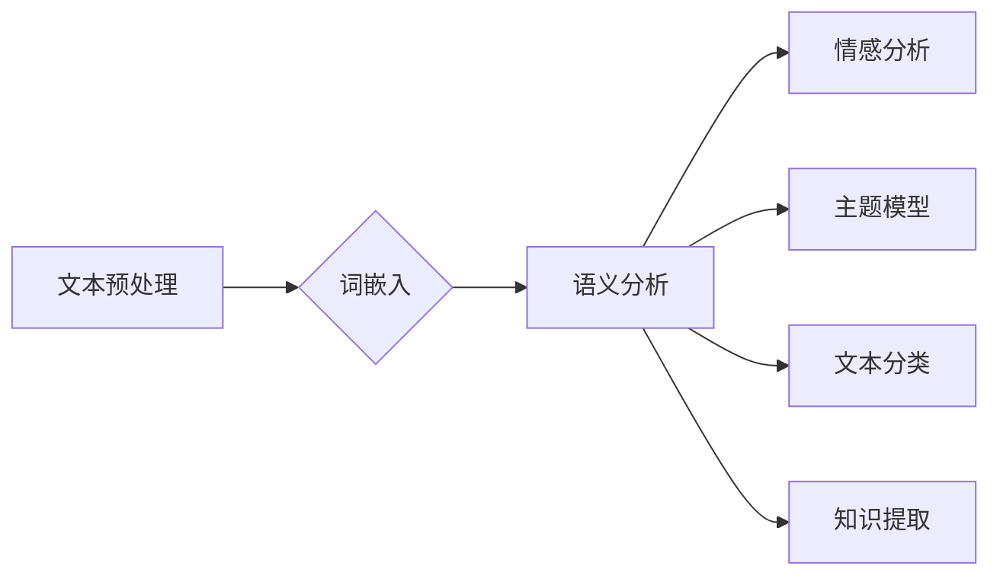

# 基于机器学习的文本语义分析工貝

> 关键词：机器学习，文本语义分析，自然语言处理，深度学习，词嵌入，情感分析，主题模型，文本分类

## 1. 背景介绍

文本数据是互联网时代最丰富的信息来源之一。然而，对于人类而言，理解和分析大量文本数据是一项耗时且复杂的任务。随着机器学习技术的飞速发展，文本语义分析作为一种重要的自然语言处理（Natural Language Processing, NLP）技术，已经成为信息检索、数据挖掘、智能客服等多个领域的核心技术。本文将深入探讨基于机器学习的文本语义分析技术，分析其原理、方法、应用以及未来发展趋势。

## 2. 核心概念与联系

### 2.1 核心概念

**文本语义分析（Text Semantic Analysis）**：文本语义分析是指通过计算机技术，对文本内容进行理解、提取、分析，从而获取文本中的知识、情感、意图等语义信息的过程。

**自然语言处理（Natural Language Processing, NLP）**：自然语言处理是计算机科学、人工智能和语言学等领域交叉的学科，旨在让计算机理解和生成人类自然语言。

**词嵌入（Word Embedding）**：词嵌入是一种将词语映射到高维向量空间的方法，能够捕捉词语之间的语义关系。

**情感分析（Sentiment Analysis）**：情感分析是指自动识别文本中表达的情感倾向，如正面、负面、中性等。

**主题模型（Topic Model）**：主题模型是一种概率模型，用于发现文档集中的主题分布，并识别每个文档所属的主题。

**文本分类（Text Classification）**：文本分类是指将文本数据自动分类到预定义的类别中。

### 2.2 Mermaid 流程图



### 2.3 核心概念联系

文本语义分析是NLP的核心任务之一，它涉及到多个子任务，如词嵌入、情感分析、主题模型、文本分类等。这些子任务相互关联，共同构成了文本语义分析的完整流程。

## 3. 核心算法原理 & 具体操作步骤

### 3.1 算法原理概述

基于机器学习的文本语义分析主要分为以下几个步骤：

1. **文本预处理**：对原始文本进行清洗、分词、去除停用词等操作，将文本转换为计算机可处理的格式。
2. **词嵌入**：将文本中的词语转换为高维向量，以便于进行数学计算。
3. **语义分析**：对词嵌入向量进行进一步处理，提取文本中的语义信息。
4. **任务执行**：根据具体任务需求，执行情感分析、主题模型、文本分类、知识提取等操作。

### 3.2 算法步骤详解

1. **文本预处理**：
   - 清洗：去除文本中的特殊字符、数字、标点符号等无关信息。
   - 分词：将文本分割成独立的词语。
   - 去除停用词：去除无意义的词语，如“的”、“是”、“在”等。

2. **词嵌入**：
   - 使用Word2Vec、GloVe、BERT等词嵌入模型将词语转换为向量。
   - 利用词嵌入向量表示词语的语义信息。

3. **语义分析**：
   - 使用词嵌入向量进行语义分析，提取文本中的语义信息。
   - 可以使用LSTM、GRU、Transformer等深度学习模型进行语义分析。

4. **任务执行**：
   - 情感分析：使用情感分析模型判断文本的情感倾向。
   - 主题模型：使用LDA等主题模型发现文本集中的主题分布。
   - 文本分类：使用文本分类模型将文本分类到预定义的类别中。
   - 知识提取：使用知识提取模型从文本中提取实体、关系等信息。

### 3.3 算法优缺点

基于机器学习的文本语义分析技术具有以下优点：

- **高精度**：通过深度学习模型，能够实现高精度的语义分析。
- **泛化能力强**：通过预训练模型，能够适应不同的任务和领域。
- **可扩展性强**：可以方便地添加新的任务和领域。

然而，该技术也存在一些缺点：

- **计算量大**：深度学习模型需要大量的计算资源。
- **数据依赖性强**：需要大量的标注数据进行训练。
- **可解释性差**：深度学习模型的决策过程难以解释。

### 3.4 算法应用领域

基于机器学习的文本语义分析技术广泛应用于以下领域：

- **信息检索**：帮助用户快速找到相关的信息。
- **数据挖掘**：从大量文本数据中挖掘出有价值的信息。
- **智能客服**：实现智能客服系统的自动回复功能。
- **舆情分析**：监测和分析网络舆论。
- **推荐系统**：为用户提供个性化的推荐内容。

## 4. 数学模型和公式 & 详细讲解 & 举例说明

### 4.1 数学模型构建

基于机器学习的文本语义分析涉及到的数学模型主要包括：

- **词嵌入模型**：将词语映射到高维向量空间。
- **深度学习模型**：用于语义分析、情感分析、文本分类等任务。

### 4.2 公式推导过程

以Word2Vec模型为例，其公式推导过程如下：

$$
\text{word\_embedding}(w) = \text{sgn}(w \cdot v + b)
$$

其中，$w$ 是词语 $w$ 的词向量，$v$ 是隐藏层向量，$b$ 是偏置项，$\text{sgn}$ 是符号函数。

### 4.3 案例分析与讲解

以情感分析为例，我们可以使用LSTM模型进行情感分析。

```python
import torch
import torch.nn as nn

class SentimentAnalysis(nn.Module):
    def __init__(self, vocab_size, embedding_dim, hidden_dim, output_dim, dropout):
        super(SentimentAnalysis, self).__init__()
        self.embedding = nn.Embedding(vocab_size, embedding_dim)
        self.lstm = nn.LSTM(embedding_dim, hidden_dim, bidirectional=True)
        self.fc = nn.Linear(hidden_dim * 2, output_dim)
        self.dropout = nn.Dropout(dropout)

    def forward(self, text):
        embedded = self.dropout(self.embedding(text))
        _, (hidden, _) = self.lstm(embedded)
        hidden = self.dropout(torch.cat((hidden[-2,:,:], hidden[-1,:,:]), dim=1))
        out = self.fc(hidden.squeeze(0))
        return out
```

该模型首先将输入文本的词语转换为词向量，然后通过LSTM网络提取文本中的语义特征，最后通过全连接层输出情感倾向的概率分布。

## 5. 项目实践：代码实例和详细解释说明

### 5.1 开发环境搭建

在进行文本语义分析项目实践之前，我们需要搭建以下开发环境：

- Python 3.6+
- PyTorch 1.7+
- Transformers库

### 5.2 源代码详细实现

以下是一个简单的情感分析项目示例：

```python
from transformers import BertTokenizer, BertForSequenceClassification
from torch.utils.data import DataLoader, TensorDataset
from torch.optim import Adam

# 加载预训练模型和分词器
tokenizer = BertTokenizer.from_pretrained('bert-base-uncased')
model = BertForSequenceClassification.from_pretrained('bert-base-uncased')

# 加载数据集
train_texts = [...]  # 训练集文本
train_labels = [...]  # 训练集标签

# 编码文本
train_encodings = tokenizer(train_texts, truncation=True, padding=True)
train_input_ids = torch.tensor(train_encodings['input_ids'])
train_attention_mask = torch.tensor(train_encodings['attention_mask'])
train_labels = torch.tensor(train_labels)

# 创建数据加载器
train_dataset = TensorDataset(train_input_ids, train_attention_mask, train_labels)
train_dataloader = DataLoader(train_dataset, batch_size=16, shuffle=True)

# 定义优化器
optimizer = Adam(model.parameters(), lr=2e-5)

# 训练模型
model.train()
for epoch in range(3):
    for batch in train_dataloader:
        input_ids, attention_mask, labels = batch
        outputs = model(input_ids, attention_mask=attention_mask, labels=labels)
        loss = outputs.loss
        loss.backward()
        optimizer.step()
        optimizer.zero_grad()
```

### 5.3 代码解读与分析

以上代码展示了如何使用PyTorch和Transformers库进行情感分析。首先，我们加载了预训练的BERT模型和分词器。然后，我们将训练集文本编码为BERT模型所需的格式，并创建数据加载器。接着，我们定义了优化器并开始训练模型。

### 5.4 运行结果展示

运行以上代码，模型将在训练集上进行迭代训练，并在每个epoch结束后输出训练损失。

## 6. 实际应用场景

基于机器学习的文本语义分析技术在实际应用场景中具有广泛的应用价值，以下列举几个典型的应用场景：

- **信息检索**：通过分析用户查询和文档内容，帮助用户快速找到相关的信息。
- **数据挖掘**：从大量文本数据中挖掘出有价值的信息，如热门话题、趋势分析等。
- **智能客服**：实现智能客服系统的自动回复功能，提高客服效率和用户体验。
- **舆情分析**：监测和分析网络舆论，帮助企业和政府了解公众意见。
- **推荐系统**：为用户提供个性化的推荐内容，如新闻、电影、音乐等。

## 7. 工具和资源推荐

### 7.1 学习资源推荐

- 《深度学习与自然语言处理》
- 《自然语言处理综论》
- 《深度学习自然语言处理》

### 7.2 开发工具推荐

- PyTorch
- Transformers库
- TensorFlow

### 7.3 相关论文推荐

- Word2Vec
- GloVe
- BERT
- LDA
- TextCNN

## 8. 总结：未来发展趋势与挑战

### 8.1 研究成果总结

基于机器学习的文本语义分析技术已经取得了显著的成果，为NLP领域的发展做出了重要贡献。然而，该技术仍然面临着一些挑战，如数据依赖性强、可解释性差等。

### 8.2 未来发展趋势

未来，基于机器学习的文本语义分析技术将朝着以下几个方向发展：

- **多模态融合**：将文本信息与其他模态信息（如图像、音频等）进行融合，实现更全面的信息理解。
- **知识图谱融合**：将知识图谱与文本信息进行融合，实现更精确的语义分析。
- **可解释性研究**：研究可解释性方法，提高模型的可信度和可靠性。

### 8.3 面临的挑战

基于机器学习的文本语义分析技术面临着以下挑战：

- **数据质量**：文本数据的质量对语义分析结果有重要影响。
- **计算资源**：深度学习模型需要大量的计算资源。
- **模型可解释性**：深度学习模型的决策过程难以解释。

### 8.4 研究展望

随着技术的不断发展和完善，基于机器学习的文本语义分析技术将在更多领域得到应用，为人类社会带来更多便利。

## 9. 附录：常见问题与解答

**Q1：什么是词嵌入？**

A：词嵌入是一种将词语映射到高维向量空间的方法，能够捕捉词语之间的语义关系。

**Q2：什么是情感分析？**

A：情感分析是指自动识别文本中表达的情感倾向，如正面、负面、中性等。

**Q3：什么是主题模型？**

A：主题模型是一种概率模型，用于发现文档集中的主题分布，并识别每个文档所属的主题。

**Q4：什么是文本分类？**

A：文本分类是指将文本数据自动分类到预定义的类别中。

**Q5：什么是知识提取？**

A：知识提取是指从文本中提取实体、关系等信息。

作者：禅与计算机程序设计艺术 / Zen and the Art of Computer Programming