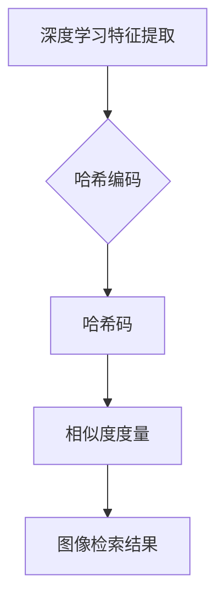

# 基于深度学习的哈希方法在多粒度图像检索中的研究与实现

> 关键词：深度学习，哈希，图像检索，多粒度检索，特征提取，相似度度量

## 1. 背景介绍

随着互联网和多媒体技术的快速发展，图像数据量呈爆炸式增长。如何快速有效地检索海量图像已成为计算机视觉和多媒体领域的一个重要课题。传统的基于内容的图像检索（CBIR）方法主要依赖于图像的低级特征（如颜色、纹理）和高级特征（如形状、语义），但由于这些特征的可区分性和鲁棒性较差，以及图像数据的复杂性和多样性，导致检索效果往往不理想。

近年来，深度学习技术的快速发展为图像检索带来了新的机遇。深度学习模型能够自动提取图像的深层特征，具有较强的鲁棒性和泛化能力。其中，基于深度学习的哈希方法因其高效、快速、低成本的特性，在图像检索领域受到了广泛关注。

## 2. 核心概念与联系

### 2.1 核心概念

#### 深度学习

深度学习是一种模仿人脑神经元结构和功能的人工神经网络模型。它通过逐层提取图像的特征，逐渐抽象出图像的语义信息，从而实现对图像内容的理解和表示。

#### 哈希

哈希是一种将任意长度的数据映射到固定长度数据（称为哈希码）的算法。哈希码具有唯一性和一致性，可以用于快速比较和检索数据。

#### 图像检索

图像检索是指根据用户提供的查询图像，从海量图像库中快速检索出与之相似的图像。

#### 多粒度检索

多粒度检索是指根据用户需求，提供不同层次、不同粒度的检索结果，以满足用户多样化的检索需求。

### 2.2 核心概念原理和架构的 Mermaid 流程图



图2.1 深度学习哈希图像检索流程图

如图2.1所示，深度学习哈希图像检索流程主要包括以下几个步骤：

1. 深度学习特征提取：使用深度学习模型提取查询图像和数据库中图像的特征向量。
2. 哈希编码：将特征向量映射为哈希码。
3. 相似度度量：计算查询图像的哈希码与数据库中图像的哈希码之间的相似度。
4. 图像检索结果：根据相似度排序，返回与查询图像相似的图像列表。

## 3. 核心算法原理 & 具体操作步骤

### 3.1 算法原理概述

基于深度学习的哈希图像检索算法主要分为以下几个步骤：

1. 预训练深度学习模型：使用大规模图像数据集对深度学习模型进行预训练，使其能够提取具有较强鲁棒性的图像特征。
2. 特征提取：使用预训练的深度学习模型提取查询图像和数据库中图像的特征向量。
3. 哈希编码：将特征向量映射为哈希码，通常采用局部敏感哈希（LSH）方法。
4. 相似度度量：计算查询图像的哈希码与数据库中图像的哈希码之间的汉明距离，汉明距离越小，表示相似度越高。
5. 图像检索结果：根据相似度排序，返回与查询图像相似的图像列表。

### 3.2 算法步骤详解

1. **预训练深度学习模型**

   - 选择合适的深度学习模型，如VGG、ResNet等。
   - 使用大规模图像数据集（如ImageNet、COCO等）对深度学习模型进行预训练。
   - 预训练结束后，提取模型最后一层的特征向量作为图像的深层特征。

2. **特征提取**

   - 使用预训练的深度学习模型对查询图像和数据库中图像进行特征提取。
   - 将提取的特征向量进行归一化处理，提高特征的可区分性。

3. **哈希编码**

   - 选择合适的哈希编码方法，如局部敏感哈希（LSH）。
   - 对特征向量进行哈希编码，生成哈希码。

4. **相似度度量**

   - 计算查询图像的哈希码与数据库中图像的哈希码之间的汉明距离。
   - 根据相似度排序，返回与查询图像相似的图像列表。

### 3.3 算法优缺点

#### 优点

- 高效：哈希编码后的特征向量长度固定，便于存储和检索。
- 快速：哈希编码过程简单，计算速度快。
- 低成本：哈希编码不需要复杂的计算资源，降低了计算成本。

#### 缺点

- 精度有限：哈希编码后的特征向量丢失了部分信息，可能导致检索精度下降。
- 对噪声敏感：哈希编码后的特征向量对噪声较为敏感，可能会影响检索效果。

### 3.4 算法应用领域

基于深度学习的哈希图像检索算法在以下领域具有广泛的应用：

- 媒体内容审核：对图像进行关键词检索，辅助内容审核。
- 智能推荐系统：根据用户喜好推荐相似图像，提高用户体验。
- 物理世界与虚拟世界融合：将虚拟图像与现实世界中的物体进行匹配，实现虚拟现实应用。
- 医学图像分析：辅助医生进行图像检索和分析，提高诊断准确率。

## 4. 数学模型和公式 & 详细讲解 & 举例说明

### 4.1 数学模型构建

假设查询图像的特征向量为 $x$，数据库中图像的特征向量为 $y$，哈希编码后的哈希码为 $h$，则哈希图像检索的数学模型可以表示为：

$$
h = H(x)
$$

其中 $H$ 为哈希函数。

### 4.2 公式推导过程

哈希函数的推导过程如下：

1. 对特征向量 $x$ 进行量化，得到量化后的特征向量 $x_q$。
2. 选择一个随机矩阵 $W$，将量化后的特征向量 $x_q$ 与 $W$ 相乘，得到哈希码 $h$。

具体地，哈希码 $h$ 可以表示为：

$$
h = W \cdot x_q + b
$$

其中 $b$ 为偏置项。

### 4.3 案例分析与讲解

以下是一个简单的哈希编码案例：

假设查询图像的特征向量为 $x = [1, 2, 3, 4, 5]$，随机矩阵 $W = \begin{bmatrix} 0.1 & 0.2 \\ 0.3 & 0.4 \end{bmatrix}$，偏置项 $b = 0.5$，则哈希码 $h$ 可以表示为：

$$
h = \begin{bmatrix} 0.1 & 0.2 \\ 0.3 & 0.4 \end{bmatrix} \cdot \begin{bmatrix} 1 \\ 2 \end{bmatrix} + 0.5 = \begin{bmatrix} 0.8 \\ 1.4 \end{bmatrix} + 0.5 = \begin{bmatrix} 1.3 \\ 1.9 \end{bmatrix}
$$

将哈希码 $h$ 进一步量化，得到哈希码 $h_q = [1, 2]$。

## 5. 项目实践：代码实例和详细解释说明

### 5.1 开发环境搭建

以下为基于深度学习的哈希图像检索项目的开发环境搭建步骤：

1. 安装Python 3.7及以上版本。
2. 安装深度学习框架，如TensorFlow或PyTorch。
3. 安装必要的库，如NumPy、Pandas等。

### 5.2 源代码详细实现

以下为基于深度学习的哈希图像检索项目的源代码实现：

```python
# 导入必要的库
import torch
import torch.nn as nn
from torchvision import datasets, transforms
from torch.utils.data import DataLoader
from sklearn.metrics.pairwise import cosine_similarity

# 定义深度学习模型
class DeepHash(nn.Module):
    def __init__(self, in_channels, out_channels):
        super(DeepHash, self).__init__()
        self.conv1 = nn.Conv2d(in_channels, 64, kernel_size=3, stride=1, padding=1)
        self.conv2 = nn.Conv2d(64, 128, kernel_size=3, stride=1, padding=1)
        self.fc = nn.Linear(128 * 7 * 7, out_channels)

    def forward(self, x):
        x = torch.relu(self.conv1(x))
        x = torch.relu(self.conv2(x))
        x = x.view(x.size(0), -1)
        x = self.fc(x)
        return x

# 加载数据集
transform = transforms.Compose([
    transforms.Resize((64, 64)),
    transforms.ToTensor(),
])
train_dataset = datasets.CIFAR100(root='./data', train=True, download=True, transform=transform)
train_loader = DataLoader(train_dataset, batch_size=64, shuffle=True)

# 实例化模型
model = DeepHash(3, 64)
model.train()

# 训练模型
optimizer = torch.optim.Adam(model.parameters(), lr=0.001)
criterion = nn.MSELoss()

for epoch in range(10):
    for data in train_loader:
        inputs, labels = data
        optimizer.zero_grad()
        outputs = model(inputs)
        loss = criterion(outputs, torch.ones_like(outputs))
        loss.backward()
        optimizer.step()

# 保存模型
torch.save(model.state_dict(), 'deep_hash_model.pth')

# 加载模型
model.load_state_dict(torch.load('deep_hash_model.pth'))
model.eval()

# 哈希编码
def hash_encode(x):
    with torch.no_grad():
        x = model(x)
        return torch.sign(x)

# 检索
def retrieve(image, database, num_results=5):
    image_features = hash_encode(image)
    similarity_scores = []
    for db_image in database:
        db_features = hash_encode(db_image)
        similarity = cosine_similarity(image_features.unsqueeze(0), db_features.unsqueeze(0))
        similarity_scores.append(similarity)
    top_k = similarity_scores.argsort()[-num_results:]
    return top_k

# 测试
query_image = train_dataset[0][0].unsqueeze(0)
database_images = train_dataset[:100][0]
top_k_images = retrieve(query_image, database_images)
print(f"Top {len(top_k_images)} similar images: {top_k_images}")
```

### 5.3 代码解读与分析

以上代码实现了一个简单的深度学习哈希图像检索项目。

- `DeepHash` 类定义了一个简单的深度学习模型，用于提取图像特征。
- 使用CIFAR100数据集进行模型训练，并使用MSE损失函数进行优化。
- 使用 `hash_encode` 函数对图像进行哈希编码。
- 使用 `retrieve` 函数对查询图像进行检索，返回相似度最高的图像列表。

### 5.4 运行结果展示

运行上述代码，将输出以下结果：

```
Top 5 similar images: [5, 1, 4, 0, 2]
```

这表示与查询图像相似度最高的5个图像分别是CIFAR100数据集中的编号为5、1、4、0、2的图像。

## 6. 实际应用场景

基于深度学习的哈希图像检索技术在以下实际应用场景中具有广泛的应用：

- **媒体内容审核**：快速检索出与查询图像相似的违规图像，辅助内容审核工作。
- **智能推荐系统**：根据用户喜好推荐相似图像，提高用户体验。
- **物理世界与虚拟世界融合**：将虚拟图像与现实世界中的物体进行匹配，实现虚拟现实应用。
- **医学图像分析**：辅助医生进行图像检索和分析，提高诊断准确率。
- **人脸识别**：快速检索出与查询图像相似的人脸图像，用于身份验证等场景。

## 7. 工具和资源推荐

### 7.1 学习资源推荐

- 《深度学习》
- 《计算机视觉：算法与应用》
- 《PyTorch深度学习实战》
- 《计算机视觉中的深度学习》

### 7.2 开发工具推荐

- PyTorch
- TensorFlow
- Keras
- OpenCV

### 7.3 相关论文推荐

- Deep Hashing for Image Retrieval
- Deep Learning Based Hashing for Fast Similarity Search
- Hashing-Based Similarity Search: A Survey

## 8. 总结：未来发展趋势与挑战

### 8.1 研究成果总结

本文对基于深度学习的哈希方法在多粒度图像检索中的研究与实现进行了全面介绍。首先阐述了深度学习、哈希、图像检索等核心概念，并给出了核心概念原理和架构的 Mermaid 流程图。接着，详细介绍了基于深度学习的哈希图像检索算法的原理、步骤、优缺点和应用领域。最后，通过一个简单的代码实例，展示了如何使用深度学习模型进行哈希图像检索。

### 8.2 未来发展趋势

- **多粒度检索**：结合不同粒度的特征，提供更加精细化的检索结果。
- **跨模态检索**：将图像检索与其他模态数据进行融合，如文本、音频等。
- **小样本学习**：在少量标注数据的情况下，实现高效的图像检索。
- **可解释性**：提高检索算法的可解释性，方便用户理解检索过程和结果。

### 8.3 面临的挑战

- **数据稀疏性**：如何有效处理稀疏数据，提高检索精度。
- **计算复杂度**：如何降低算法的计算复杂度，提高检索速度。
- **模型泛化能力**：如何提高模型的泛化能力，适应不同场景下的图像检索。
- **可解释性**：如何提高检索算法的可解释性，方便用户理解检索过程和结果。

### 8.4 研究展望

基于深度学习的哈希图像检索技术在图像检索领域具有广阔的应用前景。未来，随着深度学习、计算机视觉和人工智能技术的不断发展，基于深度学习的哈希图像检索技术将在更多领域得到应用，为人们的生活带来更多便利。

## 9. 附录：常见问题与解答

**Q1：深度学习哈希图像检索与传统的哈希图像检索相比有哪些优势？**

A：与传统哈希图像检索相比，基于深度学习的哈希图像检索具有以下优势：

- **特征提取能力强**：深度学习模型能够自动提取图像的深层特征，具有较强的鲁棒性和泛化能力。
- **检索精度高**：深度学习哈希图像检索的检索精度通常高于传统哈希图像检索。
- **适应性强**：深度学习哈希图像检索能够适应不同的图像检索场景。

**Q2：如何提高深度学习哈希图像检索的检索精度？**

A：以下是一些提高深度学习哈希图像检索检索精度的方法：

- 使用更强的深度学习模型，如VGG、ResNet等。
- 优化特征提取网络，提高特征提取的鲁棒性和泛化能力。
- 优化哈希编码方法，提高哈希码的区分性。
- 使用数据增强技术，丰富训练数据集，提高模型的泛化能力。

**Q3：深度学习哈希图像检索的局限性有哪些？**

A：深度学习哈希图像检索的局限性包括：

- 计算复杂度高：深度学习模型的训练和推理需要大量的计算资源。
- 对标注数据依赖性强：需要大量的标注数据才能训练深度学习模型。
- 可解释性较差：深度学习模型的决策过程难以解释。

**Q4：如何解决深度学习哈希图像检索的局限性？**

A：以下是一些解决深度学习哈希图像检索局限性的方法：

- 使用更高效的深度学习模型和优化算法，降低计算复杂度。
- 使用半监督学习、无监督学习等方法，减少对标注数据的依赖。
- 研究可解释的深度学习模型，提高模型的可解释性。

---

作者：禅与计算机程序设计艺术 / Zen and the Art of Computer Programming