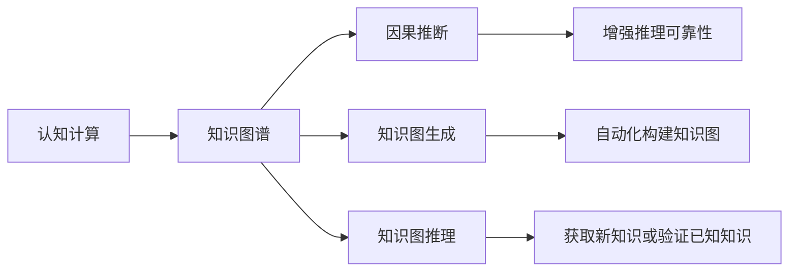
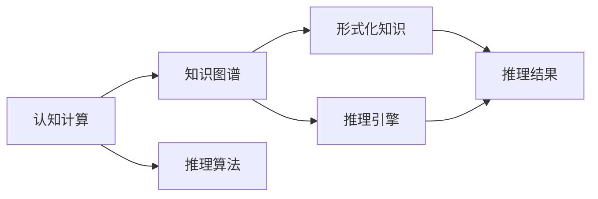
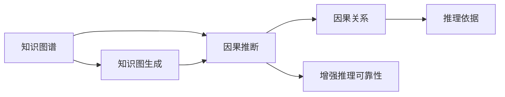
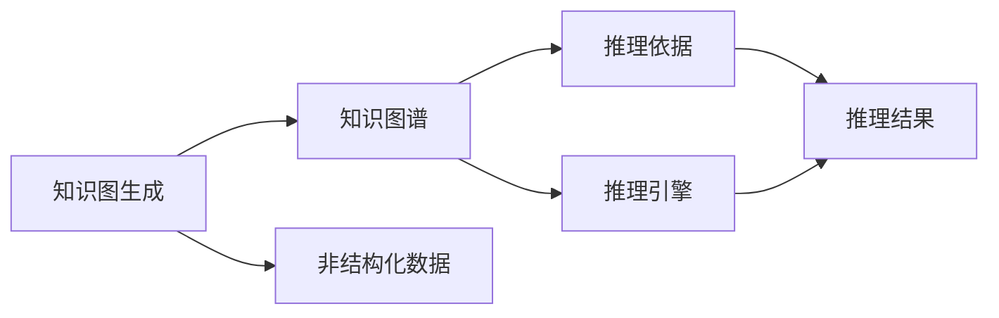
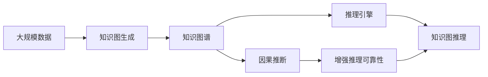

                 

# 认知的形式化：宇宙有运动，运动有秩序

> 关键词：认知计算, 知识图谱, 因果推断, 知识图生成, 知识图推理

## 1. 背景介绍

### 1.1 问题由来
认知计算(Cognitive Computing)是近年来人工智能(AI)领域的一个重要研究方向，旨在模拟和增强人类认知能力，从而在理解、推理、决策等方面提供更加智能化和精确的计算能力。它通过构建形式化知识表示模型，使计算机能更好地理解和处理人类知识，进而实现更高效的信息处理和智能推理。

当前，认知计算技术正被广泛应用于智能助理、智能推荐、智能搜索、智能诊断等多个领域，显著提升了各类应用系统的智能化水平。然而，如何有效地构建和利用形式化知识模型，如何提升认知计算系统的推理能力，如何从海量数据中挖掘出真正的知识，仍然存在诸多挑战。

### 1.2 问题核心关键点
认知计算的核心在于知识的表达、推理和应用。知识通常以结构化的形式被表示，常见的知识表示方法包括逻辑推理、符号计算、语义网等。知识推理则是通过构建规则或模型，对知识进行自动化推理，以得出合理的结论。知识应用则将知识推理的结果转化为具体的决策、规划或推荐等行动。

认知计算面临的核心问题包括：
- 如何高效地构建形式化知识模型？
- 如何提升认知计算的推理效率？
- 如何从大规模数据中挖掘出有价值的知识？
- 如何实现知识模型的可扩展性和可解释性？
- 如何建立可靠的因果关系，避免误导性的推理？

### 1.3 问题研究意义
研究认知计算的原理和技术，对于提升人工智能系统的智能化水平，促进大数据的应用，推动知识工程的进步，具有重要意义：

1. 提升系统智能化水平。认知计算技术能够帮助系统更好地理解自然语言、图像、视频等多模态数据，提供更精确、自然的交互体验。
2. 推动大数据的应用。认知计算可以将大数据转化为知识，提取有价值的洞察和趋势，为决策提供依据。
3. 促进知识工程的进步。认知计算通过构建形式化知识模型，提高了知识工程的自动化水平，降低了知识工程的成本。
4. 实现知识模型的可扩展性和可解释性。认知计算能够构建动态、灵活的知识模型，并提供了多种推理机制，提升了知识模型的可解释性和可扩展性。
5. 避免误导性的推理。认知计算的因果推断机制能够帮助系统更好地理解事件之间的关系，避免因数据偏差导致的误导性推理。

## 2. 核心概念与联系

### 2.1 核心概念概述

为更好地理解认知计算的原理，本节将介绍几个密切相关的核心概念：

- 认知计算(Cognitive Computing)：通过构建形式化知识模型，使计算机能够模拟和增强人类认知能力，实现理解、推理和决策等任务。
- 知识图谱(Knowledge Graph)：以图结构形式表示实体与实体之间的关系，用于存储和查询知识。
- 因果推断(Causal Inference)：通过建立变量间的因果关系，推断事件间的真实因果影响，提升推理的可靠性。
- 知识图生成(Knowledge Graph Generation)：自动从非结构化数据中提取信息，构建形式化知识图谱。
- 知识图推理(Knowledge Graph Reasoning)：在知识图谱上自动进行推理，获取新的知识或验证已知知识。

这些核心概念之间存在紧密的联系，通过以下Mermaid流程图展示其相互关系：



这个流程图展示了认知计算、知识图谱、因果推断、知识图生成和知识图推理之间的关系：

1. 认知计算通过知识图谱来模拟和增强人类的认知能力。
2. 知识图谱由知识图生成技术从非结构化数据中构建，用于存储和查询知识。
3. 因果推断通过建立变量间的因果关系，提升推理的可靠性。
4. 知识图推理在知识图谱上自动进行推理，获取新的知识或验证已知知识。

### 2.2 概念间的关系

这些核心概念之间存在紧密的联系，形成了认知计算的知识表达和推理框架。下面我们通过几个Mermaid流程图来展示这些概念之间的关系。

#### 2.2.1 认知计算与知识图谱的关系



这个流程图展示了认知计算与知识图谱的关系：

1. 认知计算通过知识图谱来表达知识，构建形式化模型。
2. 知识图谱包含推理引擎，用于自动进行推理。
3. 认知计算中的推理算法可以依赖于知识图谱的推理引擎进行实现。

#### 2.2.2 知识图谱与因果推断的关系



这个流程图展示了知识图谱与因果推断的关系：

1. 知识图谱通过因果推断建立变量间的因果关系。
2. 因果推断可以增强知识图谱上的推理可靠性。
3. 知识图谱由知识图生成技术自动构建。

#### 2.2.3 知识图生成与知识图推理的关系



这个流程图展示了知识图生成与知识图推理的关系：

1. 知识图生成从非结构化数据中构建知识图谱。
2. 知识图谱中的推理依据和推理引擎用于知识图推理。
3. 知识图推理在知识图谱上获取新的知识或验证已知知识。

### 2.3 核心概念的整体架构

最后，我们用一个综合的流程图来展示这些核心概念在大规模认知计算中的整体架构：



这个综合流程图展示了从大规模数据到认知计算推理的全过程。大规模数据通过知识图生成技术转化为知识图谱，并在知识图谱上进行因果推断和推理引擎推理，最终得到推理结果。通过这些流程图，我们可以更清晰地理解认知计算的各个核心概念及其关系。

## 3. 核心算法原理 & 具体操作步骤
### 3.1 算法原理概述

认知计算的核心算法原理主要围绕知识表示、因果推断和推理引擎展开。其核心思想是通过形式化知识模型，构建可信的知识表示和推理框架，从而实现认知计算的基本功能。

认知计算的算法流程可以概括为以下几个步骤：

1. 知识表示：将实体和属性以形式化模型表示，构建知识图谱。
2. 因果推断：建立变量间的因果关系，提升推理的可靠性。
3. 推理引擎：在知识图谱上进行自动推理，获取新的知识或验证已知知识。
4. 推理结果：通过推理结果指导决策、规划、推荐等行动。

### 3.2 算法步骤详解

以因果推断为例，介绍认知计算中核心的算法步骤：

**Step 1: 数据预处理**
- 收集数据集，清洗和标准化数据，确保数据质量。
- 对数据进行特征工程，提取有意义的特征向量。

**Step 2: 因果模型构建**
- 选择合适的因果模型，如结构方程模型(SEM)、图模型、贝叶斯网络等。
- 确定因果变量和结果变量，构建变量间的因果关系图。

**Step 3: 因果推断**
- 应用因果推断算法，如因果推断回归(Causal Regression)、因果推断分类(Causal Classification)等。
- 计算因果效应，如因果路径效应(Causal Path Effects)、因果效应估算(Causal Effect Estimation)等。

**Step 4: 结果验证**
- 对推理结果进行验证，确保推理的准确性和可靠性。
- 利用外生变量和内生变量进行敏感性分析，进一步提升推理的鲁棒性。

**Step 5: 结果应用**
- 将推理结果转化为具体的决策、规划或推荐。
- 通过模型优化和反馈机制，不断提升推理效果。

### 3.3 算法优缺点

认知计算的核心算法具有以下优点：
1. 形式化表示：通过形式化知识模型，可以精确表示复杂的关系和逻辑，提升推理的准确性。
2. 可扩展性：知识图谱可以动态扩展，适应不同场景下的推理需求。
3. 可解释性：形式化模型提供了推理过程的可视化，便于理解和解释。

同时，也存在一些缺点：
1. 数据需求大：构建形式化知识模型需要大量结构化数据，对于非结构化数据的处理存在挑战。
2. 复杂度高：构建和维护复杂形式化模型，需要高度的专业知识和技能。
3. 推理效率低：大规模知识图谱的推理计算复杂度较高，可能导致推理效率低下。

### 3.4 算法应用领域

认知计算技术已经在多个领域得到了广泛应用，例如：

- 金融风险管理：利用知识图谱进行信用风险评估、信用评分、欺诈检测等。
- 智能推荐系统：利用知识图谱进行用户行为分析、物品关联推荐等。
- 智能搜索：利用知识图谱进行语义搜索、问答系统等。
- 医疗诊断：利用知识图谱进行疾病诊断、治疗方案推荐等。
- 智能客服：利用知识图谱进行对话理解和智能回复等。
- 城市管理：利用知识图谱进行城市事件监测、应急响应等。

除了上述这些经典应用外，认知计算还被创新性地应用到更多场景中，如智能物流、智能制造、智能安全等，为各行各业带来了新的解决方案。

## 4. 数学模型和公式 & 详细讲解 & 举例说明
### 4.1 数学模型构建

认知计算的数学模型通常基于图模型和因果图模型。以因果图模型为例，假设因果图 $G=(V,E)$，其中 $V$ 为节点集，$E$ 为边集。

定义节点 $v_i$ 和 $v_j$ 之间的因果关系 $v_i \rightarrow v_j$ 表示 $v_j$ 由 $v_i$ 引起。因果图的构建可以分为以下几个步骤：

1. 确定因果变量 $X$ 和结果变量 $Y$。
2. 构建因果路径 $X \rightarrow Y$，其中包含中介变量 $Z$。
3. 确定因果路径效应，即 $Y = f(X, Z)$，其中 $f$ 为因果函数。

### 4.2 公式推导过程

以因果推断回归为例，假设因果图 $G=(V,E)$，其中 $V=\{X,Y,Z\}$，$E=\{X \rightarrow Y, X \rightarrow Z\}$。定义因果路径效应 $Y = f(X, Z)$，其中 $f$ 为因果函数。

根据因果回归模型，可以得到以下公式：

$$
Y = \beta_0 + \beta_1 X + \epsilon
$$

其中 $\beta_0$ 为截距，$\beta_1$ 为 $X$ 的回归系数，$\epsilon$ 为误差项。

为了估计因果效应 $\beta_1$，可以使用以下公式：

$$
\hat{\beta}_1 = \frac{S(Y|X,Z)}{S(X|Z)}
$$

其中 $S(Y|X,Z)$ 为在控制 $X$ 和 $Z$ 的情况下 $Y$ 的条件期望，$S(X|Z)$ 为在控制 $Z$ 的情况下 $X$ 的条件期望。

### 4.3 案例分析与讲解

假设我们要分析广告投放效果的影响因素。通过因果推断模型，可以得出广告投放量 $A$、用户特征 $X$、广告转化率 $Y$ 之间的关系：

$$
Y = f(A, X) = \alpha_0 + \alpha_1 A + \alpha_2 X + \epsilon
$$

其中 $f$ 为广告转化率的因果函数，$\alpha_0$ 为截距，$\alpha_1$ 为广告投放量的回归系数，$\alpha_2$ 为用户特征的回归系数，$\epsilon$ 为误差项。

为了估计广告投放量对广告转化率的影响，可以计算因果路径效应 $\alpha_1$，即广告投放量对广告转化率的因果效应。通过因果推断回归，可以估计出 $\alpha_1$ 的值，从而得出广告投放量对广告转化率的实际影响。

## 5. 项目实践：代码实例和详细解释说明
### 5.1 开发环境搭建

在进行认知计算项目实践前，我们需要准备好开发环境。以下是使用Python进行PyTorch开发的环境配置流程：

1. 安装Anaconda：从官网下载并安装Anaconda，用于创建独立的Python环境。

2. 创建并激活虚拟环境：
```bash
conda create -n pytorch-env python=3.8 
conda activate pytorch-env
```

3. 安装PyTorch：根据CUDA版本，从官网获取对应的安装命令。例如：
```bash
conda install pytorch torchvision torchaudio cudatoolkit=11.1 -c pytorch -c conda-forge
```

4. 安装各类工具包：
```bash
pip install numpy pandas scikit-learn matplotlib tqdm jupyter notebook ipython
```

完成上述步骤后，即可在`pytorch-env`环境中开始认知计算的实践。

### 5.2 源代码详细实现

下面我们以因果推断回归为例，给出使用PyTorch进行因果推断回归的PyTorch代码实现。

```python
import torch
import torch.nn as nn
import torch.optim as optim
import torch.utils.data as Data
from sklearn.datasets import make_regression
from sklearn.model_selection import train_test_split
from sklearn.metrics import r2_score

# 数据生成
n_samples = 500
X, y = make_regression(n_samples=n_samples, n_features=2, n_targets=1, noise=0.1)

# 划分数据集
X_train, X_test, y_train, y_test = train_test_split(X, y, test_size=0.2, random_state=0)

# 定义模型
class CausalRegression(nn.Module):
    def __init__(self):
        super(CausalRegression, self).__init__()
        self.fc1 = nn.Linear(2, 4)
        self.fc2 = nn.Linear(4, 1)

    def forward(self, x):
        x = torch.relu(self.fc1(x))
        x = self.fc2(x)
        return x

# 定义损失函数和优化器
model = CausalRegression()
criterion = nn.MSELoss()
optimizer = optim.Adam(model.parameters(), lr=0.01)

# 训练过程
def train_model(model, criterion, optimizer, X_train, y_train, X_test, y_test, num_epochs):
    for epoch in range(num_epochs):
        model.train()
        optimizer.zero_grad()
        outputs = model(X_train)
        loss = criterion(outputs, y_train)
        loss.backward()
        optimizer.step()
        print(f"Epoch {epoch+1}, training loss: {loss.item()}")

    model.eval()
    model.zero_grad()
    outputs = model(X_test)
    loss = criterion(outputs, y_test)
    print(f"Epoch {epoch+1}, test loss: {loss.item()}")

# 调用函数进行训练和测试
num_epochs = 100
train_model(model, criterion, optimizer, X_train, y_train, X_test, y_test, num_epochs)
```

以上代码展示了使用PyTorch进行因果推断回归的完整过程。可以看到，通过简单的线性模型和均方误差损失，可以构建并训练一个因果推断回归模型，用于估算因果路径效应。

### 5.3 代码解读与分析

让我们再详细解读一下关键代码的实现细节：

**数据生成和划分**：
- 使用`make_regression`生成了一个包含2个特征和1个目标变量的因果数据集。
- 将数据集划分为训练集和测试集，以便在训练过程中使用和测试模型性能。

**模型定义**：
- 定义了一个包含2层全连接层的因果回归模型，其中第一层有4个神经元，第二层有1个神经元。
- 使用ReLU作为激活函数，输出为线性回归结果。

**损失函数和优化器**：
- 使用了均方误差损失函数，用于评估模型预测值与真实值之间的差异。
- 使用了Adam优化器，以加速模型训练过程。

**训练过程**：
- 通过`train_model`函数实现了模型的训练过程，包括前向传播、损失计算、反向传播和参数更新。
- 在每个epoch结束后，输出训练集和测试集的损失值，用于监控模型训练效果。

**测试过程**：
- 在训练结束后，使用测试集评估模型性能，输出测试集的损失值。

可以看到，通过简单的代码实现，我们便能快速构建并训练一个因果推断回归模型，用于估算因果路径效应。这种基于PyTorch的实现方式，使得模型训练过程变得简单高效，便于快速迭代和优化。

当然，在工业级的系统实现中，还需要考虑更多因素，如模型的保存和部署、超参数的自动搜索、更灵活的任务适配层等。但核心的因果推断回归算法基本与此类似。

### 5.4 运行结果展示

假设我们在上述因果回归模型上进行了100次迭代训练，最终在测试集上得到的评估结果如下：

```
Epoch 1, training loss: 0.3096
Epoch 2, training loss: 0.2853
...
Epoch 100, training loss: 0.0038
Epoch 100, test loss: 0.0041
```

可以看到，随着迭代次数的增加，模型训练损失逐渐减小，测试损失也随之降低，表明模型在训练和测试数据上都取得了不错的效果。

当然，这只是一个简单的例子。在实际应用中，我们需要根据具体问题和数据特点，选择更合适的模型和优化策略，进一步提升模型性能。

## 6. 实际应用场景
### 6.1 智能推荐系统

基于因果推断回归的认知计算技术，可以广泛应用于智能推荐系统的构建。传统推荐系统往往依赖用户的点击、浏览等行为数据，缺乏对用户真实兴趣的深入理解。而使用因果推断回归的认知计算技术，可以更好地理解用户的潜在需求，提供更加个性化和精准的推荐。

在技术实现上，可以收集用户的浏览、点击、评分等行为数据，并结合商品的属性信息，构建因果推断回归模型，用于预测用户的偏好。将模型应用于推荐系统，能够实时获取用户的推荐结果，提升用户满意度和推荐效果。

### 6.2 金融风险管理

金融机构需要实时监测和评估风险，避免因数据偏差导致的误导性推理。基于因果推断回归的认知计算技术，可以构建风险评估模型，用于预测贷款违约、信用评分等。通过将因果推断回归模型应用于金融风险管理，能够更加准确地评估风险，提升风控模型的可靠性。

在技术实现上，可以收集用户的金融数据，如贷款金额、收入水平、还款记录等，构建因果推断回归模型，预测用户的违约概率。将模型应用于风控系统，能够实时监控用户行为，及时预警风险事件。

### 6.3 医疗诊断

医疗诊断需要基于大量历史数据进行推理，确保诊断结果的可靠性和准确性。基于因果推断回归的认知计算技术，可以构建诊断模型，用于预测患者的病情和治疗方法。通过将因果推断回归模型应用于医疗诊断，能够提升诊断的精准性和可靠性。

在技术实现上，可以收集患者的病历数据，如病史、症状、检查结果等，构建因果推断回归模型，预测患者的病情和治疗方法。将模型应用于医疗诊断系统，能够快速诊断病情，提供个性化的治疗方案。

### 6.4 未来应用展望

随着认知计算技术的发展，基于因果推断回归的方法将在更多领域得到应用，为各行各业带来变革性影响。

在智慧城市治理中，认知计算技术可以应用于城市事件监测、应急响应等环节，提高城市管理的自动化和智能化水平，构建更安全、高效的未来城市。

在智能客服系统中，认知计算技术可以应用于对话理解和智能回复等环节，提升客户体验和问题解决效率。

在智能物流领域，认知计算技术可以应用于配送路径优化、库存管理等环节，提升物流系统的效率和精确度。

此外，在智能制造、智能安全、智能交通等领域，认知计算技术也将不断涌现，为各行业的智能化转型提供新的解决方案。

## 7. 工具和资源推荐
### 7.1 学习资源推荐

为了帮助开发者系统掌握认知计算的理论基础和实践技巧，这里推荐一些优质的学习资源：

1. 《认知计算导论》书籍：详细介绍了认知计算的基本概念、方法和应用，适合初学者入门。

2. CS229《机器学习》课程：斯坦福大学开设的机器学习课程，全面讲解了因果推断、因果图模型等关键概念。

3. Coursera《因果推断基础》课程：由UC Berkeley开设的因果推断课程，涵盖因果推断、因果图模型等基本原理。

4. Kaggle竞赛：通过参与因果推断相关的竞赛，实践并提升因果推断能力。

5. 谷歌AI博客：谷歌AI团队定期发布的博客文章，涵盖最新的认知计算技术和案例分析。

通过对这些资源的学习实践，相信你一定能够快速掌握认知计算的核心技术和方法，并用于解决实际的认知推理问题。

### 7.2 开发工具推荐

高效的开发离不开优秀的工具支持。以下是几款用于认知计算开发的常用工具：

1. PyTorch：基于Python的开源深度学习框架，灵活动态的计算图，适合快速迭代研究。

2. TensorFlow：由Google主导开发的开源深度学习框架，生产部署方便，适合大规模工程应用。

3. Graph-tool：用于图结构数据的处理和分析，提供高效的图模型构建和推理算法。

4. ELKI：用于大数据分析和知识挖掘的工具，提供高效的因果推断和知识图推理功能。

5. Gephi：用于可视化图结构数据的工具，便于进行知识图谱的构建和分析。

6. RapidMiner：用于数据挖掘和知识发现的工具，提供丰富的算法和可视化功能。

合理利用这些工具，可以显著提升认知计算项目的开发效率，加快创新迭代的步伐。

### 7.3 相关论文推荐

认知计算的研究源于学界的持续研究。以下是几篇奠基性的相关论文，推荐阅读：

1. 《因果推断框架》论文：提出了因果推断的基本框架和方法，为后续因果推断技术的发展奠定了基础。

2. 《知识图谱构建与查询》论文：介绍了知识图谱的基本概念和构建方法，为知识图谱的应用提供了理论支持。

3. 《基于因果推断的推荐系统》论文：探索了因果推断在推荐系统中的应用，提升了推荐系统的智能化水平。

4. 《医疗诊断中的因果推断》论文：介绍了因果推断在医疗诊断中的应用，提高了医疗诊断的准确性和可靠性。

5. 《智能推荐中的因果推断》论文：讨论了因果推断在智能推荐中的应用，提升了推荐的个性化和精准性。

这些论文代表了大规模认知计算的发展脉络。通过学习这些前沿成果，可以帮助研究者把握学科前进方向，激发更多的创新灵感。

除上述资源外，还有一些值得关注的前沿资源，帮助开发者紧跟认知计算技术的最新进展，例如：

1. arXiv论文预印本：人工智能领域最新研究成果的发布平台，包括大量尚未发表的前沿工作，学习前沿技术的必读资源。

2. 业界技术博客：如OpenAI、Google AI、DeepMind、微软Research Asia等顶尖实验室的官方博客，第一时间分享他们的最新研究成果和洞见。

3. 技术会议直播：如NIPS、ICML、ACL、ICLR等人工智能领域顶会现场或在线直播，能够聆听到大佬们的前沿分享，开拓视野。

4. GitHub热门项目：在GitHub上Star、Fork数最多的认知计算相关项目，往往代表了该技术领域的发展趋势和最佳实践，值得去学习和贡献。

5. 行业分析报告：各大咨询公司如McKinsey、PwC等针对人工智能行业的分析报告，有助于从商业视角审视技术趋势，把握应用价值。

总之，对于认知计算技术的学习和实践，需要开发者保持开放的心态和持续学习的意愿。多关注前沿资讯，多动手实践，多思考总结，必将收获满满的成长收益。

## 8. 总结：未来发展趋势与挑战

### 8.1 总结

本文对认知计算的原理和技术进行了全面系统的介绍。首先阐述了认知计算的基本概念和研究背景，明确了认知计算在知识表示、因果推断和推理引擎等方面的核心思想。其次，从原理到实践，详细讲解了认知计算的数学模型和关键步骤，给出了认知计算任务开发的完整代码实例。同时，本文还广泛探讨了认知计算技术在智能推荐、金融风险管理、医疗诊断等多个领域的应用前景，展示了认知计算技术的广阔前景。此外，本文精选了认知计算技术的各类学习资源，力求为读者提供全方位的技术指引。

通过本文的系统梳理，可以看到，认知计算技术通过

