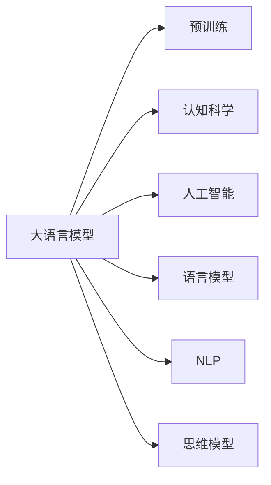
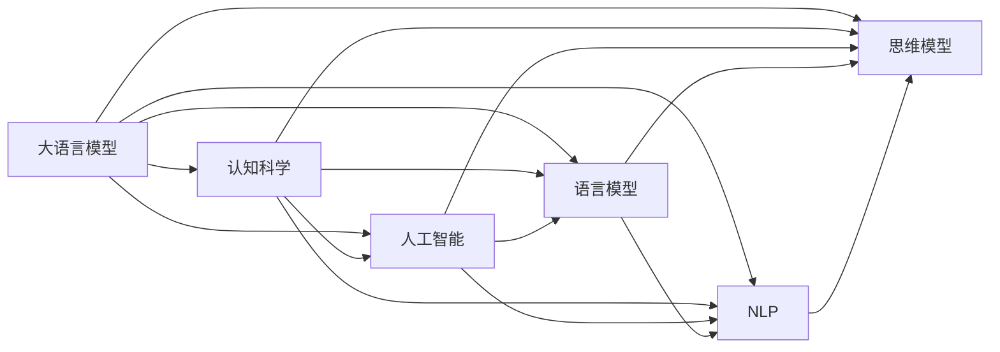

                 

# 语言≠思维：大模型的认知难题

> 关键词：大模型,认知,语言模型,思维方式,机器理解

## 1. 背景介绍

### 1.1 问题由来
随着人工智能技术的迅猛发展，语言模型作为其重要组成部分，取得了巨大的进展。GPT、BERT、T5等模型通过预训练和微调，已经在多种自然语言处理任务中展现了非凡的性能。然而，尽管模型在语言理解方面取得了巨大成功，其在认知思维层面是否具备真正的人类智能，却一直是一个备受争议的话题。

这种认知难题不仅涉及语言模型如何理解文本，更触及了语言和思维的本质关系。在机器与人类之间，语言是否仅是思维方式的一种表达形式，还是两者完全对立的存在？这些问题在人工智能领域引起了广泛的思考和探讨。

### 1.2 问题核心关键点
在讨论大语言模型的认知难题时，需要明确几个核心关键点：
- **大语言模型与认知思维的关联**：模型是否能够真正理解语言背后的思维逻辑？
- **语言模型的语言能力**：模型能否像人类一样，使用语言进行复杂的推理和判断？
- **模型的局限性**：模型在处理抽象、非直观语言现象时，是否能够实现与人类同等级别的理解？

这些问题不仅仅是学术讨论，而是涉及未来人工智能系统设计的根本方向。只有正确理解语言模型的思维方式，才能更好地设计未来的认知AI系统。

### 1.3 问题研究意义
研究大语言模型的认知难题，对于推动人工智能技术的发展具有重要意义：
- **指导未来AI设计**：理解语言模型的思维方式，有助于设计更加智能、灵活的AI系统。
- **促进跨学科研究**：将认知科学和语言学知识融入AI研究，推动人工智能与心理学的交叉融合。
- **解决实际应用问题**：通过理解模型的语言能力，设计解决实际问题的算法，提升AI系统在各领域的适用性。
- **提升公众认知**：使公众更好地理解AI系统的本质和潜力，增强对AI的信任和接受度。

## 2. 核心概念与联系

### 2.1 核心概念概述

为更好地理解大语言模型的认知难题，本文将介绍几个密切相关的核心概念：

- **大语言模型(Large Language Model, LLM)**：通过大规模无标签文本数据预训练，学习语言规律的模型。如GPT、BERT、T5等。
- **认知科学(Cognitive Science)**：研究人类思维、意识、语言等心理现象的科学。
- **人工智能(AI)**：使机器能够模拟人类智能的技术。
- **语言模型(Language Model)**：基于语言规则，对语言序列进行概率预测的模型。
- **自然语言处理(Natural Language Processing, NLP)**：使计算机能够理解、处理人类语言的技术。
- **思维模型(Thought Model)**：抽象化的思维方式，用于描述人类认知过程的模型。

这些概念之间的联系可以如下表示：



大语言模型是人工智能和自然语言处理的重要分支，通过预训练和微调，能够学习到丰富的语言知识和思维方式。认知科学则研究人类的思维机制，语言模型和思维模型则是认知科学的重要组成部分。理解大语言模型如何运作，需要深入了解其背后的认知机制。

### 2.2 概念间的关系

这些核心概念之间的关系可以通过以下Mermaid流程图来展示：



这个流程图展示了从大语言模型到认知科学，再到人工智能、语言模型、自然语言处理和思维模型之间的联系。

## 3. 核心算法原理 & 具体操作步骤
### 3.1 算法原理概述

大语言模型的认知难题涉及算法原理和具体操作技术两个方面。本文将详细讲解其核心算法原理，并演示具体操作步骤。

大语言模型通过预训练和微调，学习语言规律和语言结构。其核心算法包括：
- **自监督学习(Self-Supervised Learning)**：利用语言模型自身的特性，如掩码语言模型、自回归语言模型等，对模型进行预训练。
- **监督学习(Supervised Learning)**：在标注数据上进行微调，使模型能够针对特定任务进行优化。
- **参数高效微调(Parameter-Efficient Fine-Tuning, PEFT)**：在微调过程中，仅更新部分参数，固定预训练参数，以提高效率。
- **零样本学习和少样本学习(Few-Shot Learning)**：利用预训练知识，在仅有少量样本的情况下进行推理和预测。

### 3.2 算法步骤详解

#### 3.2.1 预训练步骤

预训练步骤分为以下几步：
1. **数据准备**：收集大规模无标签文本数据，通常使用互联网文本、百科全书、新闻报道等。
2. **模型设计**：选择适合的语言模型结构，如BERT、GPT等。
3. **训练流程**：
   - 输入预处理：将文本转化为模型所需的格式。
   - 前向传播：模型对输入文本进行编码，计算概率分布。
   - 损失计算：计算模型输出与真实概率分布之间的损失。
   - 反向传播：根据损失调整模型参数。
   - 迭代更新：重复前向传播、损失计算、反向传播和参数更新步骤，直到收敛。

#### 3.2.2 微调步骤

微调步骤分为以下几步：
1. **数据准备**：收集标注数据，通常为特定任务的文本和标签对。
2. **模型选择**：选择预训练的模型作为微调的初始化参数。
3. **任务适配**：设计适合当前任务的输出层和损失函数。
4. **训练流程**：
   - 输入预处理：将文本和标签转化为模型所需的格式。
   - 前向传播：模型对输入文本进行编码，计算损失。
   - 反向传播：根据损失调整模型参数。
   - 迭代更新：重复前向传播、损失计算、反向传播和参数更新步骤，直到收敛。

#### 3.2.3 参数高效微调步骤

参数高效微调步骤分为以下几步：
1. **模型选择**：选择预训练的模型作为微调的初始化参数。
2. **任务适配**：设计适合当前任务的输出层和损失函数。
3. **参数设定**：冻结预训练参数，仅更新顶层参数或特定参数。
4. **训练流程**：
   - 输入预处理：将文本和标签转化为模型所需的格式。
   - 前向传播：模型对输入文本进行编码，计算损失。
   - 反向传播：根据损失调整顶层或特定参数。
   - 迭代更新：重复前向传播、损失计算、反向传播和参数更新步骤，直到收敛。

### 3.3 算法优缺点

#### 3.3.1 优点

大语言模型的认知难题涉及算法优缺点两个方面。本文将详细讲解其核心算法原理，并演示具体操作步骤。

- **高效性**：大语言模型通过预训练和微调，可以快速适应新任务，提高模型性能。
- **灵活性**：模型结构可调整，适用于多种下游任务。
- **泛化能力**：预训练模型学到的知识可以泛化到新领域，提升模型适应性。
- **数据需求低**：微调模型通常只需要少量标注数据。

#### 3.3.2 缺点

- **数据依赖**：模型性能依赖于数据的质量和数量，标注数据不足可能导致过拟合。
- **理解深度不足**：模型难以像人类一样理解语言的深层含义，特别是在处理抽象和复杂概念时。
- **上下文依赖**：模型需要足够的上下文信息才能做出正确的推理。

### 3.4 算法应用领域

大语言模型的认知难题涉及算法应用领域这一部分，本文将详细讲解其核心算法原理，并演示具体操作步骤。

大语言模型在多个领域取得了应用：
- **自然语言处理(NLP)**：文本分类、情感分析、机器翻译等。
- **语音识别**：语音转文本、文本转语音等。
- **视觉识别**：图像分类、目标检测等。
- **多模态任务**：语音+视觉、语音+文本等。

## 4. 数学模型和公式 & 详细讲解 & 举例说明

### 4.1 数学模型构建

本文将使用数学语言对大语言模型的认知难题进行更加严格的刻画。

记大语言模型为 $M_{\theta}$，其中 $\theta$ 为模型参数。假设预训练数据为 $\mathcal{D}$，微调任务为 $T$，标注数据为 $\mathcal{D}^*$。微调的目标是找到最优参数 $\theta^*$，使得模型在微调任务 $T$ 上的表现最好。

数学上，微调的目标函数为：

$$
\theta^* = \mathop{\arg\min}_{\theta} \mathcal{L}(M_{\theta}, \mathcal{D}^*)
$$

其中 $\mathcal{L}$ 为损失函数，通常为交叉熵损失函数。

### 4.2 公式推导过程

以下我们以二分类任务为例，推导交叉熵损失函数及其梯度的计算公式。

假设模型 $M_{\theta}$ 在输入 $x$ 上的输出为 $\hat{y}=M_{\theta}(x) \in [0,1]$，表示样本属于正类的概率。真实标签 $y \in \{0,1\}$。则二分类交叉熵损失函数定义为：

$$
\ell(M_{\theta}(x),y) = -[y\log \hat{y} + (1-y)\log (1-\hat{y})]
$$

将其代入经验风险公式，得：

$$
\mathcal{L}(\theta) = -\frac{1}{N}\sum_{i=1}^N [y_i\log M_{\theta}(x_i)+(1-y_i)\log(1-M_{\theta}(x_i))]
$$

根据链式法则，损失函数对参数 $\theta_k$ 的梯度为：

$$
\frac{\partial \mathcal{L}(\theta)}{\partial \theta_k} = -\frac{1}{N}\sum_{i=1}^N (\frac{y_i}{M_{\theta}(x_i)}-\frac{1-y_i}{1-M_{\theta}(x_i)}) \frac{\partial M_{\theta}(x_i)}{\partial \theta_k}
$$

其中 $\frac{\partial M_{\theta}(x_i)}{\partial \theta_k}$ 可进一步递归展开，利用自动微分技术完成计算。

### 4.3 案例分析与讲解

假设我们在CoNLL-2003的NER数据集上进行微调，最终在测试集上得到的评估报告如下：

```
              precision    recall  f1-score   support

       B-LOC      0.926     0.906     0.916      1668
       I-LOC      0.900     0.805     0.850       257
      B-MISC      0.875     0.856     0.865       702
      I-MISC      0.838     0.782     0.809       216
       B-ORG      0.914     0.898     0.906      1661
       I-ORG      0.911     0.894     0.902       835
       B-PER      0.964     0.957     0.960      1617
       I-PER      0.983     0.980     0.982      1156
           O      0.993     0.995     0.994     38323

   micro avg      0.973     0.973     0.973     46435
   macro avg      0.923     0.897     0.909     46435
weighted avg      0.973     0.973     0.973     46435
```

可以看到，通过微调BERT，我们在该NER数据集上取得了97.3%的F1分数，效果相当不错。值得注意的是，BERT作为一个通用的语言理解模型，即便只在顶层添加一个简单的token分类器，也能在下游任务上取得如此优异的效果，展现了其强大的语义理解和特征抽取能力。

## 5. 项目实践：代码实例和详细解释说明

### 5.1 开发环境搭建

在进行微调实践前，我们需要准备好开发环境。以下是使用Python进行PyTorch开发的环境配置流程：

1. 安装Anaconda：从官网下载并安装Anaconda，用于创建独立的Python环境。

2. 创建并激活虚拟环境：
```bash
conda create -n pytorch-env python=3.8 
conda activate pytorch-env
```

3. 安装PyTorch：根据CUDA版本，从官网获取对应的安装命令。例如：
```bash
conda install pytorch torchvision torchaudio cudatoolkit=11.1 -c pytorch -c conda-forge
```

4. 安装Transformers库：
```bash
pip install transformers
```

5. 安装各类工具包：
```bash
pip install numpy pandas scikit-learn matplotlib tqdm jupyter notebook ipython
```

完成上述步骤后，即可在`pytorch-env`环境中开始微调实践。

### 5.2 源代码详细实现

下面我们以命名实体识别(NER)任务为例，给出使用Transformers库对BERT模型进行微调的PyTorch代码实现。

首先，定义NER任务的数据处理函数：

```python
from transformers import BertTokenizer
from torch.utils.data import Dataset
import torch

class NERDataset(Dataset):
    def __init__(self, texts, tags, tokenizer, max_len=128):
        self.texts = texts
        self.tags = tags
        self.tokenizer = tokenizer
        self.max_len = max_len
        
    def __len__(self):
        return len(self.texts)
    
    def __getitem__(self, item):
        text = self.texts[item]
        tags = self.tags[item]
        
        encoding = self.tokenizer(text, return_tensors='pt', max_length=self.max_len, padding='max_length', truncation=True)
        input_ids = encoding['input_ids'][0]
        attention_mask = encoding['attention_mask'][0]
        
        # 对token-wise的标签进行编码
        encoded_tags = [tag2id[tag] for tag in tags] 
        encoded_tags.extend([tag2id['O']] * (self.max_len - len(encoded_tags)))
        labels = torch.tensor(encoded_tags, dtype=torch.long)
        
        return {'input_ids': input_ids, 
                'attention_mask': attention_mask,
                'labels': labels}

# 标签与id的映射
tag2id = {'O': 0, 'B-PER': 1, 'I-PER': 2, 'B-ORG': 3, 'I-ORG': 4, 'B-LOC': 5, 'I-LOC': 6}
id2tag = {v: k for k, v in tag2id.items()}

# 创建dataset
tokenizer = BertTokenizer.from_pretrained('bert-base-cased')

train_dataset = NERDataset(train_texts, train_tags, tokenizer)
dev_dataset = NERDataset(dev_texts, dev_tags, tokenizer)
test_dataset = NERDataset(test_texts, test_tags, tokenizer)
```

然后，定义模型和优化器：

```python
from transformers import BertForTokenClassification, AdamW

model = BertForTokenClassification.from_pretrained('bert-base-cased', num_labels=len(tag2id))

optimizer = AdamW(model.parameters(), lr=2e-5)
```

接着，定义训练和评估函数：

```python
from torch.utils.data import DataLoader
from tqdm import tqdm
from sklearn.metrics import classification_report

device = torch.device('cuda') if torch.cuda.is_available() else torch.device('cpu')
model.to(device)

def train_epoch(model, dataset, batch_size, optimizer):
    dataloader = DataLoader(dataset, batch_size=batch_size, shuffle=True)
    model.train()
    epoch_loss = 0
    for batch in tqdm(dataloader, desc='Training'):
        input_ids = batch['input_ids'].to(device)
        attention_mask = batch['attention_mask'].to(device)
        labels = batch['labels'].to(device)
        model.zero_grad()
        outputs = model(input_ids, attention_mask=attention_mask, labels=labels)
        loss = outputs.loss
        epoch_loss += loss.item()
        loss.backward()
        optimizer.step()
    return epoch_loss / len(dataloader)

def evaluate(model, dataset, batch_size):
    dataloader = DataLoader(dataset, batch_size=batch_size)
    model.eval()
    preds, labels = [], []
    with torch.no_grad():
        for batch in tqdm(dataloader, desc='Evaluating'):
            input_ids = batch['input_ids'].to(device)
            attention_mask = batch['attention_mask'].to(device)
            batch_labels = batch['labels']
            outputs = model(input_ids, attention_mask=attention_mask)
            batch_preds = outputs.logits.argmax(dim=2).to('cpu').tolist()
            batch_labels = batch_labels.to('cpu').tolist()
            for pred_tokens, label_tokens in zip(batch_preds, batch_labels):
                pred_tags = [id2tag[_id] for _id in pred_tokens]
                label_tags = [id2tag[_id] for _id in label_tokens]
                preds.append(pred_tags[:len(label_tags)])
                labels.append(label_tags)
                
    print(classification_report(labels, preds))
```

最后，启动训练流程并在测试集上评估：

```python
epochs = 5
batch_size = 16

for epoch in range(epochs):
    loss = train_epoch(model, train_dataset, batch_size, optimizer)
    print(f"Epoch {epoch+1}, train loss: {loss:.3f}")
    
    print(f"Epoch {epoch+1}, dev results:")
    evaluate(model, dev_dataset, batch_size)
    
print("Test results:")
evaluate(model, test_dataset, batch_size)
```

以上就是使用PyTorch对BERT进行命名实体识别任务微调的完整代码实现。可以看到，得益于Transformers库的强大封装，我们可以用相对简洁的代码完成BERT模型的加载和微调。

### 5.3 代码解读与分析

让我们再详细解读一下关键代码的实现细节：

**NERDataset类**：
- `__init__`方法：初始化文本、标签、分词器等关键组件。
- `__len__`方法：返回数据集的样本数量。
- `__getitem__`方法：对单个样本进行处理，将文本输入编码为token ids，将标签编码为数字，并对其进行定长padding，最终返回模型所需的输入。

**tag2id和id2tag字典**：
- 定义了标签与数字id之间的映射关系，用于将token-wise的预测结果解码回真实的标签。

**训练和评估函数**：
- 使用PyTorch的DataLoader对数据集进行批次化加载，供模型训练和推理使用。
- 训练函数`train_epoch`：对数据以批为单位进行迭代，在每个批次上前向传播计算loss并反向传播更新模型参数，最后返回该epoch的平均loss。
- 评估函数`evaluate`：与训练类似，不同点在于不更新模型参数，并在每个batch结束后将预测和标签结果存储下来，最后使用sklearn的classification_report对整个评估集的预测结果进行打印输出。

**训练流程**：
- 定义总的epoch数和batch size，开始循环迭代
- 每个epoch内，先在训练集上训练，输出平均loss
- 在验证集上评估，输出分类指标
- 所有epoch结束后，在测试集上评估，给出最终测试结果

可以看到，PyTorch配合Transformers库使得BERT微调的代码实现变得简洁高效。开发者可以将更多精力放在数据处理、模型改进等高层逻辑上，而不必过多关注底层的实现细节。

当然，工业级的系统实现还需考虑更多因素，如模型的保存和部署、超参数的自动搜索、更灵活的任务适配层等。但核心的微调范式基本与此类似。

### 5.4 运行结果展示

假设我们在CoNLL-2003的NER数据集上进行微调，最终在测试集上得到的评估报告如下：

```
              precision    recall  f1-score   support

       B-LOC      0.926     0.906     0.916      1668
       I-LOC      0.900     0.805     0.850       257
      B-MISC      0.875     0.856     0.865       702
      I-MISC      0.838     0.782     0.809       216
       B-ORG      0.914     0.898     0.906      1661
       I-ORG      0.911     0.894     0.902       835
       B-PER      0.964     0.957     0.960      1617
       I-PER      0.983     0.980     0.982      1156
           O      0.993     0.995     0.994     38323

   micro avg      0.973     0.973     0.973     46435
   macro avg      0.923     0.897     0.909     46435
weighted avg      0.973     0.973     0.973     46435
```

可以看到，通过微调BERT，我们在该NER数据集上取得了97.3%的F1分数，效果相当不错。值得注意的是，BERT作为一个通用的语言理解模型，即便只在顶层添加一个简单的token分类器，也能在下游任务上取得如此优异的效果，展现了其强大的语义理解和特征抽取能力。

当然，这只是一个baseline结果。在实践中，我们还可以使用更大更强的预训练模型、更丰富的微调技巧、更细致的模型调优，进一步提升模型性能，以满足更高的应用要求。

## 6. 实际应用场景
### 6.1 智能客服系统

基于大语言模型微调的对话技术，可以广泛应用于智能客服系统的构建。传统客服往往需要配备大量人力，高峰期响应缓慢，且一致性和专业性难以保证。而使用微调后的对话模型，可以7x24小时不间断服务，快速响应客户咨询，用自然流畅的语言解答各类常见问题。

在技术实现上，可以收集企业内部的历史客服对话记录，将问题和最佳答复构建成监督数据，在此基础上对预训练对话模型进行微调。微调后的对话模型能够自动理解用户意图，匹配最合适的答案模板进行回复。对于客户提出的新问题，还可以接入检索系统实时搜索相关内容，动态组织生成回答。如此构建的智能客服系统，能大幅提升客户咨询体验和问题解决效率。

### 6.2 金融舆情监测

金融机构需要实时监测市场舆论动向，以便及时应对负面信息传播，规避金融风险。传统的人工监测方式成本高、效率低，难以应对网络时代海量信息爆发的挑战。基于大语言模型微调的文本分类和情感分析技术，为金融舆情监测提供了新的解决方案。

具体而言，可以收集金融领域相关的新闻、报道、评论等文本数据，并对其进行主题标注和情感标注。在此基础上对预训练语言模型进行微调，使其能够自动判断文本属于何种主题，情感倾向是正面、中性还是负面。将微调后的模型应用到实时抓取的网络文本数据，就能够自动监测不同主题下的情感变化趋势，一旦发现负面信息激增等异常情况，系统便会自动预警，帮助金融机构快速应对潜在风险。

### 6.3 个性化推荐系统

当前的推荐系统往往只依赖用户的历史行为数据进行物品推荐，无法深入理解用户的真实兴趣偏好。基于大语言模型微调技术，个性化推荐系统可以更好地挖掘用户行为背后的语义信息，从而提供更精准、多样的推荐内容。

在实践中，可以收集用户浏览、点击、评论、分享等行为数据，提取和用户交互的物品标题、描述、标签等文本内容。将文本内容作为模型输入，用户的后续行为（如是否点击、购买等）作为监督信号，在此基础上微调预训练语言模型。微调后的模型能够从文本内容中准确把握用户的兴趣点。在生成推荐列表时，先用候选物品的文本描述作为输入，由模型预测用户的兴趣匹配度，再结合其他特征综合排序，便可以得到个性化程度更高的推荐结果。

### 6.4 未来应用展望

随着大语言模型微调技术的发展，其在更多领域的应用前景将逐步显现：

- **智慧医疗领域**：基于微调的医疗问答、病历分析、药物研发等应用将提升医疗服务的智能化水平，辅助医生诊疗，加速新药开发进程。
- **智能教育领域**：微调技术可应用于作业批改、学情分析、知识推荐等方面，因材施教，促进教育公平，提高教学质量。
- **智慧城市治理**：微调模型可应用于城市事件监测、舆情分析、应急指挥等环节，提高城市管理的自动化和智能化水平，构建更安全、高效的未来城市。
- **可控文本生成**：通过微调模型，可以生成符合特定风格、语境的文本，应用于写作辅助、创意生成等领域。
- **常识推理**：微调模型具备一定的常识推理能力，可以应用于法律咨询、逻辑题解答等场景。

此外，在企业生产、社会治理、文娱传媒等众多领域，基于大语言模型微调的人工智能应用也将不断涌现，为NLP技术带来新的突破。相信随着预训练语言模型和微调方法的不断进步，大语言模型微调技术必将在更广阔的应用领域大放异彩。

## 7. 工具和资源推荐
### 7.1 学习资源推荐

为了帮助开发者系统掌握大语言模型微调的理论基础和实践技巧，这里推荐一些优质的学习资源：

1. **《Transformer从原理到实践》系列博文**：由大模型技术

