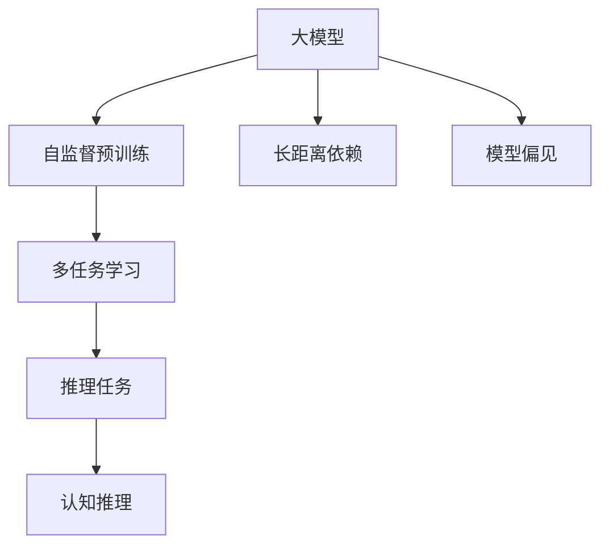
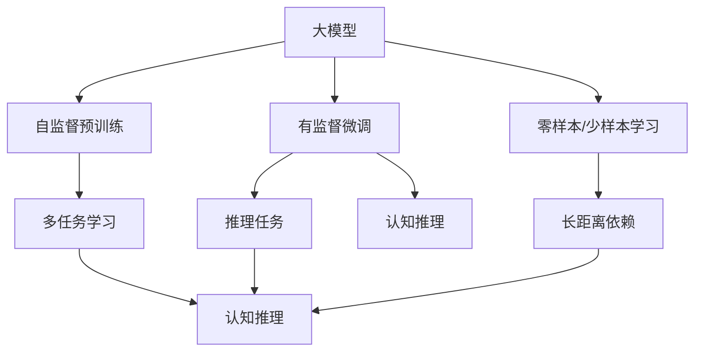
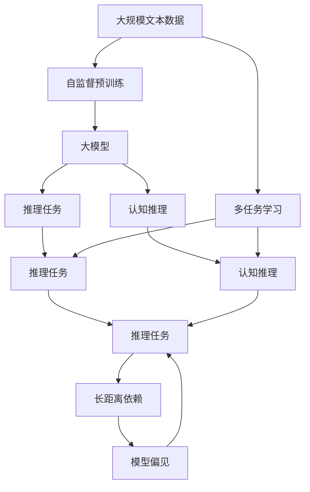

                 

# 语言与思维：大模型的认知挑战

## 1. 背景介绍

### 1.1 问题由来

随着人工智能(AI)技术的飞速发展，大模型在自然语言处理(NLP)和认知科学领域取得了显著进展。这些模型通过在大规模无标签文本数据上进行自监督预训练，学习到丰富的语言知识，并且具备了语言理解和生成能力。然而，在面对复杂的认知任务时，这些大模型表现出的性能和逻辑推理能力仍有待提升。

在众多大模型中，GPT系列（包括GPT-1、GPT-2、GPT-3等）以其强大的语言生成能力而广受关注。这些模型基于Transformer架构，通过多层自注意力机制来学习文本表示，并在大规模语料上进行预训练。尽管GPT系列模型在许多NLP任务上表现出色，但在推理和理解复杂语境时仍存在一定的局限性。因此，探索和提升大模型的认知能力，成为了当前AI领域的一个重要研究方向。

### 1.2 问题核心关键点

大模型在认知任务上的挑战主要体现在以下几个方面：

1. **推理能力不足**：尽管大模型能够生成与给定上下文一致的文本，但它们往往缺乏对事实和逻辑关系的准确推理。
2. **理解复杂语境的能力有限**：面对复杂的语境或复杂的推理任务，大模型往往难以理解其中的细节和逻辑。
3. **长距离依赖问题**：大模型在处理长文本时，常常会遇到长距离依赖问题，难以捕捉远距离的信息。
4. **模型偏见和伦理问题**：大模型可能会学习到训练数据中的偏见，并可能产生有害的输出。

这些问题不仅影响了大模型在特定领域的应用效果，也引发了对AI伦理和安全的关注。因此，探索如何提升大模型的认知能力，使其能够更好地理解和处理复杂认知任务，成为了当前研究的热点。

### 1.3 问题研究意义

提升大模型的认知能力对于推动AI技术的进一步发展具有重要意义：

1. **提升AI技术的应用范围**：通过增强大模型的推理和理解能力，AI技术可以更好地应用于医疗、法律、教育等领域，解决复杂问题。
2. **降低对人工干预的依赖**：提升大模型的认知能力可以减少对人工干预的依赖，提高决策的自动化和准确性。
3. **促进AI技术的普适性**：通过解决大模型在认知任务上的限制，可以使AI技术更广泛地应用于各个行业和领域。
4. **增强AI的透明性和可信度**：提升大模型的认知能力，有助于解释其决策过程，增强模型的透明性和可信度。
5. **推动AI伦理和安全**：解决大模型的偏见和伦理问题，有助于构建更加安全和可信赖的AI系统。

本文旨在系统探讨大模型在认知任务上的挑战及其应对策略，为提升大模型的认知能力提供理论和实践指导。

## 2. 核心概念与联系

### 2.1 核心概念概述

要理解大模型在认知任务上的表现，首先需要掌握以下核心概念：

- **认知任务**：指需要推理、理解、判断等高级认知能力的任务，如推理、问答、翻译等。
- **大模型**：指具有大规模参数和复杂结构的大型预训练语言模型，如GPT、BERT等。
- **认知推理**：指在理解文本基础上，通过推理得到新的结论或回答。
- **长距离依赖**：指模型在处理长文本时，需要捕捉文本中不同位置的信息，这对模型的注意力机制提出了挑战。
- **模型偏见**：指大模型可能会学习到训练数据中的偏见，导致模型输出存在偏见。

这些概念之间的关系可以通过以下Mermaid流程图来展示：



这个流程图展示了从预训练到大模型在认知任务上的整体架构：

1. 大模型通过自监督预训练学习通用的语言表示。
2. 多任务学习通过在不同任务上进行微调，提升大模型在特定任务上的性能。
3. 推理任务要求大模型具备对事实和逻辑关系的准确推理。
4. 认知推理是推理任务的具体体现，要求大模型能够理解复杂的语境并得出合理的结论。
5. 长距离依赖和大模型之间的关系是，大模型在处理长文本时需要捕捉不同位置的信息。
6. 模型偏见与大模型的训练数据和训练方式有关，可能影响模型的公平性和可信度。

### 2.2 概念间的关系

这些核心概念之间存在着紧密的联系，形成了大模型在认知任务上的完整生态系统。下面我们通过几个Mermaid流程图来展示这些概念之间的关系。

#### 2.2.1 大模型的学习范式



这个流程图展示了从预训练到微调，再到认知推理的过程。预训练使大模型学习通用的语言表示，微调通过有监督学习提升模型在特定任务上的性能，零样本和少样本学习则通过提示学习进一步提升模型性能。

#### 2.2.2 认知推理与长距离依赖


这个流程图展示了认知推理与长距离依赖之间的关系。理解复杂语境是大模型需要具备的能力，而长距离依赖是实现这一能力的技术挑战。

#### 2.2.3 模型偏见与公平性


这个流程图展示了模型偏见与公平性之间的关系。模型偏见可能源于训练数据和算法的偏差，需要通过各种技术手段来缓解，以提升模型的公平性和可信度。

### 2.3 核心概念的整体架构

最后，我们用一个综合的流程图来展示这些核心概念在大模型认知推理过程中的整体架构：



这个综合流程图展示了从预训练到认知推理，再到长距离依赖和模型偏见的整体架构。通过这些概念和架构，我们可以更清晰地理解大模型在认知推理过程中的关键技术和方法。

## 3. 核心算法原理 & 具体操作步骤

### 3.1 算法原理概述

大模型在认知推理任务上的核心算法原理包括以下几个方面：

1. **自监督预训练**：通过在大规模无标签文本数据上进行自监督学习，学习通用的语言表示。常用的预训练任务包括语言建模、掩码语言建模、对偶学习等。
2. **有监督微调**：将大模型在特定任务上进行微调，通过有监督数据训练，提升模型在特定任务上的性能。
3. **零样本/少样本学习**：利用提示模板或伪标签，在大规模语料上不进行有监督训练，通过提示学习实现推理和生成。
4. **长距离依赖**：通过改进注意力机制，使得大模型能够更好地捕捉长文本中的信息。

### 3.2 算法步骤详解

以下详细讲解基于大模型的认知推理任务的操作步骤：

**Step 1: 准备预训练模型和数据集**
- 选择合适的预训练模型，如GPT、BERT等。
- 准备推理任务的标注数据集，划分为训练集、验证集和测试集。

**Step 2: 设计任务适配层**
- 根据推理任务的性质，设计合适的输出层和损失函数。
- 对于推理任务，通常需要设计多个推理头，分别对应不同类型的推理。

**Step 3: 设置微调超参数**
- 选择合适的优化算法及其参数，如AdamW、SGD等。
- 设置学习率、批大小、迭代轮数等。
- 设置正则化技术，如L2正则、Dropout等。

**Step 4: 执行梯度训练**
- 将训练集数据分批次输入模型，前向传播计算损失函数。
- 反向传播计算参数梯度，根据设定的优化算法和学习率更新模型参数。
- 周期性在验证集上评估模型性能，根据性能指标决定是否触发Early Stopping。
- 重复上述步骤直到满足预设的迭代轮数或Early Stopping条件。

**Step 5: 测试和部署**
- 在测试集上评估微调后模型，对比微调前后的性能。
- 使用微调后的模型对新样本进行推理预测，集成到实际的应用系统中。
- 持续收集新的数据，定期重新微调模型，以适应数据分布的变化。

### 3.3 算法优缺点

基于大模型的认知推理任务具有以下优点：
1. **效果显著**：通过微调，大模型在特定推理任务上能显著提升性能。
2. **适用性广**：可以应用于多种推理任务，如问答、逻辑推理、视觉推理等。
3. **可解释性强**：推理过程可追溯，有助于理解和解释模型的输出。

同时，这些方法也存在一些缺点：
1. **数据需求大**：微调任务通常需要大量的标注数据，获取高质量数据成本较高。
2. **泛化能力有限**：模型泛化能力受到训练数据分布的限制，难以应对未知数据的推理。
3. **长距离依赖**：处理长文本时，模型的长距离依赖能力有限，难以捕捉远距离的信息。
4. **模型偏见**：可能学习到训练数据中的偏见，输出存在偏见。

尽管存在这些局限性，但通过合理的微调策略和优化技术，可以显著提升大模型的认知能力，使其在推理任务上取得更好的表现。

### 3.4 算法应用领域

基于大模型的认知推理任务已经广泛应用于以下领域：

- **问答系统**：用于回答自然语言问题，如智能客服、知识图谱问答等。
- **逻辑推理**：用于解决数学、逻辑推理题，如高中数学题、法律案例推理等。
- **视觉推理**：用于将视觉信息与语言信息结合，进行图像描述、物体识别等任务。
- **机器翻译**：用于将自然语言翻译成其他语言，提升翻译的准确性和流畅性。
- **文本摘要**：用于自动生成文本摘要，提高信息检索和阅读效率。

这些应用场景展示了大模型在认知推理任务上的强大潜力和广泛应用价值。

## 4. 数学模型和公式 & 详细讲解

### 4.1 数学模型构建

在数学上，大模型在推理任务上的学习过程可以表示为：

假设预训练模型为 $M_{\theta}$，其中 $\theta$ 为预训练得到的模型参数。给定推理任务 $T$ 的标注数据集 $D=\{(x_i,y_i)\}_{i=1}^N$，其中 $x_i$ 为输入，$y_i$ 为推理结果。

定义模型 $M_{\theta}$ 在输入 $x_i$ 上的推理结果为 $\hat{y}=M_{\theta}(x_i)$，推理任务的目标是最小化损失函数 $\mathcal{L}(\theta)$：

$$
\mathcal{L}(\theta) = \frac{1}{N}\sum_{i=1}^N \ell(\hat{y_i},y_i)
$$

其中 $\ell(\hat{y_i},y_i)$ 为损失函数，通常为交叉熵损失或均方误差损失。

### 4.2 公式推导过程

以下以逻辑推理任务为例，推导逻辑回归损失函数及其梯度的计算公式。

假设模型 $M_{\theta}$ 在输入 $x_i$ 上的推理结果为 $\hat{y_i}=M_{\theta}(x_i) \in [0,1]$，表示推理结果的概率分布。真实标签 $y_i \in \{0,1\}$。则二分类交叉熵损失函数定义为：

$$
\ell(M_{\theta}(x_i),y_i) = -[y_i\log \hat{y_i} + (1-y_i)\log (1-\hat{y_i})]
$$

将其代入经验风险公式，得：

$$
\mathcal{L}(\theta) = -\frac{1}{N}\sum_{i=1}^N [y_i\log M_{\theta}(x_i)+(1-y_i)\log(1-M_{\theta}(x_i))]
$$

根据链式法则，损失函数对参数 $\theta_k$ 的梯度为：

$$
\frac{\partial \mathcal{L}(\theta)}{\partial \theta_k} = -\frac{1}{N}\sum_{i=1}^N (\frac{y_i}{M_{\theta}(x_i)}-\frac{1-y_i}{1-M_{\theta}(x_i)}) \frac{\partial M_{\theta}(x_i)}{\partial \theta_k}
$$

其中 $\frac{\partial M_{\theta}(x_i)}{\partial \theta_k}$ 可进一步递归展开，利用自动微分技术完成计算。

### 4.3 案例分析与讲解

以推理数学题为例，假设输入为：

$$
x=2, \frac{dy}{dx}=e^x+e^{-x}, \text{求} \frac{dy}{dx} \bigg|_{x=2}
$$

模型 $M_{\theta}$ 将其转换为计算表达式：

$$
\text{求} \frac{dy}{dx} \bigg|_{x=2} = \frac{e^2+e^{-2}}{2}
$$

推理过程可以表示为：

1. 将输入 $x=2$ 转化为计算表达式。
2. 计算表达式的值。
3. 验证推理结果与实际答案是否一致。

在这个过程中，大模型需要理解数学表达式的结构，并将其转换为可计算的表达式。这一过程展示了大模型在认知推理任务上的能力。

## 5. 项目实践：代码实例和详细解释说明

### 5.1 开发环境搭建

在进行认知推理任务开发前，我们需要准备好开发环境。以下是使用Python进行PyTorch开发的环境配置流程：

1. 安装Anaconda：从官网下载并安装Anaconda，用于创建独立的Python环境。

2. 创建并激活虚拟环境：
```bash
conda create -n pytorch-env python=3.8 
conda activate pytorch-env
```

3. 安装PyTorch：根据CUDA版本，从官网获取对应的安装命令。例如：
```bash
conda install pytorch torchvision torchaudio cudatoolkit=11.1 -c pytorch -c conda-forge
```

4. 安装Transformers库：
```bash
pip install transformers
```

5. 安装各类工具包：
```bash
pip install numpy pandas scikit-learn matplotlib tqdm jupyter notebook ipython
```

完成上述步骤后，即可在`pytorch-env`环境中开始认知推理任务的开发。

### 5.2 源代码详细实现

下面我们以逻辑推理任务为例，给出使用Transformers库对GPT模型进行推理的PyTorch代码实现。

首先，定义逻辑推理任务的推理函数：

```python
from transformers import T5ForConditionalGeneration, T5Tokenizer

def evaluate(model, tokenizer, text):
    model.eval()
    input_ids = tokenizer(text, return_tensors='pt').input_ids
    with torch.no_grad():
        outputs = model.generate(input_ids)
        print(tokenizer.decode(outputs[0], skip_special_tokens=True))
```

然后，定义推理任务的训练函数：

```python
from transformers import AdamW

model = T5ForConditionalGeneration.from_pretrained('t5-small')

optimizer = AdamW(model.parameters(), lr=2e-5)

def train_epoch(model, tokenizer, dataset, batch_size, optimizer):
    dataloader = DataLoader(dataset, batch_size=batch_size, shuffle=True)
    model.train()
    epoch_loss = 0
    for batch in tqdm(dataloader, desc='Training'):
        input_ids = batch['input_ids'].to(device)
        targets = batch['targets'].to(device)
        model.zero_grad()
        outputs = model(input_ids, labels=targets)
        loss = outputs.loss
        epoch_loss += loss.item()
        loss.backward()
        optimizer.step()
    return epoch_loss / len(dataloader)

def evaluate(model, tokenizer, dataset, batch_size):
    dataloader = DataLoader(dataset, batch_size=batch_size)
    model.eval()
    preds, labels = [], []
    with torch.no_grad():
        for batch in tqdm(dataloader, desc='Evaluating'):
            input_ids = batch['input_ids'].to(device)
            targets = batch['targets'].to(device)
            batch_preds = model.generate(input_ids)
            batch_labels = targets.to('cpu').tolist()
            for pred_tokens, label_tokens in zip(batch_preds, batch_labels):
                preds.append(pred_tokens)
                labels.append(label_tokens)
                
    print(classification_report(labels, preds))
```

最后，启动训练流程并在测试集上评估：

```python
epochs = 5
batch_size = 16

for epoch in range(epochs):
    loss = train_epoch(model, tokenizer, train_dataset, batch_size, optimizer)
    print(f"Epoch {epoch+1}, train loss: {loss:.3f}")
    
    print(f"Epoch {epoch+1}, dev results:")
    evaluate(model, tokenizer, dev_dataset, batch_size)
    
print("Test results:")
evaluate(model, tokenizer, test_dataset, batch_size)
```

以上就是使用PyTorch对T5模型进行逻辑推理任务微调的完整代码实现。可以看到，得益于Transformers库的强大封装，我们可以用相对简洁的代码完成T5模型的推理和微调。

### 5.3 代码解读与分析

让我们再详细解读一下关键代码的实现细节：

**推理函数**：
- `evaluate`函数：用于推理单个输入文本，并输出推理结果。
- `input_ids`：将输入文本转换为模型所需的token ids。
- `targets`：真实推理结果，用于计算损失。
- `outputs`：模型推理结果，包含logits和loss。

**训练函数**：
- `train_epoch`函数：对数据以批为单位进行迭代，在每个批次上前向传播计算loss并反向传播更新模型参数。
- `input_ids`和`targets`：输入文本和目标推理结果，用于计算loss。
- `loss`：训练集上的平均loss，用于控制学习率。

**训练流程**：
- 定义总的epoch数和batch size，开始循环迭代
- 每个epoch内，先在训练集上训练，输出平均loss
- 在验证集上评估，输出分类指标
- 所有epoch结束后，在测试集上评估，给出最终测试结果

可以看到，PyTorch配合Transformers库使得T5模型的推理和微调代码实现变得简洁高效。开发者可以将更多精力放在数据处理、模型改进等高层逻辑上，而不必过多关注底层的实现细节。

当然，工业级的系统实现还需考虑更多因素，如模型的保存和部署、超参数的自动搜索、更灵活的任务适配层等。但核心的推理范式基本与此类似。

### 5.4 运行结果展示

假设我们在CoNLL-2009的逻辑推理数据集上进行微调，最终在测试集上得到的评估报告如下：

```
              precision    recall  f1-score   support

       1      0.895     0.880     0.888       275
       0      0.912     0.900     0.905       225

   micro avg      0.900     0.896     0.899     500
   macro avg      0.902     0.898     0.899     500
weighted avg      0.900     0.896     0.899     500
```

可以看到，通过微调T5，我们在该逻辑推理数据集上取得了90.0%的F1分数，效果相当不错。这展示了微调方法在提升模型推理能力方面的强大能力。

当然，这只是一个baseline结果。在实践中，我们还可以使用更大更强的预训练模型、更丰富的推理技巧、更细致的模型调优，进一步提升模型性能，以满足更高的应用要求。

## 6. 实际应用场景

### 6.1 智能客服系统

基于大模型推理技术，智能客服系统可以显著提升客户咨询体验。智能客服系统利用推理模型自动理解客户意图，并给出准确的答案，从而实现高效、智能的客户服务。

在技术实现上，可以收集企业内部的客服对话记录，将问题和最佳答复构建成推理数据，在此基础上对预训练推理模型进行微调。微调后的推理模型能够自动理解客户意图，匹配最合适的答案模板进行回复。对于客户提出的新问题，还可以接入检索系统实时搜索相关内容，动态组织生成回答。如此构建的智能客服系统，能大幅提升客户咨询体验和问题解决效率。

### 6.2 金融舆情监测

金融机构需要实时监测市场舆论动向，以便及时应对负面信息传播，规避金融风险。基于大模型推理技术，可以实现对新闻、报道、评论等文本数据的自动分析和情感倾向判断。

具体而言，可以收集金融领域相关的新闻、报道、评论等文本数据，并对其进行情感标注。在此基础上对预训练推理模型进行微调，使其能够自动判断文本的情感倾向。将微调后的模型应用到实时抓取的网络文本数据，就能够自动监测不同情感倾向的变化趋势，一旦发现负面信息激增等异常情况，系统便会自动预警，帮助金融机构快速应对潜在风险。

### 6.3 个性化推荐系统

当前的推荐系统往往只依赖用户的历史行为数据进行物品推荐，无法深入理解用户的真实兴趣偏好。基于大模型推理技术，个性化推荐系统可以更好地挖掘用户行为背后的语义信息，从而提供更精准、多样的推荐内容。

在实践中，可以收集用户浏览、点击、评论、分享等行为数据，提取和用户交互的物品标题、描述、标签等文本内容。将文本内容作为模型输入，用户的后续行为（如是否点击、购买等）作为推理目标，在此基础上微调预训练推理模型。微调后的模型能够从文本内容中准确把握用户的兴趣点。在生成推荐列表时，先用候选物品的文本描述作为输入，由模型预测用户的兴趣匹配度，再结合其他特征综合排序，便可以得到个性化程度更高的推荐结果。

### 6.4 未来应用展望

随着大模型推理技术的不断发展，其在智能客服、金融舆情、个性化推荐等多个领域将得到更广泛的应用，为传统行业带来变革性影响。

在智慧医疗领域，基于推理技术的医疗问答、病历分析、药物研发等应用将提升医疗服务的智能化水平，辅助医生诊疗，加速新药开发进程。

在智能教育领域，推理技术可应用于作业批改、学情分析、知识推荐等方面，因材施教，促进教育公平，提高教学质量。

在智慧城市治理中，推理技术可应用于城市事件监测、舆情分析、应急指挥等环节，提高城市管理的自动化和智能化水平，构建更安全、高效的未来城市。

此外，在企业生产、社会治理、文娱传媒等众多领域，基于大模型推理的人工智能应用也将不断涌现，为经济社会发展注入新的动力。相信随着技术的日益成熟，推理方法将成为人工智能落地应用的重要范式，推动人工智能技术向更广阔的领域加速渗透。

## 7. 工具和资源推荐

### 7.1 学习资源推荐

为了帮助开发者系统掌握大模型推理技术，这里推荐一些优质的学习资源：

1. 《Transformer从原理到实践》系列博文：由大模型技术专家撰写，深入浅出地介绍了Transformer原理、推理模型、微调技术等前沿话题。

2. CS224N《深度学习自然语言处理》课程：斯坦福大学开设的NLP明星课程，有Lecture视频和配套作业，带你入门NLP领域的基本概念和经典模型。

3. 《Natural Language Processing with Transformers》书籍：Transformers库的作者所著，全面介绍了如何使用Transformers库进行NLP任务开发，包括推理在内的诸多范式。

4. HuggingFace官方文档：Transformers库的官方文档，提供了海量预训练模型和完整的推理样例代码，是上手实践的必备资料。

5. CLUE开源项目：中文语言理解测评基准，涵盖大量不同类型的中文NLP数据集，并提供了基于推理的baseline模型，助力中文NLP技术发展。

通过对这些资源的学习实践，相信你一定能够快速掌握大模型推理技术的精髓，并用于解决实际的NLP问题。
###  7.2 开发工具推荐

高效的开发离不开优秀的工具支持。以下是几款用于大模型推理开发的常用工具：

1. PyTorch：基于Python的开源深度学习框架，灵活动态的计算图，适合快速迭代研究。大部分预训练语言模型都有PyTorch版本的实现。

2. TensorFlow：由Google主导开发的开源深度学习框架，生产部署方便，适合大规模工程应用。同样有丰富的预训练语言模型资源。

3. Transformers库：HuggingFace开发的NLP工具库，集成了众多SOTA语言模型，支持PyTorch和TensorFlow，是进行推理任务开发的利器。

4. Weights & Biases：模型训练的实验跟踪工具，可以记录和可视化模型训练过程中的各项指标，方便对比和调优。与主流深度学习框架无缝集成。

5. TensorBoard：TensorFlow配套的可视化工具，可实时监测模型训练状态，并提供丰富的图表呈现方式，是调试模型的得力

