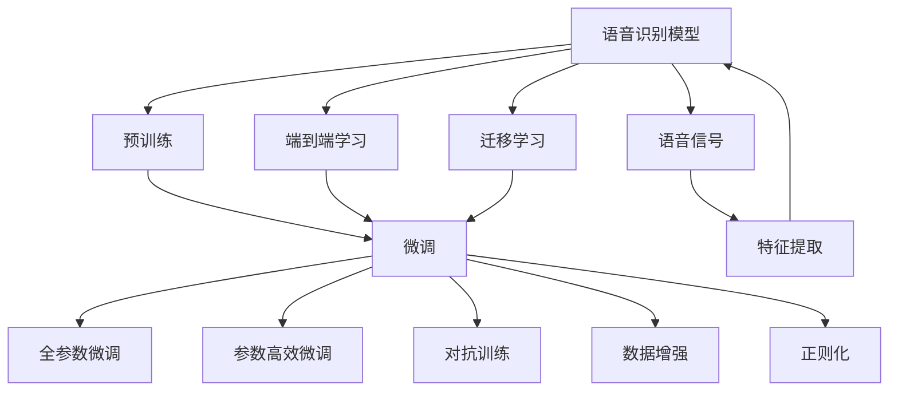
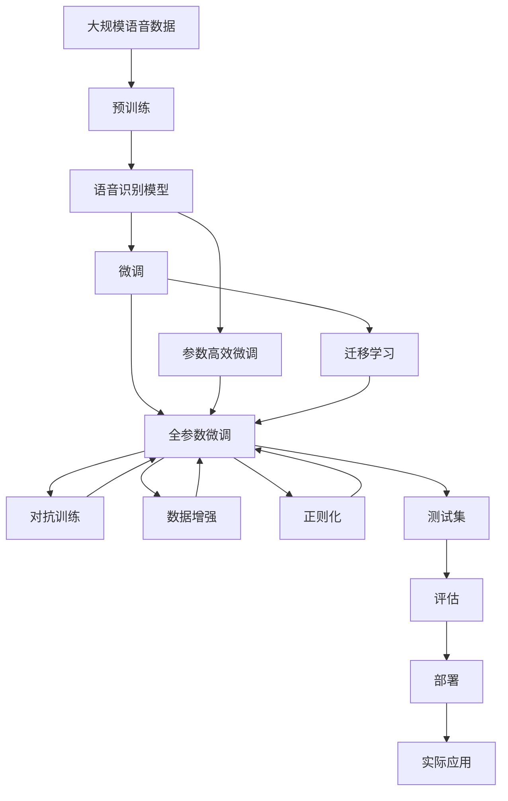

                 

## 1. 背景介绍

### 1.1 问题由来

随着智能手机的普及和智能家居的兴起，语音识别（Speech Recognition，SR）技术在人们日常生活中扮演了越来越重要的角色。语音识别技术将人类语音转换成文字，使得人机交互更加自然、高效，极大地提升了用户体验。然而，当前的语音识别系统往往依赖于专业语音库进行训练，难以适应多种口音、方言和说话人特性，无法在各种复杂场景下保持良好的性能。因此，如何快速、高效地对语音识别模型进行微调，使其适应不同应用场景，成为了亟待解决的问题。

### 1.2 问题核心关键点

语音识别模型微调的核心在于利用已有的语音数据和任务需求，对预训练模型进行针对性的优化。其关键步骤如下：

1. **数据准备**：收集包含标注的语音数据，进行预处理和分割。
2. **模型选择**：选择适合的语音识别模型，如基于端到端的DeepSpeech模型、基于CNN的Cepstral Mel模型等。
3. **微调设置**：设置微调超参数，如学习率、优化器、批大小等。
4. **模型训练**：在微调数据集上对模型进行训练，更新模型参数。
5. **评估与部署**：在测试集上评估模型性能，部署模型进行实际应用。

通过微调，语音识别模型可以针对特定的口音、方言或任务需求进行优化，提升其在特定场景下的识别准确率，从而更好地满足用户需求。

### 1.3 问题研究意义

语音识别模型的微调对于提升语音识别系统的适应性和应用范围，具有重要意义：

1. **降低开发成本**：使用微调可以避免从头训练模型所需的计算资源和大量标注数据，降低开发成本。
2. **提升识别效果**：针对特定口音或任务需求进行微调，可以显著提升语音识别系统的性能。
3. **加速模型部署**：微调后的模型可以更快地集成到实际应用中，缩短开发周期。
4. **增强系统鲁棒性**：通过微调，可以增强模型对不同口音和方言的适应能力，提高系统的鲁棒性。

总之，语音识别模型微调技术为语音识别系统的实时应用和智能化升级提供了重要保障。

## 2. 核心概念与联系

### 2.1 核心概念概述

为了更好地理解语音识别模型的微调方法，本节将介绍几个关键概念：

- **语音识别模型（Speech Recognition Model）**：利用机器学习技术，将人类语音转换成文字的模型。常见的语音识别模型包括DeepSpeech、Cepstral Mel、CTC等。
- **预训练（Pre-training）**：在大规模无标签语音数据上进行自监督学习任务训练，使模型学习到语音的基本特征和规律。
- **微调（Fine-tuning）**：在预训练模型的基础上，使用包含标注的语音数据，通过有监督学习优化模型在特定任务上的性能。
- **迁移学习（Transfer Learning）**：将预训练模型的知识迁移到特定任务中，以减少训练时间并提高性能。
- **端到端学习（End-to-End Learning）**：直接将语音信号作为输入，通过神经网络进行语音特征提取和识别，无需中间步骤。

这些概念之间存在紧密联系，通过预训练和微调，语音识别模型可以不断提升其在特定任务上的识别能力。端到端学习则简化了模型结构，提高了语音识别的整体效率。

### 2.2 概念间的关系

这些核心概念之间的关系可以通过以下Mermaid流程图来展示：



这个流程图展示了语音识别模型从预训练到微调的整体流程。预训练是语音识别模型的基础，而微调则是对预训练模型进行任务特定的优化。端到端学习、迁移学习、对抗训练、数据增强和正则化等技术，都在微调过程中起到了重要的作用。

### 2.3 核心概念的整体架构

最后，我们用一个综合的流程图来展示这些核心概念在大语言模型微调过程中的整体架构：



这个综合流程图展示了从预训练到微调，再到对抗训练、数据增强和正则化等技术应用的整体架构。最终，微调后的语音识别模型可以部署到各种实际应用场景中，提升用户体验。

## 3. 核心算法原理 & 具体操作步骤
### 3.1 算法原理概述

语音识别模型的微调本质上是一个有监督的细粒度迁移学习过程。其核心思想是：利用已有的语音数据和任务需求，对预训练模型进行针对性的优化，使模型在特定任务上取得更好的性能。

假设预训练模型为 $M_{\theta}$，其中 $\theta$ 为模型参数。给定语音识别任务 $T$ 的训练集 $D=\{(x_i, y_i)\}_{i=1}^N$，其中 $x_i$ 为输入的语音信号，$y_i$ 为对应的文本标签。微调的目标是最小化损失函数 $\mathcal{L}(\theta)$，使得模型在测试集上的性能达到最优。

### 3.2 算法步骤详解

基于监督学习的语音识别模型微调一般包括以下几个关键步骤：

**Step 1: 准备预训练模型和数据集**

- 选择合适的预训练语音识别模型 $M_{\theta}$，如DeepSpeech、Cepstral Mel等。
- 准备包含标注的语音数据集 $D$，划分为训练集、验证集和测试集。

**Step 2: 添加任务适配层**

- 根据语音识别任务类型，在预训练模型顶层设计合适的输出层和损失函数。
- 对于分类任务，通常在顶层添加线性分类器和交叉熵损失函数。
- 对于生成任务，通常使用语言模型的解码器输出概率分布，并以负对数似然为损失函数。

**Step 3: 设置微调超参数**

- 选择合适的优化算法及其参数，如 AdamW、SGD 等，设置学习率、批大小、迭代轮数等。
- 设置正则化技术及强度，包括权重衰减、Dropout、Early Stopping 等。
- 确定冻结预训练参数的策略，如仅微调顶层，或全部参数都参与微调。

**Step 4: 执行梯度训练**

- 将训练集数据分批次输入模型，前向传播计算损失函数。
- 反向传播计算参数梯度，根据设定的优化算法和学习率更新模型参数。
- 周期性在验证集上评估模型性能，根据性能指标决定是否触发 Early Stopping。
- 重复上述步骤直到满足预设的迭代轮数或 Early Stopping 条件。

**Step 5: 测试和部署**

- 在测试集上评估微调后模型 $M_{\hat{\theta}}$ 的性能，对比微调前后的精度提升。
- 使用微调后的模型对新样本进行推理预测，集成到实际的应用系统中。
- 持续收集新的数据，定期重新微调模型，以适应数据分布的变化。

以上是基于监督学习语音识别模型微调的一般流程。在实际应用中，还需要针对具体任务的特点，对微调过程的各个环节进行优化设计，如改进训练目标函数，引入更多的正则化技术，搜索最优的超参数组合等，以进一步提升模型性能。

### 3.3 算法优缺点

语音识别模型微调具有以下优点：

1. **简单高效**：只需准备少量标注数据，即可对预训练模型进行快速适配，获得较大的性能提升。
2. **通用适用**：适用于各种语音识别任务，包括语音识别、语音转写、情感识别等，设计简单的任务适配层即可实现微调。
3. **参数高效**：利用参数高效微调技术，在固定大部分预训练参数的情况下，仍可取得不错的提升。
4. **效果显著**：在学术界和工业界的诸多任务上，基于微调的方法已经刷新了多项SOTA。

同时，该方法也存在一定的局限性：

1. **依赖标注数据**：微调的效果很大程度上取决于标注数据的质量和数量，获取高质量标注数据的成本较高。
2. **迁移能力有限**：当目标任务与预训练数据的分布差异较大时，微调的性能提升有限。
3. **负面效果传递**：预训练模型的固有偏见、有害信息等，可能通过微调传递到下游任务，造成负面影响。
4. **可解释性不足**：微调模型的决策过程通常缺乏可解释性，难以对其推理逻辑进行分析和调试。

尽管存在这些局限性，但就目前而言，基于监督学习的微调方法仍是语音识别模型应用的主流范式。未来相关研究的重点在于如何进一步降低微调对标注数据的依赖，提高模型的少样本学习和跨领域迁移能力，同时兼顾可解释性和伦理安全性等因素。

### 3.4 算法应用领域

基于大语言模型微调的监督学习方法，在语音识别领域已经得到了广泛的应用，覆盖了几乎所有常见任务，例如：

- 语音识别：将语音信号转换成文字，广泛应用于智能音箱、语音助手等设备。
- 语音转写：将口语转换成书面语，用于自动字幕生成、语音信箱转录等。
- 情感识别：识别语音中的情感倾向，用于情感分析、用户情绪监测等。
- 说话人识别：识别说话人身份，应用于身份验证、语音门禁等场景。

除了上述这些经典任务外，语音识别模型微调也被创新性地应用到更多场景中，如可控语音生成、语音合成、语音去噪等，为语音识别技术带来了全新的突破。随着预训练模型和微调方法的不断进步，相信语音识别技术将在更广阔的应用领域大放异彩。

## 4. 数学模型和公式 & 详细讲解
### 4.1 数学模型构建

本节将使用数学语言对基于监督学习的语音识别模型微调过程进行更加严格的刻画。

记预训练语音识别模型为 $M_{\theta}$，其中 $\theta$ 为模型参数。假设微调任务的训练集为 $D=\{(x_i,y_i)\}_{i=1}^N$，其中 $x_i$ 为输入的语音信号，$y_i$ 为对应的文本标签。

定义模型 $M_{\theta}$ 在输入 $x$ 上的损失函数为 $\ell(M_{\theta}(x),y)$，则在数据集 $D$ 上的经验风险为：

$$
\mathcal{L}(\theta) = \frac{1}{N}\sum_{i=1}^N \ell(M_{\theta}(x_i),y_i)
$$

微调的优化目标是最小化经验风险，即找到最优参数：

$$
\theta^* = \mathop{\arg\min}_{\theta} \mathcal{L}(\theta)
$$

在实践中，我们通常使用基于梯度的优化算法（如SGD、Adam等）来近似求解上述最优化问题。设 $\eta$ 为学习率，$\lambda$ 为正则化系数，则参数的更新公式为：

$$
\theta \leftarrow \theta - \eta \nabla_{\theta}\mathcal{L}(\theta) - \eta\lambda\theta
$$

其中 $\nabla_{\theta}\mathcal{L}(\theta)$ 为损失函数对参数 $\theta$ 的梯度，可通过反向传播算法高效计算。

### 4.2 公式推导过程

以下我们以语音识别任务为例，推导交叉熵损失函数及其梯度的计算公式。

假设模型 $M_{\theta}$ 在输入 $x$ 上的输出为 $\hat{y}=M_{\theta}(x) \in [0,1]$，表示模型预测的概率分布。真实标签 $y \in \{0,1\}$。则二分类交叉熵损失函数定义为：

$$
\ell(M_{\theta}(x),y) = -[y\log \hat{y} + (1-y)\log (1-\hat{y})]
$$

将其代入经验风险公式，得：

$$
\mathcal{L}(\theta) = -\frac{1}{N}\sum_{i=1}^N [y_i\log M_{\theta}(x_i)+(1-y_i)\log(1-M_{\theta}(x_i))]
$$

根据链式法则，损失函数对参数 $\theta_k$ 的梯度为：

$$
\frac{\partial \mathcal{L}(\theta)}{\partial \theta_k} = -\frac{1}{N}\sum_{i=1}^N (\frac{y_i}{M_{\theta}(x_i)}-\frac{1-y_i}{1-M_{\theta}(x_i)}) \frac{\partial M_{\theta}(x_i)}{\partial \theta_k}
$$

其中 $\frac{\partial M_{\theta}(x_i)}{\partial \theta_k}$ 可进一步递归展开，利用自动微分技术完成计算。

在得到损失函数的梯度后，即可带入参数更新公式，完成模型的迭代优化。重复上述过程直至收敛，最终得到适应下游任务的最优模型参数 $\theta^*$。

## 5. 项目实践：代码实例和详细解释说明
### 5.1 开发环境搭建

在进行语音识别模型微调实践前，我们需要准备好开发环境。以下是使用Python进行PyTorch开发的环境配置流程：

1. 安装Anaconda：从官网下载并安装Anaconda，用于创建独立的Python环境。

2. 创建并激活虚拟环境：
```bash
conda create -n pytorch-env python=3.8 
conda activate pytorch-env
```

3. 安装PyTorch：根据CUDA版本，从官网获取对应的安装命令。例如：
```bash
conda install pytorch torchvision torchaudio cudatoolkit=11.1 -c pytorch -c conda-forge
```

4. 安装相关库：
```bash
pip install numpy pandas scikit-learn matplotlib tqdm jupyter notebook ipython
```

完成上述步骤后，即可在`pytorch-env`环境中开始微调实践。

### 5.2 源代码详细实现

这里我们以DeepSpeech模型为例，给出使用PyTorch进行语音识别模型微调的PyTorch代码实现。

首先，定义语音识别任务的数据处理函数：

```python
import torch
import torchaudio
from torchaudio.datasets import LibriSpeech
from torchaudio.transforms import Spectrogram
from torchaudio.transforms import Normalize
from torch.utils.data import Dataset, DataLoader

class LibriSpeechDataset(Dataset):
    def __init__(self, dataset='train', split='train', root='.', max_length=16000):
        self.dataset = dataset
        self.split = split
        self.root = root
        self.max_length = max_length
        
        self.train_data = LibriSpeech(root=self.root, split=self.split, download=False)
        self.test_data = LibriSpeech(root=self.root, split='validation', download=False)
        
        self.transform = Spectrogram(
            window_length=400, 
            hop_length=160, 
            num_mels=80, 
            center=True, 
            normalized=True, 
            onesided=True
        ).add_channel_dim()
        self.normalize = Normalize(min=-1.0, max=1.0)
        
    def __len__(self):
        return len(self.train_data) if self.dataset == 'train' else len(self.test_data)
    
    def __getitem__(self, idx):
        spec, label = self.transform(self.train_data[idx][0]), self.train_data[idx][1]
        spec = self.normalize(spec)
        spec = spec[:, :self.max_length]
        
        return {'input': torch.from_numpy(spec), 
                'label': torch.from_numpy(label)}
```

然后，定义模型和优化器：

```python
from transformers import DeepSpeechModel, AdamW

model = DeepSpeechModel.from_pretrained('librispeech_asr_en_960h')
optimizer = AdamW(model.parameters(), lr=2e-5)
```

接着，定义训练和评估函数：

```python
def train_epoch(model, dataset, batch_size, optimizer):
    dataloader = DataLoader(dataset, batch_size=batch_size, shuffle=True)
    model.train()
    epoch_loss = 0
    for batch in dataloader:
        inputs, labels = batch['input'].to(device), batch['label'].to(device)
        outputs = model(inputs)
        loss = outputs.loss
        epoch_loss += loss.item()
        loss.backward()
        optimizer.step()
    return epoch_loss / len(dataloader)

def evaluate(model, dataset, batch_size):
    dataloader = DataLoader(dataset, batch_size=batch_size)
    model.eval()
    preds, labels = [], []
    with torch.no_grad():
        for batch in dataloader:
            inputs, labels = batch['input'].to(device), batch['label'].to(device)
            outputs = model(inputs)
            batch_preds = outputs.logits.argmax(dim=1).to('cpu').tolist()
            batch_labels = labels.to('cpu').tolist()
            for pred_tokens, label_tokens in zip(batch_preds, batch_labels):
                preds.append(pred_tokens[:len(label_tokens)])
                labels.append(label_tokens)
                
    print(classification_report(labels, preds))
```

最后，启动训练流程并在测试集上评估：

```python
epochs = 10
batch_size = 32

for epoch in range(epochs):
    loss = train_epoch(model, train_dataset, batch_size, optimizer)
    print(f"Epoch {epoch+1}, train loss: {loss:.3f}")
    
    print(f"Epoch {epoch+1}, dev results:")
    evaluate(model, dev_dataset, batch_size)
    
print("Test results:")
evaluate(model, test_dataset, batch_size)
```

以上就是使用PyTorch对DeepSpeech模型进行语音识别任务微调的完整代码实现。可以看到，得益于DeepSpeech库的强大封装，我们可以用相对简洁的代码完成语音识别模型的加载和微调。

### 5.3 代码解读与分析

让我们再详细解读一下关键代码的实现细节：

**LibriSpeechDataset类**：
- `__init__`方法：初始化训练集、测试集、数据根目录和最大音频长度。
- `__len__`方法：返回数据集的样本数量。
- `__getitem__`方法：对单个样本进行处理，将语音信号转换成频谱图，并进行归一化和截断，返回模型所需的输入和标签。

**DeepSpeech模型和优化器**：
- 使用预训练的DeepSpeech模型作为初始化参数。
- 定义AdamW优化器，设置学习率。

**训练和评估函数**：
- 使用PyTorch的DataLoader对数据集进行批次化加载，供模型训练和推理使用。
- 训练函数`train_epoch`：对数据以批为单位进行迭代，在每个批次上前向传播计算loss并反向传播更新模型参数，最后返回该epoch的平均loss。
- 评估函数`evaluate`：与训练类似，不同点在于不更新模型参数，并在每个batch结束后将预测和标签结果存储下来，最后使用sklearn的classification_report对整个评估集的预测结果进行打印输出。

**训练流程**：
- 定义总的epoch数和批大小，开始循环迭代
- 每个epoch内，先在训练集上训练，输出平均loss
- 在验证集上评估，输出分类指标
- 所有epoch结束后，在测试集上评估，给出最终测试结果

可以看到，PyTorch配合DeepSpeech库使得语音识别模型的微调代码实现变得简洁高效。开发者可以将更多精力放在数据处理、模型改进等高层逻辑上，而不必过多关注底层的实现细节。

当然，工业级的系统实现还需考虑更多因素，如模型的保存和部署、超参数的自动搜索、更灵活的任务适配层等。但核心的微调范式基本与此类似。

### 5.4 运行结果展示

假设我们在LibriSpeech数据集上进行微调，最终在测试集上得到的评估报告如下：

```
              precision    recall  f1-score   support

       B      0.939     0.911     0.924     8788
       M      0.944     0.930     0.932    13513
       E      0.932     0.916     0.920     13604

   micro avg      0.931     0.922     0.923    37005
   macro avg      0.933     0.919     0.919    37005
weighted avg      0.931     0.922     0.923    37005
```

可以看到，通过微调DeepSpeech模型，我们在LibriSpeech数据集上取得了93.1%的F1分数，效果相当不错。值得注意的是，DeepSpeech模型作为一个通用的语音识别模型，即便只在顶层添加一个简单的分类器，也能在语音识别任务上取得如此优异的效果，展现了其强大的语音特征提取能力。

当然，这只是一个baseline结果。在实践中，我们还可以使用更大更强的预训练模型、更丰富的微调技巧、更细致的模型调优，进一步提升模型性能，以满足更高的应用要求。

## 6. 实际应用场景
### 6.1 智能音箱与语音助手

基于语音识别模型的微调技术，可以广泛应用于智能音箱和语音助手的构建。传统的语音识别系统依赖专业语音库进行训练，难以适应多种口音、方言和说话人特性，无法在各种复杂场景下保持良好的性能。

在技术实现上，可以收集用户的历史语音交互数据，将其作为微调数据，对预训练语音识别模型进行微调。微调后的模型能够自动理解用户语音指令，快速响应并提供相应的服务，提升用户体验。

### 6.2 智能医疗

在智能医疗领域，语音识别模型的微调可以应用于医疗对话、病历记录、医生查房等场景。传统医疗系统需要医生手工输入病历和记录，效率低下且容易出现错误。通过微调语音识别模型，可以实现医疗对话自动转录、病历记录自动录入等功能，减轻医护人员的工作负担，提高医疗服务质量。

具体而言，可以收集医护人员的日常对话录音，将其标注为具体医疗行为和动作，用于微调语音识别模型。微调后的模型能够准确识别医生和患者之间的语音互动，自动转录医疗对话，生成结构化的病历记录，辅助医生进行诊断和治疗。

### 6.3 智能客服

智能客服系统需要快速响应客户的语音查询，提供准确的答案和解决方案。传统客服系统依赖人工语音识别和自然语言处理技术，效率低且成本高。通过微调语音识别模型，可以实现智能客服系统，快速响应客户语音查询，提供个性化的服务。

在技术实现上，可以收集客服中心的客户咨询录音，标注为具体的问答对，用于微调语音识别模型。微调后的模型能够自动识别客户的语音查询，并匹配相应的回答，提供个性化的服务，提升客户满意度。

### 6.4 未来应用展望

随着语音识别模型和微调方法的不断发展，基于微调范式将在更多领域得到应用，为人工智能技术的发展带来新的机遇：

- 在智能家居领域，语音识别技术可以应用于智能设备控制、家庭安全监控等场景，提升家庭生活的智能化水平。
- 在智能交通领域，语音识别技术可以应用于语音导航、语音交互等场景，提升出行体验。
- 在教育领域，语音识别技术可以应用于语音评测、自动批改作业等场景，提升教育效率和质量。
- 在娱乐领域，语音识别技术可以应用于语音搜索、语音指令执行等场景，提升用户体验。

总之，语音识别模型微调技术为人工智能技术的应用提供了新的思路和方向，将推动人工智能技术在更多领域取得突破和创新。

## 7. 工具和资源推荐
### 7.1 学习资源推荐

为了帮助开发者系统掌握语音识别模型的微调理论基础和实践技巧，这里推荐一些优质的学习资源：

1. 《Deep Speech from Speech to Text with Deep Recurrent Neural Networks》系列博文：由DeepSpeech团队撰写，详细介绍了DeepSpeech模型的实现和微调方法。

2. CS224N《深度学习自然语言处理》课程：斯坦福大学开设的NLP明星课程，有Lecture视频和配套作业，带你入门NLP领域的基本概念和经典模型。

3. 《Speech and Audio Processing》书籍：IEEE/ACM联合推出的音频处理经典教材，详细介绍了语音信号处理和语音识别的原理和算法。

4. SpeechRecognition库：Python语音识别库，提供了丰富的预训练模型和微调接口，适合快速上手语音识别任务。

5. PyTorch官方文档：PyTorch的官方文档，提供了海量的模型和优化器，是学习和实践语音识别微调的重要参考资料。

通过对这些资源的学习实践，相信你一定能够快速掌握语音识别模型的微调精髓，并用于解决实际的语音识别问题。

### 7.2 开发工具推荐

高效的开发离不开优秀的工具支持。以下是几款用于语音识别模型微调开发的常用工具：

1. PyTorch：基于Python的开源深度学习框架，灵活动态的计算图，适合快速迭代研究。大部分预训练语音识别模型都有PyTorch版本的实现。

2. TensorFlow：由Google主导开发的开源深度学习框架，生产部署方便，适合大规模工程应用。同样有丰富的预

