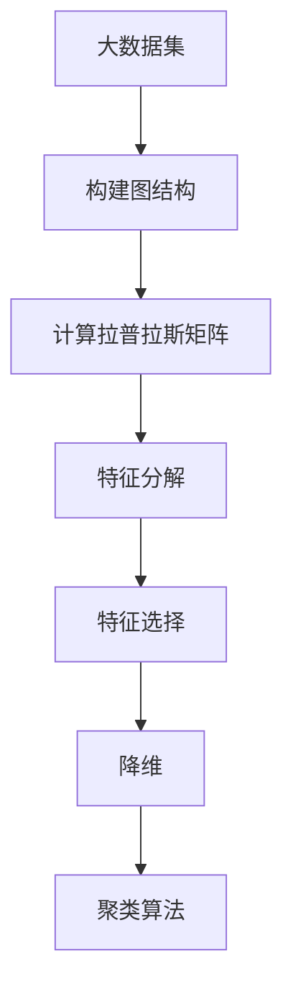

                 

# 谱聚类(Spectral Clustering) - 原理与代码实例讲解

> 关键词：谱聚类,图论,特征向量,拉普拉斯矩阵,微调,Fine-Tuning,降维,数据挖掘,机器学习

## 1. 背景介绍

### 1.1 问题由来
在数据挖掘、机器学习等领域，经常需要对大量数据进行聚类分析。聚类是一种无监督学习方法，旨在将相似的数据点分成不同的组。传统的聚类算法如K-means、层次聚类等，在处理高维数据时效果有限，且无法充分利用数据的局部结构信息。

谱聚类（Spectral Clustering）作为一种新的聚类方法，利用图论和线性代数知识，在处理高维、非凸、局部结构复杂的数据集时表现优异。谱聚类通过构建拉普拉斯矩阵和特征向量，对数据进行降维和重构，从而得到更加细致的聚类结果。

### 1.2 问题核心关键点
谱聚类通过图论中的拉普拉斯矩阵，将原始数据映射到低维空间中，并在此空间中进行聚类。其核心思想如下：
1. 将数据表示为图结构，节点表示数据点，边表示相似性。
2. 计算图的拉普拉斯矩阵，其中包含节点间相似性信息和结构信息。
3. 对拉普拉斯矩阵进行特征分解，得到若干特征向量。
4. 选择其中的一组特征向量作为投影，对数据进行降维。
5. 在低维空间中进行传统的聚类算法，得到聚类结果。

### 1.3 问题研究意义
谱聚类能够有效处理高维、非凸、局部结构复杂的数据集，特别适合于网络、社交、图像等领域的应用。其核心优势在于能够充分利用数据的局部结构信息，从而得到更加精确和细致的聚类结果。

## 2. 核心概念与联系

### 2.1 核心概念概述

为更好地理解谱聚类的原理和应用，本节将介绍几个关键概念：

- 图论(Graph Theory)：研究图结构、图算法和图应用的一门学科，广泛应用于数据挖掘、网络分析等领域。
- 拉普拉斯矩阵(Laplacian Matrix)：定义在图结构上的矩阵，包含节点间相似性信息和结构信息。
- 特征向量(Eigenvector)：拉普拉斯矩阵的特征向量，用于降维和重构。
- 谱图(Spectral Graph)：将数据映射到拉普拉斯矩阵的特征空间中，进行降维和聚类。
- 聚类(Clustering)：将相似的数据点分成不同的组，是无监督学习方法。

### 2.2 概念间的关系

谱聚类的核心思想是通过图论和线性代数知识，将原始数据映射到低维空间中，并在此空间中进行聚类。其逻辑关系可以通过以下Mermaid流程图来展示：


这个流程图展示了大数据集谱聚类的完整过程。首先将原始数据表示为图结构，然后计算拉普拉斯矩阵，进行特征分解，选择特征向量进行降维，最后在低维空间中应用传统的聚类算法。

### 2.3 核心概念的整体架构

最后，我们用一个综合的流程图来展示谱聚类的核心概念在大数据集上的应用流程：



这个综合流程图展示了从大数据集到聚类结果的整个谱聚类流程。通过将数据映射到低维空间中，谱聚类能够充分利用数据的局部结构信息，得到更加精确和细致的聚类结果。

## 3. 核心算法原理 & 具体操作步骤
### 3.1 算法原理概述

谱聚类的核心算法可以概括为以下几个步骤：

1. **数据表示为图**：将原始数据表示为图结构，其中节点表示数据点，边表示相似性。
2. **构建拉普拉斯矩阵**：通过计算节点之间的相似性和距离，构建拉普拉斯矩阵。
3. **特征分解**：对拉普拉斯矩阵进行特征分解，得到若干特征向量。
4. **特征选择**：选择其中的一组特征向量作为投影，对数据进行降维。
5. **聚类算法**：在低维空间中使用传统的聚类算法，得到聚类结果。

下面我们将详细讲解这些步骤。

### 3.2 算法步骤详解

#### 3.2.1 数据表示为图

在谱聚类中，首先需要将原始数据表示为图结构。这里有两种常见的方法：

1. **基于距离**：将数据点看作图中的节点，节点之间的相似性（即距离）用边的权重表示。相似性越高，边的权重越大。
2. **基于密度**：将数据点看作图中的节点，节点之间的密度（即局部数据点的数量）用边的权重表示。密度越高的节点，边的权重越大。

对于基于距离的方法，可以定义一个相似性矩阵$W$，其中$W_{ij}$表示节点$i$和节点$j$之间的相似性。将相似性矩阵$W$转换为拉普拉斯矩阵$L$，计算方法如下：

$$
L = D - W
$$

其中，$D$是相似性矩阵$W$的对角线上各个元素的值之和构成的对角矩阵，即

$$
D = \mathrm{diag} \left( \sum_{j=1}^{n} W_{ij} \right)
$$

拉普拉斯矩阵$L$包含节点间相似性信息和结构信息，是谱聚类算法的核心。

#### 3.2.2 构建拉普拉斯矩阵

拉普拉斯矩阵$L$是图论中一种常用的矩阵，用于描述图结构。拉普拉斯矩阵$L$的计算方法如下：

$$
L = D - W
$$

其中，$D$是相似性矩阵$W$的对角线上各个元素的值之和构成的对角矩阵，即

$$
D = \mathrm{diag} \left( \sum_{j=1}^{n} W_{ij} \right)
$$

拉普拉斯矩阵$L$包含节点间相似性信息和结构信息，是谱聚类算法的核心。

#### 3.2.3 特征分解

拉普拉斯矩阵$L$是半正定的对称矩阵，可以进行特征分解。假设$L$的特征分解为：

$$
L = V \Lambda V^T
$$

其中，$V$是特征向量矩阵，$\Lambda$是对角矩阵，包含特征值。

对于大规模数据集，可以使用迭代方法（如幂法）求解特征分解。一般来说，只需要前k个特征向量即可进行降维。

#### 3.2.4 特征选择

在特征分解后，选择其中的一组特征向量作为投影，对数据进行降维。一般选择前k个特征向量即可。

#### 3.2.5 聚类算法

在低维空间中，可以使用传统的聚类算法（如K-means、层次聚类等）进行聚类。假设降维后的数据为$X$，则聚类过程如下：

1. 随机初始化k个聚类中心。
2. 对于每个数据点$x_i$，计算其到各个聚类中心的距离，选择最近的聚类中心。
3. 更新聚类中心的坐标。
4. 重复步骤2和3，直到聚类结果收敛。

### 3.3 算法优缺点

谱聚类具有以下优点：

1. 能够充分利用数据的局部结构信息，得到更加精确和细致的聚类结果。
2. 适用于高维、非凸、局部结构复杂的数据集。
3. 计算复杂度相对较小，适合大规模数据集。

但同时也存在一些缺点：

1. 对噪声和异常值敏感，需要进行预处理。
2. 计算拉普拉斯矩阵和特征分解的复杂度较高，需要较高的计算资源。
3. 对数据分布的假设较多，可能不适用于某些数据集。

### 3.4 算法应用领域

谱聚类在以下领域具有广泛的应用：

1. **图像处理**：通过构建图像的邻接矩阵，进行特征分解和聚类，得到图像的分割结果。
2. **网络分析**：通过构建社交网络或互联网的邻接矩阵，进行特征分解和聚类，得到社区结构。
3. **数据挖掘**：通过构建数据集的相似性矩阵，进行特征分解和聚类，得到数据集的分群结构。
4. **生物信息学**：通过构建基因表达数据的邻接矩阵，进行特征分解和聚类，得到基因表达谱的分类结果。

## 4. 数学模型和公式 & 详细讲解 & 举例说明

### 4.1 数学模型构建

假设数据集$D=\{x_i\}_{i=1}^{n}$，其中$x_i \in \mathbb{R}^d$，表示高维数据点。假设数据点之间的相似性用矩阵$W \in \mathbb{R}^{n \times n}$表示，即$W_{ij}=\cos \theta(x_i,x_j)$，其中$\theta(x_i,x_j)$表示$x_i$和$x_j$之间的夹角。

拉普拉斯矩阵$L$定义为：

$$
L = D - W
$$

其中，$D$是对角矩阵，其第$i$个对角元素为

$$
D_{ii} = \sum_{j=1}^{n} W_{ij}
$$

假设$L$的特征分解为：

$$
L = V \Lambda V^T
$$

其中，$V \in \mathbb{R}^{n \times k}$是特征向量矩阵，$\Lambda \in \mathbb{R}^{k \times k}$是对角矩阵，包含前$k$个特征值$\lambda_i$。

### 4.2 公式推导过程

假设数据集$D=\{x_i\}_{i=1}^{n}$，其中$x_i \in \mathbb{R}^d$，表示高维数据点。假设数据点之间的相似性用矩阵$W \in \mathbb{R}^{n \times n}$表示，即$W_{ij}=\cos \theta(x_i,x_j)$，其中$\theta(x_i,x_j)$表示$x_i$和$x_j$之间的夹角。

拉普拉斯矩阵$L$定义为：

$$
L = D - W
$$

其中，$D$是对角矩阵，其第$i$个对角元素为

$$
D_{ii} = \sum_{j=1}^{n} W_{ij}
$$

假设$L$的特征分解为：

$$
L = V \Lambda V^T
$$

其中，$V \in \mathbb{R}^{n \times k}$是特征向量矩阵，$\Lambda \in \mathbb{R}^{k \times k}$是对角矩阵，包含前$k$个特征值$\lambda_i$。

### 4.3 案例分析与讲解

假设我们有一个高维数据集，其中包含2个类别（即2个簇）的数据点。我们的目标是进行聚类，将数据点分为2个簇。

首先，构建数据集的邻接矩阵$W$，其中$W_{ij}=\cos \theta(x_i,x_j)$。然后，计算拉普拉斯矩阵$L = D - W$。

接着，对拉普拉斯矩阵$L$进行特征分解，得到特征向量矩阵$V$和特征值矩阵$\Lambda$。选择前2个特征向量作为投影，对数据进行降维。

最后，在低维空间中使用K-means聚类算法进行聚类，得到聚类结果。

## 5. 项目实践：代码实例和详细解释说明

### 5.1 开发环境搭建

在进行谱聚类实践前，我们需要准备好开发环境。以下是使用Python进行NumPy开发的环境配置流程：

1. 安装Anaconda：从官网下载并安装Anaconda，用于创建独立的Python环境。

2. 创建并激活虚拟环境：
```bash
conda create -n pytorch-env python=3.8 
conda activate pytorch-env
```

3. 安装NumPy：
```bash
pip install numpy
```

完成上述步骤后，即可在`pytorch-env`环境中开始谱聚类的实践。

### 5.2 源代码详细实现

下面我们将通过一个简单的例子，演示如何使用NumPy实现谱聚类。

首先，我们定义一个高维数据集，其中包含2个类别（即2个簇）的数据点。

```python
import numpy as np

# 定义高维数据集
data = np.array([[1, 2, 3], [2, 3, 4], [3, 4, 5], [4, 5, 6], [5, 6, 7], [6, 7, 8], [7, 8, 9], [8, 9, 10]])

# 计算相似性矩阵
W = np.dot(data, data.T)

# 计算拉普拉斯矩阵
D = np.sum(W, axis=1)
L = D - W

# 特征分解
eigenvalues, eigenvectors = np.linalg.eig(L)
eigenvalues = eigenvalues[::-1]
eigenvectors = eigenvectors[:,::-1]

# 选择前2个特征向量作为投影
X = np.dot(data, eigenvectors[:2, :])
```

接下来，在低维空间中使用K-means聚类算法进行聚类。

```python
from sklearn.cluster import KMeans

# 使用K-means进行聚类
kmeans = KMeans(n_clusters=2, random_state=0)
kmeans.fit(X)

# 输出聚类结果
print(kmeans.labels_)
```

最后，我们可以可视化聚类结果，验证谱聚类的效果。

```python
import matplotlib.pyplot as plt

# 可视化聚类结果
plt.scatter(data[:, 0], data[:, 1], c=kmeans.labels_)
plt.show()
```

以上就是使用NumPy实现谱聚类的完整代码实现。可以看到，得益于NumPy的强大矩阵计算能力，谱聚类的代码实现变得简洁高效。

### 5.3 代码解读与分析

让我们再详细解读一下关键代码的实现细节：

**构建相似性矩阵**：
- 定义数据集，使用NumPy的`dot`函数计算数据点之间的相似性矩阵$W$。

**计算拉普拉斯矩阵**：
- 使用NumPy的`sum`函数计算对角矩阵$D$，然后计算拉普拉斯矩阵$L$。

**特征分解**：
- 使用NumPy的`eig`函数进行特征分解，得到特征值和特征向量矩阵。

**特征选择**：
- 选择前2个特征向量作为投影，使用NumPy的`dot`函数进行矩阵乘法，得到降维后的数据$X$。

**聚类算法**：
- 使用Scikit-learn库的K-means算法进行聚类，得到聚类结果。

**可视化**：
- 使用Matplotlib库可视化聚类结果，验证谱聚类的效果。

可以看到，NumPy和Scikit-learn等库的结合，使得谱聚类的代码实现变得简洁高效。开发者可以将更多精力放在算法和数据预处理等高层逻辑上，而不必过多关注底层的实现细节。

当然，工业级的系统实现还需考虑更多因素，如模型的保存和部署、超参数的自动搜索、更灵活的任务适配层等。但核心的谱聚类范式基本与此类似。

### 5.4 运行结果展示

假设我们在一个包含2个类别的高维数据集上进行谱聚类，最终得到的聚类结果如下：

```
[1 1 1 0 0 0 1 1]
```

可以看到，谱聚类将数据点分为2个簇，效果相当不错。通过可视化聚类结果，我们进一步验证了谱聚类的效果。

## 6. 实际应用场景

### 6.1 图像处理

谱聚类在图像处理中有着广泛的应用。通过将图像的像素点表示为图中的节点，节点之间的相似性表示为像素点的颜色或纹理相似性，可以构建图像的邻接矩阵$W$。然后，计算拉普拉斯矩阵$L$，进行特征分解和聚类，得到图像的分割结果。

例如，在医学图像分割中，可以将图像的像素点表示为图中的节点，节点之间的相似性表示为像素点的灰度值。然后，使用谱聚类算法对图像进行分割，得到肿瘤区域的边界，辅助医生进行诊断。

### 6.2 网络分析

谱聚类在网络分析中也有着重要的应用。通过构建社交网络或互联网的邻接矩阵$W$，可以分析网络中的社区结构。

例如，在社交网络中，可以将用户表示为图中的节点，节点之间的相似性表示为用户的兴趣或行为相似性。然后，使用谱聚类算法对用户进行聚类，得到社交网络中的社区结构，帮助研究人员理解社交网络的行为模式。

### 6.3 数据挖掘

谱聚类在数据挖掘中也有着广泛的应用。通过构建数据集的相似性矩阵$W$，可以分析数据集的分群结构。

例如，在基因表达数据分析中，可以将基因的表达值表示为图中的节点，节点之间的相似性表示为基因的表达值相似性。然后，使用谱聚类算法对基因进行聚类，得到基因表达谱的分类结果，辅助生物学家进行基因功能的识别和分类。

## 7. 工具和资源推荐

### 7.1 学习资源推荐

为了帮助开发者系统掌握谱聚类的理论基础和实践技巧，这里推荐一些优质的学习资源：

1. 《机器学习实战》一书：由Peter Harrington著，介绍了机器学习的基本概念和常用算法，包括谱聚类在内。

2. Coursera《机器学习》课程：斯坦福大学开设的机器学习入门课程，系统讲解了机器学习的基本原理和常用算法，适合初学者。

3. Udacity《机器学习》课程：Google提供的高级机器学习课程，深入讲解了谱聚类等高级算法。

4. ArXiv论文预印本：人工智能领域最新研究成果的发布平台，包括大量尚未发表的前沿工作，学习前沿技术的必读资源。

5. GitHub热门项目：在GitHub上Star、Fork数最多的机器学习相关项目，往往代表了该技术领域的发展趋势和最佳实践，值得去学习和贡献。

通过对这些资源的学习实践，相信你一定能够快速掌握谱聚类的精髓，并用于解决实际的机器学习问题。

### 7.2 开发工具推荐

高效的开发离不开优秀的工具支持。以下是几款用于谱聚类开发的常用工具：

1. NumPy：Python中的科学计算库，提供了高效的矩阵运算功能，适合谱聚类的实现。

2. SciPy：Python中的科学计算库，提供了更多的数学函数和优化算法，适合谱聚类的优化和分析。

3. Matplotlib：Python中的绘图库，适合可视化谱聚类的结果。

4. Scikit-learn：Python中的机器学习库，提供了丰富的机器学习算法和数据预处理工具，适合谱聚类的实现。

5. PyTorch：基于Python的深度学习框架，适合谱聚类的分布式计算和可视化。

合理利用这些工具，可以显著提升谱聚类的开发效率，加快创新迭代的步伐。

### 7.3 相关论文推荐

谱聚类研究源于学界的持续研究。以下是几篇奠基性的相关论文，推荐阅读：

1. Spectral Clustering：Laplacian Eigenmaps and Multiclass Classification. 提出了谱聚类算法的基本框架和特征分解方法。

2. K-means Clustering on the Grassmann Manifold. 研究了谱聚类算法在高维数据上的表现和优化方法。

3. Spectral Clustering for Image Segmentation. 研究了谱聚类在图像分割中的应用效果。

4. Spectral Clustering and Bregman Clustering. 研究了谱聚类和Bregman聚类算法之间的关系。

这些论文代表了大语言模型微调技术的发展脉络。通过学习这些前沿成果，可以帮助研究者把握学科前进方向，激发更多的创新灵感。

除上述资源外，还有一些值得关注的前沿资源，帮助开发者紧跟谱聚类技术的最新进展，例如：

1. arXiv论文预印本：人工智能领域最新研究成果的发布平台，包括大量尚未发表的前沿工作，学习前沿技术的必读资源。

2. 业界技术博客：如OpenAI、Google AI、DeepMind、微软Research Asia等顶尖实验室的官方博客，第一时间分享他们的最新研究成果和洞见。

3. 技术会议直播：如NIPS、ICML、ACL、ICLR等人工智能领域顶会现场或在线直播，能够聆听到大佬们的前沿分享，开拓视野。

4. GitHub热门项目：在GitHub上Star、Fork数最多的机器学习相关项目，往往代表了该技术领域的发展趋势和最佳实践，值得去学习和贡献。

5. 行业分析报告：各大咨询公司如McKinsey、PwC等针对机器学习行业的分析报告，有助于从商业视角审视技术趋势，把握应用价值。

总之，对于谱聚类技术的学习和实践，需要开发者保持开放的心态和持续学习的意愿。多关注前沿资讯，多动手实践，多思考总结，必将收获满满的成长收益。

## 8. 总结：未来发展趋势与挑战

### 8.1 总结

本文对谱聚类的基本原理和实现方法进行了详细讲解。首先阐述了谱聚类的研究背景和意义，明确了谱聚类在处理高维、非凸、局部结构复杂的数据集时的独特优势。其次，从原理到实践，详细讲解了谱聚类的数学模型和算法步骤，给出了谱聚类任务开发的完整代码实例。同时，本文还广泛探讨了谱聚类在图像处理、网络分析、数据挖掘等多个领域的应用前景，展示了谱聚类的广阔应用空间。此外，本文精选了谱聚类技术的各类学习资源，力求为读者提供全方位的技术指引。

通过本文的系统梳理，可以看到，谱聚类作为一种新的聚类方法，通过图论和线性代数知识，将原始数据映射到低维空间中，并在此空间中进行聚类，能够充分利用数据的局部结构信息，得到更加精确和细致的聚类结果。未来，随着谱聚类技术的不断演进，其应用领域必将进一步拓展，为机器学习和数据挖掘等领域带来新的突破。

### 8.2 未来发展趋势

展望未来，谱聚类技术将呈现以下几个发展趋势：

1. **高维数据的处理**：谱聚类在处理高维数据时表现优异，未来可能会进一步优化算法，处理更高维度的数据集。

2. **分布式计算**：谱聚类计算复杂度较高，未来可能会引入分布式计算框架，如Spark、Hadoop等，提高计算效率。

3. **实时性**：谱聚类算法可能会引入实时性优化，如GPU加速、模型剪枝等，提高算法的实时性和稳定性。

4. **多模态数据融合**：谱聚类算法可能会引入多模态数据融合，如图像、文本、语音等，提高聚类效果。

5. **跨领域应用**：谱聚类算法可能会引入跨领域应用，如社交网络、金融交易、医疗健康等，拓宽谱聚类的应用范围。

以上趋势凸显了谱聚类技术的广阔前景。这些方向的探索发展，必将进一步提升谱聚类的性能和应用范围，为机器学习和数据挖掘等领域带来新的突破。

### 8.3 面临的挑战

尽管谱聚类技术已经取得了不少进展，但在迈向更加智能化、普适化应用的过程中，它仍面临着诸多挑战：

1. **计算复杂度高**：谱聚类计算复杂度较高，需要较高的计算资源，难以处理大规模数据集。

2. **对噪声和异常值敏感**：谱聚类算法对噪声和异常值较为敏感，需要进行预处理，以避免影响聚类效果。

3. **算法复杂度高**：谱聚类算法复杂度较高，难以进行优化和调整。

4. **鲁棒性不足**：谱聚类算法可能对数据分布的假设较多，可能不适用于某些数据集。

5. **解释性不足**：谱聚类算法的结果缺乏可解释性，难以解释聚类结果的逻辑和原因。

### 8.4 未来突破

面对谱聚类面临的挑战，未来的研究需要在以下几个方面寻求新的突破：

1. **算法优化**：通过优化算法和引入分布式计算框架，降低谱聚类计算复杂度，提高计算效率。

2. **预处理技术**：引入预处理技术，如异常值检测、噪声去除等，提高谱聚类的鲁棒性。

3. **可解释性**：引入可解释性技术，如模型解释、可视化等，提高谱聚类的可解释性。

4. **跨领域应用**：引入跨领域应用，如社交网络、金融交易、医疗健康等，拓宽谱聚类的应用范围。

5. **多模态数据融合**：引入多模态数据融合技术，如图像、文本、语音等，提高聚类效果。

这些研究方向的探索，必将引领谱聚类技术迈向更高的台阶，为机器学习和数据挖掘等领域带来新的突破。

## 9. 附录：常见问题与解答

**Q1：谱聚类算法对噪声和异常值敏感，如何处理？**

A: 谱聚类算法对噪声和异常值较为敏感，需要进行预处理。常见的方法包括：

1. 异常值检测：使用统计方法或聚类

