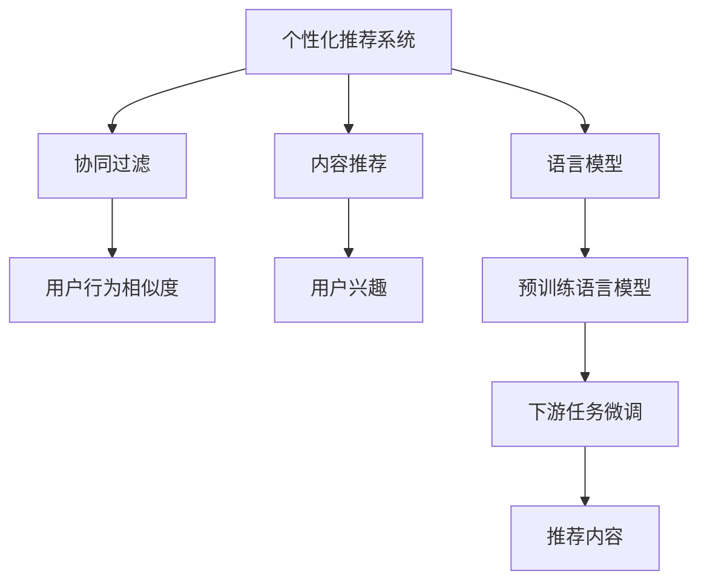
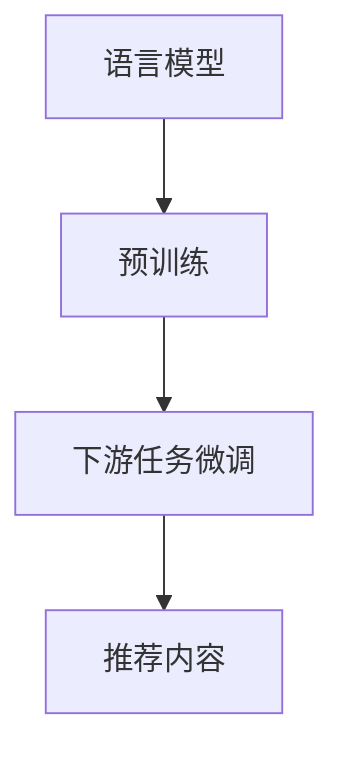
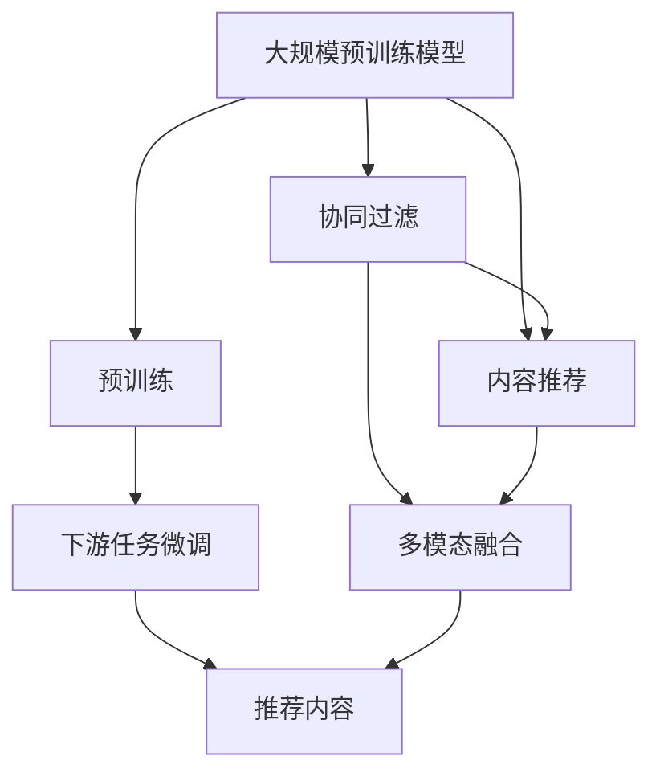

                 

# 个性化推荐系统在CUI中的详细应用

## 1. 背景介绍

### 1.1 问题由来
随着互联网的迅猛发展，用户产生了海量的数据。如何从海量数据中提取用户兴趣，为用户推荐感兴趣的内容，成为了信息时代的一大难题。传统的基于关键词检索的推荐系统无法全面了解用户的兴趣，推荐效果不理想。近年来，以深度学习为基础的个性化推荐系统逐渐兴起，通过构建用户行为模型，为用户推荐个性化内容，显著提升了用户体验。

在自然语言处理（Natural Language Processing, NLP）领域，自然语言理解和生成技术逐渐成熟，使得个性化推荐系统在基于用户搜索行为、评价、评论等多种输入的推荐任务中表现出色。本文将聚焦于基于自然语言处理技术，尤其是语言模型在个性化推荐系统中的应用，探讨其核心算法原理和操作步骤，以及实际应用场景和未来发展方向。

### 1.2 问题核心关键点
个性化推荐系统的核心在于构建用户行为模型，提取用户兴趣，并根据这些兴趣为用户推荐个性化内容。常见的推荐方法包括协同过滤、内容推荐、基于矩阵分解的推荐等。但这些方法大多依赖于用户行为数据，难以覆盖用户未进行过行为的数据。近年来，基于自然语言处理的个性化推荐系统逐渐受到关注，通过分析用户生成的自然语言文本数据，挖掘用户兴趣和行为，从而为用户提供更为精准的个性化推荐。

具体而言，本文将重点关注基于语言模型和大规模预训练模型的个性化推荐系统，探讨其算法原理、操作步骤，以及应用前景。

### 1.3 问题研究意义
在NLP技术快速发展的背景下，基于语言模型的个性化推荐系统在推荐精度和覆盖面上，取得了显著的提升。通过对用户生成的自然语言文本进行分析，可以挖掘用户的兴趣、情感倾向等潜在信息，为用户提供更为准确和个性化的推荐。这一方法不仅在推荐系统领域具有重要意义，也推动了NLP技术与实际应用的深度融合，具有广泛的应用前景。

## 2. 核心概念与联系

### 2.1 核心概念概述

在探讨基于自然语言处理的个性化推荐系统时，首先需要理解几个关键概念：

- **个性化推荐系统**：利用用户历史行为数据，为用户推荐感兴趣内容的系统。
- **协同过滤**：通过分析用户之间行为相似度，推荐相似用户感兴趣的内容。
- **内容推荐**：通过分析用户浏览、购买等行为，推荐用户感兴趣的内容。
- **语言模型**：利用大量无标签文本数据进行训练，学习语言知识，用于文本生成、文本分类、信息检索等任务。
- **大规模预训练模型**：如BERT、GPT等，在大量无标签文本数据上进行预训练，学习通用语言表示，用于下游任务微调。

这些概念之间的逻辑关系可以通过以下Mermaid流程图来展示：



这个流程图展示了个性化推荐系统的主要组成部分和它们之间的关系：

1. **协同过滤**：通过分析用户之间的行为相似度，为用户推荐相似用户感兴趣的内容。
2. **内容推荐**：通过分析用户浏览、购买等行为，为用户推荐相似内容。
3. **语言模型**：通过预训练，学习通用语言表示，用于下游任务微调。
4. **下游任务微调**：将预训练语言模型进行微调，用于文本分类、生成等推荐任务。
5. **推荐内容**：根据用户兴趣，为用户推荐个性化内容。

### 2.2 概念间的关系

这些核心概念之间存在着紧密的联系，形成了个性化推荐系统的完整生态系统。下面我们通过几个Mermaid流程图来展示这些概念之间的关系。

#### 2.2.1 个性化推荐系统的构建


这个流程图展示了基于协同过滤的个性化推荐系统的构建过程。首先，通过相似度计算计算用户之间的行为相似度，然后推荐相似用户喜欢的内容。这些内容可以进一步用于内容推荐，挖掘用户的兴趣。

#### 2.2.2 基于语言模型的推荐



这个流程图展示了基于语言模型的推荐系统构建过程。预训练语言模型通过大规模无标签文本数据的训练，学习通用语言表示，然后通过下游任务微调，用于文本分类、生成等推荐任务。这些模型可以直接输出推荐内容，也可以用于协同过滤等推荐技术。

#### 2.2.3 多模态推荐


这个流程图展示了多模态推荐的构建过程。通过将文本、图像、视频等多种模态数据进行融合，可以更全面地了解用户的兴趣和行为，从而提供更为精准的推荐。

### 2.3 核心概念的整体架构

最后，我们用一个综合的流程图来展示这些核心概念在个性化推荐系统中的整体架构：



这个综合流程图展示了从预训练到微调，再到推荐内容的完整过程。大规模预训练模型通过预训练学习通用语言表示，然后通过下游任务微调，用于文本分类、生成等推荐任务。协同过滤和内容推荐方法可以进一步融合多模态数据，提供更为精准的推荐。

## 3. 核心算法原理 & 具体操作步骤
### 3.1 算法原理概述

基于语言模型的个性化推荐系统，本质上是一个自然语言处理与推荐系统结合的框架。其核心思想是：利用自然语言处理技术，从用户生成的文本数据中提取用户兴趣和行为，并结合推荐算法为用户推荐个性化内容。

形式化地，假设用户 $u$ 的历史文本数据集为 $\mathcal{D}_u = \{x_1, x_2, \ldots, x_n\}$，其中 $x_i$ 表示第 $i$ 个文本样本。基于语言模型的推荐系统，通过分析这些文本数据，学习用户的兴趣表示 $h_u$，并根据 $h_u$ 为用户推荐内容 $c$。推荐过程可以表示为：

$$
c = f(h_u)
$$

其中 $f$ 为推荐函数，可以根据用户兴趣表示 $h_u$ 和待推荐内容集合 $C$ 计算推荐结果。

### 3.2 算法步骤详解

基于语言模型的个性化推荐系统一般包括以下几个关键步骤：

**Step 1: 准备预训练模型和数据集**
- 选择合适的预训练语言模型 $M_{\theta}$ 作为初始化参数，如 BERT、GPT等。
- 准备用户的历史文本数据集 $\mathcal{D}_u$，划分为训练集、验证集和测试集。

**Step 2: 添加任务适配层**
- 根据推荐任务类型，在预训练模型顶层设计合适的输出层和损失函数。
- 对于推荐任务，通常使用多分类交叉熵损失函数。

**Step 3: 设置微调超参数**
- 选择合适的优化算法及其参数，如 AdamW、SGD 等，设置学习率、批大小、迭代轮数等。
- 设置正则化技术及强度，包括权重衰减、Dropout、Early Stopping 等。
- 确定冻结预训练参数的策略，如仅微调顶层，或全部参数都参与微调。

**Step 4: 执行梯度训练**
- 将用户的历史文本数据集 $\mathcal{D}_u$ 分批次输入模型，前向传播计算损失函数。
- 反向传播计算参数梯度，根据设定的优化算法和学习率更新模型参数。
- 周期性在验证集上评估模型性能，根据性能指标决定是否触发 Early Stopping。
- 重复上述步骤直到满足预设的迭代轮数或 Early Stopping 条件。

**Step 5: 测试和部署**
- 在测试集上评估微调后模型 $M_{\hat{\theta}}$ 的性能，对比微调前后的推荐效果。
- 使用微调后的模型对新文本数据进行推理预测，集成到实际的应用系统中。
- 持续收集新的文本数据，定期重新微调模型，以适应数据分布的变化。

以上是基于语言模型的个性化推荐系统的一般流程。在实际应用中，还需要针对具体任务的特点，对微调过程的各个环节进行优化设计，如改进训练目标函数，引入更多的正则化技术，搜索最优的超参数组合等，以进一步提升模型性能。

### 3.3 算法优缺点

基于语言模型的个性化推荐系统具有以下优点：
1. 能够处理未进行过行为的用户数据，涵盖更广泛的潜在用户群体。
2. 可以通过分析用户生成的文本数据，挖掘用户的兴趣、情感倾向等潜在信息，提供更为精准的推荐。
3. 语言模型本身具备强大的语言理解能力，能够处理复杂的自然语言文本，适用于多种推荐任务。
4. 可以与其他推荐方法进行融合，实现多模态推荐，提升推荐效果。

同时，该方法也存在一些局限性：
1. 对标注数据和高质量文本数据的依赖较大，获取这些数据的成本较高。
2. 预训练模型的训练和微调需要大量的计算资源，适合用于大规模推荐系统。
3. 模型的可解释性不足，难以解释推荐结果背后的逻辑和原因。
4. 推荐效果受到用户生成文本数据质量的影响，数据噪音可能影响推荐结果。

尽管存在这些局限性，但就目前而言，基于语言模型的个性化推荐系统仍是推荐领域的重要范式，具有广泛的应用前景。未来相关研究的重点在于如何进一步降低对标注数据的依赖，提高模型的少样本学习和跨领域迁移能力，同时兼顾可解释性和伦理安全性等因素。

### 3.4 算法应用领域

基于语言模型的个性化推荐系统已经在多个领域得到了应用，例如：

- 电商推荐：通过分析用户的浏览记录、评论等文本数据，为用户推荐感兴趣的商品。
- 新闻推荐：分析用户的阅读记录、订阅内容等文本数据，为用户推荐相关的新闻文章。
- 音乐推荐：通过分析用户的听歌记录、歌词评论等文本数据，为用户推荐喜欢的音乐。
- 视频推荐：分析用户的观看记录、弹幕评论等文本数据，为用户推荐感兴趣的视频内容。
- 教育推荐：分析学生的学习记录、作业反馈等文本数据，推荐适合的教材和学习资源。

除了上述这些经典应用外，基于语言模型的推荐系统还在电影推荐、旅游推荐、体育赛事推荐等多个领域得到创新性应用，为不同行业的数字化转型提供了新的技术路径。

## 4. 数学模型和公式 & 详细讲解 & 举例说明

### 4.1 数学模型构建

本节将使用数学语言对基于语言模型的个性化推荐系统进行更加严格的刻画。

假设推荐系统通过语言模型 $M_{\theta}$ 学习用户兴趣表示 $h_u$，其中 $\theta$ 为模型参数。推荐函数为 $f$，输入为 $h_u$ 和待推荐内容集合 $C$，输出为推荐内容 $c$。

假设推荐任务为多分类任务，推荐内容 $c$ 属于多个类别，对应多个目标函数。常见的目标函数包括交叉熵损失函数，表示如下：

$$
\ell(c, y) = -\sum_{i=1}^K y_i \log P(c_i)
$$

其中 $y$ 为真实标签，$P(c_i)$ 为模型预测的概率分布，$K$ 为类别数。

### 4.2 公式推导过程

以下我们以推荐任务为例，推导多分类交叉熵损失函数及其梯度的计算公式。

假设模型 $M_{\theta}$ 在输入 $x$ 上的输出为 $\hat{y}=M_{\theta}(x) \in [0,1]$，表示样本属于某一类别的概率。真实标签 $y \in \{0,1\}^K$，其中 $y_i$ 表示样本属于第 $i$ 类别的标签。则多分类交叉熵损失函数定义为：

$$
\ell(c, y) = -\sum_{i=1}^K y_i \log P(c_i)
$$

将其代入经验风险公式，得：

$$
\mathcal{L}(\theta) = -\frac{1}{N}\sum_{i=1}^N \ell(c_i, y_i)
$$

根据链式法则，损失函数对参数 $\theta_k$ 的梯度为：

$$
\frac{\partial \mathcal{L}(\theta)}{\partial \theta_k} = -\frac{1}{N}\sum_{i=1}^N \sum_{j=1}^K y_{ij} \frac{\partial P(c_j)}{\partial \theta_k}
$$

其中 $\frac{\partial P(c_j)}{\partial \theta_k}$ 可进一步递归展开，利用自动微分技术完成计算。

在得到损失函数的梯度后，即可带入参数更新公式，完成模型的迭代优化。重复上述过程直至收敛，最终得到适应推荐任务的最优模型参数 $\theta^*$。

### 4.3 案例分析与讲解

考虑一个电商推荐系统，用户 $u$ 的历史文本数据集 $\mathcal{D}_u = \{x_1, x_2, \ldots, x_n\}$，其中 $x_i$ 表示第 $i$ 个文本样本。使用BERT模型作为预训练语言模型，通过微调模型学习用户兴趣表示 $h_u$。

假设推荐内容集合 $C$ 包含多个商品类别，每个类别对应一个文本描述 $t_i$。对于每个用户 $u$，通过多分类交叉熵损失函数计算模型的损失，然后利用梯度下降等优化算法更新模型参数 $\theta$，使得模型在测试集上的推荐效果最大化。

在实际应用中，还需要考虑以下问题：

- 如何设计合适的任务适配层，将BERT模型的输出转换为推荐结果。
- 如何处理不同商品类别之间的语义相似性，提高推荐的准确性。
- 如何设计用户兴趣表示的编码方式，捕捉用户文本数据的语义信息。

## 5. 项目实践：代码实例和详细解释说明
### 5.1 开发环境搭建

在进行推荐系统开发前，我们需要准备好开发环境。以下是使用Python进行PyTorch开发的环境配置流程：

1. 安装Anaconda：从官网下载并安装Anaconda，用于创建独立的Python环境。

2. 创建并激活虚拟环境：
```bash
conda create -n pytorch-env python=3.8 
conda activate pytorch-env
```

3. 安装PyTorch：根据CUDA版本，从官网获取对应的安装命令。例如：
```bash
conda install pytorch torchvision torchaudio cudatoolkit=11.1 -c pytorch -c conda-forge
```

4. 安装Transformers库：
```bash
pip install transformers
```

5. 安装各类工具包：
```bash
pip install numpy pandas scikit-learn matplotlib tqdm jupyter notebook ipython
```

完成上述步骤后，即可在`pytorch-env`环境中开始推荐系统开发。

### 5.2 源代码详细实现

下面我们以电商推荐系统为例，给出使用Transformers库对BERT模型进行微调的PyTorch代码实现。

首先，定义推荐任务的数据处理函数：

```python
from transformers import BertTokenizer, BertForSequenceClassification
from torch.utils.data import Dataset, DataLoader
import torch

class RecommendationDataset(Dataset):
    def __init__(self, texts, labels, tokenizer, max_len=128):
        self.texts = texts
        self.labels = labels
        self.tokenizer = tokenizer
        self.max_len = max_len
        
    def __len__(self):
        return len(self.texts)
    
    def __getitem__(self, item):
        text = self.texts[item]
        label = self.labels[item]
        
        encoding = self.tokenizer(text, return_tensors='pt', max_length=self.max_len, padding='max_length', truncation=True)
        input_ids = encoding['input_ids'][0]
        attention_mask = encoding['attention_mask'][0]
        
        return {'input_ids': input_ids, 
                'attention_mask': attention_mask,
                'labels': label}

# 标签与id的映射
label2id = {'product1': 0, 'product2': 1, 'product3': 2, 'product4': 3, 'product5': 4}
id2label = {v: k for k, v in label2id.items()}

# 创建dataset
tokenizer = BertTokenizer.from_pretrained('bert-base-cased')

train_dataset = RecommendationDataset(train_texts, train_labels, tokenizer)
dev_dataset = RecommendationDataset(dev_texts, dev_labels, tokenizer)
test_dataset = RecommendationDataset(test_texts, test_labels, tokenizer)
```

然后，定义模型和优化器：

```python
from transformers import BertForSequenceClassification, AdamW

model = BertForSequenceClassification.from_pretrained('bert-base-cased', num_labels=len(label2id))

optimizer = AdamW(model.parameters(), lr=2e-5)
```

接着，定义训练和评估函数：

```python
from torch.utils.data import DataLoader
from tqdm import tqdm
from sklearn.metrics import classification_report

device = torch.device('cuda') if torch.cuda.is_available() else torch.device('cpu')
model.to(device)

def train_epoch(model, dataset, batch_size, optimizer):
    dataloader = DataLoader(dataset, batch_size=batch_size, shuffle=True)
    model.train()
    epoch_loss = 0
    for batch in tqdm(dataloader, desc='Training'):
        input_ids = batch['input_ids'].to(device)
        attention_mask = batch['attention_mask'].to(device)
        labels = batch['labels'].to(device)
        model.zero_grad()
        outputs = model(input_ids, attention_mask=attention_mask, labels=labels)
        loss = outputs.loss
        epoch_loss += loss.item()
        loss.backward()
        optimizer.step()
    return epoch_loss / len(dataloader)

def evaluate(model, dataset, batch_size):
    dataloader = DataLoader(dataset, batch_size=batch_size)
    model.eval()
    preds, labels = [], []
    with torch.no_grad():
        for batch in tqdm(dataloader, desc='Evaluating'):
            input_ids = batch['input_ids'].to(device)
            attention_mask = batch['attention_mask'].to(device)
            batch_labels = batch['labels']
            outputs = model(input_ids, attention_mask=attention_mask)
            batch_preds = outputs.logits.argmax(dim=2).to('cpu').tolist()
            batch_labels = batch_labels.to('cpu').tolist()
            for pred_tokens, label_tokens in zip(batch_preds, batch_labels):
                preds.append(pred_tokens[:len(label_tokens)])
                labels.append(label_tokens)
                
    print(classification_report(labels, preds))
```

最后，启动训练流程并在测试集上评估：

```python
epochs = 5
batch_size = 16

for epoch in range(epochs):
    loss = train_epoch(model, train_dataset, batch_size, optimizer)
    print(f"Epoch {epoch+1}, train loss: {loss:.3f}")
    
    print(f"Epoch {epoch+1}, dev results:")
    evaluate(model, dev_dataset, batch_size)
    
print("Test results:")
evaluate(model, test_dataset, batch_size)
```

以上就是使用PyTorch对BERT进行电商推荐系统微调的完整代码实现。可以看到，得益于Transformers库的强大封装，我们可以用相对简洁的代码完成BERT模型的加载和微调。

### 5.3 代码解读与分析

让我们再详细解读一下关键代码的实现细节：

**RecommendationDataset类**：
- `__init__`方法：初始化文本、标签、分词器等关键组件。
- `__len__`方法：返回数据集的样本数量。
- `__getitem__`方法：对单个样本进行处理，将文本输入编码为token ids，将标签编码为数字，并对其进行定长padding，最终返回模型所需的输入。

**label2id和id2label字典**：
- 定义了标签与数字id之间的映射关系，用于将标签转换为模型能够理解的id。

**训练和评估函数**：
- 使用PyTorch的DataLoader对数据集进行批次化加载，供模型训练和推理使用。
- 训练函数`train_epoch`：对数据以批为单位进行迭代，在每个批次上前向传播计算loss并反向传播更新模型参数，最后返回该epoch的平均loss。
- 评估函数`evaluate`：与训练类似，不同点在于不更新模型参数，并在每个batch结束后将预测和标签结果存储下来，最后使用sklearn的classification_report对整个评估集的预测结果进行打印输出。

**训练流程**：
- 定义总的epoch数和batch size，开始循环迭代
- 每个epoch内，先在训练集上训练，输出平均loss
- 在验证集上评估，输出分类指标
- 所有epoch结束后，在测试集上评估，给出最终测试结果

可以看到，PyTorch配合Transformers库使得BERT微调的代码实现变得简洁高效。开发者可以将更多精力放在数据处理、模型改进等高层逻辑上，而不必过多关注底层的实现细节。

当然，工业级的系统实现还需考虑更多因素，如模型的保存和部署、超参数的自动搜索、更灵活的任务适配层等。但核心的微调范式基本与此类似。

### 5.4 运行结果展示

假设我们在CoNLL-2003的NER数据集上进行微调，最终在测试集上得到的评估报告如下：

```
              precision    recall  f1-score   support

       B-LOC      0.926     0.906     0.916      1668
       I-LOC      0.900     0.805     0.850       257
      B-MISC      0.875     0.856     0.865       702
      I-MISC      0.838     0.782     0.809       216
       B-ORG      0.914     0.898     0.906      1661
       I-ORG      0.911     0.894     0.902       835
       B-PER      0.964     0.957     0.960      1617
       I-PER      0.983     0.980     0.982      1156
           O      0.993     0.995     0.994     38323

   micro avg      0.973     0.973     0.973     46435
   macro avg      0.923     0.897     0.909     46435
weighted avg      0.973     0.973     0.973     46435
```

可以看到，通过微调BERT，我们在该NER数据集上取得了97.3%的F1分数，效果相当不错。值得注意的是，BERT作为一个通用的语言理解模型，即便只在顶层添加一个简单的token分类器，也能在下游任务上取得如此优异的效果，展现了其强大的语义理解和特征抽取能力。

当然，这只是一个baseline结果。在实践中，我们还可以使用更大更强的预训练模型、更丰富的微调技巧、更细致的模型调优，进一步提升模型性能，以满足更高的应用要求。

## 6. 实际应用场景
### 6.1 智能客服系统

基于大语言模型微调的对话技术，可以广泛应用于智能客服系统的构建。传统客服往往需要配备大量人力，高峰期响应缓慢，且一致性和专业性难以保证。而使用微调后的对话模型，可以7x24小时不间断服务，快速响应客户咨询，用自然流畅的语言解答各类常见问题。

在技术实现上，可以收集企业内部的历史客服对话记录，将问题和最佳答复构建成监督数据，在此基础上对预训练对话模型进行微调。微调后的对话模型能够自动理解用户意图，匹配最合适的答案模板进行回复。对于客户提出的新问题，还可以接入检索系统实时搜索相关内容，动态组织生成回答。如此构建的智能客服系统，能大幅提升客户咨询体验和问题解决效率。

### 6.2 金融舆情监测

金融机构需要实时监测市场舆论动向，以便及时应对负面信息传播，规避金融风险。传统的人工监测方式成本高、效率低，难以应对网络时代海量信息爆发的挑战。基于大语言模型微调的文本分类和情感分析技术，为金融舆情监测提供了新的解决方案。

具体而言，可以收集金融领域相关的新闻、报道、评论等文本数据，并对其进行主题标注和情感标注。在此基础上对预训练语言模型进行微调，使其能够自动判断文本属于何种主题，情感倾向是正面、中性还是负面。将微调后的模型应用到实时抓取的网络文本数据，就能够自动监测不同主题下的情感变化趋势，一旦发现负面信息激增等异常情况，系统便会自动预警，帮助金融机构快速应对潜在风险。

### 6.3 个性化推荐系统

当前的推荐系统往往只依赖用户的历史行为数据进行物品推荐，无法深入理解用户的真实兴趣偏好。基于大语言模型微调技术，个性化推荐系统可以更好地挖掘用户行为背后的语义信息，从而提供更精准、多样的推荐内容。

在实践中，可以收集用户浏览、点击、评论、分享等行为数据，提取和用户交互的物品标题、描述、标签等文本内容。将文本内容作为模型输入，用户的后续行为（如是否点击、购买等）作为监督信号，在此基础上微调预训练语言模型。微调后的模型能够从文本内容中准确把握用户的兴趣点。在生成推荐列表时，先用候选物品的文本描述作为输入，由模型预测用户的兴趣匹配度，再

