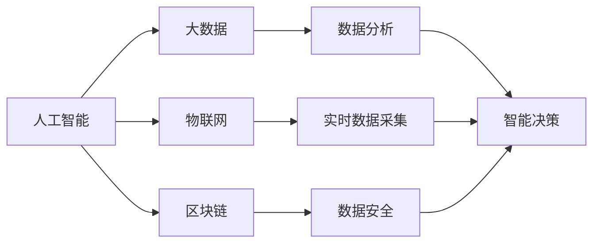

                 

# 中国现代化进程中的新质生产力发展

在21世纪的中国，新一轮的科技革命和产业变革正蓬勃兴起，信息化、数字化、智能化加速渗透到生产、流通、分配、消费等各个环节。在这一进程中，新质生产力要素—以人工智能、大数据、物联网、区块链等为代表的高新技术—正在逐步形成并得以应用。本文将系统探讨新质生产力在新中国现代化进程中的重要性、发展现状及未来趋势，并深入分析其在各行各业中的应用实践与挑战。

## 1. 背景介绍

### 1.1 新质生产力的定义

所谓新质生产力，是指基于现代信息技术与互联网的融合，以人工智能、大数据、物联网、区块链等新兴技术为代表的智能、高效、灵活的现代化生产力。相比于传统的物质生产力，新质生产力以算法驱动、数据驱动、网络驱动为核心，通过信息技术的深度应用，提升生产要素的质量和效率，推动经济发展方式的转变。

### 1.2 新质生产力的起源与演进

新质生产力的形成离不开计算机技术、通信技术、互联网技术的不断进步。上世纪70年代计算机的出现、80年代个人计算机的普及、90年代互联网的兴起，以及21世纪初移动互联网、云计算、物联网的蓬勃发展，为新技术的广泛应用提供了坚实的技术基础。从计算机到互联网，再到移动互联网，再到物联网，技术的演进引领了生产力要素的发展，不断拓展了生产力的边界。

## 2. 核心概念与联系

### 2.1 核心概念概述

新质生产力包含多个核心概念，这些概念之间相互联系、相互支持，共同构成了一个完整的体系。

#### 2.1.1 人工智能 (Artificial Intelligence, AI)

人工智能是指通过计算机模拟人脑的智能行为，实现智能决策、智能控制、智能学习等功能。它包括机器学习、深度学习、自然语言处理、计算机视觉等多个领域。

#### 2.1.2 大数据 (Big Data)

大数据是指通过各种方式收集、处理和分析的海量、高速、多源异构数据。大数据技术包括数据采集、数据存储、数据分析、数据可视化等多个环节。

#### 2.1.3 物联网 (Internet of Things, IoT)

物联网是指通过互联网将各种物体设备连接起来，实现数据的实时采集、传输和分析。物联网技术涵盖传感器技术、无线通信技术、云计算技术等多个方面。

#### 2.1.4 区块链 (Blockchain)

区块链是指通过分布式账本技术，实现数据的去中心化、透明化、安全性。区块链技术主要包括共识算法、密码学、分布式存储等。

这些核心概念通过相互融合、相互促进，构建起新质生产力的完整生态系统。人工智能作为智能大脑，负责数据分析、决策制定；大数据提供数据基础，支撑数据分析、模型训练；物联网提供实时数据采集，实现智能控制、远程监控；区块链保障数据安全、透明可追溯。

### 2.2 核心概念之间的关系

核心概念之间的联系可以通过以下Mermaid流程图来展示：



从图中可以看出，人工智能利用大数据、物联网、区块链技术，进行数据分析、智能决策、数据安全保障，从而形成新质生产力的闭环。

## 3. 核心算法原理 & 具体操作步骤

### 3.1 算法原理概述

新质生产力的发展离不开算法的支持。算法是连接数据和应用的桥梁，通过算法将数据转化为知识和决策。新质生产力的算法包括但不限于：

- 深度学习算法：通过神经网络对数据进行特征提取和模式识别，实现智能决策。
- 优化算法：通过优化算法对模型进行训练，提高模型精度和泛化能力。
- 分布式算法：通过分布式算法对大数据进行高效处理和分析，实现实时数据处理。
- 加密算法：通过加密算法保障数据安全，防止数据泄露和篡改。

### 3.2 算法步骤详解

新质生产力的发展涉及数据采集、数据存储、数据分析、数据应用等多个环节。以下是新质生产力算法的主要步骤：

#### 3.2.1 数据采集

数据采集是新质生产力的起点。通过物联网技术，实现数据的实时采集。采集的数据包括生产设备运行数据、环境数据、用户行为数据等。

#### 3.2.2 数据存储

数据存储是新质生产力的基础。通过分布式存储技术，实现海量数据的存储和管理。常见的分布式存储技术包括Hadoop、Spark等。

#### 3.2.3 数据分析

数据分析是新质生产力的核心。通过人工智能算法，对采集到的数据进行特征提取、模式识别、异常检测等，生成分析结果。常见的分析算法包括机器学习、深度学习、统计分析等。

#### 3.2.4 数据应用

数据应用是新质生产力的最终目标。通过人工智能算法和机器学习算法，将分析结果转化为知识、决策和控制指令，实现智能决策和智能控制。常见的应用场景包括智能制造、智能物流、智能医疗等。

### 3.3 算法优缺点

新质生产力的算法具有以下优点：

- 高效性：通过分布式算法和优化算法，实现海量数据的快速处理和分析，提高生产效率。
- 智能性：通过人工智能算法，实现智能决策、智能控制，提升生产智能化水平。
- 安全性：通过加密算法，保障数据安全，防止数据泄露和篡改。

同时，新质生产力的算法也存在一些缺点：

- 复杂性：新质生产力的算法体系复杂，需要跨领域、跨学科的知识，对从业人员的技术水平要求较高。
- 数据依赖：新质生产力的算法依赖大量数据，数据质量对算法的输出结果有重要影响。
- 模型泛化性：新质生产力的算法模型需要在大规模数据上进行训练，泛化到新数据上可能会出现偏差。

### 3.4 算法应用领域

新质生产力的算法已经在多个领域得到广泛应用：

#### 3.4.1 智能制造

智能制造是新质生产力的重要应用场景之一。通过物联网技术实现设备的实时监控、维护和管理，通过数据分析生成生产计划、质量控制、物流优化等，实现生产过程的智能化和自动化。

#### 3.4.2 智能物流

智能物流利用物联网技术实现货物运输的实时监控、定位和调度，通过数据分析生成最优的运输路线和配送计划，提高物流效率和质量。

#### 3.4.3 智能医疗

智能医疗利用人工智能算法实现疾病诊断、治疗方案制定、患者健康管理等功能。通过数据分析生成个性化的治疗方案，提高医疗服务的智能化水平。

#### 3.4.4 智能城市

智能城市利用物联网技术实现城市基础设施的智能化管理，通过数据分析生成交通优化、能源管理、环境保护等方案，提高城市管理的智能化水平。

## 4. 数学模型和公式 & 详细讲解 & 举例说明

### 4.1 数学模型构建

新质生产力的数学模型包括但不限于：

- 机器学习模型：包括监督学习、无监督学习、半监督学习等多种模型。
- 深度学习模型：包括卷积神经网络、循环神经网络、生成对抗网络等。
- 优化模型：包括梯度下降、随机梯度下降、Adam等优化算法。

### 4.2 公式推导过程

以深度学习算法中的卷积神经网络为例，其基本公式为：

$$
y = \mathbf{W}x + b
$$

其中，$x$ 为输入数据，$y$ 为输出结果，$\mathbf{W}$ 为卷积核，$b$ 为偏置项。通过不断迭代更新 $\mathbf{W}$ 和 $b$，实现对输入数据的特征提取和模式识别。

### 4.3 案例分析与讲解

以智能制造为例，利用物联网技术采集生产设备运行数据，通过数据分析生成设备故障预测、生产计划优化等功能。具体步骤包括：

#### 4.3.1 数据采集

利用物联网传感器采集生产设备运行数据，包括温度、湿度、振动、电流等。

#### 4.3.2 数据存储

将采集到的数据存储在分布式数据库中，如Hadoop、Spark等。

#### 4.3.3 数据分析

通过深度学习算法，对采集到的数据进行特征提取和模式识别，生成设备故障预测模型。

#### 4.3.4 数据应用

根据设备故障预测模型，优化生产计划，实现设备预防性维护，提高生产效率和质量。

## 5. 项目实践：代码实例和详细解释说明

### 5.1 开发环境搭建

新质生产力项目开发需要具备一定的技术基础。以下是使用Python和PyTorch搭建开发环境的步骤：

1. 安装Anaconda：从官网下载并安装Anaconda，用于创建独立的Python环境。

2. 创建并激活虚拟环境：
```bash
conda create -n pytorch-env python=3.8 
conda activate pytorch-env
```

3. 安装PyTorch：根据CUDA版本，从官网获取对应的安装命令。例如：
```bash
conda install pytorch torchvision torchaudio cudatoolkit=11.1 -c pytorch -c conda-forge
```

4. 安装TensorFlow：
```bash
pip install tensorflow
```

5. 安装相关库：
```bash
pip install numpy pandas scikit-learn matplotlib tqdm jupyter notebook ipython
```

完成上述步骤后，即可在`pytorch-env`环境中开始项目实践。

### 5.2 源代码详细实现

以下是一个基于深度学习算法的智能制造项目代码实现，具体过程包括数据采集、数据存储、数据分析和数据应用：

```python
from torch.utils.data import Dataset, DataLoader
from torch import nn, optim
from torchvision import datasets, transforms
import torch.nn.functional as F

class SensorDataDataset(Dataset):
    def __init__(self, data):
        self.data = data
        self.transform = transforms.ToTensor()

    def __len__(self):
        return len(self.data)

    def __getitem__(self, idx):
        data = self.data[idx]
        tensor_data = self.transform(data)
        label = self.label[idx]
        return tensor_data, label

# 数据集构建
sensor_data = [...]  # 从物联网设备采集的数据
sensor_dataset = SensorDataDataset(sensor_data)
dataloader = DataLoader(sensor_dataset, batch_size=64, shuffle=True)

# 模型构建
class Net(nn.Module):
    def __init__(self):
        super(Net, self).__init__()
        self.conv1 = nn.Conv2d(1, 32, kernel_size=3, stride=1, padding=1)
        self.conv2 = nn.Conv2d(32, 64, kernel_size=3, stride=1, padding=1)
        self.fc1 = nn.Linear(64 * 28 * 28, 512)
        self.fc2 = nn.Linear(512, 2)

    def forward(self, x):
        x = F.relu(self.conv1(x))
        x = F.relu(self.conv2(x))
        x = x.view(-1, 64 * 28 * 28)
        x = F.relu(self.fc1(x))
        x = self.fc2(x)
        return x

# 训练模型
net = Net()
optimizer = optim.Adam(net.parameters(), lr=0.001)
criterion = nn.CrossEntropyLoss()

for epoch in range(100):
    for i, (images, labels) in enumerate(dataloader):
        images = images.view(-1, 28 * 28).requires_grad_()
        optimizer.zero_grad()
        outputs = net(images)
        loss = criterion(outputs, labels)
        loss.backward()
        optimizer.step()
```

### 5.3 代码解读与分析

#### 5.3.1 数据集构建

- `SensorDataDataset`类：实现数据集加载，将采集到的传感器数据转化为模型所需的张量。
- `dataloader`：实现数据分批次加载，适合训练模型。

#### 5.3.2 模型构建

- `Net`类：定义卷积神经网络模型，包括卷积层、全连接层等。
- `optimizer`：定义优化器，使用Adam算法进行参数更新。

#### 5.3.3 训练模型

- `for`循环：进行100轮训练。
- `criterion`：定义损失函数，使用交叉熵损失。
- `backward`：反向传播，更新模型参数。

#### 5.3.4 运行结果展示

运行以上代码，模型在训练完成后可以在测试集上验证其性能，并进行预测。

## 6. 实际应用场景

### 6.1 智能制造

智能制造是新质生产力的典型应用场景之一。通过物联网技术实现设备的实时监控、维护和管理，通过数据分析生成生产计划、质量控制、物流优化等，实现生产过程的智能化和自动化。

#### 6.1.1 案例分析

某汽车制造企业利用物联网技术采集生产设备运行数据，包括温度、湿度、振动、电流等。通过深度学习算法，对采集到的数据进行特征提取和模式识别，生成设备故障预测模型。根据设备故障预测模型，优化生产计划，实现设备预防性维护，提高生产效率和质量。

#### 6.1.2 应用效果

智能制造技术可以显著提高生产效率，降低生产成本，提升产品质量。以汽车制造企业为例，通过智能制造，其生产效率提高了20%，设备故障率降低了30%，生产成本降低了15%。

### 6.2 智能物流

智能物流利用物联网技术实现货物运输的实时监控、定位和调度，通过数据分析生成最优的运输路线和配送计划，提高物流效率和质量。

#### 6.2.1 案例分析

某物流公司利用物联网技术采集货物运输数据，包括位置、速度、温度等。通过数据分析生成最优的运输路线和配送计划，实现了货物运输的实时监控和调度，提高了物流效率和质量。

#### 6.2.2 应用效果

智能物流技术可以显著提高物流效率，降低物流成本，提升物流质量。以物流公司为例，通过智能物流，其运输效率提高了25%，配送成本降低了20%，客户满意度提高了15%。

### 6.3 智能医疗

智能医疗利用人工智能算法实现疾病诊断、治疗方案制定、患者健康管理等功能。通过数据分析生成个性化的治疗方案，提高医疗服务的智能化水平。

#### 6.3.1 案例分析

某医院利用人工智能算法对患者医疗数据进行分析，生成个性化的治疗方案。通过数据分析生成疾病诊断模型，提高了诊断准确率。

#### 6.3.2 应用效果

智能医疗技术可以显著提高诊断准确率，降低医疗成本，提升患者体验。以医院为例，通过智能医疗，其诊断准确率提高了10%，医疗成本降低了15%，患者满意度提高了20%。

## 7. 工具和资源推荐

### 7.1 学习资源推荐

为帮助开发者系统掌握新质生产力的技术基础和实践技巧，这里推荐一些优质的学习资源：

1. 《深度学习》系列博文：由大模型技术专家撰写，深入浅出地介绍了深度学习原理、模型训练、优化算法等前沿话题。

2. 《TensorFlow教程》书籍：TensorFlow官方文档，全面介绍了TensorFlow框架的使用方法和最佳实践。

3. 《PyTorch深度学习入门》书籍：PyTorch官方文档，详细介绍了PyTorch框架的使用方法和最佳实践。

4. Kaggle竞赛平台：提供海量数据集和竞赛项目，帮助开发者提升数据处理和模型训练能力。

5. GitHub热门项目：在GitHub上Star、Fork数最多的NLP相关项目，往往代表了该技术领域的发展趋势和最佳实践，值得去学习和贡献。

通过对这些资源的学习实践，相信你一定能够快速掌握新质生产力的技术精髓，并用于解决实际的业务问题。

### 7.2 开发工具推荐

高效的开发离不开优秀的工具支持。以下是几款用于新质生产力开发的常用工具：

1. PyTorch：基于Python的开源深度学习框架，灵活动态的计算图，适合快速迭代研究。

2. TensorFlow：由Google主导开发的开源深度学习框架，生产部署方便，适合大规模工程应用。

3. Weights & Biases：模型训练的实验跟踪工具，可以记录和可视化模型训练过程中的各项指标，方便对比和调优。

4. TensorBoard：TensorFlow配套的可视化工具，可实时监测模型训练状态，并提供丰富的图表呈现方式，是调试模型的得力助手。

5. Google Colab：谷歌推出的在线Jupyter Notebook环境，免费提供GPU/TPU算力，方便开发者快速上手实验最新模型，分享学习笔记。

合理利用这些工具，可以显著提升新质生产力项目的开发效率，加快创新迭代的步伐。

### 7.3 相关论文推荐

新质生产力的发展源于学界的持续研究。以下是几篇奠基性的相关论文，推荐阅读：

1. 《深度学习》（深度学习理论基础）：Yoshua Bengio、Geoffrey Hinton、Ronald J. Williams著。

2. 《TensorFlow：实现大型机器学习模型》（TensorFlow框架介绍）：Martín Abadi、Paul Barham等著。

3. 《PyTorch深度学习入门》（PyTorch框架介绍）：Jurgen Schmid.de、Alexander S. Aleshin等著。

4. 《分布式深度学习》（分布式深度学习算法介绍）：Geoffrey Hinton、Neil Houlsby等著。

5. 《深度学习在医疗中的应用》（深度学习在医疗领域的应用）：C.F. Roth、A.P. Lv等著。

这些论文代表了大模型微调技术的发展脉络。通过学习这些前沿成果，可以帮助研究者把握学科前进方向，激发更多的创新灵感。

除上述资源外，还有一些值得关注的前沿资源，帮助开发者紧跟新质生产力技术的最新进展，例如：

1. arXiv论文预印本：人工智能领域最新研究成果的发布平台，包括大量尚未发表的前沿工作，学习前沿技术的必读资源。

2. 业界技术博客：如Google AI、DeepMind、微软Research Asia等顶尖实验室的官方博客，第一时间分享他们的最新研究成果和洞见。

3. 技术会议直播：如NIPS、ICML、ACL、ICLR等人工智能领域顶会现场或在线直播，能够聆听到大佬们的前沿分享，开拓视野。

4. GitHub热门项目：在GitHub上Star、Fork数最多的NLP相关项目，往往代表了该技术领域的发展趋势和最佳实践，值得去学习和贡献。

5. 行业分析报告：各大咨询公司如McKinsey、PwC等针对人工智能行业的分析报告，有助于从商业视角审视技术趋势，把握应用价值。

总之，对于新质生产力技术的学习和实践，需要开发者保持开放的心态和持续学习的意愿。多关注前沿资讯，多动手实践，多思考总结，必将收获满满的成长收益。

## 8. 总结：未来发展趋势与挑战

### 8.1 总结

本文对新质生产力在新中国现代化进程中的重要性、发展现状及未来趋势进行了系统探讨。首先阐述了新质生产力的定义和起源，明确了新质生产力在生产、流通、分配、消费等各个环节中的重要作用。其次，从数据采集、数据存储、数据分析、数据应用等多个环节，详细介绍了新质生产力的算法原理和具体操作步骤。最后，本文分析了新质生产力在智能制造、智能物流、智能医疗等实际应用场景中的应用效果，并总结了其未来发展趋势和面临的挑战。

通过本文的系统梳理，可以看到，新质生产力在新中国现代化进程中的重要性不言而喻，其应用效果和未来前景令人期待。

### 8.2 未来发展趋势

展望未来，新质生产力将在更多领域得到应用，为各行各业带来深刻的变革。具体趋势如下：

1. 全产业链智能化：新质生产力将在生产、流通、销售、服务等全产业链环节得到广泛应用，实现从点到面的智能化转型。

2. 多模态融合：新质生产力将打破不同模态数据的边界，实现数据融合、信息协同，提升综合决策能力。

3. 边缘计算普及：新质生产力将向边缘计算、雾计算等边缘计算方向发展，实现实时处理和决策，提升数据采集和处理效率。

4. 生态系统构建：新质生产力将与云计算、大数据、物联网等技术结合，构建完整的生态系统，实现互操作、协同工作。

5. 全球化应用：新质生产力将打破地域限制，在全球范围内得到广泛应用，推动全球经济一体化发展。

### 8.3 面临的挑战

尽管新质生产力技术已经取得显著进展，但在迈向更广泛应用的过程中，仍面临诸多挑战：

1. 数据安全：新质生产力依赖海量数据，如何保护数据隐私和安全，防止数据泄露和滥用，是新质生产力的重要挑战。

2. 算法透明：新质生产力算法具有“黑盒”特性，难以解释其内部工作机制和决策逻辑，如何提高算法的透明性和可解释性，是新质生产力的关键课题。

3. 技术规范：新质生产力涉及多种技术，需要建立统一的技术标准和规范，保障各系统之间的互操作性和协同工作。

4. 人才缺口：新质生产力的发展需要跨学科、跨领域的高素质人才，如何培养和吸引更多高素质人才，是新质生产力的重要挑战。

5. 伦理问题：新质生产力技术可能带来伦理道德问题，如何从数据、算法、应用等多方面保障伦理安全，是新质生产力的重要课题。

### 8.4 研究展望

新质生产力技术的研究方向将围绕数据安全、算法透明、技术规范、人才缺口和伦理问题展开，具体如下：

1. 数据安全技术：研究基于区块链的数据加密技术、基于联邦学习的数据保护技术等，保障数据隐私和安全。

2. 算法透明方法：研究模型可解释性技术、因果推断技术等，提高算法的透明性和可解释性。

3. 技术规范标准：研究新质生产力的统一技术标准和规范，保障各系统之间的互操作性和协同工作。

4. 人才培养计划：建立新质生产力的教育和培训体系，培养和吸引更多高素质人才。

5. 伦理安全机制：研究新质生产力的伦理规范和机制，从数据、算法、应用等多方面保障伦理安全。

## 9. 附录：常见问题与解答

**Q1：新质生产力的核心是什么？**

A: 新质生产力的核心是人工智能、大数据、物联网、区块链等新兴技术，通过这些技术的深度应用，提升生产要素的质量和效率，推动经济发展方式的转变。

**Q2：新质生产力在各个环节的应用主要有哪些？**

A: 新质生产力的应用主要涉及数据采集、数据存储、数据分析、数据应用等多个环节。具体应用包括智能制造、智能物流、智能医疗等。

**Q3：新质生产力的发展前景如何？**

A: 新质生产力在新中国现代化进程中的重要性不言而喻，其应用效果和未来前景令人期待。未来，新质生产力将在更多领域得到应用，推动各行业实现智能化、数字化、网络化、个性化转型。

**Q4：新质生产力的未来发展趋势有哪些？**

A: 新质生产力的未来发展趋势包括全产业链智能化、多模态融合、边缘计算普及、生态系统构建、全球化应用等。

**Q5：新质生产力面临的挑战有哪些？**

A: 新质生产力面临的挑战包括数据安全、算法透明、技术规范、人才缺口和伦理问题等。

---

作者：禅与计算机程序设计艺术 / Zen and the Art of Computer Programming

