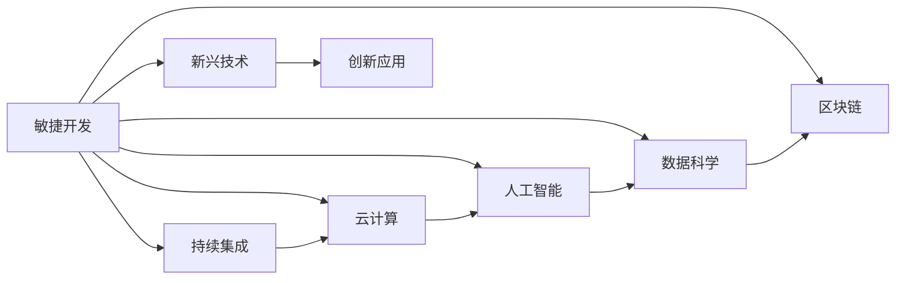

                 

# 乐观：每个人都能迎变化之浪潮而上

## 1. 背景介绍

在这个快速变化的时代，技术的进步、市场的竞争、社会的变革都在不断地影响着我们的工作和生活。在这样的背景下，如何保持乐观、适应变化，成为了许多人的重要课题。在IT领域，无论是从技术更新到市场变化，都充满了挑战和机遇。本文将通过探讨乐观在IT领域的实践和应用，帮助大家更好地适应变化，抓住机遇。

## 2. 核心概念与联系

### 2.1 核心概念概述

要理解乐观在IT领域的实践和应用，首先需要了解几个核心概念：

- **敏捷开发（Agile Development）**：一种迭代、增量式的开发方法，旨在通过快速反馈和灵活应对变化，提高软件项目的成功率。
- **持续集成（Continuous Integration，CI）**：一种软件开发的实践，通过频繁的构建、测试和集成，保证代码的质量和稳定性。
- **云计算（Cloud Computing）**：通过互联网提供计算资源和服务的模式，使得IT项目更加灵活、成本更低。
- **人工智能（AI）**：利用算法和数据训练计算机，使其能够模拟人类智能行为的技术。
- **数据科学（Data Science）**：使用统计学、机器学习等方法，从数据中提取知识和洞察力的学科。
- **区块链（Blockchain）**：一种去中心化的数据库技术，保证了数据的安全和透明。

这些概念之间有着密切的联系，它们共同构成了IT领域的核心技术体系，为IT从业者提供了工具和思路，帮助他们更好地应对变化。

### 2.2 概念间的关系

通过以下Mermaid流程图，我们可以更清晰地理解这些核心概念之间的联系：



这个流程图展示了敏捷开发与其他核心概念之间的联系。敏捷开发为持续集成、云计算、人工智能、数据科学和区块链提供了基础，而这些技术的结合又催生了更多新兴技术和创新应用。

## 3. 核心算法原理 & 具体操作步骤

### 3.1 算法原理概述

在IT领域，保持乐观不仅仅是个人心态的问题，更是一种技术实践。这里我们将从算法原理的角度，探讨如何通过技术手段保持乐观。

#### 3.1.1 敏捷开发

敏捷开发的核心在于快速反馈和灵活应对变化。其主要原理包括：

- **迭代开发（Iterative Development）**：将大型项目分解为多个小迭代，每个迭代都包括需求、设计、实现、测试和交付。通过不断迭代，逐步完善产品。
- **持续集成（Continuous Integration）**：通过频繁的构建、测试和集成，快速发现和解决问题，保证代码的质量和稳定性。
- **用户反馈（User Feedback）**：通过与用户的频繁互动，及时获取反馈，调整产品方向。

敏捷开发的核心在于保持灵活性和适应性，确保产品能够快速响应市场变化。

#### 3.1.2 持续集成

持续集成是一种软件开发的实践，旨在通过频繁的构建、测试和集成，保证代码的质量和稳定性。其主要原理包括：

- **频繁构建（Frequent Builds）**：通过频繁构建，尽早发现问题。
- **自动化测试（Automated Testing）**：通过自动化测试，提高测试效率和可靠性。
- **持续反馈（Continuous Feedback）**：通过持续反馈，及时调整开发方向。

持续集成通过频繁的构建和测试，确保了代码的稳定性和可靠性，为敏捷开发提供了技术支持。

#### 3.1.3 云计算

云计算通过互联网提供计算资源和服务的模式，使得IT项目更加灵活、成本更低。其主要原理包括：

- **弹性计算（Elastic Computing）**：根据实际需求，动态调整计算资源。
- **按需付费（Pay-As-You-Go）**：根据实际使用量，按需付费。
- **多云混合（Hybrid Cloud）**：将公有云和私有云结合，优化资源配置。

云计算通过弹性计算和多云混合，确保了IT项目的高效和成本效益，为敏捷开发和持续集成提供了基础设施支持。

#### 3.1.4 人工智能

人工智能利用算法和数据训练计算机，使其能够模拟人类智能行为。其主要原理包括：

- **数据驱动（Data-Driven）**：通过大量数据训练模型，提高预测和决策的准确性。
- **深度学习（Deep Learning）**：通过多层次神经网络，实现复杂的数据处理和分析。
- **强化学习（Reinforcement Learning）**：通过与环境互动，优化决策策略。

人工智能通过数据驱动和深度学习，提高了决策的准确性和效率，为IT项目的优化和创新提供了技术支持。

#### 3.1.5 数据科学

数据科学使用统计学、机器学习等方法，从数据中提取知识和洞察力。其主要原理包括：

- **数据预处理（Data Preprocessing）**：对原始数据进行清洗、归一化和特征工程。
- **模型训练（Model Training）**：使用算法训练模型，提取知识和洞察力。
- **预测分析（Predictive Analysis）**：通过模型预测未来趋势和行为。

数据科学通过数据预处理和模型训练，提供了数据驱动的决策支持，为IT项目的优化和创新提供了数据基础。

#### 3.1.6 区块链

区块链是一种去中心化的数据库技术，保证了数据的安全和透明。其主要原理包括：

- **分布式账本（Distributed Ledger）**：通过多个节点共同维护账本，提高数据的安全性和透明性。
- **共识机制（Consensus Mechanism）**：通过共识算法，保证数据的一致性和正确性。
- **智能合约（Smart Contract）**：通过代码自动化执行合约，提高合约的可信度和安全性。

区块链通过分布式账本和共识机制，提高了数据的安全性和透明性，为IT项目的数据管理和协作提供了技术支持。

### 3.2 算法步骤详解

接下来，我们将详细介绍每个核心概念的具体操作步骤。

#### 3.2.1 敏捷开发

1. **需求分析**：通过与用户互动，获取需求。
2. **迭代规划**：将需求分解为多个迭代，制定计划。
3. **迭代开发**：每个迭代包括需求、设计、实现、测试和交付。
4. **用户反馈**：通过与用户互动，获取反馈，调整迭代计划。
5. **回顾和反思**：定期回顾迭代过程，总结经验教训。

敏捷开发的五个步骤环环相扣，通过快速反馈和灵活应对变化，确保项目能够快速适应市场变化。

#### 3.2.2 持续集成

1. **代码提交**：将代码提交到版本控制系统。
2. **构建和测试**：自动化构建和测试代码，尽早发现问题。
3. **集成和部署**：将代码集成到主干分支，部署到测试环境。
4. **持续反馈**：通过持续反馈，及时调整开发方向。
5. **记录和分析**：记录构建和测试结果，分析问题原因。

持续集成的五个步骤通过频繁的构建和测试，保证了代码的稳定性和可靠性，为敏捷开发提供了技术支持。

#### 3.2.3 云计算

1. **资源部署**：根据需求，部署计算资源。
2. **弹性调整**：根据实际使用量，动态调整计算资源。
3. **数据存储和传输**：通过云存储和云传输，确保数据安全和高效。
4. **安全防护**：使用加密和安全协议，保护数据安全。
5. **备份和恢复**：定期备份数据，确保数据安全和可靠性。

云计算的五个步骤通过弹性计算和多云混合，确保了IT项目的高效和成本效益，为敏捷开发和持续集成提供了基础设施支持。

#### 3.2.4 人工智能

1. **数据准备**：收集和清洗数据，准备好训练数据。
2. **模型训练**：使用算法训练模型，提取知识和洞察力。
3. **模型评估**：通过评估指标，验证模型效果。
4. **模型优化**：根据评估结果，优化模型参数。
5. **应用部署**：将模型应用到实际业务中，实现决策支持。

人工智能的五个步骤通过数据驱动和深度学习，提高了决策的准确性和效率，为IT项目的优化和创新提供了技术支持。

#### 3.2.5 数据科学

1. **数据采集**：收集数据，准备数据预处理。
2. **数据预处理**：清洗、归一化和特征工程，准备数据。
3. **模型训练**：使用算法训练模型，提取知识和洞察力。
4. **预测分析**：通过模型预测未来趋势和行为。
5. **应用部署**：将模型应用到实际业务中，实现数据驱动的决策支持。

数据科学的五个步骤通过数据预处理和模型训练，提供了数据驱动的决策支持，为IT项目的优化和创新提供了数据基础。

#### 3.2.6 区块链

1. **节点部署**：部署节点，搭建区块链网络。
2. **共识机制**：通过共识算法，保证数据的一致性和正确性。
3. **智能合约**：编写智能合约，实现自动化执行。
4. **数据存储**：通过分布式账本，存储数据。
5. **安全防护**：使用加密和安全协议，保护数据安全。

区块链的五个步骤通过分布式账本和共识机制，提高了数据的安全性和透明性，为IT项目的数据管理和协作提供了技术支持。

### 3.3 算法优缺点

#### 3.3.1 敏捷开发的优缺点

- **优点**：
  - **灵活性**：能够快速响应变化，提高产品适应性。
  - **用户参与**：通过频繁互动，提高产品满意度。
  - **快速迭代**：通过频繁迭代，提高开发效率。

- **缺点**：
  - **资源消耗**：频繁迭代需要大量资源。
  - **管理复杂**：多个迭代管理复杂，需要高水平的管理能力。

#### 3.3.2 持续集成的优缺点

- **优点**：
  - **快速反馈**：频繁构建和测试，尽早发现问题。
  - **自动化**：自动化测试和构建，提高效率。
  - **稳定性**：频繁集成，保证代码的稳定性和可靠性。

- **缺点**：
  - **资源消耗**：频繁构建和测试需要大量资源。
  - **维护成本**：自动化工具的维护和调整成本高。

#### 3.3.3 云计算的优缺点

- **优点**：
  - **灵活性**：弹性计算，按需付费，灵活调整资源。
  - **成本效益**：按需付费，节省成本。
  - **可靠性**：分布式账本和共识机制，提高数据可靠性和安全性。

- **缺点**：
  - **管理复杂**：多云混合和弹性计算需要高水平的管理能力。
  - **安全风险**：分布式账本和共识机制可能面临安全风险。

#### 3.3.4 人工智能的优缺点

- **优点**：
  - **准确性**：通过数据驱动和深度学习，提高决策准确性。
  - **效率**：自动化决策，提高效率。
  - **创新性**：通过数据驱动和模型优化，实现创新。

- **缺点**：
  - **数据需求**：需要大量高质量数据。
  - **算法复杂**：算法复杂，需要高水平的技术能力。
  - **伦理风险**：模型可能存在偏见和歧视。

#### 3.3.5 数据科学的优缺点

- **优点**：
  - **洞察力**：通过数据驱动，提取洞察力。
  - **决策支持**：提供数据驱动的决策支持，提高决策质量。
  - **创新性**：通过数据驱动，实现创新。

- **缺点**：
  - **数据需求**：需要大量高质量数据。
  - **算法复杂**：算法复杂，需要高水平的技术能力。
  - **隐私风险**：数据泄露和隐私风险。

#### 3.3.6 区块链的优缺点

- **优点**：
  - **安全性**：分布式账本和共识机制，提高数据安全性。
  - **透明性**：数据透明，可追溯性强。
  - **自动化**：智能合约，自动化执行合约。

- **缺点**：
  - **资源消耗**：分布式账本和共识机制需要大量计算资源。
  - **复杂性**：分布式账本和共识机制复杂，需要高水平的技术能力。
  - **信任问题**：需要建立信任机制，解决信任问题。

### 3.4 算法应用领域

#### 3.4.1 敏捷开发的应用领域

- **软件开发**：快速响应需求变化，提高开发效率。
- **产品管理**：通过用户反馈，调整产品方向。
- **项目管理**：灵活管理项目，提高项目成功率。

#### 3.4.2 持续集成的应用领域

- **软件开发**：频繁构建和测试，保证代码稳定性和可靠性。
- **自动化测试**：自动化测试，提高测试效率和可靠性。
- **持续部署**：持续部署，提高部署效率和可靠性。

#### 3.4.3 云计算的应用领域

- **软件开发**：弹性计算，按需付费，节省成本。
- **数据存储**：云存储，提高数据安全性和可靠性。
- **大数据**：大数据处理和分析，提高决策质量。

#### 3.4.4 人工智能的应用领域

- **自然语言处理**：提高语言理解和生成能力。
- **计算机视觉**：提高图像识别和处理能力。
- **推荐系统**：提高推荐准确性和个性化。

#### 3.4.5 数据科学的应用领域

- **金融分析**：通过数据驱动，提高金融决策质量。
- **市场营销**：通过数据驱动，提高市场营销效果。
- **医疗健康**：通过数据驱动，提高医疗决策质量。

#### 3.4.6 区块链的应用领域

- **金融行业**：提高金融交易的透明度和安全性。
- **供应链管理**：提高供应链管理的透明性和可靠性。
- **智能合约**：提高合约的自动化执行和信任度。

## 4. 数学模型和公式 & 详细讲解 & 举例说明

### 4.1 数学模型构建

在IT领域，数学模型和算法是不可或缺的工具。下面我们将详细介绍一些常见的数学模型和算法。

#### 4.1.1 线性回归模型

线性回归模型是一种常见的统计学模型，用于预测连续型变量的值。其主要原理包括：

- **数据准备**：收集数据，准备好训练数据。
- **模型训练**：通过最小化残差平方和，拟合线性模型。
- **模型评估**：通过均方误差等指标，评估模型效果。
- **模型应用**：将模型应用到实际业务中，实现预测支持。

线性回归模型的数学表达式为：

$$
y = \beta_0 + \beta_1 x_1 + \beta_2 x_2 + \cdots + \beta_n x_n + \epsilon
$$

其中，$y$为预测值，$\beta$为回归系数，$x_i$为自变量，$\epsilon$为随机误差项。

#### 4.1.2 决策树模型

决策树模型是一种常见的机器学习模型，用于分类和回归任务。其主要原理包括：

- **数据准备**：收集数据，准备好训练数据。
- **模型训练**：通过信息增益等指标，构建决策树。
- **模型评估**：通过准确率等指标，评估模型效果。
- **模型应用**：将模型应用到实际业务中，实现分类和回归支持。

决策树模型的数学表达式为：

$$
T = \{(r, d(r)), r \in R\}
$$

其中，$T$为决策树，$r$为决策节点，$d(r)$为决策结果。

#### 4.1.3 支持向量机模型

支持向量机模型是一种常见的分类模型，用于解决线性可分和线性不可分问题。其主要原理包括：

- **数据准备**：收集数据，准备好训练数据。
- **模型训练**：通过求解优化问题，构建支持向量机。
- **模型评估**：通过准确率等指标，评估模型效果。
- **模型应用**：将模型应用到实际业务中，实现分类支持。

支持向量机模型的数学表达式为：

$$
f(x) = \sum_{i=1}^n \alpha_i y_i k(x_i, x) - \frac{1}{2}\sum_{i=1}^n \sum_{j=1}^n \alpha_i \alpha_j y_i y_j k(x_i, x_j)
$$

其中，$f(x)$为预测函数，$\alpha$为拉格朗日乘子，$y_i$为训练数据标签，$k(x_i, x)$为核函数。

#### 4.1.4 神经网络模型

神经网络模型是一种常见的深度学习模型，用于处理复杂的非线性问题。其主要原理包括：

- **数据准备**：收集数据，准备好训练数据。
- **模型训练**：通过反向传播算法，训练神经网络。
- **模型评估**：通过损失函数等指标，评估模型效果。
- **模型应用**：将模型应用到实际业务中，实现预测支持。

神经网络模型的数学表达式为：

$$
\begin{aligned}
y &= \sigma(\mathbf{W}_1 \mathbf{x} + \mathbf{b}_1) \\
y &= \sigma(\mathbf{W}_2 \mathbf{y} + \mathbf{b}_2)
\end{aligned}
$$

其中，$\sigma$为激活函数，$\mathbf{W}$为权重矩阵，$\mathbf{b}$为偏置向量，$\mathbf{x}$为输入向量，$y$为输出向量。

### 4.2 公式推导过程

#### 4.2.1 线性回归模型公式推导

线性回归模型的基本公式为：

$$
y = \beta_0 + \beta_1 x_1 + \beta_2 x_2 + \cdots + \beta_n x_n + \epsilon
$$

其中，$\beta$为回归系数，$\epsilon$为随机误差项。其最小二乘法求解公式为：

$$
\beta = (\mathbf{X}^T \mathbf{X})^{-1} \mathbf{X}^T \mathbf{y}
$$

其中，$\mathbf{X}$为特征矩阵，$\mathbf{y}$为标签向量。

#### 4.2.2 决策树模型公式推导

决策树模型的基本公式为：

$$
T = \{(r, d(r)), r \in R\}
$$

其中，$T$为决策树，$r$为决策节点，$d(r)$为决策结果。其信息增益公式为：

$$
Gain(D, A) = \sum_{v \in V} \frac{|D_v|}{|D|} \cdot \sum_{x \in A} \log_2 \frac{|D_x|}{|D_v|}
$$

其中，$D$为训练集，$A$为属性集，$V$为划分结果，$D_v$为划分后的子集，$D_x$为属性$x$取值为$x_i$的子集。

#### 4.2.3 支持向量机模型公式推导

支持向量机模型的基本公式为：

$$
f(x) = \sum_{i=1}^n \alpha_i y_i k(x_i, x) - \frac{1}{2}\sum_{i=1}^n \sum_{j=1}^n \alpha_i \alpha_j y_i y_j k(x_i, x_j)
$$

其中，$f(x)$为预测函数，$\alpha$为拉格朗日乘子，$y_i$为训练数据标签，$k(x_i, x)$为核函数。其求解公式为：

$$
\begin{aligned}
\min_{\alpha} & \frac{1}{2} \sum_{i=1}^n \sum_{j=1}^n \alpha_i \alpha_j y_i y_j k(x_i, x_j) - \sum_{i=1}^n \alpha_i \\
\text{s.t.} & \sum_{i=1}^n \alpha_i y_i = 0 \\
& 0 \leq \alpha_i \leq C
\end{aligned}
$$

其中，$C$为惩罚系数。

#### 4.2.4 神经网络模型公式推导

神经网络模型的基本公式为：

$$
y = \sigma(\mathbf{W}_1 \mathbf{x} + \mathbf{b}_1) \\
y = \sigma(\mathbf{W}_2 \mathbf{y} + \mathbf{b}_2)
$$

其中，$\sigma$为激活函数，$\mathbf{W}$为权重矩阵，$\mathbf{b}$为偏置向量，$\mathbf{x}$为输入向量，$y$为输出向量。其反向传播算法为：

$$
\frac{\partial E}{\partial \mathbf{W}_l} = \frac{\partial E}{\partial \mathbf{y}_l} \cdot \frac{\partial \mathbf{y}_l}{\partial \mathbf{y}_{l-1}} \cdot \frac{\partial \mathbf{y}_{l-1}}{\partial \mathbf{x}} = \frac{\partial E}{\partial \mathbf{y}_l} \cdot \mathbf{W}_l^T
$$

其中，$E$为损失函数，$l$为层号，$\mathbf{y}_l$为第$l$层的输出向量，$\mathbf{x}$为输入向量。

### 4.3 案例分析与讲解

#### 4.3.1 线性回归模型案例分析

假设我们有一组房价数据，我们需要预测新的房价。我们可以使用线性回归模型来解决这个问题。

数据准备：
- 收集房价数据，准备好训练数据。
- 将房价数据标准化，准备好输入数据。

模型训练：
- 使用最小二乘法求解回归系数$\beta$。
- 得到线性回归模型$f(x) = \beta_0 + \beta_1 x_1 + \beta_2 x_2 + \cdots + \beta_n x_n$。

模型评估：
- 使用均方误差等指标评估模型效果。
- 通过评估结果调整回归系数。

模型应用：
- 将线性回归模型应用到新的房价数据上，预测房价。

#### 4.3.2 决策树模型案例分析

假设我们有一组分类数据，我们需要将其分为两个类别。我们可以使用决策树模型来解决这个问题。

数据准备：
- 收集分类数据，准备好训练数据。
- 将分类数据进行划分，准备好输入数据。

模型训练：
- 使用信息增益等指标构建决策树。
- 得到决策树模型$T = \{(r, d(r)), r \in R\}$。

模型评估：
- 使用准确率等指标评估模型效果。
- 通过评估结果调整决策树。

模型应用：
- 将决策树模型应用到新的分类数据上，进行分类。

#### 4.3.3 支持向量机模型案例分析

假设我们有一组分类数据，我们需要将其分为两个类别。我们可以使用支持向量机模型来解决这个问题。

数据准备：
- 收集分类数据，准备好训练数据。
- 将分类数据进行划分，准备好输入数据。

模型训练：
- 使用求解优化问题构建支持向量机。
- 得到支持向量机模型$f(x) = \sum_{i=1}^n \alpha_i y_i k(x_i, x) - \frac{1}{2}\sum_{i=1}^n \sum_{j=1}^n \alpha_i \alpha_j y_i y_j k(x_i, x_j)$。

模型评估：
- 使用准确率等指标评估模型效果。
- 通过评估结果调整拉格朗日乘子。

模型应用：
- 将支持向量机模型应用到新的分类数据上，进行分类。

#### 4.3.4 神经网络模型案例分析

假设我们有一组图像数据，我们需要将其分类。我们可以使用神经网络模型来解决这个问题。

数据准备：
- 收集图像数据，准备好训练数据。
- 将图像数据进行预处理，准备好输入数据。

模型训练：
- 使用反向传播算法训练神经网络。
- 得到神经网络模型$y = \sigma(\mathbf{W}_1 \mathbf{x} + \mathbf{b}_1) \\
y = \sigma(\mathbf{W}_2 \mathbf{y} + \mathbf{b}_2)$。

模型评估：
- 使用损失函数等指标评估模型效果。
- 通过评估结果调整权重矩阵和偏置向量。

模型应用：
- 将神经网络模型应用到新的图像数据上，进行分类。

## 5. 项目实践：代码实例和详细解释说明

### 5.1 开发环境搭建

在进行项目实践前，我们需要准备好开发环境。以下是使用Python进行PyTorch开发的环境配置流程：

1. 安装Anaconda：从官网下载并安装Anaconda，用于创建独立的Python环境。

2. 创建并激活虚拟环境：
```bash
conda create -n pytorch-env python=3.8 
conda activate pytorch-env
```

3. 安装PyTorch：根据CUDA版本，从官网获取对应的安装命令。例如：
```bash
conda install pytorch torchvision torchaudio cudatoolkit=11.1 -c pytorch -c conda

