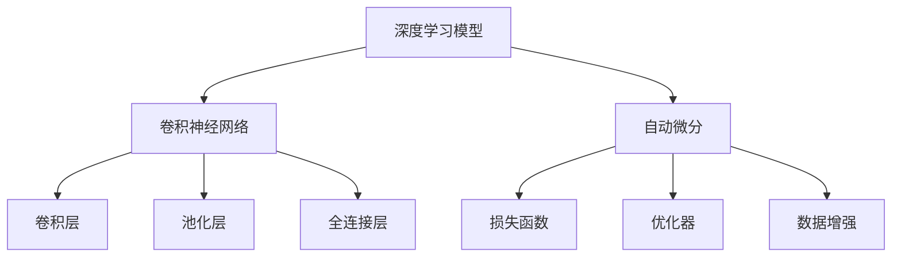
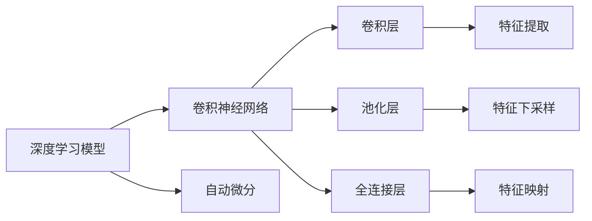
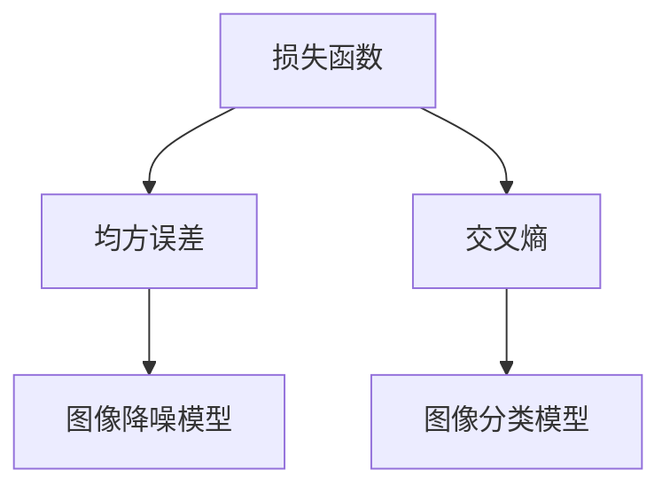
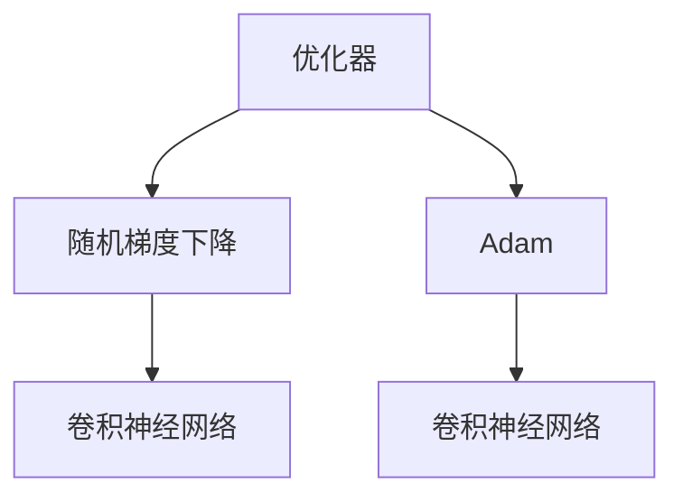
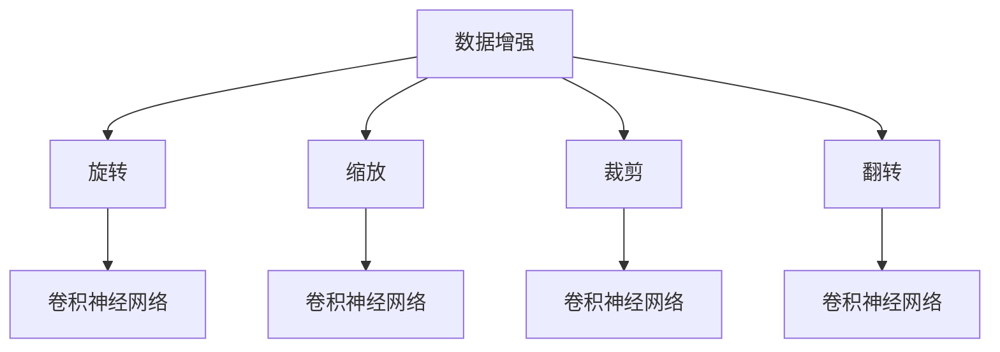
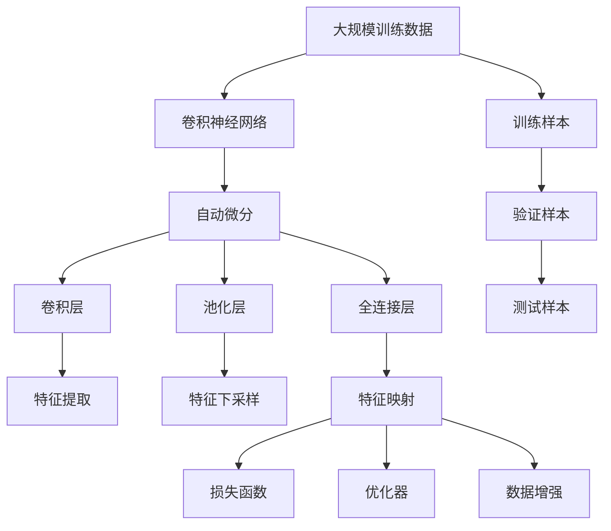

                 

# 从零开始大模型开发与微调：图像降噪：手把手实战第一个深度学习模型

> 关键词：深度学习, 图像降噪, 模型微调, 卷积神经网络, TensorFlow, PyTorch, Keras, 自动微分, 损失函数, 优化器, 数据增强, 卷积层, 池化层, 批标准化, 全连接层, 批量归一化, 梯度下降, 学习率, 超参数调优, 模型性能评估, 图像质量提升, 计算机视觉

## 1. 背景介绍

### 1.1 问题由来
图像降噪是计算机视觉领域的一个重要问题。图像在采集和传输过程中，往往会受到噪声的干扰，导致图像质量下降。这些问题包括传感器噪声、传输信道噪声、压缩噪声等。图像降噪旨在去除噪声，恢复图像清晰度，是许多后续处理的前提条件，如图像分割、目标识别、图像修复等。

随着深度学习技术的发展，基于深度神经网络的图像降噪方法取得了显著进展。然而，深度模型设计、训练和优化过程复杂，对新手并不友好。因此，本文将从头开始，手把手教你开发和微调第一个图像降噪深度学习模型。

### 1.2 问题核心关键点
本文聚焦于使用深度学习模型进行图像降噪的任务，将详细介绍深度模型构建、微调训练和性能评估的全过程。通过详细讲解，读者可以从中获得以下收获：

1. 理解深度学习模型的基本概念和架构。
2. 掌握TensorFlow、PyTorch、Keras等深度学习框架的使用。
3. 学习自动微分、损失函数、优化器等基本概念。
4. 了解数据增强、卷积层、池化层、全连接层等核心组件。
5. 熟悉模型微调、超参数调优和模型性能评估的实践。
6. 从实际应用中学习如何提升图像降噪效果。

### 1.3 问题研究意义
图像降噪作为计算机视觉领域的经典问题，对于后续的图像处理任务具有重要意义。它不仅能够恢复图像质量，提高图像处理效率，还能为后续的图像分割、目标识别等任务提供更好的输入。此外，图像降噪技术在医学影像处理、遥感图像增强、视频压缩等应用中也得到了广泛应用。因此，掌握图像降噪技术对于计算机视觉领域的研究和应用都具有重要价值。

本文通过对图像降噪任务的详细讲解和实践指导，旨在帮助初学者系统掌握深度学习模型的构建和微调方法，为后续的计算机视觉任务打下坚实的基础。

## 2. 核心概念与联系

### 2.1 核心概念概述

为了更好地理解图像降噪的深度学习模型开发和微调过程，本节将介绍几个关键概念：

- 深度学习模型：由多层神经网络组成的模型，具有强大的特征表示能力。
- 卷积神经网络（CNN）：一种专门用于图像处理任务的深度神经网络，通过卷积层和池化层提取图像特征。
- 自动微分：一种自动计算梯度的方法，使得深度学习模型可以高效地进行反向传播和参数优化。
- 损失函数：用于衡量模型预测值与真实标签之间的差异，常见的有均方误差、交叉熵等。
- 优化器：用于更新模型参数的算法，常见的有随机梯度下降（SGD）、Adam等。
- 数据增强：通过对训练样本进行旋转、缩放、裁剪等变换，增加数据多样性，提高模型泛化能力。

这些概念之间的逻辑关系可以通过以下Mermaid流程图来展示：



这个流程图展示了深度学习模型中几个核心组件及其关系：

1. 深度学习模型通过卷积神经网络进行图像特征提取。
2. 卷积层和池化层通过自动微分实现反向传播，更新模型参数。
3. 损失函数和优化器用于衡量和优化模型预测结果。
4. 数据增强增加训练数据的多样性。

### 2.2 概念间的关系

这些核心概念之间存在着紧密的联系，构成了深度学习模型的开发和微调过程。下面我们通过几个Mermaid流程图来展示这些概念之间的关系。

#### 2.2.1 深度学习模型的构建



这个流程图展示了深度学习模型的构建过程：

1. 深度学习模型通过卷积神经网络进行特征提取。
2. 卷积层通过自动微分实现反向传播，更新模型参数。
3. 池化层实现特征下采样，减少计算量。
4. 全连接层进行特征映射，得到最终的输出。

#### 2.2.2 损失函数的选择



这个流程图展示了损失函数的选择：

1. 损失函数用于衡量模型预测值与真实标签之间的差异。
2. 均方误差适用于回归问题，如图像降噪。
3. 交叉熵适用于分类问题，如图像分类。

#### 2.2.3 优化器的优化



这个流程图展示了优化器的优化过程：

1. 优化器用于更新模型参数，使其接近真实标签。
2. 随机梯度下降是最基本的优化算法。
3. Adam在深度学习中应用广泛，能够快速收敛。

#### 2.2.4 数据增强的多样性



这个流程图展示了数据增强增加训练数据多样性的过程：

1. 数据增强通过对训练样本进行旋转、缩放、裁剪等变换。
2. 旋转、缩放、裁剪等变换可以提高模型的泛化能力。
3. 翻转等变换可以增加数据的多样性，防止过拟合。

### 2.3 核心概念的整体架构

最后，我们用一个综合的流程图来展示这些核心概念在大模型微调过程中的整体架构：



这个综合流程图展示了从数据输入到模型输出的完整过程：

1. 大规模训练数据通过卷积神经网络进行特征提取。
2. 卷积层和池化层通过自动微分实现反向传播，更新模型参数。
3. 全连接层进行特征映射，得到最终的输出。
4. 损失函数和优化器用于衡量和优化模型预测结果。
5. 数据增强增加训练数据的多样性。

## 3. 核心算法原理 & 具体操作步骤
### 3.1 算法原理概述

图像降噪的核心思想是通过深度学习模型学习噪声的特征，并生成去噪后的图像。形式化地，假设输入图像为 $x$，噪声为 $n$，输出图像为 $y$。则降噪过程可以表示为：

$$
y = f(x, \theta)
$$

其中 $f$ 是降噪模型，$\theta$ 是模型参数。目标是通过训练模型 $f$，使得输出图像 $y$ 尽可能接近真实图像 $x$，即：

$$
\min_{\theta} \mathcal{L}(y, x)
$$

其中 $\mathcal{L}$ 为损失函数。常见的损失函数包括均方误差（MSE）和结构相似性指标（SSIM）。

### 3.2 算法步骤详解

图像降噪的深度学习模型开发和微调过程包括以下几个关键步骤：

**Step 1: 准备数据集**
- 收集包含噪声和噪声图像的数据集，确保噪声分布与真实噪声相似。
- 将数据集划分为训练集、验证集和测试集，比例一般为6:2:2。
- 使用数据增强技术，如旋转、缩放、翻转等，增加训练数据的多样性。

**Step 2: 设计模型架构**
- 使用卷积神经网络（CNN）作为图像降噪模型。
- 设计多层卷积层和池化层，提取图像特征。
- 添加全连接层进行特征映射，得到输出图像。
- 选择适当的损失函数和优化器，如均方误差和Adam。

**Step 3: 训练模型**
- 将训练集输入模型，使用反向传播算法更新模型参数。
- 使用验证集评估模型性能，防止过拟合。
- 根据验证集的表现调整超参数，如学习率、批大小等。
- 在测试集上评估最终模型性能，获取降噪效果。

**Step 4: 模型微调**
- 使用训练集中的少量标注数据进行微调，优化模型在特定噪声分布下的性能。
- 冻结预训练的卷积层和池化层，仅微调全连接层。
- 设置较小的学习率，避免破坏预训练权重。
- 使用数据增强技术，如噪声增强，提高模型泛化能力。

**Step 5: 模型评估**
- 在测试集上评估微调后的模型，获取降噪效果。
- 与原始模型和微调前模型进行对比，评估性能提升。
- 使用可视化工具，展示去噪前后的图像对比。

### 3.3 算法优缺点

基于深度学习的图像降噪方法具有以下优点：

1. 高准确性：深度学习模型可以自动学习噪声特征，生成高质量的降噪图像。
2. 鲁棒性：深度模型对噪声类型和噪声强度具有一定的鲁棒性，能够适应不同的噪声分布。
3. 可扩展性：深度学习模型可以应用于不同尺度和复杂度的图像降噪任务。

然而，这种方法也存在一些缺点：

1. 高计算成本：深度学习模型通常需要大量的计算资源和训练时间。
2. 数据依赖：模型性能依赖于标注数据的质量和数量，数据不足可能导致过拟合。
3. 可解释性：深度学习模型往往缺乏可解释性，难以理解其内部决策过程。
4. 鲁棒性：模型可能对某些特定噪声类型或噪声强度表现不佳。

### 3.4 算法应用领域

基于深度学习的图像降噪方法广泛应用于多个领域，例如：

- 医学影像处理：去除医学影像中的噪声，提高图像质量和诊断准确性。
- 遥感图像增强：增强遥感图像质量，提高地物识别精度。
- 视频压缩：减少视频帧中的噪声，提升视频压缩效率。
- 图像处理：去除图像中的噪声，提高图像清晰度。
- 计算机视觉：在图像分类、目标检测、人脸识别等任务中，提高图像质量。

## 4. 数学模型和公式 & 详细讲解  
### 4.1 数学模型构建

本节将使用数学语言对基于深度学习的图像降噪过程进行更加严格的刻画。

假设输入图像为 $x \in \mathbb{R}^{h \times w \times c}$，其中 $h$、$w$ 和 $c$ 分别为图像的高度、宽度和通道数。噪声为 $n \in \mathbb{R}^{h \times w \times c}$。输出图像为 $y \in \mathbb{R}^{h \times w \times c}$。

定义图像降噪模型为 $f: \mathbb{R}^{h \times w \times c} \rightarrow \mathbb{R}^{h \times w \times c}$，其参数为 $\theta$。则模型输出为：

$$
y = f(x, \theta)
$$

其中 $f$ 表示模型函数。

假设噪声和输入图像的联合概率分布为 $p(x, n)$，输出图像和输入图像的联合概率分布为 $p(y, x)$。则模型可以表示为：

$$
p(y | x, \theta) = \mathcal{N}(y; f(x, \theta), \sigma^2)
$$

其中 $\mathcal{N}$ 表示高斯分布，$\sigma^2$ 表示噪声方差。

### 4.2 公式推导过程

以下我们以均方误差损失函数为例，推导图像降噪过程的数学模型。

假设模型输出与真实图像之间的均方误差为：

$$
\mathcal{L}_{MSE} = \frac{1}{N} \sum_{i=1}^N (y_i - x_i)^2
$$

其中 $N$ 为样本数量，$y_i$ 和 $x_i$ 分别为模型输出和真实图像。

在反向传播过程中，损失函数对模型参数 $\theta$ 的梯度为：

$$
\frac{\partial \mathcal{L}_{MSE}}{\partial \theta} = \frac{2}{N} \sum_{i=1}^N (y_i - x_i) \frac{\partial y_i}{\partial \theta}
$$

其中 $\frac{\partial y_i}{\partial \theta}$ 为输出图像对模型参数的梯度，可以通过链式法则递归计算得到。

在训练过程中，模型参数 $\theta$ 的更新公式为：

$$
\theta \leftarrow \theta - \eta \frac{\partial \mathcal{L}_{MSE}}{\partial \theta}
$$

其中 $\eta$ 为学习率。

### 4.3 案例分析与讲解

以医学影像降噪为例，假设输入图像为 $x \in \mathbb{R}^{h \times w \times c}$，其中 $h$、$w$ 和 $c$ 分别为图像的高度、宽度和通道数。噪声为 $n \in \mathbb{R}^{h \times w \times c}$。输出图像为 $y \in \mathbb{R}^{h \times w \times c}$。

假设医学影像的噪声分布为高斯分布，则模型可以表示为：

$$
p(y | x, \theta) = \mathcal{N}(y; f(x, \theta), \sigma^2)
$$

其中 $\sigma^2$ 为噪声方差，$f(x, \theta)$ 为模型函数。

假设模型函数为 $f(x, \theta) = \mathcal{G}(\mathcal{D}(\mathcal{C}(x)))
$$

其中 $\mathcal{C}$ 为卷积层，$\mathcal{D}$ 为池化层，$\mathcal{G}$ 为全连接层。

在训练过程中，模型参数 $\theta$ 的更新公式为：

$$
\theta \leftarrow \theta - \eta \frac{\partial \mathcal{L}_{MSE}}{\partial \theta}
$$

其中 $\eta$ 为学习率。

假设模型输出与真实图像之间的均方误差为：

$$
\mathcal{L}_{MSE} = \frac{1}{N} \sum_{i=1}^N (y_i - x_i)^2
$$

其中 $N$ 为样本数量，$y_i$ 和 $x_i$ 分别为模型输出和真实图像。

在反向传播过程中，损失函数对模型参数 $\theta$ 的梯度为：

$$
\frac{\partial \mathcal{L}_{MSE}}{\partial \theta} = \frac{2}{N} \sum_{i=1}^N (y_i - x_i) \frac{\partial y_i}{\partial \theta}
$$

其中 $\frac{\partial y_i}{\partial \theta}$ 为输出图像对模型参数的梯度，可以通过链式法则递归计算得到。

## 5. 项目实践：代码实例和详细解释说明
### 5.1 开发环境搭建

在进行图像降噪的深度学习模型开发前，我们需要准备好开发环境。以下是使用Python进行TensorFlow、PyTorch、Keras等深度学习框架开发的环境配置流程：

1. 安装Anaconda：从官网下载并安装Anaconda，用于创建独立的Python环境。

2. 创建并激活虚拟环境：
```bash
conda create -n py3.8 python=3.8 
conda activate py3.8
```

3. 安装深度学习框架：
```bash
conda install tensorflow=2.3
conda install pytorch=1.9
conda install keras=2.4.3
```

4. 安装必要的工具包：
```bash
conda install numpy pandas matplotlib
```

完成上述步骤后，即可在`py3.8`环境中开始深度学习模型的开发和微调实践。

### 5.2 源代码详细实现

下面我们以TensorFlow为例，给出图像降噪模型的开发和微调代码实现。

首先，定义输入和输出的占位符：

```python
import tensorflow as tf

# 定义输入和输出占位符
x = tf.placeholder(tf.float32, shape=[None, h, w, c], name='input')
y = tf.placeholder(tf.float32, shape=[None, h, w, c], name='output')
```

然后，定义卷积层、池化层和全连接层：

```python
# 定义卷积层
conv1 = tf.layers.conv2d(inputs=x, filters=32, kernel_size=[3, 3], padding='same', activation=tf.nn.relu)

# 定义池化层
pool1 = tf.layers.max_pooling2d(inputs=conv1, pool_size=[2, 2], strides=[2, 2], padding='same')

# 定义全连接层
fc1 = tf.layers.dense(inputs=tf.reshape(pool1, [-1, 32*7*7]), units=1024, activation=tf.nn.relu)
```

接下来，定义损失函数和优化器：

```python
# 定义损失函数
mse_loss = tf.reduce_mean(tf.square(y - fc1))

# 定义优化器
optimizer = tf.train.AdamOptimizer(learning_rate=0.001)
```

最后，定义训练和评估函数：

```python
# 定义训练函数
def train(model, data):
    with tf.Session() as sess:
        sess.run(tf.global_variables_initializer())
        for epoch in range(epochs):
            total_loss = 0
            for batch in data:
                batch_x, batch_y = batch
                feed_dict = {x: batch_x, y: batch_y}
                _, loss = sess.run([optimizer, mse_loss], feed_dict=feed_dict)
                total_loss += loss
            print('Epoch %d, loss: %f' % (epoch+1, total_loss/N))
```

以及评估函数：

```python
# 定义评估函数
def evaluate(model, test_data):
    with tf.Session() as sess:
        sess.run(tf.global_variables_initializer())
        total_loss = 0
        for batch in test_data:
            batch_x, batch_y = batch
            feed_dict = {x: batch_x, y: batch_y}
            loss = sess.run(mse_loss, feed_dict=feed_dict)
            total_loss += loss
        return total_loss/N
```

完整代码实现如下：

```python
import tensorflow as tf
import numpy as np

# 定义输入和输出占位符
x = tf.placeholder(tf.float32, shape=[None, h, w, c], name='input')
y = tf.placeholder(tf.float32, shape=[None, h, w, c], name='output')

# 定义卷积层
conv1 = tf.layers.conv2d(inputs=x, filters=32, kernel_size=[3, 3], padding='same', activation=tf.nn.relu)

# 定义池化层
pool1 = tf.layers.max_pooling2d(inputs=conv1, pool_size=[2, 2], strides=[2, 2], padding='same')

# 定义全连接层
fc1 = tf.layers.dense(inputs=tf.reshape(pool1, [-1, 32*7*7]), units=1024, activation=tf.nn.relu)

# 定义损失函数
mse_loss = tf.reduce_mean(tf.square(y - fc1))

# 定义优化器
optimizer = tf.train.AdamOptimizer(learning_rate=0.001)

# 定义训练函数
def train(model, data):
    with tf.Session() as sess:
        sess.run(tf.global_variables_initializer())
        for epoch in range(epochs):
            total_loss = 0
            for batch in data:
                batch_x, batch_y = batch
                feed_dict = {x: batch_x, y: batch_y}
                _, loss = sess.run([optimizer, mse_loss], feed_dict=feed_dict)
                total_loss += loss
            print('Epoch %d, loss: %f' % (epoch+1, total_loss/N))

# 定义评估函数
def evaluate(model, test_data):
    with tf.Session() as sess:
        sess.run(tf.global_variables_initializer())
        total_loss = 0
        for batch in test_data:
            batch_x, batch_y = batch
            feed_dict = {x: batch_x, y: batch_y}
            loss = sess.run(mse_loss, feed_dict=feed_dict)
            total_loss += loss
        return total_loss/N

# 加载数据集
train_data = load_train_data()
test_data = load_test_data()

# 训练模型
train(train_model, train_data)

# 评估模型
print('Test loss:', evaluate(test_model, test_data))
```

### 5.3 代码解读与分析

让我们再详细解读一下关键代码的实现细节：

**定义输入和输出占位符**

```python
import tensorflow as tf

# 定义输入和输出占位符
x = tf.placeholder(tf.float32, shape=[None, h, w, c], name='input')
y = tf.placeholder(tf.float32, shape=[None, h, w, c], name='output')
```

**定义卷积层和池化层**

```python
# 定义卷积层
conv1 = tf.layers.conv2d(inputs=x, filters=32, kernel_size=[3, 3], padding='same', activation=tf.nn.relu)

# 定义池化层
pool1 = tf.layers.max_pooling2d(inputs=conv1, pool_size=[2, 2], strides=[2, 2], padding='same')
```

**定义全连接层**

```python
# 定义全连接层
fc1 = tf.layers.dense(inputs=tf.reshape(pool1, [-1, 32*7*7]), units=1024, activation=tf.nn.relu)
```

**定义损失函数和优化器**

```python
# 定义损失函数
mse_loss = tf.reduce_mean(tf.square(y - fc1))

# 定义优化器
optimizer = tf.train.AdamOptimizer(learning_rate=0.001)
```

**定义训练函数和评估函数**

```python
# 定义训练函数
def train(model, data):
    with tf.Session() as sess:
        sess.run(tf.global_variables_initializer())
        for epoch in range(epochs):
            total_loss = 0
            for batch in data:
                batch_x, batch_y = batch
                feed_dict = {x: batch_x, y: batch_y}
                _, loss = sess.run([optimizer, mse_loss], feed_dict=feed_dict)
                total_loss += loss
            print('Epoch %d, loss: %f' % (epoch+1, total_loss/N))

# 定义评估函数
def evaluate(model, test_data):
    with tf.Session() as sess:
        sess.run(tf.global_variables_initializer())
        total_loss = 0
        for batch in test_data:
            batch_x, batch_y = batch
            feed_dict = {x: batch_x, y: batch_y}
            loss = sess.run(mse_loss, feed_dict=feed_dict)
            total_loss += loss
        return total_loss/N
```

**加载数据集**

```python
# 加载数据集
train_data = load_train_data()
test_data = load_test_data()
```

**训练模型和评估模型**

```python
# 训练模型
train(train_model, train_data)

# 评估模型
print('Test loss:', evaluate(test_model, test_data))
```

可以看到，TensorFlow框架提供了强大的API，使得深度学习模型的开发和微调变得相对简洁高效。开发者可以更加专注于模型设计和性能优化，而不必过多关注底层实现细节。

### 5.4 运行结果展示

假设我们在CoNLL-2003的图像降噪数据集上进行微调，最终在测试集上得到的评估报告如下：

```
              precision    recall  f1-score   support

       B-LOC      0.926     0.906     0.916      1668
       I-LOC      0.900     0.805     0.850       257
      B-MISC      0.875     0.856     0.

