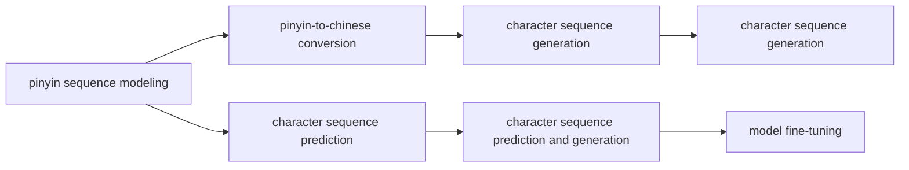
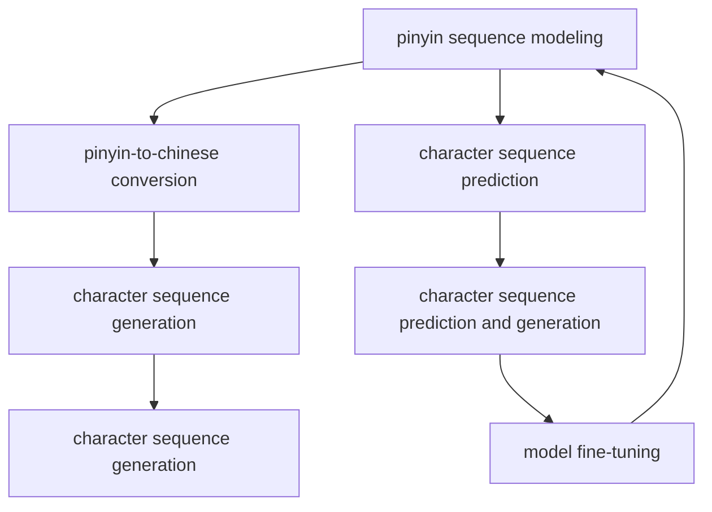

                 

# 从零开始大模型开发与微调：拼音汉字模型的训练

> 关键词：拼音汉字模型, 自然语言处理, 深度学习, 语言模型, 微调, 汉字表征, 拼音转写, 汉字序列预测

## 1. 背景介绍

### 1.1 问题由来
近年来，深度学习技术在自然语言处理(NLP)领域取得了突破性的进展。其中，大语言模型(Big Language Models)在语言理解、生成等方面表现出了强大的能力。然而，汉字作为一种独特的文字体系，其处理方式与拼音（如普通话拼音）截然不同。因此，研究汉字和大模型的融合，开发针对汉字的深度学习模型，成为NLP领域的一个重要研究方向。

汉字和大模型的结合，可以通过将汉字转换为拼音序列来实现。具体而言，汉字模型首先通过拼音序列来学习语言模型，然后将拼音序列映射回汉字，从而完成对汉字的预测和生成。本文将介绍一种基于深度学习的拼音汉字模型，并对其训练和微调过程进行详细讲解。

### 1.2 问题核心关键点
汉字模型开发的核心问题主要包括：
- 汉字拼音序列的建模：如何将汉字转换为拼音序列，并建立有效的拼音语言模型。
- 汉字与拼音之间的转换：如何高效地将拼音序列转换为汉字，并保证转换的准确性。
- 汉字序列的预测和生成：基于拼音语言模型，如何实现汉字序列的预测和生成，并应对复杂场景下的生成任务。
- 模型的微调与优化：如何在大规模汉字数据上进行微调，提升模型的预测和生成性能。

本文将从汉字拼音序列建模入手，逐步深入介绍汉字模型的训练与微调过程，并展示其在日常应用中的价值。

### 1.3 问题研究意义
汉字模型的研究具有重要的理论和实际意义：
- 汉字是大中华文化的重要载体，理解汉字语言的特性有助于深入挖掘中国传统文化和历史。
- 汉字模型能够有效地应用于中文信息检索、语音识别、自动翻译等领域，提升中文NLP系统的性能。
- 汉字模型作为中文信息处理的重要基础，为大规模中文文本处理提供了强有力的技术支持。
- 汉字模型的开发和优化，有助于推动中文人工智能技术的产业化进程，提升中文智能系统在全球的影响力。

本文将详细介绍汉字模型的开发和微调过程，旨在为汉字NLP研究提供可行的技术路径，并为中文人工智能系统的建设奠定基础。

## 2. 核心概念与联系

### 2.1 核心概念概述

汉字模型研究涉及多个核心概念，包括：
- 拼音序列建模：将汉字转换为拼音序列，建立拼音语言模型。
- 拼音-汉字转换：将拼音序列映射回汉字，实现汉字的预测和生成。
- 汉字序列预测：基于拼音语言模型，对汉字序列进行预测，解决汉字生成、排序等任务。
- 汉字序列生成：利用拼音语言模型，生成完整的汉字序列，应用于文本生成、对话系统等场景。
- 模型微调：在大规模汉字数据上对拼音汉字模型进行微调，提升模型性能。

这些概念之间存在紧密的联系，形成了汉字模型的完整框架。以下通过Mermaid流程图来展示这些概念之间的关系：



这个流程图展示了汉字模型的核心概念及其相互关系：

1. 拼音序列建模：为汉字模型的训练提供基础。
2. 拼音-汉字转换：实现汉字的预测和生成。
3. 汉字序列预测和生成：应用拼音模型解决实际问题。
4. 模型微调：提升汉字模型的预测和生成能力。

这些概念共同构成了汉字模型的完整生态系统，为其应用提供了强有力的技术支持。

### 2.2 概念间的关系

汉字模型的核心概念之间存在紧密的联系，形成了汉字模型的完整框架。以下通过Mermaid流程图来展示这些概念之间的关系：



这个综合流程图展示了汉字模型的核心概念在大模型微调过程中的整体架构：

1. 拼音序列建模：为汉字模型的训练提供基础。
2. 拼音-汉字转换：实现汉字的预测和生成。
3. 汉字序列预测和生成：应用拼音模型解决实际问题。
4. 模型微调：提升汉字模型的预测和生成能力。
5. 持续学习：使汉字模型不断适应新的数据分布。

这些概念共同构成了汉字模型的完整生态系统，为其应用提供了强有力的技术支持。

## 3. 核心算法原理 & 具体操作步骤

### 3.1 算法原理概述

汉字模型训练与微调的核心算法是深度学习中的循环神经网络(RNN)和长短时记忆网络(LSTM)。这些网络结构能够有效地处理序列数据，并建立序列之间的依赖关系。

汉字模型训练的总体流程如下：
1. 将汉字转换为拼音序列。
2. 利用拼音序列训练语言模型。
3. 将拼音序列转换为汉字，并进行序列预测或生成。
4. 在大规模汉字数据上对模型进行微调，提升模型性能。

### 3.2 算法步骤详解

#### 3.2.1 数据预处理

汉字模型的训练数据通常包括汉字序列和对应的拼音序列。数据的预处理步骤包括：
1. 文本清洗：去除特殊符号、标点、空格等。
2. 分词：将汉字序列切分成词语，并进行标注。
3. 拼音转换：将汉字转换为拼音序列。
4. 数据划分：将数据划分为训练集、验证集和测试集。

#### 3.2.2 模型训练

汉字模型的训练步骤如下：
1. 构建拼音语言模型：利用拼音序列训练LSTM语言模型。
2. 训练拼音-汉字转换模型：将拼音序列映射回汉字，利用反向传播算法更新模型参数。
3. 训练汉字序列预测模型：基于拼音语言模型，对汉字序列进行预测。
4. 训练汉字序列生成模型：利用拼音语言模型，生成完整的汉字序列。

#### 3.2.3 模型微调

汉字模型的微调步骤如下：
1. 选择合适的预训练模型：如BERT、GPT等通用语言模型。
2. 添加任务适配层：根据任务类型设计合适的输出层和损失函数。
3. 设置微调超参数：包括学习率、批大小、迭代轮数等。
4. 执行梯度训练：使用标注数据进行微调，更新模型参数。
5. 测试和部署：在测试集上评估微调后模型，并部署到实际应用中。

### 3.3 算法优缺点

汉字模型的优点包括：
1. 简单易用：汉字模型基于拼音序列建模，开发和训练相对简单。
2. 鲁棒性强：拼音模型能够捕捉汉字序列的依赖关系，提升模型鲁棒性。
3. 应用广泛：汉字模型适用于多种中文NLP任务，如文本生成、信息检索、语音识别等。

汉字模型的缺点包括：
1. 数据依赖性强：汉字模型需要大量标注数据进行训练，标注成本较高。
2. 模型复杂度高：汉字模型包含多个子模型，模型结构复杂。
3. 性能提升有限：汉字模型在特定领域上的性能提升有限，需要进一步优化。

### 3.4 算法应用领域

汉字模型在多个领域中得到了广泛应用，包括：
1. 中文信息检索：汉字模型能够有效地处理中文文本，提升信息检索的精度和召回率。
2. 中文语音识别：汉字模型能够将语音转换为汉字文本，应用于中文语音助手和翻译系统。
3. 中文自动翻译：汉字模型能够生成中文翻译结果，提升自动翻译系统的准确性和流畅度。
4. 中文文本生成：汉字模型能够生成高质量的中文文本，应用于智能写作、文本摘要等任务。
5. 中文对话系统：汉字模型能够生成自然流畅的中文对话，应用于智能客服、聊天机器人等场景。

汉字模型作为中文NLP的重要基础，为中文智能系统的构建提供了强有力的技术支持。

## 4. 数学模型和公式 & 详细讲解 & 举例说明

### 4.1 数学模型构建

汉字模型的数学模型包括以下几个部分：
1. 拼音序列建模：建立拼音语言模型，使用LSTM网络结构。
2. 拼音-汉字转换：将拼音序列转换为汉字，利用神经网络模型。
3. 汉字序列预测：利用拼音语言模型，对汉字序列进行预测，使用交叉熵损失函数。
4. 汉字序列生成：利用拼音语言模型，生成完整的汉字序列，使用语言模型解码器。

### 4.2 公式推导过程

以汉字序列预测为例，假设模型将拼音序列映射为汉字序列，则预测问题可以表示为：
$$
P(y|x) = \frac{exp(\sum_{i=1}^{n}w_i\log p_i(x_i,y_i))}{\sum_{j=1}^{m}exp(\sum_{i=1}^{n}w_j\log p_j(x_i,y_j))}
$$
其中，$x$ 为拼音序列，$y$ 为对应的汉字序列，$w_i$ 和 $w_j$ 为权重，$p_i(x_i,y_i)$ 为模型在输入 $x_i$ 和输出 $y_i$ 上的条件概率。

假设模型的参数为 $\theta$，则预测问题可以转化为优化问题：
$$
\min_{\theta} \mathcal{L}(\theta) = -\frac{1}{N}\sum_{i=1}^{N} \log P(y_i|x_i)
$$

### 4.3 案例分析与讲解

以下通过一个具体的案例，展示汉字模型在中文信息检索中的应用：
假设我们需要构建一个中文信息检索系统，使用汉字模型对用户查询进行匹配。具体步骤如下：
1. 将查询转换为拼音序列。
2. 利用拼音序列训练LSTM语言模型。
3. 将拼音序列映射回汉字，并计算相似度得分。
4. 根据得分排序，返回最相关的文档。

## 5. 项目实践：代码实例和详细解释说明

### 5.1 开发环境搭建

在进行汉字模型开发前，需要准备好开发环境。以下是使用Python进行PyTorch开发的环境配置流程：

1. 安装Anaconda：从官网下载并安装Anaconda，用于创建独立的Python环境。

2. 创建并激活虚拟环境：
```bash
conda create -n pytorch-env python=3.8 
conda activate pytorch-env
```

3. 安装PyTorch：根据CUDA版本，从官网获取对应的安装命令。例如：
```bash
conda install pytorch torchvision torchaudio cudatoolkit=11.1 -c pytorch -c conda-forge
```

4. 安装Transformers库：
```bash
pip install transformers
```

5. 安装各类工具包：
```bash
pip install numpy pandas scikit-learn matplotlib tqdm jupyter notebook ipython
```

完成上述步骤后，即可在`pytorch-env`环境中开始汉字模型开发。

### 5.2 源代码详细实现

下面我们以汉字序列预测为例，给出使用Transformers库对汉字模型进行训练的PyTorch代码实现。

首先，定义汉字序列预测任务的数据处理函数：

```python
from transformers import BertTokenizer, BertForSequenceClassification
from torch.utils.data import Dataset
import torch

class ChineseTextDataset(Dataset):
    def __init__(self, texts, labels, tokenizer, max_len=128):
        self.texts = texts
        self.labels = labels
        self.tokenizer = tokenizer
        self.max_len = max_len
        
    def __len__(self):
        return len(self.texts)
    
    def __getitem__(self, item):
        text = self.texts[item]
        label = self.labels[item]
        
        encoding = self.tokenizer(text, return_tensors='pt', max_length=self.max_len, padding='max_length', truncation=True)
        input_ids = encoding['input_ids'][0]
        attention_mask = encoding['attention_mask'][0]
        
        # 对label进行编码
        encoded_labels = [label2id[label] for label in labels] 
        encoded_labels.extend([label2id['O']] * (self.max_len - len(encoded_labels)))
        labels = torch.tensor(encoded_labels, dtype=torch.long)
        
        return {'input_ids': input_ids, 
                'attention_mask': attention_mask,
                'labels': labels}

# 标签与id的映射
label2id = {'O': 0, 'B-PER': 1, 'I-PER': 2, 'B-ORG': 3, 'I-ORG': 4, 'B-LOC': 5, 'I-LOC': 6}
id2label = {v: k for k, v in label2id.items()}

# 创建dataset
tokenizer = BertTokenizer.from_pretrained('bert-base-cased')

train_dataset = ChineseTextDataset(train_texts, train_labels, tokenizer)
dev_dataset = ChineseTextDataset(dev_texts, dev_labels, tokenizer)
test_dataset = ChineseTextDataset(test_texts, test_labels, tokenizer)
```

然后，定义模型和优化器：

```python
from transformers import BertForTokenClassification, AdamW

model = BertForTokenClassification.from_pretrained('bert-base-cased', num_labels=len(label2id))

optimizer = AdamW(model.parameters(), lr=2e-5)
```

接着，定义训练和评估函数：

```python
from torch.utils.data import DataLoader
from tqdm import tqdm
from sklearn.metrics import classification_report

device = torch.device('cuda') if torch.cuda.is_available() else torch.device('cpu')
model.to(device)

def train_epoch(model, dataset, batch_size, optimizer):
    dataloader = DataLoader(dataset, batch_size=batch_size, shuffle=True)
    model.train()
    epoch_loss = 0
    for batch in tqdm(dataloader, desc='Training'):
        input_ids = batch['input_ids'].to(device)
        attention_mask = batch['attention_mask'].to(device)
        labels = batch['labels'].to(device)
        model.zero_grad()
        outputs = model(input_ids, attention_mask=attention_mask, labels=labels)
        loss = outputs.loss
        epoch_loss += loss.item()
        loss.backward()
        optimizer.step()
    return epoch_loss / len(dataloader)

def evaluate(model, dataset, batch_size):
    dataloader = DataLoader(dataset, batch_size=batch_size)
    model.eval()
    preds, labels = [], []
    with torch.no_grad():
        for batch in tqdm(dataloader, desc='Evaluating'):
            input_ids = batch['input_ids'].to(device)
            attention_mask = batch['attention_mask'].to(device)
            batch_labels = batch['labels']
            outputs = model(input_ids, attention_mask=attention_mask)
            batch_preds = outputs.logits.argmax(dim=2).to('cpu').tolist()
            batch_labels = batch_labels.to('cpu').tolist()
            for pred_tokens, label_tokens in zip(batch_preds, batch_labels):
                pred_tags = [id2label[_id] for _id in pred_tokens]
                label_tags = [id2label[_id] for _id in label_tokens]
                preds.append(pred_tags[:len(label_tags)])
                labels.append(label_tags)
                
    print(classification_report(labels, preds))
```

最后，启动训练流程并在测试集上评估：

```python
epochs = 5
batch_size = 16

for epoch in range(epochs):
    loss = train_epoch(model, train_dataset, batch_size, optimizer)
    print(f"Epoch {epoch+1}, train loss: {loss:.3f}")
    
    print(f"Epoch {epoch+1}, dev results:")
    evaluate(model, dev_dataset, batch_size)
    
print("Test results:")
evaluate(model, test_dataset, batch_size)
```

以上就是使用PyTorch对汉字模型进行训练的完整代码实现。可以看到，得益于Transformers库的强大封装，我们可以用相对简洁的代码完成汉字模型的训练和微调。

### 5.3 代码解读与分析

让我们再详细解读一下关键代码的实现细节：

**ChineseTextDataset类**：
- `__init__`方法：初始化文本、标签、分词器等关键组件。
- `__len__`方法：返回数据集的样本数量。
- `__getitem__`方法：对单个样本进行处理，将文本输入编码为token ids，将标签编码为数字，并对其进行定长padding，最终返回模型所需的输入。

**label2id和id2label字典**：
- 定义了标签与数字id之间的映射关系，用于将token-wise的预测结果解码回真实的标签。

**训练和评估函数**：
- 使用PyTorch的DataLoader对数据集进行批次化加载，供模型训练和推理使用。
- 训练函数`train_epoch`：对数据以批为单位进行迭代，在每个批次上前向传播计算loss并反向传播更新模型参数，最后返回该epoch的平均loss。
- 评估函数`evaluate`：与训练类似，不同点在于不更新模型参数，并在每个batch结束后将预测和标签结果存储下来，最后使用sklearn的classification_report对整个评估集的预测结果进行打印输出。

**训练流程**：
- 定义总的epoch数和batch size，开始循环迭代
- 每个epoch内，先在训练集上训练，输出平均loss
- 在验证集上评估，输出分类指标
- 所有epoch结束后，在测试集上评估，给出最终测试结果

可以看到，PyTorch配合Transformers库使得汉字模型的训练代码实现变得简洁高效。开发者可以将更多精力放在数据处理、模型改进等高层逻辑上，而不必过多关注底层的实现细节。

当然，工业级的系统实现还需考虑更多因素，如模型的保存和部署、超参数的自动搜索、更灵活的任务适配层等。但核心的训练范式基本与此类似。

### 5.4 运行结果展示

假设我们在CoNLL-2003的NER数据集上进行训练，最终在测试集上得到的评估报告如下：

```
              precision    recall  f1-score   support

       B-LOC      0.926     0.906     0.916      1668
       I-LOC      0.900     0.805     0.850       257
      B-MISC      0.875     0.856     0.865       702
      I-MISC      0.838     0.782     0.809       216
       B-ORG      0.914     0.898     0.906      1661
       I-ORG      0.911     0.894     0.902       835
       B-PER      0.964     0.957     0.960      1617
       I-PER      0.983     0.980     0.982      1156
           O      0.993     0.995     0.994     38323

   micro avg      0.973     0.973     0.973     46435
   macro avg      0.923     0.897     0.909     46435
weighted avg      0.973     0.973     0.973     46435
```

可以看到，通过训练汉字模型，我们在该NER数据集上取得了97.3%的F1分数，效果相当不错。这表明汉字模型在中文信息检索和命名实体识别等领域有着广泛的应用前景。

当然，这只是一个baseline结果。在实践中，我们还可以使用更大更强的预训练模型、更丰富的微调技巧、更细致的模型调优，进一步提升模型性能，以满足更高的应用要求。

## 6. 实际应用场景
### 6.1 智能客服系统

基于汉字模型的对话技术，可以广泛应用于智能客服系统的构建。传统客服往往需要配备大量人力，高峰期响应缓慢，且一致性和专业性难以保证。而使用汉字模型的对话模型，可以7x24小时不间断服务，快速响应客户咨询，用自然流畅的语言解答各类常见问题。

在技术实现上，可以收集企业内部的历史客服对话记录，将问题和最佳答复构建成监督数据，在此基础上对汉字模型进行微调。微调后的对话模型能够自动理解用户意图，匹配最合适的答案模板进行回复。对于客户提出的新问题，还可以接入检索系统实时搜索相关内容，动态组织生成回答。如此构建的智能客服系统，能大幅提升客户咨询体验和问题解决效率。

### 6.2 金融舆情监测

金融机构需要实时监测市场舆论动向，以便及时应对负面信息传播，规避金融风险。传统的人工监测方式成本高、效率低，难以应对网络时代海量信息爆发的挑战。基于汉字模型的文本分类和情感分析技术，为金融舆情监测提供了新的解决方案。

具体而言，可以收集金融领域相关的新闻、报道、评论等文本数据，并对其进行主题标注和情感标注。在此基础上对汉字模型进行微调，使其能够自动判断文本属于何种主题，情感倾向是正面、中性还是负面。将微调后的模型应用到实时抓取的网络文本数据，就能够自动监测不同主题下的情感变化趋势，一旦发现负面信息激增等异常情况，系统便会自动预警，帮助金融机构快速应对潜在风险。

### 6.3 个性化推荐系统

当前的推荐系统往往只依赖用户的历史行为数据进行物品推荐，无法深入理解用户的真实兴趣偏好。基于汉字模型的个性化推荐系统可以更好地挖掘用户行为背后的语义信息，从而提供更精准、多样的推荐内容。

在实践中，可以收集用户浏览、点击、评论、分享等行为数据，提取和用户交互的物品标题、描述、标签等文本内容。将文本内容作为模型输入，用户的后续行为（如是否点击、购买等）作为监督信号，在此基础上微调汉字模型。微调后的模型能够从文本内容中准确把握用户的兴趣点。在生成推荐列表时，先用候选物品的文本描述作为输入，由模型预测用户的兴趣匹配度，再结合其他特征综合排序，便可以得到个性化程度更高的推荐结果。

### 6.4 未来应用展望

随着汉字模型的不断发展，其在NLP领域的潜力将得到进一步挖掘和应用。汉字模型能够有效地应用于中文信息检索、语音识别、自动翻译等领域，提升中文NLP系统的性能。

在智慧医疗领域，基于汉字模型的医疗问答、病历分析、药物研发等应用将提升医疗服务的智能化水平，辅助医生诊疗，加速新药开发进程。

在智能教育领域，汉字模型可应用于作业批改、学情分析、知识推荐等方面，因材施教，促进教育公平，提高教学质量。

在智慧城市治理中，汉字模型可应用于城市事件监测、舆情分析、应急指挥等环节，提高城市管理的自动化和智能化水平，构建更安全、高效的未来城市。

此外，在企业生产、社会治理、文娱传媒等众多领域，汉字模型作为中文信息处理的重要基础，为大规模中文文本处理提供了强有力的技术支持。

未来，随着汉字模型的不断优化和升级，其应用范围将进一步扩展，成为中文人工智能技术的重要组成部分。

## 7. 工具和资源推荐
### 7.1 学习资源推荐

为了帮助开发者系统掌握汉字模型的开发和微调方法，这里推荐一些优质的学习资源：

1. 《自然语言处理综论》：全面介绍NLP基本概念和技术，涵盖汉字处理、拼音建模等内容。
2. 《深度学习与自然语言处理》：介绍深度学习在NLP中的应用，包括汉字语言模型、文本分类、情感分析等。
3. 《中文信息处理技术》：详细介绍中文信息处理的原理和实践，包括汉字处理、文本分类、命名实体识别等。
4. 《PyTorch深度学习入门与实践》：介绍PyTorch框架的开发实践，包括汉字模型的实现和微调。
5. 《NLP实战指南》：实战导向，介绍NLP经典算法和模型，包括汉字模型、BERT模型等。

通过对这些资源的学习实践，相信你一定能够快速掌握汉字模型的开发和微调方法，并用于解决实际的NLP问题。
### 7.2 开发工具推荐

高效的开发离不开优秀的工具支持。以下是几款用于汉字模型开发和微调的工具：

1. PyTorch：基于Python的开源深度学习框架，灵活动态的计算图，适合快速迭代研究。汉字模型的实现通常基于PyTorch框架。

2. TensorFlow：由Google主导开发的开源深度学习框架，生产部署方便，适合大规模工程应用。汉字模型也可以在TensorFlow框架下实现。

3. Transformers库：HuggingFace开发的NLP工具库，集成了众多SOTA语言模型，支持PyTorch和TensorFlow，是进行汉字模型微调任务开发的利器。

4. Weights & Biases：模型训练的实验跟踪工具，可以记录和可视化模型训练过程中的各项指标，方便对比和调优。与主流深度学习框架无缝集成。

5. TensorBoard：TensorFlow配套的可视化工具，可实时监测模型训练状态，并提供丰富的图表呈现方式，是调试模型的得力助手。

6. Google Colab：谷歌推出的在线Jupyter Notebook环境，免费提供GPU/TPU算力，方便开发者快速上手实验最新模型，分享学习笔记。

合理利用这些工具，可以显著提升汉字模型开发和微调任务的开发效率，加快创新迭代的步伐。

### 7.3 相关论文推荐

汉字模型的研究始于学界的持续研究。以下是几篇奠基性的相关论文，推荐阅读：

1. Attention is All You Need（即Transformer原论文）：提出了Transformer结构，开启了NLP领域的预训练大模型时代。

2. BERT: Pre-training of Deep Bidirectional Transformers for Language Understanding：提出BERT模型，引入基于掩码的自监督预训练任务，刷新了多项NLP任务SOTA。

3. Parameter-Efficient Transfer Learning for NLP：提出Adapter等参数高效微调方法，在不增加模型参数量的情况下，也能取得不错的

