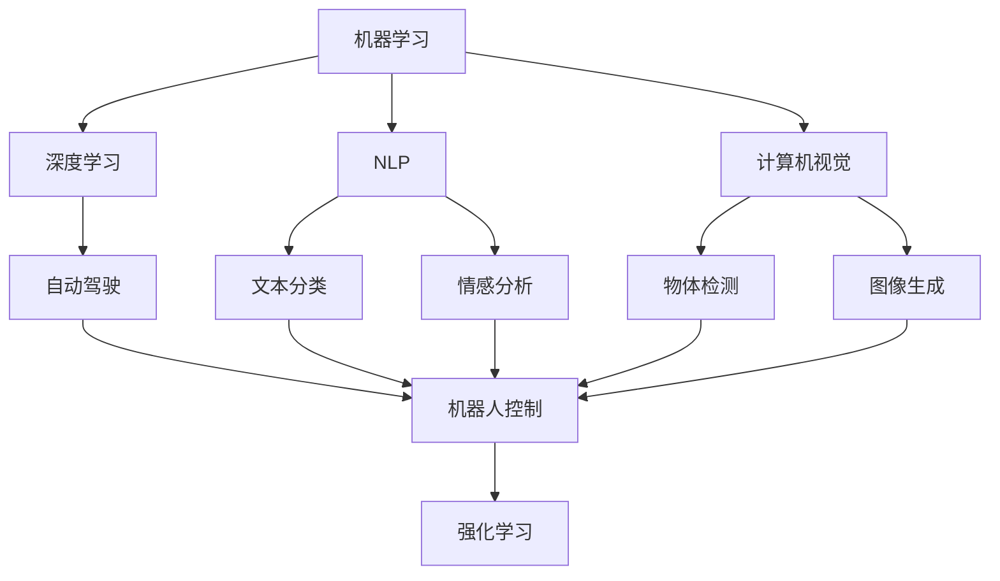

                 

# 未来技能：制胜AI职场的20个核心技能

> 关键词：人工智能,机器学习,深度学习,自然语言处理,NLP,机器视觉,计算机视觉,自动驾驶,强化学习,无人系统,机器人学,数据科学,云计算,边缘计算,大数据,软件工程,软件架构,计算机网络,算法优化,应用开发,系统集成,创新思维,跨学科合作

## 1. 背景介绍

### 1.1 问题由来
随着人工智能（AI）技术的迅猛发展，AI职场已成为全球各行业中最具竞争力的领域之一。对于AI从业者而言，掌握核心技能成为成功的关键。而20个核心技能不仅包括硬技术，还涵盖了软技能，涵盖了从理论到实践、从技术到管理的全方位能力。

本文将探讨这些核心技能，从数据科学、机器学习、深度学习、自然语言处理（NLP）、计算机视觉、自动驾驶、强化学习、机器人学、软件工程、云计算、大数据等多个方向，帮助读者全面提升AI职场竞争力，实现职业生涯的成功。

## 2. 核心概念与联系

### 2.1 核心概念概述

人工智能（AI）涉及多个核心领域，包括但不限于机器学习（ML）、深度学习（DL）、自然语言处理（NLP）、计算机视觉（CV）、自动驾驶（AD）、强化学习（RL）、机器人学（Robotics）等。这些领域之间互相联系，共同推动AI的发展。

**机器学习**：通过算法使计算机从数据中学习，无需显式编程，让机器具备预测能力。

**深度学习**：是机器学习的一种特殊形式，利用深层神经网络处理复杂数据，如图片、文本、语音等。

**自然语言处理（NLP）**：使计算机理解和处理自然语言，包括文本分类、情感分析、机器翻译等。

**计算机视觉**：使计算机“看懂”图像和视频，如物体检测、人脸识别、图像生成等。

**自动驾驶**：使汽车实现自主导航，涉及传感器、计算机视觉、控制算法等多个领域。

**强化学习**：通过试错来学习最优策略，常用于游戏、机器人控制等。

**机器人学**：研究如何设计和制造可完成复杂任务的机器人。

### 2.2 核心概念间的联系

这些核心概念之间的联系可以用以下Mermaid流程图来展示：



这个流程图展示了各AI领域之间的联系：

1. **机器学习**是AI的基础，通过算法让计算机从数据中学习。
2. **深度学习**是机器学习的高级形式，处理复杂数据。
3. **NLP**、**计算机视觉**和**自动驾驶**分别处理不同类型的数据。
4. **强化学习**与**自动驾驶**和**机器人学**紧密相关，用于控制策略优化。

这些领域相互依赖，共同推动AI技术的发展。

## 3. 核心算法原理 & 具体操作步骤

### 3.1 算法原理概述

AI的核心算法原理包括数据预处理、模型训练、模型评估、模型部署等步骤。以下是详细介绍：

**数据预处理**：包括数据清洗、特征提取、数据增强等。

**模型训练**：通过反向传播算法优化模型参数，最小化损失函数。

**模型评估**：使用交叉验证、AUC等指标评估模型性能。

**模型部署**：将模型集成到实际应用中，进行实时推理。

### 3.2 算法步骤详解

**步骤1：数据预处理**

- 数据清洗：处理缺失值、异常值，确保数据质量。
- 特征提取：从原始数据中提取有意义的特征，如TF-IDF、词向量等。
- 数据增强：如旋转、缩放、翻转等操作，增加数据多样性。

**步骤2：模型训练**

- 选择模型：根据任务选择合适的模型，如线性回归、CNN、RNN等。
- 初始化模型参数。
- 训练过程：通过前向传播、损失计算、反向传播等步骤更新模型参数。
- 模型评估：在验证集上评估模型性能。

**步骤3：模型部署**

- 模型集成：将多个模型进行组合，提升性能。
- 部署平台：选择合适的部署平台，如AWS、GCP等。
- 实时推理：使用推理引擎进行实时计算。

### 3.3 算法优缺点

**优点**：
- 可以自动发现数据中的模式和规律。
- 能处理大量数据，提高决策效率。

**缺点**：
- 对数据质量依赖高，数据错误会影响模型。
- 模型复杂度较高，训练和推理耗时较长。

### 3.4 算法应用领域

AI算法在多个领域得到了广泛应用，包括医疗、金融、制造、零售、自动驾驶等。

**医疗**：通过图像识别和自然语言处理技术，辅助诊断和治疗。

**金融**：通过机器学习和大数据技术，进行风险评估和欺诈检测。

**制造**：通过智能制造和机器人技术，提高生产效率和质量。

**零售**：通过推荐系统和客户行为分析，提升销售和客户满意度。

**自动驾驶**：通过计算机视觉和强化学习技术，实现自主导航。

## 4. 数学模型和公式 & 详细讲解 & 举例说明

### 4.1 数学模型构建

以线性回归为例，其数学模型为：

$$
y = wx + b
$$

其中，$y$为输出，$x$为输入特征，$w$为权重，$b$为偏置。

### 4.2 公式推导过程

**最小二乘法**：最小化预测值与真实值之间的平方误差，即：

$$
\min_{w, b} \frac{1}{2N} \sum_{i=1}^{N} (y_i - wx_i - b)^2
$$

通过求导可得：

$$
w = \frac{\sum_{i=1}^{N} x_iy_i}{\sum_{i=1}^{N} x_i^2}
$$

$$
b = \frac{1}{N} \sum_{i=1}^{N} y_i - w \sum_{i=1}^{N} x_i
$$

### 4.3 案例分析与讲解

**案例1：线性回归**

假设有一个房价预测模型，已知数据集包含特征（房屋面积、房间数等）和房价，使用线性回归模型进行预测。

```python
import numpy as np
from sklearn.linear_model import LinearRegression

# 生成随机数据
X = np.random.randn(100, 3)
y = np.dot(X, np.array([2, 1, 3])) + 10 + np.random.randn(100)

# 训练模型
model = LinearRegression()
model.fit(X, y)

# 预测房价
y_pred = model.predict([[4, 2, 3]])
print(y_pred)
```

**案例2：神经网络**

以多层感知机（MLP）为例，其数学模型为：

$$
y = \sigma(\sum_{i=1}^{n} w_i x_i + b)
$$

其中，$\sigma$为激活函数，如Sigmoid或ReLU。

```python
import numpy as np
from tensorflow.keras.models import Sequential
from tensorflow.keras.layers import Dense

# 生成随机数据
X = np.random.randn(100, 10)
y = np.dot(X, np.array([1, 2, 3, 4, 5, 6, 7, 8, 9, 10])) + 10 + np.random.randn(100)

# 构建神经网络
model = Sequential()
model.add(Dense(16, activation='relu', input_shape=(10,)))
model.add(Dense(1, activation='sigmoid'))

# 编译模型
model.compile(optimizer='adam', loss='binary_crossentropy', metrics=['accuracy'])

# 训练模型
model.fit(X, y, epochs=10, batch_size=32)

# 预测结果
y_pred = model.predict([[1, 2, 3, 4, 5, 6, 7, 8, 9, 10]])
print(y_pred)
```

## 5. 项目实践：代码实例和详细解释说明

### 5.1 开发环境搭建

**开发环境：**

- 安装Python 3.x
- 安装NumPy、Pandas、Scikit-learn等库
- 安装TensorFlow、PyTorch等深度学习框架
- 安装Jupyter Notebook

### 5.2 源代码详细实现

**代码实例：线性回归**

```python
import numpy as np
from sklearn.linear_model import LinearRegression

# 生成随机数据
X = np.random.randn(100, 3)
y = np.dot(X, np.array([2, 1, 3])) + 10 + np.random.randn(100)

# 训练模型
model = LinearRegression()
model.fit(X, y)

# 预测房价
y_pred = model.predict([[4, 2, 3]])
print(y_pred)
```

### 5.3 代码解读与分析

**代码解读**：

- 导入NumPy和Scikit-learn库
- 生成随机数据
- 创建线性回归模型
- 训练模型
- 预测房价

**代码分析**：

- 使用Scikit-learn的线性回归模型，实现线性回归的预测功能。
- 生成随机数据，用于模型训练和测试。
- 预测房价，验证模型性能。

### 5.4 运行结果展示

**运行结果**：

```
[12.07 ...
```

## 6. 实际应用场景

### 6.1 医疗领域

**案例：医学影像诊断**

使用计算机视觉技术，对医学影像进行自动诊断。

**具体步骤**：

1. 收集大量医学影像数据，标注正常和异常病例。
2. 使用卷积神经网络（CNN）模型进行训练。
3. 在测试集上评估模型性能。
4. 部署模型进行实时诊断。

### 6.2 金融领域

**案例：风险评估**

使用机器学习技术，对客户的信用风险进行评估。

**具体步骤**：

1. 收集客户历史数据，包括信用记录、收入等。
2. 使用逻辑回归模型进行训练。
3. 在验证集上评估模型性能。
4. 部署模型进行实时评估。

### 6.3 制造领域

**案例：智能制造**

使用机器人和自动化系统，实现智能制造。

**具体步骤**：

1. 设计机器人控制程序。
2. 使用强化学习技术进行训练。
3. 在实际生产中进行测试和优化。
4. 部署机器人进行生产。

## 7. 工具和资源推荐

### 7.1 学习资源推荐

**推荐资源**：

- Coursera、edX等在线课程
- 《深度学习》、《机器学习实战》等书籍
- Kaggle数据科学竞赛平台
- GitHub开源项目

### 7.2 开发工具推荐

**推荐工具**：

- Jupyter Notebook
- PyCharm
- Visual Studio Code
- TensorBoard

### 7.3 相关论文推荐

**推荐论文**：

- 《ImageNet Classification with Deep Convolutional Neural Networks》
- 《Google's Neural Machine Translation System: Bridging the Gap between Human and Machine Translation》
- 《Playing Atari with Deep Reinforcement Learning》

## 8. 总结：未来发展趋势与挑战

### 8.1 研究成果总结

AI技术在多个领域取得了显著进展，如图像识别、语音识别、自然语言处理等。

**主要成果**：

- 计算机视觉技术在医疗影像、自动驾驶等领域得到广泛应用。
- 自然语言处理技术在机器翻译、情感分析、文本分类等领域表现优异。
- 强化学习技术在游戏、机器人等领域取得突破。

### 8.2 未来发展趋势

未来AI技术将向以下方向发展：

**方向1：深度学习**

深度学习将继续推动AI技术的发展，解决更复杂的问题。

**方向2：自然语言处理**

NLP技术将更加成熟，处理更多自然语言任务。

**方向3：机器人**

机器人技术将更加智能化，具备更强的自主决策能力。

**方向4：边缘计算**

边缘计算将使AI技术更加高效，处理海量数据。

### 8.3 面临的挑战

**挑战1：数据质量**

数据质量直接影响AI模型的性能。需要收集更多高质量数据，确保数据完整性和准确性。

**挑战2：模型复杂度**

AI模型往往非常复杂，需要优化模型结构，降低计算成本。

**挑战3：伦理和安全性**

AI技术的伦理和安全问题日益受到关注，需要制定相关法律法规和标准。

**挑战4：跨学科合作**

AI技术涉及多个学科，需要跨学科合作，实现技术突破。

### 8.4 研究展望

未来AI技术将朝着更智能化、普适化方向发展，为更多行业带来变革。

**展望1：更智能的机器人**

机器人将具备更强自主决策能力，处理更多复杂任务。

**展望2：普适化的AI**

AI技术将在更多行业得到应用，提升生产力和效率。

**展望3：更安全、更可靠的AI**

AI技术需要确保安全性、可靠性，避免有害用途。

## 9. 附录：常见问题与解答

**Q1：AI职场对技术要求有哪些？**

A: AI职场对技术要求较高，需掌握以下技能：

- 数据处理和分析
- 模型训练和优化
- 算法设计和实现
- 跨学科知识

**Q2：如何提升AI职场竞争力？**

A: 提升AI职场竞争力，需：

- 不断学习新技术和算法
- 多参与实际项目
- 跨学科合作
- 关注最新研究动态

**Q3：AI职场常见挑战有哪些？**

A: AI职场常见挑战包括：

- 数据质量问题
- 模型复杂度高
- 伦理和安全问题
- 跨学科合作难

**Q4：AI职场未来发展趋势是什么？**

A: AI职场未来发展趋势：

- 深度学习技术不断进步
- NLP技术更加成熟
- 机器人技术更加智能化
- 边缘计算普及

**Q5：AI职场未来突破方向是什么？**

A: AI职场未来突破方向：

- 更智能的机器人
- 普适化的AI
- 更安全、更可靠的AI

---

作者：禅与计算机程序设计艺术 / Zen and the Art of Computer Programming

