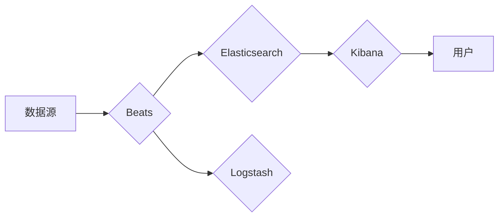

# Beats原理与代码实例讲解

> 关键词：Beats, ELK stack, 日志收集，数据聚合，日志分析，数据处理，Kafka，Elasticsearch，Kibana

## 1. 背景介绍

在现代企业级应用中，日志是重要的数据来源，记录了应用的运行状态、错误信息、性能指标等关键信息。对日志的有效收集、存储、分析和可视化是确保系统稳定运行、快速定位问题、优化性能的关键。Beats是ELK stack（Elasticsearch, Logstash, Kibana）生态系统中的一个关键组件，专门用于收集、聚合和传输日志数据。本文将深入讲解Beats的原理、配置和使用方法，并通过实例演示如何将Beats与其他ELK stack组件结合，构建一个完整的日志分析系统。

### 1.1 问题的由来

随着信息化程度的提高，企业级应用的规模和复杂性不断增长，日志数据量也呈爆炸式增长。传统的日志收集方式，如简单的日志滚动和日志文件传输，已经无法满足大规模日志管理的需求。因此，需要一个高效、可靠、可扩展的日志收集和分析平台。

### 1.2 研究现状

ELK stack是当前最流行的日志分析平台之一，由Elasticsearch、Logstash和Kibana三个组件组成。Beats则作为ELK stack的前端组件，负责收集和传输日志数据。ELK stack以其强大的搜索、分析和可视化能力，以及开源社区的活跃支持，成为日志管理领域的首选方案。

### 1.3 研究意义

Beats作为ELK stack的前端组件，在日志管理中扮演着至关重要的角色。掌握Beats的原理和使用方法，可以帮助开发者和运维人员构建高效、可靠的日志收集系统，从而提升系统的可维护性和可观测性。

### 1.4 本文结构

本文将按照以下结构进行讲解：

- 第2章介绍Beats的核心概念和架构。
- 第3章详细讲解Beats的工作原理和操作步骤。
- 第4章通过数学模型和公式描述Beats的数据处理过程。
- 第5章通过代码实例演示如何使用Beats进行日志收集。
- 第6章探讨Beats的实际应用场景和未来发展趋势。
- 第7章推荐Beats相关的学习资源、开发工具和参考文献。
- 第8章总结Beats的研究成果和未来挑战。
- 第9章提供常见问题与解答。

## 2. 核心概念与联系

### 2.1 核心概念

- **Beats**：一个轻量级的数据收集器，能够从各种数据源（如系统日志、网络流量、容器日志等）收集数据，并将其发送到ELK stack的其他组件。
- **ELK stack**：由Elasticsearch、Logstash和Kibana组成的日志分析平台，用于搜索、分析和可视化日志数据。
- **日志**：记录系统运行状态、错误信息、性能指标等信息的文本文件。

### 2.2 核心概念原理和架构的 Mermaid 流程图



在上述流程图中，Beats作为数据收集器，从不同的数据源收集数据，然后发送到Elasticsearch和Kibana进行存储、分析和可视化。Logstash作为数据预处理工具，可以对数据进行转换和过滤，以满足特定的数据处理需求。

## 3. 核心算法原理 & 具体操作步骤

### 3.1 算法原理概述

Beats的工作原理可以概括为以下几个步骤：

1. 数据收集：Beats通过插件的方式，从不同的数据源收集数据。
2. 数据处理：对收集到的数据进行预处理，如清洗、过滤、格式化等。
3. 数据传输：将处理后的数据发送到ELK stack的其他组件，如Elasticsearch或Logstash。
4. 数据存储和分析：Elasticsearch存储和索引数据，Kibana提供数据分析和可视化功能。

### 3.2 算法步骤详解

- **数据收集**：Beats提供了多种插件，如Filebeat、Winlogbeat、Metricbeat等，分别用于收集文件日志、Windows事件日志和系统指标等。
- **数据处理**：Beats内置了多种数据处理模块，如字段提取、正则表达式、JSON解析等，可以灵活处理不同格式的日志数据。
- **数据传输**：Beats支持多种传输协议，如TCP、UDP、HTTP、Kafka等，可以将数据发送到不同的目的地。
- **数据存储和分析**：Beats发送的数据可以存储在Elasticsearch中，并通过Kibana进行查询和分析。

### 3.3 算法优缺点

**优点**：

- **轻量级**：Beats体积小巧，对系统资源占用少。
- **灵活**：支持多种数据源和传输协议，易于集成。
- **可扩展**：可以轻松添加新的插件，扩展功能。

**缺点**：

- **功能相对单一**：Beats主要专注于数据收集和传输，数据处理和分析功能相对较弱。
- **对配置要求高**：Beats的配置较为复杂，需要一定的学习成本。

### 3.4 算法应用领域

Beats广泛应用于以下领域：

- **系统监控**：收集系统日志、网络流量、性能指标等数据，实时监控系统状态。
- **日志分析**：收集和存储应用日志，进行分析和可视化，快速定位问题。
- **安全审计**：收集安全日志，分析异常行为，提高安全性。
- **数据采集**：从各种数据源收集数据，为数据分析提供数据基础。

## 4. 数学模型和公式 & 详细讲解 & 举例说明

### 4.1 数学模型构建

Beats的数据处理过程可以抽象为一个数学模型，包括以下步骤：

1. **数据清洗**：对原始数据进行清洗，去除无关信息，保留关键信息。
2. **数据转换**：将清洗后的数据转换为统一的格式。
3. **数据聚合**：对数据进行聚合，形成统计数据。

### 4.2 公式推导过程

假设原始数据为 $X$，清洗后的数据为 $X'$，转换后的数据为 $X''$，聚合后的数据为 $X'''$，则有：

$$
X' = \text{clean}(X)
$$

$$
X'' = \text{transform}(X')
$$

$$
X''' = \text{aggregate}(X'')
$$

### 4.3 案例分析与讲解

以下是一个简单的Beats数据处理实例：

**原始数据**：

```
time:2023-04-01T12:00:00+00:00
level:info
message:Application started
```

**数据处理过程**：

1. **数据清洗**：去除无用的信息，如时间戳和日志级别。
2. **数据转换**：将清洗后的数据转换为JSON格式。
3. **数据聚合**：对消息进行聚合。

**处理后的数据**：

```json
{
  "message": "Application started"
}
```

## 5. 项目实践：代码实例和详细解释说明

### 5.1 开发环境搭建

在开始使用Beats之前，需要搭建以下开发环境：

1. 安装Go语言环境。
2. 下载并解压Beats安装包。
3. 配置Beats的配置文件。

### 5.2 源代码详细实现

以下是一个简单的Filebeat配置文件示例：

```yaml
filebeat.inputs:
  - type: log
    enabled: true
    paths:
      - /var/log/myapp.log
    fields:
      application: "myapp"
      service: "webserver"
    tags: ["production", "myapp"]

output.elasticsearch:
  hosts: ["localhost:9200"]
```

在上面的配置中，Filebeat配置了以下内容：

- 收集类型为日志的文件。
- 收集路径为`/var/log/myapp.log`。
- 设置字段`application`和`service`。
- 将数据发送到本地的Elasticsearch实例。

### 5.3 代码解读与分析

在上面的配置文件中，我们使用了`filebeat.inputs`来配置数据源，使用`output.elasticsearch`来配置输出目的地。通过`paths`指定要收集的文件路径，通过`fields`设置自定义字段，通过`tags`设置标签。

### 5.4 运行结果展示

启动Filebeat后，可以观察到数据被发送到Elasticsearch中。在Kibana中，可以创建一个索引模式，并使用Kibana的搜索功能查询数据。

## 6. 实际应用场景

### 6.1 系统监控

Beats可以用于收集系统日志、网络流量、性能指标等数据，为系统监控提供数据支持。通过Elasticsearch和Kibana，可以实现对系统运行状态的实时监控和可视化。

### 6.2 日志分析

Beats可以用于收集和存储应用日志，通过Elasticsearch和Kibana，可以快速定位问题、分析性能瓶颈、优化系统配置。

### 6.3 安全审计

Beats可以用于收集安全日志，通过Elasticsearch和Kibana，可以分析异常行为、识别潜在的安全威胁。

### 6.4 未来应用展望

随着Beats的不断发展和完善，未来其在以下领域的应用前景更加广阔：

- **容器监控**：随着容器技术的普及，Beats可以用于收集容器日志，为容器监控提供数据支持。
- **微服务监控**：Beats可以用于收集微服务日志，为微服务监控提供数据基础。
- **物联网监控**：Beats可以用于收集物联网设备日志，为物联网监控提供数据支持。

## 7. 工具和资源推荐

### 7.1 学习资源推荐

- [Beats官方文档](https://www.elastic.co/guide/en/beats/beats/latest/index.html)
- [Elastic Stack官方文档](https://www.elastic.co/guide/en/elasticsearch/reference/current/index.html)
- [Kibana官方文档](https://www.elastic.co/guide/en/kibana/current/index.html)

### 7.2 开发工具推荐

- [Go语言环境](https://golang.org/dl/)
- [Beats安装包](https://www.elastic.co/cn/beats)
- [Elasticsearch安装包](https://www.elastic.co/cn/elasticsearch)
- [Kibana安装包](https://www.elastic.co/cn/kibana)

### 7.3 相关论文推荐

- [The ELK stack: ELasticsearch, Logstash, and Kibana](https://doi.org/10.1007/s00778-014-0213-8)
- [Logstash: The Data Pipeline](https://www.elastic.co/cn/case-studies/logstash-the-data-pipeline)

## 8. 总结：未来发展趋势与挑战

### 8.1 研究成果总结

Beats作为ELK stack的前端组件，在日志管理中扮演着至关重要的角色。本文深入讲解了Beats的原理、配置和使用方法，并通过实例演示了如何将Beats与其他ELK stack组件结合，构建一个完整的日志分析系统。

### 8.2 未来发展趋势

未来，Beats将继续朝着以下方向发展：

- **功能扩展**：增加新的插件，支持更多类型的数据源和传输协议。
- **性能优化**：提高数据收集和处理效率，降低资源占用。
- **易用性提升**：简化配置，降低使用门槛。

### 8.3 面临的挑战

Beats在发展过程中也面临着一些挑战：

- **数据安全**：确保收集的数据安全，防止数据泄露。
- **性能瓶颈**：优化数据收集和处理过程，提高性能。
- **可扩展性**：提高系统的可扩展性，支持大规模数据。

### 8.4 研究展望

随着大数据和人工智能技术的不断发展，Beats将在日志管理领域发挥越来越重要的作用。未来，Beats将与其他人工智能技术相结合，为日志分析提供更加智能化的解决方案。

## 9. 附录：常见问题与解答

**Q1：Beats支持哪些数据源？**

A：Beats支持多种数据源，包括文件日志、Windows事件日志、系统指标、网络流量等。

**Q2：如何配置Beats的输出目的地？**

A：Beats的输出目的地可以通过配置文件中的`output`模块进行配置，支持多种输出目的地，如Elasticsearch、Logstash、Kafka等。

**Q3：如何自定义Beats的字段？**

A：Beats的`fields`模块允许自定义字段，用于存储额外的信息。

**Q4：如何将Beats与其他ELK stack组件集成？**

A：Beats可以将数据发送到Elasticsearch、Logstash、Kibana等ELK stack组件。通过配置文件中的`output`模块，可以指定输出目的地。

**Q5：Beats的配置文件在哪里？**

A：Beats的配置文件位于`/etc/filebeat/filebeat.yml`（对于Filebeat）或相应的配置文件路径。

作者：禅与计算机程序设计艺术 / Zen and the Art of Computer Programming