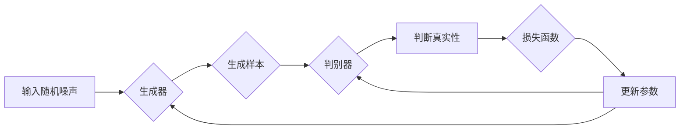

> GAN, 生成对抗网络, 对抗学习, 图像生成, 生成模型, 计算机视觉, 深度学习, 微调

# Generative Adversarial Networks (GAN) 原理与代码实战案例讲解

GAN，即生成对抗网络，是深度学习领域的一项革命性技术，它通过两个神经网络——生成器和判别器——之间的对抗训练，实现了从数据中学习并生成高质量样本的目的。本文将深入探讨GAN的原理，并通过实际的代码实战案例，展示如何使用GAN进行图像生成。

## 1. 背景介绍

### 1.1 问题的由来

生成模型在计算机视觉、自然语言处理等领域有着广泛的应用，例如图像合成、文本生成、语音合成等。传统的生成模型如变分自编码器（VAEs）在生成质量上取得了显著的成果，但它们往往在样本的多样性和真实性上存在不足。

GAN的出现为生成模型带来了新的思路，它通过对抗学习的方式，使得生成模型能够生成更加丰富、真实的样本。GAN的核心思想是利用两个神经网络——生成器和判别器——之间的对抗关系，使得生成器生成的样本越来越接近真实数据。

### 1.2 研究现状

GAN自2014年提出以来，已经取得了许多突破性的成果。在图像生成领域，GAN已经能够生成逼真的照片、卡通、艺术作品等；在自然语言处理领域，GAN能够生成流畅的文本、诗歌等。

### 1.3 研究意义

GAN在图像生成、自然语言处理等领域具有广泛的应用前景，对于推动人工智能技术的发展具有重要意义。

### 1.4 本文结构

本文将分为以下几个部分：
- 介绍GAN的核心概念与联系。
- 阐述GAN的原理和具体操作步骤。
- 分析GAN的数学模型和公式。
- 通过代码实战案例展示GAN的应用。
- 探讨GAN在实际应用场景中的案例。
- 展望GAN的未来发展趋势与挑战。

## 2. 核心概念与联系

### 2.1 核心概念

- **生成器（Generator）**：生成器是一个神经网络，它的目标是从随机噪声中生成与真实数据分布相似的样本。
- **判别器（Discriminator）**：判别器是一个神经网络，它的目标是判断输入的数据是真实样本还是生成器生成的假样本。
- **对抗训练**：生成器和判别器通过对抗训练的方式相互竞争，生成器试图生成更难被判别器识别的样本，而判别器则试图更准确地识别样本的真实性。

### 2.2 Mermaid 流程图



## 3. 核心算法原理 & 具体操作步骤

### 3.1 算法原理概述

GAN通过生成器和判别器之间的对抗训练，使得生成器生成的样本越来越接近真实数据。具体来说，生成器学习如何生成样本，而判别器学习如何区分真实样本和生成样本。两个网络在训练过程中相互竞争，生成器试图生成更加难以被识别的样本，而判别器则试图提高识别准确率。

### 3.2 算法步骤详解

1. 初始化生成器和判别器。
2. 从噪声空间采样，生成一个样本。
3. 将生成的样本和真实样本送入判别器。
4. 判别器输出一个概率值，表示输入样本的真实性。
5. 计算生成器和判别器的损失函数。
6. 使用梯度下降法更新生成器和判别器的参数。
7. 重复步骤2-6，直到满足停止条件。

### 3.3 算法优缺点

#### 优点

- 能够生成高质量、多样化的样本。
- 无需真实标签数据，可以处理无标签数据。
- 能够生成与真实数据分布相似的样本。

#### 缺点

- 训练不稳定，容易陷入模式崩溃。
- 损失函数难以优化，可能导致生成器生成样本与真实样本过于相似，缺乏多样性。
- 难以确定训练的停止条件。

### 3.4 算法应用领域

GAN在以下领域有广泛的应用：

- 图像生成：生成逼真的照片、卡通、艺术作品等。
- 视频生成：生成视频序列，例如动作捕捉、视频特效等。
- 文本生成：生成诗歌、故事、对话等。
- 语音生成：生成逼真的语音波形。

## 4. 数学模型和公式 & 详细讲解 & 举例说明

### 4.1 数学模型构建

GAN的数学模型可以表示为：

$$
\begin{aligned}
\min_{\mathbf{G}} \max_{\mathbf{D}} V(\mathbf{G}, \mathbf{D}) &= \mathbb{E}_{\mathbf{z} \sim p_{\mathbf{z}}}[\log \mathbf{D}(\mathbf{G}(\mathbf{z}))] + \mathbb{E}_{\mathbf{x} \sim p_{\text{data}}}[\log (1 - \mathbf{D}(\mathbf{x}))] \\
\end{aligned}
$$

其中，$\mathbf{G}$ 表示生成器，$\mathbf{D}$ 表示判别器，$p_{\mathbf{z}}$ 表示噪声分布，$p_{\text{data}}$ 表示真实数据分布。

### 4.2 公式推导过程

GAN的损失函数是生成器和判别器之间对抗博弈的结果。生成器的损失函数是最大化判别器对其生成的样本的判断概率，而判别器的损失函数是最大化对真实样本和生成样本的判断概率。

### 4.3 案例分析与讲解

以下是一个简单的GAN模型案例，用于生成手写数字图像。

```python
import torch
import torch.nn as nn
import torch.optim as optim

# 生成器
class Generator(nn.Module):
    def __init__(self, input_dim, output_dim):
        super(Generator, self).__init__()
        self.net = nn.Sequential(
            nn.Linear(input_dim, 256),
            nn.ReLU(),
            nn.Linear(256, output_dim),
            nn.Tanh()
        )

    def forward(self, x):
        return self.net(x)

# 判别器
class Discriminator(nn.Module):
    def __init__(self, input_dim):
        super(Discriminator, self).__init__()
        self.net = nn.Sequential(
            nn.Linear(input_dim, 512),
            nn.LeakyReLU(0.2),
            nn.Linear(512, 1),
            nn.Sigmoid()
        )

    def forward(self, x):
        return self.net(x)

# 初始化模型和优化器
generator = Generator(100, 28*28)
discriminator = Discriminator(28*28)
optimizer_G = optim.Adam(generator.parameters(), lr=0.0002)
optimizer_D = optim.Adam(discriminator.parameters(), lr=0.0002)

# 训练过程
for epoch in range(100):
    # 生成器生成样本
    z = torch.randn(64, 100)
    gen_samples = generator(z).view(64, 1, 28, 28)
    
    # 判别器判断真实样本和生成样本
    real_samples = torch.randn(64, 28*28)
    fake_samples = gen_samples.detach()
    
    real_out = discriminator(real_samples).mean()
    fake_out = discriminator(fake_samples).mean()
    
    # 计算损失函数
    loss_G = torch.mean((fake_out - 1)**2)
    loss_D = torch.mean((real_out - 1)**2) + torch.mean(fake_out**2)
    
    # 反向传播和优化
    optimizer_G.zero_grad()
    loss_G.backward()
    optimizer_G.step()
    
    optimizer_D.zero_grad()
    loss_D.backward()
    optimizer_D.step()
    
    # 打印训练信息
    if epoch % 10 == 0:
        print(f'Epoch {epoch}, Loss G: {loss_G.item()}, Loss D: {loss_D.item()}')
```

在上面的代码中，我们定义了生成器和判别器的网络结构，并实现了训练过程。生成器从100维的随机噪声中生成28x28的手写数字图像，判别器则判断输入图像是真实样本还是生成样本。通过优化生成器和判别器的参数，使得生成器生成的图像越来越接近真实图像。

## 5. 项目实践：代码实例和详细解释说明

### 5.1 开发环境搭建

为了运行上面的代码，需要以下开发环境：

- Python 3.6+
- PyTorch 1.0+
- NumPy 1.18+

### 5.2 源代码详细实现

上面已经给出了GAN的代码实例，下面将详细解释代码中的关键部分。

#### 生成器和判别器

生成器和判别器都是神经网络，使用PyTorch定义。生成器从100维的随机噪声中生成28x28的手写数字图像，判别器则判断输入图像是真实样本还是生成样本。

#### 训练过程

训练过程主要包括以下步骤：

1. 生成器生成样本。
2. 判别器判断真实样本和生成样本。
3. 计算生成器和判别器的损失函数。
4. 反向传播和优化生成器和判别器的参数。

#### 打印训练信息

每隔10个epoch，打印训练信息，包括当前epoch、生成器和判别器的损失函数。

### 5.3 代码解读与分析

上面的代码展示了如何使用PyTorch实现GAN，其中关键部分如下：

- `Generator` 类定义了生成器网络结构。
- `Discriminator` 类定义了判别器网络结构。
- `real_samples` 和 `fake_samples` 分别表示真实样本和生成样本。
- `real_out` 和 `fake_out` 分别表示判别器对真实样本和生成样本的判断概率。
- `loss_G` 和 `loss_D` 分别表示生成器和判别器的损失函数。
- `optimizer_G` 和 `optimizer_D` 分别表示生成器和判别器的优化器。

### 5.4 运行结果展示

运行上面的代码，训练过程将开始。经过一定数量的epoch后，生成器将能够生成越来越接近真实图像的样本。

## 6. 实际应用场景

### 6.1 图像生成

GAN在图像生成领域有着广泛的应用，例如：

- 生成逼真的照片：用于艺术创作、图像修复、数据增强等。
- 生成卡通或艺术作品：用于动画制作、游戏开发等。
- 生成视频序列：用于动作捕捉、视频特效等。

### 6.2 文本生成

GAN在文本生成领域也有着广泛的应用，例如：

- 生成诗歌：用于文学创作、艺术创作等。
- 生成对话：用于聊天机器人、虚拟助手等。
- 生成新闻报道：用于新闻摘要、自动生成内容等。

### 6.3 语音生成

GAN在语音生成领域也有着广泛的应用，例如：

- 生成逼真的语音波形：用于语音合成、语音克隆等。
- 生成语音变声：用于电影、游戏、虚拟现实等。

## 7. 工具和资源推荐

### 7.1 学习资源推荐

- 《Generative Adversarial Nets》论文：GAN的原始论文，详细介绍了GAN的原理和实现方法。
- 《Unsupervised Representation Learning with Deep Convolutional Generative Adversarial Networks》论文：介绍了DCGAN，是早期GAN模型之一。
- 《Improved Techniques for Training GANs》论文：介绍了GAN的改进技术，如Wasserstein GAN、LSGAN等。

### 7.2 开发工具推荐

- PyTorch：用于实现GAN的深度学习框架。
- TensorFlow：另一个用于实现GAN的深度学习框架。
- Keras：一个高级神经网络API，可以方便地实现GAN。

### 7.3 相关论文推荐

- Generative Adversarial Nets
- Unsupervised Representation Learning with Deep Convolutional Generative Adversarial Networks
- Improved Techniques for Training GANs
- Wasserstein GAN
- LSGAN
- WGAN-GP

## 8. 总结：未来发展趋势与挑战

### 8.1 研究成果总结

GAN自提出以来，已经取得了许多突破性的成果，为生成模型的发展带来了新的思路。GAN能够生成高质量、多样化的样本，在图像生成、文本生成、语音生成等领域有着广泛的应用。

### 8.2 未来发展趋势

未来，GAN技术的发展趋势主要包括：

- 更好的训练稳定性：通过改进训练算法和模型结构，提高GAN的训练稳定性，避免模式崩溃。
- 更好的生成质量：通过改进生成器和判别器的网络结构，提高GAN的生成质量，生成更加真实、丰富的样本。
- 更广泛的应用领域：将GAN应用于更多领域，如生物信息学、化学、材料科学等。

### 8.3 面临的挑战

GAN在发展过程中也面临着一些挑战：

- 训练难度大：GAN的训练过程容易陷入模式崩溃，需要精心设计训练算法和参数。
- 模型可解释性差：GAN的内部工作机制难以解释，难以理解模型的生成过程。
- 能量消耗大：GAN的训练过程需要大量的计算资源，能量消耗较大。

### 8.4 研究展望

未来，GAN的研究将重点关注以下方面：

- 提高GAN的训练稳定性和生成质量。
- 提高GAN的可解释性。
- 降低GAN的能量消耗。
- 将GAN应用于更多领域。

## 9. 附录：常见问题与解答

**Q1：GAN的原理是什么？**

A：GAN的原理是利用生成器和判别器之间的对抗关系，使得生成器生成的样本越来越接近真实数据。生成器从噪声空间采样，生成样本，判别器则判断样本的真实性。两个网络在训练过程中相互竞争，生成器试图生成更难被识别的样本，而判别器则试图提高识别准确率。

**Q2：GAN有哪些优缺点？**

A：GAN的优点是可以生成高质量、多样化的样本，无需真实标签数据，可以处理无标签数据。缺点是训练不稳定，容易陷入模式崩溃，损失函数难以优化，可能导致生成器生成样本与真实样本过于相似，缺乏多样性。

**Q3：GAN有哪些应用领域？**

A：GAN在图像生成、文本生成、语音生成等领域有着广泛的应用。

**Q4：如何解决GAN的训练问题？**

A：为了解决GAN的训练问题，可以采用以下方法：

- 使用改进的训练算法，如WGAN、LSGAN等。
- 使用数据增强技术，如随机翻转、裁剪等。
- 使用正则化技术，如L2正则化、Dropout等。

**Q5：GAN与VAE有何区别？**

A：GAN和VAE都是生成模型，但它们的工作原理和目标不同。VAE通过编码器和解码器学习数据的潜在空间，生成样本。GAN通过生成器和判别器之间的对抗关系生成样本。

作者：禅与计算机程序设计艺术 / Zen and the Art of Computer Programming