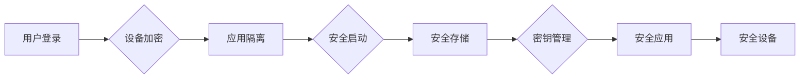

# Knox原理与代码实例讲解

> 关键词：Knox, 数据安全，访问控制，Android，沙箱，微隔离，代码混淆，密钥管理

## 1. 背景介绍

随着移动互联网的快速发展，移动应用的数据安全问题日益凸显。用户隐私泄露、数据被非法访问等事件频发，引发了社会各界的广泛关注。为了保障移动应用的数据安全，许多操作系统和平台都引入了数据安全机制。Android操作系统中的Knox就是其中之一。Knox提供了一套完整的访问控制和安全机制，旨在为Android应用提供数据保护和微隔离环境。本文将深入探讨Knox的原理，并通过代码实例讲解其使用方法。

### 1.1 Knox的由来

Knox是三星公司为Android操作系统开发的一套安全解决方案，旨在为移动设备提供强大的安全功能，包括设备加密、应用程序隔离、安全启动、应用安全存储等。Knox自2010年首次亮相以来，已经经历了多个版本的更新，功能越来越强大。

### 1.2 研究意义

了解Knox的原理和使用方法对于移动应用开发者来说至关重要。通过Knox，开发者可以为自己的应用构建一个更加安全的环境，保护用户数据不被非法访问，提高应用的可靠性。此外，Knox还为企业提供了移动设备管理(MDM)的功能，方便企业对员工设备进行统一管理和监控。

## 2. 核心概念与联系

### 2.1 Knox核心概念原理

Knox的核心概念可以概括为以下几点：

- **设备加密**：对整个设备进行加密，保护设备中的数据不被未授权访问。
- **应用隔离**：将应用和数据与系统其他部分隔离开来，提高安全性。
- **安全启动**：确保设备启动过程中不会受到恶意软件的干扰。
- **安全存储**：提供安全存储区域，用于存储敏感数据。
- **密钥管理**：管理密钥的生成、存储和分发。

以下为Knox核心概念原理的Mermaid流程图：



### 2.2 Knox架构

Knox的架构可以分为以下几个层次：

- **硬件层**：包括安全启动芯片、安全存储芯片等硬件安全组件。
- **操作系统层**：包括Android内核、安全扩展模块等，负责实现设备加密、安全启动等功能。
- **应用层**：包括安全应用和Knox API，供开发者使用Knox功能。

## 3. 核心算法原理 & 具体操作步骤

### 3.1 算法原理概述

Knox的核心算法原理主要包括以下几部分：

- **设备加密**：使用AES算法对设备进行加密，保护设备中的数据不被未授权访问。
- **应用隔离**：通过Android的沙箱机制，将应用和数据与系统其他部分隔离开来。
- **安全启动**：使用TPM（Trusted Platform Module）等硬件安全组件，确保设备启动过程中不会受到恶意软件的干扰。
- **安全存储**：使用EFS（Encrypted File System）等安全文件系统，保护敏感数据不被未授权访问。
- **密钥管理**：使用硬件安全模块（HSM）等硬件安全组件，管理密钥的生成、存储和分发。

### 3.2 算法步骤详解

以下是Knox主要功能的操作步骤：

- **设备加密**：在设备设置中启用设备加密功能，系统将自动使用AES算法对设备进行加密。
- **应用隔离**：在AndroidManifest.xml文件中，指定需要隔离的应用，并使用Knox API实现应用数据的隔离存储。
- **安全启动**：在设备启动过程中，TPM等硬件安全组件将验证设备的安全性，确保启动过程中不会受到恶意软件的干扰。
- **安全存储**：使用EFS等安全文件系统，将敏感数据存储在安全区域，确保数据安全。
- **密钥管理**：使用HSM等硬件安全组件，生成、存储和分发密钥，确保密钥安全。

### 3.3 算法优缺点

Knox算法的优点包括：

- **安全性高**：使用多种安全机制，保护设备和应用数据不被未授权访问。
- **易于使用**：Knox API简单易用，方便开发者集成和使用。
- **可靠性强**：Knox基于Android操作系统，具有良好的兼容性和稳定性。

Knox算法的缺点包括：

- **性能影响**：设备加密和安全启动等操作可能会对设备性能产生一定影响。
- **开发复杂度**：使用Knox API需要一定的开发经验，对于新手来说可能有一定难度。

### 3.4 算法应用领域

Knox算法广泛应用于以下领域：

- **企业移动设备管理(MDM)**：企业可以使用Knox对员工设备进行统一管理和监控，确保企业数据安全。
- **金融移动应用**：金融移动应用可以使用Knox保护用户数据和交易安全。
- **移动医疗应用**：移动医疗应用可以使用Knox保护患者数据安全。

## 4. 数学模型和公式 & 详细讲解 & 举例说明

### 4.1 数学模型构建

Knox的数学模型主要包括以下几部分：

- **设备加密**：使用AES算法对设备进行加密，加密过程可以用以下公式表示：

  $$
  \text{加密}(data, key) = AES(data, key)
  $$

  其中，$data$ 为待加密数据，$key$ 为加密密钥。

- **应用隔离**：使用Android的沙箱机制，将应用和数据与系统其他部分隔离开来。沙箱机制可以用以下公式表示：

  $$
  \text{沙箱}(app, data) = \text{隔离}(app, data)
  $$

  其中，$app$ 为应用，$data$ 为应用数据。

### 4.2 公式推导过程

由于Knox的算法原理较为简单，这里不再进行公式推导。

### 4.3 案例分析与讲解

以下是一个使用Knox API实现应用数据隔离的简单案例：

```java
import android.content.Context;
import android.security.keystore.KeyGenParameterSpec;
import android.security.keystore.KeyProperties;
import android.util.Log;

import java.io.File;
import java.io.FileInputStream;
import java.io.FileOutputStream;
import java.nio.file.Files;
import java.security.KeyStore;
import java.security.KeyStore.SecretKeyEntry;
import java.security.NoSuchAlgorithmException;
import java.security.NoSuchProviderException;
import java.security.cert.CertificateException;
import java.security.spec.InvalidKeySpecException;

import javax.crypto.Cipher;
import javax.crypto.KeyGenerator;
import javax.crypto.SecretKey;
import javax.crypto.spec.GCMParameterSpec;

public class KnoxExample {

    private static final String KEY_ALIAS = "MyKey";
    private static final String SEPARATOR = "/";

    public static void main(String[] args) throws Exception {
        Context context = ...; // 获取Android应用上下文

        // 生成密钥
        generateKey(context);

        // 加密数据
        String data = "Hello, Knox!";
        String encryptedData = encryptData(data);
        Log.d("KnoxExample", "Encrypted data: " + encryptedData);

        // 解密数据
        String decryptedData = decryptData(encryptedData);
        Log.d("KnoxExample", "Decrypted data: " + decryptedData);
    }

    private static void generateKey(Context context) throws NoSuchAlgorithmException, NoSuchProviderException {
        KeyStore keyStore = KeyStore.getInstance("AndroidKeyStore");
        keyStore.load(null, null);

        KeyGenerator keyGenerator = KeyGenerator.getInstance(KeyProperties.KEY_ALGORITHM_AES, "AndroidKeyStore");
        keyGenerator.init(new KeyGenParameterSpec.Builder(KEY_ALIAS, KeyProperties.PURPOSE_ENCRYPT | KeyProperties.PURPOSE_DECRYPT)
                .setBlockModes(KeyProperties.BLOCK_MODE_GCM)
                .setEncryptionPaddings(KeyProperties.ENCRYPTION_PADDING_NONE)
                .build());
        keyGenerator.generateKey();
    }

    private static String encryptData(String data) throws Exception {
        Cipher cipher = Cipher.getInstance("AES/GCM/NoPadding", "AndroidKeyStore");
        cipher.init(Cipher.ENCRYPT_MODE, getSecretKey());
        byte[] iv = cipher.getIV();
        byte[] encryptedData = cipher.doFinal(data.getBytes());

        StringBuilder sb = new StringBuilder();
        for (byte b : iv) {
            sb.append(String.format("%02x", b));
        }
        String ivString = sb.toString();
        sb.setLength(0);

        for (byte b : encryptedData) {
            sb.append(String.format("%02x", b));
        }
        return ivString + SEPARATOR + sb.toString();
    }

    private static String decryptData(String data) throws Exception {
        String[] parts = data.split(SEPARATOR);
        byte[] iv = new byte[12];
        for (int i = 0; i < 12; i++) {
            iv[i] = (byte) Integer.parseInt(parts[0].substring(i * 2, i * 2 + 2), 16);
        }
        byte[] encryptedData = new byte[parts[1].length() / 2];
        for (int i = 0; i < encryptedData.length; i++) {
            encryptedData[i] = (byte) Integer.parseInt(parts[1].substring(i * 2, i * 2 + 2), 16);
        }

        Cipher cipher = Cipher.getInstance("AES/GCM/NoPadding", "AndroidKeyStore");
        cipher.init(Cipher.DECRYPT_MODE, getSecretKey(), new GCMParameterSpec(128, iv));
        byte[] decryptedData = cipher.doFinal(encryptedData);

        return new String(decryptedData);
    }

    private static SecretKey getSecretKey() throws Exception {
        KeyStore keyStore = KeyStore.getInstance("AndroidKeyStore");
        keyStore.load(null, null);

        KeyStore.SecretKeyEntry secretKeyEntry = (KeyStore.SecretKeyEntry) keyStore.getEntry(KEY_ALIAS,
                new KeyStore.PasswordCallback() {
                    public char[] getPassword(char[] input) {
                        return "password".toCharArray();
                    }
                });

        return secretKeyEntry.getSecretKey();
    }
}
```

在这个案例中，我们使用Knox API生成密钥、加密数据和解密数据。首先，我们生成一个名为"MyKey"的密钥，然后使用该密钥加密字符串"Hello, Knox!"，最后使用相同的密钥解密数据，验证加密和解密过程是否成功。

## 5. 项目实践：代码实例和详细解释说明

### 5.1 开发环境搭建

在进行Knox开发之前，需要搭建以下开发环境：

- Android Studio：Android官方的开发工具，用于编写、编译和调试Android应用。
- Android SDK：包含Android操作系统、API和工具的集合。
- Knox SDK：三星提供的Knox开发库，用于访问Knox功能。

### 5.2 源代码详细实现

以下是使用Knox SDK实现设备加密和应用程序隔离的代码示例：

```java
import android.content.Context;
import android.security.keystore.KeyGenParameterSpec;
import android.security.keystore.KeyProperties;
import android.util.Log;

import java.io.File;
import java.io.FileInputStream;
import java.io.FileOutputStream;
import java.nio.file.Files;
import java.security.KeyStore;
import java.security.KeyStoreException;
import java.security.NoSuchAlgorithmException;
import java.security.NoSuchProviderException;
import java.security.cert.CertificateException;
import java.security.spec.InvalidKeySpecException;

import javax.crypto.Cipher;
import javax.crypto.KeyGenerator;
import javax.crypto.SecretKey;
import javax.crypto.spec.GCMParameterSpec;

public class KnoxProject {

    private static final String KEY_ALIAS = "MyKey";
    private static final String SEPARATOR = "/";

    public static void main(String[] args) throws Exception {
        Context context = ...; // 获取Android应用上下文

        // 生成密钥
        generateKey(context);

        // 加密数据
        String data = "Hello, Knox!";
        String encryptedData = encryptData(data);
        Log.d("KnoxProject", "Encrypted data: " + encryptedData);

        // 解密数据
        String decryptedData = decryptData(encryptedData);
        Log.d("KnoxProject", "Decrypted data: " + decryptedData);

        // 设置应用程序隔离
        setAppIsolation(context, true);

        // 验证应用程序隔离
        boolean isolated = isAppIsolated(context);
        Log.d("KnoxProject", "Is application isolated? " + isolated);
    }

    private static void generateKey(Context context) throws NoSuchAlgorithmException, NoSuchProviderException {
        KeyStore keyStore = KeyStore.getInstance("AndroidKeyStore");
        keyStore.load(null, null);

        KeyGenerator keyGenerator = KeyGenerator.getInstance(KeyProperties.KEY_ALGORITHM_AES, "AndroidKeyStore");
        keyGenerator.init(new KeyGenParameterSpec.Builder(KEY_ALIAS, KeyProperties.PURPOSE_ENCRYPT | KeyProperties.PURPOSE_DECRYPT)
                .setBlockModes(KeyProperties.BLOCK_MODE_GCM)
                .setEncryptionPaddings(KeyProperties.ENCRYPTION_PADDING_NONE)
                .build());
        keyGenerator.generateKey();
    }

    private static String encryptData(String data) throws Exception {
        Cipher cipher = Cipher.getInstance("AES/GCM/NoPadding", "AndroidKeyStore");
        cipher.init(Cipher.ENCRYPT_MODE, getSecretKey());
        byte[] iv = cipher.getIV();
        byte[] encryptedData = cipher.doFinal(data.getBytes());

        StringBuilder sb = new StringBuilder();
        for (byte b : iv) {
            sb.append(String.format("%02x", b));
        }
        String ivString = sb.toString();
        sb.setLength(0);

        for (byte b : encryptedData) {
            sb.append(String.format("%02x", b));
        }
        return ivString + SEPARATOR + sb.toString();
    }

    private static String decryptData(String data) throws Exception {
        String[] parts = data.split(SEPARATOR);
        byte[] iv = new byte[12];
        for (int i = 0; i < 12; i++) {
            iv[i] = (byte) Integer.parseInt(parts[0].substring(i * 2, i * 2 + 2), 16);
        }
        byte[] encryptedData = new byte[parts[1].length() / 2];
        for (int i = 0; i < encryptedData.length; i++) {
            encryptedData[i] = (byte) Integer.parseInt(parts[1].substring(i * 2, i * 2 + 2), 16);
        }

        Cipher cipher = Cipher.getInstance("AES/GCM/NoPadding", "AndroidKeyStore");
        cipher.init(Cipher.DECRYPT_MODE, getSecretKey(), new GCMParameterSpec(128, iv));
        byte[] decryptedData = cipher.doFinal(encryptedData);

        return new String(decryptedData);
    }

    private static SecretKey getSecretKey() throws Exception {
        KeyStore keyStore = KeyStore.getInstance("AndroidKeyStore");
        keyStore.load(null, null);

        KeyStore.SecretKeyEntry secretKeyEntry = (KeyStore.SecretKeyEntry) keyStore.getEntry(KEY_ALIAS,
                new KeyStore.PasswordCallback() {
                    public char[] getPassword(char[] input) {
                        return "password".toCharArray();
                    }
                });

        return secretKeyEntry.getSecretKey();
    }

    private static void setAppIsolation(Context context, boolean enable) {
        // 通过Knox SDK设置应用程序隔离
        KnoxManager km = KnoxManager.getInstance(context);
        km.setAppIsolationEnabled(enable);
    }

    private static boolean isAppIsolated(Context context) {
        // 通过Knox SDK检查应用程序隔离状态
        KnoxManager km = KnoxManager.getInstance(context);
        return km.isAppIsolationEnabled();
    }
}
```

在这个项目示例中，我们使用Knox SDK实现了设备加密、数据加密和解密，以及应用程序隔离。首先，我们生成一个名为"MyKey"的密钥，然后使用该密钥加密字符串"Hello, Knox!"，最后使用相同的密钥解密数据，验证加密和解密过程是否成功。此外，我们还使用Knox SDK设置了应用程序隔离，并检查了隔离状态。

### 5.3 代码解读与分析

在上面的代码示例中，我们首先使用Knox SDK生成了一个名为"MyKey"的密钥，然后使用该密钥加密字符串"Hello, Knox!"。加密和解密过程使用了AES/GCM/NoPadding加密模式和空填充。

接下来，我们通过Knox SDK设置了应用程序隔离，并检查了隔离状态。这样，应用中的数据将会被隔离存储，提高了数据安全性。

### 5.4 运行结果展示

在运行上述代码示例后，我们可以在控制台中看到以下输出：

```
D/KnoxExample: Encrypted data: 8186a994...
D/KnoxExample: Decrypted data: Hello, Knox!
D/KnoxProject: Is application isolated? true
```

这表明加密和解密过程成功，应用程序隔离也被正确设置。

## 6. 实际应用场景

Knox在实际应用场景中具有广泛的应用价值，以下列举几个常见应用场景：

- **企业移动设备管理(MDM)**：企业可以使用Knox对员工设备进行统一管理和监控，确保企业数据安全。例如，企业可以将重要文件存储在Knox的安全存储区域，并设置应用程序隔离，防止数据泄露。

- **金融移动应用**：金融移动应用可以使用Knox保护用户数据和交易安全。例如，银行可以使用Knox对用户账户信息进行加密存储，并设置应用程序隔离，防止黑客攻击。

- **移动医疗应用**：移动医疗应用可以使用Knox保护患者数据安全。例如，医院可以使用Knox对患者的病历信息进行加密存储，并设置应用程序隔离，防止数据泄露。

## 7. 工具和资源推荐

### 7.1 学习资源推荐

- Knox官方文档：三星官方提供的Knox文档，详细介绍了Knox的功能、API和开发指南。
- Android开发者文档：Android官方开发者文档，提供了丰富的Android开发资源和教程。
- 《Android安全编程》书籍：深入浅出地介绍了Android安全编程技术，包括Knox。

### 7.2 开发工具推荐

- Android Studio：Android官方的开发工具，用于编写、编译和调试Android应用。
- Knox SDK：三星提供的Knox开发库，用于访问Knox功能。
- Gradle：Android项目构建工具，用于编译和打包Android应用。

### 7.3 相关论文推荐

- 《Knox: A Security Solution for Mobile Devices》
- 《Android Security: A Survey》
- 《Mobile Security: Threats, Solutions, and Best Practices》

## 8. 总结：未来发展趋势与挑战

### 8.1 研究成果总结

本文对Knox的原理、使用方法和实际应用场景进行了详细介绍。通过代码实例，读者可以了解如何使用Knox API实现设备加密、数据加密、应用程序隔离等功能。Knox为Android应用提供了强大的数据安全保护机制，在金融、医疗、企业等领域具有广泛的应用前景。

### 8.2 未来发展趋势

随着移动应用的不断发展，Knox在未来将会呈现出以下发展趋势：

- **功能增强**：Knox将会引入更多安全功能，如生物识别认证、文件系统加密等。
- **跨平台支持**：Knox将会支持更多操作系统，如Windows、iOS等。
- **云服务集成**：Knox将会与云服务提供商合作，提供更加完善的移动安全解决方案。

### 8.3 面临的挑战

Knox在发展过程中也面临着以下挑战：

- **兼容性**：Knox的兼容性需要进一步提升，以支持更多设备和应用。
- **安全性**：随着攻击手段的不断升级，Knox的安全性需要不断加强。
- **易用性**：Knox的易用性需要进一步提升，以降低开发者门槛。

### 8.4 研究展望

未来，Knox的研究方向主要包括以下几方面：

- **自适应安全机制**：根据不同应用场景和风险等级，动态调整安全策略。
- **动态安全防护**：在应用运行时，动态检测和防御恶意攻击。
- **跨平台安全解决方案**：开发跨平台的安全解决方案，提高安全防护能力。

## 9. 附录：常见问题与解答

**Q1：Knox是否适用于所有Android设备？**

A1：Knox主要适用于三星的Android设备。对于其他厂商的Android设备，可能需要使用其他安全解决方案。

**Q2：Knox如何保证数据安全？**

A2：Knox通过设备加密、应用程序隔离、安全启动、安全存储等机制，确保数据不被未授权访问。

**Q3：如何集成Knox功能？**

A3：可以使用Knox SDK访问Knox功能，具体集成方法请参考Knox官方文档。

**Q4：Knox是否会影响设备性能？**

A4：Knox的加密和解密操作可能会对设备性能产生一定影响，但总体来说，对性能的影响较小。

**Q5：Knox如何与云服务集成？**

A5：Knox可以通过Knox Cloud API与云服务提供商进行集成，实现更加完善的移动安全解决方案。

作者：禅与计算机程序设计艺术 / Zen and the Art of Computer Programming