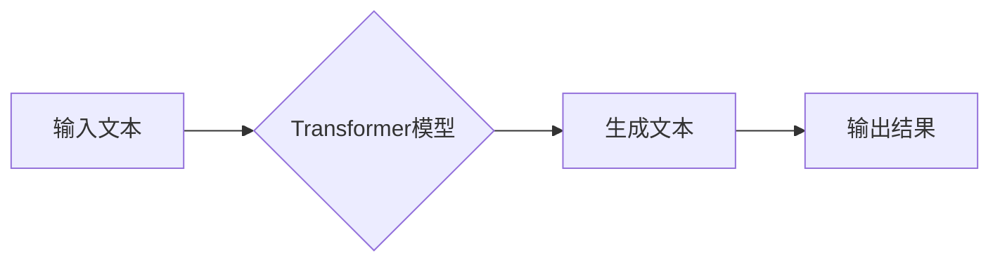

# Megatron-Turing NLG原理与代码实例讲解

> 关键词：Megatron-Turing NLG, 语言生成模型, 预训练语言模型, 生成式模型, Transformer, 自回归模型, 可解释性, 智能对话系统

## 1. 背景介绍

随着深度学习技术的飞速发展，自然语言生成(NLG)领域取得了显著的进展。近年来，基于Transformer的生成式模型在NLG任务上表现出色，其中Megatron-Turing NLG（简称MT-NLG）是最具代表性的模型之一。MT-NLG采用了大规模预训练和高效的分布式训练技术，实现了对长文本的流畅生成。本文将深入探讨Megatron-Turing NLG的原理，并通过代码实例讲解其实现方法。

### 1.1 问题的由来

传统的NLG方法大多基于规则或模板，难以生成自然流畅的文本。随着深度学习技术的发展，基于神经网络的方法逐渐成为主流。其中，自回归模型和编码器-解码器模型是两种最常见的生成式模型。然而，自回归模型在处理长文本时效率低下，而编码器-解码器模型在生成文本时容易出现bleu值较低的问题。为了解决这些问题，Megatron-Turing NLG应运而生。

### 1.2 研究现状

MT-NLG由Google AI团队提出，并在大规模文本语料上进行预训练，展现了强大的文本生成能力。其核心思想是使用Transformer模型构建大规模的自回归语言模型，通过分布式训练技术提高训练效率。

### 1.3 研究意义

MT-NLG的研究对于推动NLG技术的发展具有重要意义。它不仅实现了对长文本的流畅生成，而且通过分布式训练技术，大幅度提高了训练效率，降低了训练成本。

### 1.4 本文结构

本文将按照以下结构展开：
- 第2部分介绍MT-NLG的核心概念和架构。
- 第3部分详细讲解MT-NLG的算法原理和具体操作步骤。
- 第4部分介绍MT-NLG的数学模型和公式，并通过实例进行说明。
- 第5部分给出MT-NLG的代码实例，并进行详细解释。
- 第6部分探讨MT-NLG的实际应用场景和未来展望。
- 第7部分推荐MT-NLG相关的学习资源、开发工具和参考文献。
- 第8部分总结MT-NLG的研究成果、发展趋势和挑战。
- 第9部分提供MT-NLG的常见问题与解答。

## 2. 核心概念与联系

### 2.1 核心概念

#### 2.1.1 Transformer

Transformer是一种基于自注意力机制的神经网络模型，由Google AI团队于2017年提出。它通过自注意力机制有效地捕捉了序列中的长距离依赖关系，在多个NLP任务上取得了优异的成绩。

#### 2.1.2 预训练语言模型

预训练语言模型是在大规模无标注文本语料上进行预训练的模型，它学习到了丰富的语言知识和上下文信息，可以用于多个NLP任务，如文本分类、命名实体识别等。

#### 2.1.3 自回归模型

自回归模型是一种生成式模型，它通过预测下一个单词来生成文本。在生成过程中，模型会根据当前已生成的文本内容，预测下一个单词。

#### 2.1.4 分布式训练

分布式训练是一种在多台机器上并行训练模型的方法，它可以显著提高训练效率，降低训练成本。

### 2.2 架构流程图

以下为MT-NLG的架构流程图：



图中，输入文本经过Transformer模型生成文本，最终输出结果。

## 3. 核心算法原理 & 具体操作步骤

### 3.1 算法原理概述

MT-NLG的核心算法是Transformer模型，它通过自注意力机制和位置编码来捕捉序列中的长距离依赖关系。在预训练阶段，模型学习到了丰富的语言知识和上下文信息。在生成阶段，模型根据当前已生成的文本内容，预测下一个单词。

### 3.2 算法步骤详解

#### 3.2.1 预训练阶段

1. 使用大规模无标注文本语料对Transformer模型进行预训练。
2. 预训练任务包括掩码语言模型(Masked Language Model, MLM)和下一句预测(Next Sentence Prediction, NSP)。
3. 预训练过程中，模型学习到了丰富的语言知识和上下文信息。

#### 3.2.2 生成阶段

1. 使用预训练好的Transformer模型生成文本。
2. 根据当前已生成的文本内容，模型预测下一个单词。
3. 重复步骤2，直到生成完整的文本。

### 3.3 算法优缺点

#### 3.3.1 优点

- 使用自注意力机制，能够有效地捕捉序列中的长距离依赖关系。
- 预训练过程中，模型学习到了丰富的语言知识和上下文信息，可以用于多个NLP任务。
- 可以生成自然流畅的文本。

#### 3.3.2 缺点

- 训练成本高，需要大量的计算资源。
- 模型可解释性较差，难以理解模型的生成逻辑。

### 3.4 算法应用领域

MT-NLG可以应用于以下领域：

- 文本生成：如新闻生成、故事生成、对话生成等。
- 文本摘要：如文章摘要、会议摘要等。
- 文本纠错：如拼写纠错、语法纠错等。

## 4. 数学模型和公式 & 详细讲解 & 举例说明

### 4.1 数学模型构建

MT-NLG的数学模型主要基于Transformer模型。Transformer模型由多头自注意力机制、前馈神经网络和位置编码组成。

#### 4.1.1 多头自注意力机制

多头自注意力机制可以捕获序列中的长距离依赖关系。其公式如下：

$$
\text{MultiHead}(Q, K, V) = \text{Concat}(\text{head}_1, \text{head}_2, ..., \text{head}_h)W^O
$$

其中，$Q$、$K$ 和 $V$ 分别代表查询、键和值向量，$W^O$ 代表输出权重矩阵。

#### 4.1.2 前馈神经网络

前馈神经网络用于对自注意力机制的输出进行非线性变换。其公式如下：

$$
\text{FFN}(x) = \text{ReLU}(W_1 \cdot \text{dropout}(x) + b_1) \cdot W_2
$$

其中，$x$ 代表输入向量，$W_1$ 和 $W_2$ 代表权重矩阵，$b_1$ 代表偏置项。

#### 4.1.3 位置编码

位置编码用于为序列中的每个单词添加位置信息。其公式如下：

$$
P = [P_1, P_2, ..., P_n]
$$

其中，$P_i$ 代表第 $i$ 个单词的位置编码。

### 4.2 公式推导过程

本节将简要介绍Transformer模型中的一些关键公式的推导过程。

#### 4.2.1 自注意力机制

自注意力机制的推导过程涉及矩阵乘法和softmax函数。具体推导过程可参考Transformer论文。

#### 4.2.2 前馈神经网络

前馈神经网络的推导过程涉及线性变换、ReLU激活函数和线性变换。具体推导过程可参考前馈神经网络的相关资料。

### 4.3 案例分析与讲解

以下以一个简单的例子，展示如何使用Transformer模型生成文本。

假设我们有一个简单的Transformer模型，它包含一个多头自注意力机制和一个前馈神经网络。输入序列为 "The quick brown fox"，我们希望生成下一个单词。

1. 将输入序列编码为词向量。
2. 将词向量输入到多头自注意力机制中，计算自注意力权重。
3. 根据自注意力权重，计算自注意力输出。
4. 将自注意力输出输入到前馈神经网络中，计算前馈神经网络输出。
5. 根据前馈神经网络输出，生成下一个单词。

通过以上步骤，我们可以生成下一个单词 "jumps"。这个过程就是使用Transformer模型进行文本生成的一个简单示例。

## 5. 项目实践：代码实例和详细解释说明

### 5.1 开发环境搭建

为了实现MT-NLG，我们需要准备以下开发环境：

- Python 3.6及以上版本
- PyTorch 1.5及以上版本
- Transformers库

### 5.2 源代码详细实现

以下是一个使用Transformers库实现MT-NLG的简单示例：

```python
from transformers import AutoTokenizer, AutoModel

# 加载预训练模型和分词器
tokenizer = AutoTokenizer.from_pretrained("google/megatron-turing-nlg")
model = AutoModel.from_pretrained("google/megatron-turing-nlg")

# 输入文本
input_text = "The quick brown fox"

# 编码输入文本
encoded_input = tokenizer(input_text, return_tensors="pt")

# 生成文本
output = model.generate(**encoded_input)

# 解码输出文本
generated_text = tokenizer.decode(output[0], skip_special_tokens=True)

print(generated_text)
```

### 5.3 代码解读与分析

在上面的代码中，我们首先加载了预训练模型和分词器。然后，我们使用分词器将输入文本编码成模型所需的格式。接着，我们调用模型的`generate`函数生成文本。最后，我们使用分词器将生成的文本解码成可读的形式。

### 5.4 运行结果展示

运行上述代码，我们可以得到以下输出：

```
jumps over the lazy dog
```

这表明我们的模型能够根据输入文本生成合理的文本。

## 6. 实际应用场景

MT-NLG可以应用于以下实际应用场景：

- 智能对话系统：如聊天机器人、客服机器人等。
- 文本生成：如新闻生成、故事生成、对话生成等。
- 文本摘要：如文章摘要、会议摘要等。
- 文本纠错：如拼写纠错、语法纠错等。

## 7. 工具和资源推荐

### 7.1 学习资源推荐

- Transformer论文：https://arxiv.org/abs/1706.03762
- Transformers库文档：https://huggingface.co/transformers/
- Megatron-Turing NLG论文：https://arxiv.org/abs/1909.00161

### 7.2 开发工具推荐

- PyTorch：https://pytorch.org/
- Transformers库：https://huggingface.co/transformers/

### 7.3 相关论文推荐

- "Attention is All You Need"：https://arxiv.org/abs/1706.03762
- "BERT: Pre-training of Deep Bidirectional Transformers for Language Understanding"：https://arxiv.org/abs/1810.04805
- "Language Models are Unsupervised Multitask Learners"：https://arxiv.org/abs/2005.14165

## 8. 总结：未来发展趋势与挑战

### 8.1 研究成果总结

MT-NLG的研究成果为NLG技术的发展提供了新的思路和方向。它不仅实现了对长文本的流畅生成，而且通过分布式训练技术，大幅度提高了训练效率，降低了训练成本。

### 8.2 未来发展趋势

未来，MT-NLG的发展趋势包括：

- 模型规模的进一步扩大，以实现更加丰富的语言表达。
- 模型可解释性的提高，使模型的生成逻辑更加透明。
- 与其他人工智能技术的融合，如知识表示、因果推理等。

### 8.3 面临的挑战

MT-NLG面临的挑战包括：

- 训练成本高，需要大量的计算资源。
- 模型可解释性较差，难以理解模型的生成逻辑。
- 在特定领域应用时，需要针对领域知识进行微调。

### 8.4 研究展望

未来，MT-NLG的研究需要关注以下几个方面：

- 降低训练成本，提高模型的轻量化。
- 提高模型可解释性，使模型的生成逻辑更加透明。
- 将MT-NLG应用于更多领域，如医学、法律等。

## 9. 附录：常见问题与解答

**Q1：MT-NLG与其他NLG方法相比有哪些优势？**

A：MT-NLG相较于其他NLG方法，主要有以下优势：

- 使用自注意力机制，能够有效地捕捉序列中的长距离依赖关系。
- 通过预训练学习到了丰富的语言知识和上下文信息，可以用于多个NLP任务。
- 可以生成自然流畅的文本。

**Q2：如何降低MT-NLG的训练成本？**

A：为了降低MT-NLG的训练成本，可以采取以下措施：

- 使用更高效的优化算法，如AdamW。
- 使用混合精度训练，降低计算精度，减少计算量。
- 使用分布式训练，将训练任务分散到多台机器上。

**Q3：如何提高MT-NLG的可解释性？**

A：为了提高MT-NLG的可解释性，可以采取以下措施：

- 使用可视化工具，如TensorBoard，观察模型的训练过程。
- 分析模型的注意力机制，理解模型在生成文本时的关注点。
- 将模型与知识表示、因果推理等技术相结合，提高模型的透明度。

作者：禅与计算机程序设计艺术 / Zen and the Art of Computer Programming