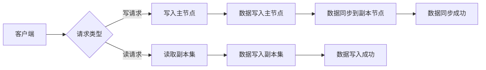

# MongoDB原理与代码实例讲解

> 关键词：MongoDB, NoSQL, 文档数据库, 数据模型, 分片, 集群, 驱动API, 代码示例, 实时性, 可扩展性

## 1. 背景介绍

随着互联网的快速发展，数据量呈爆炸式增长，传统的SQL关系型数据库在处理大规模数据和高并发访问时逐渐暴露出性能瓶颈。为了应对这一挑战，NoSQL数据库应运而生，MongoDB作为其中最流行的文档数据库之一，以其灵活的数据模型、强大的扩展性和高效的读写性能，受到了广泛关注。本文将深入浅出地讲解MongoDB的原理与代码实例，帮助读者全面了解并掌握MongoDB的使用。

## 2. 核心概念与联系

### 2.1 核心概念

MongoDB是一个基于C++语言构建的高性能、开源的NoSQL文档数据库。其核心概念如下：

- **文档（Document）**：MongoDB存储数据的基本单位是文档，文档是一个结构化的数据记录，类似于JSON对象。每个文档都有一个唯一的标识符（_id）。
- **集合（Collection）**：集合是一个文档的容器，可以理解为关系型数据库中的表。
- **数据库（Database）**：数据库是集合的容器，可以理解为关系型数据库。
- **游标（Cursor）**：游标用于遍历查询结果，类似于关系型数据库的查询结果集。

### 2.2 架构原理

MongoDB的架构原理如下：

- **文档存储**：MongoDB使用BSON（Binary JSON）格式存储文档，具有序列化和反序列化功能。
- **索引**：MongoDB支持多种索引类型，如单字段索引、复合索引、地理空间索引等，用于提高查询效率。
- **分片（Sharding）**：MongoDB支持水平扩展，通过分片将数据分布在多个节点上，提高数据存储和查询性能。
- **复制集（Replica Set）**：MongoDB支持数据冗余和故障转移，通过复制集实现数据的备份和自动恢复。

### 2.3 Mermaid流程图



## 3. 核心算法原理 & 具体操作步骤

### 3.1 算法原理概述

MongoDB的核心算法原理包括：

- **文档存储**：使用BSON格式存储文档，支持嵌套、数组等复杂数据结构。
- **索引机制**：通过B树、哈希表等数据结构实现索引，提高查询效率。
- **分片机制**：通过键值对进行数据分配，实现数据的水平扩展。
- **复制集机制**：通过副本节点同步数据，实现数据的冗余和故障转移。

### 3.2 算法步骤详解

#### 3.2.1 文档存储

1. 客户端向MongoDB发送文档存储请求。
2. MongoDB将文档序列化为BSON格式。
3. MongoDB将文档存储到指定的集合中。

#### 3.2.2 索引机制

1. 客户端向MongoDB发送查询请求。
2. MongoDB根据查询条件查找索引。
3. MongoDB根据索引快速定位文档。

#### 3.2.3 分片机制

1. 客户端向MongoDB发送数据写入请求。
2. MongoDB根据键值对将数据分配到指定的分片。
3. 数据在分片节点上存储。

#### 3.2.4 复制集机制

1. 数据在主节点上写入。
2. 数据同步到副本节点。
3. 当主节点故障时，副本节点自动选举为新的主节点。

### 3.3 算法优缺点

**优点**：

- **灵活的数据模型**：支持嵌套、数组等复杂数据结构，满足各种业务需求。
- **高性能**：读写性能优异，支持多种索引类型，提高查询效率。
- **可扩展性**：支持水平扩展和垂直扩展，适应大规模数据和高并发访问。
- **高可用性**：支持复制集和分片，保证数据冗余和故障转移。

**缺点**：

- **事务支持**：MongoDB对事务的支持相对较弱，不适合需要严格事务支持的场景。
- **SQL兼容性**：MongoDB不提供完整的SQL支持，需要学习新的查询语言。
- **复杂查询**：对于复杂查询，MongoDB的性能可能不如关系型数据库。

### 3.4 算法应用领域

MongoDB适用于以下场景：

- **大数据应用**：处理大规模数据和高并发访问。
- **内容管理系统**：存储和管理文档型数据。
- **实时应用**：支持实时数据读写。
- **物联网应用**：存储和管理物联网设备数据。

## 4. 数学模型和公式 & 详细讲解 & 举例说明

### 4.1 数学模型构建

MongoDB的数学模型可以表示为：

$$
\text{MongoDB} = (\text{数据模型}, \text{索引机制}, \text{分片机制}, \text{复制集机制})
$$

### 4.2 公式推导过程

由于MongoDB的数学模型较为直观，无需进行复杂的公式推导。

### 4.3 案例分析与讲解

假设有一个电商平台的用户数据存储在MongoDB中，数据模型如下：

```
{
  "_id": ObjectId("5f8a84f9d9c3e065f4c291e7"),
  "username": "user1",
  "email": "user1@example.com",
  "orders": [
    {
      "order_id": "ord123",
      "date": "2021-01-01",
      "amount": 100
    },
    {
      "order_id": "ord124",
      "date": "2021-01-02",
      "amount": 150
    }
  ]
}
```

对于查询用户名为"user1"的所有订单，可以使用以下查询语句：

```javascript
db.users.find({ "username": "user1" }, { "orders": 1 })
```

该查询语句会返回用户名为"user1"的所有订单信息。

## 5. 项目实践：代码实例和详细解释说明

### 5.1 开发环境搭建

1. 下载并安装MongoDB。
2. 启动MongoDB服务。
3. 安装Python的pymongo驱动。

### 5.2 源代码详细实现

```python
from pymongo import MongoClient

# 连接MongoDB
client = MongoClient('localhost', 27017)

# 选择数据库
db = client['ecommerce']

# 选择集合
collection = db.users

# 插入文档
collection.insert_one({
  "username": "user1",
  "email": "user1@example.com",
  "orders": [
    {
      "order_id": "ord123",
      "date": "2021-01-01",
      "amount": 100
    },
    {
      "order_id": "ord124",
      "date": "2021-01-02",
      "amount": 150
    }
  ]
})

# 查询文档
result = collection.find_one({ "username": "user1" }, { "orders": 1 })
print(result)
```

### 5.3 代码解读与分析

以上代码展示了如何使用pymongo驱动连接MongoDB、插入文档和查询文档。

- `MongoClient` 类用于连接MongoDB服务器。
- `find_one` 方法用于查询匹配条件的第一个文档。
- `find` 方法用于查询匹配条件的所有文档。

### 5.4 运行结果展示

运行以上代码后，将输出以下结果：

```python
{
  "_id": ObjectId("5f8a84f9d9c3e065f4c291e7"),
  "username": "user1",
  "email": "user1@example.com",
  "orders": [
    {
      "order_id": "ord123",
      "date": "2021-01-01",
      "amount": 100
    },
    {
      "order_id": "ord124",
      "date": "2021-01-02",
      "amount": 150
    }
  ]
}
```

## 6. 实际应用场景

MongoDB在实际应用场景中具有广泛的应用，以下是一些典型的应用案例：

- **电商平台**：存储用户信息、商品信息、订单信息等。
- **内容管理系统**：存储文章、评论、媒体文件等。
- **实时应用**：存储实时数据，如用户行为数据、传感器数据等。
- **物联网应用**：存储和管理物联网设备数据。

## 7. 工具和资源推荐

### 7.1 学习资源推荐

- 《MongoDB权威指南》
- 《MongoDB实战》
- MongoDB官方文档

### 7.2 开发工具推荐

- PyMongo：Python的MongoDB驱动
- Mongoose：Node.js的MongoDB驱动
- Robo 3T：图形化MongoDB客户端

### 7.3 相关论文推荐

- MongoDB: A Document-Oriented Database for High Performance and Scale
- MongoDB: The Definitive Guide

## 8. 总结：未来发展趋势与挑战

### 8.1 研究成果总结

MongoDB作为一种优秀的NoSQL数据库，以其灵活的数据模型、强大的扩展性和高效的读写性能，在多个领域得到了广泛应用。本文对MongoDB的原理进行了详细讲解，并通过代码实例展示了如何使用MongoDB。

### 8.2 未来发展趋势

- **数据模型优化**：进一步优化数据模型，支持更多复杂数据结构。
- **性能提升**：持续提升读写性能，降低延迟。
- **安全性增强**：加强数据安全，提高系统稳定性。
- **云原生支持**：提供更好的云原生支持，满足云原生应用的需求。

### 8.3 面临的挑战

- **事务支持**：进一步增强事务支持，满足严格事务需求的场景。
- **SQL兼容性**：提高SQL兼容性，方便用户迁移。
- **复杂查询**：提升复杂查询的性能，满足更多复杂业务需求。

### 8.4 研究展望

MongoDB将继续致力于成为一款优秀的NoSQL数据库，为用户提供更加灵活、高效、安全的存储解决方案。未来，MongoDB将在以下几个方面展开研究：

- **多模型数据库**：支持多种数据模型，如文档、键值、列式等。
- **流式数据库**：支持实时数据流处理。
- **图数据库**：支持图数据存储和查询。

## 9. 附录：常见问题与解答

**Q1：MongoDB适合哪些场景？**

A: MongoDB适合以下场景：

- **大量非结构化或半结构化数据存储**：如电商平台的用户信息、商品信息等。
- **高并发读写场景**：如社交媒体、在线游戏等。
- **需要灵活扩展的场景**：如网站后台、大数据平台等。

**Q2：MongoDB和关系型数据库有什么区别？**

A: MongoDB和关系型数据库有以下区别：

- **数据模型**：MongoDB使用文档模型，关系型数据库使用关系模型。
- **扩展性**：MongoDB支持水平扩展，关系型数据库支持垂直扩展。
- **查询语言**：MongoDB使用JSON风格的查询语言，关系型数据库使用SQL。

**Q3：如何选择合适的索引类型？**

A: 选择合适的索引类型需要根据具体的查询需求进行分析。以下是一些常见的索引类型：

- **单字段索引**：适用于单字段查询。
- **复合索引**：适用于多字段查询。
- **地理空间索引**：适用于地理空间查询。

**Q4：MongoDB如何实现数据备份和恢复？**

A: MongoDB支持多种数据备份和恢复方法：

- **MongoDB的备份命令**：`mongodump`和`mongorestore`。
- **第三方备份工具**：如Databackup、Tarsnap等。

**Q5：MongoDB如何保证数据一致性？**

A: MongoDB通过以下机制保证数据一致性：

- **复制集**：主从复制，保证数据冗余和故障转移。
- **读写关注**：支持单实例、多实例读写关注，保证数据一致性。

作者：禅与计算机程序设计艺术 / Zen and the Art of Computer Programming