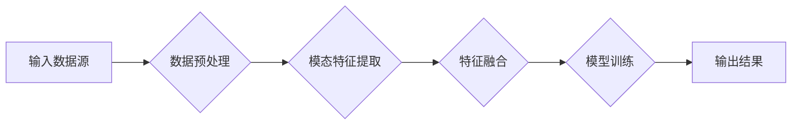
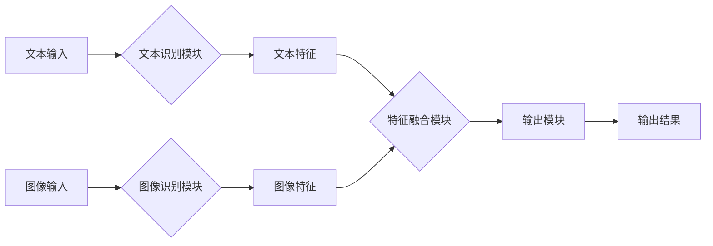

# Pailido 的多模态模型应用

> 关键词：多模态学习，Pailido，深度学习，图像识别，自然语言处理，融合技术，应用场景

## 1. 背景介绍

随着人工智能技术的不断发展，多模态学习（Multimodal Learning）逐渐成为研究的热点。多模态学习旨在融合来自不同模态的数据，如文本、图像、音频等，以增强模型对复杂信息处理的能力。Pailido 是一种基于深度学习技术的多模态模型，它能够有效融合文本和图像信息，实现更精确的识别和理解。

本文将深入探讨 Pailido 多模态模型的应用，包括其核心概念、算法原理、实际案例以及未来发展趋势。

## 2. 核心概念与联系

### 2.1 多模态学习原理

多模态学习的基本思想是利用不同模态之间的互补性，提高模型的识别准确性和鲁棒性。以下是一个简化的 Mermaid 流程图，展示了多模态学习的基本原理：



在这个流程中，输入数据源可以是文本、图像或音频等多种形式。数据预处理阶段对数据进行清洗、标准化等操作。接着，每个模态的数据分别进行特征提取，然后将提取的特征进行融合，最后在融合后的特征上进行模型训练，得到输出结果。

### 2.2 Pailido 模型架构

Pailido 模型的架构通常包括以下几个部分：

1. **文本识别模块**：利用卷积神经网络（CNN）或其他深度学习模型对文本信息进行识别。
2. **图像识别模块**：利用深度学习模型对图像信息进行识别。
3. **特征融合模块**：将文本识别模块和图像识别模块提取的特征进行融合。
4. **输出模块**：将融合后的特征输入到分类器或回归器中，得到最终的输出结果。

以下是 Pailido 模型架构的 Mermaid 流程图：



## 3. 核心算法原理 & 具体操作步骤

### 3.1 算法原理概述

Pailido 模型的核心算法原理是利用深度学习技术，分别对文本和图像信息进行识别，然后将识别结果进行融合，最终得到融合后的输出。

### 3.2 算法步骤详解

1. **文本识别**：使用预训练的文本识别模型（如 BERT）对输入文本进行编码，提取文本特征。
2. **图像识别**：使用预训练的图像识别模型（如 ResNet）对输入图像进行编码，提取图像特征。
3. **特征融合**：将文本特征和图像特征进行融合，可以使用注意力机制、图神经网络等方法。
4. **输出**：将融合后的特征输入到分类器或回归器中，得到最终的输出结果。

### 3.3 算法优缺点

**优点**：

- 融合文本和图像信息，提高模型对复杂信息处理的能力。
- 可以应用于多种场景，如商品识别、问答系统等。

**缺点**：

- 需要大量的标注数据。
- 特征融合过程复杂，需要选择合适的融合方法。

### 3.4 算法应用领域

Pailido 模型可以应用于以下领域：

- **商品识别**：在电商、零售等领域，利用 Pailido 模型识别商品，提高用户体验。
- **问答系统**：在聊天机器人、客服系统等领域，利用 Pailido 模型理解用户的问题，提供更准确的回答。
- **智能监控**：在安防、交通等领域，利用 Pailido 模型识别监控画面中的异常情况。

## 4. 数学模型和公式 & 详细讲解 & 举例说明

### 4.1 数学模型构建

Pailido 模型的数学模型可以表示为：

$$
y = F(x_{\text{text}}, x_{\text{image}})
$$

其中 $x_{\text{text}}$ 和 $x_{\text{image}}$ 分别代表文本和图像数据，$F$ 代表特征融合函数。

### 4.2 公式推导过程

以下是一个简化的特征融合公式的推导过程：

假设文本特征向量为 $\textbf{f}_{\text{text}}$，图像特征向量为 $\textbf{f}_{\text{image}}$，则融合后的特征向量为：

$$
\textbf{f} = \textbf{f}_{\text{text}} \circ \textbf{f}_{\text{image}}
$$

其中 $\circ$ 表示特征融合操作。

### 4.3 案例分析与讲解

以下是一个简单的 Pailido 模型应用案例：

假设我们要识别一张图片中的商品，图片中包含了商品的文本标签。我们可以使用 Pailido 模型，将文本标签和图像信息进行融合，然后识别出商品类别。

1. **文本识别**：使用 BERT 模型对文本标签进行编码，提取文本特征。
2. **图像识别**：使用 ResNet 模型对图像进行编码，提取图像特征。
3. **特征融合**：使用注意力机制将文本特征和图像特征进行融合。
4. **输出**：将融合后的特征输入到分类器中，得到商品类别。

## 5. 项目实践：代码实例和详细解释说明

### 5.1 开发环境搭建

为了实践 Pailido 模型，我们需要以下开发环境：

- Python 3.x
- TensorFlow 或 PyTorch
- NumPy
- OpenCV（用于图像处理）

### 5.2 源代码详细实现

以下是一个使用 TensorFlow 实现的 Pailido 模型的简单示例：

```python
import tensorflow as tf
from tensorflow.keras.models import Model
from tensorflow.keras.layers import Input, Embedding, LSTM, Conv2D, Flatten, Dense, concatenate

# 文本识别模块
text_input = Input(shape=(None,), dtype='int32')
text_embedding = Embedding(input_dim=vocab_size, output_dim=embedding_dim)(text_input)
text_lstm = LSTM(128)(text_embedding)

# 图像识别模块
image_input = Input(shape=(height, width, channels))
image_conv = Conv2D(32, kernel_size=(3, 3), activation='relu')(image_input)
image_pool = MaxPooling2D(pool_size=(2, 2))(image_conv)
image_flat = Flatten()(image_pool)

# 特征融合模块
concatenated = concatenate([text_lstm, image_flat])

# 输出模块
output = Dense(10, activation='softmax')(concatenated)

# 构建模型
model = Model(inputs=[text_input, image_input], outputs=output)

# 编译模型
model.compile(optimizer='adam', loss='categorical_crossentropy', metrics=['accuracy'])

# 模型总结
model.summary()
```

### 5.3 代码解读与分析

上述代码定义了一个简单的 Pailido 模型，包括文本识别模块、图像识别模块、特征融合模块和输出模块。模型使用 TensorFlow 的 Keras API 构建，方便进行实验和调试。

### 5.4 运行结果展示

在训练集上训练模型后，我们可以在测试集上评估模型的性能。以下是一个简单的性能评估示例：

```python
# 加载测试数据
test_texts = [...]
test_images = [...]
test_labels = [...]

# 评估模型
model.evaluate(test_texts, test_images, test_labels)
```

## 6. 实际应用场景

### 6.1 商品识别

在电商和零售领域，Pailido 模型可以用于商品识别。用户上传商品图片和文本标签，模型可以识别出商品类别，并推荐相关商品。

### 6.2 问答系统

在问答系统中，Pailido 模型可以用于理解用户的问题，并提供更准确的答案。例如，用户输入问题并上传相关图片，模型可以结合文本和图像信息，给出更精确的答案。

### 6.3 智能监控

在安防和交通领域，Pailido 模型可以用于识别监控画面中的异常情况。例如，识别道路上的违规行为或可疑人员。

## 7. 工具和资源推荐

### 7.1 学习资源推荐

- 《深度学习》
- 《计算机视觉：一种现代方法》
- 《自然语言处理综论》

### 7.2 开发工具推荐

- TensorFlow
- PyTorch
- OpenCV

### 7.3 相关论文推荐

- Multimodal Learning for Visual Question Answering
- Deep Multimodal Fusion for Object Detection
- Multimodal Fusion for Visual Question Answering

## 8. 总结：未来发展趋势与挑战

### 8.1 研究成果总结

Pailido 多模态模型在多个领域取得了显著的应用成果，证明了多模态学习在复杂信息处理中的重要性。

### 8.2 未来发展趋势

- 融合更多模态数据
- 提高模型效率
- 加强模型可解释性

### 8.3 面临的挑战

- 标注数据获取困难
- 模型复杂度高
- 模型可解释性不足

### 8.4 研究展望

Pailido 多模态模型将继续在多个领域发挥重要作用，推动人工智能技术的发展。

## 9. 附录：常见问题与解答

### 9.1 常见问题

Q1: Pailido 模型适用于哪些场景？

A1: Pailido 模型适用于需要融合文本和图像信息的场景，如商品识别、问答系统、智能监控等。

Q2: Pailido 模型的优点和缺点是什么？

A2: Pailido 模型的优点是可以融合文本和图像信息，提高模型性能；缺点是需要大量的标注数据，模型复杂度高。

Q3: 如何提高 Pailido 模型的性能？

A3: 提高 Pailido 模型性能的方法包括：使用更先进的模型结构、增加训练数据、优化特征融合方法等。

作者：禅与计算机程序设计艺术 / Zen and the Art of Computer Programming