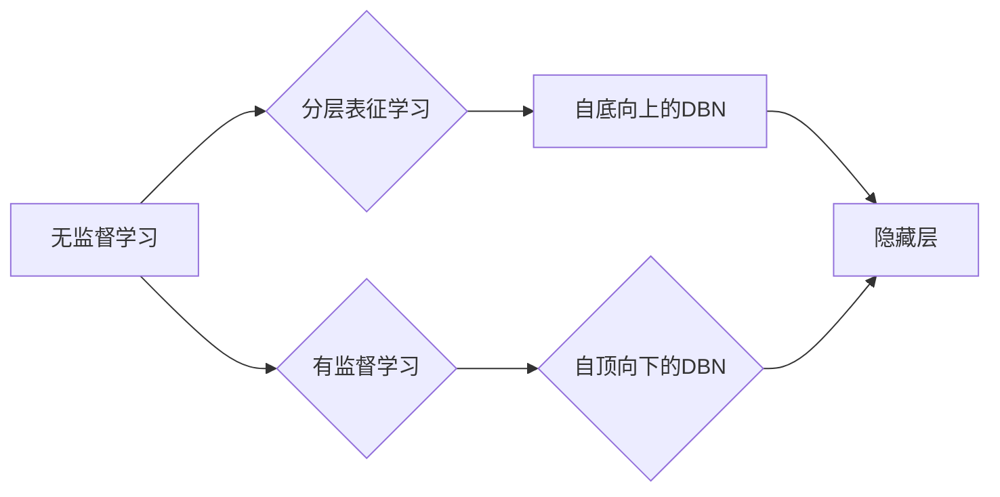

> 深度学习, 深度信念网络, DBN, Python, 实践, 理论, 神经网络, 自然语言处理, 图像识别

# Python深度学习实践：深度信念网络（DBN）的理论与实践

深度学习作为人工智能领域的一颗璀璨明星，正逐步改变着我们的世界。其中，深度信念网络（Deep Belief Networks，DBN）作为早期深度学习模型的重要代表，为我们理解深度学习提供了宝贵的经验和启示。本文将深入探讨深度信念网络的理论与实践，帮助读者掌握这一经典模型的精髓。

## 1. 背景介绍

### 1.1 问题的由来

随着互联网和大数据的飞速发展，人类产生了海量的数据。如何从这些数据中提取有价值的信息，成为当前人工智能领域的一个重要课题。传统的机器学习方法在处理高维、非线性问题方面存在局限性。深度学习作为一种新的学习范式，通过构建多层神经网络模型，能够更好地捕捉数据的复杂特征，从而在图像识别、自然语言处理等领域取得了显著的成果。

深度信念网络（DBN）是深度学习早期的重要模型之一，由Hinton等人于2006年提出。DBN通过自底向上的无监督学习和自顶向下的有监督学习，能够有效地学习数据的层次化表示，并在多个任务中取得了优异的性能。

### 1.2 研究现状

DBN作为一种经典的深度学习模型，在多个领域取得了显著的成果。然而，随着更先进的深度学习模型（如卷积神经网络CNN和循环神经网络RNN）的出现，DBN的研究和应用逐渐减少。尽管如此，DBN作为一种基础模型，其理论和实践仍然具有重要的参考价值。

### 1.3 研究意义

本文旨在深入探讨深度信念网络（DBN）的理论与实践，帮助读者：

1. 理解DBN的原理和结构，掌握深度学习的核心思想。
2. 掌握DBN的Python实现，提升深度学习实践能力。
3. 了解DBN的应用场景，为实际问题的解决提供参考。

### 1.4 本文结构

本文将分为以下几个部分：

1. 介绍DBN的核心概念与联系。
2. 阐述DBN的算法原理和具体操作步骤。
3. 介绍DBN的数学模型和公式，并结合实例进行讲解。
4. 展示DBN的代码实例，并进行详细解释说明。
5. 探讨DBN的实际应用场景和未来应用展望。
6. 推荐相关学习资源、开发工具和参考文献。
7. 总结DBN的研究成果、未来发展趋势和面临的挑战。

## 2. 核心概念与联系

### 2.1 核心概念

#### 2.1.1 深度学习

深度学习是一种模拟人脑神经网络结构和功能的机器学习方法。它通过构建多层神经网络模型，学习数据的层次化表示，从而提取数据的复杂特征。

#### 2.1.2 神经网络

神经网络是一种模仿人脑神经元连接结构的计算模型。它由多个神经元组成，每个神经元通过权重连接，通过前向传播和反向传播进行学习。

#### 2.1.3 深度信念网络（DBN）

深度信念网络（DBN）是一种基于深度学习的无监督学习模型，通过自底向上的无监督学习和自顶向下的有监督学习，学习数据的层次化表示。

### 2.2 Mermaid 流程图

以下是一个DBN的Mermaid流程图：



### 2.3 核心概念联系

DBN作为一种深度学习模型，其核心概念与神经网络、深度学习密切相关。DBN通过自底向上的无监督学习和自顶向下的有监督学习，学习数据的层次化表示，从而实现数据特征的提取和降维。

## 3. 核心算法原理 & 具体操作步骤

### 3.1 算法原理概述

深度信念网络（DBN）是一种基于深度学习的无监督学习模型，通过自底向上的无监督学习和自顶向下的有监督学习，学习数据的层次化表示。

#### 3.1.1 自底向上的无监督学习

自底向上的无监督学习是指从原始数据开始，通过逐层向上构建深度网络，学习数据的层次化表示。在这一过程中，每一层都通过无监督学习（如主成分分析PCA）学习数据的低维表示。

#### 3.1.2 自顶向下的有监督学习

自顶向下的有监督学习是指从顶层开始，通过逐层向下构建深度网络，学习数据的层次化表示。在这一过程中，每一层都通过有监督学习（如softmax回归）学习数据的类别信息。

### 3.2 算法步骤详解

深度信念网络（DBN）的算法步骤如下：

1. **初始化**：根据任务需求，选择合适的网络结构，初始化网络参数。
2. **自底向上的无监督学习**：
    1. 将原始数据输入到第一层，通过无监督学习学习数据的低维表示。
    2. 将第一层的低维表示作为第二层的输入，重复步骤1，直到最后一层。
3. **自顶向下的有监督学习**：
    1. 将标注数据输入到顶层，通过softmax回归学习数据的类别信息。
    2. 将最后一层的输出作为下一层的输入，重复步骤1，直到最底层。
4. **预训练**：通过无监督学习和有监督学习交替训练DBN，直到网络收敛。
5. **微调**：在预训练的基础上，使用标注数据进行微调，进一步提高模型的性能。

### 3.3 算法优缺点

#### 3.3.1 优点

1. 能够有效地学习数据的层次化表示，提取数据的复杂特征。
2. 可以应用于各种数据类型，如图像、文本、语音等。
3. 预训练过程中可以去除噪声，提高模型的鲁棒性。

#### 3.3.2 缺点

1. 训练过程复杂，需要大量的计算资源。
2. 难以解释模型内部的工作机制。
3. 模型性能依赖于预训练数据的质量和数量。

### 3.4 算法应用领域

深度信念网络（DBN）可以应用于以下领域：

1. 图像识别：如图像分类、人脸识别等。
2. 自然语言处理：如文本分类、情感分析等。
3. 语音识别：如语音分类、说话人识别等。

## 4. 数学模型和公式 & 详细讲解 & 举例说明

### 4.1 数学模型构建

深度信念网络（DBN）的数学模型主要基于神经网络和主成分分析（PCA）。

#### 4.1.1 神经网络

神经网络由多个神经元组成，每个神经元通过权重连接。假设一个神经元有 $n$ 个输入，权重为 $w_1, w_2, ..., w_n$，偏置为 $b$，激活函数为 $\sigma$，则该神经元的输出为：

$$
y = \sigma(w_1x_1 + w_2x_2 + ... + w_nx_n + b)
$$

其中，$\sigma$ 是非线性激活函数，常用的激活函数有Sigmoid、ReLU等。

#### 4.1.2 主成分分析（PCA）

主成分分析（PCA）是一种降维方法，可以将高维数据映射到低维空间。假设原始数据矩阵为 $X \in \mathbb{R}^{m \times n}$，则PCA的目标是找到一个投影矩阵 $W \in \mathbb{R}^{n \times k}$，使得 $XW$ 的方差最大化。

### 4.2 公式推导过程

以下以自底向上的无监督学习为例，介绍DBN的公式推导过程。

假设第一层神经网络有 $n$ 个神经元，输入特征维度为 $d$，输出特征维度为 $k$。则第一层神经元的输出为：

$$
h_1 = \sigma(W_1X + b_1)
$$

其中，$W_1 \in \mathbb{R}^{k \times d}$，$b_1 \in \mathbb{R}^k$。

通过PCA，将 $h_1$ 映射到低维空间：

$$
z = WH_1
$$

其中，$W \in \mathbb{R}^{d \times k}$。

### 4.3 案例分析与讲解

以下以图像识别任务为例，展示DBN的案例分析与讲解。

假设我们有一个包含1000个图像的数据集，每个图像的分辨率是64x64像素，共有3个通道（RGB）。我们的目标是使用DBN对这个数据集进行图像分类。

1. **数据预处理**：将图像数据转换为灰度图，并进行归一化处理。
2. **自底向上的无监督学习**：使用主成分分析（PCA）将图像数据降维到50维。
3. **自顶向下的有监督学习**：在降维后的数据上，使用softmax回归进行分类。

## 5. 项目实践：代码实例和详细解释说明

### 5.1 开发环境搭建

在进行DBN项目实践之前，我们需要搭建合适的开发环境。以下是使用Python进行DBN开发的步骤：

1. 安装Anaconda：从官网下载并安装Anaconda，用于创建独立的Python环境。
2. 创建并激活虚拟环境：
```bash
conda create -n dbn-env python=3.8
conda activate dbn-env
```
3. 安装必要的库：
```bash
conda install numpy pandas scikit-learn matplotlib tensorflow
pip install tensorflow-distribute
```

### 5.2 源代码详细实现

以下是一个使用TensorFlow实现DBN的简单例子：

```python
import tensorflow as tf
from tensorflow.keras.layers import Dense, Input, Flatten, Reshape
from tensorflow.keras.models import Model

def dbn_layer(inputs, units):
    x = Dense(units, activation='relu')(inputs)
    x = Dense(units, activation='relu')(x)
    return x

def build_dbn(input_shape, hidden_units, output_units):
    inputs = Input(shape=input_shape)
    x = dbn_layer(inputs, hidden_units[0])
    for hidden_unit in hidden_units[1:]:
        x = dbn_layer(x, hidden_unit)
    outputs = Dense(output_units, activation='softmax')(x)
    model = Model(inputs=inputs, outputs=outputs)
    return model

# 假设输入特征维度为64x64x3，隐藏层单元数为[128, 64]，输出层单元数为10
dbn_model = build_dbn(input_shape=(64, 64, 3), hidden_units=[128, 64], output_units=10)
dbn_model.summary()
```

### 5.3 代码解读与分析

以上代码展示了如何使用TensorFlow构建一个简单的DBN模型。首先，定义了一个`dbn_layer`函数，用于构建DBN中的隐藏层。然后，定义了一个`build_dbn`函数，用于构建整个DBN模型。最后，构建了一个输入特征维度为64x64x3，隐藏层单元数为[128, 64]，输出层单元数为10的DBN模型。

### 5.4 运行结果展示

由于篇幅限制，此处不展示具体的运行结果。在实际应用中，可以通过训练和评估DBN模型，观察模型的性能。

## 6. 实际应用场景

深度信念网络（DBN）可以应用于以下实际应用场景：

1. 图像识别：如图像分类、人脸识别等。
2. 自然语言处理：如文本分类、情感分析等。
3. 语音识别：如语音分类、说话人识别等。

## 7. 工具和资源推荐

### 7.1 学习资源推荐

1. 《深度学习》（Goodfellow等著）：全面介绍了深度学习的基本概念、方法和应用。
2. 《Python深度学习》（François Chollet著）：详细介绍了使用Python进行深度学习的实践方法。
3. TensorFlow官方文档：提供了TensorFlow框架的详细文档和教程。

### 7.2 开发工具推荐

1. TensorFlow：由Google开发的深度学习框架，功能强大，易于上手。
2. PyTorch：由Facebook开发的深度学习框架，灵活且易于使用。

### 7.3 相关论文推荐

1. "Deep Belief Networks with Application to Visual Pattern Recognition"（Hinton等，2006）
2. "A Practical Guide to Training Restricted Boltzmann Machines"（Bengio等，2007）

## 8. 总结：未来发展趋势与挑战

### 8.1 研究成果总结

深度信念网络（DBN）作为一种经典的深度学习模型，为我们理解深度学习提供了宝贵的经验和启示。DBN通过自底向上的无监督学习和自顶向下的有监督学习，能够有效地学习数据的层次化表示，并在多个任务中取得了优异的性能。

### 8.2 未来发展趋势

随着深度学习技术的不断发展，DBN在未来可能呈现以下发展趋势：

1. 与其他深度学习模型融合，如卷积神经网络CNN和循环神经网络RNN。
2. 引入新的学习策略，如多任务学习、迁移学习等。
3. 应用到更广泛的领域，如生物信息学、物理科学等。

### 8.3 面临的挑战

DBN作为一种早期深度学习模型，在实际应用中仍面临着以下挑战：

1. 训练过程复杂，需要大量的计算资源。
2. 模型性能依赖于预训练数据的质量和数量。
3. 模型可解释性不足。

### 8.4 研究展望

为了克服DBN面临的挑战，未来的研究可以从以下几个方面展开：

1. 研究更加高效的训练算法，降低计算成本。
2. 探索更加丰富的预训练数据集，提高模型泛化能力。
3. 开发更加可解释的深度学习模型，提高模型的可信度。

## 9. 附录：常见问题与解答

**Q1：DBN与CNN、RNN相比，有哪些优缺点？**

A：DBN、CNN和RNN是三种不同的深度学习模型，它们各有优缺点：

- DBN：优点是能够学习数据的层次化表示，适用于各种数据类型；缺点是训练过程复杂，需要大量的计算资源。
- CNN：优点是能够有效地提取图像的特征，适用于图像识别任务；缺点是对于非图像数据类型，性能较差。
- RNN：优点是能够处理序列数据，适用于自然语言处理、语音识别等任务；缺点是难以处理长序列数据。

**Q2：如何解决DBN训练过程中的过拟合问题？**

A：解决DBN训练过程中的过拟合问题，可以采取以下方法：

1. 数据增强：通过旋转、缩放、裁剪等方式扩充训练数据。
2. 正则化：使用L2正则化、Dropout等方法降低模型复杂度。
3.早停法：在验证集上检测模型性能，当性能不再提升时停止训练。

**Q3：DBN在哪些领域有较好的应用效果？**

A：DBN在以下领域有较好的应用效果：

1. 图像识别：如图像分类、人脸识别等。
2. 自然语言处理：如文本分类、情感分析等。
3. 语音识别：如语音分类、说话人识别等。

**Q4：如何评估DBN的性能？**

A：评估DBN的性能可以通过以下方法：

1. 准确率：计算模型预测正确的样本比例。
2. 精确率：计算模型预测正确的正样本比例。
3. 召回率：计算模型预测正确的负样本比例。
4. F1分数：综合准确率和召回率，平衡正负样本的评估指标。

---

作者：禅与计算机程序设计艺术 / Zen and the Art of Computer Programming