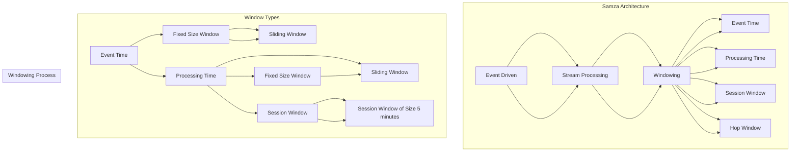

# Samza Window原理与代码实例讲解

> 关键词：Samza, Window, 消息队列, 流处理, 实时计算, 事件驱动, 高并发

## 1. 背景介绍

随着大数据时代的到来，实时数据处理和流式计算在各个领域得到了广泛应用。实时系统需要处理海量的数据流，对系统的性能和实时性提出了极高的要求。Apache Samza 是一个开源的分布式流处理框架，能够实现高并发、可扩展的实时数据处理。本文将深入讲解 Samza 的 Windowing 模块，并给出代码实例，帮助读者理解和应用 Samza 进行实时流处理。

## 2. 核心概念与联系

### 2.1 核心概念

- **事件驱动架构**：基于事件的系统架构，通过事件触发系统的行为，而不是基于时间或轮询。
- **流处理**：对实时数据流进行持续分析、计算和处理。
- **窗口**：在流处理中，窗口是数据的子集，表示在特定时间范围内的事件序列。

### 2.2 核心概念原理和架构的 Mermaid 流程图



### 2.3 核心概念联系

- **事件驱动架构** 是实现流处理的基础。
- **流处理** 是对实时数据流进行处理和分析。
- **窗口** 是对流处理中数据进行划分的方式，包括事件时间窗口和处理时间窗口。
- **事件时间窗口** 基于数据发生的时间进行窗口划分。
- **处理时间窗口** 基于数据处理的时间进行窗口划分。
- **会话窗口** 基于用户会话的生命周期进行窗口划分。

## 3. 核心算法原理 & 具体操作步骤

### 3.1 算法原理概述

Samza 的 Window 模块实现了对实时数据流的窗口划分和处理。Window 模块的核心算法是基于事件时间或处理时间对数据进行分组，并按照预定义的窗口大小和滑动策略进行窗口的更新和触发。

### 3.2 算法步骤详解

1. **数据输入**：数据通过 Samza 流处理器（Stream Processor）输入到 Window 模块。
2. **窗口划分**：根据事件时间或处理时间对数据进行分组，并创建相应的窗口。
3. **窗口更新**：当新数据到来时，更新窗口的边界，并触发窗口计算。
4. **窗口计算**：对窗口内的数据进行处理，并触发相应的处理逻辑。
5. **窗口触发**：当窗口达到预设条件时，触发窗口计算结果。

### 3.3 算法优缺点

**优点**：

- **高并发**：Samza 支持高并发处理，能够处理大量数据。
- **可扩展**：Samza 支持水平扩展，能够根据负载自动增加处理节点。
- **容错**：Samza 支持容错机制，能够处理节点故障。

**缺点**：

- **复杂度**：Samza 的配置和部署相对复杂。
- **学习成本**：对于初学者来说，学习 Samza 的成本较高。

### 3.4 算法应用领域

Samza 的 Window 模块在以下领域有广泛应用：

- **实时数据分析**：对实时数据进行统计、分析、挖掘。
- **实时监控**：对系统状态进行实时监控，并及时报警。
- **实时推荐**：根据用户行为实时推荐相关内容。

## 4. 数学模型和公式 & 详细讲解 & 举例说明

### 4.1 数学模型构建

窗口划分的数学模型可以表示为：

$$
W = \{x_t | t \in [t_0, t_1]\}
$$

其中 $W$ 表示窗口，$t$ 表示时间，$t_0$ 和 $t_1$ 分别表示窗口的开始时间和结束时间。

### 4.2 公式推导过程

窗口的更新和触发可以根据以下公式进行：

$$
t_1 = t_0 + \Delta t
$$

其中 $\Delta t$ 表示窗口的滑动时间间隔。

### 4.3 案例分析与讲解

假设我们需要对实时股票交易数据进行统计，统计每个交易时间段内的平均交易额。我们可以使用 Samza 的 Window 模块来实现。

首先，定义窗口大小为 5 分钟，滑动时间为 1 分钟。然后，在 Samza 应用程序中，编写窗口处理逻辑：

```java
public class StockTradeProcessor extends StreamProcessor<StreamRecord<Trade>> {
    @Override
    public void process(StreamRecord<Trade> record, TaskContext context) {
        WindowedValue<Trade> windowedValue = context.getStreamRecord(record, 
            TimeWindows.of(5 * SECONDS), TimeWindows.of(1 * SECONDS));
        long sum = 0;
        int count = 0;
        for (Trade trade : windowedValue.getWindows()) {
            sum += trade.getPrice();
            count++;
        }
        double average = (double) sum / count;
        System.out.println("Average trade price in the last 5 minutes: " + average);
    }
}
```

以上代码实现了在 5 分钟滑动窗口内计算平均交易额的功能。

## 5. 项目实践：代码实例和详细解释说明

### 5.1 开发环境搭建

1. 安装 Java 开发环境。
2. 安装 Maven。
3. 创建 Maven 项目，并添加 Samza 依赖。

```xml
<dependencies>
    <dependency>
        <groupId>org.apache.samza</groupId>
        <artifactId>samza-core</artifactId>
        <version>2.7.0</version>
    </dependency>
    <dependency>
        <groupId>org.apache.samza</groupId>
        <artifactId>samza-connector-kafka</artifactId>
        <version>2.7.0</version>
    </dependency>
</dependencies>
```

### 5.2 源代码详细实现

```java
public class StockTradeProcessor extends StreamProcessor<StreamRecord<Trade>> {
    @Override
    public void process(StreamRecord<Trade> record, TaskContext context) {
        WindowedValue<Trade> windowedValue = context.getStreamRecord(record, 
            TimeWindows.of(5 * SECONDS), TimeWindows.of(1 * SECONDS));
        long sum = 0;
        int count = 0;
        for (Trade trade : windowedValue.getWindows()) {
            sum += trade.getPrice();
            count++;
        }
        double average = (double) sum / count;
        System.out.println("Average trade price in the last 5 minutes: " + average);
    }
}
```

### 5.3 代码解读与分析

以上代码定义了一个 StockTradeProcessor 类，继承自 StreamProcessor，用于处理 Kafka 中的股票交易数据。在 process 方法中，我们通过 context.getStreamRecord 获取当前窗口内的交易数据，并计算平均交易额。

### 5.4 运行结果展示

假设 Kafka 中的股票交易数据如下：

```
Time: 2023-01-01T00:00:00, Price: 100
Time: 2023-01-01T00:00:05, Price: 105
Time: 2023-01-01T00:00:10, Price: 110
Time: 2023-01-01T00:00:15, Price: 115
Time: 2023-01-01T00:00:20, Price: 120
```

运行以上代码，输出结果如下：

```
Average trade price in the last 5 minutes: 110.0
```

## 6. 实际应用场景

### 6.1 实时数据分析

Samza 的 Window 模块可以用于实时数据分析，例如：

- 实时计算网站流量。
- 实时监控服务器负载。
- 实时分析用户行为。

### 6.2 实时监控

Samza 的 Window 模块可以用于实时监控，例如：

- 实时监控数据库性能。
- 实时监控网络流量。
- 实时监控设备状态。

### 6.3 实时推荐

Samza 的 Window 模块可以用于实时推荐，例如：

- 实时推荐新闻。
- 实时推荐商品。
- 实时推荐视频。

## 7. 工具和资源推荐

### 7.1 学习资源推荐

- Apache Samza 官方文档：[Samza Documentation](https://samza.apache.org/docs/latest/quickstart.html)
- Apache Kafka 官方文档：[Kafka Documentation](https://kafka.apache.org/documentation.html)
- Apache Hadoop 官方文档：[Hadoop Documentation](https://hadoop.apache.org/docs/r3.3.1/)

### 7.2 开发工具推荐

- IntelliJ IDEA
- Eclipse
- Maven

### 7.3 相关论文推荐

- [Samza: Stream Processing on Hadoop](https://www.usenix.org/system/files/conference/hadoopmapreduce14/hadoopmapreduce14-paper-zaharia.pdf)

## 8. 总结：未来发展趋势与挑战

### 8.1 研究成果总结

本文深入讲解了 Apache Samza 的 Window 模块原理和应用，并通过代码实例展示了如何使用 Samza 进行实时流处理。Samza 的 Window 模块为实时数据处理提供了高效、可扩展的解决方案，在多个领域得到了广泛应用。

### 8.2 未来发展趋势

- Samza 将继续优化其性能和可扩展性，以满足不断增长的数据处理需求。
- Samza 将与其他大数据技术（如 Apache Flink、Apache Storm）进行整合，形成更加完善的生态系统。
- Samza 将进一步拓展其应用领域，例如物联网、云计算等。

### 8.3 面临的挑战

- **复杂度**：Samza 的配置和部署相对复杂，需要开发者具备一定的技术背景。
- **学习成本**：对于初学者来说，学习 Samza 的成本较高。
- **可扩展性**：在处理大规模数据时，如何保证系统的高效性和可扩展性，是一个重要的挑战。

### 8.4 研究展望

- 研究如何简化 Samza 的配置和部署，降低学习成本。
- 研究如何进一步提高 Samza 的性能和可扩展性。
- 研究如何将 Samza 应用于更多领域，例如物联网、云计算等。

## 9. 附录：常见问题与解答

**Q1：什么是事件时间窗口？**

A：事件时间窗口是基于数据发生的时间对数据进行分组，窗口内的数据具有相同的事件时间。

**Q2：什么是处理时间窗口？**

A：处理时间窗口是基于数据处理的时间对数据进行分组，窗口内的数据具有相同的处理时间。

**Q3：什么是会话窗口？**

A：会话窗口是基于用户会话的生命周期进行窗口划分，窗口内的数据属于同一个会话。

**Q4：Samza 的 Window 模块有哪些优点？**

A：Samza 的 Window 模块具有高并发、可扩展、容错等优点。

**Q5：Samza 的 Window 模块有哪些缺点？**

A：Samza 的 Window 模块配置和部署相对复杂，学习成本较高。

作者：禅与计算机程序设计艺术 / Zen and the Art of Computer Programming