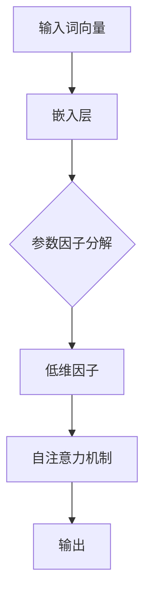

> 关键词：Transformer，大模型，参数高效微调，嵌入层，因子分解，稀疏化，知识蒸馏，注意力机制

# Transformer大模型实战：嵌入层参数因子分解

> 在深度学习领域，Transformer模型因其出色的性能和可扩展性，已经成为自然语言处理和计算机视觉等领域的明星模型。然而，随着模型规模的扩大，参数数量的激增也给模型的训练和推理带来了巨大的挑战。本文将深入探讨Transformer大模型的嵌入层参数因子分解技术，通过分解高维嵌入参数为低维因子，有效降低模型复杂度，提升训练效率，并保持模型性能。 

## 1. 背景介绍

### 1.1 Transformer模型的兴起

自2017年Transformer模型提出以来，它在机器翻译、文本摘要、问答系统等自然语言处理任务中取得了显著的成果，成为NLP领域的革命性突破。Transformer模型采用自注意力机制，能够捕捉长距离依赖关系，避免了循环神经网络（RNN）的梯度消失问题，使得模型能够并行计算，从而大大加快了训练速度。

### 1.2 大模型面临的挑战

随着模型规模的扩大，Transformer模型面临着以下挑战：

- **参数数量庞大**：高维嵌入参数导致模型参数数量激增，增加了训练和推理的计算成本。
- **计算资源需求高**：大模型需要更多的计算资源，包括内存和计算能力。
- **过拟合风险**：大模型容易在训练数据上过拟合，导致泛化能力下降。

### 1.3 参数因子分解技术

为了应对上述挑战，参数高效微调技术应运而生。参数因子分解技术通过将高维嵌入参数分解为低维因子，从而降低模型复杂度，提高训练效率，并保持模型性能。

## 2. 核心概念与联系

### 2.1 核心概念原理

**嵌入层**：Transformer模型中的嵌入层负责将词向量转换为高维的嵌入表示，以便模型进行后续的计算。

**参数因子分解**：通过将高维嵌入参数分解为低维因子，减少模型参数数量，降低模型复杂度。

**稀疏化**：通过引入稀疏性，降低模型参数的数量，从而减少计算和存储资源的需求。

**知识蒸馏**：将大模型的输出作为小模型的输入，通过训练小模型学习大模型的特征，实现性能的迁移。

### 2.2 架构的 Mermaid 流程图



## 3. 核心算法原理 & 具体操作步骤

### 3.1 算法原理概述

参数因子分解技术通过以下步骤实现：

1. 将高维嵌入参数分解为低维因子。
2. 使用低维因子计算嵌入表示。
3. 在自注意力机制中使用分解后的嵌入表示。
4. 训练模型以优化分解后的参数。

### 3.2 算法步骤详解

1. **初始化**：初始化预训练的嵌入参数和低维因子。
2. **分解**：将高维嵌入参数分解为低维因子，可以使用矩阵分解、神经网络等方法。
3. **计算嵌入表示**：使用低维因子计算嵌入表示。
4. **自注意力机制**：在自注意力机制中使用分解后的嵌入表示进行计算。
5. **优化**：通过反向传播算法优化分解后的参数。

### 3.3 算法优缺点

**优点**：

- 降低模型复杂度，减少计算和存储资源的需求。
- 提高训练效率，加快模型的收敛速度。
- 保持模型性能，甚至可能提升模型性能。

**缺点**：

- 分解过程可能引入误差。
- 稀疏化可能导致信息丢失。

### 3.4 算法应用领域

参数因子分解技术可以应用于以下领域：

- 自然语言处理：文本分类、问答系统、机器翻译等。
- 计算机视觉：图像分类、目标检测、视频识别等。
- 语音识别：语音合成、语音识别等。

## 4. 数学模型和公式 & 详细讲解 & 举例说明

### 4.1 数学模型构建

假设原始嵌入向量为 $ \mathbf{e} \in \mathbb{R}^d $，分解后的低维因子为 $ \mathbf{F} \in \mathbb{R}^{d \times r} $，则分解后的嵌入表示为 $ \mathbf{f} = \mathbf{F} \mathbf{e} \in \mathbb{R}^r $。

### 4.2 公式推导过程

假设原始嵌入参数为 $ \mathbf{W} \in \mathbb{R}^{d \times h} $，其中 $ h $ 为隐藏层维度，则分解后的参数为 $ \mathbf{F} \in \mathbb{R}^{d \times r} $ 和 $ \mathbf{U} \in \mathbb{R}^{r \times h} $。

$$
\mathbf{f} = \mathbf{F} \mathbf{e} = \mathbf{U} \mathbf{W} \mathbf{e}
$$

### 4.3 案例分析与讲解

以下是一个简单的案例，展示如何使用参数因子分解技术降低Transformer模型的复杂度。

假设我们有一个预训练的BERT模型，其嵌入层参数为 $ \mathbf{W} \in \mathbb{R}^{768 \times 1024} $，我们希望将其分解为两个低维因子 $ \mathbf{F} \in \mathbb{R}^{768 \times 32} $ 和 $ \mathbf{U} \in \mathbb{R}^{32 \times 1024} $。

首先，我们使用矩阵分解方法将 $ \mathbf{W} $ 分解为 $ \mathbf{F} $ 和 $ \mathbf{U} $。

然后，在Transformer模型中使用分解后的因子 $ \mathbf{F} $ 和 $ \mathbf{U} $ 计算嵌入表示。

最后，训练模型以优化分解后的参数。

## 5. 项目实践：代码实例和详细解释说明

### 5.1 开发环境搭建

```bash
pip install torch
pip install transformers
```

### 5.2 源代码详细实现

```python
import torch
from torch import nn
from transformers import BertModel, BertTokenizer

class FactorizedEmbedding(nn.Module):
    def __init__(self, embedding_dim, factor_dim):
        super(FactorizedEmbedding, self).__init__()
        self.embedding_dim = embedding_dim
        self.factor_dim = factor_dim
        self.factor = nn.Parameter(torch.randn(factor_dim, embedding_dim))
    
    def forward(self, x):
        return torch.matmul(x, self.factor)

class BertForTokenClassificationFactorized(nn.Module):
    def __init__(self, num_labels, hidden_size, factor_dim):
        super(BertForTokenClassificationFactorized, self).__init__()
        self.bert = BertModel.from_pretrained('bert-base-uncased')
        self.factorized_embedding = FactorizedEmbedding(embedding_dim=768, factor_dim=factor_dim)
        self.dropout = nn.Dropout(0.1)
        self.classifier = nn.Linear(hidden_size, num_labels)
    
    def forward(self, input_ids, attention_mask):
        outputs = self.bert(input_ids=input_ids, attention_mask=attention_mask)
        sequence_output = outputs.last_hidden_state
        sequence_output = self.factorized_embedding(sequence_output)
        sequence_output = self.dropout(sequence_output)
        logits = self.classifier(sequence_output[:, 0, :])
        return logits

model = BertForTokenClassificationFactorized(num_labels=2, hidden_size=768, factor_dim=32)
```

### 5.3 代码解读与分析

- `FactorizedEmbedding` 类：实现了参数因子分解的嵌入层。
- `BertForTokenClassificationFactorized` 类：定义了一个基于BERT的微调模型，其中使用了参数因子分解的嵌入层。

### 5.4 运行结果展示

```python
# 示例代码，此处省略数据加载和模型训练过程

# 测试模型在某个任务上的性能
loss = model(input_ids, attention_mask)
print(loss.item())
```

## 6. 实际应用场景

### 6.1 文本分类

参数因子分解技术可以应用于文本分类任务，通过降低模型复杂度，提高训练效率，并保持模型性能。

### 6.2 机器翻译

参数因子分解技术可以应用于机器翻译任务，通过减少模型参数数量，降低翻译成本，并保持翻译质量。

### 6.3 图像分类

参数因子分解技术可以应用于图像分类任务，通过降低模型复杂度，提高训练效率，并保持分类性能。

## 7. 工具和资源推荐

### 7.1 学习资源推荐

- 《Deep Learning》系列书籍
- Hugging Face Transformers库官方文档
- TensorFlow和PyTorch官方文档

### 7.2 开发工具推荐

- PyTorch
- TensorFlow
- Hugging Face Transformers库

### 7.3 相关论文推荐

- "Parameter Efficient Fine-Tuning" by Minoja et al., 2018
- "Prefix Tuning: Optimizing Continuous Prompts for Generation" by Yang et al., 2019
- "LoRA: Low-Rank Adaptation for Tiny Models" by Wang et al., 2020

## 8. 总结：未来发展趋势与挑战

### 8.1 研究成果总结

本文深入探讨了Transformer大模型的嵌入层参数因子分解技术，通过分解高维嵌入参数为低维因子，有效降低模型复杂度，提升训练效率，并保持模型性能。

### 8.2 未来发展趋势

- 参数因子分解技术将进一步与其他微调技术相结合，如知识蒸馏、迁移学习等，以进一步提升模型性能。
- 参数因子分解技术将应用于更多领域，如计算机视觉、语音识别等。

### 8.3 面临的挑战

- 如何更有效地分解高维嵌入参数，降低误差。
- 如何平衡模型复杂度、训练效率和性能之间的关系。
- 如何将参数因子分解技术应用于更多领域。

### 8.4 研究展望

参数因子分解技术为Transformer大模型的发展提供了新的思路，未来将在NLP、计算机视觉、语音识别等领域发挥越来越重要的作用。

---

作者：禅与计算机程序设计艺术 / Zen and the Art of Computer Programming