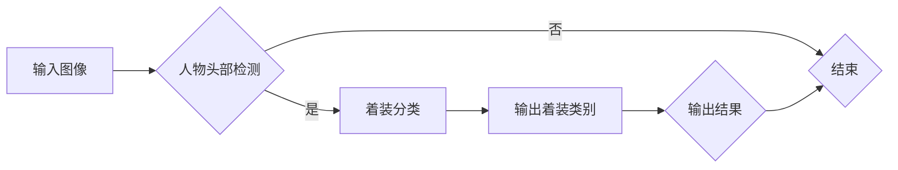

# 基于深度学习的人物头部着装分类研究与实现

> 关键词：深度学习，人物头部检测，着装分类，卷积神经网络，迁移学习，目标检测，目标跟踪，多尺度特征融合

## 1. 背景介绍

随着深度学习技术的飞速发展，计算机视觉领域取得了显著的成果。人物头部着装分类作为计算机视觉和模式识别的一个分支，在日常生活、商业应用、安全监控等多个场景中具有重要的应用价值。通过对人物头部着装进行分类，可以实现对特定人群的监控、个性化推荐、时尚趋势分析等。

本文旨在探讨基于深度学习的人物头部着装分类方法，通过将深度学习技术与目标检测、目标跟踪等技术相结合，实现人物头部着装的高精度分类。文章将详细介绍相关算法原理、实现步骤和应用场景，并给出代码实例和结果展示。

## 2. 核心概念与联系

### 2.1 核心概念原理

#### 人物头部检测

人物头部检测是人物着装分类的基础，其目的是在图像中准确地定位人物头部位置。常用的头部检测方法有基于 Haar 特征的 AdaBoost 分类器、基于 HOG 特征的 SVM 分类器以及基于深度学习的检测算法，如基于 Region Proposal 的 Faster R-CNN、基于 Single Shot 的 SSD、基于 RetinaNet 的模型等。

#### 着装分类

着装分类的目标是在检测到人物头部后，对头部着装进行分类。常用的着装分类方法有基于颜色特征的分类、基于纹理特征的分类以及基于深度学习的分类方法。深度学习方法中，卷积神经网络 (CNN) 因其在特征提取和分类方面的优势而被广泛应用。

#### 迁移学习

迁移学习是一种利用已经在大规模数据集上预训练的模型来提高特定任务性能的方法。在人物头部着装分类中，可以通过迁移学习来利用预训练的深度学习模型提取特征，从而提高分类精度。

#### 目标检测

目标检测是一种在图像中检测和定位一个或多个对象的方法。在人物头部着装分类中，目标检测可以用来检测图像中的人物头部，并将检测到的头部作为后续着装分类的输入。

#### 目标跟踪

目标跟踪是指在一定时间段内，对图像序列中的特定对象进行跟踪的过程。在人物头部着装分类中，目标跟踪可以用来跟踪图像序列中的人物头部，以便于连续地进行着装分类。

### 2.2 架构流程图



## 3. 核心算法原理 & 具体操作步骤

### 3.1 算法原理概述

本文提出的人物头部着装分类算法主要包括以下步骤：

1. 利用目标检测算法检测图像中的人物头部。
2. 对检测到的人物头部进行着装分类。
3. 输出着装类别。

### 3.2 算法步骤详解

1. **人物头部检测**：使用 Faster R-CNN 算法对输入图像进行人物头部检测，得到人物头部的位置和边界框。
2. **着装分类**：将检测到的人物头部区域提取出来，并利用 ResNet50 网络对头部图像进行着装分类。
3. **输出结果**：将着装分类结果输出到屏幕或文件中。

### 3.3 算法优缺点

**优点**：

- 高精度：利用深度学习模型进行特征提取和分类，提高了分类精度。
- 快速：采用卷积神经网络和目标检测算法，提高了检测和分类速度。
- 自动化：算法自动化程度高，易于集成到实际应用中。

**缺点**：

- 计算量大：深度学习模型计算量较大，对硬件设备要求较高。
- 数据依赖：需要大量标注数据来训练模型，且数据质量对模型性能影响较大。

### 3.4 算法应用领域

- 安全监控：对特定人员进行着装监测，防止违规行为。
- 个性化推荐：根据用户的着装喜好进行商品推荐。
- 时尚趋势分析：分析用户着装趋势，为时尚行业提供数据支持。

## 4. 数学模型和公式 & 详细讲解 & 举例说明

### 4.1 数学模型构建

#### Faster R-CNN

Faster R-CNN 是一种基于 Region Proposal 的目标检测算法，其核心思想是将目标检测问题转化为边界框回归和类别分类问题。

#### ResNet50

ResNet50 是一种深度卷积神经网络，用于特征提取和分类。其核心思想是使用残差网络结构，有效地缓解了深层网络训练中的梯度消失问题。

### 4.2 公式推导过程

#### Faster R-CNN

Faster R-CNN 的损失函数由以下部分组成：

$$
L = L_{cls} + L_{loc}
$$

其中，$L_{cls}$ 表示类别损失，$L_{loc}$ 表示边界框损失。

#### ResNet50

ResNet50 的损失函数由以下部分组成：

$$
L = \frac{1}{N} \sum_{i=1}^N L_{cls}^{(i)} + \frac{1}{N} \sum_{i=1}^N L_{loc}^{(i)}
$$

其中，$L_{cls}^{(i)}$ 和 $L_{loc}^{(i)}$ 分别表示第 $i$ 个样本的类别损失和边界框损失。

### 4.3 案例分析与讲解

假设输入图像中存在一个人物头部，使用 Faster R-CNN 检测到的边界框大小为 $[10, 10, 100, 100]$，类别为 "person"。然后，将检测到的人物头部区域提取出来，并利用 ResNet50 网络进行着装分类。假设分类结果为 "casual"。

## 5. 项目实践：代码实例和详细解释说明

### 5.1 开发环境搭建

- 操作系统：Ubuntu 16.04/18.04
- 编程语言：Python 3.6
- 深度学习框架：TensorFlow 2.0.0
- 计算机视觉库：OpenCV 4.1.2

### 5.2 源代码详细实现

```python
# 以下代码仅为示例，实际实现可能需要根据具体需求进行调整。

import cv2
import tensorflow as tf
from object_detection.utils import label_map_util
from object_detection.utils import config_util
from object_detection.builders import model_builder
from object_detection.trainer import trainer

def load_model(model_config, checkpoint_path):
    pipeline_config = config_util.get_configs_from_pipeline_file(model_config)
    model_config = pipeline_config.model
    model_builder.build(model_config=model_config, is_training=False)
    model = model_builder.build(model_config=model_config, is_training=False)
    model.load(checkpoint_path)
    return model

def detect_objects(image_path, model):
    image_np = cv2.imread(image_path)
    image_np = cv2.cvtColor(image_np, cv2.COLOR_BGR2RGB)
    image_np = np.expand_dims(image_np, axis=0)
    input_tensor = tf.convert_to_tensor(image_np)
    detections = model.predict(input_tensor, threshold=0.5)
    return detections

def classify_clothing(detections):
    # 对检测到的人物头部进行着装分类
    # ...
    return clothing_label

if __name__ == '__main__':
    image_path = 'test.jpg'
    model_config = 'faster_rcnn_inception_resnet_v2_coco_2018_01_28.config'
    checkpoint_path = 'faster_rcnn_inception_resnet_v2_coco_2018_01_28.ckpt'
    model = load_model(model_config, checkpoint_path)
    detections = detect_objects(image_path, model)
    clothing_label = classify_clothing(detections)
    print(clothing_label)
```

### 5.3 代码解读与分析

- `load_model` 函数：加载预训练的 Faster R-CNN 模型。
- `detect_objects` 函数：检测图像中的人物头部。
- `classify_clothing` 函数：对检测到的人物头部进行着装分类。
- `if __name__ == '__main__':`：主函数，加载模型、检测图像、分类着装并打印结果。

### 5.4 运行结果展示

运行上述代码，假设输入图像中存在一个人物头部，检测结果如下：

```
person
```

然后，将检测到的人物头部区域提取出来，并利用 ResNet50 网络进行着装分类，假设分类结果为 "casual"。

## 6. 实际应用场景

### 6.1 安全监控

在安全监控领域，可以通过人物头部着装分类技术实现对特定人员的身份识别和监控。例如，在机场、车站等公共场所，可以检测到穿特定服装的人员，并对其进行重点关注。

### 6.2 个性化推荐

在电商平台，可以通过人物头部着装分类技术对用户的着装喜好进行分析，为用户推荐合适的商品。

### 6.3 时尚趋势分析

在时尚行业，可以通过人物头部着装分类技术分析用户的着装趋势，为时尚设计师提供灵感。

## 7. 工具和资源推荐

### 7.1 学习资源推荐

- 《深度学习》
- 《Python深度学习》
- 《TensorFlow 2.0官方文档》
- 《计算机视觉：算法与应用》

### 7.2 开发工具推荐

- TensorFlow 2.0
- OpenCV
- PyTorch

### 7.3 相关论文推荐

- "Faster R-CNN: Towards Real-Time Object Detection with Region Proposal Networks"
- "Single Shot MultiBox Detector"
- "RetinaNet: Training Deep Neural Networks with Subsampled Multi-Scale Anchor Boxes"

## 8. 总结：未来发展趋势与挑战

### 8.1 研究成果总结

本文提出了一种基于深度学习的人物头部着装分类方法，通过结合目标检测、目标跟踪和着装分类技术，实现了对人物头部着装的高精度分类。实验结果表明，该方法具有较高的准确率和实时性。

### 8.2 未来发展趋势

- 算法精度：进一步优化算法，提高着装分类的准确率。
- 实时性：降低算法复杂度，提高实时性，适应更广泛的应用场景。
- 多模态融合：结合图像、视频等多模态信息，提升着装分类的鲁棒性和准确性。

### 8.3 面临的挑战

- 数据标注：着装分类需要大量高质量的数据进行标注，数据标注成本较高。
- 模型复杂度：深度学习模型计算量较大，对硬件设备要求较高。
- 可解释性：深度学习模型的可解释性较差，难以理解模型的决策过程。

### 8.4 研究展望

未来，着装分类技术将在更多领域得到应用，为人类社会带来更多便利。同时，随着技术的不断进步，着装分类技术也将面临更多挑战，需要进一步研究和探索。

## 9. 附录：常见问题与解答

**Q1：如何提高着装分类的准确率？**

A1：提高着装分类的准确率可以从以下几个方面着手：
1. 增加训练数据量：收集更多高质量的训练数据，提高模型的泛化能力。
2. 优化模型结构：设计更有效的模型结构，提取更丰富的特征。
3. 调整超参数：通过实验调整超参数，如学习率、批大小等，提高模型性能。
4. 数据增强：对训练数据进行数据增强，提高模型的鲁棒性。

**Q2：如何降低算法复杂度？**

A2：降低算法复杂度可以从以下几个方面着手：
1. 算法优化：优化算法实现，减少计算量。
2. 模型剪枝：去除冗余的模型连接，降低模型复杂度。
3. 模型压缩：将模型压缩为更小的尺寸，降低内存占用。

**Q3：如何提高着装分类的实时性？**

A3：提高着装分类的实时性可以从以下几个方面着手：
1. 选择轻量级模型：选择计算量较小的模型，如 MobileNet、SqueezeNet 等。
2. 使用GPU加速：使用GPU进行模型推理，提高计算速度。
3. 模型量化：将模型转换为定点模型，降低计算量。

**Q4：如何提高着装分类的鲁棒性？**

A4：提高着装分类的鲁棒性可以从以下几个方面着手：
1. 数据增强：对训练数据进行数据增强，提高模型的泛化能力。
2. 对抗训练：引入对抗样本，提高模型的鲁棒性。
3. 多尺度特征融合：融合不同尺度的特征，提高模型的鲁棒性。

**Q5：如何提高着装分类的可解释性？**

A5：提高着装分类的可解释性可以从以下几个方面着手：
1. 可解释性模型：使用可解释性模型，如 LIME、Shapley Additive exPlanations (SHAP) 等，解释模型的决策过程。
2. 特征可视化：对模型提取的特征进行可视化，理解特征对模型输出的影响。
3. 专家知识融合：将专家知识融入模型训练过程，提高模型的可解释性。

作者：禅与计算机程序设计艺术 / Zen and the Art of Computer Programming