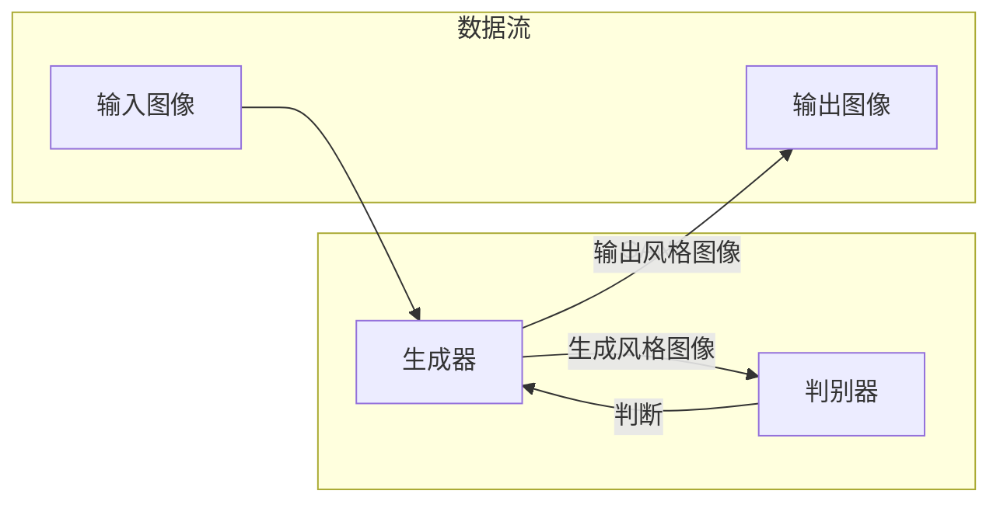

> 图像风格迁移，生成对抗网络，虚拟现实，计算机视觉，深度学习

# 基于生成对抗网络的图像风格迁移在虚拟现实中的应用

### 1. 背景介绍

虚拟现实（Virtual Reality，VR）技术作为一项革命性的计算机视觉应用，正逐渐改变着我们的生活方式。在VR领域，创建逼真的视觉体验至关重要。图像风格迁移技术，通过将一种图像的风格特征应用到另一种图像上，能够显著增强VR内容的视觉吸引力。生成对抗网络（GANs）作为一种先进的深度学习模型，在图像风格迁移方面展现出了巨大的潜力。本文将探讨如何利用GANs实现图像风格迁移，并探讨其在虚拟现实中的应用前景。

### 2. 核心概念与联系

#### 2.1 核心概念

- **图像风格迁移**：将一种图像的“风格”（如印象派、油画等）应用到另一种图像上，使其在保持内容的同时呈现出特定的艺术风格。
- **生成对抗网络（GANs）**：一种由生成器和判别器组成的对抗性网络，旨在生成与真实样本高度相似的图像。
- **虚拟现实（VR）**：一种通过计算机技术模拟或重现现实世界或虚构世界，使用户能够在其中沉浸体验的技术。

#### 2.2 核心概念原理和架构的 Mermaid 流程图



### 3. 核心算法原理 & 具体操作步骤

#### 3.1 算法原理概述

GANs通过两个神经网络——生成器（Generator）和判别器（Discriminator）进行对抗性训练。生成器尝试生成逼真的风格图像，而判别器则尝试区分真实图像和生成图像。通过不断迭代，生成器逐渐学习生成与判别器输出的真实图像难以区分的风格图像。

#### 3.2 算法步骤详解

1. **数据准备**：收集目标风格图像和内容图像的数据集。
2. **模型初始化**：初始化生成器和判别器网络。
3. **训练过程**：
   - 判别器对真实图像和生成图像进行判断。
   - 生成器根据判别器的反馈生成风格图像。
   - 更新生成器和判别器的参数。
4. **输出生成**：生成具有目标风格的内容图像。

#### 3.3 算法优缺点

**优点**：
- 能够生成高质量的风格图像。
- 无需对生成图像进行标注，降低了数据标注成本。
- 可以通过调整网络结构和超参数来控制生成图像的风格和内容。

**缺点**：
- 训练过程复杂，容易出现模式崩溃（Mode Collapse）和梯度消失/爆炸等问题。
- 需要大量的训练数据。

#### 3.4 算法应用领域

- 虚拟现实（VR）内容生成。
- 视频特效制作。
- 艺术创作。
- 图像编辑。

### 4. 数学模型和公式 & 详细讲解 & 举例说明

#### 4.1 数学模型构建

GANs的数学模型可以表示为：

$$
\min_{G} \max_{D} V(G,D) = \mathbb{E}_{x \sim p_{data}(x)}[D(x)] - \mathbb{E}_{z \sim p_{z}(z)}[D(G(z))] 
$$

其中，$p_{data}(x)$ 是真实数据分布，$p_{z}(z)$ 是噪声分布，$G(z)$ 是生成器，$D(x)$ 是判别器。

#### 4.2 公式推导过程

GANs的损失函数由两部分组成：生成器损失和判别器损失。

- **生成器损失**：生成器生成图像与真实图像越接近，损失越低。
- **判别器损失**：判别器正确判断真实图像和生成图像的能力越强，损失越低。

#### 4.3 案例分析与讲解

假设我们想要将一张风景照片的风格迁移到一幅肖像画上。以下是一个简化的流程：

1. **数据准备**：收集风景照片和肖像画作为训练数据。
2. **模型初始化**：初始化生成器和判别器网络。
3. **训练过程**：
   - 判别器对真实肖像画进行判断，输出接近1的值。
   - 判别器对生成器生成的肖像画进行判断，输出接近0的值。
   - 生成器根据判别器的反馈生成更加接近真实肖像画风格的图像。
   - 更新生成器和判别器的参数。
4. **输出生成**：生成具有肖像画风格的风景照片。

### 5. 项目实践：代码实例和详细解释说明

#### 5.1 开发环境搭建

- 安装Python环境。
- 安装PyTorch深度学习框架。
- 安装必要的库，如numpy、PIL等。

#### 5.2 源代码详细实现

```python
import torch
import torchvision.transforms as transforms
from torchvision.utils import save_image
from torch.utils.data import DataLoader
from torchvision.datasets import ImageFolder
from torch.autograd import Variable
import torch.nn as nn
import torch.optim as optim

# 定义生成器和判别器网络
class Generator(nn.Module):
    # ...

class Discriminator(nn.Module):
    # ...

# 初始化网络和优化器
generator = Generator()
discriminator = Discriminator()
optimizer_G = optim.Adam(generator.parameters(), lr=0.001)
optimizer_D = optim.Adam(discriminator.parameters(), lr=0.001)

# 训练过程
for epoch in range(num_epochs):
    for i, (content, style) in enumerate(dataloader):
        # ...

# ...

# 保存生成图像
save_image(generator(content), 'output.png')
```

#### 5.3 代码解读与分析

- 代码首先导入了必要的库和模块。
- 定义了生成器和判别器网络。
- 初始化了网络和优化器。
- 在训练过程中，对内容图像和风格图像进行处理，然后通过生成器和判别器进行训练。
- 最后，将生成的图像保存到文件中。

#### 5.4 运行结果展示

通过运行上述代码，我们可以生成具有目标风格的内容图像。

### 6. 实际应用场景

图像风格迁移技术在虚拟现实中的应用场景包括：

- **场景渲染**：将现实场景的风格迁移到虚拟场景中，增强沉浸感。
- **角色设计**：为虚拟角色设计个性化的外观和风格。
- **环境模拟**：模拟不同的环境风格，如科幻、奇幻等。
- **艺术创作**：创作独特的艺术作品。

### 6.4 未来应用展望

随着GANs和图像风格迁移技术的发展，未来有望在以下方面取得突破：

- **实时风格迁移**：实现实时风格迁移，提升VR体验。
- **多风格迁移**：同时迁移多个风格，创造更多样化的视觉效果。
- **交互式风格迁移**：用户可以根据自己的喜好调整风格迁移参数。

### 7. 工具和资源推荐

#### 7.1 学习资源推荐

- 《生成对抗网络：原理、实现与应用》
- 《深度学习：原理与数学》
- PyTorch官方文档

#### 7.2 开发工具推荐

- PyTorch深度学习框架
- TensorFlow深度学习框架
- OpenCV计算机视觉库

#### 7.3 相关论文推荐

- Unsupervised Representation Learning with Deep Convolutional Generative Adversarial Networks
- Generative Adversarial Text to Image Synthesis

### 8. 总结：未来发展趋势与挑战

#### 8.1 研究成果总结

本文介绍了图像风格迁移技术，并探讨了其在虚拟现实中的应用。通过GANs实现图像风格迁移，能够为VR内容创作带来新的可能性。

#### 8.2 未来发展趋势

- 实时风格迁移
- 多风格迁移
- 交互式风格迁移

#### 8.3 面临的挑战

- 训练效率和稳定性
- 风格迁移的质量和多样性
- 与其他技术的融合

#### 8.4 研究展望

随着技术的不断发展，图像风格迁移技术在虚拟现实中的应用将更加广泛，为用户带来更加沉浸、丰富的VR体验。

---

作者：禅与计算机程序设计艺术 / Zen and the Art of Computer Programming