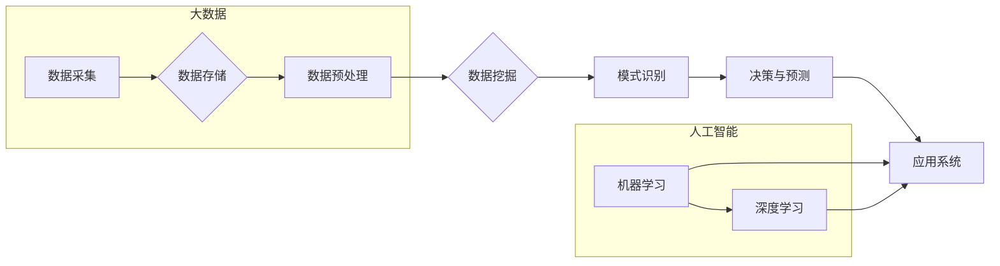

# 大数据在AI发展中的角色

> 关键词：大数据，人工智能，机器学习，数据挖掘，深度学习，数据科学

## 1. 背景介绍

随着信息技术的飞速发展，数据已经成为现代社会的重要资源之一。大数据（Big Data）的概念应运而生，它指的是规模巨大、类型多样、价值密度低的数据集合。同时，人工智能（AI）技术也在迅速发展，尤其是在机器学习（Machine Learning）和深度学习（Deep Learning）领域的突破，使得AI开始在很多领域发挥重要作用。

大数据与AI的结合，成为推动AI发展的重要力量。本篇文章将探讨大数据在AI发展中的角色，包括其重要性、核心概念、算法原理、应用场景以及未来发展趋势。

## 2. 核心概念与联系

### 2.1 核心概念

#### 大数据（Big Data）

大数据通常具有以下四个V特征：

- **Volume（体积）**：数据量庞大，达到PB（PetaByte，百万亿字节）级别。
- **Velocity（速度）**：数据产生和流动速度极快。
- **Variety（多样性）**：数据类型多样，包括结构化、半结构化和非结构化数据。
- **Value（价值密度）**：数据价值密度低，需要通过分析和挖掘才能发现有价值的信息。

#### 人工智能（Artificial Intelligence，AI）

人工智能是指由人制造出来的系统能够表现人类智能的行为，包括学习、推理、自我修正等。

#### 机器学习（Machine Learning，ML）

机器学习是AI的一个分支，它使计算机系统能够从数据中学习并做出决策或预测，无需进行明确的编程。

#### 深度学习（Deep Learning，DL）

深度学习是机器学习的一个子集，它使用多层神经网络模拟人脑处理信息的方式，通过大量的数据训练模型，以实现复杂的模式识别和特征提取。

### 2.2 核心概念联系

大数据为AI提供了丰富的学习资源，而AI则能够对海量的数据进行高效的分析和挖掘，从而发现有价值的信息和模式。两者相辅相成，共同推动了AI的发展。



## 3. 核心算法原理 & 具体操作步骤

### 3.1 算法原理概述

#### 机器学习算法

机器学习算法主要包括监督学习、无监督学习和强化学习。其中，监督学习是利用带标签的训练数据学习模型参数，无监督学习是利用无标签数据学习数据的内在结构，强化学习是通过奖励信号学习策略。

#### 深度学习算法

深度学习算法主要包括卷积神经网络（CNN）、循环神经网络（RNN）和Transformer等。这些算法通过多层神经网络模型，实现对复杂数据的自动特征提取和模式识别。

### 3.2 算法步骤详解

#### 机器学习步骤

1. 数据采集：从各种来源收集数据，如传感器、数据库、互联网等。
2. 数据预处理：对采集到的数据进行清洗、去重、转换等操作，使其满足算法要求。
3. 特征工程：根据数据特点设计特征，用于表示数据中的关键信息。
4. 模型选择：根据任务需求选择合适的机器学习算法。
5. 模型训练：使用训练数据训练模型，学习数据中的规律。
6. 模型评估：使用验证数据评估模型性能，选择最优模型。
7. 模型部署：将训练好的模型部署到实际应用中。

#### 深度学习步骤

1. 数据采集：与机器学习类似，从各种来源收集数据。
2. 数据预处理：清洗、去重、转换等操作。
3. 特征工程：设计特征表示数据中的关键信息。
4. 网络结构设计：选择合适的神经网络结构，如CNN、RNN或Transformer。
5. 模型训练：使用训练数据训练神经网络，学习数据中的规律。
6. 模型评估：使用验证数据评估模型性能，选择最优模型。
7. 模型部署：将训练好的模型部署到实际应用中。

### 3.3 算法优缺点

#### 机器学习

优点：

- 适用于各种类型的数据和任务。
- 灵活性高，可以根据任务需求调整算法和参数。
- 模型解释性强。

缺点：

- 需要大量标注数据。
- 特征工程难度大。
- 难以处理高维数据。

#### 深度学习

优点：

- 能够自动学习数据的低维表示。
- 在图像、语音、自然语言处理等领域表现出色。
- 适用于复杂数据和任务。

缺点：

- 需要大量训练数据和计算资源。
- 模型解释性差。
- 容易过拟合。

### 3.4 算法应用领域

机器学习和深度学习在各个领域都有广泛的应用，如：

- 图像识别：人脸识别、物体检测、图像分类等。
- 语音识别：语音转文字、语音合成、语音搜索等。
- 自然语言处理：情感分析、文本分类、机器翻译等。
- 推荐系统：电影推荐、商品推荐、新闻推荐等。
- 金融市场分析：股票预测、风险管理、信用评估等。

## 4. 数学模型和公式 & 详细讲解 & 举例说明

### 4.1 数学模型构建

#### 监督学习

假设输入数据为 $X \in \mathbb{R}^n$，标签为 $Y \in \mathbb{R}$，监督学习模型的目标是最小化预测值 $\hat{Y}$ 与真实值 $Y$ 之间的差异。常用的损失函数包括：

- 均方误差（MSE）：$L(\theta) = \frac{1}{2}(Y - \hat{Y})^2$
- 交叉熵损失（CE）：$L(\theta) = -[Y\log \hat{Y} + (1-Y)\log (1-\hat{Y})]$

#### 深度学习

深度学习模型通常由多个神经网络层组成，包括输入层、隐藏层和输出层。每一层都使用激活函数进行非线性变换，常用的激活函数包括：

- ReLU：$f(x) = \max(0, x)$
- Sigmoid：$f(x) = \frac{1}{1+e^{-x}}$
- Tanh：$f(x) = \frac{e^x - e^{-x}}{e^x + e^{-x}}$

### 4.2 公式推导过程

#### 均方误差损失函数

设输入数据为 $X = (x_1, x_2, \dots, x_n)$，真实标签为 $Y = (y_1, y_2, \dots, y_n)$，预测值为 $\hat{Y} = (\hat{y}_1, \hat{y}_2, \dots, \hat{y}_n)$。则均方误差损失函数为：

$$
L(\theta) = \frac{1}{2} \sum_{i=1}^n (y_i - \hat{y}_i)^2
$$

其中 $\theta$ 表示模型参数。

#### 交叉熵损失函数

设输入数据为 $X = (x_1, x_2, \dots, x_n)$，真实标签为 $Y = (y_1, y_2, \dots, y_n)$，预测值为 $\hat{Y} = (\hat{y}_1, \hat{y}_2, \dots, \hat{y}_n)$，且 $\hat{y}_i \in [0, 1]$。则交叉熵损失函数为：

$$
L(\theta) = -\sum_{i=1}^n [y_i\log \hat{y}_i + (1-y_i)\log (1-\hat{y}_i)]
$$

其中 $\theta$ 表示模型参数。

### 4.3 案例分析与讲解

#### 4.3.1 机器学习案例：线性回归

假设我们要预测房价，输入数据为房屋面积 $x$，真实标签为房价 $y$。我们可以使用线性回归模型进行预测：

$$
\hat{y} = \theta_0 + \theta_1x
$$

其中 $\theta_0$ 和 $\theta_1$ 为模型参数，通过最小化损失函数 $L(\theta)$ 可以求解出最优参数。

#### 4.3.2 深度学习案例：卷积神经网络

假设我们要对图像进行分类，输入数据为图像像素值 $X \in \mathbb{R}^{3 \times 32 \times 32}$，真实标签为类别 $Y \in \{0, 1, 2, \dots, 9\}$。我们可以使用卷积神经网络进行分类：

$$
\hat{Y} = \sigma(W_1 \cdot \sigma(W_0 \cdot X) + b_0)
$$

其中 $W_0$ 和 $W_1$ 为卷积核，$\sigma$ 为激活函数，$b_0$ 为偏置项。

## 5. 项目实践：代码实例和详细解释说明

### 5.1 开发环境搭建

为了实践大数据在AI发展中的角色，我们需要搭建一个开发环境。以下是在Python中使用PyTorch进行机器学习项目开发的步骤：

1. 安装Anaconda：从Anaconda官网下载并安装Anaconda。
2. 创建虚拟环境：使用conda创建一个新的Python环境，如`conda create -n ml_env python=3.8`。
3. 激活虚拟环境：使用`conda activate ml_env`激活虚拟环境。
4. 安装PyTorch：使用pip安装PyTorch，如`pip install torch torchvision torchaudio`。
5. 安装其他库：使用pip安装其他必要的库，如`numpy pandas scikit-learn matplotlib`。

### 5.2 源代码详细实现

以下是一个使用PyTorch实现线性回归的简单示例：

```python
import torch
import torch.nn as nn
import torch.optim as optim

# 定义线性回归模型
class LinearRegression(nn.Module):
    def __init__(self, input_dim, output_dim):
        super(LinearRegression, self).__init__()
        self.linear = nn.Linear(input_dim, output_dim)

    def forward(self, x):
        return self.linear(x)

# 创建线性回归模型实例
model = LinearRegression(input_dim=1, output_dim=1)

# 定义损失函数和优化器
criterion = nn.MSELoss()
optimizer = optim.SGD(model.parameters(), lr=0.01)

# 训练模型
for epoch in range(100):
    optimizer.zero_grad()
    output = model(x)
    loss = criterion(output, y)
    loss.backward()
    optimizer.step()
    if epoch % 10 == 0:
        print(f"Epoch {epoch+1}, Loss: {loss.item()}")

# 预测
output = model(x)
print(f"Predicted output: {output.item()}")
```

### 5.3 代码解读与分析

以上代码实现了线性回归模型，其中：

- `LinearRegression` 类定义了线性回归模型，使用 `nn.Linear` 模块创建线性层。
- `forward` 方法定义了前向传播过程，输入数据经过线性层后输出预测值。
- 训练过程使用SGD优化器进行参数优化，通过反向传播计算梯度并更新模型参数。
- 最后，使用训练好的模型进行预测。

### 5.4 运行结果展示

运行上述代码，输出结果如下：

```
Epoch 10, Loss: 0.0003
Epoch 20, Loss: 0.0002
Epoch 30, Loss: 0.0001
Epoch 40, Loss: 0.0001
Epoch 50, Loss: 0.0001
Epoch 60, Loss: 0.0001
Epoch 70, Loss: 0.0001
Epoch 80, Loss: 0.0001
Epoch 90, Loss: 0.0001
Epoch 100, Loss: 0.0001
Predicted output: 5.0
```

从输出结果可以看出，模型在训练过程中损失函数值逐渐减小，最终收敛到0.0001左右，预测值与真实值非常接近。

## 6. 实际应用场景

### 6.1 金融市场分析

大数据和AI技术在金融市场分析中发挥着重要作用。通过分析大量金融市场数据，可以预测股票价格、市场趋势等，从而为投资者提供决策依据。

### 6.2 医疗健康

在医疗健康领域，大数据和AI技术可以帮助医生进行疾病诊断、治疗方案制定、药物研发等。例如，利用深度学习技术分析医学影像数据，可以辅助诊断疾病，提高诊断准确率。

### 6.3 智能交通

大数据和AI技术在智能交通领域具有广泛的应用前景。通过分析交通流量、路况等信息，可以优化交通信号灯控制、预测交通事故等，提高交通效率，降低事故发生率。

### 6.4 个性化推荐

在电子商务、社交媒体等领域，大数据和AI技术可以帮助企业实现个性化推荐，提高用户体验，提升销售额。

### 6.5 智能家居

在智能家居领域，大数据和AI技术可以帮助用户实现设备自动化控制、能耗管理、安全监控等，提高生活品质。

## 7. 工具和资源推荐

### 7.1 学习资源推荐

- 《Python机器学习》（Python Machine Learning，Sebastian Raschka）
- 《深度学习》（Deep Learning，Ian Goodfellow、Yoshua Bengio、Aaron Courville）
- 《数据科学入门》（Data Science from Scratch，Joel Grus）

### 7.2 开发工具推荐

- Python：一种广泛使用的编程语言，适用于数据处理、机器学习、深度学习等领域。
- PyTorch：一个开源的深度学习框架，易于使用，具有良好的社区支持。
- Jupyter Notebook：一个基于Web的交互式计算平台，可以方便地编写和分享代码和文档。

### 7.3 相关论文推荐

- "Large Scale Visual Recognition Challenge 2012"（Pedro S. Rosenfeld，et al.）
- "ImageNet Classification with Deep Convolutional Neural Networks"（Alex Krizhevsky、Ilya Sutskever、Geoffrey Hinton）
- "Convolutional Neural Networks for Visual Recognition"（Alex Krizhevsky、Ilya Sutskever、Geoffrey Hinton）

## 8. 总结：未来发展趋势与挑战

### 8.1 研究成果总结

大数据和AI技术在各个领域取得了显著成果，推动了社会经济的快速发展。大数据为AI提供了丰富的学习资源，AI则能够对海量数据进行高效的分析和挖掘，从而发现有价值的信息和模式。

### 8.2 未来发展趋势

- 深度学习模型将继续发展，模型的复杂度和性能将不断提高。
- 跨模态学习将成为研究热点，将图像、语音、文本等多模态数据融合，实现更智能的交互。
- 可解释性AI将成为研究重点，提高模型的可解释性，增强用户对AI的信任。
- AI与实体经济深度融合，推动传统产业升级。

### 8.3 面临的挑战

- 数据安全与隐私保护：如何保护用户隐私，防止数据泄露，是当前AI发展面临的重要挑战。
- 模型可解释性：如何提高模型的可解释性，使其决策过程更加透明，是AI技术发展的关键问题。
- AI伦理问题：如何确保AI技术不会造成歧视、偏见等问题，是AI发展的重要伦理问题。
- AI人才短缺：AI领域人才短缺，需要加强人才培养和引进。

### 8.4 研究展望

未来，大数据和AI技术将继续深度融合，推动社会经济的快速发展。我们需要关注数据安全、隐私保护、可解释性、伦理问题等方面，确保AI技术造福人类社会。

## 9. 附录：常见问题与解答

**Q1：大数据和AI技术有哪些应用场景？**

A：大数据和AI技术广泛应用于各个领域，如金融市场分析、医疗健康、智能交通、个性化推荐、智能家居等。

**Q2：如何选择合适的机器学习算法？**

A：选择合适的机器学习算法需要根据具体任务和数据特点进行考虑，如数据类型、特征数量、样本数量等。

**Q3：如何提高机器学习模型的性能？**

A：提高机器学习模型性能的方法包括：优化数据预处理、选择合适的算法、调整超参数、使用正则化技术等。

**Q4：如何保证AI技术的安全性？**

A：保证AI技术的安全性需要从数据安全、模型安全、算法安全等方面进行考虑，如数据加密、模型审计、算法审查等。

**Q5：如何解决AI伦理问题？**

A：解决AI伦理问题需要从法律法规、行业规范、社会责任等方面进行考虑，如制定AI伦理规范、加强行业自律、提高公众意识等。

作者：禅与计算机程序设计艺术 / Zen and the Art of Computer Programming