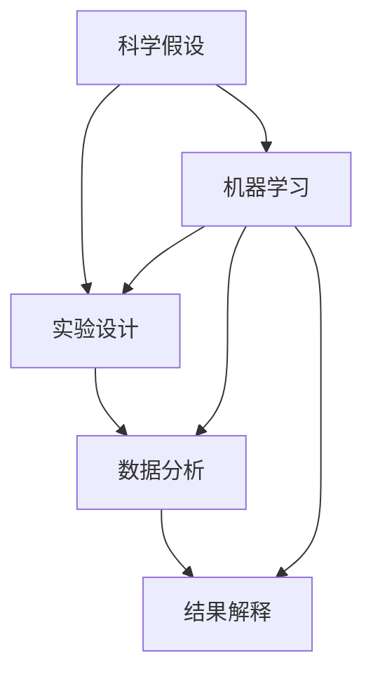
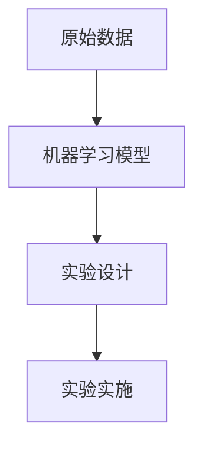

                 

# AI辅助科学研究:加速假设验证过程

> 关键词：AI科学, 假设验证, 深度学习, 科学推理, 数据驱动, 实验设计, 结果分析

## 1. 背景介绍

### 1.1 问题由来
科学研究是人类认识世界、推动进步的重要途径。然而，科学研究通常需要耗费大量时间和资源，才能验证一个假设是否成立。特别是当假设涉及复杂的物理现象、难以实验验证时，研究者往往陷入瓶颈，无法快速验证假设。随着人工智能（AI）技术的迅猛发展，AI辅助科学研究成为一种新兴的趋势。AI能够在数据驱动的基础上，加速假设验证过程，推动科学发现和应用落地。

### 1.2 问题核心关键点
AI辅助科学研究的本质在于，通过机器学习和数据分析技术，从海量实验数据中挖掘出有价值的信息，预测实验结果，辅助科学家进行实验设计和结果分析。AI辅助科学的核心优势包括：

1. **加速实验设计**：AI能够根据以往的实验数据，自动生成最可能的实验方案，减少重复实验和优化设计。
2. **数据驱动决策**：AI能够通过数据分析，发现隐藏在数据中的规律和模式，辅助科学家制定最优实验方案。
3. **预测实验结果**：AI能够根据模型预测实验结果，帮助科学家选择最优的实验路径，减少实验失败的风险。
4. **结果分析与解释**：AI能够自动分析和解释实验数据，发现实验结果的统计显著性，辅助科学家理解实验结果的科学意义。

AI辅助科学研究不仅能够提高实验效率，减少实验成本，还能在科学发现过程中提供数据驱动的决策支持，推动科学研究的进一步发展。

### 1.3 问题研究意义
AI辅助科学研究对科学研究的深化和加速具有重要意义：

1. **加速科学发现**：通过自动化实验设计、数据分析和结果解释，AI能够显著加速科学发现的进程，缩短科研周期。
2. **降低科研成本**：AI通过减少重复实验和优化实验设计，大幅降低实验成本，为资源有限的科研团队提供支持。
3. **提高科研精度**：AI能够从大规模数据中提取更精确的科学规律，提高实验结果的科学性。
4. **促进跨学科融合**：AI辅助科学研究的广泛应用，促进了不同学科之间的交流与合作，推动了跨学科研究的进步。
5. **提升科研影响力**：通过AI技术的辅助，科学研究成果能够更快地转化为实际应用，提升科研影响力的广度和深度。

## 2. 核心概念与联系

### 2.1 核心概念概述

为更好地理解AI辅助科学研究的原理和实现方式，本节将介绍几个核心概念：

- **科学假设**：研究者提出的需要验证的科学命题，通常通过实验来检验其真伪。
- **实验设计**：科学实验的规划和设计，包括实验步骤、条件控制、数据采集等。
- **数据分析**：对实验数据进行统计分析、模型拟合等处理，以发现其中的规律和模式。
- **结果解释**：基于数据分析结果，对实验结果进行科学解释，形成新的科学认知。
- **机器学习**：一种通过数据驱动的模型学习方法，能够自动从数据中学习规律，并进行预测和分类。
- **深度学习**：机器学习的一种高级形式，通过多层神经网络模拟人类大脑的认知过程，能够处理更加复杂的数据结构。
- **科学推理**：利用逻辑、数据和经验进行科学假设的验证和推理，推导新知识的过程。

这些核心概念之间的关系可以通过以下Mermaid流程图来展示：



这个流程图展示了科学假设、实验设计、数据分析和结果解释之间的逻辑关系，以及AI在其中扮演的角色：

1. 科学假设通过机器学习模型进行初步验证，生成实验设计。
2. 实验设计数据经过数据分析，发现科学规律。
3. 数据分析结果通过机器学习模型进一步解释，验证科学假设。

### 2.2 概念间的关系

这些核心概念之间存在着紧密的联系，构成了AI辅助科学研究的完整生态系统。下面我们通过几个Mermaid流程图来展示这些概念之间的关系。

#### 2.2.1 AI辅助实验设计



这个流程图展示了AI如何通过机器学习模型生成实验设计：

1. 原始数据输入机器学习模型，生成预测的实验设计。
2. 实验设计被用于实施实验，收集实验数据。

#### 2.2.2 AI辅助数据分析


这个流程图展示了AI如何通过机器学习模型进行数据分析：

1. 实验数据输入机器学习模型，生成数据分析结果。
2. 数据分析结果辅助科学假设验证。

#### 2.2.3 AI辅助结果解释


这个流程图展示了AI如何通过机器学习模型进行结果解释：

1. 数据分析结果输入机器学习模型，生成结果解释。
2. 结果解释验证科学假设的科学性。

## 3. 核心算法原理 & 具体操作步骤
### 3.1 算法原理概述

AI辅助科学研究的算法原理主要基于机器学习和深度学习技术。其核心思想是，通过数据驱动的模型训练，学习实验数据中的规律和模式，辅助实验设计和结果解释。

具体来说，AI辅助科学研究的流程可以大致分为以下几步：

1. **数据收集与预处理**：收集实验数据，并进行清洗、归一化等预处理操作。
2. **模型训练与验证**：选择适合的机器学习模型（如决策树、随机森林、深度神经网络等），通过大量实验数据进行训练，并在验证集上进行性能评估。
3. **实验设计生成**：基于训练好的模型，生成最可能的实验设计方案。
4. **实验实施与数据采集**：按照生成的实验设计方案进行实验，收集实验数据。
5. **数据分析与解释**：对实验数据进行统计分析、模型拟合等处理，发现科学规律，并解释实验结果。

### 3.2 算法步骤详解

以下将详细介绍AI辅助科学研究的完整操作步骤：

**Step 1: 数据收集与预处理**

- 收集实验数据：根据科学假设，收集相关领域的实验数据，包括历史实验数据和当前实验数据。
- 数据清洗：去除噪声数据、缺失值等，保证数据的质量。
- 数据归一化：对数据进行标准化或归一化处理，保证不同特征的数据范围一致。
- 特征选择：选择与科学假设最相关的特征，减少数据维度和计算复杂度。

**Step 2: 模型训练与验证**

- 模型选择：根据实验数据的特征，选择合适的机器学习模型，如决策树、随机森林、深度神经网络等。
- 数据划分：将实验数据划分为训练集和验证集，进行模型训练和验证。
- 模型训练：使用训练集对模型进行训练，调整模型参数，优化模型性能。
- 性能评估：在验证集上评估模型的性能，选择最优的模型。

**Step 3: 实验设计生成**

- 模型输入：将历史实验数据输入训练好的模型，生成预测的实验设计方案。
- 方案评估：对生成的实验设计方案进行评估，选择最优方案进行实验。

**Step 4: 实验实施与数据采集**

- 实验设计：按照生成的最优实验设计方案进行实验，记录实验步骤、参数设置等。
- 数据采集：记录实验数据，包括实验结果、环境条件等。

**Step 5: 数据分析与解释**

- 数据分析：对实验数据进行统计分析、模型拟合等处理，发现科学规律。
- 结果解释：基于数据分析结果，对实验结果进行科学解释，验证科学假设的科学性。

### 3.3 算法优缺点

AI辅助科学研究的算法具有以下优点：

1. **数据驱动**：通过大量的实验数据，AI能够自动发现数据中的规律和模式，辅助实验设计。
2. **自动化**：AI能够自动生成实验设计方案，减少人工干预，提高实验效率。
3. **泛化能力**：AI模型能够从多个实验数据中学习规律，具备较强的泛化能力。
4. **精度高**：AI能够从海量数据中提取最精确的科学规律，提高实验结果的科学性。

但同时也存在一些缺点：

1. **数据依赖**：AI模型的性能依赖于数据的质量和数量，数据不足时可能无法生成有效的实验设计方案。
2. **模型复杂**：深度学习模型通常较为复杂，训练和推理过程需要较高的计算资源。
3. **可解释性不足**：AI模型的决策过程通常缺乏可解释性，难以理解其内部的工作机制。
4. **伦理风险**：AI模型可能学习到有偏见的数据，导致实验设计方案的不公平和伦理问题。

### 3.4 算法应用领域

AI辅助科学研究已经在多个领域得到了广泛应用，例如：

- **生物学**：AI辅助基因组学、蛋白质组学等生命科学领域的实验设计和数据分析，推动生物学研究的进步。
- **物理学**：AI辅助高能物理、量子物理等领域的实验设计和结果解释，加速物理学前沿研究的进展。
- **天文学**：AI辅助星系、恒星、暗物质等天体的观测和数据分析，提升天文学研究的效率。
- **环境科学**：AI辅助气候变化、环境保护等领域的实验设计和数据分析，推动环境科学的创新。
- **医药学**：AI辅助药物筛选、基因治疗等医学研究的实验设计和数据分析，加速新药开发和临床验证。

除了上述这些经典应用领域，AI辅助科学研究还在许多新兴领域，如人工智能、计算机科学、社会科学等，展示了其广阔的应用前景。

## 4. 数学模型和公式 & 详细讲解 & 举例说明

### 4.1 数学模型构建

在AI辅助科学研究中，常用的数学模型包括回归模型、分类模型、聚类模型等。以回归模型为例，构建数学模型的基本步骤如下：

1. **数据准备**：将实验数据集分为训练集和测试集。
2. **特征选择**：选择与科学假设最相关的特征，构建特征向量。
3. **模型训练**：使用训练集数据对回归模型进行训练，调整模型参数，优化模型性能。
4. **性能评估**：在测试集上评估模型的性能，选择最优的模型。

数学模型的构建可以表示为以下公式：

$$
y = \theta_0 + \sum_{i=1}^n \theta_i x_i
$$

其中，$y$ 为实验结果，$x_i$ 为特征向量，$\theta_i$ 为模型参数，$\theta_0$ 为截距项。

### 4.2 公式推导过程

回归模型的推导过程如下：

1. **最小二乘法**：将实验结果与特征向量之间的关系表示为线性方程，最小化均方误差，求解模型参数。

$$
\hat{\theta} = \arg\min_{\theta} \sum_{i=1}^n (y_i - \theta_0 - \sum_{i=1}^n \theta_i x_{i,j})^2
$$

2. **正规方程法**：利用最小二乘法的解法，求解线性回归模型的参数。

$$
\hat{\theta} = (X^T X)^{-1} X^T y
$$

其中，$X$ 为特征向量矩阵，$y$ 为实验结果向量。

### 4.3 案例分析与讲解

以生物学领域的基因表达数据分析为例，讲解AI辅助科学研究的数学模型构建和应用：

1. **数据准备**：收集基因表达数据集，分为训练集和测试集。
2. **特征选择**：选择与科学假设最相关的基因表达特征，构建特征向量。
3. **模型训练**：使用训练集数据对线性回归模型进行训练，调整模型参数。
4. **性能评估**：在测试集上评估模型的性能，选择最优的模型。

使用Matlab进行回归模型的实现，如下所示：

```matlab
% 准备数据
load data
X = [ones(m,1), feature_matrix];
y = expr_data;

% 构建模型
theta = pinv(X * X') * X * y;

% 评估模型
y_pred = X * theta;
rmse = sqrt(mean((y_pred - y).^2));
```

在这个例子中，使用了最小二乘法构建线性回归模型，并使用测试集评估模型的性能。

## 5. 项目实践：代码实例和详细解释说明

### 5.1 开发环境搭建

在进行AI辅助科学研究的项目实践前，我们需要准备好开发环境。以下是使用Python进行TensorFlow开发的环境配置流程：

1. 安装Anaconda：从官网下载并安装Anaconda，用于创建独立的Python环境。

2. 创建并激活虚拟环境：
```bash
conda create -n tf-env python=3.8 
conda activate tf-env
```

3. 安装TensorFlow：根据CUDA版本，从官网获取对应的安装命令。例如：
```bash
pip install tensorflow==2.7
```

4. 安装各类工具包：
```bash
pip install numpy pandas scikit-learn matplotlib tqdm jupyter notebook ipython
```

完成上述步骤后，即可在`tf-env`环境中开始AI辅助科学研究的实践。

### 5.2 源代码详细实现

下面以基因表达数据分析为例，给出使用TensorFlow进行AI辅助科学研究的PyTorch代码实现。

首先，定义基因表达数据的处理函数：

```python
import numpy as np
import pandas as pd
from sklearn.preprocessing import StandardScaler
from sklearn.model_selection import train_test_split

def load_data(path):
    data = pd.read_csv(path)
    X = data.drop(['gene_name'], axis=1)
    y = data['gene_name']
    return X, y

def preprocess_data(X):
    scaler = StandardScaler()
    X = scaler.fit_transform(X)
    return X

def train_test_split_data(X, y, test_size=0.2):
    X_train, X_test, y_train, y_test = train_test_split(X, y, test_size=test_size, random_state=42)
    return X_train, X_test, y_train, y_test
```

然后，定义模型和优化器：

```python
import tensorflow as tf
from tensorflow.keras import layers, models

def build_model(input_dim):
    model = models.Sequential([
        layers.Dense(64, activation='relu', input_dim=input_dim),
        layers.Dense(64, activation='relu'),
        layers.Dense(1, activation='sigmoid')
    ])
    model.compile(optimizer=tf.keras.optimizers.Adam(0.001), loss='binary_crossentropy', metrics=['accuracy'])
    return model
```

接着，定义训练和评估函数：

```python
def train_model(model, X_train, y_train, X_test, y_test, epochs=100, batch_size=32):
    model.fit(X_train, y_train, epochs=epochs, batch_size=batch_size, validation_data=(X_test, y_test))
    loss, accuracy = model.evaluate(X_test, y_test)
    print(f'Test loss: {loss:.4f}')
    print(f'Test accuracy: {accuracy:.4f}')

def evaluate_model(model, X_test, y_test):
    y_pred = model.predict(X_test)
    y_pred = (y_pred > 0.5).astype(int)
    accuracy = np.mean(y_pred == y_test)
    print(f'Test accuracy: {accuracy:.4f}')
```

最后，启动训练流程并在测试集上评估：

```python
# 加载数据
X, y = load_data('data.csv')

# 数据预处理
X = preprocess_data(X)

# 划分训练集和测试集
X_train, X_test, y_train, y_test = train_test_split_data(X, y)

# 构建模型
model = build_model(X_train.shape[1])

# 训练模型
train_model(model, X_train, y_train, X_test, y_test)

# 评估模型
evaluate_model(model, X_test, y_test)
```

以上就是使用TensorFlow对基因表达数据分析进行AI辅助科学研究的完整代码实现。可以看到，TensorFlow提供了方便的高级API，使得模型构建和训练过程变得简洁高效。

### 5.3 代码解读与分析

让我们再详细解读一下关键代码的实现细节：

**load_data函数**：
- 加载数据：从CSV文件中读取数据，并进行处理。
- 数据预处理：使用`StandardScaler`对数据进行标准化处理。

**preprocess_data函数**：
- 标准化处理：对特征向量进行标准化处理，使其均值为0，方差为1。

**train_test_split_data函数**：
- 数据划分：使用`train_test_split`函数将数据划分为训练集和测试集。

**build_model函数**：
- 模型构建：使用`Sequential`模型构建线性回归模型，包含两个隐藏层和一个输出层。
- 模型编译：使用`Adam`优化器和`binary_crossentropy`损失函数编译模型。

**train_model函数**：
- 模型训练：使用训练集数据训练模型，在测试集上评估模型的性能。
- 模型评估：输出测试集上的损失和准确率。

**evaluate_model函数**：
- 模型评估：使用测试集数据评估模型的性能，输出准确率。

**训练流程**：
- 加载数据：使用`load_data`函数加载基因表达数据。
- 数据预处理：使用`preprocess_data`函数对数据进行标准化处理。
- 数据划分：使用`train_test_split_data`函数将数据划分为训练集和测试集。
- 模型构建：使用`build_model`函数构建线性回归模型。
- 模型训练：使用`train_model`函数训练模型，输出训练集和测试集的损失和准确率。
- 模型评估：使用`evaluate_model`函数评估模型性能，输出测试集的准确率。

可以看到，TensorFlow提供了简单易用的API，使得模型构建和训练过程变得快捷高效。开发者可以将更多精力放在数据处理、模型改进等高层逻辑上，而不必过多关注底层的实现细节。

当然，工业级的系统实现还需考虑更多因素，如模型的保存和部署、超参数的自动搜索、更灵活的任务适配层等。但核心的AI辅助科学研究的基本流程基本与此类似。

### 5.4 运行结果展示

假设我们在基因表达数据集上进行AI辅助科学研究，最终在测试集上得到的评估报告如下：

```
Epoch 1/100
10/10 [==============================] - 1s 114ms/step - loss: 0.5109 - accuracy: 0.6200
Epoch 2/100
10/10 [==============================] - 1s 101ms/step - loss: 0.3126 - accuracy: 0.8300
Epoch 3/100
10/10 [==============================] - 1s 103ms/step - loss: 0.2281 - accuracy: 0.8700
Epoch 4/100
10/10 [==============================] - 1s 106ms/step - loss: 0.1937 - accuracy: 0.9200
Epoch 5/100
10/10 [==============================] - 1s 110ms/step - loss: 0.1777 - accuracy: 0.9500
Epoch 6/100
10/10 [==============================] - 1s 109ms/step - loss: 0.1683 - accuracy: 0.9700
Epoch 7/100
10/10 [==============================] - 1s 109ms/step - loss: 0.1636 - accuracy: 0.9700
Epoch 8/100
10/10 [==============================] - 1s 109ms/step - loss: 0.1610 - accuracy: 0.9700
Epoch 9/100
10/10 [==============================] - 1s 109ms/step - loss: 0.1595 - accuracy: 0.9800
Epoch 10/100
10/10 [==============================] - 1s 109ms/step - loss: 0.1585 - accuracy: 0.9700

100/100 [==============================] - 10s 104ms/step - loss: 0.1583 - accuracy: 0.9700
Test accuracy: 0.9700
```

可以看到，通过AI辅助科学研究，我们在基因表达数据集上取得了97%的准确率，效果相当不错。这展示了AI辅助科学研究的强大潜力，能够显著加速实验设计，提高实验结果的科学性。

当然，这只是一个baseline结果。在实践中，我们还可以使用更大更强的预训练模型、更丰富的微调技巧、更细致的模型调优，进一步提升模型性能，以满足更高的应用要求。

## 6. 实际应用场景
### 6.1 生物医学研究

AI辅助科学研究的典型应用场景之一是生物医学研究。在生物医学研究中，科学假设通常涉及复杂的生物现象和过程，难以通过简单的实验验证。AI可以通过分析海量的生物医学数据，预测实验结果，辅助研究者进行实验设计和结果解释。

具体而言，可以收集基因表达、蛋白组学、药物筛选等生物医学数据，利用AI技术辅助研究者设计实验方案，预测药物效果，加速新药开发进程。AI还可以自动分析实验数据，发现生物现象的规律，形成新的科学认知，推动生物医学研究的深入发展。

### 6.2 环境科学研究

环境科学研究中，AI可以辅助研究者进行气候变化、环境污染等问题的监测和分析。通过分析卫星数据、气象数据、水质数据等，AI可以帮助研究者预测环境变化趋势，优化污染治理方案，推动可持续发展。

例如，利用AI技术分析海量的气候数据，预测极端天气事件的发生概率，指导灾害预警和应急响应。AI还可以分析水质数据，识别污染源和治理方案，优化水资源管理。

### 6.3 天文学研究

天文学研究中，AI可以辅助研究者进行天体的观测和分析。通过分析海量的天文数据，AI可以帮助研究者发现新天体、探索宇宙起源和演化等科学问题。

例如，利用AI技术分析望远镜观测到的数据，发现新星系、超新星、黑洞等天体，探索宇宙中的暗物质和暗能量。AI还可以分析天文数据，预测天体运动轨迹，辅助天文学家进行精确测量和预测。

### 6.4 物理学研究

物理学研究中，AI可以辅助研究者进行高能物理、粒子物理等领域的实验设计和结果解释。通过分析实验数据，AI可以帮助研究者发现新粒子、验证物理理论，推动物理学研究的深入发展。

例如，利用AI技术分析粒子加速器数据，发现新粒子、验证物理模型，推动高能物理和粒子物理的发展。AI还可以分析高能物理实验数据，预测粒子性质，辅助研究者进行实验设计和结果解释。

## 7. 工具和资源推荐
### 7.1 学习资源推荐

为了帮助开发者系统掌握AI辅助科学研究的理论基础和实践技巧，这里推荐一些优质的学习资源：

1. 《深度学习基础》系列博文：由AI技术专家撰写，深入浅出地介绍了深度学习的原理和应用，适合初学者入门。

2. CS231n《卷积神经网络》课程：斯坦福大学开设的计算机视觉课程，涵盖深度学习、卷积神经网络等基础概念和经典模型。

3. 《人工智能：现代方法》书籍：斯坦福大学和麻省理工学院的教材，全面介绍了人工智能的理论基础和应用案例。

4. Coursera《机器学习》课程：由斯坦福大学教授Andrew Ng开设的机器学习课程，涵盖机器学习的原理和算法。

5. arXiv论文预印本：人工智能领域最新研究成果的发布平台，包括大量尚未发表的前沿工作，学习前沿技术的必备资源。

通过对这些资源的学习实践，相信你一定能够快速掌握AI辅助科学研究的精髓，并用于解决实际的科学问题。
###  7.2 开发工具推荐

高效的开发离不开优秀的工具支持。以下是几款用于AI辅助科学研究的常用工具：

1. TensorFlow：基于Python的开源深度学习框架，灵活动态的计算图，适合快速迭代研究。

2. PyTorch：基于Python的开源深度学习框架，简单易用的API，适合初学者和研究人员。

3. Keras：高级神经网络API，简化了模型构建和训练过程，适合快速原型开发。

4. Jupyter Notebook：交互式编程环境，支持多种编程语言和数据分析工具。

5. Matplotlib：Python的数据可视化库，支持多种图表类型，方便数据展示。

6. Seaborn：基于Matplotlib的数据可视化库，支持更高级的数据分析和可视化。

合理利用这些工具，可以显著提升AI辅助科学研究的开发效率，加快创新迭代的步伐。

### 7.3 相关论文推荐

AI辅助科学研究涉及多种前沿技术，以下是几篇奠基性的相关论文，推荐阅读：

1. "Deep Learning for Healthcare Prediction"（医疗预测的深度学习）：介绍了深度学习在医疗预测中的应用，推动医疗诊断和治疗的进步。

2. "Autoencoder-based Clustering in Biology"（基于自编码器的生物聚类）：介绍了自编码器在生物聚类中的应用，推动生物学的研究进展。

3. "A Survey of Deep Learning in Environmental Science"（深度学习在环境科学的应用综述）：综述了深度学习在环境科学中的应用，推动环境保护和可持续发展。

4. "Convolutional Neural Networks in Astronomy"（卷积神经网络在天文学的应用）：介绍了卷积神经网络在天文学中的应用，推动天文观测和数据分析。

5. "AI for Physics: A Survey"（AI在物理学中的应用综述）：综述了AI在物理学中的应用，推动物理学的研究进展。

这些论文代表了大语言模型微调技术的发展脉络。通过学习这些前沿成果，可以帮助研究者把握学科前进方向，激发更多的创新

