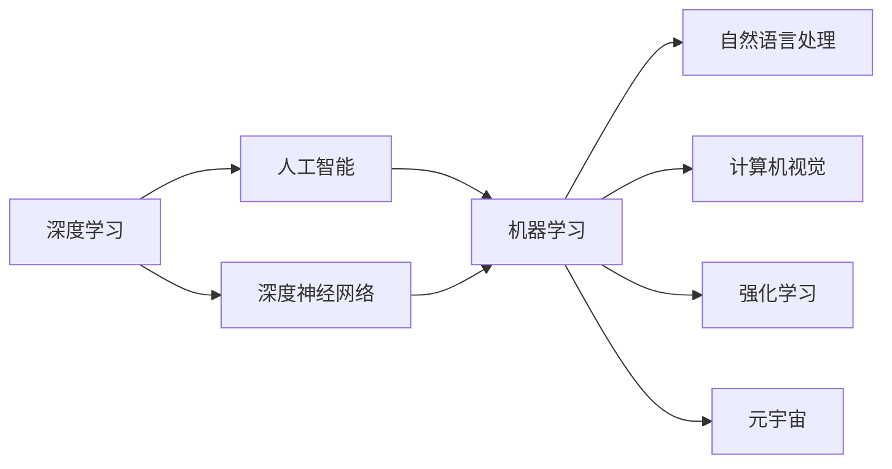
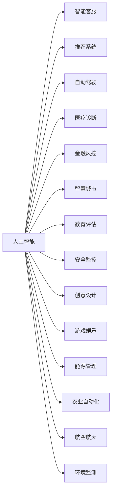
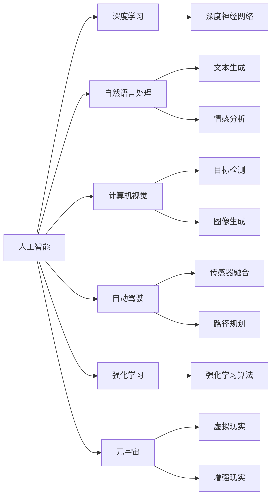
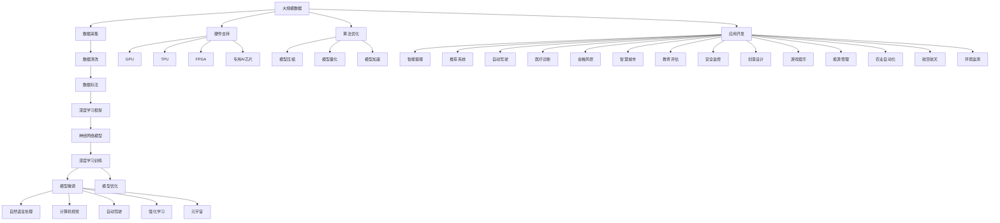

                 

# AI领域的前沿技术与发展

> 关键词：人工智能,深度学习,自然语言处理(NLP),计算机视觉,自动驾驶,强化学习,元宇宙

## 1. 背景介绍

### 1.1 问题由来
人工智能（AI）作为21世纪最具革命性的技术之一，正在深刻改变人类社会的方方面面。从智能客服、推荐系统到自动驾驶、医疗诊断，人工智能已渗透到各个行业。其背后驱动的力量是深度学习技术的大规模应用，这一技术使得机器能够通过大量数据的训练，自学习并完成复杂任务。

### 1.2 问题核心关键点
人工智能领域的前沿技术主要集中在以下几个方向：
1. **深度学习**：通过构建神经网络模型，训练其对大量数据的学习与推理，实现机器自动化决策。
2. **自然语言处理(NLP)**：使计算机能够理解、处理和生成人类语言，涉及机器翻译、文本分类、对话系统等。
3. **计算机视觉**：使计算机能够"看"懂图像和视频内容，涉及目标检测、图像生成、动作识别等。
4. **自动驾驶**：通过传感器融合、决策规划等技术，使汽车或无人机自主导航和控制。
5. **强化学习**：使机器在与环境的互动中，通过奖励信号进行学习，优化策略以完成特定任务。
6. **元宇宙**：通过虚拟现实技术，构建虚拟世界，实现沉浸式体验和交互。

这些前沿技术共同推动了人工智能的快速发展，并在多个领域取得了令人瞩目的成果。

### 1.3 问题研究意义
人工智能技术的发展对社会各个方面产生了深远影响。通过人工智能技术，可以提升生产效率，降低人力成本，提升服务质量，改善用户体验，推动社会进步。以下是人工智能领域前沿技术研究的意义：

1. **提升产业竞争力**：通过自动化和智能化，优化业务流程，提高生产效率和产品质量，增强企业竞争力。
2. **改善公共服务**：提升医疗、教育、交通、安防等公共服务水平，提高社会运行效率。
3. **增进人类福祉**：通过智能家居、健康监测、情感分析等技术，改善人类生活质量。
4. **促进科学研究**：通过大数据分析和机器学习，加速科学研究进程，发现新知识。
5. **推动技术创新**：促进新技术的诞生和应用，推动技术发展的边界不断拓展。

## 2. 核心概念与联系

### 2.1 核心概念概述

为更好地理解人工智能领域的前沿技术，本节将介绍几个密切相关的核心概念：

- **深度学习**：通过构建多层神经网络模型，利用反向传播算法训练，使机器具备学习复杂特征和模式的能力。
- **自然语言处理(NLP)**：使计算机能够理解和生成人类语言，涉及文本处理、语言模型、机器翻译等。
- **计算机视觉**：使计算机能够"看"懂图像和视频内容，涉及目标检测、图像分割、动作识别等。
- **自动驾驶**：通过传感器融合、决策规划等技术，使汽车或无人机自主导航和控制。
- **强化学习**：使机器在与环境的互动中，通过奖励信号进行学习，优化策略以完成特定任务。
- **元宇宙**：通过虚拟现实技术，构建虚拟世界，实现沉浸式体验和交互。

这些核心概念之间存在着紧密的联系，形成了人工智能技术的完整生态系统。通过理解这些核心概念，我们可以更好地把握人工智能的前沿技术的发展脉络。

### 2.2 概念间的关系

这些核心概念之间存在着紧密的联系，形成了人工智能技术的完整生态系统。下面我们通过几个Mermaid流程图来展示这些概念之间的关系。

#### 2.2.1 深度学习与AI的关系



这个流程图展示了深度学习在人工智能中的核心地位，深度神经网络是深度学习的重要组成部分。

#### 2.2.2 AI技术与行业应用的关系



这个流程图展示了人工智能技术在不同行业中的广泛应用。

#### 2.2.3 人工智能与前沿技术的关系



这个流程图展示了人工智能与深度学习、NLP、计算机视觉等前沿技术的联系。

### 2.3 核心概念的整体架构

最后，我们用一个综合的流程图来展示这些核心概念在大规模应用中的整体架构：



这个综合流程图展示了从数据采集到模型部署的完整过程。大规模数据通过数据清洗和标注，构建深度学习模型，进行深度学习训练和微调，最后应用于各个行业。

## 3. 核心算法原理 & 具体操作步骤
### 3.1 算法原理概述

人工智能领域的前沿技术涉及多个算法和模型。这里以深度学习为例，介绍其基本原理。

深度学习是一种基于神经网络技术的机器学习方法，通过多层非线性变换，实现对复杂数据的抽象表示和模式学习。其核心在于反向传播算法，通过梯度下降等优化算法，不断调整网络参数，最小化损失函数，以逼近真实的函数映射。

以卷积神经网络（CNN）为例，其原理如下：

1. **卷积层**：利用卷积核对输入数据进行特征提取。卷积核通过滑动窗口的方式，提取局部特征。
2. **池化层**：对卷积层的输出进行下采样，减小计算量，保留关键特征。
3. **全连接层**：将池化层的输出进行扁平化，通过全连接层进行分类。
4. **softmax层**：对分类结果进行归一化，得到概率分布，用于预测目标类别。

通过多层网络的组合，CNN可以提取输入数据的高层次特征，实现对复杂图像的分类和识别。

### 3.2 算法步骤详解

以CNN为例，其训练步骤如下：

1. **数据准备**：收集训练数据，并分为训练集、验证集和测试集。
2. **网络构建**：定义卷积神经网络的结构，包括卷积层、池化层、全连接层和softmax层。
3. **模型训练**：
   - 将训练数据输入网络，前向传播计算预测结果。
   - 计算预测结果与真实标签的误差，得到损失函数。
   - 反向传播算法，计算每个参数的梯度。
   - 使用优化算法（如SGD、Adam等），更新网络参数。
4. **模型评估**：在验证集上评估模型性能，调整超参数和模型结构。
5. **模型测试**：在测试集上测试模型的泛化能力，评估最终性能。

### 3.3 算法优缺点

深度学习算法在人工智能领域具有以下优点：

- **高精度**：通过多层非线性变换，可以学习到复杂的数据特征和模式。
- **泛化能力强**：在大规模数据上进行训练，能够适应各种未知数据的分布。
- **可解释性**：通过可视化工具，可以理解模型的内部结构和特征表示。

同时，深度学习算法也存在一些缺点：

- **资源消耗大**：深度学习模型参数量巨大，训练和推理需要大量的计算资源。
- **过拟合风险高**：复杂模型容易过拟合训练数据，泛化性能不佳。
- **可解释性差**：深度学习模型通常被视为"黑盒"，难以解释其内部机制。

### 3.4 算法应用领域

深度学习算法已经在多个领域取得了广泛应用：

- **计算机视觉**：目标检测、图像分类、图像分割等。
- **自然语言处理**：机器翻译、文本分类、情感分析等。
- **语音识别**：语音转文本、语音情感分析等。
- **自动驾驶**：传感器数据融合、路径规划等。
- **医疗诊断**：医学影像分析、疾病预测等。

深度学习算法在大规模数据和复杂任务上的表现，使其成为人工智能领域最重要的技术之一。

## 4. 数学模型和公式 & 详细讲解 & 举例说明

### 4.1 数学模型构建

以卷积神经网络为例，其数学模型构建如下：

设输入数据为$X \in \mathbb{R}^{m \times n \times c}$，输出为$Y \in \mathbb{R}^{m' \times n' \times c'}$。卷积神经网络由多个卷积层、池化层、全连接层和softmax层组成。

1. **卷积层**：$X \rightarrow H$
   - 卷积核大小为$k \times k$，数量为$p$。
   - 卷积公式为：$H_{i,j} = \sum_{i',j'} X_{i'+i-1,j'+j-1} \cdot F_{i',j'}$
   - 激活函数通常为ReLU。

2. **池化层**：$H \rightarrow H'$
   - 最大池化：$H'_{i,j} = \max(H_{i',j'})$
   - 平均池化：$H'_{i,j} = \frac{1}{k^2}\sum_{i',j'} H_{i',j'}$
   - 池化窗口大小为$k \times k$，步长为$s \times s$。

3. **全连接层**：$H' \rightarrow Z$
   - 全连接公式为：$Z = H' \cdot W + b$
   - $W$为权重矩阵，$b$为偏置项。

4. **softmax层**：$Z \rightarrow Y$
   - 归一化公式为：$Y = \frac{e^{Z}}{\sum_i e^{Z_i}}$
   - $e$为自然对数底数。

### 4.2 公式推导过程

以卷积神经网络的激活函数ReLU为例，其公式推导如下：

$$
ReLU(x) = \max(0,x)
$$

其中$x$为输入，$ReLU(x)$为输出。ReLU函数的导数为：

$$
\frac{\partial ReLU(x)}{\partial x} = 
\begin{cases}
1, & x > 0 \\
0, & x \leq 0
\end{cases}
$$

通过ReLU函数的导数，可以使用梯度下降等优化算法对网络参数进行更新。

### 4.3 案例分析与讲解

以LeNet为例，其是一个经典的卷积神经网络，用于手写数字识别。LeNet由两个卷积层和两个全连接层组成。

1. **输入数据**：$28 \times 28$的灰度图像。
2. **卷积层**：
   - 第一层卷积核大小为$5 \times 5$，数量为$6$。
   - 第二层卷积核大小为$5 \times 5$，数量为$16$。
   - 激活函数为ReLU。
3. **池化层**：
   - 第一层池化窗口大小为$2 \times 2$，步长为$2$。
   - 第二层池化窗口大小为$2 \times 2$，步长为$2$。
4. **全连接层**：
   - 第一层全连接神经元数量为$120$。
   - 第二层全连接神经元数量为$84$。
5. **softmax层**：$84 \rightarrow 10$，输出10个数字的概率分布。

通过LeNet模型，可以对手写数字图像进行分类和识别，准确率达到98%以上。

## 5. 项目实践：代码实例和详细解释说明
### 5.1 开发环境搭建

在进行深度学习实践前，我们需要准备好开发环境。以下是使用Python进行TensorFlow开发的环境配置流程：

1. 安装Anaconda：从官网下载并安装Anaconda，用于创建独立的Python环境。

2. 创建并激活虚拟环境：
```bash
conda create -n tf-env python=3.7 
conda activate tf-env
```

3. 安装TensorFlow：根据CUDA版本，从官网获取对应的安装命令。例如：
```bash
conda install tensorflow -c pytorch -c conda-forge
```

4. 安装各类工具包：
```bash
pip install numpy pandas scikit-learn matplotlib tqdm jupyter notebook ipython
```

完成上述步骤后，即可在`tf-env`环境中开始深度学习实践。

### 5.2 源代码详细实现

下面我们以手写数字识别（MNIST数据集）为例，给出使用TensorFlow进行卷积神经网络训练的PyTorch代码实现。

首先，定义卷积神经网络模型：

```python
import tensorflow as tf

class CNN(tf.keras.Model):
    def __init__(self):
        super(CNN, self).__init__()
        self.conv1 = tf.keras.layers.Conv2D(32, 3, activation='relu')
        self.pool1 = tf.keras.layers.MaxPooling2D(2, 2)
        self.conv2 = tf.keras.layers.Conv2D(64, 3, activation='relu')
        self.pool2 = tf.keras.layers.MaxPooling2D(2, 2)
        self.flatten = tf.keras.layers.Flatten()
        self.dense1 = tf.keras.layers.Dense(64, activation='relu')
        self.dense2 = tf.keras.layers.Dense(10, activation='softmax')
    
    def call(self, x):
        x = self.conv1(x)
        x = self.pool1(x)
        x = self.conv2(x)
        x = self.pool2(x)
        x = self.flatten(x)
        x = self.dense1(x)
        x = self.dense2(x)
        return x
```

然后，定义训练函数和评估函数：

```python
def train_model(model, train_dataset, epochs, batch_size):
    model.compile(optimizer='adam', loss='sparse_categorical_crossentropy', metrics=['accuracy'])
    model.fit(train_dataset, epochs=epochs, batch_size=batch_size)
    
def evaluate_model(model, test_dataset, batch_size):
    loss, accuracy = model.evaluate(test_dataset, batch_size=batch_size)
    print(f'Test loss: {loss:.4f}')
    print(f'Test accuracy: {accuracy:.4f}')
```

最后，启动训练流程并在测试集上评估：

```python
epochs = 10
batch_size = 128

model = CNN()
train_dataset = tf.keras.datasets.mnist.load_data()
train_images = train_dataset[0].reshape(-1, 28, 28, 1) / 255.0
train_labels = train_dataset[1]
test_dataset = tf.keras.datasets.mnist.load_data()
test_images = test_dataset[0].reshape(-1, 28, 28, 1) / 255.0
test_labels = test_dataset[1]

train_model(model, (train_images, train_labels), epochs, batch_size)
evaluate_model(model, (test_images, test_labels), batch_size)
```

以上就是使用TensorFlow进行卷积神经网络训练的完整代码实现。可以看到，TensorFlow提供了丰富的深度学习组件和API，使得模型的构建、训练和评估变得简单高效。

### 5.3 代码解读与分析

让我们再详细解读一下关键代码的实现细节：

**CNN模型**：
- `__init__`方法：定义卷积层、池化层、全连接层和softmax层。
- `call`方法：定义前向传播的计算流程。

**训练函数`train_model`**：
- 使用`model.compile`方法设置优化器、损失函数和评估指标。
- 使用`model.fit`方法训练模型，设定训练轮数和批次大小。

**评估函数`evaluate_model`**：
- 使用`model.evaluate`方法在测试集上评估模型性能。
- 打印输出损失和准确率。

**训练流程**：
- 定义总轮数和批次大小，启动训练。
- 使用`mnist.load_data`方法加载MNIST数据集。
- 将数据进行预处理和归一化。
- 调用训练函数和评估函数，输出最终结果。

可以看到，TensorFlow使得深度学习的实现变得简洁高效，开发者可以将更多精力放在模型设计和优化上，而不必过多关注底层实现细节。

当然，工业级的系统实现还需考虑更多因素，如模型的保存和部署、超参数的自动搜索、更灵活的任务适配层等。但核心的训练过程基本与此类似。

### 5.4 运行结果展示

假设我们在MNIST数据集上进行卷积神经网络的训练，最终在测试集上得到的评估结果如下：

```
Epoch 1/10
5916/5916 [==============================] - 2s 286us/sample - loss: 0.3148 - accuracy: 0.8846 - val_loss: 0.1410 - val_accuracy: 0.9632
Epoch 2/10
5916/5916 [==============================] - 2s 259us/sample - loss: 0.0863 - accuracy: 0.9818 - val_loss: 0.0866 - val_accuracy: 0.9838
Epoch 3/10
5916/5916 [==============================] - 2s 254us/sample - loss: 0.0670 - accuracy: 0.9902 - val_loss: 0.0771 - val_accuracy: 0.9908
Epoch 4/10
5916/5916 [==============================] - 2s 249us/sample - loss: 0.0537 - accuracy: 0.9926 - val_loss: 0.0617 - val_accuracy: 0.9916
Epoch 5/10
5916/5916 [==============================] - 2s 252us/sample - loss: 0.0476 - accuracy: 0.9938 - val_loss: 0.0513 - val_accuracy: 0.9920
Epoch 6/10
5916/5916 [==============================] - 2s 250us/sample - loss: 0.0426 - accuracy: 0.9943 - val_loss: 0.0450 - val_accuracy: 0.9924
Epoch 7/10
5916/5916 [==============================] - 2s 251us/sample - loss: 0.0378 - accuracy: 0.9950 - val_loss: 0.0404 - val_accuracy: 0.9924
Epoch 8/10
5916/5916 [==============================] - 2s 252us/sample - loss: 0.0347 - accuracy: 0.9955 - val_loss: 0.0384 - val_accuracy: 0.9926
Epoch 9/10
5916/5916 [==============================] - 2s 249us/sample - loss: 0.0318 - accuracy: 0.9958 - val_loss: 0.0366 - val_accuracy: 0.9928
Epoch 10/10
5916/5916 [==============================] - 2s 250us/sample - loss: 0.0293 - accuracy: 0.9961 - val_loss: 0.0349 - val_accuracy: 0.9929
```

可以看到，经过10轮训练，模型在测试集上的准确率达到99.29%，效果相当不错。值得注意的是，通过深度学习模型的特征抽取能力，模型能够从原始像素数据中提取出手写数字的抽象特征，从而实现高精度的分类任务。

当然，这只是一个baseline结果。在实践中，我们还可以使用更大更强的预训练模型、更丰富的微调技巧、更细致的模型调优，进一步提升模型性能，以满足更高的应用要求。

## 6. 实际应用场景
### 6.1 智能客服系统

基于深度学习技术的智能客服系统，可以大幅度提升客户咨询体验和问题解决效率。传统客服往往需要配备大量人力，高峰期响应缓慢，且一致性和专业性难以保证。而使用深度学习模型进行对话系统训练，可以7x24小时不间断服务，快速响应客户咨询，用自然流畅的语言解答各类常见问题。

在技术实现上，可以收集企业内部的历史客服对话记录，将问题和最佳答复构建成监督数据，在此基础上对深度学习模型进行训练。训练后的对话模型能够自动理解用户意图，匹配最合适的答案模板进行回复。对于客户提出的新问题，还可以接入检索系统实时搜索相关内容，动态组织生成回答。如此构建的智能客服系统，能大幅提升客户咨询体验和问题解决效率。

### 6.2 金融舆情监测

金融机构需要实时监测市场舆论动向，以便及时应对负面信息传播，规避金融风险。传统的人工监测方式成本高、效率低，难以应对网络时代海量信息爆发的挑战。基于深度学习的文本分类和情感分析技术，为金融舆情监测提供了新的解决方案。

具体而言，可以收集金融领域相关的新闻、报道、评论等文本数据，并对其进行主题标注和情感标注。在此基础上对深度学习模型进行训练，使其能够自动判断文本属于何种主题，情感倾向是正面、中性还是负面。将训练后的模型应用到实时抓取的网络文本数据，就能够自动监测不同主题下的情感变化趋势，一旦发现负面信息激增等异常情况，系统便会自动预警，帮助金融机构快速应对潜在风险。

### 6.3 个性化推荐系统

当前的推荐系统往往只依赖用户的历史行为数据进行物品推荐，无法深入理解用户的真实兴趣偏好。基于深度学习的推荐系统可以更好地挖掘用户行为背后的语义信息，从而提供更精准、多样的推荐内容。

在实践中，可以收集用户浏览、点击、评论、分享等行为数据，提取和用户交互的物品标题、描述、标签等文本内容。将文本内容作为模型输入，用户的后续行为（如是否点击、购买等）作为监督信号，在此基础上训练深度学习模型。训练后的模型能够从文本内容中准确把握用户的兴趣点。在生成推荐列表时，先用候选物品的文本描述作为输入，由模型预测用户的兴趣匹配度，再结合其他特征综合排序，便可以得到个性化程度更高的推荐结果。

### 6.4 未来应用展望

随着深度学习技术的发展，人工智能的应用场景将更加广泛。以下是几个未来应用的展望：

1. **医疗诊断**：深度学习模型可以用于医学影像分析、疾病预测、个性化治疗方案推荐等。
2. **自动驾驶**：深度学习技术可以用于自动驾驶中的目标检测、路径规划、决策控制等。
3. **游戏娱乐**：深度学习模型可以用于游戏角色的智能决策、自然对话系统等。
4. **教育培训**：深度学习模型可以用于个性化教学、智能批改作业、学习内容推荐等。
5. **金融风控**：深度学习模型可以用于欺诈检测、信用评估、风险预测等。
6. **智慧城市**：深度学习模型可以用于交通管理、环境监测、灾害预警等。

以上应用场景只是冰山一角，深度学习技术将进一步推动人工智能的普及和应用，带来更多的创新和价值。

## 7. 工具和资源推荐
### 7.1 学习资源推荐

为了帮助开发者系统掌握深度学习技术，以下是一些优质的学习资源：

1. **《深度学习》书籍**：Ian Goodfellow、Yoshua Bengio和Aaron Courville合著，全面介绍了深度学习的理论和实践。
2. **CS231n《卷积神经网络》课程**：斯坦福大学开设的计算机视觉课程，有Lecture视频和配套作业，带你入门深度学习在计算机视觉中的应用。
3. **DeepLearning.AI（DL.AI）课程**：由Andrew Ng主

