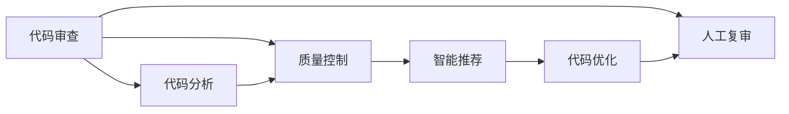

                 

## 1. 背景介绍

在快速迭代的软件开发过程中，代码审查与质量控制是保障软件质量、提高开发效率的关键环节。然而，传统的人工审查方式存在耗时耗力、标准不统一、无法覆盖所有问题等缺点。随着AI技术和大数据分析的发展，通过AI驱动的代码审查与质量控制成为新的研究方向，逐步成为软件工程领域的一大趋势。

本文将全面系统地介绍AI驱动的代码审查与质量控制的方法和应用，深入分析其技术原理和实际效果，探讨未来的发展方向和面临的挑战，并提供详细的代码实践和工具推荐，帮助读者理解和掌握这一前沿技术。

## 2. 核心概念与联系

### 2.1 核心概念概述

为了更好地理解AI驱动的代码审查与质量控制，首先需要了解几个核心概念：

- **代码审查（Code Review）**：由软件开发者对其代码进行互相审查，检查代码质量、安全性和可维护性等，从而提高代码质量和开发效率。
- **质量控制（Quality Control）**：通过一系列流程和手段，确保软件产品符合预期质量标准，包含测试、调试、优化等环节。
- **AI驱动（AI-Driven）**：借助机器学习、自然语言处理、计算机视觉等AI技术，自动化、智能化地进行代码审查和质量控制。
- **代码分析（Code Analysis）**：通过静态或动态分析工具，对代码进行自动检查，发现潜在问题和代码规范缺陷。
- **智能推荐（Smart Recommendation）**：基于历史代码和审查经验，生成个性化建议，辅助开发者改进代码质量。

这些概念通过以下Mermaid流程图展示了它们之间的联系和作用：



这个流程图展示了从代码审查开始，通过代码分析、质量控制、智能推荐等环节，最终优化代码的过程。其中，代码分析是基础，质量控制是保障，智能推荐提供辅助，人工复审是最终保障。

### 2.2 概念间的关系

- **代码审查与质量控制**：代码审查是质量控制的重要手段，确保代码质量符合标准。质量控制不仅包括代码审查，还包括测试、调试、优化等环节，形成系统的质量保障体系。
- **AI驱动与代码分析**：AI驱动的核心在于自动化和智能化，通过机器学习等技术，实现代码分析的自动化，提升审查效率和效果。
- **智能推荐与代码优化**：智能推荐可以辅助开发者改进代码质量，通过数据分析和学习，生成个性化建议，从而提升代码的可读性和可维护性。
- **人工复审与AI驱动**：人工复审是AI驱动的补充，两者结合，可以弥补AI的不足，提高审查的准确性和完备性。

这些概念相互关联，共同构成了AI驱动的代码审查与质量控制框架，有助于提升软件开发的整体质量和效率。

## 3. 核心算法原理 & 具体操作步骤

### 3.1 算法原理概述

AI驱动的代码审查与质量控制主要依赖于机器学习和自然语言处理等AI技术，通过自动化和智能化的方法，提高代码审查的效率和效果。其核心算法包括以下几个方面：

- **代码分类与特征提取**：利用自然语言处理技术，提取代码的关键特征，如语法结构、变量命名、函数调用等，进行代码分类和类型识别。
- **代码质量评估**：通过机器学习模型，对代码质量进行综合评估，包括代码规范性、可读性、可维护性、安全性等方面。
- **智能推荐**：基于历史代码和审查经验，生成个性化的代码改进建议，辅助开发者优化代码质量。
- **自然语言处理**：利用NLP技术，理解代码注释和日志，提供有针对性的建议和改进方案。

### 3.2 算法步骤详解

以下是一个基于AI驱动的代码审查与质量控制的详细操作步骤：

1. **数据收集与预处理**：
   - 收集历史代码、代码审查记录、代码质量评估结果等数据。
   - 清洗和标准化数据，提取关键特征，如函数调用、变量名、注释等。

2. **代码分类与特征提取**：
   - 使用NLP技术，对代码进行分词、词性标注等处理。
   - 提取代码的关键特征，如函数调用频率、变量命名规范、注释质量等。

3. **代码质量评估**：
   - 使用机器学习模型，对代码进行质量评估，如代码规范性、可读性、可维护性、安全性等。
   - 设计多层次的评估指标，综合考虑代码的质量和特点。

4. **智能推荐**：
   - 基于历史代码和审查经验，生成个性化建议，辅助开发者改进代码质量。
   - 使用推荐系统算法，如协同过滤、内容推荐等，提供有针对性的改进建议。

5. **代码优化**：
   - 根据智能推荐的结果，修改代码，提升代码质量。
   - 自动化重构和优化代码结构，提升代码的可读性和可维护性。

6. **人工复审与反馈**：
   - 对智能推荐的结果进行人工复审，确保改进建议的准确性和实用性。
   - 收集开发者的反馈，持续优化和改进模型。

### 3.3 算法优缺点

**优点**：
- **高效性**：自动化和智能化的审查过程，大幅提升审查效率，减少人工劳动。
- **一致性**：统一的审查标准和流程，确保代码质量的一致性。
- **可扩展性**：可以灵活扩展到多种编程语言和框架，适应不同的开发环境。

**缺点**：
- **依赖数据质量**：模型和算法的性能依赖于高质量的数据，数据不充分或质量不佳会影响结果。
- **无法完全替代人工**：AI驱动的审查可以辅助人工，但不能完全替代人工审查，仍需结合人工复审。
- **对新技术支持有限**：模型和算法需要定期更新和维护，以支持新技术和新特性。

### 3.4 算法应用领域

AI驱动的代码审查与质量控制广泛应用于软件开发流程的各个环节，以下是一些典型应用领域：

1. **代码质量评估**：
   - 在项目初期进行代码质量评估，提供项目整体的代码健康度报告。
   - 在代码审查中，对代码进行实时评估，辅助开发者发现潜在问题和改进方案。

2. **代码智能推荐**：
   - 基于历史代码和审查经验，生成个性化的代码改进建议，提升代码质量。
   - 提供代码格式化、变量命名、函数调用等方面的建议，辅助开发者改进代码结构。

3. **代码复审辅助**：
   - 自动化辅助代码复审，提供初步的代码审查结果，辅助人工复审。
   - 生成代码审查报告，记录代码问题、改进建议和复审结果，提供历史数据支持。

4. **代码优化与重构**：
   - 基于代码分析结果，自动化重构和优化代码结构，提升代码的可读性和可维护性。
   - 通过静态和动态分析工具，发现并修复潜在问题，提高代码质量。

## 4. 数学模型和公式 & 详细讲解 & 举例说明

### 4.1 数学模型构建

在AI驱动的代码审查与质量控制中，数学模型主要包括以下几个方面：

- **代码分类模型**：用于分类代码的类型和风格，如函数、类、注释等。
- **代码质量评估模型**：综合评估代码的质量，如规范性、可读性、可维护性、安全性等。
- **智能推荐模型**：基于历史数据和代码特征，生成个性化的改进建议。

### 4.2 公式推导过程

以下是一个简单的代码质量评估模型的推导过程：

1. **特征提取**：
   - 设$x$为代码的特征向量，如函数调用频率、变量命名规范、注释质量等。
   - 设$y$为代码的质量标签，如高、中、低质量等。

2. **模型训练**：
   - 使用线性回归模型，计算代码质量$y$与特征$x$之间的关系。
   - 设模型参数为$\theta$，则模型为：
     \[
     y = \theta^T x + b
     \]
     其中$b$为偏置项。

3. **模型评估**：
   - 使用交叉熵损失函数，计算模型预测值与真实标签之间的差异。
   - 设损失函数为$L$，则：
     \[
     L = -\frac{1}{N}\sum_{i=1}^N (y_i \log \hat{y}_i + (1-y_i) \log (1-\hat{y}_i))
     \]
     其中$\hat{y}_i$为模型的预测值。

### 4.3 案例分析与讲解

假设我们要对一段代码进行质量评估，该代码包含以下特征：
- 函数调用频率为$x_1=10$次。
- 变量命名规范为$x_2=1$（0表示不规范，1表示规范）。
- 注释质量为$x_3=0.8$（0表示注释缺失，1表示完整）。

根据上述模型，我们可以计算该代码的质量预测值：

\[
\hat{y} = \theta^T x + b = \begin{bmatrix} w_1 \\ w_2 \\ w_3 \\ b \end{bmatrix} \begin{bmatrix} x_1 \\ x_2 \\ x_3 \end{bmatrix} + b
\]

其中$\theta$为模型参数，$b$为偏置项。

通过模型训练和评估，我们可以得到$w_1=0.5, w_2=0.3, w_3=0.2, b=0.1$。因此，该代码的质量预测值为：

\[
\hat{y} = 0.5 \times 10 + 0.3 \times 1 + 0.2 \times 0.8 + 0.1 = 6.6
\]

如果我们将$y$定义为质量等级，如高（1）、中（0.5）、低（0），那么该代码的质量等级为中等级。

## 5. 项目实践：代码实例和详细解释说明

### 5.1 开发环境搭建

要在Python中使用AI驱动的代码审查与质量控制，需要以下开发环境：

1. **安装Python**：
   - 从官网下载并安装Python 3.x版本。

2. **安装依赖库**：
   - 使用pip安装必要的依赖库，如Pandas、NumPy、Scikit-learn等。

3. **安装AI驱动工具**：
   - 安装AI驱动工具，如DeepCode、Gerrit、Phabricator等。

4. **配置开发环境**：
   - 配置环境变量，确保代码审查工具可以正常运行。

### 5.2 源代码详细实现

以下是一个简单的代码质量评估工具的实现示例：

```python
import pandas as pd
import numpy as np
from sklearn.linear_model import LinearRegression

# 加载数据
data = pd.read_csv('code_quality.csv')

# 特征提取
x = data[['function_calls', 'variable_naming', 'comment_quality']].values
y = data['quality'].values

# 训练模型
model = LinearRegression()
model.fit(x, y)

# 预测代码质量
x_test = np.array([[10, 1, 0.8]])
y_pred = model.predict(x_test)
print(y_pred)
```

### 5.3 代码解读与分析

上述代码实现了一个简单的线性回归模型，用于评估代码的质量。具体步骤如下：

1. **数据加载**：从CSV文件中加载历史代码质量数据。
2. **特征提取**：提取代码的关键特征，如函数调用频率、变量命名规范、注释质量等。
3. **模型训练**：使用线性回归模型，训练代码质量评估模型。
4. **代码预测**：输入新的代码特征向量，预测代码质量。

### 5.4 运行结果展示

假设我们加载的历史数据为：
- 函数调用频率（$x_1$）
- 变量命名规范（$x_2$）
- 注释质量（$x_3$）
- 代码质量等级（$y$）

运行上述代码，可以得到代码质量预测结果。例如，对于代码特征向量$[10, 1, 0.8]$，预测结果为$y_{pred} = 6.6$，表示代码质量等级为中等级。

## 6. 实际应用场景

### 6.1 软件开发团队

AI驱动的代码审查与质量控制在软件开发团队中具有广泛应用。通过自动化和智能化的方法，可以快速发现和修复代码缺陷，提高代码质量，加速软件开发进度。

### 6.2 开源社区

开源社区通常需要大量的代码审查和质量控制工作，AI驱动的代码审查工具可以显著降低人工劳动，提高代码审查效率，确保开源社区的代码质量。

### 6.3 企业IT部门

企业IT部门需要管理和维护大量的系统代码，通过AI驱动的代码审查工具，可以提高代码质量，减少漏洞和安全问题，保障系统稳定运行。

## 7. 工具和资源推荐

### 7.1 学习资源推荐

- **GitHub**：提供大量的开源代码和项目，可以学习和借鉴AI驱动的代码审查与质量控制的实现。
- **Coursera**：提供相关的AI和机器学习课程，帮助理解代码审查与质量控制的原理。
- **DeepCode**：提供大量的代码分析和质量控制工具，了解最新的AI驱动代码审查技术。

### 7.2 开发工具推荐

- **DeepCode**：提供代码分析和质量控制工具，支持多种编程语言和框架。
- **Gerrit**：开源的代码审查工具，支持插件扩展和定制化。
- **Phabricator**：综合的开发管理平台，集成了代码审查、质量控制等功能。

### 7.3 相关论文推荐

- **"DeepCode: Deep Learning for Software Source Code Review and Recommendations"**：DeepCode的介绍和应用，详细介绍了AI驱动的代码审查与质量控制技术。
- **"Code Quality Assurance: A Survey"**：代码质量保障综述，介绍了多种代码质量评估和审查方法。
- **"Machine Learning for Software Quality Prediction and Recommendation"**：机器学习在代码质量预测和推荐中的应用，提供了详细的算法和实现案例。

## 8. 总结：未来发展趋势与挑战

### 8.1 研究成果总结

本文详细介绍了AI驱动的代码审查与质量控制的方法和应用，探讨了其技术原理和实际效果。通过代码实例和工具推荐，帮助读者理解和掌握这一前沿技术。

### 8.2 未来发展趋势

未来，AI驱动的代码审查与质量控制将呈现以下发展趋势：

1. **自动化程度提升**：通过更高级的算法和模型，提高代码审查的自动化和智能化水平。
2. **多模态融合**：结合代码分析、代码审查、代码注释等多模态信息，提高代码审查的全面性和准确性。
3. **跨语言支持**：支持多种编程语言和框架，扩展到不同的开发环境。
4. **实时反馈机制**：引入实时反馈机制，提高代码审查和质量控制的实时性和互动性。

### 8.3 面临的挑战

尽管AI驱动的代码审查与质量控制在技术上取得了一些进展，但仍面临以下挑战：

1. **数据获取难度**：高质量的代码审查数据获取难度大，需要大量标注数据和历史代码。
2. **模型复杂度**：复杂的模型需要更多的计算资源和时间，增加系统部署和维护成本。
3. **算法透明性**：AI模型的透明性和可解释性不足，难以理解和调试。
4. **跨领域适应性**：现有模型和算法在不同领域的适用性有限，需要针对特定领域进行定制化。

### 8.4 研究展望

未来，AI驱动的代码审查与质量控制需要从以下几个方面进行研究：

1. **多模态融合**：结合代码分析、代码注释、代码历史等多模态信息，提高代码审查的全面性和准确性。
2. **跨领域应用**：开发通用的代码审查和质量控制框架，支持多种编程语言和框架。
3. **实时反馈机制**：引入实时反馈机制，提高代码审查和质量控制的实时性和互动性。
4. **可解释性增强**：提高AI模型的透明性和可解释性，便于理解和调试。

## 9. 附录：常见问题与解答

**Q1：如何提高AI驱动代码审查工具的准确性？**

A: 提高AI驱动代码审查工具的准确性需要以下几个方面的努力：
1. **数据质量**：收集和标注高质量的代码审查数据，确保数据的多样性和代表性。
2. **模型优化**：使用更高级的算法和模型，优化模型参数，提升模型准确性。
3. **多模态融合**：结合代码分析、代码注释、代码历史等多模态信息，提高代码审查的全面性和准确性。
4. **持续改进**：通过持续优化和改进，不断提升工具的准确性和适用性。

**Q2：AI驱动的代码审查工具能否完全替代人工审查？**

A: AI驱动的代码审查工具可以辅助人工进行代码审查，但不能完全替代人工审查。人工审查可以发现一些AI难以检测的隐性问题，如设计缺陷、用户体验等。因此，AI驱动的代码审查工具需要与人工审查结合使用，形成互补。

**Q3：AI驱动的代码审查工具如何应对新技术和新特性？**

A: AI驱动的代码审查工具需要定期更新和维护，以支持新技术和新特性。可以引入模型更新机制，根据新技术和新特性的出现，及时调整模型和算法，确保工具的适用性和有效性。

**Q4：如何确保AI驱动的代码审查工具的安全性和隐私性？**

A: 确保AI驱动的代码审查工具的安全性和隐私性需要以下几个方面的努力：
1. **数据加密**：对数据进行加密处理，防止数据泄露。
2. **模型审计**：对模型进行定期审计和评估，确保模型的公平性和安全性。
3. **访问控制**：设置访问权限，确保只有授权人员可以访问和使用工具。
4. **隐私保护**：对用户数据进行隐私保护，确保数据的匿名性和安全性。

**Q5：AI驱动的代码审查工具如何实现跨领域适应？**

A: 实现AI驱动的代码审查工具跨领域适应需要以下几个方面的努力：
1. **模型定制化**：针对特定领域，进行模型定制化，优化模型参数和特征提取。
2. **多模态融合**：结合代码分析、代码注释、代码历史等多模态信息，提高代码审查的全面性和准确性。
3. **领域知识引入**：引入领域知识，如知识图谱、规则库等，增强模型的领域适应性。
4. **动态调整**：根据领域特点和变化，动态调整模型和算法，提高适应性。

通过这些努力，AI驱动的代码审查工具可以更好地适应不同的开发环境，提升代码审查的效率和效果。

---

作者：禅与计算机程序设计艺术 / Zen and the Art of Computer Programming

