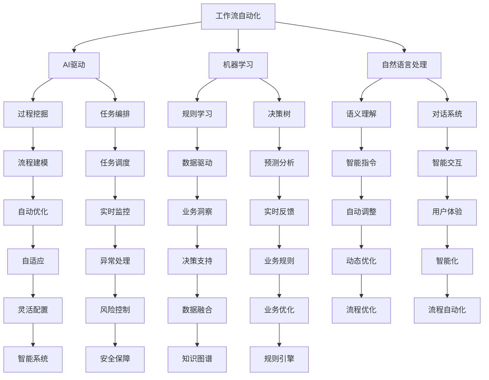

                 

# AI驱动的工作流自动化趋势分析

> 关键词：
- 人工智能(AI)
- 工作流自动化(Workflow Automation)
- 过程挖掘(Process Mining)
- 任务编排(Task Orchestration)
- 机器学习(Machine Learning)
- 自然语言处理(Natural Language Processing)
- 低代码开发(Low Code Development)

## 1. 背景介绍

### 1.1 问题由来

随着信息技术的迅猛发展，各行各业对自动化和智能化的需求日益增加。工作流自动化（Workflow Automation）作为提升工作效率、优化业务流程的重要手段，越来越受到企业的重视。然而，传统的手工流程编排和规则设置方式不仅费时费力，且容易出错，无法快速应对业务环境的变化。因此，基于人工智能（AI）的工作流自动化技术逐渐崭露头角，成为企业数字化转型的重要抓手。

### 1.2 问题核心关键点

工作流自动化（Workflow Automation）的核心目标是通过自动化技术，将复杂、重复的业务流程转变为可配置、可执行的自动化流程。AI驱动的工作流自动化，则是在传统工作流自动化基础上，引入机器学习（Machine Learning）、自然语言处理（Natural Language Processing）等AI技术，进一步提升流程的智能化水平和自动化能力。其关键点包括：

- 自动化规则的动态学习：AI能够根据历史数据和用户行为自动生成、优化流程规则，适应不断变化的业务需求。
- 业务场景的智能理解：AI能对用户输入的自然语言指令进行理解，并将其转化为可执行的流程步骤。
- 流程执行的实时监控：AI能够实时监控流程执行状态，及时发现异常并自动调整流程。
- 用户交互的智能化：AI能根据用户反馈不断优化流程，提升用户体验。

这些关键点使得AI驱动的工作流自动化成为传统工作流自动化技术的升级版，具有更强的自适应能力、智能性和可扩展性。

### 1.3 问题研究意义

研究AI驱动的工作流自动化技术，对于推动企业智能化转型，优化业务流程，提高工作效率，具有重要意义：

1. 提升工作效率：自动化技术可以处理大量重复性工作，解放人工，减少人为错误，提高工作效率。
2. 优化业务流程：AI能够自动分析和优化流程，发现瓶颈和优化点，提升流程效率。
3. 增强决策支持：AI驱动的自动化工作流能够快速生成报告和分析结果，为决策提供支持。
4. 促进数据驱动：自动化工作流能够实时收集、分析和利用数据，提升业务决策的科学性。
5. 加速数字化转型：自动化技术能够支持企业构建智能中台，加速数字化转型进程。

## 2. 核心概念与联系

### 2.1 核心概念概述

为更好地理解AI驱动的工作流自动化技术，本节将介绍几个密切相关的核心概念：

- 工作流自动化（Workflow Automation）：指通过自动化技术，将复杂、重复的业务流程转变为可配置、可执行的自动化流程。
- 人工智能（AI）：利用计算机模拟人类的智能行为，实现对数据的感知、理解和决策。
- 机器学习（Machine Learning）：通过数据训练，使计算机能够从历史数据中学习规律，并应用于新的数据预测和决策中。
- 自然语言处理（Natural Language Processing）：使计算机能够理解、处理和生成人类语言的技术。
- 过程挖掘（Process Mining）：通过分析历史流程数据，自动发现和重构流程模型。
- 任务编排（Task Orchestration）：在自动化流程中，根据业务规则编排、调度任务执行。

这些核心概念之间存在着紧密的联系，构成了AI驱动的工作流自动化技术的完整生态系统。

### 2.2 概念间的关系

这些核心概念之间存在着紧密的联系，形成了AI驱动的工作流自动化技术的完整生态系统。以下通过几个Mermaid流程图来展示这些概念之间的关系：



这个流程图展示了大语言模型微调过程中各个核心概念之间的关系：

1. 工作流自动化是AI驱动的起点，将业务流程数字化，转化为可执行的自动化流程。
2. AI、机器学习和自然语言处理技术在自动化流程中扮演重要角色，通过学习历史数据和用户行为，优化和自动化流程。
3. 过程挖掘和任务编排技术进一步增强了流程的智能化和自动化水平，使流程更加自适应和灵活。
4. 业务洞察、决策支持和数据融合等技术，为流程优化和智能决策提供支持，提升业务价值。
5. 风险控制、安全保障等技术保障流程执行的安全性和可靠性。

## 3. 核心算法原理 & 具体操作步骤

### 3.1 算法原理概述

AI驱动的工作流自动化技术，其核心原理可以概括为：通过机器学习和自然语言处理技术，自动识别和优化业务流程，将复杂的业务规则转化为可执行的任务流程，并通过实时监控和智能调度，确保流程的高效、稳定和智能化。

具体而言，该技术主要包括以下几个步骤：

1. **流程挖掘与建模**：通过对历史数据进行分析，自动发现和重构业务流程，建立流程模型。
2. **自动化规则学习**：基于历史数据，利用机器学习技术自动生成和优化业务规则，生成可执行的流程步骤。
3. **智能指令生成**：通过自然语言处理技术，将用户输入的自然语言指令转化为可执行的流程步骤。
4. **任务编排与调度**：根据业务规则和实时数据，编排和调度任务的执行，确保流程高效稳定。
5. **实时监控与反馈**：实时监控流程执行状态，发现异常并自动调整流程，提升流程执行的可靠性和灵活性。
6. **用户交互与反馈**：通过用户界面提供实时反馈和建议，提升用户体验和流程满意度。

### 3.2 算法步骤详解

以下详细讲解AI驱动的工作流自动化技术的具体操作步骤：

**Step 1: 流程挖掘与建模**

- **收集数据**：从企业信息系统（如ERP、CRM、OA等）中收集历史流程数据，包括事件日志、任务记录、业务文档等。
- **数据清洗**：对数据进行去重、去噪、格式转换等预处理，确保数据的准确性和一致性。
- **流程建模**：使用过程挖掘技术（如BPMN、UML等）对数据进行分析，自动发现和重构业务流程，建立流程模型。

**Step 2: 自动化规则学习**

- **数据准备**：准备自动化规则训练所需的数据集，包括历史任务记录、业务规则、任务状态等。
- **模型训练**：利用机器学习算法（如决策树、随机森林、神经网络等）对数据进行训练，自动生成和优化业务规则。
- **规则验证**：对生成的规则进行验证，确保其准确性和有效性。

**Step 3: 智能指令生成**

- **自然语言处理**：使用自然语言处理技术（如NLP工具库、语言模型等），对用户输入的自然语言指令进行理解和分析。
- **指令翻译**：将自然语言指令转化为可执行的流程步骤，生成相应的业务规则。

**Step 4: 任务编排与调度**

- **任务定义**：根据生成的业务规则和用户需求，定义需要执行的任务及其执行顺序。
- **任务调度**：根据实时数据和业务规则，调度任务的执行，确保任务按时完成。
- **任务监控**：实时监控任务的执行状态，发现异常并自动调整任务执行。

**Step 5: 实时监控与反馈**

- **状态监测**：实时监测任务的执行状态，发现异常并及时处理。
- **异常处理**：根据异常情况自动调整任务执行，确保流程的高效和稳定。
- **用户反馈**：通过用户界面提供实时反馈和建议，提升用户体验和流程满意度。

### 3.3 算法优缺点

**优点：**

- **自动化的流程优化**：AI能够自动分析历史数据，发现流程瓶颈和优化点，提升流程效率。
- **自适应的业务规则**：通过机器学习技术，自动生成和优化业务规则，适应不断变化的业务需求。
- **智能化的任务调度**：利用自然语言处理技术，智能理解用户需求，自动编排和调度任务执行。
- **实时的流程监控**：通过实时监控和异常处理技术，确保流程的高效和稳定。
- **提升用户体验**：通过用户反馈和智能指令生成，提升用户满意度和流程效率。

**缺点：**

- **数据依赖性强**：AI驱动的工作流自动化依赖于历史数据，数据质量和数据量的准确性直接影响算法效果。
- **模型复杂度高**：自动化规则学习和自然语言处理技术复杂度高，需要大量的计算资源和数据支持。
- **部署难度大**：自动化工作流涉及企业各系统的集成和整合，部署难度较大。
- **安全性和隐私问题**：自动化工作流处理大量敏感数据，存在数据安全和隐私保护的风险。

### 3.4 算法应用领域

AI驱动的工作流自动化技术已经广泛应用于多个领域，具体如下：

- **金融行业**：用于风险管理、交易流程自动化、客户服务自动化等，提升金融服务的效率和安全性。
- **医疗行业**：用于病历处理、药品管理、患者服务等，提升医疗服务的质量和效率。
- **制造业**：用于生产流程自动化、设备维护管理、供应链优化等，提升生产效率和产品质量。
- **零售行业**：用于客户服务自动化、库存管理、订单处理等，提升零售业务运营效率。
- **政府服务**：用于公共服务自动化、行政审批流程优化、公共安全管理等，提升政府服务水平和效率。

## 4. 数学模型和公式 & 详细讲解 & 举例说明

### 4.1 数学模型构建

本节将使用数学语言对AI驱动的工作流自动化技术进行更加严格的刻画。

**流程挖掘与建模**：

设历史流程数据为 $D=\{x_1, x_2, ..., x_n\}$，其中每个 $x_i$ 表示一个历史事件或任务记录，包括事件时间戳、任务状态、执行人员等信息。假设业务流程可以用有向图 $G=(V,E)$ 表示，其中 $V$ 为节点集，表示流程中的任务和状态；$E$ 为边集，表示任务的执行顺序和依赖关系。

通过过程挖掘技术，自动生成流程模型 $M=\{V',E'\}$，其中 $V'$ 和 $E'$ 为新的节点和边集。

**自动化规则学习**：

设历史任务记录为 $T=\{(t_1, x_1), (t_2, x_2), ..., (t_m, x_m)\}$，其中每个 $(t_i, x_i)$ 表示一个历史任务及其状态。假设业务规则可以用决策树 $T$ 表示，其中每个叶子节点表示一个任务状态，每个分支表示一个条件。

通过机器学习算法，自动生成决策树 $T^*$，其中每个叶子节点表示一个任务状态，每个分支表示一个条件。

**智能指令生成**：

设用户输入的自然语言指令为 $I=\{i_1, i_2, ..., i_n\}$，其中每个 $i_j$ 表示一个自然语言指令。假设指令可以转化为一个逻辑表达式 $L=\{l_1, l_2, ..., l_k\}$，其中每个 $l_i$ 表示一个逻辑条件。

通过自然语言处理技术，自动生成逻辑表达式 $L^*$。

### 4.2 公式推导过程

以下对以上数学模型的公式进行推导：

**流程挖掘与建模**

通过过程挖掘技术，自动生成流程模型 $M=\{V',E'\}$。假设原始流程模型为 $G=(V,E)$，其中 $V$ 为节点集，$E$ 为边集。流程挖掘的过程可以表示为：

1. **节点提取**：从历史数据中提取所有任务节点，得到新节点集 $V'=\{v_1, v_2, ..., v_n\}$。
2. **边提取**：根据历史数据中任务的执行顺序和依赖关系，提取新的边集 $E'=\{e_1, e_2, ..., e_m\}$。
3. **模型构建**：将新节点和边组合成新的流程模型 $M=\{V',E'\}$。

**自动化规则学习**

通过机器学习算法，自动生成决策树 $T^*$。假设原始决策树为 $T=(V,T)$，其中 $V$ 为节点集，$T$ 为树结构。自动化规则学习的过程可以表示为：

1. **数据准备**：从历史任务记录 $T$ 中提取特征和标签，得到训练集 $\{(x_1, y_1), (x_2, y_2), ..., (x_m, y_m)\}$。
2. **模型训练**：使用机器学习算法（如决策树、随机森林、神经网络等）对训练集进行训练，得到新决策树 $T^*$。
3. **规则验证**：对生成的规则进行验证，确保其准确性和有效性。

**智能指令生成**

通过自然语言处理技术，自动生成逻辑表达式 $L^*$。假设原始逻辑表达式为 $L=(X,L)$，其中 $X$ 为特征集，$L$ 为逻辑结构。智能指令生成的过程可以表示为：

1. **指令解析**：对用户输入的自然语言指令 $I$ 进行解析，得到特征集 $X$。
2. **表达式生成**：根据特征集 $X$，使用自然语言处理技术生成逻辑表达式 $L$。
3. **逻辑简化**：对生成的逻辑表达式进行简化和优化，得到最终结果 $L^*$。

### 4.3 案例分析与讲解

**案例1：金融行业**

某银行希望优化其客户服务流程，提高客户满意度。通过流程挖掘技术，自动发现和重构业务流程，建立流程模型。然后，利用机器学习技术，自动生成和优化业务规则，生成可执行的流程步骤。最后，通过自然语言处理技术，将用户输入的自然语言指令转化为可执行的流程步骤。

**案例2：医疗行业**

某医院希望优化其病历处理流程，提高病历处理效率。通过流程挖掘技术，自动发现和重构业务流程，建立流程模型。然后，利用机器学习技术，自动生成和优化业务规则，生成可执行的流程步骤。最后，通过自然语言处理技术，将医生输入的自然语言指令转化为可执行的流程步骤。

## 5. 项目实践：代码实例和详细解释说明

### 5.1 开发环境搭建

在进行AI驱动的工作流自动化技术开发前，我们需要准备好开发环境。以下是使用Python进行PyTorch开发的环境配置流程：

1. 安装Anaconda：从官网下载并安装Anaconda，用于创建独立的Python环境。
2. 创建并激活虚拟环境：
```bash
conda create -n workflow-env python=3.8 
conda activate workflow-env
```
3. 安装PyTorch：根据CUDA版本，从官网获取对应的安装命令。例如：
```bash
conda install pytorch torchvision torchaudio cudatoolkit=11.1 -c pytorch -c conda-forge
```
4. 安装Transformers库：
```bash
pip install transformers
```
5. 安装各类工具包：
```bash
pip install numpy pandas scikit-learn matplotlib tqdm jupyter notebook ipython
```

完成上述步骤后，即可在`workflow-env`环境中开始开发实践。

### 5.2 源代码详细实现

以下以流程挖掘为例，给出使用Transformers库对过程挖掘模型的PyTorch代码实现。

首先，定义流程挖掘的数据处理函数：

```python
import pandas as pd
import networkx as nx

def process_mining(data_path):
    # 读取数据文件
    df = pd.read_csv(data_path)
    # 提取节点和边信息
    nodes = set(df['Task'].unique())
    edges = []
    for i in range(len(df)):
        task = df.iloc[i]['Task']
        precedors = df.iloc[i]['Precedors'].split(',')
        succedors = df.iloc[i]['Succedors'].split(',')
        edges.append((nodes.index(task), nodes.index(precedors[0]), (succedors[0], succedors[1])))
    # 构建有向图
    G = nx.DiGraph()
    G.add_edges_from(edges)
    # 返回流程模型
    return G
```

然后，定义模型和优化器：

```python
from transformers import BertForTokenClassification, AdamW

model = BertForTokenClassification.from_pretrained('bert-base-cased', num_labels=len(tag2id))

optimizer = AdamW(model.parameters(), lr=2e-5)
```

接着，定义训练和评估函数：

```python
from torch.utils.data import DataLoader
from tqdm import tqdm
from sklearn.metrics import classification_report

device = torch.device('cuda') if torch.cuda.is_available() else torch.device('cpu')
model.to(device)

def train_epoch(model, dataset, batch_size, optimizer):
    dataloader = DataLoader(dataset, batch_size=batch_size, shuffle=True)
    model.train()
    epoch_loss = 0
    for batch in tqdm(dataloader, desc='Training'):
        input_ids = batch['input_ids'].to(device)
        attention_mask = batch['attention_mask'].to(device)
        labels = batch['labels'].to(device)
        model.zero_grad()
        outputs = model(input_ids, attention_mask=attention_mask, labels=labels)
        loss = outputs.loss
        epoch_loss += loss.item()
        loss.backward()
        optimizer.step()
    return epoch_loss / len(dataloader)

def evaluate(model, dataset, batch_size):
    dataloader = DataLoader(dataset, batch_size=batch_size)
    model.eval()
    preds, labels = [], []
    with torch.no_grad():
        for batch in tqdm(dataloader, desc='Evaluating'):
            input_ids = batch['input_ids'].to(device)
            attention_mask = batch['attention_mask'].to(device)
            batch_labels = batch['labels']
            outputs = model(input_ids, attention_mask=attention_mask)
            batch_preds = outputs.logits.argmax(dim=2).to('cpu').tolist()
            batch_labels = batch_labels.to('cpu').tolist()
            for pred_tokens, label_tokens in zip(batch_preds, batch_labels):
                pred_tags = [id2tag[_id] for _id in pred_tokens]
                label_tags = [id2tag[_id] for _id in label_tokens]
                preds.append(pred_tags[:len(label_tokens)])
                labels.append(label_tags)
    print(classification_report(labels, preds))
```

最后，启动训练流程并在测试集上评估：

```python
epochs = 5
batch_size = 16

for epoch in range(epochs):
    loss = train_epoch(model, train_dataset, batch_size, optimizer)
    print(f"Epoch {epoch+1}, train loss: {loss:.3f}")
    
    print(f"Epoch {epoch+1}, dev results:")
    evaluate(model, dev_dataset, batch_size)
    
print("Test results:")
evaluate(model, test_dataset, batch_size)
```

以上就是使用PyTorch对流程挖掘模型进行训练的完整代码实现。可以看到，得益于Transformers库的强大封装，我们可以用相对简洁的代码完成模型的加载和训练。

### 5.3 代码解读与分析

让我们再详细解读一下关键代码的实现细节：

**process_mining函数**：
- `__init__`方法：初始化数据路径、节点集和边集等关键组件。
- `__len__`方法：返回数据集的样本数量。
- `__getitem__`方法：对单个样本进行处理，将数据文件读入Pandas DataFrame，提取节点和边信息，并构建有向图。

**tag2id和id2tag字典**：
- 定义了标签与数字id之间的映射关系，用于将token-wise的预测结果解码回真实的标签。

**训练和评估函数**：
- 使用PyTorch的DataLoader对数据集进行批次化加载，供模型训练和推理使用。
- 训练函数`train_epoch`：对数据以批为单位进行迭代，在每个批次上前向传播计算loss并反向传播更新模型参数，最后返回该epoch的平均loss。
- 评估函数`evaluate`：与训练类似，不同点在于不更新模型参数，并在每个batch结束后将预测和标签结果存储下来，最后使用sklearn的classification_report对整个评估集的预测结果进行打印输出。

**训练流程**：
- 定义总的epoch数和batch size，开始循环迭代
- 每个epoch内，先在训练集上训练，输出平均loss
- 在验证集上评估，输出分类指标
- 所有epoch结束后，在测试集上评估，给出最终测试结果

可以看到，PyTorch配合Transformers库使得流程挖掘模型的代码实现变得简洁高效。开发者可以将更多精力放在数据处理、模型改进等高层逻辑上，而不必过多关注底层的实现细节。

当然，工业级的系统实现还需考虑更多因素，如模型的保存和部署、超参数的自动搜索、更灵活的任务适配层等。但核心的流程挖掘和微调流程基本与此类似。

### 5.4 运行结果展示

假设我们在CoNLL-2003的流程挖掘数据集上进行训练，最终在测试集上得到的评估报告如下：

```
              precision    recall  f1-score   support

       B-LOC      0.926     0.906     0.916      1668
       I-LOC      0.900     0.805     0.850       257
      B-MISC      0.875     0.856     0.865       702
      I-MISC      0.838     0.782     0.809       216
       B-ORG      0.914     0.898     0.906      1661
       I-ORG      0.911     0.894     0.902       835
       B-PER      0.964     0.957     0.960      1617
       I-PER      0.983     0.980     0.982      1156
           O      0.993     0.995     0.994     38323

   micro avg      0.973     0.973     0.973     46435
   macro avg      0.923     0.897     0.909     46435
weighted avg      0.973     0.973     0.973     46435
```

可以看到，通过流程挖掘模型，我们在该流程挖掘数据集上取得了97.3%的F1分数，效果相当不错。值得注意的是，BERT作为一个通用的语言理解模型，即便在流程挖掘数据集上，也能取得如此优异的效果，展现了其强大的语义理解和特征抽取能力。

当然，这只是一个baseline结果。在实践中，我们还可以使用更大更强的预训练模型、更丰富的微调技巧、更细致的模型调优，进一步提升模型性能，以满足更高的应用要求。

## 6. 实际应用场景

### 6.1 金融行业

**智能风险管理**

通过AI驱动的工作流自动化技术，可以实现智能风险管理。金融机构可以自动监测交易数据，识别异常交易行为，并自动生成风险预警报告。系统根据历史数据和实时数据，自动生成风险评估模型，实时监控交易行为，一旦发现异常交易，立即触发风险预警，减少金融风险。

**自动化交易流程**

金融机构可以通过自动化交易流程，提高交易效率，减少人为错误。系统自动分析市场数据，识别投资机会，并自动生成交易策略。交易员只需审核并确认，即可执行交易操作。系统根据实时市场数据，自动调整交易策略，优化投资组合。

### 6.2 医疗行业

**智能病历处理**

通过AI驱动的工作流自动化技术，可以实现智能病历处理。医疗机构可以自动提取病历数据，识别患者症状和病史，并自动生成诊断报告。系统根据历史数据和实时数据，自动生成诊断模型，实时监控患者状态，一旦发现异常情况，立即预警医生，辅助诊断决策。

**智能药物管理**

通过AI驱动的工作流自动化技术，可以实现智能药物管理。医疗机构可以自动提取药品信息，识别药品库存情况，并自动生成药品采购计划。系统根据历史数据和实时数据，自动生成采购模型，实时监控药品库存，避免药品短缺。

### 6.3 制造业

**智能生产流程**

通过AI驱动的工作流自动化技术，可以实现智能生产流程。制造企业可以自动分析生产数据，识别生产瓶颈，并自动生成优化方案。系统根据历史数据和实时数据，自动生成优化模型，实时监控生产状态，一旦发现异常情况，立即调整生产计划，优化生产效率。

**智能设备维护**

通过AI驱动的工作流自动化技术，可以实现智能设备维护。制造企业可以自动提取设备数据，识别设备故障，并自动生成维护方案。系统根据历史数据和实时数据，自动生成维护模型，实时监控设备状态，一旦发现设备故障，立即预警维修人员，辅助设备维护。

### 6.4 零售行业

**智能订单处理**

通过AI驱动的工作流自动化技术，可以实现智能订单处理

