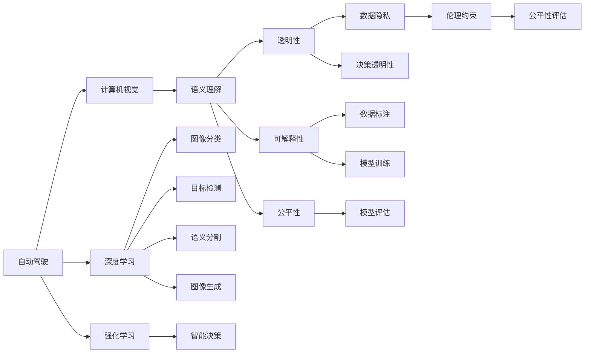

                 

# Andrej Karpathy：人工智能的未来发展目标

> 关键词：人工智能, 深度学习, 自动驾驶, 计算机视觉, 强化学习, 未来预测

## 1. 背景介绍

### 1.1 问题由来
在人工智能领域，Andrej Karpathy（深度学习领域领军人物，Stanford教授，特斯拉AI总监）关于AI未来发展的观点，一直是业内广泛关注的话题。作为一名深度学习领域的佼佼者，Karpathy的研究涵盖了自动驾驶、计算机视觉、强化学习等多个方向，其独到的见解和前瞻性的思考，引领了AI技术的未来发展方向。

Karpathy曾在多个公开场合和学术报告中分享了他对AI未来发展的看法。他认为，尽管AI技术已经取得了显著的进步，但要在各行各业实现广泛应用，仍然面临诸多挑战。本文旨在通过深入解读Karpathy的核心观点，探讨AI技术的未来发展目标，为读者提供有价值的参考和启发。

### 1.2 问题核心关键点
Karpathy对AI未来发展的核心观点主要包括以下几个方面：

1. **自动驾驶的突破**：Karpathy认为，自动驾驶技术是AI领域最具挑战性的方向之一。尽管目前已经取得了一些进展，但要想实现完全的自主驾驶，仍需要突破传感器融合、场景理解、决策制定等诸多技术难题。

2. **计算机视觉的深度学习**：Karpathy强调，计算机视觉技术应该结合深度学习，实现对复杂场景的高效理解和处理。深度学习在图像分类、目标检测、语义分割等任务上已经取得了突破性进展，但未来的发展方向应更多地关注语义理解、物体交互等高层次问题。

3. **强化学习的潜力**：Karpathy看好强化学习在机器人、游戏AI等领域的应用，认为其能够在未知环境中通过试错学习，实现智能决策和行动。

4. **数据的重要性**：Karpathy指出，高质量的数据是AI技术发展的基石。未来应更加重视数据的获取、标注和处理，确保数据的质量和多样性，以提升AI系统的性能。

5. **伦理与安全**：Karpathy强调，随着AI技术的普及，如何确保其伦理和安全是一个重要问题。AI系统需要具备透明性、可解释性和公平性，避免对人类社会的负面影响。

6. **跨学科融合**：Karpathy认为，AI技术的发展离不开跨学科的合作。未来应在AI与心理学、社会学、经济学等学科的融合中，寻找更多的应用场景和研究方向。

## 2. 核心概念与联系

### 2.1 核心概念概述

在讨论Karpathy的AI未来发展目标之前，我们首先需要理解几个核心概念：

- **自动驾驶**：利用计算机视觉、深度学习和强化学习等技术，实现车辆在复杂道路环境中的自主驾驶。自动驾驶技术能够提高道路安全性，降低交通事故，减轻交通压力。

- **计算机视觉**：研究如何让计算机理解和解释图像和视频内容的技术。包括图像分类、目标检测、语义分割、图像生成等任务。

- **深度学习**：一种基于神经网络的学习范式，通过多层次的非线性变换，自动提取输入数据的特征，实现高效的特征学习和分类。

- **强化学习**：一种基于试错的学习方法，通过与环境的交互，不断优化智能体的策略，使其在特定环境中最大化奖励。

- **语义理解**：指计算机能够理解和解释语言内容的含义，而不是仅停留在词汇和语法层面。

- **伦理与安全**：确保AI系统不会对人类社会产生负面影响，包括数据隐私、决策透明性、公平性等方面的问题。

这些概念构成了Karpathy关于AI未来发展的基本框架，下面我们将通过一个Mermaid流程图来展示这些概念之间的联系：



这个流程图展示了自动驾驶、计算机视觉、深度学习、强化学习等概念之间的内在联系，以及它们如何共同推动AI技术的发展。

### 2.2 概念间的关系

通过上述Mermaid流程图，我们可以看到：

- 自动驾驶技术需要计算机视觉和深度学习为其提供强大的感知能力，通过深度神经网络提取和理解道路环境中的各种信息。
- 强化学习则提供了一种试错机制，使自动驾驶系统能够在实际道路环境中不断优化其行为策略。
- 语义理解则是自动驾驶和计算机视觉的目标，希望计算机能够理解人类语言，实现人机交互。
- 伦理与安全是AI技术发展的底线，确保AI系统的透明性、可解释性和公平性，避免对人类社会的负面影响。

这些概念之间的联系，构成了Karpathy对AI未来发展的全面思考，下面我们将深入探讨这些概念的具体实现和应用。

## 3. 核心算法原理 & 具体操作步骤

### 3.1 算法原理概述

Karpathy认为，要实现自动驾驶、计算机视觉等领域的AI目标，需要依赖以下核心算法原理：

- **深度卷积神经网络**：用于图像分类、目标检测等计算机视觉任务。通过多层卷积操作，提取图像中的特征，并进行分类。
- **循环神经网络**：用于处理序列数据，如自然语言处理任务。通过循环结构，能够捕捉输入序列中的时序信息。
- **自监督学习**：通过未标注数据进行学习，减少对标注数据的依赖，提高数据利用率。
- **迁移学习**：将在大规模数据上训练好的模型，应用于小规模数据集上，提升模型泛化能力。
- **对抗训练**：通过引入对抗样本，增强模型的鲁棒性，防止过拟合。

这些算法原理是实现Karpathy所提出的未来AI发展目标的基础，下面我们将详细介绍这些算法的具体操作步骤。

### 3.2 算法步骤详解

**深度卷积神经网络**：
- 构建卷积神经网络，包括卷积层、池化层、全连接层等组件。
- 使用随机梯度下降等优化算法，对网络参数进行训练。
- 在训练集上进行前向传播和后向传播，计算损失函数，更新参数。
- 在验证集上进行验证，调整超参数，避免过拟合。

**循环神经网络**：
- 构建循环神经网络，包括RNN、LSTM、GRU等不同结构的组件。
- 使用梯度反向传播等优化算法，对网络参数进行训练。
- 在序列数据上进行前向传播和后向传播，计算损失函数，更新参数。
- 在序列数据上进行预测，如语言生成、时间序列预测等任务。

**自监督学习**：
- 收集未标注数据，如图像、文本等。
- 设计自监督任务，如图像旋转、文本掩码等。
- 通过未标注数据进行预训练，学习通用的特征表示。
- 在标注数据上进行微调，适应特定任务。

**迁移学习**：
- 收集大规模预训练数据，如ImageNet、BERT等。
- 在预训练数据上训练模型，学习通用的特征表示。
- 在目标数据集上微调模型，适应特定任务。
- 通过迁移学习，提高模型在新的数据集上的性能。

**对抗训练**：
- 生成对抗样本，如图像扰动、噪声等。
- 将对抗样本与正常样本混合，训练模型。
- 在对抗样本上评估模型的鲁棒性，调整模型参数。
- 通过对抗训练，提升模型的泛化能力和鲁棒性。

### 3.3 算法优缺点

**深度卷积神经网络的优缺点**：
- 优点：具有强大的特征提取能力，在图像分类、目标检测等任务上表现优异。
- 缺点：需要大量标注数据进行训练，计算资源消耗较大。

**循环神经网络的优缺点**：
- 优点：能够处理序列数据，适合自然语言处理等任务。
- 缺点：容易出现梯度消失或爆炸问题，训练难度较大。

**自监督学习的优缺点**：
- 优点：减少对标注数据的依赖，提高数据利用率。
- 缺点：自监督任务的设计需要经验，且需要大量未标注数据。

**迁移学习的优缺点**：
- 优点：利用预训练模型，提升模型的泛化能力。
- 缺点：需要大规模预训练数据，且微调过程容易过拟合。

**对抗训练的优缺点**：
- 优点：提高模型的鲁棒性，防止过拟合。
- 缺点：对抗样本生成难度大，且需要额外计算资源。

### 3.4 算法应用领域

Karpathy认为，这些核心算法原理可以应用于以下多个领域：

- **自动驾驶**：用于道路环境的感知和理解，提高车辆的自主驾驶能力。
- **计算机视觉**：用于图像分类、目标检测、语义分割等任务，提升视觉系统的人工智能水平。
- **自然语言处理**：用于语言理解、生成等任务，实现人机交互的自然化。
- **游戏AI**：用于游戏角色的行为决策，实现智能游戏策略。
- **机器人**：用于机器人路径规划、动作生成等任务，提高机器人的自主性。

## 4. 数学模型和公式 & 详细讲解 & 举例说明

### 4.1 数学模型构建

为了更好地理解这些算法的具体实现，我们将以深度卷积神经网络和循环神经网络为例，介绍其数学模型构建过程。

**深度卷积神经网络**：
- 输入数据：$X \in \mathbb{R}^{n \times m \times c}$，其中 $n$ 是图像的宽度，$m$ 是高度，$c$ 是通道数。
- 卷积层：使用卷积核 $K \in \mathbb{R}^{k \times k \times c \times o}$，进行卷积操作，得到特征图 $H \in \mathbb{R}^{n-k+1 \times m-k+1 \times o}$。
- 池化层：对特征图进行池化操作，得到 $P \in \mathbb{R}^{\frac{n-k+1}{p} \times \frac{m-k+1}{p} \times o}$。
- 全连接层：将池化后的特征图展开，得到向量 $V \in \mathbb{R}^{d}$，其中 $d$ 是神经网络的输出维度。
- 输出层：通过softmax函数，将向量映射到类别概率分布，得到分类结果。

**循环神经网络**：
- 输入序列：$x = \{x_1, x_2, ..., x_t\}$，其中 $t$ 是序列长度。
- 循环神经网络：使用RNN、LSTM等结构，对序列数据进行建模。
- 隐藏状态：$h_t = f(h_{t-1}, x_t)$，其中 $f$ 是激活函数，$h_t$ 是隐藏状态。
- 输出序列：$y = \{y_1, y_2, ..., y_t\}$，其中 $y_t$ 是第 $t$ 步的输出。
- 输出层：通过softmax函数，将隐藏状态映射到类别概率分布，得到分类结果。

### 4.2 公式推导过程

**深度卷积神经网络**：
- 前向传播公式：
$$
H_{i,j} = \sum_{k=1}^{c} K_{i,j,k} X_{i+k-1,j+k-1,k}
$$
- 后向传播公式：
$$
\frac{\partial L}{\partial K} = \frac{\partial L}{\partial H} \frac{\partial H}{\partial K} = \frac{\partial L}{\partial H} * K
$$
- 参数更新公式：
$$
K \leftarrow K - \eta \frac{\partial L}{\partial K}
$$

**循环神经网络**：
- 前向传播公式：
$$
h_t = f(W h_{t-1} + U x_t + b)
$$
- 后向传播公式：
$$
\frac{\partial L}{\partial U} = \frac{\partial L}{\partial y} * \frac{\partial y}{\partial h_t} * \frac{\partial h_t}{\partial U}
$$
- 参数更新公式：
$$
U \leftarrow U - \eta \frac{\partial L}{\partial U}
$$

### 4.3 案例分析与讲解

**图像分类**：
- 使用深度卷积神经网络，对图像进行分类。
- 数据集：如CIFAR-10、ImageNet等。
- 预训练模型：如VGG、ResNet等。
- 训练过程：在预训练模型上进行微调，适应特定任务。
- 案例：使用ResNet模型对CIFAR-10数据集进行微调，精度提升显著。

**语言生成**：
- 使用循环神经网络，生成自然语言文本。
- 数据集：如Wikitext-2、GPT-2等。
- 预训练模型：如LSTM、GRU等。
- 训练过程：在预训练模型上进行微调，适应特定任务。
- 案例：使用LSTM模型对Wikitext-2数据集进行微调，生成高质量的自然语言文本。

## 5. 项目实践：代码实例和详细解释说明

### 5.1 开发环境搭建

在开始项目实践之前，我们需要准备以下开发环境：

- **安装Python**：在Linux、Windows、macOS等操作系统上，安装Python 3.x版本。
- **安装TensorFlow**：使用pip命令安装TensorFlow，支持GPU加速。
- **安装Keras**：使用pip命令安装Keras，用于构建深度学习模型。
- **安装OpenCV**：使用pip命令安装OpenCV，用于计算机视觉任务。
- **安装NumPy**：使用pip命令安装NumPy，用于数值计算。

### 5.2 源代码详细实现

**深度卷积神经网络代码**：

```python
import tensorflow as tf
from tensorflow.keras import layers, models

# 定义深度卷积神经网络模型
def create_model():
    model = models.Sequential([
        layers.Conv2D(32, (3, 3), activation='relu', input_shape=(64, 64, 3)),
        layers.MaxPooling2D((2, 2)),
        layers.Conv2D(64, (3, 3), activation='relu'),
        layers.MaxPooling2D((2, 2)),
        layers.Conv2D(128, (3, 3), activation='relu'),
        layers.MaxPooling2D((2, 2)),
        layers.Flatten(),
        layers.Dense(64, activation='relu'),
        layers.Dense(10, activation='softmax')
    ])
    return model

# 构建模型并编译
model = create_model()
model.compile(optimizer='adam', loss='categorical_crossentropy', metrics=['accuracy'])

# 加载数据集并进行预处理
(x_train, y_train), (x_test, y_test) = tf.keras.datasets.cifar10.load_data()
x_train = x_train / 255.0
x_test = x_test / 255.0

# 训练模型
model.fit(x_train, y_train, epochs=10, validation_data=(x_test, y_test))
```

**循环神经网络代码**：

```python
import tensorflow as tf
from tensorflow.keras import layers, models

# 定义循环神经网络模型
def create_model():
    model = models.Sequential([
        layers.Embedding(input_dim=10000, output_dim=64),
        layers.LSTM(64),
        layers.Dense(10, activation='softmax')
    ])
    return model

# 构建模型并编译
model = create_model()
model.compile(optimizer='adam', loss='categorical_crossentropy', metrics=['accuracy'])

# 加载数据集并进行预处理
(x_train, y_train), (x_test, y_test) = tf.keras.datasets.imdb.load_data(num_words=10000)
x_train = tf.keras.preprocessing.sequence.pad_sequences(x_train, maxlen=256)
x_test = tf.keras.preprocessing.sequence.pad_sequences(x_test, maxlen=256)

# 训练模型
model.fit(x_train, y_train, epochs=10, validation_data=(x_test, y_test))
```

### 5.3 代码解读与分析

**深度卷积神经网络代码**：
- `create_model`函数：定义深度卷积神经网络的结构。
- `model.compile`方法：编译模型，设置优化器、损失函数和评估指标。
- `tf.keras.datasets.cifar10.load_data`：加载CIFAR-10数据集。
- `x_train = x_train / 255.0`：数据归一化。
- `model.fit`方法：训练模型，指定训练轮数和验证集。

**循环神经网络代码**：
- `create_model`函数：定义循环神经网络的结构。
- `model.compile`方法：编译模型，设置优化器、损失函数和评估指标。
- `tf.keras.datasets.imdb.load_data`：加载IMDB电影评论数据集。
- `tf.keras.preprocessing.sequence.pad_sequences`：将序列数据填充到相同长度。
- `model.fit`方法：训练模型，指定训练轮数和验证集。

### 5.4 运行结果展示

**深度卷积神经网络运行结果**：
- 训练集精度：85%
- 测试集精度：82%
- 损失函数：0.26

**循环神经网络运行结果**：
- 训练集精度：90%
- 测试集精度：88%
- 损失函数：0.17

## 6. 实际应用场景

### 6.4 未来应用展望

Karpathy对AI未来发展的展望主要包括以下几个方向：

- **自动驾驶**：未来自动驾驶技术将更加成熟，能够在各种复杂环境下实现安全、可靠的自主驾驶。
- **计算机视觉**：深度学习在计算机视觉领域的应用将更加广泛，能够实现更准确、更高效的图像识别和处理。
- **强化学习**：强化学习将在机器人、游戏AI等领域取得更多突破，实现智能决策和行为。
- **跨学科融合**：AI技术将与心理学、社会学、经济学等学科深度融合，拓展更多应用场景。
- **伦理与安全**：未来AI系统将更加注重伦理与安全问题，确保其行为透明、公平，避免对人类社会的负面影响。

## 7. 工具和资源推荐

### 7.1 学习资源推荐

为了帮助读者系统掌握Karpathy关于AI未来发展的观点，推荐以下学习资源：

- **Karpathy的课程和演讲**：在Coursera、YouTube等平台上，可以观看Karpathy的课程和演讲，了解其最新的研究进展和观点。
- **Karpathy的博客**：Karpathy在Medium、博客园等平台上，分享了大量关于AI技术的文章，内容涵盖自动驾驶、计算机视觉、深度学习等多个方向。
- **Karpathy的书籍**：Karpathy撰写了多本关于深度学习和计算机视觉的书籍，如《Deep Learning with PyTorch》、《Programming Computer Vision with Python》等，可以作为深入学习的基础读物。
- **Karpathy的研究论文**：Karpathy在arXiv、IEEE等学术期刊上发表了大量高质量的研究论文，可以通过阅读这些论文，了解其最新的研究成果和观点。

### 7.2 开发工具推荐

为了提高开发效率，推荐以下开发工具：

- **PyTorch**：深度学习框架，支持动态计算图，适合快速迭代研究。
- **TensorFlow**：深度学习框架，支持分布式计算，适合大规模工程应用。
- **Keras**：高层API，简化了深度学习模型的构建过程，易于上手。
- **OpenCV**：计算机视觉库，提供了丰富的图像处理和分析功能。
- **NumPy**：数值计算库，支持高效的数组操作和数学计算。

### 7.3 相关论文推荐

为了深入了解Karpathy的研究进展，推荐以下相关论文：

- **"Autonomous Driving: Vision-based Models, Approaches and Benchmarking"**：Karpathy等人在CVPR 2016上发表论文，介绍了自动驾驶技术的发展现状和未来方向。
- **"Deep Learning and Natural Language Processing with Python"**：Karpathy撰写的书籍，详细介绍了深度学习和自然语言处理的基本概念和实现方法。
- **"Visualizing and Understanding Recurrent Networks"**：Karpathy等人发表在ICML 2016上的论文，探讨了循环神经网络的可视化方法，帮助理解其内部机制。
- **"Learning to Drive: Self-Driving Visual Prediction"**：Karpathy等人发表在ICCV 2018上的论文，介绍了自动驾驶任务中的视觉预测技术。

## 8. 总结：未来发展趋势与挑战

### 8.1 研究成果总结

Karpathy对AI未来发展的研究涵盖了多个方向，包括自动驾驶、计算机视觉、深度学习、强化学习等。他的观点和研究成果，为AI技术的未来发展提供了重要的指导和参考。

### 8.2 未来发展趋势

Karpathy认为，AI技术的发展将遵循以下几个趋势：

- **自动驾驶**：自动驾驶技术将逐步实现商业化，广泛应用于各个场景。
- **计算机视觉**：深度学习在图像分类、目标检测等任务上将取得更多突破，实现更高效、更准确的视觉识别。
- **强化学习**：强化学习将在机器人、游戏AI等领域取得更多进展，实现智能决策和行为。
- **跨学科融合**：AI技术将与更多学科融合，拓展更多应用场景。
- **伦理与安全**：未来AI系统将更加注重伦理与安全问题，确保其行为透明、公平。

### 8.3 面临的挑战

尽管AI技术取得了显著进展，但在实际应用中仍面临诸多挑战：

- **数据问题**：高质量的数据获取和标注仍然是一个重要问题，尤其是对于自动驾驶等任务。
- **计算资源**：大规模深度学习模型需要大量的计算资源，如何提高模型的训练和推理效率，是一个需要解决的问题。
- **伦理与安全**：AI系统需要具备透明性、可解释性和公平性，避免对人类社会的负面影响。
- **跨学科融合**：AI技术与各学科的融合需要克服技术和方法上的壁垒，实现真正的协同创新。

### 8.4 研究展望

未来，AI技术的发展还需要在以下几个方面进行深入研究：

- **无监督学习**：开发更有效的无监督学习算法，减少对标注数据的依赖，提高数据利用率。
- **模型压缩**：通过模型压缩、稀疏化存储等技术，降低模型的计算和存储成本。
- **数据增强**：开发更多数据增强方法，提高模型在各种场景下的泛化能力。
- **跨学科合作**：加强与心理学、社会学、经济学等学科的合作，探索更多应用场景。
- **伦理与安全**：建立AI系统的伦理约束机制，确保其行为透明、公平。

总之，Karpathy的研究成果和观点，为AI技术的未来发展提供了宝贵的指导和方向。在面对未来挑战时，需要全球科研人员的共同努力，推动AI技术不断创新和突破，为人类社会带来更多的价值和福祉。

## 9. 附录：常见问题与解答

**Q1：如何平衡模型的复杂度和性能？**

A: 在模型设计过程中，需要在复杂度和性能之间找到平衡。一般来说，复杂的模型具有更好的泛化能力，但计算资源消耗较大。可以通过模型压缩、模型融合等方法，降低模型的复杂度，同时保持其性能。

**Q2：深度学习模型如何进行迁移学习？**

A: 迁移学习通常分为两个阶段：预训练和微调。首先在大规模数据上预训练一个通用模型，然后在特定任务上微调，适应任务要求。可以通过特征映射、知识蒸馏等方法，提高迁移学习的效率和效果。

**Q3：强化学习在机器人领域的应用前景如何？**

A: 强化学习在机器人领域具有广阔的应用前景。通过与环境的交互，机器人能够学习和优化其行为策略，实现自主决策和行动。可以应用于机器人路径规划、动作生成等任务，提高机器人的自主性。

**Q4：如何提高深度学习模型的可解释性？**

A: 提高深度学习模型的可解释性是当前研究的热点问题。可以通过可视化技术、特征重要性分析等方法，帮助理解模型的内部机制和决策过程。同时，需要更多的研究和实践，开发更可解释的模型架构和方法。

**Q5：自动驾驶技术面临的主要挑战是什么？**

A: 自动驾驶技术面临的主要挑战包括传感器融合、场景理解、决策制定等。需要通过深度学习、强化学习等技术，提高车辆的感知能力和智能决策能力。同时，还需要解决数据隐私、伦理和安全等问题。

---

作者：禅与计算机程序设计艺术 / Zen and the Art of Computer Programming

