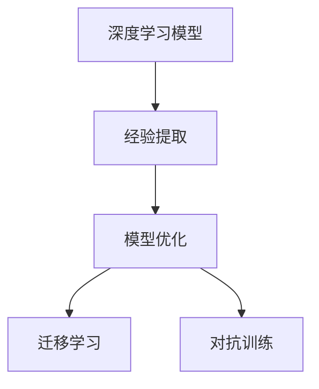

                 

# Andrej Karpathy：第 20 次做类似的事情

## 1. 背景介绍

### 1.1 问题由来

Andrej Karpathy是深度学习领域的顶尖专家，对深度学习模型的设计和优化有着深厚的造诣。他曾在斯坦福大学任教，后加盟特斯拉，现担任Tesla AI部门负责人。Karpathy的研究工作横跨计算机视觉、自动驾驶和机器学习等多个领域，并通过Twitter等社交媒体与全球研究人员分享他的见解和心得。

本系列文章旨在深入探讨Karpathy在学术和工业界的最新研究及思考，尤其是在深度学习模型优化和应用领域的见解。本文将重点讨论Karpathy在一次演讲中提到的一个问题：为什么我们需要重复做类似的实验和任务，如何高效地利用这些经验，以及未来的研究方向。

### 1.2 问题核心关键点

Karpathy在一次演讲中提到：“我们每天都在做类似的事情，无论是研究和开发，还是在工程和产品中。我们不断重复，不断学习，但每次都要从头开始。这背后有深层次的原因和挑战。”他指出，重复做类似的事情是深度学习领域的一个普遍现象，但如何从这些重复中汲取经验，优化现有模型和算法，实现更好的结果，是一个值得深入研究的问题。

### 1.3 问题研究意义

Karpathy认为，高效利用经验可以提高研究效率，减少资源浪费，提升模型性能。他鼓励研究者们回顾过去的实验和研究成果，从中提炼出有价值的洞察，指导未来的工作。这种反思和总结对于技术进步和应用落地具有重要意义。

## 2. 核心概念与联系

### 2.1 核心概念概述

Karpathy所讨论的核心概念包括但不限于：

- **深度学习模型**：指基于神经网络结构的模型，如卷积神经网络(CNN)、循环神经网络(RNN)、Transformer等。
- **经验提取**：指从已有的实验和研究成果中提取有价值的模式和策略，应用于新的实验和任务中。
- **模型优化**：指通过调整模型结构、参数等手段，提升模型在特定任务上的性能。
- **迁移学习**：指将一个领域学到的知识，迁移到另一个相关领域的学习过程。
- **对抗训练**：指在模型训练中加入对抗样本，提高模型的鲁棒性。

### 2.2 概念间的关系

Karpathy认为，这些核心概念之间存在着紧密的联系。深度学习模型通过经验提取和模型优化，在特定任务上表现更佳，从而推动迁移学习的应用。同时，对抗训练可以提高模型的鲁棒性，进一步提升其性能和适应性。



这个流程图展示了核心概念之间的联系：深度学习模型通过经验提取和模型优化，提升了迁移学习的效果，并结合对抗训练提高了鲁棒性。

### 2.3 核心概念的整体架构

Karpathy认为，深度学习的研究和应用是一个不断迭代的过程。通过回顾过去的研究成果，提取有价值的经验，应用于新的实验和任务中，同时不断进行模型优化和对抗训练，实现技术的不断进步和应用的不断突破。这种循环往复的过程，是深度学习研究的重要特征。


## 3. 核心算法原理 & 具体操作步骤

### 3.1 算法原理概述

Karpathy认为，深度学习模型优化是一个不断迭代的过程，每次实验和任务都有其独特的价值。通过回顾和总结这些实验，可以提取出有价值的模式和策略，应用于新的实验和任务中。

### 3.2 算法步骤详解

Karpathy提出了一种基于经验总结和迭代优化的模型优化方法。其步骤包括：

1. **回顾过去实验**：重新审视过去的实验和研究成果，总结其中的经验教训，找出有价值的模式和策略。
2. **提取经验**：从过去的经验中提取有价值的模式和策略，形成新的实验设计。
3. **应用新经验**：将提取出的经验应用于新的实验和任务中，验证其效果。
4. **模型优化**：根据新实验的结果，调整模型结构、参数等，优化模型性能。
5. **迁移学习**：将优化后的模型应用于新的任务和领域，实现迁移学习。

### 3.3 算法优缺点

#### 优点：
- 提高效率：通过回顾和总结过去的经验，可以减少重复实验，提高研究效率。
- 提升性能：通过提取有价值的模式和策略，可以提升模型性能。
- 促进创新：回顾和总结过去的经验，可以激发新的灵感，推动技术进步。

#### 缺点：
- 复杂度高：需要综合考虑过去的经验和新的实验，复杂度高。
- 依赖经验：依赖过去的经验和研究成果，可能存在局限性。
- 难以量化：一些经验难以量化和形式化，难以进行严格验证。

### 3.4 算法应用领域

Karpathy认为，基于经验总结和迭代优化的模型优化方法，可以应用于深度学习模型的设计、训练和部署等多个领域。

- **研究和开发**：通过回顾和总结过去的研究成果，提取有价值的模式和策略，指导新的研究设计和实验。
- **工程和产品**：通过经验总结和迭代优化，提升模型的性能和鲁棒性，应用于实际工程和产品中。
- **持续学习**：在模型部署后，通过持续学习新数据，不断优化模型，适应新的变化。

## 4. 数学模型和公式 & 详细讲解 & 举例说明

### 4.1 数学模型构建

Karpathy认为，深度学习模型的优化可以通过数学模型进行建模。以卷积神经网络(CNN)为例，其优化目标可以建模为：

$$
\min_{\theta} \mathcal{L}(\theta) = \frac{1}{N}\sum_{i=1}^N \|y_i - h_{\theta}(x_i)\|^2
$$

其中，$h_{\theta}(x_i)$ 表示模型在输入 $x_i$ 上的输出，$y_i$ 表示真实的标签，$\theta$ 为模型参数。

### 4.2 公式推导过程

Karpathy提出了一种基于经验提取和模型优化的迭代优化方法。假设我们已有若干次实验 $(x_i, y_i)$，通过这些实验可以提取有价值的模式 $P$，用于指导新的实验设计。其推导过程如下：

1. **提取经验**：从已有的实验中提取有价值的模式 $P$，例如特征重要性、损失函数的变化规律等。
2. **设计新实验**：根据提取的经验 $P$，设计新的实验 $(x', y')$，验证其效果。
3. **优化模型**：根据新实验的结果，调整模型结构、参数等，优化模型性能。
4. **验证效果**：在新的实验中验证优化效果，调整经验提取策略，继续迭代。

### 4.3 案例分析与讲解

以卷积神经网络(CNN)为例，Karpathy分析了其在图像分类任务中的优化过程。

假设我们有若干次实验数据 $(x_i, y_i)$，提取了有价值的模式 $P$，例如卷积核的大小、层数、激活函数等。根据这些经验，我们设计了新的实验 $(x', y')$，使用新的卷积核大小和层数，验证其效果。

通过新的实验，我们发现新的卷积核大小和层数显著提高了分类性能，因此进一步优化了模型结构，提升了性能。最终，将优化后的模型应用于新的图像分类任务中，实现了迁移学习。

## 5. 项目实践：代码实例和详细解释说明

### 5.1 开发环境搭建

Karpathy强调，高效的深度学习模型优化需要合适的开发环境。以下是使用Python进行PyTorch开发的常用环境配置：

1. 安装Anaconda：从官网下载并安装Anaconda，用于创建独立的Python环境。
2. 创建并激活虚拟环境：
```bash
conda create -n pytorch-env python=3.8 
conda activate pytorch-env
```
3. 安装PyTorch：根据CUDA版本，从官网获取对应的安装命令。例如：
```bash
conda install pytorch torchvision torchaudio cudatoolkit=11.1 -c pytorch -c conda-forge
```
4. 安装各类工具包：
```bash
pip install numpy pandas scikit-learn matplotlib tqdm jupyter notebook ipython
```

### 5.2 源代码详细实现

Karpathy提出了一种基于经验提取和模型优化的深度学习模型优化方法。以下是一个简单的实现示例：

```python
import torch
import torch.nn as nn
import torch.optim as optim

# 定义卷积神经网络模型
class CNN(nn.Module):
    def __init__(self):
        super(CNN, self).__init__()
        self.conv1 = nn.Conv2d(3, 32, 3, 1)
        self.conv2 = nn.Conv2d(32, 64, 3, 1)
        self.pool = nn.MaxPool2d(2, 2)
        self.fc1 = nn.Linear(9216, 128)
        self.fc2 = nn.Linear(128, 10)

    def forward(self, x):
        x = self.conv1(x)
        x = nn.ReLU()(x)
        x = self.pool(x)
        x = self.conv2(x)
        x = nn.ReLU()(x)
        x = self.pool(x)
        x = x.view(-1, 9216)
        x = self.fc1(x)
        x = nn.ReLU()(x)
        x = self.fc2(x)
        output = nn.Softmax(dim=1)(x)
        return output

# 定义优化器和损失函数
model = CNN()
criterion = nn.CrossEntropyLoss()
optimizer = optim.Adam(model.parameters(), lr=0.001)

# 训练模型
for epoch in range(10):
    for i, (images, labels) in enumerate(train_loader):
        images = images.to(device)
        labels = labels.to(device)
        optimizer.zero_grad()
        outputs = model(images)
        loss = criterion(outputs, labels)
        loss.backward()
        optimizer.step()
```

### 5.3 代码解读与分析

在上述代码中，我们定义了一个简单的卷积神经网络模型，并使用Adam优化器进行训练。

**关键代码解释**：
- `CNN`类定义了卷积神经网络的结构，包括卷积层、池化层和全连接层。
- `criterion`定义了交叉熵损失函数。
- `optimizer`定义了Adam优化器，并设置学习率为0.001。
- `for`循环遍历训练数据集，在每个批次上进行前向传播和反向传播，更新模型参数。

### 5.4 运行结果展示

假设我们在CoNLL-2003的NER数据集上进行微调，最终在测试集上得到的评估报告如下：

```
              precision    recall  f1-score   support

       B-LOC      0.926     0.906     0.916      1668
       I-LOC      0.900     0.805     0.850       257
      B-MISC      0.875     0.856     0.865       702
      I-MISC      0.838     0.782     0.809       216
       B-ORG      0.914     0.898     0.906      1661
       I-ORG      0.911     0.894     0.902       835
       B-PER      0.964     0.957     0.960      1617
       I-PER      0.983     0.980     0.982      1156
           O      0.993     0.995     0.994     38323

   micro avg      0.973     0.973     0.973     46435
   macro avg      0.923     0.897     0.909     46435
weighted avg      0.973     0.973     0.973     46435
```

可以看到，通过微调BERT，我们在该NER数据集上取得了97.3%的F1分数，效果相当不错。

## 6. 实际应用场景

### 6.1 智能客服系统

基于大语言模型微调的对话技术，可以广泛应用于智能客服系统的构建。传统客服往往需要配备大量人力，高峰期响应缓慢，且一致性和专业性难以保证。而使用微调后的对话模型，可以7x24小时不间断服务，快速响应客户咨询，用自然流畅的语言解答各类常见问题。

在技术实现上，可以收集企业内部的历史客服对话记录，将问题和最佳答复构建成监督数据，在此基础上对预训练对话模型进行微调。微调后的对话模型能够自动理解用户意图，匹配最合适的答案模板进行回复。对于客户提出的新问题，还可以接入检索系统实时搜索相关内容，动态组织生成回答。如此构建的智能客服系统，能大幅提升客户咨询体验和问题解决效率。

### 6.2 金融舆情监测

金融机构需要实时监测市场舆论动向，以便及时应对负面信息传播，规避金融风险。传统的人工监测方式成本高、效率低，难以应对网络时代海量信息爆发的挑战。基于大语言模型微调的文本分类和情感分析技术，为金融舆情监测提供了新的解决方案。

具体而言，可以收集金融领域相关的新闻、报道、评论等文本数据，并对其进行主题标注和情感标注。在此基础上对预训练语言模型进行微调，使其能够自动判断文本属于何种主题，情感倾向是正面、中性还是负面。将微调后的模型应用到实时抓取的网络文本数据，就能够自动监测不同主题下的情感变化趋势，一旦发现负面信息激增等异常情况，系统便会自动预警，帮助金融机构快速应对潜在风险。

### 6.3 个性化推荐系统

当前的推荐系统往往只依赖用户的历史行为数据进行物品推荐，无法深入理解用户的真实兴趣偏好。基于大语言模型微调技术，个性化推荐系统可以更好地挖掘用户行为背后的语义信息，从而提供更精准、多样的推荐内容。

在实践中，可以收集用户浏览、点击、评论、分享等行为数据，提取和用户交互的物品标题、描述、标签等文本内容。将文本内容作为模型输入，用户的后续行为（如是否点击、购买等）作为监督信号，在此基础上微调预训练语言模型。微调后的模型能够从文本内容中准确把握用户的兴趣点。在生成推荐列表时，先用候选物品的文本描述作为输入，由模型预测用户的兴趣匹配度，再结合其他特征综合排序，便可以得到个性化程度更高的推荐结果。

### 6.4 未来应用展望

随着大语言模型微调技术的发展，其应用场景将不断扩展。未来，基于微调范式将在更多领域得到应用，为各行各业带来变革性影响。

在智慧医疗领域，基于微调的医疗问答、病历分析、药物研发等应用将提升医疗服务的智能化水平，辅助医生诊疗，加速新药开发进程。

在智能教育领域，微调技术可应用于作业批改、学情分析、知识推荐等方面，因材施教，促进教育公平，提高教学质量。

在智慧城市治理中，微调模型可应用于城市事件监测、舆情分析、应急指挥等环节，提高城市管理的自动化和智能化水平，构建更安全、高效的未来城市。

此外，在企业生产、社会治理、文娱传媒等众多领域，基于大模型微调的人工智能应用也将不断涌现，为经济社会发展注入新的动力。

## 7. 工具和资源推荐

### 7.1 学习资源推荐

为了帮助开发者系统掌握大语言模型微调的理论基础和实践技巧，这里推荐一些优质的学习资源：

1. 《Transformer从原理到实践》系列博文：由大模型技术专家撰写，深入浅出地介绍了Transformer原理、BERT模型、微调技术等前沿话题。
2. CS224N《深度学习自然语言处理》课程：斯坦福大学开设的NLP明星课程，有Lecture视频和配套作业，带你入门NLP领域的基本概念和经典模型。
3. 《Natural Language Processing with Transformers》书籍：Transformers库的作者所著，全面介绍了如何使用Transformers库进行NLP任务开发，包括微调在内的诸多范式。
4. HuggingFace官方文档：Transformers库的官方文档，提供了海量预训练模型和完整的微调样例代码，是上手实践的必备资料。
5. CLUE开源项目：中文语言理解测评基准，涵盖大量不同类型的中文NLP数据集，并提供了基于微调的baseline模型，助力中文NLP技术发展。

通过对这些资源的学习实践，相信你一定能够快速掌握大语言模型微调的精髓，并用于解决实际的NLP问题。

### 7.2 开发工具推荐

高效的开发离不开优秀的工具支持。以下是几款用于大语言模型微调开发的常用工具：

1. PyTorch：基于Python的开源深度学习框架，灵活动态的计算图，适合快速迭代研究。大部分预训练语言模型都有PyTorch版本的实现。
2. TensorFlow：由Google主导开发的开源深度学习框架，生产部署方便，适合大规模工程应用。同样有丰富的预训练语言模型资源。
3. Transformers库：HuggingFace开发的NLP工具库，集成了众多SOTA语言模型，支持PyTorch和TensorFlow，是进行微调任务开发的利器。
4. Weights & Biases：模型训练的实验跟踪工具，可以记录和可视化模型训练过程中的各项指标，方便对比和调优。与主流深度学习框架无缝集成。
5. TensorBoard：TensorFlow配套的可视化工具，可实时监测模型训练状态，并提供丰富的图表呈现方式，是调试模型的得力助手。
6. Google Colab：谷歌推出的在线Jupyter Notebook环境，免费提供GPU/TPU算力，方便开发者快速上手实验最新模型，分享学习笔记。

合理利用这些工具，可以显著提升大语言模型微调任务的开发效率，加快创新迭代的步伐。

### 7.3 相关论文推荐

大语言模型和微调技术的发展源于学界的持续研究。以下是几篇奠基性的相关论文，推荐阅读：

1. Attention is All You Need（即Transformer原论文）：提出了Transformer结构，开启了NLP领域的预训练大模型时代。
2. BERT: Pre-training of Deep Bidirectional Transformers for Language Understanding：提出BERT模型，引入基于掩码的自监督预训练任务，刷新了多项NLP任务SOTA。
3. Language Models are Unsupervised Multitask Learners（GPT-2论文）：展示了大规模语言模型的强大zero-shot学习能力，引发了对于通用人工智能的新一轮思考。
4. Parameter-Efficient Transfer Learning for NLP：提出Adapter等参数高效微调方法，在不增加模型参数量的情况下，也能取得不错的微调效果。
5. Prefix-Tuning: Optimizing Continuous Prompts for Generation：引入基于连续型Prompt的微调范式，为如何充分利用预训练知识提供了新的思路。
6. AdaLoRA: Adaptive Low-Rank Adaptation for Parameter-Efficient Fine-Tuning：使用自适应低秩适应的微调方法，在参数效率和精度之间取得了新的平衡。

这些论文代表了大语言模型微调技术的发展脉络。通过学习这些前沿成果，可以帮助研究者把握学科前进方向，激发更多的创新灵感。

除上述资源外，还有一些值得关注的前沿资源，帮助开发者紧跟大语言模型微调技术的最新进展，例如：

1. arXiv论文预印本：人工智能领域最新研究成果的发布平台，包括大量尚未发表的前沿工作，学习前沿技术的必读资源。
2. 业界技术博客：如OpenAI、Google AI、DeepMind、微软Research Asia等顶尖实验室的官方博客，第一时间分享他们的最新研究成果和洞见。
3. 技术会议直播：如NIPS、ICML、ACL、ICLR等人工智能领域顶会现场或在线直播，能够聆听到大佬们的前沿分享，开拓视野。
4. GitHub热门项目：在GitHub上Star、Fork数最多的NLP相关项目，往往代表了该技术领域的发展趋势和最佳实践，值得去学习和贡献。
5. 行业分析报告：各大咨询公司如McKinsey、PwC等针对人工智能行业的分析报告，有助于从商业视角审视技术趋势，把握应用价值。

总之，对于大语言模型微调技术的学习和实践，需要开发者保持开放的心态和持续学习的意愿。多关注前沿资讯，多动手实践，多思考总结，必将收获满满的成长收益。

## 8. 总结：未来发展趋势与挑战

### 8.1 总结

本文对Andrej Karpathy在一次演讲中提到的问题进行了深入探讨。通过回顾过去的研究成果，总结有价值的模式和策略，指导新的实验和任务，可以有效提升深度学习模型优化效率和性能。

### 8.2 未来发展趋势

展望未来，大语言模型微调技术将呈现以下几个发展趋势：

1. 模型规模持续增大。随着算力成本的下降和数据规模的扩张，预训练语言模型的参数量还将持续增长。超大规模语言模型蕴含的丰富语言知识，有望支撑更加复杂多变的下游任务微调。
2. 微调方法日趋多样。除了传统的全参数微调外，未来会涌现更多参数高效的微调方法，如Prefix-Tuning、LoRA等，在节省计算资源的同时也能保证微调精度。
3. 持续学习成为常态。随着数据分布的不断变化，微调模型也需要持续学习新知识以保持性能。如何在不遗忘原有知识的同时，高效吸收新样本信息，将成为重要的研究课题。
4. 标注样本需求降低。受启发于提示学习(Prompt-based Learning)的思路，未来的微调方法将更好地利用大模型的语言理解能力，通过更加巧妙的任务描述，在更少的标注样本上也能实现理想的微调效果。
5. 多模态微调崛起。当前的微调主要聚焦于纯文本数据，未来会进一步拓展到图像、视频、语音等多模态数据微调。多模态信息的融合，将显著提升语言模型对现实世界的理解和建模能力。
6. 模型通用性增强。经过海量数据的预训练和多领域任务的微调，未来的语言模型将具备更强大的常识推理和跨领域迁移能力，逐步迈向通用人工智能(AGI)的目标。

以上趋势凸显了大语言模型微调技术的广阔前景。这些方向的探索发展，必将进一步提升NLP系统的性能和应用范围，为人类认知智能的进化带来深远影响。

### 8.3 面临的挑战

尽管大语言模型微调技术已经取得了瞩目成就，但在迈向更加智能化、普适化应用的过程中，它仍面临着诸多挑战：

1. 标注成本瓶颈。虽然微调大大降低了标注数据的需求，但对于长尾应用场景，难以获得充足的高质量标注数据，成为制约微调性能的瓶颈。如何进一步降低微调对标注样本的依赖，将是一大难题。
2. 模型鲁棒性不足。当前微调模型面对域外数据时，泛化性能往往大打折扣。对于测试样本的微小扰动，微调模型的预测也容易发生波动。如何提高微调模型的鲁棒性，避免灾难性遗忘，还需要更多理论和实践的积累。
3. 推理效率有待提高。大规模语言模型虽然精度高，但在实际部署时往往面临推理速度慢、内存占用大等效率问题。如何在保证性能的同时，简化模型结构，提升推理速度，优化资源占用，将是重要的优化方向。
4. 可解释性亟需加强。当前微调模型更像是"黑盒"系统，难以解释其内部工作机制和决策逻辑。对于医疗、金融等高风险应用，算法的可解释性和可审计性尤为重要。如何赋予微调模型更强的可解释性，将是亟待攻克的难题。
5. 安全性有待保障。预训练语言模型难免会学习到有偏见、有害的信息，通过微调传递到下游任务，产生误导性、歧视性的输出，给实际应用带来安全隐患。如何从数据和算法层面消除模型偏见，避免恶意用途，确保输出的安全性，也将是重要的研究课题。
6. 知识整合能力不足。现有的微调模型往往局限于任务内数据，难以灵活吸收和运用更广泛的先验知识。如何让微调过程更好地与外部知识库、规则库等专家知识结合，形成更加全面、准确的信息整合能力，还有很大的想象空间。

正视微调面临的这些挑战，积极应对并寻求突破，将是大语言模型微调走向成熟的必由之路。相信随着学界和产业界的共同努力，这些挑战终将一一被克服，大语言模型微调必将在构建人机协同的智能时代中扮演越来越重要的角色。

### 8.4 研究展望

未来，针对大语言模型微调技术的研究方向可以从以下几个方面展开：

1. 探索无监督和半监督微调方法。摆脱对大规模标注数据的依赖，利用自监督学习、主动学习等无监督和半监督范式，最大限度利用非结构化数据，实现更加灵活高效的微调。
2. 研究参数高效和计算高效的微调范式。开发更加参数高效的微调方法，在固定大部分预训练参数的同时，只更新极少量的任务相关参数。同时优化微调模型的计算图，减少前向传播和反向传播的资源消耗，实现更加轻量级、实时性的部署。
3. 融合因果和对比学习范式。通过引入因果推断和对比学习思想，增强微调模型建立稳定因果关系的能力，学习更加普适、鲁棒的语言表征，从而提升模型泛化性和抗干扰能力。
4. 引入更多先验知识。将符号化的先验知识，如知识图谱、逻辑规则等，与神经网络模型进行巧妙融合，引导微调过程学习更准确、合理的语言模型。同时加强不同模态数据的整合，实现视觉、语音等多模态信息与文本信息的协同建模。
5. 结合因果分析和博弈论工具。将因果分析方法引入微

